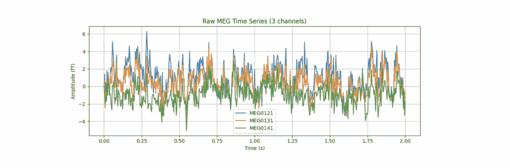
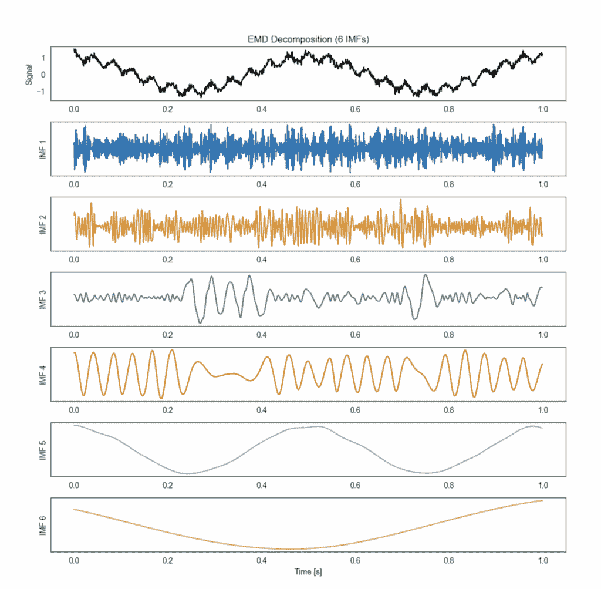
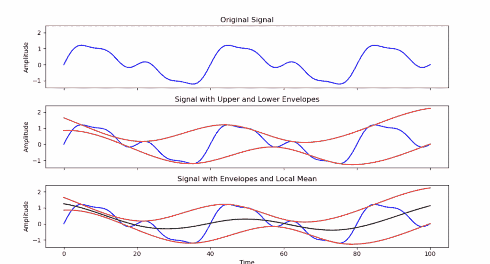
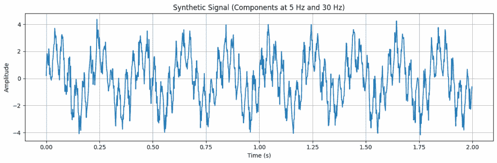
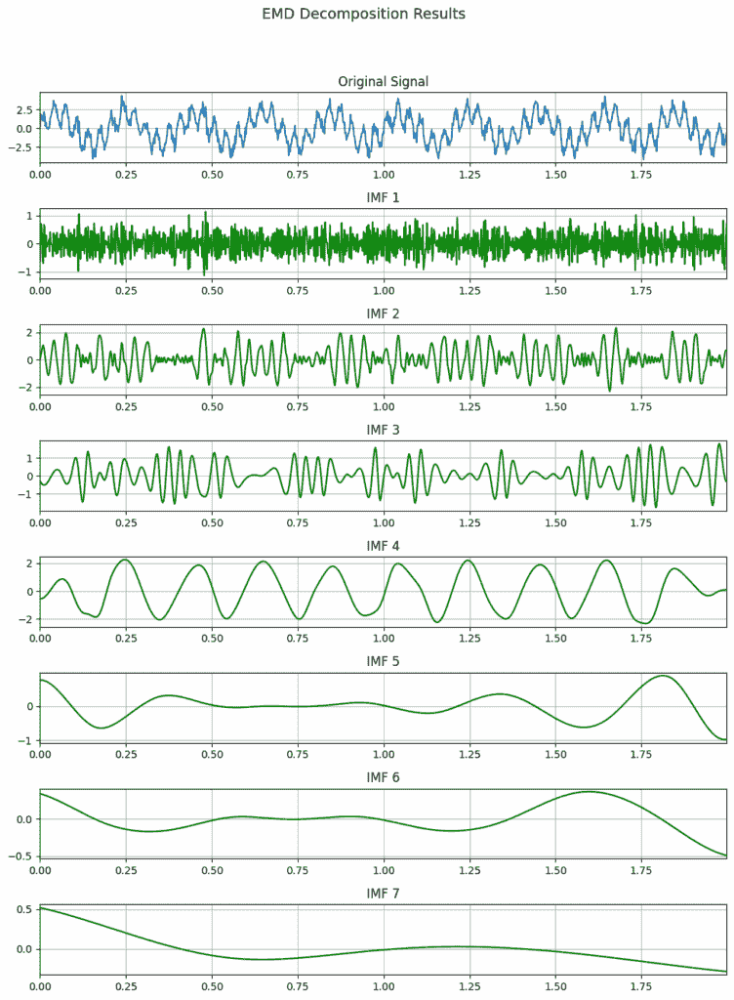

# 经验模态分解：分解复杂信号和时间序列的最直观方法

> 原文：[`towardsdatascience.com/preprocessing-signal-data-with-empirical-mode-decomposition/`](https://towardsdatascience.com/preprocessing-signal-data-with-empirical-mode-decomposition/)

<mdspan datatext="el1763695848038" class="mdspan-comment">作为数据科学家，你是否在努力分析你的时间序列？</mdspan>

你是否曾想过信号处理能否让你的生活变得更简单？

如果是的话——跟我来。这篇文章是为你准备的。 🙂

处理现实世界的时间序列可能会……很痛苦。金融曲线、ECG 轨迹、神经信号：它们通常看起来像没有结构的混沌尖峰。

处理现实世界的时间序列可能会……很痛苦。金融曲线、ECG 轨迹、神经信号：它们通常看起来像没有结构的混沌尖峰。

处理现实世界的时间序列可能会……很痛苦。金融曲线、ECG 轨迹、神经信号：它们通常看起来像没有结构的混沌尖峰。

在数据科学中，我们倾向于依赖经典的统计预处理：季节分解、去趋势、平滑、移动平均……这些技术很有用，但它们带有强烈的假设，这些假设在实践中很少有效。当这些假设失败时，你的机器学习模型可能会表现不佳或无法泛化。

今天，我们将探讨一组在数据科学培训中很少教授的方法，但它们可以完全改变你处理时间数据的方式。

* * *

## 在今天的菜单上 🍔

🍰 为什么传统方法在处理现实世界时间序列时遇到困难

🍛 信号处理工具如何帮助

🍔 经验模态分解（EMD）的工作原理及其失败之处

* * *

我上面提到的“经典”预处理技术是很好的起点，但正如我所说，它们依赖于关于信号应该如何行为的固定、明确的假设。

大多数假设信号是平稳的，这意味着其统计特性（均值、方差、频谱内容）随时间保持不变。

但在现实中，大多数真实信号是：

+   **非平稳**（它们的频率内容会变化）

+   **非线性**（它们不能由简单的加性成分解释）

+   **噪声**

+   **同时混合多个振荡**

## 那么……“信号”究竟是什么？

信号简单地指任何随时间变化的数量（我们在数据科学中通常称之为时间序列）。

一些例子：

+   ❤️ **心电图或脑电图** — 生物医学/脑信号

+   🌋 **地震活动** — 地球物理学

+   🖥️ **CPU 使用率** — 系统监控

+   💹 **股价、波动性、订单流** — 金融

+   🌦️ **温度或湿度** — 气候科学

+   🎧 **音频波形** — 语音与声音分析



**图 1**：磁脑电图（MEG）信号数据示例。（图片由作者提供）

信号无处不在。几乎所有信号都违反了经典时间序列模型的假设。

它们很少是“干净的”。我的意思是，一个单独的信号通常是由同时发生的几个过程混合而成的。

在一个信号中，你通常可以找到：

+   **缓慢的趋势**

+   **周期性振荡**

+   **短脉冲**

+   **随机噪声**

+   **你无法直接看到的隐藏节奏**

👉 现在想象一下，你能够直接从数据中分离出所有这些组件——无需假设平稳性，无需指定频带，也不需要将信号强制到预定义的基中。

这就是**数据驱动信号分解**的承诺。

这篇文章是关于自适应分解的 3 篇文章系列的第一篇：

1.  **EMD——经验模态分解** *(本期)*

1.  **VMD——变分模态分解** *(下期)*

1.  **MVMD——多元 VMD** *(下期)*

每种方法都比前一种方法更强大、更稳定——到系列的最后，你将了解信号处理方法如何提取干净、可解释的组件。

## 经验模态分解

经验模态分解是由 Huang 等人（1998 年）作为 Hilbert-Huang 变换的一部分引入的。

其目标是简单但强大：将一个信号分成一组干净的振荡组件，称为固有模态函数（IMFs）。

每个 IMF 对应于信号中存在的振荡，从最快的到最慢的趋势。

看看下面的图 2：

在顶部，你看到原始信号。

在下面，你看到几个 IMF——每个 IMF 捕捉数据中隐藏的不同“层”振荡。

> **IMF₁** 包含最快的变异性
> 
> **IMF₂** 捕捉一个稍微慢一点的节奏
> 
> …
> 
> 最后一个 IMF 加残差代表缓慢的趋势或基线

一些 IMF 将对你的人工智能任务有用；其他可能对应于噪声、伪影或不相关的振荡。



**图 2**：原始信号（顶部）和 5 个 IMF（底部），按从高频到低频的组件顺序排列。（图片由作者提供）

### EMD 背后的数学是什么？

任何信号 x(t)都通过 EMD 分解为：


其中：

+   **Ci(t)** 是**固有模态函数（IMFs**）

+   **IMF₁** 捕捉**最快的振荡**

+   **IMF₂** 捕捉一个**较慢的振荡**，依此类推…

+   **r(t)** 是**残差**——缓慢的趋势或基线

+   **将所有 IMFs 和残差相加可以精确地重建原始信号**。

IMF 是从数据中直接获得的**干净振荡**。

它必须满足两个简单的属性：

1.  **零交叉的数量≈极值点的数量**

    → 振荡表现良好。

1.  **上下包络的平均值大约为零**

    → 振荡在局部是对称的，没有长期信息。

这两条规则使 IMF 本质上是**数据驱动**和**自适应**的，与将信号强制到预定形状的傅里叶变换或小波不同。

### EMD 算法背后的直觉

EMD 算法的直觉性令人惊讶。这里是提取循环：

1.  从你的信号开始

1.  找到所有的局部极大值和极小值

1.  将它们插值以形成上包络和下包络

    （见图 3）

1.  计算两个包络的平均值

1.  从信号中减去这个平均值

**→** 这将给你一个“候选 IMF”。

6. 然后检查两个 IMF 条件：

+   它是否有相同数量的零交叉和极值？

+   它们的包络的平均值大约为零吗？

如果**是** → 你已经提取了**IMF₁**。

如果**没有** → 你重复这个过程（称为*筛选*）直到它满足标准。

7. 一旦你获得了 IMF₁（最快的振荡）：

+   **你从原始信号中减去它**，

+   剩余部分成为**新信号**，

+   你重复这个过程以提取 IMF₂，IMF₃，…

这会一直持续到没有有意义的振荡为止。

剩下的就是**残差趋势 r(t)**。



**图 3：** EMD 的一次迭代。顶部：原始信号（蓝色）。中间：上包络和下包络（红色）。底部：局部均值（黑色）。（图片由作者提供）

### EMD 实践

为了真正理解 EMD 是如何工作的，让我们创建自己的合成信号。

我们将混合三个成分：

+   低频振荡（约 5 Hz）

+   高频振荡（约 30 Hz）

+   一点随机的白噪声

一旦所有内容都汇总成一个混乱的信号，我们将应用 EMD 方法。

```py
import numpy as np
import matplotlib.pyplot as plt

# --- Parameters ---
Fs = 500         # Sampling frequency (Hz)
t_end = 2        # Duration in seconds
N = Fs * t_end   # Total number of samples
t = np.linspace(0, t_end, N, endpoint=False)

# --- Components ---
# 1\. Low-frequency component (Alpha-band equivalent)
f1 = 5
s1 = 2 * np.sin(2 * np.pi * f1 * t)

# 2\. High-frequency component (Gamma-band equivalent)
f2 = 30
s2 = 1.5 * np.sin(2 * np.pi * f2 * t)

# 3\. White noise
noise = 0.5 * np.random.randn(N)

# --- Composite Signal ---
signal = s1 + s2 + noise

# Plot the synthetic signal
plt.figure(figsize=(12, 4))
plt.plot(t, signal)
plt.title(f'Synthetic Signal (Components at {f1} Hz and {f2} Hz)')
plt.xlabel('Time (s)')
plt.ylabel('Amplitude')
plt.grid(True)
plt.tight_layout()
plt.show()
```



**图 4：** 包含多个频率的合成信号。（图片由作者提供）

一个重要的细节：

**EMD 自动选择 IMFs 的数量。**

它会一直分解信号，直到达到*停止标准*——通常是：

+   不能再提取更多的振荡结构

+   或者残差变成单调趋势

+   或者筛选过程稳定下来

（如果需要，你也可以设置 IMFs 的最大数量，但算法会自然停止。）

```py
from PyEMD import EMD

# Initialize EMD
emd = EMD()
IMFs = emd.emd(signal, max_imf=10) 

# Plot Original Signal and IMFs

fig, axes = plt.subplots(IMFs.shape[0] + 1, 1, figsize=(10, 2 * IMFs.shape[0]))
fig.suptitle('EMD Decomposition Results', fontsize=14)

axes[0].plot(t, signal)
axes[0].set_title('Original Signal')
axes[0].set_xlim(t[0], t[-1])
axes[0].grid(True)

for n, imf in enumerate(IMFs):
    axes[n + 1].plot(t, imf, 'g')
    axes[n + 1].set_title(f"IMF {n+1}")
    axes[n + 1].set_xlim(t[0], t[-1])
    axes[n + 1].grid(True)

plt.tight_layout(rect=[0, 0.03, 1, 0.95])
plt.show()
```



**图 5：** 合成信号的 EMD 分解。（图片由作者提供）

### EMD 局限性

EMD 功能强大，但它有几个弱点：

+   **模式混合：**不同的频率可能最终落在同一个 IMF 中。

+   **过度分解：** EMD 自行决定 IMFs 的数量，并可能提取太多。

+   **噪声敏感性：** 小的噪声变化可以完全改变 IMFs。

+   **没有坚实的数学基础：**结果不保证稳定或唯一。

由于这些限制，存在几个改进版本（EEMD，CEEMDAN），但它们仍然是经验性的。

这正是像**VMD**这样的方法被创造出来的原因——这也是我们将在这系列文章的下一篇文章中探讨的内容。
