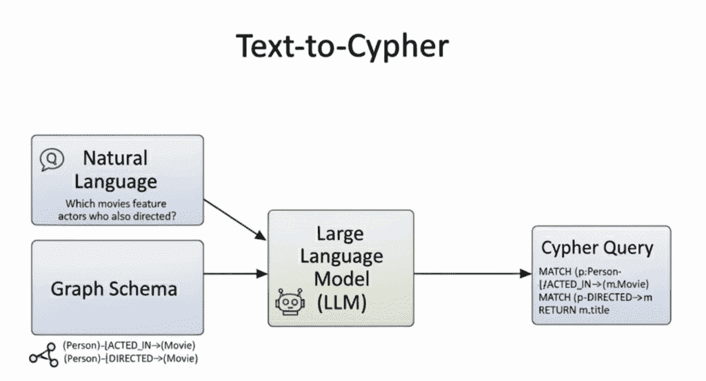
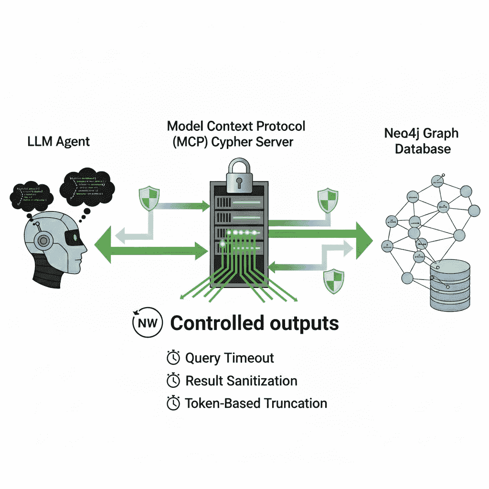

# 防止上下文过载：为 LLM 提供受控的 Neo4j MCP Cypher 响应

> 原文：[`towardsdatascience.com/preventing-context-overload-controlled-neo4j-mcp-cypher-responses-for-llms/`](https://towardsdatascience.com/preventing-context-overload-controlled-neo4j-mcp-cypher-responses-for-llms/)

<mdspan datatext="el1757105358537" class="mdspan-comment">大型语言模型</mdspan>连接到您的 Neo4j 图时，获得了极大的灵活性：它们可以通过 Neo4j MCP Cypher 服务器生成任何 Cypher 查询。这使得动态生成复杂查询、探索数据库结构，甚至串联多步代理工作流程成为可能。

为了生成有意义的查询，LLM 需要输入图模式：节点标签、关系类型以及定义数据模型的属性。有了这个上下文，模型可以将自然语言翻译成精确的 Cypher 语句，发现联系，并串联多跳推理。



由作者创建的图像。

例如，如果它知道图中 `(Person)-[:ACTED_IN]->(Movie)` 和 `(Person)-[:DIRECTED]->(Movie)` 的模式，它可以将 *“哪些电影由也执导过电影的演员出演？”* 转换为有效的查询。该模式给它提供了适应任何图并生成既正确又相关的 Cypher 语句所需的根基。

但这种自由是有代价的。如果不受控制，LLM 可以生成运行时间远超预期的 Cypher 语句，或者返回具有深层嵌套结构的巨大数据集。结果是不仅浪费了计算资源，而且对模型本身造成严重风险。目前，每个工具调用都会将其输出通过 LLM 的上下文返回。这意味着当你串联工具时，所有中间结果都必须通过模型返回。将数千行或类似嵌入的值返回到该循环中很快就会变成噪音，膨胀上下文窗口，并降低后续推理的质量。



使用 Gemini 生成

这就是为什么限制响应很重要。如果没有控制，使 Neo4j MCP Cypher 服务器如此吸引人的同样力量也使其脆弱。通过引入超时、输出清理、行限制和基于令牌的截断，我们可以保持系统响应，并确保查询结果对 LLM 来说仍然有用，而不是被无关的细节淹没。

**免责声明：** 我在 Neo4j 工作，这反映了我对当前实现潜在未来改进的探索。

服务器可在 [GitHub](https://github.com/tomasonjo-labs/neo4j-mcp-experiments/tree/main/servers/mcp-neo4j-cypher-throttle) 上找到。

## 受控输出

那么，我们如何防止查询失控和响应过大，以免压倒我们的 LLM？答案是不要限制代理可以编写的 Cypher 类型，因为 Neo4j MCP 服务器的整个目的就是展示图形的全部表达能力。相反，我们对返回的“多少”和查询允许运行的时间进行智能约束。在实践中，这意味着引入三层保护：超时、结果清理和令牌感知截断。

### 查询超时

第一层保护很简单：每个查询都有一个时间预算。如果 LLM 生成了一些昂贵的操作，比如巨大的笛卡尔积或跨越数百万个节点的遍历，它将快速失败，而不是挂起整个工作流程。

我们将其公开为环境变量，`QUERY_TIMEOUT`，默认为十秒。内部，查询被包装在`neo4j.Query`中，并应用超时。这样，读取和写入都尊重相同的界限。仅此一项变化就使服务器变得更加健壮。

### 清理噪声值

现代图形通常将**嵌入向量**附加到节点和关系上。这些向量可以是每个实体数百甚至数千个浮点数。它们对于相似性搜索至关重要，但当传递到 LLM 上下文中时，它们纯粹是噪音。模型无法直接推理它们，并且它们消耗了大量的令牌。

为了解决这个问题，我们通过一个简单的 Python 函数递归地清理结果。删除过大的列表，修剪嵌套字典，并仅保留在合理范围内（默认情况下，列表长度不超过 52 项）的值。

### 令牌感知截断

最后，即使是清理后的结果也可能很冗长。为了保证它们始终适合，我们通过分词器处理，并使用 OpenAI 的`tiktoken`库将其截断到最多 2048 个令牌。

```py
encoding = tiktoken.encoding_for_model("gpt-4")
tokens = encoding.encode(payload)
payload = encoding.decode(tokens[:2048])
```

这最后一步确保了与任何连接的 LLM 的兼容性，无论中间数据可能有多大。它就像一个安全网，捕捉到早期层没有过滤掉的所有内容，以避免压倒上下文。

### YAML 响应格式

此外，我们可以通过使用 YAML 响应进一步减少上下文大小。目前，Neo4j Cypher MCP 响应以 JSON 格式返回，这引入了一些额外的开销。通过将这些字典转换为 YAML，我们可以减少提示中的令牌数量，降低成本并提高延迟。

```py
yaml.dump(
    response,
    default_flow_style=False,
    sort_keys=False,
    width=float('inf'),
    indent=1,        # Compact but still structured
    allow_unicode=True,
)
```

## 综合起来

结合这些层——超时、清理和截断——Neo4j MCP Cypher 服务器仍然完全有能力，但更加自律。LLM 仍然可以尝试任何查询，但响应总是有界限且对 LLM 友好的上下文。使用 YAML 作为响应格式也有助于降低令牌计数。

而不是用大量数据淹没模型，你只需返回足够的结构来保持其智能。这正是感觉脆弱的服务器和专为 LLM 量身定制的服务器之间的区别。

服务器代码可在 [GitHub](https://github.com/tomasonjo-labs/neo4j-mcp-experiments/tree/main/servers/mcp-neo4j-cypher-throttle) 上获取。
