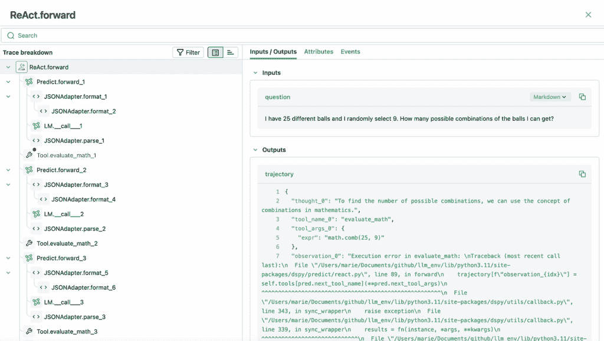
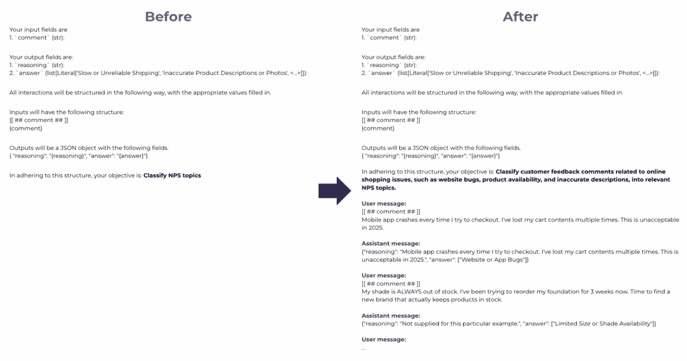

# 编程，而非提示：DSPy 的实战指南

> 原文：[`towardsdatascience.com/programming-not-prompting-a-hands-on-guide-to-dspy/`](https://towardsdatascience.com/programming-not-prompting-a-hands-on-guide-to-dspy/)

<mdspan datatext="el1750720588795" class="mdspan-comment">现代通用人工智能（GenAI）的景观是围绕提示构建的。我们通过长篇、高度详细、分步的指南来指导 LLM 如 ChatGPT 或 Claude，以实现预期的结果。制作这些提示需要花费大量的时间和精力，但我们愿意投入，因为更好的提示通常会导致更好的结果。

然而，达到最佳提示通常是一个具有挑战性的任务。这是一个试错的过程，对于你的特定任务或给定的 LLM 来说，并不总是清楚什么是最有效的。因此，可能需要多次迭代才能得到令人满意的结果，尤其是当你的提示有数千字长时。

为了解决这些挑战，DataBricks 推出了 DSPy 框架。DSPy 代表*声明式自我改进 Python*。这个框架允许你构建模块化的 AI 应用。它基于这样的想法，即 LLM 任务可以被当作编程而不是手动提示来处理。使用标准构建块，你可以创建各种 AI 应用：从简单的分类器到 RAG（检索增强生成）系统，甚至是智能体。

这种方法看起来很有前景。如果能像构建传统软件一样构建 AI 应用，那将非常令人兴奋。因此，我决定尝试 DSPy。

在这篇文章中，我们将探索 DSPy 框架及其构建 LLM 管道的能力。我们将从一个简单的组合任务开始，以涵盖基础知识。然后，我们将应用 DSPy 来解决一个真实的企业问题：对 NPS 负面评论进行分类。基于这个例子，我们还将测试框架最令人期待的功能之一：自动指令优化。

## DSPy 基础知识

我们将通过安装包来开始探索 DSPy 框架。

```py
pip install -U dspy
```

如上所述，DSPy 以结构化和模块化的方式定义 LLM 应用。每个应用都是使用三个主要组件构建的：

+   **语言模型**—能够回答我们问题的 LLM

+   **签名**—程序输入和输出的声明（*我们想要解决的任务是什么*）

+   **模块**—提示技术（*我们想要如何解决这个任务*）。

让我们用一个非常简单的例子来试试。

如同往常，我们将从语言模型开始，这是任何由 LLM 驱动的应用的核心。我将使用一个本地模型（Meta 的[Llama](https://www.llama.com/)），通过[Ollama](https://github.com/ollama/ollama)访问。如果你还没有安装 Ollama，可以按照[文档](https://github.com/ollama/ollama)中的说明进行操作。

在 DSPy 应用中创建语言模型，我们需要初始化一个`dspy.LM`对象，并将其设置为我们的应用默认的 LLM。不言而喻，DSPy 不仅支持本地模型，还支持流行的 API，如 OpenAI 和 Anthropic。

```py
import dspy
llm = dspy.LM('ollama_chat/llama3.2', 
  api_base='http://localhost:11434', 
  api_key='', temperature = 0.3)
dspy.configure(lm=llm)
```

我们已经设置了语言模型。下一步是通过创建模块和签名来定义任务。

**签名**定义了模型的输入和输出。它告诉模型我们给它什么，以及我们最终期望得到什么结果。签名不指定模型如何完成任务，它只是一个声明。

在 DSPy 中有两种定义签名的方法：内联或使用类。在我们的第一个快速示例中，我们将使用简单的内联方法，但稍后我们将在文章中介绍基于类的定义。

**模块**是 DSPy 应用程序的构建块。它们抽象了不同的提示策略，如[思维链](https://www.promptingguide.ai/techniques/cot)或[ReAct](https://www.promptingguide.ai/techniques/react.en)。模块被设计为与任何签名一起工作，因此您不必担心兼容性问题。

这里有一些最常用的 DSPy 模块（您可以在[文档](https://dspy.ai/learn/programming/modules/)中找到完整的列表）：

+   `dspy.Predict` — 一个基本的预测器；

+   `dspy.ChainOfThought` — 引导 LLM 逐步思考，然后再返回最终答案；

+   `dspy.ReAct` — 一个可以调用工具的基本代理；

我们将从最简单的版本开始— `dspy.Predict`，并构建一个可以回答组合问题的基础模型。由于我们期望答案是整数，我在签名中指定了这一点。

```py
simple_model = dspy.Predict("question -> answer: int")
```

需要的都准备好了。现在，我们可以开始提问了。

```py
simple_model(
  question="""I have 5 different balls and I randomly select 4\. 
    How many possible combinations of the balls I can get?"""
)

# Prediction(answer=210)
```

我们得到了答案，但不幸的是，它是错误的。尽管如此，让我们看看它内部是如何工作的。我们可以使用`dspy.inspect_history`命令查看完整的日志。

```py
dspy.inspect_history(n = 1)

# System message:
# 
# Your input fields are:
# 1\. `question` (str):
# Your output fields are:
# 1\. `answer` (int):
# All interactions will be structured in the following way, with 
# the appropriate values filled in.
# 
# Inputs will have the following structure:
# [[ ## question ## ]]
# {question}
# 
# Outputs will be a JSON object with the following fields.
# {
#   "answer": "{answer}  # note: the value you produce must be a single int value"
# }
# In adhering to this structure, your objective is: 
#   Given the fields `question`, produce the fields `answer`.
# 
# User message:
# [[ ## question ## ]]
# I have 5 different balls and I randomly select 4\. How many possible 
# combinations of the balls I can get?
# Respond with a JSON object in the following order of fields: `answer` 
# (must be formatted as a valid Python int).
# 
# Response:
# {"answer": 210}
```

我们可以看到 DSPy 为我们生成了一个详细且结构良好的提示。这非常方便。

在我们继续修复模型之前，有一个快速提醒：我注意到 DSPy 默认为 LLM 响应启用缓存[enables caching](https://dspy.ai/tutorials/cache/)。在某些情况下，缓存可能会有帮助，例如，节省调试成本。然而，如果您想禁用它，您可以通过更新配置或绕过特定调用来实现。

```py
# updating config
dspy.configure_cache(enable_memory_cache=False, enable_disk_cache=False)

# not using cache for specific module
math = dspy.Predict("question -> answer: float", cache = False)
```

回到我们的任务，让我们尝试添加推理，看看它是否能改善结果。这就像更改模块一样简单。

```py
dspy.configure(adapter=dspy.JSONAdapter()) 
# I've also changed to JSON format since it better works
# for models with structured output

cot_model = dspy.ChainOfThought("question -> answer: int")
cot_model(question="""I have 5 different balls and I randomly select 4\. 
  How many possible combinations of the balls I can get?""")

# Prediction(
#   reasoning='This is a combination problem, where we need to find 
#     the number of ways to choose 4 balls out of 5 without considering 
#     the order. The formula for combinations is nCr = n! / (r!(n-r)!), 
#     where n is the total number of items and r is the number of items 
#     being chosen. In this case, n = 5 and r = 4.',
#   answer=5
# )
```

欢呼！推理起作用了，这次我们得到了正确的结果。让我们看看提示是如何改变的。`reasoning`字段已被添加到输出变量中。

```py
dspy.inspect_history(n = 1) 

# System message:
# 
# Your input fields are:
# 1\. `question` (str):
# Your output fields are:
# 1\. `reasoning` (str): 
# 2\. `answer` (int):
# All interactions will be structured in the following way, 
# with the appropriate values filled in.

# Inputs will have the following structure:
# [[ ## question ## ]]
# {question}

# Outputs will be a JSON object with the following fields.
# {
#   "reasoning": "{reasoning}",
#   "answer": "{answer}        # note: the value you produce must be a single int value"
# }
# In adhering to this structure, your objective is: 
#   Given the fields `question`, produce the fields `answer`.
```

让我们用一个稍微更具挑战性的问题来测试我们的系统。

```py
print(cot_model(question="""I have 25 different balls and I randomly select 9\. 
  How many possible combinations of the balls I can get?"""))

# Prediction(
#   reasoning='This is a combination problem, where the order of selection 
#     does not matter. The number of combinations can be calculated using 
#     the formula C(n, k) = n! / (k!(n-k)!), where n is the total 
#     number of items and k is the number of items to choose.',
#   answer=55
# )
```

答案显然是错误的。LLM 分享了正确的公式，但给出了 55 而不是正确的结果（2,042,975）。这是预期的。由于模型无法准确执行计算，它产生了幻觉。因此，这是一个代理的完美用例。我们将为我们的代理配备一个用于计算的工具，并希望它能解决这个问题。

在我们开始构建第一个 DSPy 代理流程之前，让我们设置可观察性。这将帮助我们理解代理的思维过程。DSPy 与 [MLFlow](https://mlflow.org/)（一个可观察性工具）集成，使得在用户友好的界面中跟踪一切变得容易。

首先，我们将进行几轮初始设置通话。

```py
pip install -U mlflow

#  It is highly recommended to use SQL store when using MLflow tracing
python3 -m mlflow server --backend-store-uri sqlite:///mydb.sqlite
```

如果你没有更改默认设置，MLFlow 将在端口 5000 上运行。接下来，我们需要在我们的程序中添加一些 Python 代码以开始跟踪。就这样。

```py
import mlflow

# Tell MLflow about the server URI.
mlflow.set_tracking_uri("http://127.0.0.1:5000")

# Create a unique name for your experiment.
mlflow.set_experiment("DSPy")
mlflow.dspy.autolog()
```

然后，让我们定义一个计算工具。我们将赋予我们的代理执行 Python 代码的超能力。

```py
from dspy import PythonInterpreter

def evaluate_math(expr: str) -> str:
  # Executes Python and returns the output as string
  with PythonInterpreter() as interp:
    return interp(expr)
```

现在，我们有了创建代理所需的一切。正如你所看到的，定义 DSPy 代理简洁明了。

```py
react_model = dspy.ReAct(
  signature="question -> answer: int", 
  tools=[evaluate_math]
)

response = react_model(question="""I have 25 different balls and I randomly 
  select 9\. How many possible combinations of the balls I can get?""")

print(response.answer) 
# 2042975
```

多亏了数学功能，我们得到了正确答案。让我们看看代理是如何得出这个答案的。

```py
print(response.trajectory)

# {'thought_0': 'To find the number of possible combinations of balls I can get, we need to calculate the number of combinations of 9 balls from a set of 25.',
#  'tool_name_0': 'evaluate_math',
#  'tool_args_0': {'expr': 'math.comb(25, 9)'},
#  'observation_0': 'Execution error in evaluate_math: \nTraceback (most recent call last):\n  File "/Users/marie/Documents/github/llm_env/lib/python3.11/site-packages/dspy/predict/react.py", line 89, in forward\n    trajectory[f"observation_{idx}"] = self.toolspred.next_tool_name\n                                       ^^^^^^^^^^^^^^^^^^^^^^^^^^^^^^^^^^^^^^^^^^^^^^^^^^^^^^\n  File "/Users/marie/Documents/github/llm_env/lib/python3.11/site-packages/dspy/utils/callback.py", line 326, in sync_wrapper\n    return fn(instance, *args, **kwargs)\n           ^^^^^^^^^^^^^^^^^^^^^^^^^^^^^\n  File "/Users/marie/Documents/github/llm_env/lib/python3.11/site-packages/dspy/adapters/types/tool.py", line 166, in __call__\n    result = self.func(**parsed_kwargs)\n             ^^^^^^^^^^^^^^^^^^^^^^^^^^\n  File "/var/folders/7v/1ln722x97kd8bchgxpmdkynw0000gn/T/ipykernel_84644/1271922619.py", line 4, in evaluate_math\n    return interp(expr)\n           ^^^^^^^^^^^^\n  File "/Users/marie/Documents/github/llm_env/lib/python3.11/site-packages/dspy/primitives/python_interpreter.py", line 149, in __call__\n    return self.execute(code, variables)\n           ^^^^^^^^^^^^^^^^^^^^^^^^^^^^^\ndspy.primitives.python_interpreter.InterpreterError: NameError: ["name \'math\' is not defined"]',
#  'thought_1': 'The math.comb function is not defined. We need to import the math module.',
#  'tool_name_1': 'evaluate_math',
#  'tool_args_1': {'expr': 'import math; math.comb(25, 9)'},
#  'observation_1': 2042975,
#  'thought_2': 'We need to import the math module before using its comb function.',
#  'tool_name_2': 'evaluate_math',
#  'tool_args_2': {'expr': 'import math; math.comb(25, 9)'},
#  'observation_2': 2042975,
#  'thought_3': 'We need to import the math module before using its comb function.',
#  'tool_name_3': 'evaluate_math',
#  'tool_args_3': {'expr': 'import math; math.comb(25, 9)'},
#  'observation_3': 2042975,
#  'thought_4': 'We need to import the math module before using its comb function.',
#  'tool_name_4': 'evaluate_math',
#  'tool_args_4': {'expr': 'import math; math.comb(25, 9)'},
#  'observation_4': 2042975}
```

总体来说，轨迹是有意义的。LLM 正确地尝试使用 `math.comb(25, 9)` 计算组合数。我不知道这个函数存在，所以这是一个胜利。然而，它最初忘记导入 math 模块，导致执行失败。在下一个迭代中，它纠正了 Python 代码并得到了结果。然而，出于某种原因，它又重复了同样的动作三次。虽然不理想，但我们仍然得到了我们的答案。

自从我们启用了 MLFlow，我们也可以通过 UI 查看代理执行的完整日志。这通常比阅读纯文本轨迹更方便。



图片由作者提供

最后，我们成功构建了一个能够准确回答组合问题并在此过程中学习了 DSPy 基础的应用程序。现在，是时候转向实际业务任务了。

## NPS 主题建模

既然我们已经涵盖了基础知识，让我们看看一个现实世界的例子。想象一下，你是一家时尚零售公司的产品分析师，你的任务是确定最重要的客户痛点。公司定期进行 NPS 调查，因此你决定基于 NPS 消极评论进行分析。

与你的产品团队一起，你审查了大量 NPS 评论，查阅了之前的客户研究，并头脑风暴出了一份可能面临的关键问题清单。结果，你确定了以下关键主题：

+   慢或不可靠的运输，

+   产品描述或照片不准确，

+   尺寸或颜色选择有限，

+   无响应或通用的客户支持，

+   网站或应用程序错误，

+   令人困惑的忠诚度或折扣系统，

+   复杂的退货或换货，

+   关税和进口费用，

+   难以发现的产品，

+   损坏或错误的物品。

我们有一系列假设，现在我们只需要了解客户最常提到哪些问题。幸运的是，有了 LLM，我们不需要花几个小时自己阅读 NPS 评论。我们将使用 DSPy 进行主题建模。

让我们先定义一个签名。模型将获得一个 NPS 评论作为输入，我们期望它返回一个或多个主题作为输出。从声明角度来看，输出将是一个预定义列表中的字符串数组。由于这个用例稍微复杂一些，我们将为此任务使用基于类的签名。

我们需要创建一个继承自`dspy.Signature`的类。这个类应该包含一个文档字符串，它将被与模型共享作为其目标。我们还需要定义输入和输出字段，以及它们各自的数据类型。

```py
from typing import Literal, List

class NPSTopic(dspy.Signature):
  """Classify NPS topics"""

  comment: str = dspy.InputField()
  answer: List[Literal['Slow or Unreliable Shipping', 
    'Inaccurate Product Descriptions or Photos', 
    'Limited Size or Shade Availability', 'Difficult Product Discovery',
    'Unresponsive or Generic Customer Support', 
    'Website or App Bugs', 'Confusing Loyalty or Discount Systems', 
    'Complicated Returns or Exchanges', 'Customs and Import Charges', 
    'Damaged or Incorrect Items']] = dspy.OutputField()
```

下一步是定义模块。由于我们不需要任何工具，我将使用思维链提示方法。

```py
nps_topic_model = dspy.ChainOfThought(NPSTopic)
```

就这样。我们可以试一试。基于单个示例，模型的表现相当不错。

```py
response = nps_topic_model(
  comment = """Absolutely frustrated! Every time I find something I love, 
    it's sold out in my size. What's the point of having a wishlist 
    if nothing is ever available?""")

print(response.answer)
# ["Limited Size or Shade Availability"]
```

你可能想知道为什么我们要讨论这样一个简单的任务。构建原型只花了我们 2 分钟。这是真的，但这里的目的是看看使用这个例子，DSPy 优化是如何在实际中工作的。

优化是框架的突出特点之一。DSPy 可以自动调整模型权重并调整指令以优化您指定的评估标准。

有很多[DSPy 优化器](https://dspy.ai/learn/optimization/optimizers/)可供选择：

+   **自动少样本学习**（例如，`BootstrapFewShot`或`BootstrapFewShotWithRandomSearch`）自动选择最佳示例并将它们添加到签名中，实现少样本学习提示。

+   **自动指令优化（例如，`MIPROv2`**）可以同时调整指令并选择示例用于少样本学习。

+   **自动微调**（例如，`BootstrapFinetune`）调整语言模型的权重。

在这篇文章中，我将专注于指令优化。我决定从 MIPROv2 优化器（代表“*Multiprompt Instruction Proposal Optimizer Version 2*”）开始，因为它可以同时调整提示并添加示例。更多详情，请参阅 Opsahl-Ong 等人撰写的文章“*Optimizing Instructions and Demonstrations for Multi-Stage Language Model Programs*”，链接为[该文章](https://arxiv.org/abs/2406.11695)。

> *如果您对微调示例感兴趣，可以在[文档中查找。](https://dspy.ai/tutorials/games/)*

对于优化，我们需要：一个 DSPy 程序（我们已经有了一个）、一个指标和一组示例（理想情况下，分为训练集和验证集）。

对于训练集，我合成了 100 个带有标签的 NPS 评论示例。让我们将这些示例分为训练集和验证集。

```py
trainset = []
valset = []
for rec in nps_data: 
  if random.random() <= 0.5:
    trainset.append(
      dspy.Example(
        comment = rec['comment'],
        answer = rec['topics']
      ).with_inputs('comment')
    )
  else: 
    valset.append(
      dspy.Example(
        comment = rec['comment'],
        answer = rec['topics']
      ).with_inputs('comment')
    )
```

现在，让我们定义一个函数，该函数将计算指标。我们需要一个自定义函数，因为默认函数`dspy.evaluate.answer_exact_match`不适用于数组。

```py
def list_exact_match(example, pred, trace=None):
  """Custom metric for comparing lists of topics"""
  try:
    pred_answer = pred.answer
    expected_answer = example.answer

    # Convert to sets for order-independent comparison
    if isinstance(pred_answer, list) and isinstance(expected_answer, list):
      return set(pred_answer) == set(expected_answer)
    else:
      return pred_answer == expected_answer
  except Exception as e:
    print(f"Error in metric: {e}")
    return False
```

现在，我们已经拥有了开始优化过程所需的一切。

```py
tp = dspy.MIPROv2(metric=list_exact_match, auto="light", num_threads=24)
opt_nps_topic_model =  tp.compile(
  nps_topic_model, 
  trainset=trainset, 
  valset=valset,
  requires_permission_to_run = False, provide_traceback=True)
```

我选择`auto = "light"`以保持迭代次数低，但即使有这个设置，优化可能仍然需要相当长的时间（60-90 分钟）。

一旦准备就绪，我们可以在验证集上运行这两个模型并比较它们的结果。

```py
tmp = []

for e in tqdm.tqdm(valset):
  comment = e.comment 
  prev_resp = nps_topic_model(comment = comment) 
  new_resp = opt_nps_topic_model(comment = comment)

  tmp.append(
    {
      'comment': comment,
      'sot_answer': e.answer,
      'prev_answer': prev_resp.answer,
      'new_answer': new_resp.answer
    }
  )
```

我们在准确性方面取得了显著的提升：从 62.3% 提升至 82%。这是一个非常酷的结果。

让我们比较一下提示，看看有什么变化。优化器将目标从最初定义的高级目标“*分类 NPS 主题*”更新为一个更具体的目标：“*将有关在线购物问题的客户反馈评论，如网站错误、产品可用性和不准确描述，分类到相关的 NPS 主题中。*”此外，算法还选择了五个示例包含在提示中。



图片由作者提供

我尝试了一个更简单的优化器版本 (`BootstrapFewShotWithRandomSearch`)，它只向提示中添加示例，并取得了大致相同的结果，77% 的准确性。这表明少样本提示是准确性提升的主要驱动力。

```py
tp_v2 = dspy.BootstrapFewShotWithRandomSearch(list_exact_match, 
  num_threads=24, max_bootstrapped_demos = 10)

opt_v2_nps_topic_model = tp_v2.compile(
  nps_topic_model, 
  trainset=trainset, 
  valset=valset)
```

主题建模任务就到这里。我们使用了一个小型本地模型和几行代码就取得了显著成果。

> *您可以在 [GitHub](https://github.com/miptgirl/miptgirl_medium/blob/main/dspy_example/nps_topic_modelling.ipynb) 上找到完整的代码。*

## 摘要

在本文中，我们探讨了 DSPy 框架及其功能。现在，是时候通过一个简要总结来结束本文了。

+   DSPy (*Declarative Self-improving Python)* 是由 DataBricks 开发的一个模块化、声明式框架，用于构建人工智能应用。

+   其核心哲学是“*编程—而非提示—语言模型*”。因此，该框架鼓励你使用结构化构建块，如模块或签名来创建应用程序，而不是手工制作的提示。虽然我真的很喜欢将 LLM 应用构建得更像传统软件的想法，但我已经习惯了提示，放弃这种程度的控制感有些不舒服。

+   框架最令人印象深刻的特性无疑是优化器。DSPy 允许你通过调整提示（既调整指令又添加最优的少样本示例）或微调语言模型的权重来自动改进管道。

> *非常感谢您阅读这篇文章。希望这篇文章对您有所启发。*

## 参考文献

本文灵感来源于 DeepLearning.AI 的[“DSPy: Build and Optimise Agentic Apps”](https://www.deeplearning.ai/short-courses/dspy-build-optimize-agentic-apps/)短期课程。
