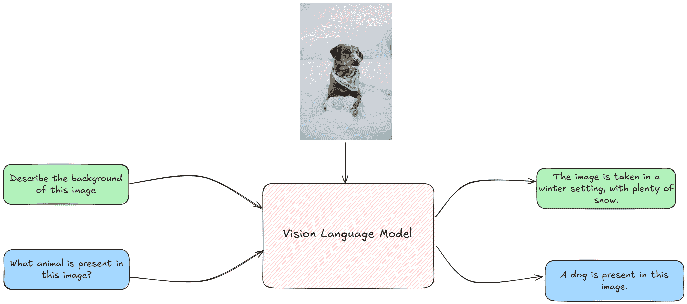
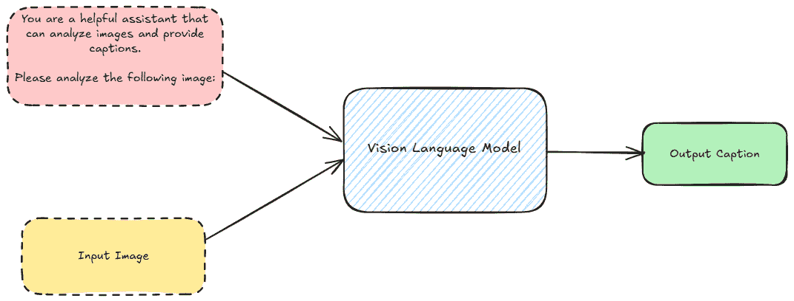
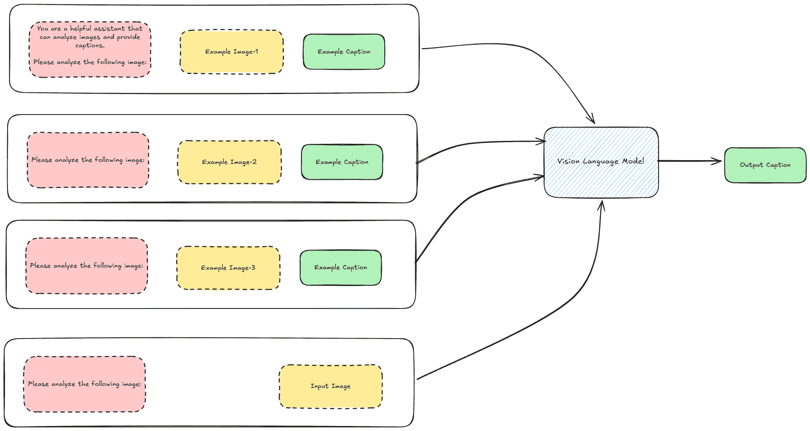
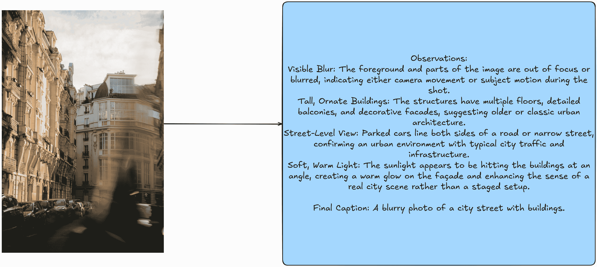
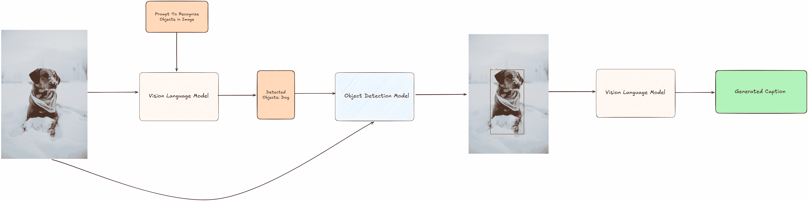

# 使用 VLMs 进行视觉语言模型提示

> 原文：[`towardsdatascience.com/prompting-with-vision-language-models-bdabe00452b7/`](https://towardsdatascience.com/prompting-with-vision-language-models-bdabe00452b7/)

视觉语言模型（VLMs）通过结合文本和视觉输入，在处理和理解多模态数据方面取得了重大进步。



VLMs 的高级概述。可爱小狗的图片来自[Josh Frenette](https://unsplash.com/@joshfrenette?utm_content=creditCopyText&utm_medium=referral&utm_source=unsplash)在[Unsplash](https://unsplash.com/photos/brown-short-coated-dog-in-white-and-blue-jacket-on-snow-covered-ground-during-daytime-okjb-hk0LH4?utm_content=creditCopyText&utm_medium=referral&utm_source=unsplash)。这幅图像灵感来源于 HuggingFace 在此博客中提供的 VLMs 表示([`huggingface.co/blog/vlms`](https://huggingface.co/blog/vlms))（整体图片由作者提供）

与仅处理文本的大型语言模型（LLMs）不同，VLMs 是多模态的，使用户能够处理需要视觉和文本理解的任务。这种能力开辟了广泛的应用，例如视觉问答（VQA），其中模型根据图像回答问题，以及图像描述，这涉及到为图像生成描述性文本。在这篇博客文章中，我解释了如何提示 VLMs 以执行需要视觉理解的任务，以及我们可以以不同的方式做到这一点。

## 目录

1.  **引言**

1.  **使用 VLMs 进行提示**

1.  **零样本提示**

1.  **少样本提示**

1.  **思维链提示**

1.  **对象检测引导提示**

1.  **结论**

1.  **参考文献**

## 引言

VLMs（视觉语言模型）是现有 LLMs（大型语言模型）的扩展——尤其是在它们将视觉处理作为一个额外的模态。VLMs 通常使用将图像和文本表示对齐到同一表示或向量空间中的机制进行训练，使用诸如**交叉注意力**[1] [2] [3] [4]等技术。此类系统的优势在于，您可以通过文本作为便捷的界面与图像进行交互或“查询”。由于它们的多模态能力，VLMs 对于弥合文本和视觉数据之间的差距至关重要，开辟了仅文本模型无法解决的问题的大量用例。为了更深入地了解 VLMs 的工作原理，我推荐阅读[Sebastian Raschka 关于多模态 LLMs 的优秀文章](https://sebastianraschka.com/blog/2024/understanding-multimodal-llms.html)。

## 使用 VLMs 进行提示

在一篇早期的博客中，我提到了[提示 LLMs](https://medium.com/towards-data-science/an-introduction-to-prompting-for-llms-61d36aec2048)的技术。与 LLMs 类似，VLMs 也可以使用类似的技术进行提示——增加了结合图像以帮助模型更好地理解当前任务的优势。在这篇博客中，我讨论了适用于 VLMs 的常见提示范式，包括零样本、少样本和思维链提示。我还探讨了其他深度学习方法如何帮助指导 VLMs 的提示——例如将目标检测集成到提示策略中。在我的实验中，我使用了**OpenAI 的 GPT-4o-mini**模型，这是一个 VLM。

> 在这篇博客文章中使用的所有代码和资源都可以在以下[github 链接](https://github.com/anand-subu/blog_resources/tree/main/prompting_with_vlms)中找到。

### 使用的数据

对于这篇博客文章，我使用了从 Unsplash 下载的 5 张图片，这些图片的使用许可允许。具体来说，我使用了以下图片：

1.  图片由[Mathias Reding](https://unsplash.com/@matreding?utm_content=creditCopyText&utm_medium=referral&utm_source=unsplash)在[Unsplash](https://unsplash.com/photos/a-blurry-photo-of-a-city-street-with-buildings-5-LTB9YPwkY?utm_content=creditCopyText&utm_medium=referral&utm_source=unsplash)上拍摄。

1.  图片由[Josh Frenette](https://unsplash.com/@joshfrenette?utm_content=creditCopyText&utm_medium=referral&utm_source=unsplash)在[Unsplash](https://unsplash.com/photos/brown-short-coated-dog-in-white-and-blue-jacket-on-snow-covered-ground-during-daytime-okjb-hk0LH4?utm_content=creditCopyText&utm_medium=referral&utm_source=unsplash)上拍摄。

1.  图片由[sander traa](https://unsplash.com/@sandertraa?utm_content=creditCopyText&utm_medium=referral&utm_source=unsplash)在[Unsplash](https://unsplash.com/photos/a-white-car-driving-on-a-desert-road-nOhLRqb5AV0?utm_content=creditCopyText&utm_medium=referral&utm_source=unsplash)上拍摄。

1.  图片由[NEOM](https://unsplash.com/@neom?utm_content=creditCopyText&utm_medium=referral&utm_source=unsplash)在[Unsplash](https://unsplash.com/photos/a-man-standing-next-to-a-tent-in-the-desert-ckfXPMb2_BI?utm_content=creditCopyText&utm_medium=referral&utm_source=unsplash)上拍摄。

1.  图片由[Alexander Zaytsev](https://unsplash.com/@anwaltzzz?utm_content=creditCopyText&utm_medium=referral&utm_source=unsplash)在[Unsplash](https://unsplash.com/photos/a-building-with-a-lot-of-plants-growing-on-the-side-of-it-E70gGcHNHj0?utm_content=creditCopyText&utm_medium=referral&utm_source=unsplash)上拍摄。

这些图片的标题是从图片网址中提取的，因为 Unsplash 上的图片都附带每个图片的相应标题。

## 零样本提示



零样本提示表示（图片由作者提供）

**零样本提示**代表一种场景，其中用户仅通过系统和用户提示提供任务的描述，以及要处理的图像。在这个设置中，VLM 仅依赖于任务描述来生成输出。如果我们根据提供给 VLM 的信息量在光谱上对提示方法进行分类，零样本提示向模型提供了最少的信息。

对于用户来说，优势在于，对于大多数任务，一个精心制作的零样本提示只需通过文本描述任务就能产生相当不错的输出。考虑一下这个影响的含义：就在几年前，像图像分类或图像标题这样的任务在可以使用之前，需要在大数据集上训练一个 CNN 或深度学习模型。现在，你可以通过利用文本来描述这些任务来执行这些任务。你可以通过指定和描述你想要分析的内容来创建现成的图像分类器。在 VLM 之前，要实现这一点，需要收集一个大型、特定于任务的数据库，训练一个模型，然后使用它进行推理。

**我们该如何引导他们呢？** OpenAI 支持将图像作为 Base64 编码的 URL 发送到 VLM [2]。一般的请求结构看起来是这样的：

```py
{
  "role": "system",
  "content": "You are a helpful assistant that can analyze images and provide captions."
},
{
  "role": "user",
  "content": [
    {
      "type": "text",
      "text": "Please analyze the following image:"
    },
    {
      "type": "image_url",
      "image_url": {
        "url": "data:image/jpeg;base64,{base64_image}",
        "detail": "detail"
      }
    }
  ]
}
```

结构基本上与您使用 OpenAI 提示正常 LLM 的方式相同。然而，关键的区别在于在请求中添加图像，这需要编码为 Base64 字符串。这实际上有点有趣——尽管我在这里只使用了一个图像作为输入，但没有任何阻止我向请求中附加多个图像的。

让我们实现辅助函数来完成零样本提示。为了使实验更快，我并行化了发送到 OpenAI API 的请求。我实现了构建提示和调用模型以获取输出的辅助函数。这包括一个将图像编码为 base64 字符串的函数，以及构建提示和通过 OpenAI 的 API 调用 VLM 的函数。

```py
def encode_image(image_path):
    """
    Encodes an image to a base64 string.

    Args:
        image_path (str): The file path of the image to encode.

    Returns:
        str: Base64-encoded string of the image, or None if an error occurs.
    """    
    try:
        with open(image_path, "rb") as image_file:
            return base64.b64encode(image_file.read()).decode("utf-8")
    except Exception as e:
        print(f"Error encoding image: {e}")
        return None

def llm_chat_completion(messages, model="gpt-4o-mini", max_tokens=300, temperature=0.0):
    """
    Calls OpenAI's ChatCompletion API with the specified parameters.

    Args:
        messages (list): A list of message dictionaries for the conversation.
        model (str): The model to use for the chat completion.
        max_tokens (int, optional): Maximum tokens for the response. Defaults to 300.
        temperature (float, optional): Sampling temperature for randomness. Defaults to 0.0.

    Returns:
        str or None: The response content from the API, or None if an error occurs.
    """
    try:
        response =  client.chat.completions.create(
            model=model,
            messages=messages,
            max_tokens=max_tokens,
            temperature=temperature
        )
        return response.choices[0].message.content
    except Exception as e:
        print(f"Error calling LLM: {e}")
        return None

def build_few_shot_messages(few_shot_prompt, user_prompt = "Please analyze the following image:", detail="auto"):
    """
    Generates few-shot example messages from image-caption pairs.

    Args:
        few_shot_prompt (dict): A dictionary mapping image paths to metadata, 
                                including "image_caption".
        detail (str, optional): Level of image detail to include. Defaults to "auto".

    Returns:
        list: A list of few-shot example messages.
    """
    few_shot_messages = []
    for path, data in few_shot_prompt.items():
        base64_image = encode_image(path)
        if not base64_image:
            continue  # skip if failed to encode
        caption = data

        few_shot_messages.append(
            {
                "role": "user",
                "content": [
                    {"type": "text", "text": user_prompt},
                    {
                        "type": "image_url",
                        "image_url": {
                            "url": f"data:image/jpeg;base64,{base64_image}",
                            "detail": detail
                        }
                    },
                ]
            }
        )
        few_shot_messages.append({"role": "assistant", "content": caption})
    return few_shot_messages

def build_user_message(image_path, user_prompt="Please analyze the following image:", detail="auto"):
    """
    Creates a user message for analyzing a single image.

    Args:
        image_path (str): Path to the image file.
        detail (str, optional): Level of image detail to include. Defaults to "auto".

    Returns:
        dict or None: The user message dictionary, or None if image encoding fails.
    """
    base64_image = encode_image(image_path)
    if not base64_image:
        return None

    return {
        "role": "user",
        "content": [
            {"type": "text", "text": user_prompt},
            {
                "type": "image_url",
                "image_url": {
                    "url": f"data:image/jpeg;base64,{base64_image}",
                    "detail": detail
                }
            },
        ]
    } 
```

我现在将这些内容整合在一起，并定义了一个函数，该函数接受图像路径以及必要的参数（系统提示、用户提示和其他超参数），调用 VLM 并返回为图像生成的标题。

```py
def get_image_caption(
    image_path,
    few_shot_prompt=None,
    system_prompt="You are a helpful assistant that can analyze images and provide captions.",
    user_prompt="Please analyze the following image:",
    model="gpt-4o-mini",
    max_tokens=300,
    detail="auto",
    llm_chat_func=llm_chat_completion,
    temperature=0.0
):
    """
    Gets a caption for an image using a LLM.

    Args:
        image_path (str): File path of the image to be analyzed.
        few_shot_prompt (dict, optional): Maps image paths to {"image_caption": <caption>}.
        system_prompt (str, optional): Initial system prompt for the LLM.
        user_prompt (str, optional): User prompt for the LLM.
        model (str, optional): LLM model name (default "gpt-4o-mini").
        max_tokens (int, optional): Max tokens in the response (default 300).
        detail (str, optional): Level of detail for the image analysis (default "auto").
        llm_chat_func (callable, optional): Function to call the LLM. Defaults to `llm_chat_completion`.
        temperature (float, optional): Sampling temperature (default 0.0).

    Returns:
        str or None: The generated caption, or None on error.
    """
    try:
        user_message = build_user_message(image_path, detail)
        if not user_message:
            return None

        # Build message sequence
        messages = [{"role": "system", "content": system_prompt}]

        # Include few-shot examples if provided
        if few_shot_prompt:
            few_shot_messages = build_few_shot_messages(few_shot_prompt, detail)
            messages.extend(few_shot_messages)

        messages.append(user_message)

        # Call the LLM
        response_text = llm_chat_func(
            model=model,
            messages=messages,
            max_tokens=max_tokens,
            temperature=temperature
        )
        return response_text

    except Exception as e:
        print(f"Error getting caption: {e}")
        return None

def process_images_in_parallel(
    image_paths, 
    model="gpt-4o-mini", 
    system_prompt="You are a helpful assistant that can analyze images and provide captions.", 
    user_prompt="Please analyze the following image:", 
    few_shot_prompt = None, 
    max_tokens=300, 
    detail="auto", 
    max_workers=5):
    """
    Processes a list of images in parallel to generate captions using a specified model.

    Args:
        image_paths (list): List of file paths to the images to be processed.
        model (str): The model to use for generating captions (default is "gpt-4o").
        max_tokens (int): Maximum number of tokens in the generated captions (default is 300).
        detail (str): Level of detail for the image analysis (default is "auto").
        max_workers (int): Number of threads to use for parallel processing (default is 5).

    Returns:
        dict: A dictionary where keys are image paths and values are their corresponding captions.
    """    
    captions = {}
    with ThreadPoolExecutor(max_workers=max_workers) as executor:
        # Pass additional arguments using a lambda or partial
        future_to_image = {
            executor.submit(
                get_image_caption, 
                image_path, 
                few_shot_prompt, 
                system_prompt, 
                user_prompt, 
                model, 
                max_tokens, 
                detail): image_path
            for image_path in image_paths
        }

        # Use tqdm to track progress
        for future in tqdm(as_completed(future_to_image), total=len(image_paths), desc="Processing images"):
            image_path = future_to_image[future]
            try:
                caption = future.result()
                captions[image_path] = caption
            except Exception as e:
                print(f"Error processing {image_path}: {e}")
                captions[image_path] = None
    return captions
```

我们现在运行两个图像的输出，并从零样本提示设置中获得相应的标题。

```py
from tqdm import tqdm
import os

IMAGE_QUALITY = "high"
PATH_TO_SAMPLES = "images/"

system_prompt = """You are an AI assistant that provides captions of images. 
You will be provided with an image. Analyze the content, context, and notable features of the images.
Provide a concise caption that covers the important aspects of the image."""

user_prompt = "Please analyze the following image:"

image_paths = [os.path.join(PATH_TO_SAMPLES, x) for x in os.listdir(PATH_TO_SAMPLES)]

zero_shot_high_quality_captions = process_images_in_parallel(image_paths, model = "gpt-4o-mini", system_prompt=system_prompt, user_prompt = user_prompt, few_shot_prompt= None, detail=IMAGE_QUALITY, max_workers=5)
```

 和 Alexander Zaytsev 在 Unsplash 上拍摄（整体图像由作者提供）](../Images/2defb0a6b9c2a3e979a6f22f6a919890.png)

零样本设置的输出。图中图片由 [Josh Frenette](https://unsplash.com/@joshfrenette?utm_content=creditCopyText&utm_medium=referral&utm_source=unsplash) 在 [[Unsplash](https://unsplash.com/photos/a-building-with-a-lot-of-plants-growing-on-the-side-of-it-E70gGcHNHj0?utm_content=creditCopyText&utm_medium=referral&utm_source=unsplash)](https://unsplash.com/photos/brown-short-coated-dog-in-white-and-blue-jacket-on-snow-covered-ground-during-daytime-okjb-hk0LH4?utm_content=creditCopyText&utm_medium=referral&utm_source=unsplash) 和 [Alexander Zaytsev](https://unsplash.com/@anwaltzzz?utm_content=creditCopyText&utm_medium=referral&utm_source=unsplash) 在 Unsplash 上拍摄（整体图片由作者提供）。

我们观察到，该模型为提供的图片提供了详细的描述，详细涵盖了所有方面。

## 少样本提示

少样本提示涉及提供任务的示例或演示作为上下文，为 VLM 提供更多参考和上下文，以便模型了解将要执行的任务。



少样本提示的表示（图片由作者提供）

少样本提示的优势在于，与零样本提示相比，它有助于为任务提供额外的依据。让我们看看这在我们的任务中是如何实际发生的。首先，考虑我们的现有实现：

```py
def build_few_shot_messages(few_shot_prompt, user_prompt = "Please analyze the following image:", detail="auto"):
    """
    Generates few-shot example messages from image-caption pairs.

    Args:
        few_shot_prompt (dict): A dictionary mapping image paths to metadata, 
                                including "image_caption".
        detail (str, optional): Level of image detail to include. Defaults to "auto".

    Returns:
        list: A list of few-shot example messages.
    """
    few_shot_messages = []
    for path, data in few_shot_prompt.items():
        base64_image = encode_image(path)
        if not base64_image:
            continue  # skip if failed to encode
        caption = data

        few_shot_messages.append(
            {
                "role": "user",
                "content": [
                    {"type": "text", "text": user_prompt},
                    {
                        "type": "image_url",
                        "image_url": {
                            "url": f"data:image/jpeg;base64,{base64_image}",
                            "detail": detail
                        }
                    },
                ]
            }
        )
        few_shot_messages.append({"role": "assistant", "content": caption})
    return few_shot_messages
```

我将 3 张图片作为少样本示例提供给 VLM，然后运行我们的系统。

```py
image_captions = json.load(open("image_captions.json"))
FEW_SHOT_EXAMPLES_PATH = "few_shot_examples/"
few_shot_samples = os.listdir(FEW_SHOT_EXAMPLES_PATH)
few_shot_captions = {os.path.join(FEW_SHOT_EXAMPLES_PATH,k):v for k,v in  image_captions.items() if k in few_shot_samples}

IMAGE_QUALITY = "high"
few_shot_high_quality_captions = process_images_in_parallel(image_paths, model = "gpt-4o-mini", few_shot_prompt= few_shot_captions, detail=IMAGE_QUALITY, max_workers=5)
```

 和 Alexander Zaytsev 在 Unsplash 上拍摄（整体图片由作者提供）](../Images/ae3240e46c1152bc963d122cfe94a0d2.png)

少样本提示的输出。图中图片由 [Josh Frenette](https://unsplash.com/@joshfrenette?utm_content=creditCopyText&utm_medium=referral&utm_source=unsplash) 在 [[Unsplash](https://unsplash.com/photos/a-building-with-a-lot-of-plants-growing-on-the-side-of-it-E70gGcHNHj0?utm_content=creditCopyText&utm_medium=referral&utm_source=unsplash)](https://unsplash.com/photos/brown-short-coated-dog-in-white-and-blue-jacket-on-snow-covered-ground-during-daytime-okjb-hk0LH4?utm_content=creditCopyText&utm_medium=referral&utm_source=unsplash) 和 [Alexander Zaytsev](https://unsplash.com/@anwaltzzz?utm_content=creditCopyText&utm_medium=referral&utm_source=unsplash) 在 Unsplash 上拍摄（整体图片由作者提供）。

注意使用少样本示例通过 VLM 生成的描述。与零样本提示设置中生成的描述相比，这些描述要简短得多。让我们看看这些示例的描述是什么样的：

](https://unsplash.com/photos/a-white-car-driving-on-a-desert-road-nOhLRqb5AV0?utm_content=creditCopyText&utm_medium=referral&utm_source=unsplash)，sander traa 在 Unsplash，NEOM 在 Unsplash。图片由作者提供](../Images/4ec42f385da64c35aa2128cdacf81a69.png)

使用的少样本图像及其对应的标题。图中图片由[Mathias Reding](https://unsplash.com/@matreding?utm_content=creditCopyText&utm_medium=referral&utm_source=unsplash)在[[[Unsplash](https://unsplash.com/photos/a-man-standing-next-to-a-tent-in-the-desert-ckfXPMb2_BI?utm_content=creditCopyText&utm_medium=referral&utm_source=unsplash)](https://unsplash.com/photos/a-white-car-driving-on-a-desert-road-nOhLRqb5AV0?utm_content=creditCopyText&utm_medium=referral&utm_source=unsplash)](https://unsplash.com/photos/a-blurry-photo-of-a-city-street-with-buildings-5-LTB9YPwkY?utm_content=creditCopyText&utm_medium=referral&utm_source=unsplash)，[sander traa](https://unsplash.com/@sandertraa?utm_content=creditCopyText&utm_medium=referral&utm_source=unsplash)在 Unsplash，[NEOM](https://unsplash.com/@neom?utm_content=creditCopyText&utm_medium=referral&utm_source=unsplash)在 Unsplash。图片由作者提供

**这种差异主要归因于少样本示例的影响**。少样本示例中的标题明显影响了 VLM 对我们使用的新图像的输出，导致更简洁、更短的标题。这说明了选择少样本示例在塑造 VLM 行为方面可以多么强大。用户可以通过仔细选择少样本样本，引导模型的输出更接近他们偏好的风格、语气或细节程度。

## 思维链提示

思维链（CoT）提示[9]，最初是为 LLMs 开发的，使它们能够通过将复杂问题分解成更简单、中间的步骤并鼓励模型在回答之前“思考”来处理复杂问题。这项技术可以无任何调整地应用于 VLMs。主要区别在于，VLM 在 CoT 推理下回答问题时可以使用图像和文本作为输入。

为了实现这一点，我利用我挑选的 3 个用于少样本提示的例子，并首先通过使用**OpenAI 的 O1 模型**（这是一个用于推理任务的跨模态视觉语言模型）为它们构建 CoT 跟踪。然后，我将这些 CoT 推理跟踪作为我的少样本例子来提示 VLM。例如，一个 CoT 跟踪看起来像这样，针对其中一张图片：



CoT 跟踪图像。图中图像来自[Mathias Reding](https://unsplash.com/@matreding?utm_content=creditCopyText&utm_medium=referral&utm_source=unsplash)在[Unsplash](https://unsplash.com/photos/a-blurry-photo-of-a-city-street-with-buildings-5-LTB9YPwkY?utm_content=creditCopyText&utm_medium=referral&utm_source=unsplash)（图片由作者提供）

我为图像创建的少量样本 CoT 跟踪包含创建最终标题每个重要方面的详细推理。

```py
few_shot_samples_1_cot = """Observations:
Visible Blur: The foreground and parts of the image are out of focus or blurred, indicating either camera movement or subject motion during the shot.
Tall, Ornate Buildings: The structures have multiple floors, detailed balconies, and decorative facades, suggesting older or classic urban architecture.
Street-Level View: Parked cars line both sides of a road or narrow street, confirming an urban environment with typical city traffic and infrastructure.
Soft, Warm Light: The sunlight appears to be hitting the buildings at an angle, creating a warm glow on the façade and enhancing the sense of a real city scene rather than a staged setup.

Final Caption: A blurry photo of a city street with buildings."""

few_shot_samples_2_cot = """Observations:  
Elevated Desert Dunes: The landscape is made up of large, rolling sand dunes in a dry, arid environment.  
Off-Road Vehicle: The white SUV appears equipped for travel across uneven terrain, indicated by its size and ground clearance.  
Tire Tracks in the Sand: Visible tracks show recent movement across the dunes, reinforcing that the vehicle is in motion and navigating a desert path.  
View from Inside Another Car: The dashboard and windshield framing in the foreground suggest the photo is taken from a passenger's or driver's perspective, following behind or alongside the SUV.  

Final Caption: A white car driving on a desert road."""

few_shot_samples_3_cot = """Observations:
Towering Rock Formations: The steep canyon walls suggest a rugged desert landscape, with sandstone cliffs rising on both sides.
Illuminated Tents: Two futuristic-looking tents emit a soft glow, indicating a nighttime scene with lights or lanterns inside.
Starry Night Sky: The visible stars overhead reinforce that this is an outdoor camping scenario after dark.
Single Male Figure: A man, seen from behind, stands near one of the tents, indicating he is likely part of the camping group.

Final Caption: A man standing next to a tent in the desert."""
```

我们为 VLM 运行 CoT 提示设置，并获得了这些图像的结果：

```py
import copy

few_shot_samples_cot = copy.deepcopy(few_shot_captions)

few_shot_samples_cot["few_shot_examples/photo_1.jpg"] = few_shot_samples_1_cot
few_shot_samples_cot["few_shot_examples/photo_3.jpg"] = few_shot_samples_2_cot
few_shot_samples_cot["few_shot_examples/photo_4.jpg"] = few_shot_samples_3_cot

IMAGE_QUALITY = "high"
cot_high_quality_captions = process_images_in_parallel(image_paths, model = "gpt-4o-mini", few_shot_prompt= few_shot_samples_cot, detail=IMAGE_QUALITY, max_workers=5)
```

和 Alexander Zaytsev 在 Unsplash 上拍摄（图片由作者提供）](../Images/5e5620ad9664b427316b39fc76a54ab4.png)

从思维链提示中获得的输出。图中图像由[Josh Frenette](https://unsplash.com/@joshfrenette?utm_content=creditCopyText&utm_medium=referral&utm_source=unsplash)在[[Unsplash](https://unsplash.com/photos/a-building-with-a-lot-of-plants-growing-on-the-side-of-it-E70gGcHNHj0?utm_content=creditCopyText&utm_medium=referral&utm_source=unsplash)](https://unsplash.com/photos/brown-short-coated-dog-in-white-and-blue-jacket-on-snow-covered-ground-during-daytime-okjb-hk0LH4?utm_content=creditCopyText&utm_medium=referral&utm_source=unsplash)和[Alexander Zaytsev](https://unsplash.com/@anwaltzzz?utm_content=creditCopyText&utm_medium=referral&utm_source=unsplash)在 Unsplash 上拍摄（图片由作者提供）

几个样本的 CoT（思维链）设置输出显示，VLM 现在能够在得出最终标题之前将图像分解成中间步骤。这种方法突出了 CoT 提示在影响 VLM 针对特定任务行为方面的力量。

## 目标检测引导提示

拥有能够直接处理图像并识别各种方面的模型的一个有趣含义是，它为引导 VLM 更有效地执行任务和实现“特征工程”提供了众多机会。如果你这么想，你很快就会意识到你可以提供与 VLM 任务相关的嵌入式元数据的图像。

这种方法的例子是将目标检测作为 VLMs（视觉语言模型）提示中的附加组件。此类技术也在 AWS 的这篇博客[10]中进行了详细探讨。在这篇博客中，我利用目标检测模型作为 VLM 提示管道中的附加组件。



VLM 引导的对象检测概述。此图中的图像由[Josh Frenette](https://unsplash.com/@joshfrenette?utm_content=creditCopyText&utm_medium=referral&utm_source=unsplash)在[Unsplash](https://unsplash.com/photos/brown-short-coated-dog-in-white-and-blue-jacket-on-snow-covered-ground-during-daytime-okjb-hk0LH4?utm_content=creditCopyText&utm_medium=referral&utm_source=unsplash)上拍摄（图片由作者提供）

通常，一个对象检测模型是用一个固定的词汇表训练的，这意味着它只能识别一组预定义的对象类别。然而，在我们的流程中，由于我们无法提前预测图像中会出现哪些对象，我们需要一个通用且能够识别广泛对象类别的对象检测模型。为了实现这一点，我使用了 OWL-ViT 模型[11]，这是一个开放词汇的对象检测模型。该模型需要一个文本提示来指定要检测的对象。

另一个需要解决的问题是在使用 OWL-ViT 模型之前，需要获得图像中存在对象的总体概念，因为它需要一个描述对象的文本提示。这正是 VLM 发挥作用的地方！首先，我们使用一个提示将图像传递给 VLM，以识别图像中的高级对象。然后，这些检测到的对象被用作文本提示，与图像一起用于 OWL-ViT 模型以生成检测。接下来，我们在同一图像上绘制检测到的边界框，并将此更新后的图像传递给 VLM，提示它生成标题。推理代码部分改编自[12]。

```py
# Load model directly
from transformers import AutoProcessor, AutoModelForZeroShotObjectDetection

processor = AutoProcessor.from_pretrained("google/owlvit-base-patch32")
model = AutoModelForZeroShotObjectDetection.from_pretrained("google/owlvit-base-patch32")
```

我使用 VLM 检测每张图像中的对象：

```py
IMAGE_QUALITY = "high"
system_prompt_object_detection = """You are provided with an image. You must identify all important objects in the image, and provide a standardized list of objects in the image.
Return your output as follows:
Output: object_1, object_2"""

user_prompt = "Extract the objects from the provided image:"

detected_objects = process_images_in_parallel(image_paths, system_prompt=system_prompt_object_detection, user_prompt=user_prompt, model = "gpt-4o-mini", few_shot_prompt= None, detail=IMAGE_QUALITY, max_workers=5)
```

```py
detected_objects_cleaned = {}

for key, value in detected_objects.items():
    detected_objects_cleaned[key] = list(set([x.strip() for x in value.replace("Output: ", "").split(",")]))
```

现在将检测到的对象作为文本提示传递给 OWL-ViT 模型，以获取图像的预测。我实现了一个辅助函数，用于预测图像的边界框，然后在原始图像上绘制边界框。

```py
from PIL import Image, ImageDraw, ImageFont
import numpy as np
import torch

def detect_and_draw_bounding_boxes(
    image_path,
    text_queries,
    model,
    processor,
    output_path,
    score_threshold=0.2
):
    """
    Detect objects in an image and draw bounding boxes over the original image using PIL.

    Parameters:
    - image_path (str): Path to the image file.
    - text_queries (list of str): List of text queries to process.
    - model: Pretrained model to use for detection.
    - processor: Processor to preprocess image and text queries.
    - output_path (str): Path to save the output image with bounding boxes.
    - score_threshold (float): Threshold to filter out low-confidence predictions.

    Returns:
    - output_image_pil: A PIL Image object with bounding boxes and labels drawn.
    """
    img = Image.open(image_path).convert("RGB")
    orig_w, orig_h = img.size  # original width, height

    inputs = processor(
        text=text_queries,
        images=img,
        return_tensors="pt",
        padding=True,
        truncation=True
    ).to("cpu")

    model.eval()
    with torch.no_grad():
        outputs = model(**inputs)

    logits = torch.max(outputs["logits"][0], dim=-1)       # shape (num_boxes,)
    scores = torch.sigmoid(logits.values).cpu().numpy()    # convert to probabilities
    labels = logits.indices.cpu().numpy()                  # class indices
    boxes_norm = outputs["pred_boxes"][0].cpu().numpy()    # shape (num_boxes, 4)

    converted_boxes = []
    for box in boxes_norm:
        cx, cy, w, h = box
        cx_abs = cx * orig_w
        cy_abs = cy * orig_h
        w_abs  = w  * orig_w
        h_abs  = h  * orig_h
        x1 = cx_abs - w_abs / 2.0
        y1 = cy_abs - h_abs / 2.0
        x2 = cx_abs + w_abs / 2.0
        y2 = cy_abs + h_abs / 2.0
        converted_boxes.append((x1, y1, x2, y2))

    draw = ImageDraw.Draw(img)

    for score, (x1, y1, x2, y2), label_idx in zip(scores, converted_boxes, labels):
        if score < score_threshold:
            continue

        draw.rectangle([x1, y1, x2, y2], outline="red", width=3)

        label_text = text_queries[label_idx].replace("An image of ", "")

        text_str = f"{label_text}: {score:.2f}"
        text_size = draw.textsize(text_str)  # If no font used, remove "font=font"
        text_x, text_y = x1, max(0, y1 - text_size[1])  # place text slightly above box

        draw.rectangle(
            [text_x, text_y, text_x + text_size[0], text_y + text_size[1]],
            fill="white"
        )
        draw.text((text_x, text_y), text_str, fill="red")  # , font=font)

    img.save(output_path, "JPEG")

    return img
```

```py
for key, value in tqdm(detected_objects_cleaned.items()):
    value = ["An image of " + x for x in value]
    detect_and_draw_bounding_boxes(key, value, model, processor, "images_with_bounding_boxes/" + key.split("/")[-1], score_threshold=0.15)
```

现在将绘制了检测到的对象的图像传递给 VLM 进行标题生成：

```py
IMAGE_QUALITY = "high"
image_paths_obj_detected_guided = [x.replace("downloaded_images", "images_with_bounding_boxes") for x in image_paths] 

system_prompt="""You are a helpful assistant that can analyze images and provide captions. You are provided with images that also contain bounding box annotations of the important objects in them, along with their labels.
Analyze the overall image and the provided bounding box information and provide an appropriate caption for the image.""",

user_prompt="Please analyze the following image:",

obj_det_zero_shot_high_quality_captions = process_images_in_parallel(image_paths_obj_detected_guided, model = "gpt-4o-mini", few_shot_prompt= None, detail=IMAGE_QUALITY, max_workers=5)
```

和 Alexander Zaytsev 在 Unsplash 上拍摄（图片由作者提供）](../Images/e4530ed393ecd1325400cef6f3e834b6.png)

从 Object Detection Guided Prompting 获得的输出。这幅图中的图像由[Josh Frenette](https://unsplash.com/@joshfrenette?utm_content=creditCopyText&utm_medium=referral&utm_source=unsplash)在[Unsplash](https://unsplash.com/photos/a-building-with-a-lot-of-plants-growing-on-the-side-of-it-E70gGcHNHj0?utm_content=creditCopyText&utm_medium=referral&utm_source=unsplash)上拍摄，以及由[Alexander Zaytsev](https://unsplash.com/@anwaltzzz?utm_content=creditCopyText&utm_medium=referral&utm_source=unsplash)在 Unsplash 上拍摄（图片由作者提供）

在这个任务中，鉴于我们使用的图像的简单性质，物体的位置并没有向 VLM 添加任何显著信息。然而，Object Detection Guided Prompting 可以作为更复杂任务（如文档理解）的一个强大工具，在这些任务中，布局信息可以通过对象检测有效地提供给 VLM 以进行进一步处理。此外，语义分割可以通过向 VLM 提供分割掩码作为引导提示的方法。

## 结论

VLMs 是 AI 工程师和科学家在解决需要结合视觉和文本技能的多种问题时的强大工具。在这篇文章中，我探讨了 VLMs 背景下的提示策略，以有效地使用这些模型进行图像描述等任务。这绝对不是提示策略的详尽或全面列表。随着 GenAI 的进步，一个越来越明显的事实是，在解决任务时，提示和引导 LLMs 和 VLMs 的创造性和创新方法具有无限潜力。对于关于使用 VLMs 进行提示的补充资源，我也推荐这份来自 Azure 的[材料](https://learn.microsoft.com/en-us/azure/ai-services/openai/concepts/gpt-4-v-prompt-engineering) [13]。

## 参考文献

[1] J. Chen, H. Guo, K. Yi, B. Li and M. Elhoseiny, "VisualGPT: Data-efficient Adaptation of Pretrained Language Models for Image Captioning," *2022 IEEE/CVF Conference on Computer Vision and Pattern Recognition (CVPR)*, New Orleans, LA, USA, 2022, pp. 18009–18019, doi: 10.1109/CVPR52688.2022.01750.

[2] Luo, Z., Xi, Y., Zhang, R., & Ma, J. (2022). A Frustratingly Simple Approach for End-to-End Image Captioning.

[3] Jean-Baptiste Alayrac, Jeff Donahue, Pauline Luc, Antoine Miech, Iain Barr, Yana Hasson, Karel Lenc, Arthur Mensch, Katie Millicah, Malcolm Reynolds, Roman Ring, Eliza Rutherford, Serkan Cabi, Tengda Han, Zhitao Gong, Sina Samangooei, Marianne Monteiro, Jacob Menick, Sebastian Borgeaud, Andrew Brock, Aida Nematzadeh, Sahand Sharifzadeh, Mikolaj Binkowski, Ricardo Barreira, Oriol Vinyals, Andrew Zisserman, and Karen Simonyan. 2022\. Flamingo: a visual language model for few-shot learning. In Proceedings of the 36th International Conference on Neural Information Processing Systems (NIPS ‘22). Curran Associates Inc., Red Hook, NY, USA, Article 1723, 23716–23736.

[4] [`huggingface.co/blog/vision_language_pretraining`](https://huggingface.co/blog/vision_language_pretraining)

[5] Piyush Sharma, Nan Ding, Sebastian Goodman, and Radu Soricut. 2018\. [Conceptual Captions: A Cleaned, Hypernymed, Image Alt-text Dataset For Automatic Image Captioning](https://aclanthology.org/P18-1238/). In *Proceedings of the 56th Annual Meeting of the Association for Computational Linguistics (Volume 1: Long Papers)*, pages 2556–2565, Melbourne, Australia. Association for Computational Linguistics.

[6] [`platform.openai.com/docs/guides/vision`](https://platform.openai.com/docs/guides/vision)

[7] Chin-Yew Lin. 2004\. [ROUGE: A Package for Automatic Evaluation of Summaries](https://aclanthology.org/W04-1013/). In *Text Summarization Branches Out*, pages 74–81, Barcelona, Spain. Association for Computational Linguistics.

[8][`docs.ragas.io/en/stable/concepts/metrics/available_metrics/traditional/#rouge-score`](https://docs.ragas.io/en/stable/concepts/metrics/available_metrics/traditional/#rouge-score)

[9] Wei, J., Wang, X., Schuurmans, D., Bosma, M., Xia, F., Chi, E., … & Zhou, D. (2022). Chain-of-thought prompting elicits reasoning in large language models. *Advances in Neural Information Processing Systems*, *35*, 24824–24837.

[10] [`aws.amazon.com/blogs/machine-learning/foundational-vision-models-and-visual-prompt-engineering-for-autonomous-driving-applications/`](https://aws.amazon.com/blogs/machine-learning/foundational-vision-models-and-visual-prompt-engineering-for-autonomous-driving-applications/)

[11] Matthias Minderer, Alexey Gritsenko, Austin Stone, Maxim Neumann, Dirk Weissenborn, Alexey Dosovitskiy, Aravindh Mahendran, Anurag Arnab, Mostafa Dehghani, Zhuoran Shen, Xiao Wang, Xiaohua Zhai, Thomas Kipf, and Neil Houlsby. 2022\. Simple Open-Vocabulary Object Detection. In Computer Vision – ECCV 2022: 17th European Conference, Tel Aviv, Israel, October 23–27, 2022, Proceedings, Part X. Springer-Verlag, Berlin, Heidelberg, 728–755\. [`doi.org/10.1007/978-3-031-20080-9_42`](https://doi.org/10.1007/978-3-031-20080-9_42)

[12][`colab.research.google.com/github/huggingface/notebooks/blob/main/examples/zeroshot_object_detection_with_owlvit.ipynb`](https://colab.research.google.com/github/huggingface/notebooks/blob/main/examples/zeroshot_object_detection_with_owlvit.ipynb)

[13] [`learn.microsoft.com/en-us/azure/ai-services/openai/concepts/gpt-4-v-prompt-engineering`](https://learn.microsoft.com/en-us/azure/ai-services/openai/concepts/gpt-4-v-prompt-engineering)
