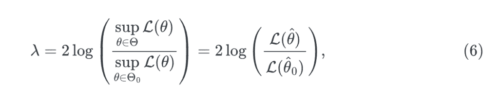
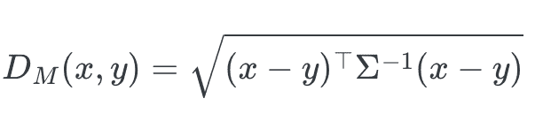
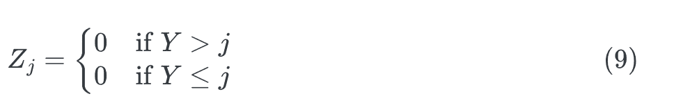
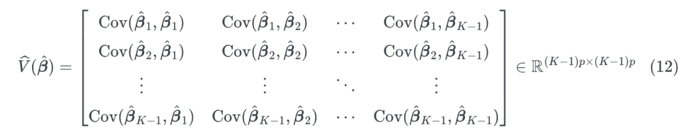
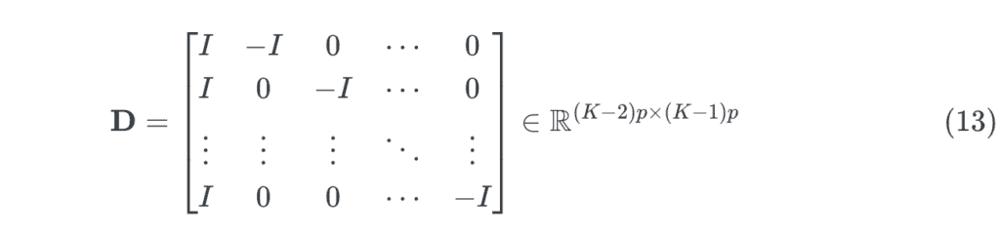
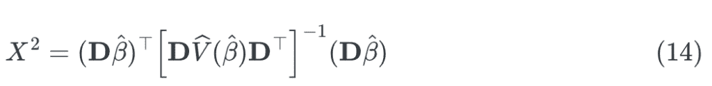
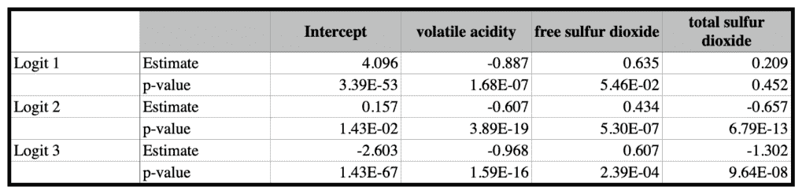
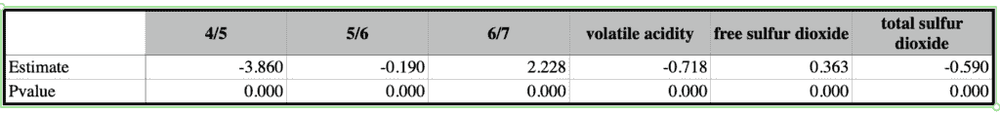

# 探索比例优势模型在有序逻辑回归中的应用

> 原文：[`towardsdatascience.com/proportional-odds-model-for-ordinal-logistic-regression/`](https://towardsdatascience.com/proportional-odds-model-for-ordinal-logistic-regression/)
> 
> 你可以在本帖子的底部找到这个示例的完整代码。

<mdspan datatext="el1749598376012" class="mdspan-comment">有序逻辑回归中的比例优势模型首先由 McCullagh ([1980](https://jumbong.github.io/personal-website/00_tds/proportional_ordinal_regression.html#ref-mccullagh1980regression))) 提出。该模型将二元逻辑回归扩展到因变量为有序的情况[它由有序的类别值组成]。比例优势模型建立在几个假设之上，包括观测值的独立性、对数优势的线性、预测变量之间不存在多重共线性，以及比例优势假设。最后一个假设指出，回归系数在有序因变量的所有阈值上都是恒定的。确保比例优势假设成立对于模型的效度和可解释性至关重要。

文献中提出了多种方法来评估模型拟合度，特别是检验比例优势假设。在本文中，我们重点关注 Brant 在其文章《评估比例优势模型中比例优势的检验》（Brant ([1990](https://jumbong.github.io/personal-website/00_tds/proportional_ordinal_regression.html#ref-brant1990assessing))) 中提出的两种方法。我们还展示了如何在 Python 中实现这些技术，并将它们应用于实际数据。无论你来自数据科学、机器学习还是统计学背景，本文旨在帮助你了解如何评估有序逻辑回归中的模型拟合度。

本文分为四个主要部分：

1.  第一部分介绍了比例优势模型及其假设。

1.  第二部分讨论了如何使用似然比检验来评估比例优势假设。

1.  第三部分涵盖了使用单独拟合方法来评估比例优势假设。

1.  最后一部分提供了示例，说明了如何使用数据在 Python 中实现这些评估方法。

### 1. 比例优势模型的简介

在介绍模型之前，我们首先介绍数据结构。我们假设有 N 个独立观测值。每个观测值由一个包含 p 个解释变量的向量 X[i] = (X[i1], X[i2], …, X[ip]) 表示，同时还有一个取有序值（从 1 到 K）的因变量或响应变量 Y。比例优势模型专门对响应变量 Y 的累积分布概率进行建模，定义为 γ[j] = P(Y ≤ j | X[i])，其中 j = 1, 2, …, K – 1，并将这些概率视为解释变量 X[i] 的函数。该模型如下公式所示：

**logit(γⱼ) = log(γⱼ / (1 − γⱼ)) = θⱼ − βᵀ𝐗. (1)**

其中 θⱼ 是每个类别 j 的截距，并满足条件 θ₁ < θ₂ < ⋯ < θₖ₋₁，β 是回归系数向量，对所有类别均相同。

我们观察到系数 θⱼ 在响应变量 Y 的各个类别间呈现单调趋势。

该模型也称为分组连续模型，因为它可以通过假设存在一个连续潜变量 Y∗ 推导得出。该潜变量服从条件均值为 η = βᵀ𝐗 的线性回归模型，并通过如下定义的阈值 θⱼ 与观测到的有序变量 Y 相关联：

**y∗ = βᵀ𝐗+ϵ,        (2)**

其中 ϵ 是误差项（随机噪声），在比例优势模型中通常假定服从标准逻辑分布。

潜变量 Y^* 未被观测到，它被由阈值 θ₁, θ₂, …, θₖ₋₁ 定义的区间所分割，从而生成观测到的有序变量 Y，如下所示：


在下一节中，我们将介绍 Brant ([1990](http://localhost:5126/00_tds/proportional_ordinal_regression.html#ref-brant1990assessing)) 提出的用于评估比例优势假设的各种方法。这些方法评估回归系数在有序响应变量定义的各个类别间是否保持恒定。

### 2\. 评估比例优势假设：似然比检验

为了评估有序逻辑回归模型中的比例优势假设，Brant ([1990](http://localhost:5126/00_tds/proportional_ordinal_regression.html#ref-brant1990assessing)) 提出使用似然比检验。该方法首先拟合一个限制较少的模型，其中允许回归系数在不同类别间变化。该模型表达为：

**logit(γ[j]) = θ[j] − β[j]^T𝐗**。对于 j = 1, …, K-1 (4)

其中 β[j] 是每个类别 j 的回归系数向量 [维度为 p 的向量]。此处允许系数 β[j] 在不同类别间变化，这意味着比例优势假设不成立。然后我们使用常规的似然比检验来评估该假设：

**H[0] : β[j] = β 对于所有 j = 1, 2, …, K−1.** (5)

为了执行此检验，我们进行似然比检验，比较无约束（非比例或饱和）模型与有约束（比例优势或简化）模型。

在进一步讨论之前，我们先简要回顾如何在假设检验中使用似然比检验。假设我们要评估原假设 H[0] : θ ∈ Θ[0] 与备择假设 H[1] : θ ∈ Θ[1]，

似然比统计量定义为：



其中 𝓛(θ) 是似然函数，θ̂ 是完整模型下的最大似然估计（MLE），θ̂₀ 是约束模型下的 MLE。检验统计量 λ 遵循具有等于完整模型和约束模型之间参数数量差异的自由度的卡方分布。

这里，θ̂ 是完整（无约束）模型下的最大似然估计（MLE），θ̂₀ 是在比例优势假设成立的约束模型下的 MLE。该

在零假设下，检验统计量 λ 遵循卡方分布。

在一般设置中，假设完整参数空间表示为

Θ = (θ₁, θ₂, …, θ[q], …, θ[p])，

在零假设下的限制参数空间是

Θ₀ = (θ₁, θ₂, …, θ[q])。

**(注意：这些参数是通用的，不应与比例优势模型中的 K−1 个阈值或截距混淆。)**

现在，让我们将这种方法应用于具有比例优势假设的有序逻辑回归模型。假设我们的响应变量有 K 个有序类别，并且我们有 p 个预测变量。为了使用似然比检验来评估比例优势假设，我们需要比较两个模型：

##### 1. 无约束模型（非比例优势）：

此模型允许每个结果阈值都有自己的回归系数集，这意味着我们不假设回归系数在所有阈值中相等。该模型定义为：

**logit(γ[j]) = θ[j] − β[j]^T𝐗**. 对于 j = 1, …, K-1 (7)

+   有 K−1 个阈值（截距）参数：θ[1], θ[2], … , θ[K-1]

+   每个阈值都有自己的斜率系数向量 β[j] 的维度 p

因此，无约束模型中的参数总数为：

**(K−1) 阈值 + (K−1)×p 斜率 = (K−1)(p+1).**

##### 2. 比例优势模型：

该模型假设所有阈值只有一个回归系数集：

**logit(γ[j]) = θ[j] − β^T𝐗**. 对于 j = 1, …, K-1 (8)

+   有 K−1 个阈值参数

+   对于所有 j，有一个共同的斜率向量 β（维度 p x 1）

因此，比例优势模型中的参数总数为：

**(K−1) 阈值 + p 斜率 = (K−1) + p**

因此，似然比检验统计量遵循具有自由度的卡方分布：

**df = [(K−1)×(p+1)]−[(K−1)+p] = (K−2)×p**

此测试提供了一种正式的方法来评估给定的数据是否满足比例优势假设。在 1%、5% 或任何其他传统阈值下，如果测试统计量 λ 超过具有 **(K−2)×p** 个自由度的卡方分布的临界值，则拒绝比例优势假设。

换句话说，我们拒绝零假设

H[0] : β[1] = β[2] = ⋯ =β[K-1] = β,

这表明回归系数在所有累积 logit 中是相等的。这种测试的优点是易于实现，并提供了对比例概率假设的整体评估。

在下一节中，我们将介绍基于单独拟合的比例概率测试。

### 3. 评估比例概率假设：单独拟合方法。

要理解这一节，首先理解马氏距离的概念和性质是重要的。这种距离用于量化在具有相同分布的多变量空间中两个向量有多不同。

令 x = (x₁, x₂, …, xₚ)ᵀ和 y = (y₁, y₂, …, yₚ)ᵀ。它们之间的马氏距离定义为：



其中Σ是分布的协方差矩阵。马氏距离的平方与卡方(χ²)分布密切相关。具体来说，如果 X ∼ N(μ, Σ)是一个具有均值μ和协方差矩阵Σ的 p 维正态分布的随机向量，那么马氏距离 Dₘ(X, μ)²遵循具有 p 个自由度的χ²分布。

理解这种关系对于使用单独模型拟合评估比例性至关重要——我们将在稍后回到这个话题。

实际上，作者指出，评估比例概率假设的自然方法是拟合一组 K−1 个二进制逻辑回归模型（其中 K 是响应变量类别的数量），然后使用估计参数的统计性质来构建比例概率假设的检验统计量。

程序如下：

首先，我们为有序响应变量 Y 的每个阈值 j = 1, 2, …, K−1 构建单独的二进制逻辑回归模型。对于每个阈值 j，我们定义一个二进制变量 Z[j]，如果观测值超过阈值 j，则其值为 1，否则为 0。具体来说，我们有：



概率地，π[j] = P(Z[j] = 1 | X) = 1−γ[j]满足逻辑回归模型：

**logit(π[j] ) = θ[j] − β^T𝐗**. 对于 j = 1, …, K-1 (10)

然后，在这个背景下评估比例概率假设涉及检验回归系数β[j]在所有 K−1 个模型中是否相等的假设。这等价于检验以下假设：

H[0] : β[1] = β[2] = ⋯ = β[K-1] (11)

用β̂ⱼ表示每个二进制模型的回归系数的最大似然估计量，用β̂ = (β̂₁ᵀ, β̂₂ᵀ, …, β̂ₖ₋₁ᵀ)ᵀ表示估计量的全局向量。这个向量是渐近正态分布的，因此𝔼(β̂ⱼ) ≈ β，协方差矩阵为𝕍(β̂ⱼ)。该矩阵的通项 cov(β̂ⱼ, β̂ₖ)需要确定，并给出如下：



其中 Cov(β̂ⱼ, β̂ₖ) 是第 j 个和第 k 个二元模型估计系数之间的协方差。渐近协方差 Cov(β̂ⱼ, β̂ₖ) 是通过删除以下矩阵的第一行和第一列获得的：

**(X[+]^T W[jj] X₊)^(-1)X[+]^TW[jl]X[+] (Xᵗ W[ll]X₊)**^(-1)

其中 W[jl]: n × n 是对角线矩阵，典型项为 π[l] − π[j] π[l]，对于 j ≤ l，**X[+]**: n x p 矩阵表示左加一列（1 的列）的解释变量矩阵。

为了评估比例优势假设，Brant 构建了一个矩阵 𝐃，它捕捉了系数 β̂ⱼ 之间的差异。回想一下，每个向量 β̂ⱼ 的维度为 p。矩阵 𝐃 定义如下：



其中 𝐼 是大小为 p × p 的单位矩阵。矩阵 𝐃 的第一行对应于第一和第二个系数之间的差值，第二行对应于第二和第三个系数之间的差值，以此类推，直到最后一行，对应于 (K − 2)-th 和 (K − 1)-th 系数之间的差值。我们可以注意到，𝐃β̂ 的乘积将产生一个系数 β̂ⱼ 之间的差值向量。

一旦构建了矩阵 𝐃，Brant 定义 Wald 统计量 X² 来检验比例优势假设。这个统计量可以解释为向量 𝐃β̂ 和零向量之间的 Mahalanobis 距离。Wald 统计量定义为以下：



这将在零假设下渐近地服从具有 (K − 2)p 个自由度的 χ² 分布。这里的挑战在于确定方差-协方差矩阵 𝕍̂(β̂)。在他的文章中，Brant 提供了该方差-协方差矩阵的一个显式估计量，该估计量基于每个二元模型的最大似然估计量 β̂ⱼ。

在接下来的章节中，我们将使用 Python 实现这些方法，使用 `statsmodels` 包进行回归和统计测试。

### 示例：比例优势测试的应用

本例中的数据来自“葡萄酒质量”数据集，该数据集包含有关红葡萄酒样本及其质量评分的信息。该数据集包括 1,599 个观测值和 12 个变量。目标变量“质量”是序数，最初的范围从 3 到 8。为了确保每个组都有足够的观测值，我们将类别 3 和 4 合并为一个单独的类别（标记为 4），并将类别 7 和 8 合并为一个单独的类别（标记为 7），因此响应变量有四个水平。然后，我们使用四分位数范围（IQR）方法处理解释变量的异常值。最后，我们选择三个预测变量——挥发性酸度、游离二氧化硫和总二氧化硫——用于我们的序数逻辑回归模型，并将这些变量标准化，使其均值为 0，标准差为 1。

下面的表 1 和表 2 分别展示了三个二元逻辑回归模型和成比例优势模型的结果。在这些表中，可以看到一些差异，尤其是在“挥发性酸度”系数上。例如，第一个和第二个二元模型之间“挥发性酸度”系数的差异为-0.280，而第二个和第三个模型之间的差异为 0.361。这些差异表明，成比例优势假设可能不成立[我也建议计算差异的标准误差以获得更大的置信度]。



表 1：拟合系数，单独的二元逻辑回归/拟合。



表 2：成比例优势模型的拟合系数

为了评估成比例优势假设的整体显著性，我们进行了似然比检验，与具有 6 个自由度的卡方分布相比，检验统计量为 LR = 53.207，p 值为 1.066 × 10^(-9)。这一结果表明，在 5%的显著性水平下，成比例优势假设被违反，表明该模型可能不适合数据。我们还使用单独拟合方法进一步调查这一假设。Wald 检验统计量为 X² = 41.880，p 值为 1.232 × 10^(-7)，同样基于具有 6 个自由度的卡方分布。这进一步证实了在 5%的显著性水平下，成比例优势假设被违反。

### 结论

本文有两个主要目标：首先，说明如何在**有序逻辑回归**的背景下测试**成比例优势假设**；其次，鼓励读者探索 Brant（[1990](https://jumbong.github.io/personal-website/00_tds/proportional_ordinal_regression.html#ref-brant1990assessing)）的文章，以更深入地了解这一主题。

Brant 的工作不仅限于评估成比例优势假设——他还提供了评估有序逻辑回归模型整体充分性的方法。例如，他讨论了如何测试潜在变量 Y∗是否真正遵循逻辑分布，或者是否可能更合适的替代链接函数。

在本文中，我们专注于对成比例优势假设的全球评估，而没有调查哪些具体的系数可能导致了任何违反。Brant 也讨论了这种更细致的分析，这就是为什么我们**强烈建议**您全文阅读他的文章。

### 图片来源

本文中的所有图像和可视化均由作者使用 Python（pandas、matplotlib、seaborn 和 plotly）以及 Excel 创建，除非另有说明。

### 参考文献

Brant, Rollin. 1990. “在有序逻辑回归的成比例优势模型中评估成比例性。” *Biometrics*, 1171–78.

McCullagh, Peter. 1980. “有序数据的回归模型.” *《皇家统计学会会刊：方法系列》42 (2): 109–27*.

Wasserman, L. (2013). *《所有统计学：统计推断简明课程》*. Springer Science & Business Media.

Cortez, P., Cerdeira, A., Almeida, F., Matos, T., & Reis, J. (2009). Wine Quality [数据集]. UCI 机器学习库. https://doi.org/10.24432/C56S3T.

### 数据与许可

本文使用的数据集根据 Creative Commons Attribution 4.0 International (CC BY 4.0)许可进行授权。

这允许使用、分发和改编，甚至用于商业目的，前提是给予适当的信用。

原始数据集由[作者/机构名称]发布，可在[此处](https://archive.ics.uci.edu/datasets)找到。

### 代码

> 导入数据和观测数

```py
import pandas as pd

data = pd.read_csv("winequality-red.csv", sep=";")
data.head()

# Repartition de la variable cible quality 

data['quality'].value_counts(normalize=False).sort_index()

# I want to regroup modalities 3, 4 and the modalities 7 and 8
data['quality'] = data['quality'].replace({3: 4, 8: 7})
data['quality'].value_counts(normalize=False).sort_index()
print("Number of observations:", data.shape[0])
```

> 让我们使用 IQR 方法处理预测变量的异常值（不包括目标变量*quality*）。

```py
def remove_outliers_iqr(df, column):
    Q1 = df[column].quantile(0.25)
    Q3 = df[column].quantile(0.75)
    IQR = Q3 - Q1
    lower_bound = Q1 - 1.5 * IQR
    upper_bound = Q3 + 1.5 * IQR
    return df[(df[column] >= lower_bound) & (df[column] <= upper_bound)]
for col in data.columns:
    if col != 'quality':
        data = remove_outliers_iqr(data, col)
```

> 为每个质量组创建每个变量的箱线图

```py
var_names_without_quality = [col for col in data.columns if col != 'quality']

##  Create the boxplot of each variable per group of quality
import matplotlib.pyplot as plt
import seaborn as sns
plt.figure(figsize=(15, 10))
for i, var in enumerate(var_names_without_quality):
    plt.subplot(3, 4, i + 1)
    sns.boxplot(x='quality', y=var, data=data)
    plt.title(f'Boxplot of {var} by quality')
    plt.xlabel('Quality')
    plt.ylabel(var)
plt.tight_layout()
plt.show()
```

> 实现有序回归进行比例性检验。

```py
# Implement the ordered logistic regression to variables 'volatile acidity', 'free sulfur dioxide', and 'total sulfur dioxide'
from statsmodels.miscmodels.ordinal_model import OrderedModel
from sklearn.preprocessing import StandardScaler
explanatory_vars = ['volatile acidity', 'free sulfur dioxide', 'total sulfur dioxide']
# Standardize the explanatory variables
data[explanatory_vars] = StandardScaler().fit_transform(data[explanatory_vars])

def fit_ordered_logistic_regression(data, response_var, explanatory_vars):
    model = OrderedModel(
        data[response_var],
        data[explanatory_vars],
        distr='logit'
    )
    result = model.fit(method='bfgs', disp=False)
    return result
response_var = 'quality'

result = fit_ordered_logistic_regression(data, response_var, explanatory_vars)
print(result.summary())
# Compute the log-likelihood of the model
log_reduced = result.llf
print(f"Log-likelihood of the reduced model: {log_reduced}")
```

> 计算完整的多项式模型

```py
# The likelihood ratio test
# Compute the full multinomial model
import statsmodels.api as sm

data_sm = sm.add_constant(data[explanatory_vars])
model_full = sm.MNLogit(data[response_var], data_sm)
result_full = model_full.fit(method='bfgs', disp=False)
#summary
print(result_full.summary())
# Commpute the log-likelihood of the full model
log_full = result_full.llf
print(f"Log-likelihood of the full model: {log_full}")

# Compute the likelihood ratio statistic

LR_statistic = 2 * (log_full - log_reduced)
print(f"Likelihood Ratio Statistic: {LR_statistic}")

# Compute the degrees of freedom
df1 = (num_of_thresholds - 1) * len(explanatory_vars)
df2 = result_full.df_model - OrderedModel(
        data[response_var],
        data[explanatory_vars],
        distr='logit'
    ).fit().df_model
print(f"Degrees of Freedom: {df1}")
print(f"Degrees of Freedom for the full model: {df2}")

# Compute the p-value
from scipy.stats import chi2
print("The LR statistic :", LR_statistic)
p_value = chi2.sf(LR_statistic, df1)
print(f"P-value: {p_value}")
if p_value < 0.05:
    print("Reject the null hypothesis: The proportional odds assumption is violated.")
else:
    print("Fail to reject the null hypothesis: The proportional odds assumption holds.")
```

> 下面的代码构建了 Wald 统计量 X² = (𝐃β̂)ᵀ [𝐃𝕍̂(β̂)𝐃ᵀ]⁻¹ (𝐃β̂)
> 
> 检查比例概率假设的 K-1 二元 Logit 估计

```py
import numpy as np
import statsmodels.api as sm
import pandas as pd

def fit_binary_models(data, explanatory_vars, y):
    """
    Fits a sequence of binary logistic regression models to assess the proportional odds assumption.

    Parameters:
    - data: Original pandas DataFrame (must include all variables)
    - explanatory_vars: List of predictor variables (features)
    - y: Array-like ordinal target variable (n,) — e.g., categories like 4, 5, 6, 7

    Returns:
    - binary_models: List of fitted binary Logit model objects (statsmodels)
    - beta_hat: (K−1) × (p+1) array of estimated coefficients (including intercept)
    - var_hat: List of (p+1) × (p+1) variance-covariance matrices for each model
    - z_mat: DataFrame containing the binary transformed targets z_j (for inspection/debugging)
    - thresholds: List of thresholds used to create the binary models
    """
    qualities = np.sort(np.unique(y))           # Sorted unique categories of y
    thresholds = qualities[:-1]                 # Thresholds to define binary models (K−1)
    p = len(explanatory_vars)
    n = len(y)
    K_1 = len(thresholds)

    binary_models = []
    beta_hat = np.full((K_1, p+1), np.nan)      # To store estimated coefficients
    p_values_beta_hat = np.full((K_1, p+1), np.nan)  # To store p-values
    var_hat = []
    z_mat = pd.DataFrame(index=np.arange(n))   # For storing binary target versions
    X_with_const = sm.add_constant(data[explanatory_vars])  # Design matrix with intercept

    # Fit one binary logistic regression for each threshold
    for j, t in enumerate(thresholds):
        z_j = (y > t).astype(int)               # Binary target: 1 if y > t, else 0
        z_mat[f'z>{t}'] = z_j
        model = sm.Logit(z_j, X_with_const)
        res = model.fit(disp=0)
        binary_models.append(res)
        beta_hat[j, :] = res.params.values      # Store coefficients (with intercept)
        p_values_beta_hat[j, :] = res.pvalues.values
        var_hat.append(res.cov_params().values) # Store full (p+1) × (p+1) covariance matrix

    return binary_models, beta_hat, X_with_const, var_hat, z_mat, thresholds

# Apply the function to the data
binary_models, beta_hat, X_with_const, var_hat, z_mat, thresholds = fit_binary_models(
    data, explanatory_vars, data[response_var]
)

# Display the estimated coefficients
print("Estimated coefficients (beta_hat):")
print(beta_hat)

# Display the design matrix (predictors with intercept)
print("Design matrix X (with constant):")
print(X_with_const)

# Display the thresholds used to define the binary models
print("Thresholds:")
print(thresholds)

# Display first few rows of the binary response matrix
print("z_mat (created binary target variables):")
print(z_mat.head()) 
```

> 计算拟合概率(π̂)以构建 W[jl] n x n 的对角矩阵。

```py
def compute_pi_hat(binary_models, X_with_const):
    """
    Computes the fitted probabilities π̂ for each binary logistic regression model.

    Parameters:
    - binary_models: List of fitted Logit model results (from statsmodels)
    - X_with_const : 2D array of shape (n, p+1) — the design matrix with intercept included

    Returns:
    - pi_hat: 2D array of shape (n, K−1) containing the predicted probabilities
              from each of the K−1 binary models
    """
    n = X_with_const.shape[0]           # Number of observations
    K_1 = len(binary_models)            # Number of binary models (K−1)
    pi_hat = np.full((n, K_1), np.nan)  # Initialize prediction matrix

    # Compute fitted probabilities for each binary model
    for m, model in enumerate(binary_models):
        pi_hat[:, m] = model.predict(X_with_const)

    return pi_hat

# Assuming you already have:
# - binary_models: list of fitted models from previous function
# - X_with_const: design matrix with intercept (n, p+1)

pi_hat = compute_pi_hat(binary_models, X_with_const)

# Display the shape and a preview of the predicted probabilities matrix
print("Shape of pi_hat:", pi_hat.shape)      # Expected shape: (n, K−1)
print("Preview of pi_hat:\n", pi_hat[:5, :]) # First 5 rows 
```

> 分两步计算总体估计协方差矩阵 V̂(β̃)。

```py
import numpy as np

# Assemble Global Variance-Covariance Matrix for Slope Coefficients (Excluding Intercept)
def assemble_varBeta(pi_hat, X_with_const):
    """
    Constructs the global variance-covariance matrix (varBeta) for the slope coefficients
    estimated from a sequence of binary logistic regressions.

    Parameters:
    - pi_hat        : Array of shape (n, K−1), fitted probabilities for each binary model
    - X_with_const  : Array of shape (n, p+1), design matrix including intercept

    Returns:
    - varBeta : Array of shape ((K−1)*p, (K−1)*p), block matrix of variances and covariances
                across binary models (intercept excluded)
    """
    # Ensure input is a NumPy array
    X = X_with_const.values if hasattr(X_with_const, 'values') else np.asarray(X_with_const)
    n, p1 = X.shape               # p1 = p + 1 (including intercept)
    p = p1 - 1
    K_1 = pi_hat.shape[1]

    # Initialize global variance-covariance matrix
    varBeta = np.zeros((K_1 * p, K_1 * p))

    for j in range(K_1):
        pi_j = pi_hat[:, j]
        Wj = np.diag(pi_j * (1 - pi_j))         # Diagonal weight matrix for model j
        XtWjX_inv = np.linalg.pinv(X.T @ Wj @ X)

        # Remove intercept (exclude first row/column)
        var_block_diag = XtWjX_inv[1:, 1:]
        row_start = j * p
        row_end = (j + 1) * p
        varBeta[row_start:row_end, row_start:row_end] = var_block_diag

        for l in range(j + 1, K_1):
            pi_l = pi_hat[:, l]
            Wml = np.diag(pi_l - pi_j * pi_l)
            Wl = np.diag(pi_l * (1 - pi_l))
            XtWlX_inv = np.linalg.pinv(X.T @ Wl @ X)

            # Compute off-diagonal block
            block_cov = (XtWjX_inv @ (X.T @ Wml @ X) @ XtWlX_inv)[1:, 1:]

            col_start = l * p
            col_end = (l + 1) * p

            # Fill symmetric blocks
            varBeta[row_start:row_end, col_start:col_end] = block_cov
            varBeta[col_start:col_end, row_start:row_end] = block_cov.T

    return varBeta

# Compute the global variance-covariance matrix
varBeta = assemble_varBeta(pi_hat, X_with_const)

# Display shape and preview
print("Shape of varBeta:", varBeta.shape)       # Expected: ((K−1) * p, (K−1) * p)
print("Preview of varBeta:\n", varBeta[:5, :5]) # Display top-left corner 
```

```py
 # Fill Diagonal Blocks of the Global Variance-Covariance Matrix (Excluding Intercept)
def fill_varBeta_diagonal(varBeta, var_hat):
    """
    Fills the diagonal blocks of the global variance-covariance matrix varBeta using
    the individual covariance matrices from each binary model (excluding intercept terms).

    Parameters:
    - varBeta : Global variance-covariance matrix of shape ((K−1)*p, (K−1)*p)
    - var_hat : List of (p+1 × p+1) variance-covariance matrices (including intercept)

    Returns:
    - varBeta : Updated matrix with diagonal blocks filled (intercept removed)
    """
    K_1 = len(var_hat)                        # Number of binary models
    p = var_hat[0].shape[0] - 1               # Number of predictors (excluding intercept)

    for m in range(K_1):
        block = var_hat[m][1:, 1:]            # Remove intercept from variance block
        row_start = m * p
        row_end = (m + 1) * p
        varBeta[row_start:row_end, row_start:row_end] = block

    return varBeta

# Flatten the slope coefficients (excluding intercept) into betaStar
betaStar = beta_hat[:, 1:].flatten()

# Fill the diagonal blocks of the global variance-covariance matrix
varBeta = fill_varBeta_diagonal(varBeta, var_hat)

# Output diagnostics
print("Shape of varBeta after diagonal fill:", varBeta.shape)           # Expected: ((K−1)*p, (K−1)*p)
print("Preview of varBeta after diagonal fill:\n", varBeta[:5, :5])     # Top-left preview 
```

> 构建一个(k – 2)p x (k – I)p 的对比矩阵。

```py
import numpy as np

def construct_D(K_1, p):
    """
    Constructs the contrast matrix D of shape ((K−2)*p, (K−1)*p) used in the Wald test
    for assessing the proportional odds assumption in ordinal logistic regression.

    Parameters:
    - K_1 : int — number of binary models, i.e., K−1 thresholds
    - p   : int — number of explanatory variables (excluding intercept)

    Returns:
    - D   : numpy array of shape ((K−2)*p, (K−1)*p), encoding differences between
            successive β_j slope vectors (excluding intercepts)
    """
    D = np.zeros(((K_1 - 1) * p, K_1 * p))  # Initialize D matrix
    I = np.eye(p)                          # Identity matrix for block insertion

    # Fill each row block with I and -I at appropriate positions
    for i in range(K_1 - 1):               # i = 0 to (K−2)
        for j in range(K_1):               # j = 0 to (K−1)
            if j == i:
                temp = I                   # Positive identity block
            elif j == i + 1:
                temp = -I                  # Negative identity block
            else:
                temp = np.zeros((p, p))    # Zero block otherwise

            row_start = i * p
            row_end = (i + 1) * p
            col_start = j * p
            col_end = (j + 1) * p

            D[row_start:row_end, col_start:col_end] += temp

    return D

# Construct and inspect D
D = construct_D(len(thresholds), len(explanatory_vars))
print("Shape of D:", D.shape)            # Expected: ((K−2)*p, (K−1)*p)
print("Preview of D:\n", D[:5, :5])      # Top-left corner of D 
```

> 计算检验比例概率假设的 Wald 统计量

```py
def wald_statistic(D, betaStar, varBeta):
    """
    Computes the Wald chi-square statistic X² to test the proportional odds assumption.

    Parameters:
    - D         : (K−2)p × (K−1)p matrix that encodes linear contrasts between slope coefficients
    - betaStar  : Flattened vector of estimated slopes (excluding intercepts), shape ((K−1)*p,)
    - varBeta   : Global variance-covariance matrix of shape ((K−1)*p, (K−1)*p)

    Returns:
    - X2        : Wald test statistic (scalar)
    """
    Db = D @ betaStar                   # Linear contrasts of beta coefficients
    V = D @ varBeta @ D.T              # Variance of the contrasts
    inv_V = np.linalg.inv(V)           # Pseudo-inverse ensures numerical stability
    X2 = float(Db.T @ inv_V @ Db)      # Wald statistic

    return X2

# Assumptions:
K_1 = len(binary_models)               # Number of binary models (K−1)
p = len(explanatory_vars)             # Number of explanatory variables (excluding intercept)

# Construct contrast matrix D
D = construct_D(K_1, p)

# Compute the Wald statistic
X2 = wald_statistic(D, betaStar, varBeta)

# Degrees of freedom: (K−2) × p
ddl = (K_1 - 1) * p

# Compute the p-value from the chi-square distribution
from scipy.stats import chi2
pval = 1 - chi2.cdf(X2, ddl)

# Output results
print(f"Wald statistic X² = {X2:.4f}")
print(f"Degrees of freedom = {ddl}")
print(f"p-value = {pval:.4g}") 
```
