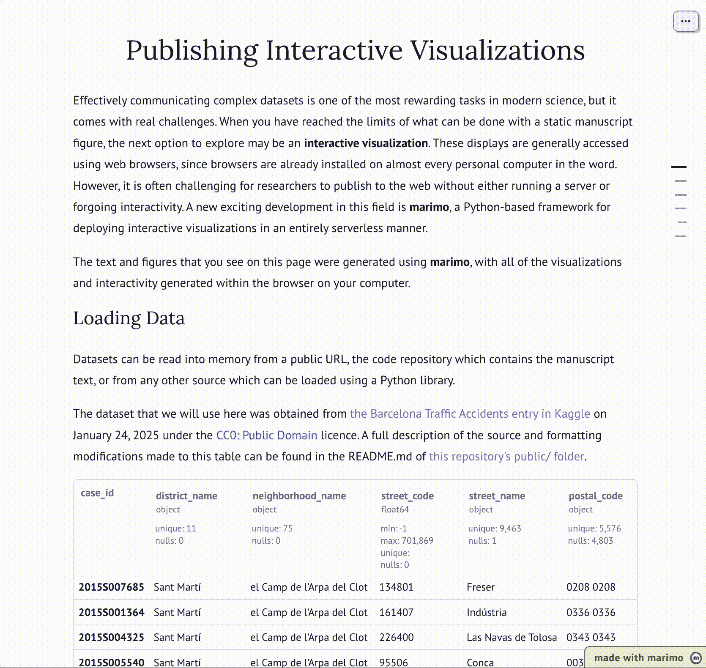
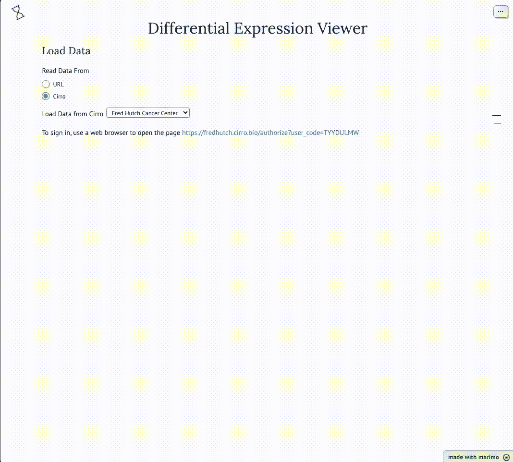

# 使用 Python 和 Marimo 免费发布交互式数据可视化

> 原文：[`towardsdatascience.com/publish-interactive-data-visualizations-for-free-with-python-and-marimo/`](https://towardsdatascience.com/publish-interactive-data-visualizations-for-free-with-python-and-marimo/)

在数据科学领域工作，仅使用静态图像很难分享复杂数据集的见解。描述有趣数据形状和意义的所有方面并不总是包含在少量预先生成的图像中。虽然我们有强大的技术可用于展示交互式图像——观众可以旋转、过滤、缩放，并通常探索复杂数据——但它们总是伴随着权衡。

在这里，我分享了我使用最近发布的 Python 库[marimo](https://marimo.io)的经验，它为在整个数据科学领域发布交互式可视化开辟了令人兴奋的新机遇。

## 交互式数据可视化

选择数据可视化展示方法时需要考虑的权衡可以归纳为三个类别：

+   **功能**—我能向用户展示哪些可视化和交互性？

+   **发布成本**—展示此可视化给用户需要哪些资源（例如，运行服务器，托管网站）？

+   **易用性**—我需要提前学习多少新技能集/代码库？

**JavaScript** 是便携式交互性的基础。每个用户都在他们的电脑上安装了网络浏览器，并且有许多不同的框架可用于显示您可能想象到的任何程度的交互性或可视化（例如，这个[使用 three.js 制作的惊人事物画廊](https://threejs.org/)）。由于应用程序是在用户的电脑上运行的，因此不需要昂贵的服务器。然而，对于数据科学社区来说，一个显著的缺点是易用性，因为 JavaScript 没有许多数据科学家用于数据处理、绘图和交互性的高级（即易于使用）库。

**Python** 提供了一个有用的比较点。由于其 [持续增长的受欢迎程度](https://flatironschool.com/blog/python-popularity-the-rise-of-a-global-programming-language/)，有些人称之为 [“Python 时代”](https://towardsdatascience.com/we-are-living-in-the-era-of-python-bc032d595f6a)。对于数据科学家来说，Python 与 R 一样，是快速有效地处理复杂数据的基石语言之一。虽然 Python 可能比 JavaScript 更容易使用，但在展示交互式可视化方面选择较少。一些提供交互性和可视化的流行项目包括 [Flask](https://flask.palletsprojects.com/en/stable/)、[Dash](https://dash.plotly.com/) 和 [Streamlit](https://streamlit.io/)（也值得提及——[bokeh](https://docs.bokeh.org/en/latest/docs/gallery.html)、[HoloViews](https://holoviews.org/)、[altair](https://altair-viz.github.io/altair-tutorial/README.html) 和 [plotly](https://plotly.com/python/)）。使用 Python 的最大权衡是发布成本——将工具交付给用户。与 [shinyapps](https://www.shinyapps.io/) 需要运行中的计算机来提供可视化一样，这些基于 Python 的框架主要是基于服务器的。这并不是对有预算的作者来说不可逾越的障碍，但它确实限制了能够利用特定项目的用户数量。

[**Pyodide**](https://pyodide.org/en/stable/) 是一个有趣的折中方案——Python 代码直接在网页浏览器中使用 [WebAssembly](https://webassembly.org/)（WASM）运行。由于资源限制（只有 1 个线程和 2GB 内存），这使得它在进行数据科学重负载方面不切实际。*然而*，这足以构建可视化和根据用户输入进行更新。因为它在浏览器中运行，所以不需要服务器来托管。以 Pyodide 为基础的工具值得探索，因为它们为数据科学家提供了一个机会，可以直接在用户的计算机上运行 Python 代码，而无需安装或运行任何超出网页浏览器的程序。

作为旁白，[我之前对](https://towardsdatascience.com/python-based-data-viz-with-no-installation-required-aaf2358c881)一个尝试这种方法的项自有兴趣：[stlite](https://github.com/whitphx/stlite)，[一个浏览器内的 Streamlit 实现](https://edit.share.stlite.net/)，允许您将这些灵活强大的应用程序部署到广泛的用户。然而，一个核心限制是 Streamlit 本身与 stlite（Streamlit 的 WASM 版本）不同，这意味着并非所有功能都得到支持，并且项目的进步依赖于两个独立的小组在兼容的路线下工作。

## 介绍：Marimo

这把我们带到了 [**Marimo**](https://marimo.io)。

marimo 的首次公开[公告](https://news.ycombinator.com/item?id=38971966)和[介绍](https://www.reddit.com/r/MachineLearning/comments/191rdwq/p_i_built_marimo_an_opensource_reactive_python/)是在 2024 年 1 月，因此该项目非常新，并且它具有独特的功能组合：

+   界面类似于 Jupyter **笔记本**，用户会感到熟悉。

+   单元的执行是**反应性的**，因此更新一个单元将重新运行所有依赖于其输出的单元。

+   **用户输入**可以使用灵活的 UI 组件进行捕获。

+   笔记本可以快速转换为**应用程序**，隐藏代码，只显示输入/输出元素。

+   应用程序可以在本地运行或转换为**静态网页**，使用 WASM/Pyodide。

marimo 以一种适合典型数据科学家技能集的方式平衡了技术的权衡：

+   **功能**—用户输入和视觉显示功能相当广泛，[通过 Altair 和 Plotly 图表支持用户输入](https://docs.marimo.io/guides/working_with_data/plotting/#reactive-plots)。

+   **出版成本**—作为静态网页部署基本上是免费的—不需要服务器

+   **易用性**—对于熟悉 Python 笔记本的用户来说，marimo 会感觉非常熟悉，并且容易上手。

## 在网络上发布 Marimo 应用程序

要开始使用 marimo，最好的方式是阅读[他们的详细文档](https://docs.marimo.io/)。

作为数据科学中可能有用的一种显示类型的简单示例，包括穿插在交互式显示中的说明性文本，我创建了一个基本的 [GitHub 仓库](https://github.com/FredHutch/marimo-publication)。您可以在这里亲自尝试[它](https://fredhutch.github.io/marimo-publication/)。

使用 marimo 创建的示例出版物（图片由作者创建）

只需一点代码，用户就可以：

+   附加源数据集

+   生成具有灵活交互性的可视化

+   编写描述他们发现情况的叙述性文本

+   免费发布到网络（即使用 GitHub Pages）

更多详情，请阅读他们的[关于网络发布的文档](https://docs.marimo.io/guides/publishing/github_pages/#export-to-wasm-powered-html)和[用于部署到 GitHub Pages 的模板仓库](https://github.com/marimo-team/marimo-gh-pages-template)。

## 公开应用程序/私有数据

这种新技术为协作提供了令人兴奋的新机会—将应用程序公开发布给世界，但用户只能看到他们有权访问的特定数据集。

与为每个应用程序构建专用数据后端不同，用户数据可以存储在通用的后端中，该后端可以使用 Python 客户端库安全地认证和访问—所有这些都在用户的网络浏览器内完成。例如，用户会收到一个 OAuth 登录链接，该链接将使用后端进行认证，并允许应用程序临时访问输入数据。

作为一种概念验证，我构建了一个简单的可视化应用程序，该应用程序连接到[Cirro 数据平台](https://cirro.bio)，该平台在我所在的机构用于管理科学数据。完全公开：我曾是构建该平台并在其作为独立公司分离出来之前的一部分团队。通过这种方式，用户可以：

+   加载公共可视化应用程序——托管在 GitHub Pages 上

+   安全地连接到他们的私有数据存储

+   加载用于显示的适当数据集

+   分享一个链接，该链接将授权的合作伙伴引导到相同的数据

您可以在[这里](https://fredhutch.github.io/differential-expression-viewer/?url=https%3A%2F%2Ffredhutch.github.io%2Fdifferential-expression-viewer%2Fpublic%2FDE_results.csv.gz)亲自尝试。

示例可视化应用程序获取用户控制的数据（图片由作者创建）

作为一名数据科学家，这种发布免费和开源可视化应用程序的方法，这些应用程序可以用来与私有数据集进行交互，是非常令人兴奋的。构建和发布一个新的应用程序可能需要数小时和数天，而不是数周和数年，这使得研究人员能够快速与合作伙伴分享他们的见解，然后将它们发布到更广泛的世界。
