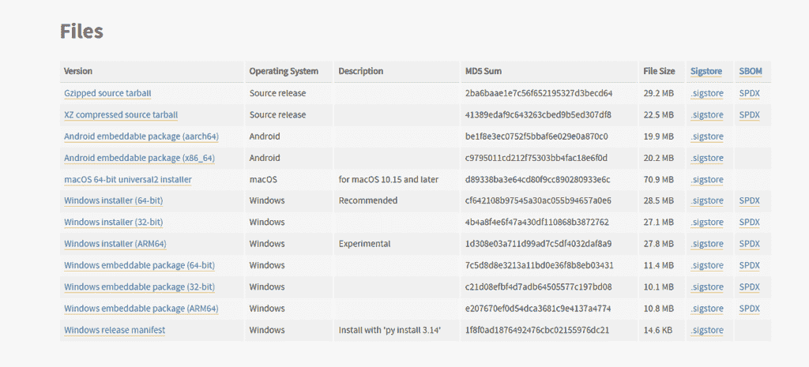
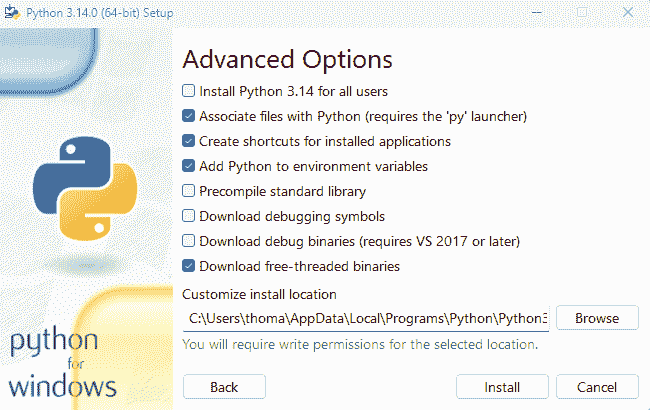

# Python 3.14 和 GIL 的终结

> 原文：[`towardsdatascience.com/python-3-14-and-the-end-of-the-gil/`](https://towardsdatascience.com/python-3-14-and-the-end-of-the-gil/)

<mdspan datatext="el1760675204264" class="mdspan-comment">Python 3.14，一个</mdspan>近期最受期待的版本终于发布了。这是因为在这个版本中实现了几个令人兴奋的增强功能，包括：

**子解释器**。这些在 Python 中已经可用 20 年了，但为了使用它们，你必须降低到用 C 语言编码。现在可以直接从 Python 本身使用它们。

**T-Strings**。模板字符串是自定义字符串处理的新方法。它们使用熟悉的 f-strings 语法，但与 f-strings 不同，它们返回一个表示字符串的静态和插值部分的对象，而不是一个简单的字符串。

**即时编译器**。这仍然是一个实验性功能，不应在生产系统中使用；然而，它承诺为特定用例提供性能提升。

Python 3.14 中还有许多其他增强功能，但本文不是关于那些或上面提到的那些。

相反，我们将讨论这个版本中可能最受期待的功能：免费线程的 Python，也称为无 GIL 的 Python。请注意，常规的 Python 3.14 仍然会启用 GIL 运行，但你可以下载（或构建）一个单独的、免费线程的版本。我将向您展示如何下载和安装它，并通过几个编码示例，演示常规和无 GIL 的 Python 3.14 之间的运行时间比较。

## 什么是 GIL？

许多人可能都知道 Python 中的全局解释器锁（GIL）。GIL 是一个互斥锁——一种锁定机制，用于同步对资源的访问，在 Python 中确保一次只有一个线程执行字节码。

一方面，这有几个优点，包括使线程和内存管理更容易进行，避免竞争条件，以及将 Python 与 C/C++ 库集成。

另一方面，GIL 可能会抑制并行性。在有 GIL 的情况下，单个 Python 进程内多个 CPU 核心之间的 CPU 密集型任务的真正并行性是不可能的。

## 这为什么重要

总之，**“性能”。**

因为免费线程执行可以同时使用系统上所有可用的核心，代码通常会运行得更快。作为数据科学家和 ML 或数据工程师，这不仅适用于你的代码，也适用于构建你依赖的系统、框架和库的代码。

许多机器学习和数据科学任务都是 CPU 密集型的，尤其是在模型训练和数据预处理期间。移除 GIL 可能会导致这些 CPU 密集型任务的性能显著提升。

许多 Python 中流行的库由于必须绕过 GIL 而面临限制。其移除可能导致：-

+   这些库的简化和可能更有效的实现

+   现有库中的新优化机会

+   开发能够充分利用并行处理的新库

## 安装免费线程版的 Python 版本

如果你是一名 Linux 用户，获取免费线程版 Python 的唯一方法是自行构建。如果你像我一样使用 Windows（或 macOS），你可以使用 Python 网站上的官方安装程序来安装它。在安装过程中，你可以自定义安装。寻找一个复选框以包含免费线程的二进制文件。这将安装一个单独的解释器，你可以使用它来运行你的代码而不受全局解释器锁（GIL）的限制。我将演示在 64 位 Windows 系统上如何进行安装。

要开始，点击以下 URL：

[`www.python.org/downloads/release/python-3140`](https://www.python.org/downloads/release/python-3140)

然后向下滚动，直到你看到如下表格。



来自 Python 网站的图片

现在，点击 Windows 安装程序（64 位）链接。一旦可执行文件下载完成，打开它，在显示的第一个安装屏幕上，点击**自定义安装**链接。请注意，我也勾选了**将 Python.exe 添加到路径**的复选框。

在下一屏，选择你想要添加到安装中的可选组件，然后再次点击**下一步**。此时，你应该看到一个类似这样的屏幕，



来自 Python 安装程序的图片

确保选中**下载免费线程二进制文件**旁边的复选框。我还勾选了**为所有用户安装 Python 3.14**选项。

点击安装按钮。

下载完成后，在安装文件夹中，寻找一个以't'结尾的 Python 应用程序文件。这是无 GIL 的 Python 版本。应用程序文件，名为 Python，是常规 Python 可执行文件。在我的情况下，无 GIL 的 Python 被称为 Python3.14t。你可以通过在命令行中输入以下内容来检查它是否已正确安装。

```py
C:\Users\thoma>python3.14t

Python 3.14.0 free-threading build (tags/v3.14.0:ebf955d, Oct  7 2025, 10:13:09) [MSC v.1944 64 bit (AMD64)] on win32
Type "help", "copyright", "credits" or "license" for more information.
>>> 
```

如果你看到这个，那么你已经设置好了。否则，请检查安装位置是否已添加到你的 PATH 环境变量中，或者再次检查你的安装步骤。

由于我们将比较无 GIL 的 Python 运行时与常规 Python 运行时，我们也应该验证这一点是否已正确安装。

```py
C:\Users\thoma>python
Python 3.14.0 (tags/v3.14.0:ebf955d, Oct  7 2025, 10:15:03) [MSC v.1944 64 bit (AMD64)] on win32
Type "help", "copyright", "credits" or "license" for more information.
>>>
```

## GIL 与无 GIL 的 Python

**示例 1—寻找素数**

将以下内容输入到 Python 代码文件中，例如 example1.py

```py
#
# example1.py
#

import threading
import time
import multiprocessing

def is_prime(n):
    """Check if a number is prime."""
    if n < 2:
        return False
    for i in range(2, int(n**0.5) + 1):
        if n % i == 0:
            return False
    return True

def find_primes(start, end):
    """Find all prime numbers in the given range."""
    primes = []
    for num in range(start, end + 1):
        if is_prime(num):
            primes.append(num)
    return primes

def worker(worker_id, start, end):
    """Worker function to find primes in a specific range."""
    print(f"Worker {worker_id} starting")
    primes = find_primes(start, end)
    print(f"Worker {worker_id} found {len(primes)} primes")

def main():
    """Main function to coordinate the multi-threaded prime search."""
    start_time = time.time()

    # Get the number of CPU cores
    num_cores = multiprocessing.cpu_count()
    print(f"Number of CPU cores: {num_cores}")

    # Define the range for prime search
    total_range = 2_000_000
    chunk_size = total_range // num_cores

    threads = []
    # Create and start threads equal to the number of cores
    for i in range(num_cores):
        start = i * chunk_size + 1
        end = (i + 1) * chunk_size if i < num_cores - 1 else total_range
        thread = threading.Thread(target=worker, args=(i, start, end))
        threads.append(thread)
        thread.start()

    # Wait for all threads to complete
    for thread in threads:
        thread.join()

    # Calculate and print the total execution time
    end_time = time.time()
    total_time = end_time - start_time
    print(f"All workers completed in {total_time:.2f} seconds")

if __name__ == "__main__":
    main()
```

**is_prime**函数检查给定的数字是否为素数。

**find_primes**函数在给定的范围内找到所有的素数。

**工作**函数是每个线程的目标，在特定范围内寻找素数。

**主**函数协调多线程素数搜索：

+   它将总范围划分为与系统核心数（在我的情况下是 32）相对应的块数。

+   创建并启动 32 个线程，每个线程搜索范围的一小部分。

+   等待所有线程完成。

+   计算并打印总执行时间。

**计时结果**

让我们看看使用常规 Python 运行需要多长时间。

```py
C:\Users\thoma\projects\python-gil>python example1.py
Number of CPU cores: 32
Worker 0 starting
Worker 1 starting
Worker 0 found 6275 primes
Worker 2 starting
Worker 3 starting
Worker 1 found 5459 primes
Worker 4 starting
Worker 2 found 5230 primes
Worker 3 found 5080 primes
...
...
Worker 27 found 4346 primes
Worker 15 starting
Worker 22 found 4439 primes
Worker 30 found 4338 primes
Worker 28 found 4338 primes
Worker 31 found 4304 primes
Worker 11 found 4612 primes
Worker 15 found 4492 primes
Worker 25 found 4346 primes
Worker 26 found 4377 primes
All workers completed in 3.70 seconds
```

现在，使用无 GIL 版本：

```py
C:\Users\thoma\projects\python-gil>python3.14t example1.py
Number of CPU cores: 32
Worker 0 starting
Worker 1 starting
Worker 2 starting
Worker 3 starting
...
...
Worker 19 found 4430 primes
Worker 29 found 4345 primes
Worker 30 found 4338 primes
Worker 18 found 4520 primes
Worker 26 found 4377 primes
Worker 27 found 4346 primes
Worker 22 found 4439 primes
Worker 23 found 4403 primes
Worker 31 found 4304 primes
Worker 28 found 4338 primes
All workers completed in 0.35 seconds
```

这是一个令人印象深刻的开始。运行时间提高了 10 倍。

**示例 2—同时读取多个文件**

在这个例子中，我们将使用 concurrent.futures 模型同时读取多个文本文件，并计算并显示每个文件中的行数和单词数。

在我们这样做之前，我们需要一些数据文件来处理。您可以使用以下 Python 代码来完成此操作。它为每个文件生成 1,000,000 个随机、无意义的句子，并将它们写入 20 个单独的文本文件，例如 sentences_01.txt、sentences_02.txt 等。

```py
import os
import random
import time

# --- Configuration ---
NUM_FILES = 20
SENTENCES_PER_FILE = 1_000_000
WORDS_PER_SENTENCE_MIN = 8
WORDS_PER_SENTENCE_MAX = 20
OUTPUT_DIR = "fake_sentences" # Directory to save the files

# --- 1\. Generate a pool of words ---
# Using a small list of common words for variety.
# In a real scenario, you might load a much larger dictionary.
word_pool = [
    "the", "be", "to", "of", "and", "a", "in", "that", "have", "i",
    "it", "for", "not", "on", "with", "he", "as", "you", "do", "at",
    "this", "but", "his", "by", "from", "they", "we", "say", "her", "she",
    "or", "an", "will", "my", "one", "all", "would", "there", "their", "what",
    "so", "up", "out", "if", "about", "who", "get", "which", "go", "me",
    "when", "make", "can", "like", "time", "no", "just", "him", "know", "take",
    "people", "into", "year", "your", "good", "some", "could", "them", "see", "other",
    "than", "then", "now", "look", "only", "come", "its", "over", "think", "also",
    "back", "after", "use", "two", "how", "our", "work", "first", "well", "way",
    "even", "new", "want", "because", "any", "these", "give", "day", "most", "us",
    "apple", "banana", "car", "house", "computer", "phone", "coffee", "water", "sky", "tree",
    "happy", "sad", "big", "small", "fast", "slow", "red", "blue", "green", "yellow"
]

# Ensure output directory exists
os.makedirs(OUTPUT_DIR, exist_ok=True)

print(f"Starting to generate {NUM_FILES} files, each with {SENTENCES_PER_FILE:,} sentences.")
print(f"Total sentences to generate: {NUM_FILES * SENTENCES_PER_FILE:,}")
start_time = time.time()

for file_idx in range(NUM_FILES):
    file_name = os.path.join(OUTPUT_DIR, f"sentences_{file_idx + 1:02d}.txt")

    print(f"\nGenerating and writing to {file_name}...")
    file_start_time = time.time()

    with open(file_name, 'w', encoding='utf-8') as f:
        for sentence_idx in range(SENTENCES_PER_FILE):
            # 2\. Construct fake sentences
            num_words = random.randint(WORDS_PER_SENTENCE_MIN, WORDS_PER_SENTENCE_MAX)

            # Randomly pick words
            sentence_words = random.choices(word_pool, k=num_words)

            # Join words, capitalize first, add a period
            sentence = " ".join(sentence_words).capitalize() + ".\n"

            # 3\. Write to file
            f.write(sentence)

            # Optional: Print progress for large files
            if (sentence_idx + 1) % 100_000 == 0:
                print(f"  {sentence_idx + 1:,} sentences written to {file_name}...")

    file_end_time = time.time()
    print(f"Finished {file_name} in {file_end_time - file_start_time:.2f} seconds.")

total_end_time = time.time()
print(f"\nAll files generated! Total time: {total_end_time - start_time:.2f} seconds.")
print(f"Files saved in the '{OUTPUT_DIR}' directory.")
```

这是 sentences_01.txt 的开头部分，

```py
New then coffee have who banana his their how year also there i take.
Phone go or with over who one at phone there on will.
With or how my us him our sad as do be take well way with green small these.
Not from the two that so good slow new.
See look water me do new work new into on which be tree how an would out sad.
By be into then work into we they sky slow that all who also.
Come use would have back from as after in back he give there red also first see.
Only come so well big into some my into time its banana for come or what work.
How only coffee out way to just tree when by there for computer work people sky by this into.
Than say out on it how she apple computer us well then sky sky day by other after not.
You happy know a slow for for happy then also with apple think look go when.
As who for than two we up any can banana at.
Coffee a up of up these green small this us give we.
These we do because how know me computer banana back phone way time in what.
```

好的，现在我们可以计时读取这些文件需要多长时间了。这是我们将要测试的代码。它简单地读取每个文件，计算行数和单词数，并输出结果。

```py
import concurrent.futures
import os
import time

def process_file(filename):
    """
    Process a single file, returning its line count and word count.
    """
    try:
        with open(filename, 'r') as file:
            content = file.read()
            lines = content.split('\n')
            words = content.split()
            return filename, len(lines), len(words)
    except Exception as e:
        return filename, -1, -1  # Return -1 for both counts if there's an error

def main():
    start_time = time.time()  # Start the timer

    # List to hold our files
    files = [f"./data/sentences_{i:02d}.txt" for i in range(1, 21)]  # Assumes 20 files named file_1.txt to file_20.txt

    # Use a ThreadPoolExecutor to process files in parallel
    with concurrent.futures.ThreadPoolExecutor(max_workers=10) as executor:
        # Submit all file processing tasks
        future_to_file = {executor.submit(process_file, file): file for file in files}

        # Process results as they complete
        for future in concurrent.futures.as_completed(future_to_file):
            file = future_to_file[future]
            try:
                filename, line_count, word_count = future.result()
                if line_count == -1:
                    print(f"Error processing {filename}")
                else:
                    print(f"{filename}: {line_count} lines, {word_count} words")
            except Exception as exc:
                print(f'{file} generated an exception: {exc}')

    end_time = time.time()  # End the timer
    print(f"Total execution time: {end_time - start_time:.2f} seconds")

if __name__ == "__main__":
    main()
```

**计时结果**

首先是常规 Python。

```py
C:\Users\thoma\projects\python-gil>python example2.py

./data/sentences_09.txt: 1000001 lines, 14003319 words
./data/sentences_01.txt: 1000001 lines, 13999989 words
./data/sentences_05.txt: 1000001 lines, 13998447 words
./data/sentences_07.txt: 1000001 lines, 14004961 words
./data/sentences_02.txt: 1000001 lines, 14009745 words
./data/sentences_10.txt: 1000001 lines, 14000166 words
./data/sentences_06.txt: 1000001 lines, 13995223 words
./data/sentences_04.txt: 1000001 lines, 14005683 words
./data/sentences_03.txt: 1000001 lines, 14004290 words
./data/sentences_12.txt: 1000001 lines, 13997193 words
./data/sentences_08.txt: 1000001 lines, 13995506 words
./data/sentences_15.txt: 1000001 lines, 13998555 words
./data/sentences_11.txt: 1000001 lines, 14001299 words
./data/sentences_14.txt: 1000001 lines, 13998347 words
./data/sentences_13.txt: 1000001 lines, 13998035 words
./data/sentences_19.txt: 1000001 lines, 13999642 words
./data/sentences_20.txt: 1000001 lines, 14001696 words
./data/sentences_17.txt: 1000001 lines, 14000184 words
./data/sentences_18.txt: 1000001 lines, 13999968 words
./data/sentences_16.txt: 1000001 lines, 14000771 words
Total execution time: 18.77 seconds
```

现在是无 GIL 版本

```py
C:\Users\thoma\projects\python-gil>python3.14t example2.py

./data/sentences_02.txt: 1000001 lines, 14009745 words
./data/sentences_03.txt: 1000001 lines, 14004290 words
./data/sentences_08.txt: 1000001 lines, 13995506 words
./data/sentences_07.txt: 1000001 lines, 14004961 words
./data/sentences_04.txt: 1000001 lines, 14005683 words
./data/sentences_05.txt: 1000001 lines, 13998447 words
./data/sentences_01.txt: 1000001 lines, 13999989 words
./data/sentences_10.txt: 1000001 lines, 14000166 words
./data/sentences_06.txt: 1000001 lines, 13995223 words
./data/sentences_09.txt: 1000001 lines, 14003319 words
./data/sentences_12.txt: 1000001 lines, 13997193 words
./data/sentences_11.txt: 1000001 lines, 14001299 words
./data/sentences_18.txt: 1000001 lines, 13999968 words
./data/sentences_14.txt: 1000001 lines, 13998347 words
./data/sentences_13.txt: 1000001 lines, 13998035 words
./data/sentences_16.txt: 1000001 lines, 14000771 words
./data/sentences_19.txt: 1000001 lines, 13999642 words
./data/sentences_15.txt: 1000001 lines, 13998555 words
./data/sentences_17.txt: 1000001 lines, 14000184 words
./data/sentences_20.txt: 1000001 lines, 14001696 words
Total execution time: 5.13 seconds
```

不及我们第一个示例那么令人印象深刻，但仍然非常好，显示了超过 3 倍的性能提升。

**示例 3—矩阵乘法**

我们将使用**线程**模块来完成这个任务。这是我们将要运行的代码。

```py
import threading
import time
import os

def multiply_matrices(A, B, result, start_row, end_row):
    """Multiply a submatrix of A and B and store the result in the corresponding submatrix of result."""
    for i in range(start_row, end_row):
        for j in range(len(B[0])):
            sum_val = 0
            for k in range(len(B)):
                sum_val += A[i][k] * B[k][j]
            result[i][j] = sum_val

def main():
    """Main function to coordinate the multi-threaded matrix multiplication."""
    start_time = time.time()

    # Define the size of the matrices
    size = 1000
    A = [[1 for _ in range(size)] for _ in range(size)]
    B = [[1 for _ in range(size)] for _ in range(size)]
    result = [[0 for _ in range(size)] for _ in range(size)]

    # Get the number of CPU cores to decide on the number of threads
    num_threads = os.cpu_count()
    print(f"Number of CPU cores: {num_threads}")

    chunk_size = size // num_threads

    threads = []
    # Create and start threads
    for i in range(num_threads):
        start_row = i * chunk_size
        end_row = size if i == num_threads - 1 else (i + 1) * chunk_size
        thread = threading.Thread(target=multiply_matrices, args=(A, B, result, start_row, end_row))
        threads.append(thread)
        thread.start()

    # Wait for all threads to complete
    for thread in threads:
        thread.join()

    end_time = time.time()

    # Just print a small corner to verify
    print("Top-left 5x5 corner of the result matrix:")
    for r_idx in range(5):
        print(result[r_idx][:5])

    print(f"Total execution time (matrix multiplication): {end_time - start_time:.2f} seconds")

if __name__ == "__main__":
    main()
```

该代码使用多个 CPU 核心并行执行两个 1000×1000 矩阵的矩阵乘法。它将结果矩阵分成块，将每个块分配给一个单独的进程（等于 CPU 核心的数量），每个进程独立计算其分配的矩阵乘法部分。最后，它等待所有进程完成，并报告总执行时间，展示了如何利用多进程来加速 CPU 密集型任务。

**计时结果**

常规 Python:

```py
C:\Users\thoma\projects\python-gil>python example3.py
Number of CPU cores: 32
Top-left 5x5 corner of the result matrix:
[1000, 1000, 1000, 1000, 1000]
[1000, 1000, 1000, 1000, 1000]
[1000, 1000, 1000, 1000, 1000]
[1000, 1000, 1000, 1000, 1000]
[1000, 1000, 1000, 1000, 1000]
Total execution time (matrix multiplication): 43.95 seconds
```

无 GIL Python：

```py
C:\Users\thoma\projects\python-gil>python3.14t example3.py
Number of CPU cores: 32
Top-left 5x5 corner of the result matrix:
[1000, 1000, 1000, 1000, 1000]
[1000, 1000, 1000, 1000, 1000]
[1000, 1000, 1000, 1000, 1000]
[1000, 1000, 1000, 1000, 1000]
[1000, 1000, 1000, 1000, 1000]
Total execution time (matrix multiplication): 4.56 seconds
```

再次，我们使用无 GIL Python 几乎提高了 10 倍。还不错。

**无 GIL 并不总是更好。**

一个值得注意的有趣点是，在这个最后的测试中，我还尝试了代码的多进程版本。结果显示，常规 Python 比无 GIL Python 快得多（28%）。我不会展示代码，只展示结果，

**计时**

首先是常规 Python（多进程）。

```py
C:\Users\thoma\projects\python-gil>python example4.py
Number of CPU cores: 32
Top-left 5x5 corner of the result matrix:
[1000, 1000, 1000, 1000, 1000]
[1000, 1000, 1000, 1000, 1000]
[1000, 1000, 1000, 1000, 1000]
[1000, 1000, 1000, 1000, 1000]
[1000, 1000, 1000, 1000, 1000]
Total execution time (matrix multiplication): 4.49 seconds
```

无 GIL 版本（多进程）

```py
C:\Users\thoma\projects\python-gil>python3.14t example4.py
Number of CPU cores: 32
Top-left 5x5 corner of the result matrix:
[1000, 1000, 1000, 1000, 1000]
[1000, 1000, 1000, 1000, 1000]
[1000, 1000, 1000, 1000, 1000]
[1000, 1000, 1000, 1000, 1000]
[1000, 1000, 1000, 1000, 1000]
Total execution time (matrix multiplication): 6.29 seconds
```

在这些情况下，始终进行彻底的测试是很重要的。

请记住，这些最后的例子**仅仅是**测试，用于展示 GIL 和无 GIL Python 之间的差异。使用外部库，如 NumPy，进行矩阵乘法至少会比两者快一个数量级。

如果您决定在工作负载中使用无线程 Python，还有一个需要注意的点，那就是并非所有您可能想要使用的第三方库都与它兼容。不兼容库的列表很小，并且随着每个版本的发布而缩小，但这是需要记住的。要查看这些库的列表，请点击下面的链接。

[`ft-checker.com`](https://ft-checker.com)

## 摘要

在本文中，我们讨论了最新 Python 3.14 版本可能具有划时代意义的特性：引入了一个可选的“无锁线程”版本，该版本移除了全局解释器锁（GIL）。GIL 是标准 Python 中的一种机制，通过确保一次只有一个线程执行 Python 字节码来简化内存管理。虽然承认在某些情况下这可能是有用的，但它阻止了多核 CPU 在 CPU 密集型任务上的真正并行处理。

在无锁线程构建中移除 GIL 主要旨在提升 **性能**。这对于数据科学家和机器学习工程师特别有用，因为他们的工作通常涉及 CPU 密集型操作，如模型训练和数据预处理。这一变化允许 Python 代码在单个进程中同时利用所有可用的 CPU 核心，可能带来显著的速度提升。

为了展示影响，文章展示了几个性能比较：

+   **寻找素数：** 一个多线程脚本实现了显著的 **10 倍性能提升**，执行时间从标准 Python 中的 3.70 秒降低到 GIL 无版本中的 0.35 秒。

+   **同时读取多个文件：** 使用线程池处理 20 个大型文本文件的 I/O 密集型任务比标准解释器快 **3 倍以上**，完成时间为 5.13 秒，而使用标准解释器则需要 18.77 秒。

+   **矩阵乘法：** 一个定制的、多线程的矩阵乘法代码也实现了近 **10 倍的速度提升**，GIL 无版本完成时间为 4.56 秒，而标准版本则需要 43.95 秒。

然而，我也解释了 GIL 无版本并非 Python 代码开发的万能药。出人意料的是，矩阵乘法代码的多进程版本在标准 Python（4.49 秒）中运行速度比 GIL 无版本构建（6.29 秒）更快。这突出了测试和基准测试特定应用程序的重要性，因为 GIL 无版本中进程管理的开销有时会抵消其好处。

我还提到了一个注意事项，即并非所有第三方 Python 库都与 GIL 无 Python 兼容，并给出了一个可以查看不兼容库列表的网址。
