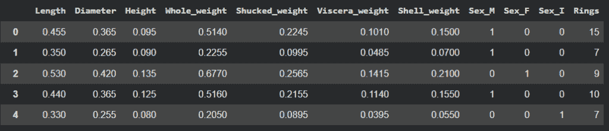
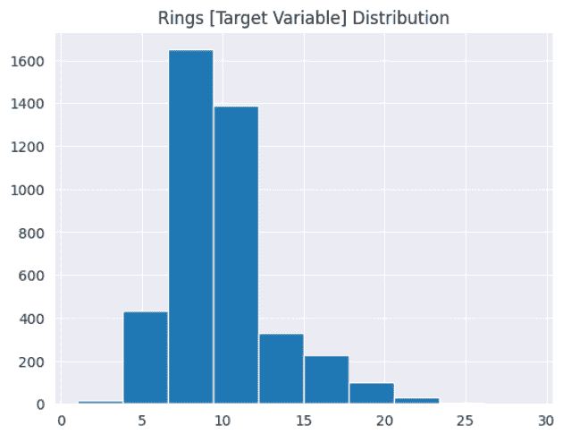
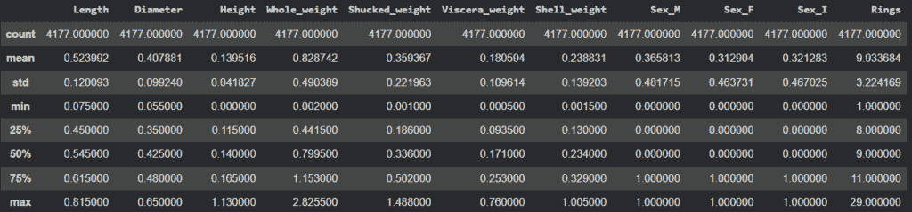
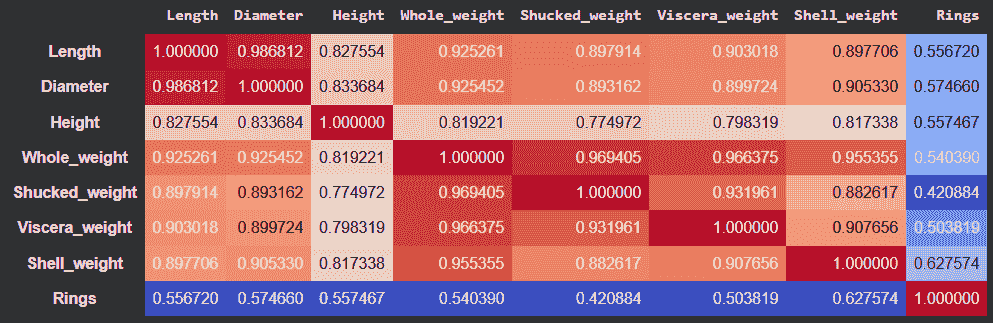
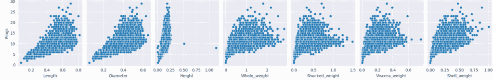
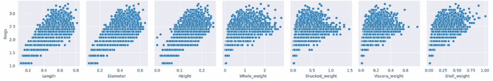
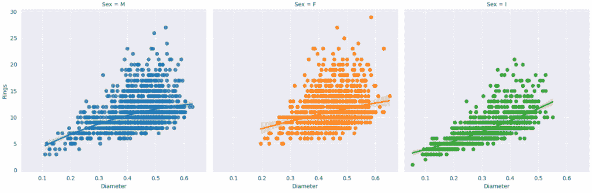
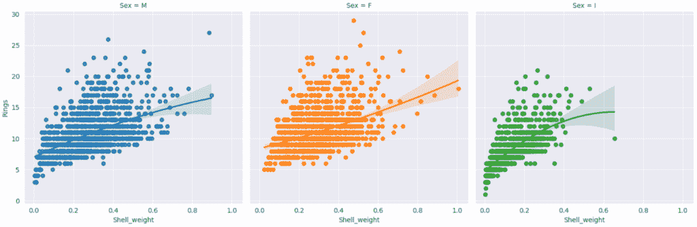
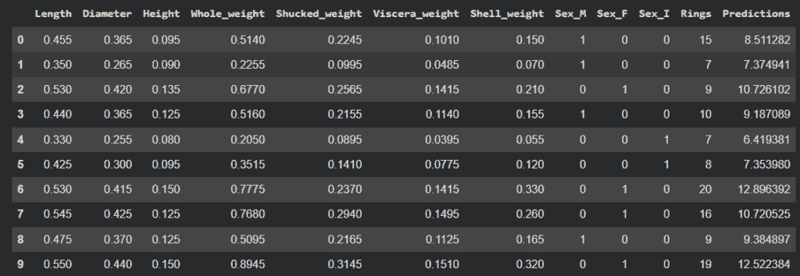
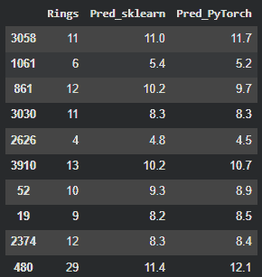

# PyTorch 入门教程：从头开始构建多元回归模型

> 原文：[`towardsdatascience.com/pytorch-tutorial-for-beginners-build-a-multiple-regression-model-from-scratch/`](https://towardsdatascience.com/pytorch-tutorial-for-beginners-build-a-multiple-regression-model-from-scratch/)

<mdspan datatext="el1763492731328" class="mdspan-comment">在 LLMs 变得流行之前的一段时间里</mdspan>，机器学习框架和深度学习框架之间几乎有一条可见的线。

讲座主要集中在 Scikit-Learn、XGBoost 等机器学习工具上，而 PyTorch 和 TensorFlow 在深度学习问题时占据了主导地位。

然而，在人工智能爆炸之后，我看到的 PyTorch 在场景中的主导地位远超过 TensorFlow。这两个框架都非常强大，使数据科学家能够解决不同类型的问题，自然语言处理就是其中之一，因此再次提高了深度学习的普及率。

好吧，在这篇文章中，我的想法不是谈论自然语言处理，而是我将使用一个具有两个目标的多元线性回归问题：

+   教你如何使用 PyTorch 创建模型

+   分享线性回归的知识，这在其他教程中并不常见。

让我们深入探讨。

## 数据准备

好的，让我免于给你一个关于线性回归的华丽定义。你可能已经在无数的教程中看过很多次了。所以，只需说，*当你有一个变量 Y 你想预测，另一个变量 X 可以用一条直线解释 Y 的变化，本质上就是线性回归。*

### 数据集

对于这个练习，让我们使用鲍鱼数据集 [[1](https://archive.ics.uci.edu/dataset/1/abalone)]。

> Nash, W., Sellers, T., Talbot, S., Cawthorn, A., & Ford, W. (1994). 鲍鱼 [数据集]. UCI 机器学习仓库. https://doi.org/10.24432/C55C7W.

根据数据集文档，*鲍鱼的年龄是通过切割壳体通过圆锥体，染色，并通过显微镜计数环数来确定的，这是一项无聊且耗时的工作。其他更容易获得的测量值用于预测年龄。*

因此，让我们继续加载数据。此外，我们还将对变量`Sex`进行 One Hot 编码，因为它是最唯一的分类变量。

```py
# Data Load
from ucimlrepo import fetch_ucirepo
import pandas as pd
import numpy as np
import matplotlib.pyplot as plt
import seaborn as sns
sns.set_style('darkgrid')
from feature_engine.encoding import OneHotEncoder

# fetch dataset
abalone = fetch_ucirepo(id=1)

# data (as pandas dataframes)
X = abalone.data.features
y = abalone.data.targets

# One Hot Encode Sex
ohe = OneHotEncoder(variables=['Sex'])
X = ohe.fit_transform(X)

# View
df = pd.concat([X,y], axis=1)
```

这里是数据集。



数据集标题。图片由作者提供。

那么，为了创建更好的模型，让我们探索数据。

### 探索数据

在探索数据集时，我喜欢执行的第一个步骤是：

1. 检查目标变量的分布。

```py
# Looking at our Target variable
plt.hist(y)
plt.title('Rings [Target Variable] Distribution');
```

图表显示目标变量不是正态分布的。这可能会影响回归，但通常可以通过幂变换，如对数或 Box-Cox 来纠正。



目标变量分布。图片由作者提供。

2. 查看统计描述。

统计数据可以显示重要信息，如平均值、标准差，并容易发现最小值或最大值方面的差异。解释变量在较小范围内相当不错，并且具有相同的尺度。目标变量（`Rings`）则处于不同的尺度。

```py
# Statistical description
df.describe()
```



统计描述。图片由作者提供。

接下来，让我们检查相关性。

```py
# Looking at the correlations
(df
 .drop(['Sex_M', 'Sex_I', 'Sex_F'],axis=1)
 .corr()
 .style
 .background_gradient(cmap='coolwarm')
)
```



相关性。图片由作者提供。

解释变量与`Rings`有中等至强的相关性。我们还可以看到`Whole_weight`与`Shucked_weight`、`Viscera_weight`和`Shell_weight`之间存在一些共线性。`Length`和`Diameter`也是共线的。我们可以在稍后测试移除它们。

```py
sns.pairplot(df);
```

当我们绘制成对的散点图并观察变量与`Rings`的关系时，我们可以迅速识别出一些问题。

+   同方差性假设被违反。这意味着关系在方差方面不是均匀的。

+   看看这些图形成了一个圆锥形，随着 X 值的增加，Y 值的方差增加。当估计 X 变量较高值时的`Rings`值时，估计将不会非常准确。

+   当`Height > 0.3`时，变量`Height`至少有两个非常明显的异常值。



对数散点图未进行转换。图片由作者提供。

移除异常值并将目标变量转换为对数将导致下一对数散点图。它更好，但仍然没有解决同方差性问题。



转换后的对数散点图。图片由作者提供。

我们可以进行的另一个快速探索是绘制一些图形来检查变量在按`Sex`变量分组时的关系。

当`Sex=I`时，变量`Diameter`与线性关系最为密切，但这仅此而已。

```py
# Create a FacetGrid with scatterplots
sns.lmplot(x="Diameter", y="Rings", hue="Sex", col="Sex", order=2, data=df);
```



直径 x Rings。图片由作者提供。

另一方面，`Shell_weight`对于高值来说分散度太大，扭曲了线性关系。

```py
# Create a FacetGrid with scatterplots
sns.lmplot(x="Shell_weight", y="Rings", hue="Sex", col="Sex", data=df);
```



壳重 x Rings。图片由作者提供。

所有这些都表明，对于这个数据集来说，线性回归模型将极具挑战性，并且很可能会失败。但我们仍然想尝试。

顺便说一下，我不记得看到过一篇帖子，其中我们真正地分析了出了什么问题。所以，通过这样做，我们也可以学到宝贵的经验教训。

## 模型构建：使用 Scikit-Learn

让我们运行 sklearn 模型，并使用均方根误差对其进行评估。

```py
from sklearn.linear_model import LinearRegression
from sklearn.metrics import root_mean_squared_error

df2 = df.query('Height < 0.3 and Rings > 2 ').copy()
X = df2.drop(['Rings'], axis=1)
y = np.log(df2['Rings'])

lr = LinearRegression()
lr.fit(X, y)

predictions = lr.predict(X)

df2['Predictions'] = np.exp(predictions)
print(root_mean_squared_error(df2['Rings'], df2['Predictions']))
```

```py
2.2383762717104916
```

如果我们查看标题，我们可以确认模型在估计较高值（例如，行 0、6、7 和 9）时存在困难。



带预测的标题。图片由作者提供。

### 退一步：尝试其他转换

好吧。那么我们现在能做什么？

可能需要移除更多的异常值并再次尝试。让我们尝试使用无监督算法来找到更多的异常值。我们将应用 **局部异常因子**，移除 5% 的异常值。

我们还将消除多重共线性，移除 `Whole_weight` 和 `Length`。

```py
from sklearn.neighbors import LocalOutlierFactor
from sklearn.preprocessing import StandardScaler
from sklearn.pipeline import Pipeline

# fetch dataset
abalone = fetch_ucirepo(id=1)

# data (as pandas dataframes)
X = abalone.data.features
y = abalone.data.targets

# One Hot Encode Sex
ohe = OneHotEncoder(variables=['Sex'])
X = ohe.fit_transform(X)

# Drop Whole Weight and Length (multicolinearity)
X.drop(['Whole_weight', 'Length'], axis=1, inplace=True)

# View
df = pd.concat([X,y], axis=1)

# Let's create a Pipeline to scale the data and find outliers using KNN Classifier
steps = [
('scale', StandardScaler()),
('LOF', LocalOutlierFactor(contamination=0.05))
]
# Fit and predict
outliers = Pipeline(steps).fit_predict(X)

# Add column
df['outliers'] = outliers

# Modeling
df2 = df.query('Height < 0.3 and Rings > 2 and outliers != -1').copy()
X = df2.drop(['Rings', 'outliers'], axis=1)
y = np.log(df2['Rings'])

lr = LinearRegression()
lr.fit(X, y)

predictions = lr.predict(X)

df2['Predictions'] = np.exp(predictions)
print(root_mean_squared_error(df2['Rings'], df2['Predictions']))
```

```py
2.238174395913869
```

同样的结果。嗯……

好的。我们可以继续玩变量和特征工程，我们将会看到一些改进，比如当我们添加 `Height`、`Diameter` 和 `Shell_weight` 的平方时。加上异常值处理，可以将 RMSE 降低到 **2.196**。

```py
# Second Order Variables
X['Diameter_2'] = X['Diameter'] ** 2
X['Height_2'] = X['Height'] ** 2
X['Shell_2'] = X['Shell_weight'] ** 2
```

当然，公平地说，在线性回归模型中添加的每个变量都会影响 R²，有时还会夸大结果，给人一种模型正在改进的错觉，而实际上并没有。在这种情况下，模型实际上是在改进的，因为我们向其中添加了一些二次变量作为非线性组件。我们可以通过计算调整后的 R² 来证明这一点。它从 0.495 提高到 0.517。

```py
# Adjusted R²
from sklearn.metrics import r2_score

r2 = r2_score(df2['Rings'], df2['Predictions'])
n= df2.shape[0]
p = df2.shape[1] - 1
adj_r2 = 1 - (1 - r2) * (n - 1) / (n - p - 1)
print(f'R²: {r2}')
print(f'Adjusted R²: {adj_r2}')
```

另一方面，恢复 `Whole_weight` 和 `Length` 可以让数字提高一点，但我不会推荐这样做。如果我们这样做，我们就是在增加多重共线性，并夸大了一些变量系数的重要性，这可能导致未来的潜在估计误差。

## 建模：使用 PyTorch

好的。现在我们已经创建了一个基础模型，我们的想法是创建一个使用深度学习的线性模型，并尝试击败 2.196 的 RMSE。

对。首先，让我明确指出：深度学习模型在缩放数据上表现更好。然而，由于我们的 X 变量都在相同的尺度上，我们不需要担心这一点。所以让我们继续前进。

```py
import torch
import torch.nn as nn
import torch.optim as optim
from torch.utils.data import DataLoader, TensorDataset
```

我们需要准备数据以使用 PyTorch 进行建模。在这里，我们需要一些调整，以便数据能够被 PyTorch 框架接受，因为它不会接受常规的 pandas 数据框。

+   让我们使用基础模型中的相同数据框。

+   分割 X 和 Y

+   将 Y 变量转换为对数

+   将两者都转换为 numpy 数组，因为 PyTorch 不会接受数据框。

```py
df2 = df.query('Height < 0.3 and Rings > 2 and outliers != -1').copy()
X = df2.drop(['Rings', 'outliers'], axis=1)
y = np.log(df2[['Rings']])

# X and Y to Numpy
X = X.to_numpy()
y = y.to_numpy()
```

接下来，使用 `TensorDataset`，我们将 X 和 Y 转换为 Tensor 对象，并打印结果。

```py
# Prepare with TensorData
# TensorData helps us transforming the dataset to Tensor object
dataset = TensorDataset(torch.tensor(X).float(), torch.tensor(y).float())

input_sample, label_sample = dataset[0]
print(f'** Input sample: {input_sample}, \n** Label sample: {label_sample}')
```

```py
** Input sample: tensor([0.3650, 0.0950, 0.2245, 0.1010, 0.1500, 1.0000, 
0.0000, 0.0000, 0.1332, 0.0090, 0.0225]), 
** Label sample: tensor([2.7081])
```

然后，使用 DataLoader 函数，我们可以创建数据批次。这意味着神经网络将一次处理 `batch_size` 数量的数据。

```py
# Next, let's use DataLoader
batch_size = 500
dataloader = DataLoader(dataset, batch_size=batch_size, shuffle=True)
```

PyTorch 模型最好定义为类。

+   这个类基于 `nn.Module`，这是 PyTorch 的神经网络基础类。

+   我们在初始化方法中定义了想要使用的 **模型层**。

    +   `super().__init__()` 确保该类将表现得像一个 torch 对象。

+   `forward` 方法描述了**输入传递到模型时发生了什么**。

在这里，我们将其通过我们在初始化方法中定义的线性层传递，并在前向传递中使用 ReLU 激活函数为模型添加一些非线性。

```py
# 2\. Creating a class
class AbaloneModel(nn.Module):
  def __init__(self):
    super().__init__()
    self.linear1 = nn.Linear(in_features=X.shape[1], out_features=128)
    self.linear2 = nn.Linear(128, 64)
    self.linear3 = nn.Linear(64, 32)
    self.linear4 = nn.Linear(32, 1)

  def forward(self, x):
    x = self.linear1(x)
    x = nn.functional.relu(x)
    x = self.linear2(x)
    x = nn.functional.relu(x)
    x = self.linear3(x)
    x = nn.functional.relu(x)
    x = self.linear4(x)
    return x

# Instantiate model
model = AbaloneModel()
```

接下来，让我们尝试使用一个模拟随机搜索的脚本来第一次尝试模型。

+   创建一个用于模型评估的错误标准

+   创建一个列表来保存最佳模型的数据，并将 `best_loss` 设置为一个高值，这样在迭代过程中它将被更好的损失数值所取代。

+   设置学习率的范围。我们将使用从-2 到-4 的幂因子（例如，从 0.01 到 0.0001）。

+   设置动量的范围为 0.9 到 0.99。

+   获取数据

+   将梯度归零以清除前一次迭代的梯度计算。

+   配置模型

+   计算损失并记录最佳模型的数值。

+   通过反向传播计算权重和偏置。

+   迭代 N 次并打印最佳模型。

```py
# Mean Squared Error (MSE) is standard for regression
criterion = nn.MSELoss()

# Random Search
values = []
best_loss = 999
for idx in range(1000):
  # Randomly sample a learning rate factor between 2 and 4
  factor = np.random.uniform(2,5)
  lr = 10 ** -factor

  # Randomly select a momentum between 0.85 and 0.99
  momentum = np.random.uniform(0.90, 0.99)

  # 1\. Get Data
  feature, target = dataset[:]
  # 2\. Zero Gradients: Clear old gradients before the backward pass
  optimizer = optim.SGD(model.parameters(), lr=lr, momentum=momentum)
  optimizer.zero_grad()
  # 3\. Forward Pass: Compute prediction
  y_pred = model(feature)
  # 4\. Compute Loss
  loss = criterion(y_pred, target)
  # 4.1 Register best Loss
  if loss < best_loss:
    best_loss = loss
    best_lr = lr
    best_momentum = momentum
    best_idx = idx

  # 5\. Backward Pass: Compute gradient of the loss w.r.t W and b'
  loss.backward()
  # 6\. Update Parameters: Adjust W and b using the calculated gradients
  optimizer.step()
  values.append([idx, lr, momentum, loss])

print(f'n: {idx},lr: {lr}, momentum: {momentum}, loss: {loss}')
```

```py
n: 999,lr: 0.004782946959508322, momentum: 0.9801209929050066, loss: 0.06135804206132889
```

一旦我们得到了最佳的学习率和动量，我们就可以继续了。

```py
# --- 3\. Loss Function and Optimizer ---

# Mean Squared Error (MSE) is standard for regression
criterion = nn.MSELoss()

# Stochastic Gradient Descent (SGD) with a small learning rate (lr)
optimizer = optim.SGD(model.parameters(), lr=0.004, momentum=0.98)
```

然后，我们将使用与之前相同的步骤重新训练这个模型，但这次保持相同的学习率和动量。

配置 PyTorch 模型需要比 Scikit-Learn 的常规 `fit()` 方法更长的脚本。但这不是什么大问题。结构始终与这些步骤相似：

1.  激活 `model.train()` 模式

1.  为你想要的迭代次数创建一个循环。每次迭代被称为一个 epoch。

1.  使用 `optimizer.zero_grad()` 将前一次迭代的梯度归零。

1.  从数据加载器获取批次。

1.  使用 `model(X)` 计算预测。

1.  使用 `criterion(y_pred, target)` 计算损失。

1.  执行反向传播来计算权重和偏置：`loss.backward()`

1.  使用 `optimizer.step()` 更新权重和偏置。

我们将训练这个模型 `1000` 个 epochs（迭代）。在这里，我们只添加一个步骤来获取最后的最佳模型，所以我们确保使用具有最佳损失的模型。

```py
# 4\. Training
torch.manual_seed(42)
NUM_EPOCHS = 1001
loss_history = []
best_loss = 999

# Put model in training mode
model.train()

for epoch in range(NUM_EPOCHS):
  for data in dataloader:

    # 1\. Get Data
    feature, target = data

    # 2\. Zero Gradients: Clear old gradients before the backward pass
    optimizer.zero_grad()

    # 3\. Forward Pass: Compute prediction
    y_pred = model(feature)

    # 4\. Compute Loss
    loss = criterion(y_pred, target)
    loss_history.append(loss)

    # Get Best Model
    if loss < best_loss:
      best_loss = loss
      best_model_state = model.state_dict()  # save best model

    # 5\. Backward Pass: Compute gradient of the loss w.r.t W and b'
    loss.backward()

    # 6\. Update Parameters: Adjust W and b using the calculated gradients
    optimizer.step()

    # Load the best model before returning predictions
    model.load_state_dict(best_model_state)

  # Print status every 50 epochs
  if epoch % 200 == 0:
    print(epoch, loss.item())
    print(f'Best Loss: {best_loss}') 
```

```py
0 0.061786893755197525
Best Loss: 0.06033024191856384
200 0.036817338317632675
Best Loss: 0.03243456035852432
400 0.03307393565773964
Best Loss: 0.03077109158039093
600 0.032522525638341904
Best Loss: 0.030613820999860764
800 0.03488151729106903
Best Loss: 0.029514113441109657
1000 0.0369877889752388
Best Loss: 0.029514113441109657
```

很好。模型已经训练好了。现在是时候进行评估了。

## 评估

让我们检查一下这个模型是否比常规回归做得更好。为此，我将使用 `model.eval()` 将模型置于评估模式，这样 PyTorch 就知道它需要从训练模式切换到推理模式。例如，它将关闭层归一化和 dropout。

```py
# Get features
features, targets = dataset[:]

# Get Predictions
model.eval()
with torch.no_grad():
  predictions = model(features)

# Add to dataframe
df2['Predictions'] = np.exp(predictions.detach().numpy())

# RMSE
print(root_mean_squared_error(df2['Rings'], df2['Predictions']))
```

```py
2.1108551025390625
```

改进幅度适中，大约 **4%**。

让我们看看每个模型的预测结果。



两个模型的预测。图片由作者提供。

两个模型都在得到非常相似的结果。随着环数的增加，它们的表现更加挣扎。这是由于目标变量的锥形形状。

如果我们稍微思考一下：

+   随着环数的增加，解释变量带来的方差更多。

+   一个有 15 个环的鲍鱼将比一个有 4 个环的鲍鱼在一个更宽的值范围内。

+   这会令模型困惑，因为它需要在数据中间画一条非线性的单线。

## 在你离开之前

在这个项目中我们学到了很多：

+   如何探索数据。

+   如何检查线性模型是否是一个好的选择。

+   如何为多元线性回归创建 PyTorch 模型。

最后，我们发现即使经过幂变换，不均匀的目标变量也可能导致模型性能低下。我们的模型仍然比对所有预测的平均值进行射击要好，但误差仍然很高，大约是平均值的 20%。

我们尝试使用深度学习来提高结果，但所有的力量都不足以显著降低误差。我可能会选择 Scikit-Learn 模型，因为它更简单，更容易解释。

尝试改善结果的其他选项包括创建一个自定义的集成模型，结合随机森林和线性回归。但这是一项我留给你的任务，如果你愿意的话。

如果你喜欢这个内容，可以在我的网站上找到我。

https://gustavorsantos.me

### GitHub 仓库

这个练习的代码。

[`github.com/gurezende/Linear-Regression-PyTorch`](https://github.com/gurezende/Linear-Regression-PyTorch)

## 参考文献

[1. 鲍鱼数据集 – UCI 仓库，CC BY 4.0 许可证。](https://archive.ics.uci.edu/dataset/1/abalone)

[2. 评估模式](https://stackoverflow.com/questions/60018578/what-does-model-eval-do-in-pytorch)

[`docs.pytorch.org/docs/stable/generated/torch.nn.Module.html#torch.nn.Module.eval`](https://docs.pytorch.org/docs/stable/generated/torch.nn.Module.html#torch.nn.Module.eval)

[3. PyTorch 文档](https://docs.pytorch.org/docs/stable/nn.html)

[4. Kaggle 笔记本](https://www.kaggle.com/code/samlakhmani/s4e4-deeplearning-with-oof-strategy)

[5. GitHub 仓库](https://github.com/gurezende/Linear-Regression-PyTorch)
