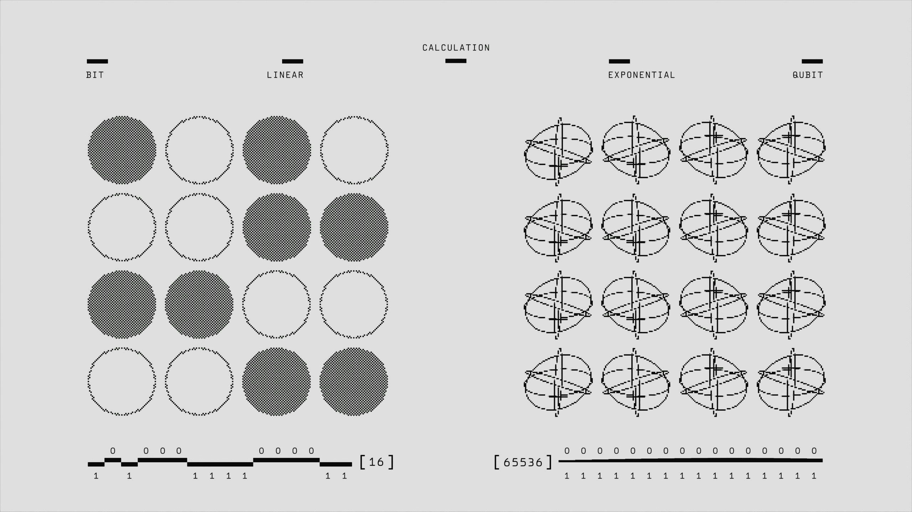
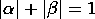
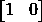
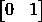
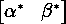
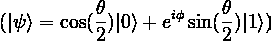
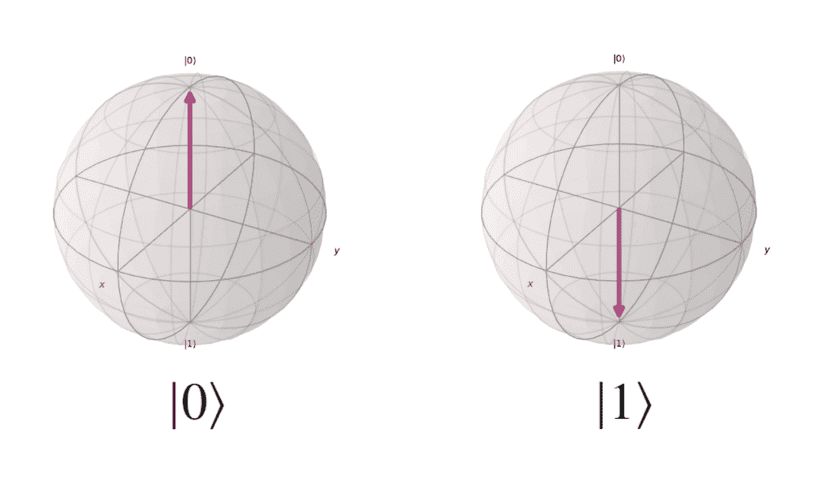
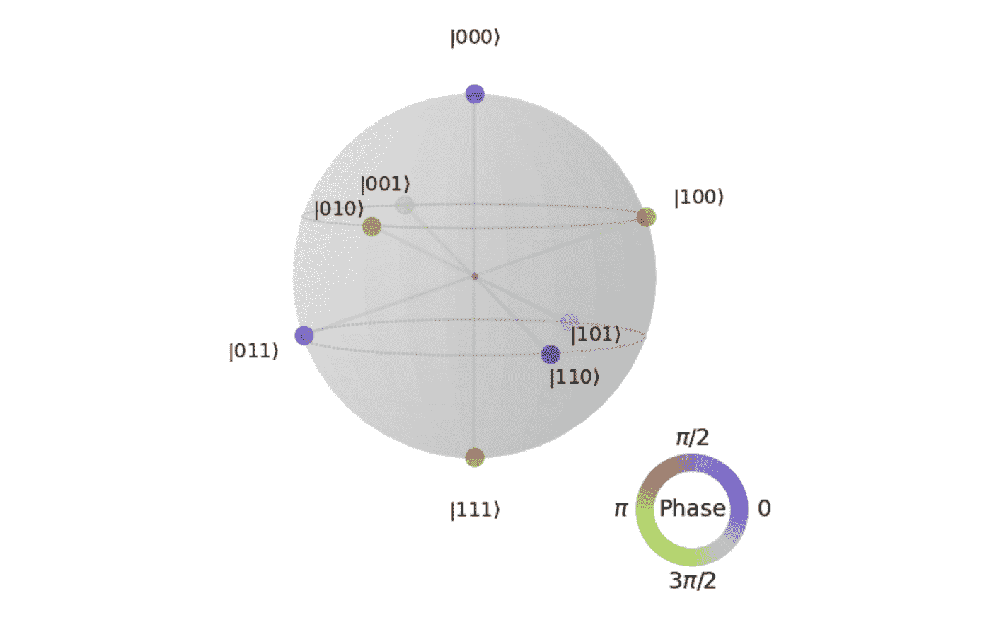
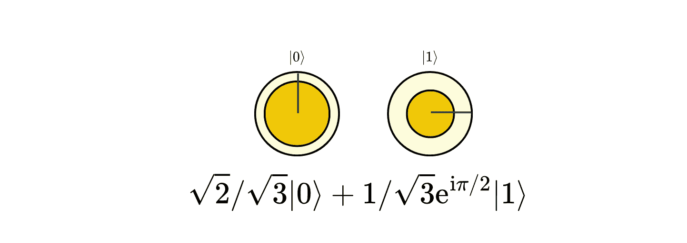

# 量子比特解释：你需要了解的一切

> 原文：[`towardsdatascience.com/qubits-explained-everything-you-need-to-know-1c510e6e9f06/`](https://towardsdatascience.com/qubits-explained-everything-you-need-to-know-1c510e6e9f06/)

由[Google DeepMind](https://unsplash.com/@googledeepmind?utm_source=medium&utm_medium=referral)在[Unsplash](https://unsplash.com?utm_source=medium&utm_medium=referral)上的照片

为了纪念量子技术国际年，我计划尽可能多地撰写关于量子领域不同方面的文章。然而，为了讨论更深入和更技术性的话题，我首先需要把基础知识解释得足够好，以便每个人都能后来跟上。

量子计算机是利用量子物理和力学力量来执行计算的系统。为了我（或任何人，实际上）解释量子计算机如何更好地解决某些问题或它们将如何解决这些问题，我们首先需要讨论它们是如何工作的。

量子计算机之所以强大，是因为它们可以利用干涉、叠加和纠缠。如果你已经了解这些概念，那太好了；如果还没有，请关注我接下来的文章，我将深入探讨这些概念。

让我们先快速偏离一下，讨论一下为什么机器学习、人工智能和软件工程师可能从学习一些量子计算基础知识中受益。对于机器学习和人工智能工程师来说，量子机器学习是量子力学和机器学习交叉的领域。由于叠加，量子可以“增强”机器学习模型，使它们能够更有效地处理不同的环境输入。至于软件工程师，随着我们接近更大、更强大的量子计算机，我们将需要软件工程师为这些计算机开发应用程序。好消息是，你实际上并不需要了解所有低级的量子物理和力学知识来开发这个应用程序；你只需要对事物的工作原理有一个高级的理解！这正是我在这里要做的事情！

因此，今天，我将讨论量子计算机如何使用这些现象，以量子比特作为计算的基本构建块。文章的标题已经揭示了我们将要讨论的内容，但让我进一步说明我将在这里涵盖的内容。

量子比特非常重要，我们可以从不同的角度来讨论它们。在这篇文章中，我们将讨论物理量子比特（量子比特是如何“制造”的），我们如何从数学上处理它们，以及不同的可视化方法。

不再拖延，让我们直接进入正题。

量子比特，简称“量子位”，是量子信息的基本单元，也是量子计算机的基本构建块。你可以把量子比特看作是经典比特的量子对应物。

> [**量子计算的现状：我们今天在哪里？**](https://towardsdatascience.com/the-state-of-quantum-computing-where-are-we-today-17ee19f51b1d)

## 第一部分：量子比特的物理实现

从理论上讲，任何具有两个可区分状态的量子系统都可以用作量子比特。例如，如果我有一个电子，那么这个电子将具有不同的能级。然后，我可以使用两个能级来描述一个量子比特。因此，基态可以用来定义量子比特的 0 状态，而第一个激发能级可以用来定义状态 1。

另一个例子是光子的极化，其中我们可以用水平极化作为状态 0，而垂直极化作为状态 1。

随后，科学家们采用各种方法以不同的精度和特性构建物理量子比特。让我向您介绍目前在研究和工业中使用的 6 种量子比特类型。

1.  **超导量子比特**基于超导电路，其中电流可以无阻力地流动。这些微小电路中的电流方向指示量子比特处于状态 0 还是 1。我们使用电磁场来控制和操控这些电路以执行计算。例如，*IBM、Google 和 Rigetti Computing*公司已经使用超导量子比特构建了量子处理器。

1.  **捕获离子量子比特**：在这种类型的量子比特中，单个离子通过电磁场被捕获，并使用激光或微波辐射进行操控。离子的内部能级被用来表示量子比特状态。例如，*IonQ 和 Quantinuum*公司正在开发捕获离子量子计算机。

1.  **拓扑量子比特**：要创建拓扑量子比特，依赖于任何子粒子，这些粒子在二维系统中存在时具有更多的自由度来获取任何相位。换句话说，当两个任何子粒子以某种方式相互作用时，这种相互作用赋予它们特殊的拓扑性质，我们利用这些性质来构建量子比特。*Microsoft*是研究这种类型量子比特的公司之一。

1.  **光子量子比特**：这些量子比特利用光子的量子特性，如极化或路径，来编码量子信息。光子量子比特可以通过光学元件，如分束器，进行操控，我们使用单光子探测器来测量它们。*Xanadu 和 PsiQuantum*公司正在开发光子量子计算平台。

1.  **量子点**是能够捕获单个电子的半导体纳米结构。此时，电子自旋被用来表示 0 和 1 状态。量子点可以通过电场和磁场进行操控。

1.  **自旋量子比特**基于原子的核自旋或自旋状态，通常在钻石或硅等固态系统中。研究人员可以通过操控磁场环境和应用微波脉冲来控制和读取自旋状态。

存在多种（并且还在增加）构建量子比特的方法的原因是，每种方法都有其优缺点。有些对错误更具有抵抗力，有些允许更长的退相干时间（这允许更长的计算时间），有些更容易生产或需要更少的维护。这就是为什么我不能说哪一种方法是***最好的***或者将是量子计算的未来的原因；同样，我们也不知道研究人员目前正在研究哪些新的构建量子比特的方法。

尽管所有这些技术都用于在物理上构建量子比特，但结果得到的量子比特就是我们所说的“物理量子比特”。然而，当我们谈论算法时，当我们说量子比特时，我们通常指的是“逻辑量子比特”。

* * *

*那么，这两者之间有什么区别呢？*

**物理量子比特**是通过使用上述方法之一在特定的物理系统中实现的。物理量子比特存储和操作量子信息，并受到噪声和错误的影响。量子计算机的性能和可靠性取决于物理量子比特的质量，例如它们的相干时间、门保真度和错误率。

**逻辑量子比特**是容错量子计算中量子比特的抽象表示。它们通过使用量子纠错（QEC）在多个物理量子比特上编码量子信息来构建。通过冗余地分配信息，QEC 保护量子信息免受错误和噪声的影响，这使得我们能够在不测量量子比特的情况下检测和纠正错误。

物理量子比特与逻辑量子比特的比例通常根据物理量子比特方法、特定的 QEC 码和选定的错误阈值而变化。一般来说，用于编码单个逻辑量子比特的物理量子比特越多，量子计算机对错误的鲁棒性就越强。

* * *

## 第二部分：量子比特的数学表示

当讨论量子计算的算法或应用时，我们通常不讨论量子比特是如何制造的。我们通常使用一串数学方程来解释一个算法。因此，了解我们如何从数学上处理量子比特是很重要的。

从数学上讲，量子比特被表示为向量，我们使用 *狄拉克* 符号或 *内积-外积* 符号来表示它们。这种符号是由物理学家保罗·狄拉克引入的，用于区分量子比特的状态与经典二进制 0 或 1 的状态。因此，当我们谈论量子比特时，我们说量子比特的状态是 |0⟩ 或 |1⟩（分别读作外积 0 和外积 1）。

**基向量**是复向量空间中的列向量。所以：

1- |0⟩ 表示对应于经典比特 0 的量子态作为一个列向量。

2- |1⟩ 表示对应于经典比特 1 的量子态作为一个列向量。

3- |ψ⟩ 表示一个任意量子态作为一个列向量

其中 α 和 β 是必须满足以下条件的复数：

**布赖向量**是矢量基的复共轭转置，并且是行向量。我们刚才提到的基的布赖向量为：

1- ⟨0| 代表与量子态 |0⟩ 对应的布赖向量，可以表示为一个行向量。

2- ⟨1| 代表与量子态 |1⟩ 对应的布赖向量，可以表示为一个行向量。

3- ⟨ψ| 代表与量子态 |ψ⟩ 对应的布赖向量，可以表示为一个行向量：

其中 α* 和 β* 是 α 和 β 的复共轭。

我们还可以使用 *bra-ket* 符号来表示量子比特的内积和外积。

|0⟩ 和 |1⟩ 的内积结果为零，因为它们是正交状态。在量子计算中，我们称它们为 ***计算基***。

我们使用 *bra-ket* 符号来描述量子比特的任意状态作为计算基的线性组合。

在这里，α 和 β 是复数，决定了量子比特处于状态 0 或 1 的概率。

测量量子比特处于任一状态的概率由系数的平方模给出，即 |α|² 和 |β|²。这些概率之和总是 1，确保量子比特在测量时要么是 0 要么是 1。

* * *

## 第三部分：量子比特的图形表示

为了更好地理解量子比特，我们需要创建一种视觉方式来表示它们。在这篇文章中，我们将讨论两种可视化量子比特的方法。

### 1- 比洛球

我们将首先讨论的是比洛球。比洛球是量子力学中单个量子比特状态的几何表示。它是一个半径为 1 的三维球体，量子比特的状态可以在这个球体的表面上可视化。

正如我们刚才讨论的，量子比特可以表示为状态 0 和 1 的组合。

比洛球使用坐标 (θ, φ) 如下表示量子比特的状态：

这里，θ 的范围从 0 到 π，而 ϕ 的范围从 0 到 2π。比洛球的北极对应于 |0⟩ 状态，而南极对应于 |1⟩ 状态。叠加状态位于这些极点之间，角度 θ 和 ϕ 决定了特定的状态。

作者图片（使用 Qiskit 生成）

尽管布洛赫球有助于可视化一个量子比特的状态，但它无法可视化多量子比特系统。这是一个问题，因为我们需要可视化多量子比特系统来理解实际的量子系统。为了克服这个问题，IBM 引入了布洛赫球的不同版本，称为 Q-球。

**Q-Sphere**

作者提供的图像（使用 Qiskit 生成）

Q-球是一种用于表示一个或多个量子比特的量子系统状态的方法。每个节点的半径与它的基态概率成正比，而它的颜色则表示它的相位。

### 2- 维度圆圈符号（DCN）

我们将要讨论的第二种方法是圆圈符号。这种可视化技术通过更直观地描绘量子状态来简化对复杂量子状态的理解。

维度圆圈符号（DCN）通过使用圆圈来描绘复数，图形化地表示量子状态。这些圆圈可视化了描述量子状态振幅和相位的复数。振幅的大小以圆圈内的填充面积来表示。同时，相位由圆内相对于垂直线的径向线的角度来指示。

作者提供的图像

虽然圆圈符号使量子状态的可视化更加容易，但它仍然面临一些限制。量子算法的一些方面并不总是直观的，可能需要额外的努力来理解和可视化。圆圈符号的另一个限制是有效地可视化大量量子比特的状态。

* * *

## 最后的想法

在我们深入探讨量子计算的深奥和神秘的技术方面之前，我想重点介绍该领域的根本构建块。迄今为止，量子计算的核心构建块是量子比特。

量子比特是必不可少的，它使我们能够利用量子力学的超能力，如纠缠和叠加。没有坚韧、高质量的量子比特，我们将无法构建更多实用的量子计算机，这些计算机能够运行大规模的应用程序。因此，了解在学术界和工业界构建和使用物理量子比特的进展情况非常重要。

在这篇文章中，我介绍了关于量子比特你需要知道的一切，从它们的构建方式到我们如何从数学和视觉上处理它们。

希望现在你对量子比特以及科学家在不同语境中使用这个词的含义有了更好的理解。在未来的文章中，我们将更深入地探讨更多量子话题，所以请保持关注！
