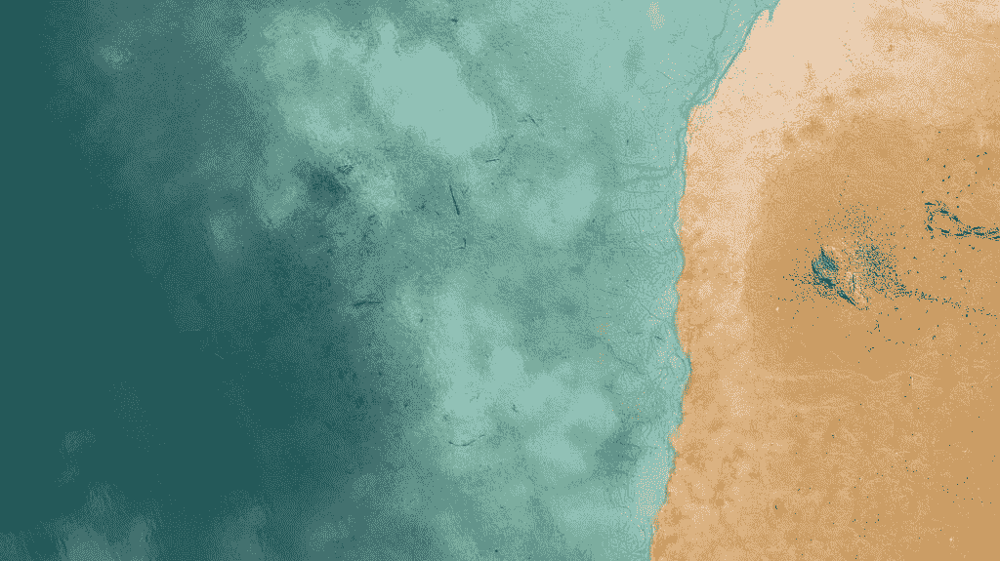

# 为数据科学向前进投稿

> 原文：[`towardsdatascience.com/questions-96667b06af5/`](https://towardsdatascience.com/questions-96667b06af5/)

**快速链接：**

+   **为什么成为贡献者？**

+   **[通过 TDS 作者支付计划赚钱](https://towardsdatascience.com/announcing-the-towards-data-science-author-payment-program/)**

+   **投稿指南**

+   **如何准备您的文章以供发表！**

+   **如何提交您的作品**

+   **添加和使用图片**

+   **长篇帖子、专栏和在线书籍**

+   [**常见问题解答**](https://towardsdatascience.com/writers-faq-462571b65b35/)

* * *

## **为什么成为贡献者？**

我们正在寻找作者，提出关于数据科学、机器学习、人工智能和编程的最新内容。如果你喜欢撰写这些主题的文章，请继续阅读！

**触及更广泛的受众**。TDS 是数据科学、机器学习和 AI 上深思熟虑且可操作文章的领先全球目的地。我们吸引了来自各行各业、背景和经验水平的读者：从教授到早期学习者，从求职者到技术高管。

我们发布的每一篇文章都受益于我们内置的可见性，但我们也在努力确保您的工作获得最大范围的传播：

+   我们的[独立域名](https://towardsdatascience.com/towards-data-science-is-launching-as-an-independent-publication/)和 SEO 策略产生了强大的直接流量，仅通过谷歌搜索、新闻和发现就驱动了**67.5k+每月点击量**。

+   我们发布的每篇文章至少在我们的主页上展示 24 小时，这吸引了超过**10k 每月浏览量**。

+   在我们的社交媒体账号上（每篇文章最多出现四次），有**95k+关注者**，以及**15k+新闻通讯订阅者**，您的故事可以深入到读者的收件箱和社交媒体动态中。

**通过 TDS 作者支付计划赚钱**。在 TDS 发表文章时，我们的作者可以选择申请我们的支付计划，使他们能够从他们的工作中获得收益。您可以在[这里](https://towardsdatascience.com/announcing-the-towards-data-science-author-payment-program/)了解更多关于我们的作者支付计划的信息。

* * *

## **投稿指南**

**在提交您的文章之前，有一些基本事项您需要了解。请确保您仔细阅读每个要点，并理解它们，因为通过向 TDS 提交文章，您同意遵守所有这些条款**。

请花几分钟时间熟悉我们的[作者条款和条件](https://towardsdatascience.com/author-terms-and-conditions-of-use-b9b3935ff999)——它们规定了贡献者与 TDS 之间的关系。

您与我们分享的任何文章都必须是完全您自己的原创作品；您不能拿其他作者的词句来当作自己的。

* * *

## **指南**

****如何让你的文章准备好发表！**

我们旨在在创新、信息和哲学思考之间取得平衡。我们期待你的声音！如果你不是专业作家，在准备你的文章时考虑以下要点。我们希望发表高质量、专业的文章，人们愿意阅读。

**1. 你的故事是一个需要讲述的故事吗？**

**在开始写作之前，问问自己：这个故事是一个需要讲述的故事吗？

如果你已经阅读了许多涉及同一问题或解释同一概念的文章，在撰写另一篇之前请三思。如果你对一个老生常谈的话题有激进的新看法，我们想听听你的声音……但是，我们需要你说服我们你的文章是与众不同的，能够脱颖而出，并吸引我们的听众。

相反，如果你的文章涉及一个未被充分关注的领域，或提出了一个新想法或方法，这正是我们所追求的！

**2. 你的信息是什么？**

**让我们从一开始就了解你的主要信息。给你的作品一个简洁的介绍，告诉我们：

+   你的新颖想法是什么？

+   我们为什么要关心？

+   你将如何证明你的观点？

一旦你完成了这些，你可以像聊天一样随意，但始终要回到核心信息，并给出一个明确的结论。

然而，记住，数据科学向导不是你的个人博客，保持它尖锐且切题！

**3. 在互联网上，没有人知道你是一条狗**

**如果你有一个新的想法或做事的新方法，你想告诉社区并开始讨论。太棒了，这正是我们想要的，但我们不会假设你知道你在说什么，或者我们应该不加批判地相信你所说的话……你必须说服我们（你的听众）你：

+   主题内容很重要

+   需要填补一个空白

+   你有答案

+   你的解决方案是可行的

+   你的想法是基于逻辑上的一连串思想和证据

+   如果你是在提供教程，告诉我们为什么人们需要使用这个工具，以及你的方法为什么比已经发表的方法更好。

你可以通过解释背景、展示例子、提供实验或只是阐述从各种来源提取的数据如何让你综合出这个新想法来实现这一点。

有没有反驳你观点或发现的观点？解释为什么这种解释与你的想法相冲突，以及为什么你的想法更胜一筹。

**4. 你有一个简短且富有洞察力的副标题吗？**

**如果你滚动到这个页面的顶部，你会看到一个标题和副标题的例子。你的文章需要有一个简短的标题和一个较长的副标题，告诉读者你的文章是关于什么的，或者为什么他们应该阅读它。你的标题对于吸引潜在读者和明确你的意图很有用。为了保持一致并提供最佳的读者体验，我们不允许使用全大写的标题或副标题。我们还要求你在标题和副标题中避免使用粗俗的语言。

当你的副标题直接位于标题下方并且格式正确时，它会在某些文章预览中显示出来，这有助于提高你的点击率。

**5. 你的文章对读者有什么价值？**

一篇成功的文章有一个明确界定和范围合理的目标，并且履行其承诺。如果你的标题告诉我们你将拆解一个复杂的算法，展示一个新库的好处，或者带我们了解你的数据管道，确保文章的其余部分能够实现这些承诺。

**以下是一些帮助你规划和执行精心制作的文章的要点：**

+   **1. 决定你的主题是什么——以及它不是什么** 如果你不确定你的文章将要讨论什么，那么读者在阅读时几乎不可能确定。定义你的文章将要解决的问题或提出的问题，并坚持这一点：任何没有触及文章核心的内容都应该被排除在外。

+   **2. 制定一个清晰的计划** 在掌握你的主题后，为你的文章绘制一个清晰的框架，并记住它将遵循的整体结构。记住，你的主要目标是保持读者的参与和良好的方向感，因此考虑格式和如何将主题分解成可消化的部分永远不会太早。考虑在过程中添加章节标题，使你的结构更加明显。

+   **3. 使用清晰、以行动为导向的语言** 如果你还在寻找作为数据科学作者的个人声音，一个好的开始是保持内容整洁、清晰且易于跟随。

如果你的文章充满了中性的、通用的动词（如 to be、have、go、become、make 等），尝试混合使用更精确的动作动词。当合适时，使用具体、生动的描述词而不是枯燥的描述词（例如，你可以根据上下文将“easy”替换为“frictionless”、“accessible”或“straightforward”）。

编辑们最欣赏的莫过于一篇干净的第一稿，所以不要忘记在将文章与 TDS 分享之前仔细校对几次：查找拼写、标点符号和语法问题，并尽力修正它们。我们希望提供给读者的是我们清晰的解释、流畅的整体流程——注意那些过渡！——以及对你希望通过文章实现的目标的强烈感觉。

如果你想要在基础知识之外扩展你的工具箱，互联网上充满了优秀的写作资源。以下是一些帮助你开始的想法：

+   [为学术期刊写作：10 个技巧。卫报](https://www.theguardian.com/higher-education-network/blog/2013/sep/06/academic-journal-writing-top-tips)

+   [来自成功作家的 6 条最佳建议](https://blog.bufferapp.com/6-of-the-most-important-aspects-of-successful-writing)

+   [史蒂文·平克的风格感](https://www.scientificamerican.com/article/steven-pinker-s-sense-of-style/)

+   **4. 包含你自己的图片、图表和 GIF** 将你的关键点通过引人入胜的视觉元素展示给读者，这是传达信息最有效的方法之一。

例如，如果你在谈论你构建的数据管道，文字只能带你走这么远；添加图表或流程图可以使事情更加清晰。如果你在介绍算法或其他抽象概念，用图表、绘图或 GIF 来补充你的口头描述，使其更加具体。（如果你使用的是其他人创建的图像，你需要仔细地来源和引用它们——阅读我们下面的图像指南以获取更多详细信息。）

强大的视觉元素将吸引读者的注意力，并在他们阅读你的帖子时引导他们。它还将帮助你作为一个作者发展个人风格，扩大你的追随者群体，并在社交媒体上吸引更多关注。

**6. 你的代码和方程式是否展示得很好？**

**TDS 读者喜欢摆弄你与他们分享的想法和工作流程，这意味着在你的帖子中包含代码实现和相关方程式通常是一个很好的主意。**

为了使代码片段更易于访问和使用，避免使用截图。使用 WordPress 的[代码块和内联代码](https://wordpress.com/support/wordpress-editor/blocks/code-block/)

要与读者分享数学方程式，[Embed.fun](https://embed.fun/)是一个很好的选择。或者，你可以[使用 Unicode 字符](https://medium.com/@tylerneylon/how-to-write-mathematics-on-medium-f89aa45c42a0#.tb4rw3gqc)并上传结果的方程式图像。

当你在文章中包含代码或方程时，务必解释它，并在其周围添加一些上下文，以便所有水平的读者都能跟上。

要了解更多关于在帖子中使用这些嵌入和其他内容的信息，请查看这个[资源](https://wordpress.com/support/wordpress-editor/blocks/embed-block/)。

**7. 检查你的事实**

**无论何时提供事实，如果它不是显而易见的，请告诉我们你从哪里学到的。告诉我们你的来源是谁以及你的数据来源。如果我们想要进行对话，我们都必须站在同一起跑线上。也许你说的某句话会引发讨论，但如果我们想要确保我们不是南辕北辙，我们需要回到原始资料并亲自阅读，以防我们遗漏了使你所说的一切都有意义的至关重要的信息。**

**8. 你的结论是否简洁，而不是促销性的？**

**请确保在文章末尾包含一个结论。这是一个帮助读者回顾和记住您所涵盖的要点或想法的好方法。您还可以使用结论来链接原始帖子或几篇相关文章。**

在您的作者资料或社交媒体账户中添加额外的链接是可以的，但请避免使用呼吁行动（CTA）按钮。

对于您的**参考**，请尊重以下格式：

[X] N. Name, Title (Year), Source

例如，您的第一个参考应该看起来像这样：

[1] A. Pesah, A. Wehenkel and G. Louppe, [Recurrent Machines for Likelihood-Free Inference](https://arxiv.org/abs/1811.12932) (2018), NeurIPS 2018 Workshop on Meta-Learning

**9. 您的标签是否足够精确？**

**标签越具体，读者就越容易找到您的文章，我们也就越容易对您的帖子进行分类并向相关受众推荐。**

在发表之前，我们可能会更改一两个标签。我们只会这样做，以确保我们的不同部分与读者相关。例如，我们不想将关于线性回归的帖子标记为“人工智能”。

**10. 您有没有令人惊叹的图片？**

**一张优秀的图片能吸引和激发读者的兴趣。这就是为什么所有最好的报纸总是展示令人难以置信的图片。**

这是您可以为您的帖子添加一个精彩的特色图片所做的事情：

+   **使用** [**Unsplash**](https://unsplash.com/) **。** 大多数 Unsplash 上的内容都可以使用，无需请求许可。您可以在[这里](https://unsplash.com/license)了解更多关于他们许可证的信息。

+   **自己拍摄一张照片**。您的手机几乎可以捕捉到周围环境的精彩图片。您甚至可能已经在手机上有一张可以很好地补充您文章的图片。

+   **制作一个优秀的图表**。如果您的帖子涉及数据分析，请花些时间制作至少一个真正独特的图表。您可以使用 R、Python、D3.js 或 Plotly。

**如果您决定购买用于文章中的图片的许可证**，请注意我们只允许使用以下许可证的图片：（i）不会过期；（ii）可以在 TDS 出版物上用于商业目的。您有责任确保您遵守许可证的使用条款。您还必须在图片下方包含以下或根据许可证提供者要求的内容作为标题：“*图片由[许可证提供者名称]授权[您的姓名]*。”最后，请将购买许可证的收据或其它证据的副本以及相应的使用条款发送给我们。

**如果您选择使用 AI 工具**（如 DALL·E 2、DALL·E、Midjourney 或 Stable Diffusion 等）为您的文章创建图像，您有责任确保您已阅读、理解并遵循该工具的条款。您在 TDS 上使用的任何图像都必须获得商业使用许可，包括 AI 生成的图像。并非所有 AI 工具都允许将图像用于商业目的，有些工具可能需要付费才能允许您使用该图像。

使用 AI 工具生成的图像不能侵犯其他创作者的版权。如果 AI 生成的图像与现有的受版权保护的图像或虚构角色（如哈利·波特、弗雷德·弗林斯通等）相似或完全相同，您不允许在 TDS 上使用它。请使用您的最佳判断力，避免使用复制或与另一作品非常相似的 AI 生成的图像。如有疑问，请使用图像搜索工具（如[Google Lens](https://support.google.com/websearch/answer/1325808?)、[TinEye](https://tineye.com/)或其他人）检查您的图像是否与现有作品过于相似。我们也可能要求您提供在 AI 工具中使用的文本提示详情，以确认您没有使用受版权保护的作品的名称。

您的文本提示不能使用真实人的名字，您的图像也不能包含真实人物（无论是名人、政治家还是其他人）。

**请记住，即使您没有法律义务，也要注明图像的来源**。如果您自己创建了图像，您可以在图注中添加（*图像由作者提供*）。无论您选择哪种方式，您的图像来源应如下所示：

图片由[Marco Xu](https://unsplash.com/@marcute?utm_content=creditCopyText&utm_medium=referral&utm_source=unsplash)在[Unsplash](https://unsplash.com/photos/woman-holding-dslr-camera-ToUPBCO62Lw?utm_content=creditCopyText&utm_medium=referral&utm_source=unsplash)提供

图片由 Nubia Navarro (nubikini)提供：https://www.pexels.com/photo/art-artistic-creative-design-1110354/

图片由[Micha Sager](https://pixabay.com/users/michasager-6459346/?utm_source=link-attribution&utm_medium=referral&utm_campaign=image&utm_content=2755908)在[Pixabay](https://pixabay.com//?utm_source=link-attribution&utm_medium=referral&utm_campaign=image&utm_content=2755908)提供

您的图像应同时包含来源和该来源的链接。如果您自己创建了图像，您可以在图注中添加“图像由作者提供”。

**如果您创建的图像是受现有图像轻微启发的**，请在图注中添加“图像由作者提供，受来源启发[包含链接]”。**如果您编辑了现有图像**，请确保您有权使用和编辑该图像，并在图注中包含“图像由来源提供[包含链接]，经作者许可编辑。”

**危险区域**：不要在没有所有者明确许可的情况下使用您在网上找到的图片（包括标志和 gif）。在图片中添加来源并不赋予您使用它的权利。

**11. 您的数据是从哪里获得的？**

Towards Data Science 团队致力于建立一个尊重数据科学作者、研究人员和读者的社区。对于我们的作者来说，这意味着尊重他人的工作，注意尊重与图像、已发布材料和数据相关的版权。请始终确保您有权收集、分析和展示您在文章中使用的数据。

有许多免费提供的数据来源。尝试搜索大学数据库、政府开放数据网站和国际机构，例如 [UCI Irvine 机器学习存储库](https://archive.ics.uci.edu/ml/index.php)、[美国政府](https://data.gov/) 和 [世界银行开放数据](https://data.worldbank.org/)。别忘了还有像 [CERN](http://opendata.cern.ch/)、[NASA](https://data.nasa.gov/) 和 [FiveThirtyEight](https://data.fivethirtyeight.com/) 这样的专门数据网站。

TDS 是一份商业出版物。在将您的文章提交给我们之前，**请核实您的数据集是** [**商业用途许可**](https://towardsdatascience.com/writers-faq-462571b65b35/#dataset-license)**，或者获得使用它的书面许可**。请注意，我们列出的网站上并非所有数据集都可以用于。无论您从哪里获取数据，我们建议您务必核实数据集是否允许商业用途。

如果您不确定是否有权将其用于商业目的，请考虑联系数据所有者。许多作者在发送一份[精心构建的电子邮件](https://towardsdatascience.com/writers-faq-462571b65b35/#email-dataset)后都能收到快速、积极的回复。解释您打算如何使用数据，分享您的文章或想法，并提供 TDS 的链接。当您收到许可后，请将副本转发给我们至 [[email protected]](/cdn-cgi/l/email-protection)。

这尤其重要，如果您计划使用网络爬虫来创建自己的数据集。如果网站没有明确允许用于商业目的的数据抓取，我们强烈建议您联系网站所有者以获得许可。没有明确的许可，我们无法出版您的作品，因此请通过电子邮件将副本转发给我们。

有时，简单的方法最好！如果您只想创建一个数据集来解释算法的工作原理，您始终可以创建一个人工或模拟的数据集。这里有一个快速[教程](https://towardsdatascience.com/top-3-python-packages-to-generate-synthetic-data-33a351a5de0c)，以及一篇[文章](https://towardsdatascience.com/how-to-use-synthetic-and-simulated-data-effectively-04d8582b6f88/)，其中使用了一个可能对您有帮助的模拟数据集。

请记住在文章中添加数据集存储网站的链接，并注明所有者/创作者。理想情况下，这应该在数据集首次提及时或在文章末尾的资源列表中完成。请仔细遵循你在网站上找到的任何关于归属的说明。如果你创建了你自己的人工或模拟数据集，这也非常重要。

我们知道解读许可证可能具有挑战性。确保你可以在使用 TDS 发表的文章中展示你的数据和发现是你的责任，但如果你遇到困难，请联系我们的编辑团队寻求帮助。我们宁愿在项目早期阶段与你合作，也不愿因为数据集许可证问题而不得不拒绝你完成的文章。

**12. 你的内容是否原创？**

虽然我们接受已经发表的内容（例如，在你的个人博客或网站上），但我们的重点是推广和与读者分享新的和原创的内容。这意味着，通过首先（或独家）在 TDS 上发表你的文章，你更有可能被我们的出版物、社交媒体渠道和我们的通讯中突出展示。

我们喜欢原创内容，因为它是我们观众之前没有看到过的东西。我们希望尽可能多地展示新材料，并保持 TDS 的新鲜和时效性。

原创性还意味着你（以及如果有，你的合著者）是你帖子中每个元素的唯一创作者。每次你依赖他人的话语时，你必须正确地引用和引用他们，否则我们将其视为剽窃的一个例子。

**13. 在提交帖子之前，你收到任何反馈吗？**

在发布文章之前，养成向朋友寻求反馈的习惯。既然你已经那么努力地完成了这篇文章，你不想让一个愚蠢的错误让读者远离。

**14. 你的作者个人资料是否已经正确完成？**

请包括你的**真实姓名**、一张**照片**和一份**个人简介**。我们不发表匿名作者的帖子——当读者将你的话语与一个真实的人联系起来时，更容易建立信任。

使用你的个人资料介绍你自己、你的专业知识、你的成就——优化它将帮助你与观众建立超越单一帖子的有意义的关系。

如果你是一家公司，并希望与我们合作发表，请注意我们几乎只发表直接从作者那里提交的文章。

**15. 你是否在变得更好？**

花一分钟反思你迄今为止所做的工作，以及你希望发布的当前文章。你带来了什么价值，对谁有价值？这篇文章与之前你发表的文章相比，有哪些优点或缺点？

* * *

## **长篇帖子、专栏和在线书籍**

**有很多话要说吗？很好。我们喜欢深入研究复杂的话题，我们的读者也是如此。以下是如何在 TDS 上发布长篇帖子、专栏和在线书籍的方法。**

**长篇帖子**

**我们喜欢长篇阅读！如果你的文章阅读时间少于 25 分钟，我们建议你不要将其分成多个部分——保持原样。一篇文章使读者更容易搜索和找到他们所需的所有信息，并且不太可能错过你论点的重要部分。

为了创建更流畅的阅读体验，你可以添加目录来引导你的听众了解你的帖子。添加高质量图片和大量空白也是好主意——长篇文章不一定是文字墙。

我们定期将最具吸引力和思考性的长篇帖子添加到我们的[深度探索页面](https://towardsdatascience.com/tagged/deep-dives)。

**专栏**

**如果你的帖子阅读时间超过 25 分钟，或者你计划在多篇文章和更长的时间内专注于同一主题，你可以创建自己的 TDS 专栏。只需三个步骤即可：

1.  **给你的帖子添加一个自定义标签。** 这个标签需要是唯一的，并反映你项目的主题。每次你发布带有该标签的帖子时，它都会被添加到你的专栏着陆页：[towardsdatascience.com/tagged/[你的标签](http://towardsdatascience.com/tagged/%5Byour-tag)]。

1.  **在你的帖子中添加一个亮点。** 这就像添加一个副标题，但位于你的标题之上。

1.  **将你的亮点链接到专栏的着陆页。**

你可以创建一个 TDS 专栏，并邀请多位作者投稿。只需让你的同事（们）知道你决定使用的标签，这样他们就可以将其添加到他们的文章中。[这里](https://towardsdatascience.com/our-columns-53501f74c86d)有一些我们团队的示例。

**在线书籍**

**如果你计划长期撰写一个开放性的主题，专栏是一个很好的格式。另一方面，如果你的想法有一个有限、定义明确的范围，并且从一篇帖子到另一篇有明确的进展感，你可能想创建一系列更像在线书籍的文章。以下是推荐的格式。

保持每篇文章或“章节”的阅读时间在 12 到 25 分钟之间，并力求至少有 5 篇文章（但可能不会超过，比如说，16 篇）。你可以在每篇文章中添加链接到之前或后续的项目——例如，在引言和/或结论中。

要发布你的在线书籍，你可以一次性将所有文章提交给我们的编辑团队，或者在你完成每篇文章的工作后逐个提交。我们将审查它们，并随着它们的到来发布它们。让我们知道你的帖子是计划中的在线书籍项目的一部分。

请确保每篇文章或在线书籍章节都遵循 TDS 发布的任何其他帖子的相同指南和规则。如果你决定将你的书籍出售或独家许可给第三方出版商，你必须确保你有他们的同意才能继续在 TDS 上发布这本书。如果你没有这样的同意，你有责任从 TDS 出版物中删除你的内容。

* * *

## ****如何提交您的作品****

**要成为作家，请使用[我们的表格](https://contributor.insightmediagroup.io/)提交您的文章。**

我们的目标是尽可能快地回应作者，并告知他们是否已接受他们的文章。

在少数情况下，我们收到的投稿量使我们难以回应每个人；一般来说，如果您在提交帖子一周内没有收到我们的回复，可以安全地假设我们不会继续出版它。

[**为数据科学贡献**](https://contributor.insightmediagroup.io/) ✨

如果您在使用我们的在线表格时遇到问题，请通过电子邮件（[[email protected]](/cdn-cgi/l/email-protection)）告诉我们，以便我们帮助您完成流程。请不要通过我们的表格发送您已经发送过的文章。

## FAQ

您的常见问题解答（FAQ）可以在[这里](https://towardsdatascience.com/writers-faq-462571b65b35/)找到。

* * *******************************
