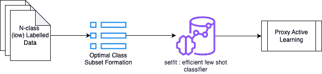
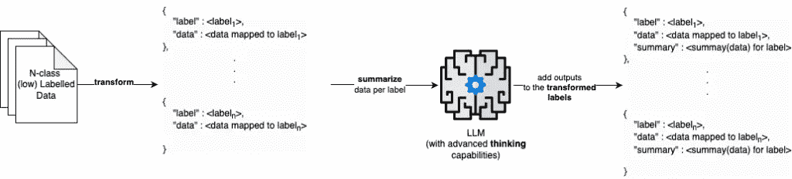
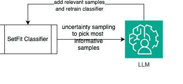

# R.E.D：通过专家委托扩展文本分类

> 原文：[`towardsdatascience.com/r-e-d-scaling-text-classification-with-expert-delegation/`](https://towardsdatascience.com/r-e-d-scaling-text-classification-with-expert-delegation/)

在由大型语言模型（LLMs）增强的新时代问题解决中，只有少数问题仍然存在，其解决方案不尽如人意。大多数分类问题（在 PoC 级别）可以通过利用 LLMs 在 70-90% 的精度/F1 分数以及良好的提示工程技术和适应性情境学习（ICL）示例来解决。

当你想要持续实现比这更高的性能时会发生什么——当提示工程不再足够时？

## 分类难题

文本分类是监督学习中最古老、最被理解的例子之一。基于这个前提，构建能够处理大量输入类别的稳健、高性能分类器应该**真的**不难，对吧…？

好吧，就是这样。

实际上，这与算法通常预期在以下“约束”下工作有很大关系：

+   每个类别的训练数据量较少

+   高分类精度（随着添加更多类别而急剧下降）

+   可能向现有类别子集添加**新类别**

+   快速训练/推理

+   成本效益

+   （可能）大量训练类别

+   （可能）由于数据漂移等原因，**需要**重新训练某些类别，这可能是无限的。

在这种条件下，你是否尝试过构建超过几十个类别的分类器？（我的意思是，即使是 GPT 也可能在只有几个样本的情况下，做到 30 个文本类别的大约 30 个类别…）

考虑到你选择了 GPT 路线——如果你有超过二十多门课程或大量需要分类的数据，你将不得不深入口袋掏出系统提示、用户提示以及你需要用于分类的少量示例令牌来**分类一个样本**。这是在接受了 API 的吞吐量之后，即使你正在运行异步查询。

在应用机器学习中，这类问题通常很难解决，因为它们不完全满足监督学习的要求，或者不够便宜/快速，无法通过 LLM 运行。这个特定的痛点正是 R.E.D 算法要解决的问题：半监督学习，当每个类别的训练数据不足以构建（准）传统分类器时。

## R.E.D 算法

**R.E.D：递归专家委托**是一个新颖的框架，改变了我们处理文本分类的方法。这是一个应用机器学习范式——即，它并没有与现有架构**本质上不同**，但它是一个最佳想法的精选集，这些想法最适合构建实用且可扩展的东西。

在这篇文章中，我们将通过一个具体示例来探讨，其中我们有一个大量的文本类别（100–1000），每个类别只有少量样本（30–100），并且有大量样本需要分类（10,000–100,000）。我们通过 R.E.D.将其视为一个**半监督学习**问题。

让我们深入探讨。

## 它是如何工作的



简单地表示 R.E.D.所做的工作。

与使用单个分类器对大量类别进行分类相比，R.E.D.智能地：

1.  **分而治之**——将标签空间（大量输入标签）分解成多个标签子集。这是一种贪婪的标签子集形成方法。

1.  **高效学习**——为每个子集训练专门的分类器。这一步骤专注于构建一个对噪声过度采样的分类器，其中噪声被智能地建模为来自*其他子集*的数据。

1.  **委托给专家**——仅使用 LLM 作为特定标签验证和纠正的专家或 acles，类似于拥有一支领域专家团队。使用 LLM 作为代理，它经验性地“模仿”**如何**人类专家验证输出。

1.  **递归重训练**——持续地使用从专家那里添加的新样本进行重训练，直到没有更多样本可以添加/达到信息增益饱和。

其背后的直觉并不难理解：[主动学习](https://en.wikipedia.org/wiki/Active_learning_(machine_learning))利用人类作为领域专家，持续地“纠正”或“验证”ML 模型的输出，并进行持续训练。当模型达到可接受的性能时停止。我们直觉上重新定义了这一点，并加入了一些将在后续研究预印本中详细阐述的巧妙创新。

让我们深入探讨一下...

### 使用最不相似元素进行贪婪子集选择。

当输入标签（类别）的数量较高时，学习类别之间线性决策边界的复杂性会增加。因此，随着类别数量的增加，分类器的质量会下降。这尤其适用于分类器没有足够的**样本**来学习的情况——即每个训练类别只有少量样本。

这非常反映现实世界场景，也是 R.E.D.创建的主要动机。

在这些约束下提高分类器性能的一些方法：

+   **限制**分类器需要分类的类别数量。

+   使类别之间的决策边界更清晰，即训练分类器在**高度不同类**别上。

贪婪子集选择正是如此——由于问题的范围是文本分类，我们形成训练标签的嵌入，通过 UMAP 降低其维度，然后从它们中形成 ***S*** 子集。每个 ***S*** 子集包含 ***n ***个训练标签。我们贪婪地选择训练标签，确保我们为子集选择的每个标签与其他子集中存在的标签相比是最不相似的：

```py
import numpy as np
from sklearn.metrics.pairwise import cosine_similarity

def avg_embedding(candidate_embeddings):
    return np.mean(candidate_embeddings, axis=0)

def get_least_similar_embedding(target_embedding, candidate_embeddings):
    similarities = cosine_similarity(target_embedding, candidate_embeddings)
    least_similar_index = np.argmin(similarities)  # Use argmin to find the index of the minimum
    least_similar_element = candidate_embeddings[least_similar_index]
    return least_similar_element

def get_embedding_class(embedding, embedding_map):
    reverse_embedding_map = {value: key for key, value in embedding_map.items()}
    return reverse_embedding_map.get(embedding)  # Use .get() to handle missing keys gracefully

def select_subsets(embeddings, n):
    visited = {cls: False for cls in embeddings.keys()}
    subsets = []
    current_subset = []

    while any(not visited[cls] for cls in visited):
        for cls, average_embedding in embeddings.items():
            if not current_subset:
                current_subset.append(average_embedding)
                visited[cls] = True
            elif len(current_subset) >= n:
                subsets.append(current_subset.copy())
                current_subset = []
            else:
                subset_average = avg_embedding(current_subset)
                remaining_embeddings = [emb for cls_, emb in embeddings.items() if not visited[cls_]]
                if not remaining_embeddings:
                    break # handle edge case

                least_similar = get_least_similar_embedding(target_embedding=subset_average, candidate_embeddings=remaining_embeddings)

                visited_class = get_embedding_class(least_similar, embeddings)

                if visited_class is not None:
                  visited[visited_class] = True

                current_subset.append(least_similar)

    if current_subset:  # Add any remaining elements in current_subset
        subsets.append(current_subset)

    return subsets
```

这种贪婪子集采样的结果是所有训练标签都清晰地划分到子集中，其中每个子集最多只有 ***n ***个类别。这本质上使得分类器的工作比它原本必须分类的 ***S ***个类别要容易得多！

### 噪声过采样的半监督分类

在初始标签子集形成后级联此操作——即，此分类器仅在给定的**子集**之间进行分类。

想象一下：当你有很少的训练数据时，你绝对不能创建一个对评估有意义的保留集。你真的应该这样做吗？你如何知道你的分类器是否工作良好？

我们以略微不同的方式处理这个问题——我们定义半监督分类器的根本任务是**预防性**分类样本。这意味着无论样本被分类为什么，它将在稍后的阶段被‘验证’和‘纠正’：这个分类器只需要识别需要验证的内容。

因此，我们设计了一种如何处理其数据的方法：

+   ***n+1***个类别，其中最后一个类别是**噪声**

+   **噪声**：来自当前分类器视野之外的类别的数据。噪声类别被过采样，使其大小是分类器标签数据平均大小的 2 倍

在噪声上过采样是一种虚假的安全措施，以确保属于另一个类的相邻数据最有可能被预测为噪声，而不是在验证中滑过。

如何检查这个分类器是否工作良好——在我们的实验中，我们将其定义为分类器预测中‘不确定’样本的数量。通过不确定性采样和信息增益原则，我们有效地评估了分类器是否‘学习’，这可以作为分类性能的指针。除非预测的不确定样本数量出现拐点，或者新样本迭代性地添加的信息量只有微小的变化，否则这个分类器将不断重新训练。

### 通过 LLM 代理进行代理主动学习

这是该方法的核心——使用 LLM 作为人类验证者的代理。我们谈论的人类验证者方法是主动标记

让我们直观地理解主动标记：

+   使用 ML 模型在样本输入数据集上学习，在大量数据点上预测

+   对于在数据点上给出的预测，主题专家（SME）评估预测的‘有效性’

+   递归地，新的“修正”样本被添加到机器学习模型的训练数据中。

+   机器学习模型持续学习/重新训练，并做出预测，直到专家对预测的质量满意。

为了使主动标记（Active Labelling）工作，对于专家（SME）有一些期望：

+   当我们期望人类专家“验证”输出样本时，专家理解任务是什么。

+   当决定一个新样本是否属于标签 **L** 时，人类专家将使用判断来评估 **L** 中“其他什么”肯定属于标签的情况。

给定这些期望和直觉，我们可以使用 LLM 来“模仿”这些：

+   **让大型语言模型（LLM）理解每个标签的含义**。这可以通过使用更大的模型来 **批判性地评估** 所有标签之间 {标签：映射到标签的数据} 的关系来实现。在我们的实验中，这是通过使用一个 **32B 版本的 DeepSeek** 来实现的，该版本是自托管的。



给予 LLM 理解“为什么、是什么、如何”的能力。

+   而不是预测正确的标签，**利用 LLM 来识别预测是否“有效”或“无效”**（即，LLM 只需回答一个二元查询）。

+   **强化对标签其他有效样本外观的想法**，即对于每个预先预测的样本标签，在请求验证时动态获取其训练集中最接近的 ***c*** 个样本（保证有效）。

结果？一个成本效益高的框架，它依赖于快速、廉价的分类器进行先发制人的分类，以及一个 LLM，它使用（标签的含义 + 与当前分类相似的动态获取的训练样本）来验证这些分类：

```py
import math

def calculate_uncertainty(clf, sample):
    predicted_probabilities = clf.predict_proba(sample.reshape(1, -1))[0]  # Reshape sample for predict_proba
    uncertainty = -sum(p * math.log(p, 2) for p in predicted_probabilities)
    return uncertainty

def select_informative_samples(clf, data, k):
    informative_samples = []
    uncertainties = [calculate_uncertainty(clf, sample) for sample in data]

    # Sort data by descending order of uncertainty
    sorted_data = sorted(zip(data, uncertainties), key=lambda x: x[1], reverse=True)

    # Get top k samples with highest uncertainty
    for sample, uncertainty in sorted_data[:k]:
        informative_samples.append(sample)

    return informative_samples

def proxy_label(clf, llm_judge, k, testing_data):
    #llm_judge - any LLM with a system prompt tuned for verifying if a sample belongs to a class. Expected output is a bool : True or False. True verifies the original classification, False refutes it
    predicted_classes = clf.predict(testing_data)

    # Select k most informative samples using uncertainty sampling
    informative_samples = select_informative_samples(clf, testing_data, k)

    # List to store correct samples
    voted_data = []

    # Evaluate informative samples with the LLM judge
    for sample in informative_samples:
        sample_index = testing_data.tolist().index(sample.tolist()) # changed from testing_data.index(sample) because of numpy array type issue
        predicted_class = predicted_classes[sample_index]

        # Check if LLM judge agrees with the prediction
        if llm_judge(sample, predicted_class):
            # If correct, add the sample to voted data
            voted_data.append(sample)

    # Return the list of correct samples with proxy labels
    return voted_data
```

通过在受控参数下将有效样本（投票数据）输入到我们的分类器中，我们实现了算法的“递归”部分：



递归专家委托：R.E.D.

通过这样做，我们能够在受控的多类数据集上实现接近人类专家的验证数字。实验上，R.E.D. 可以扩展到 **1,000 个类别**，同时保持相当高的准确度，几乎与人类专家相当（90%+ 的同意率）。

我认为这是应用机器学习中的一个重大成就，并且对于具有成本、速度、规模和适应性的生产级期望具有实际应用价值。本年度晚些时候发布的报告突出了相关的代码示例以及用于实现给定结果的实验设置。

*除非另有说明，所有图像均为作者所有*

想要了解更多细节？通过 [Medium](https://medium.com/@aamirsyed2801) 或电子邮件与我联系进行聊天！
