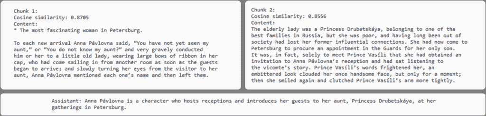
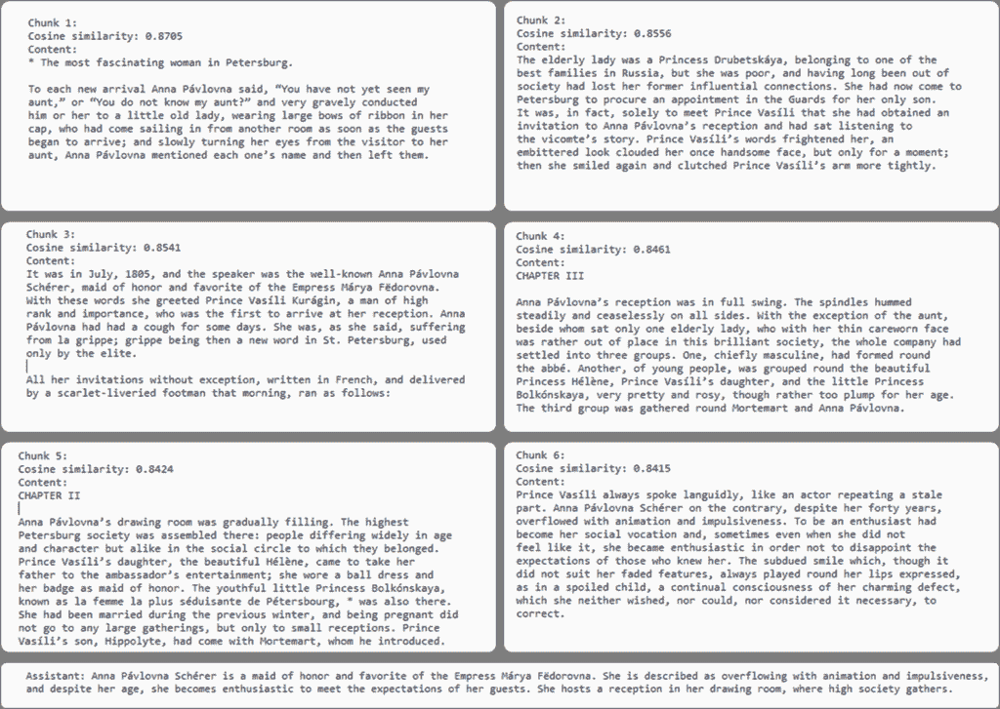
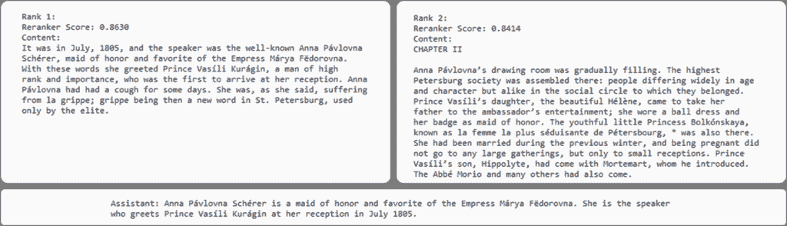
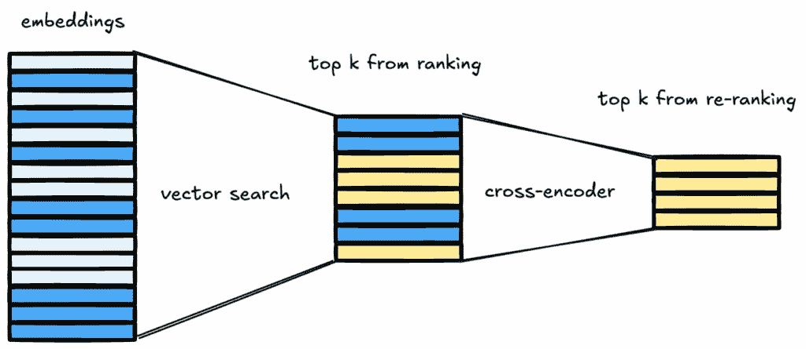

# RAG 解释：为了更好的答案进行重新排序

> 原文：[`towardsdatascience.com/rag-explained-reranking-for-better-answers/`](https://towardsdatascience.com/rag-explained-reranking-for-better-answers/)

在我上一篇文章[《RAG 解释：理解嵌入、相似性和检索》](https://towardsdatascience.com/rag-explained-understanding-embeddings-similarity-and-retrieval/)中，我们探讨了 RAG 管道的检索机制是如何工作的。在 RAG 管道中，根据与用户查询的相似度，从知识库中识别和检索相关文档。更具体地说，使用检索度量（如余弦相似度、L2 距离或点积作为度量）量化每个文本块的相似度，然后根据相似度分数对文本块进行排序，最后，我们选择与用户查询最相似的顶级文本块。

不幸的是，高相似度分数并不总是保证完美的相关性。换句话说，检索器可能会检索到一个具有高相似度分数的文本块，但实际上并不那么有用——并不是我们需要的来回答用户问题的内容 🤷🏻‍♀️。这就是**重新排序**被引入的地方，作为一种在将结果输入到 LLM 之前改进结果的方法。

就像我之前的帖子一样，我将继续使用*[《战争与和平》](https://www.gutenberg.org/cache/epub/2600/pg2600.txt)*文本作为例子，该文本属于公共领域，并且可以通过[Project Gutenberg](https://www.gutenberg.org/)轻松访问。

> 🍨*[**DataCream**](https://datacream.substack.com/)是一个提供关于 AI、数据、技术的故事和教程的通讯。如果您对这些主题感兴趣，**[在此订阅](https://datacream.substack.com/).***

• • •

## 那么，重新排序怎么样呢？

仅基于检索度量检索到的文本块——即*原始检索*——可能由于几个不同的原因而并不那么有用：

+   我们最终得到的检索到的文本块可能会因选择的顶级块数量 k 而大幅变化。根据我们检索的顶级块数量 k，我们可能会得到非常不同的结果。

+   我们可能会检索到与我们所寻找的内容在语义上接近的块，但这些块仍然与主题无关，实际上并不适合回答用户的问题。

+   我们可能会得到与用户查询中包含的特定单词的部分匹配，导致包含这些特定单词但事实上并不相关的块。

回到我最喜欢的“战争与和平”例子中的问题，如果我们问“安娜·帕夫洛夫娜是谁？”，并且使用一个非常小的 k 值（比如 k = 2），检索到的片段可能包含的信息不足以全面回答问题。相反，如果我们允许检索大量的片段 k（比如说 k = 20），我们很可能会检索到一些无关的文本片段，其中只是提到了“安娜·帕夫洛夫娜”，但并不是片段的主题。因此，这些片段中的一些含义将与用户的查询无关，对回答问题没有帮助。因此，我们需要一种方法来区分所有检索到的文本片段中真正相关的片段。

在这里，有必要明确指出，针对这个问题的一个简单直接的解决方案就是检索所有内容并将所有内容传递到生成步骤（传递给 LLM）。不幸的是，由于各种原因，例如 LLM 有特定的上下文窗口，或者当信息过载时 LLM 的性能会下降，这无法实现。

因此，这就是我们通过引入重排序步骤来尝试解决的问题。本质上，重排序意味着根据余弦相似度分数对检索到的片段进行重新评估，这是一种更准确、但同时也更昂贵、更慢的方法。


作者图片 – 尝试将到目前为止所说的内容都放入一个单独的图表中 😅

有多种方法可以实现这一点，例如使用交叉编码器、使用 LLM 进行重排序或使用启发式方法。最终，通过引入这个额外的重排序步骤，我们实际上实现了所谓的两阶段检索加重排序，这是行业标准方法。这允许提高检索到的文本片段的相关性，从而提高生成响应的质量。

那么，让我们更详细地看看… 🔍

• • •

## 使用交叉编码器进行重排序

交叉编码器是在 RAG 框架中进行重排序的标准模型。与在初始检索步骤中使用的检索器函数不同，后者只考虑不同文本片段的相似度分数，交叉编码器能够对每个检索到的文本片段与用户查询进行更深入的比较。更具体地说，交叉编码器**联合嵌入文档和用户查询，并生成一个相似度分数**。另一方面，在基于余弦相似度的检索中，文档和用户查询是分别嵌入的，然后计算它们的相似度。因此，在分别创建嵌入时，原始文本的一些信息会丢失，而当文本联合嵌入时，会保留更多信息。因此，交叉编码器可以更好地评估两个文本片段之间的相关性（即用户的查询和文档）。


那么为什么一开始不使用交叉编码器呢？答案是交叉编码器非常慢。例如，对大约 1,000 个段落进行余弦相似度搜索只需不到一毫秒。相反，仅使用交叉编码器（如[ms-marco-MiniLM-L-6-v2](https://www.sbert.net/docs/pretrained-models/ce-msmarco.html)）来搜索相同的 1,000 个段落并匹配单个查询会慢得多！

如果你这样考虑，这是可以预料的，因为使用交叉编码器意味着我们必须将知识库的每个块与用户的查询配对，并立即嵌入它们，并且对于每个新的查询。相反，基于余弦相似度的检索，我们可以在事先创建知识库的所有嵌入，并且只需一次，然后当用户提交查询时，我们只需要嵌入用户的查询并计算成对的余弦相似度。

因此，我们适当地调整我们的 RAG 管道，以获得两者的最佳效果；首先，我们使用余弦相似度搜索缩小候选相关块的范围，然后在第二步中，我们使用交叉编码器更准确地评估检索到的块之间的相似性。

• • •

## 回到“战争与和平”示例

现在让我们通过再次回答我最喜欢的问题——“**谁是安娜·帕夫洛夫娜**？”来观察所有这些在“战争与和平”示例中的表现。

我目前的代码看起来是这样的：

```py
import os
from langchain.chat_models import ChatOpenAI
from langchain.document_loaders import TextLoader
from langchain.embeddings import OpenAIEmbeddings
from langchain.vectorstores import FAISS
from langchain.text_splitter import RecursiveCharacterTextSplitter
from langchain.docstore.document import Document

import faiss

api_key = "my_api_key"

# initialize LLM
llm = ChatOpenAI(openai_api_key=api_key, model="gpt-4o-mini", temperature=0.3)

# initialize embeddings model
embeddings = OpenAIEmbeddings(openai_api_key=api_key)

# loading documents to be used for RAG 
text_folder =  "RAG files"  

documents = []
for filename in os.listdir(text_folder):
    if filename.lower().endswith(".txt"):
        file_path = os.path.join(text_folder, filename)
        loader = TextLoader(file_path)
        documents.extend(loader.load())

splitter = RecursiveCharacterTextSplitter(chunk_size=1000, chunk_overlap=100)
split_docs = []
for doc in documents:
    chunks = splitter.split_text(doc.page_content)
    for chunk in chunks:
        split_docs.append(Document(page_content=chunk))

documents = split_docs

# normalize knowledge base embeddings
import numpy as np
def normalize(vectors):
    vectors = np.array(vectors)
    norms = np.linalg.norm(vectors, axis=1, keepdims=True)
    return vectors / norms

doc_texts = [doc.page_content for doc in documents]
doc_embeddings = embeddings.embed_documents(doc_texts)
doc_embeddings = normalize(doc_embeddings)

# faiss index with inner product
import faiss
dimension = doc_embeddings.shape[1]
index = faiss.IndexFlatIP(dimension)  # inner product index
index.add(doc_embeddings)

# create vector database w FAISS 
vector_store = FAISS(embedding_function=embeddings, index=index, docstore=None, index_to_docstore_id=None)
vector_store.docstore = {i: doc for i, doc in enumerate(documents)}

def main():
    print("Welcome to the RAG Assistant. Type 'exit' to quit.\n")

    while True:
        user_input = input("You: ").strip()
        if user_input.lower() == "exit":
            print("Exiting…")
            break

        # embedding + normalize query
        query_embedding = embeddings.embed_query(user_input)
        query_embedding = normalize([query_embedding]) 

        # search FAISS index
        D, I = index.search(query_embedding, k=2)

        # get relevant documents
        relevant_docs = [vector_store.docstore[i] for i in I[0]]
        retrieved_context = "\n\n".join([doc.page_content for doc in relevant_docs])

        # D contains inner product scores == cosine similarities (since normalized)
        print("\nTop chunks and their cosine similarity scores:\n")
        for rank, (idx, score) in enumerate(zip(I[0], D[0]), start=1):
           print(f"Chunk {rank}:")
           print(f"Cosine similarity: {score:.4f}")
           print(f"Content:\n{vector_store.docstore[idx].page_content}\n{'-'*40}")

        # system prompt
        system_prompt = (
            "You are a helpful assistant. "
            "Use ONLY the following knowledge base context to answer the user. "
            "If the answer is not in the context, say you don't know.\n\n"
            f"Context:\n{retrieved_context}"
        )

        # messages for LLM 
        messages = [
            {"role": "system", "content": system_prompt},
            {"role": "user", "content": user_input}
        ]

        # generate response
        response = llm.invoke(messages)
        assistant_message = response.content.strip()
        print(f"\nAssistant: {assistant_message}\n")

if __name__ == "__main__":
    main() 
```

对于 k = 2，我们得到以下检索到的顶级块。



但是，如果我们设置 k = 6，我们会得到以下检索到的块，以及一些更丰富的答案，其中包含关于我们问题的额外数据，比如她是“**荣誉新娘和女皇玛利亚·费多罗夫娜的宠儿**”。



现在，让我们调整我们的代码来重新排序这 6 个块，看看前两个是否保持不变。为此，我们将使用交叉编码器模型来重新排序传递给您的 LLM 的顶级-k 检索文档。更具体地说，我将利用[cross-encoder/ms-marco-TinyBERT-L2](https://huggingface.co/cross-encoder/ms-marco-TinyBERT-L2)交叉编码器，这是一个简单的、预训练的交叉编码模型，在 PyTorch 上运行。为此，我们还需要导入`torch`和`transformers`库。

```py
import torch
from sentence_transformers import CrossEncoder
```

然后，我们可以初始化交叉编码器并定义一个函数来重新排序从向量搜索中检索到的顶级 k 个块：

```py
# initialize cross-encoder model
cross_encoder = CrossEncoder('cross-encoder/ms-marco-TinyBERT-L-2', device='cuda' if torch.cuda.is_available() else 'cpu')

def rerank_with_cross_encoder(query, relevant_docs):

    pairs = [(query, doc.page_content) for doc in relevant_docs] # pairs of (query, document) for cross-encoder
    scores = cross_encoder.predict(pairs) # relevance scores from cross-encoder model

    ranked_indices = np.argsort(scores)[::-1] # sort documents based on cross-encoder score (the higher, the better)
    ranked_docs = [relevant_docs[i] for i in ranked_indices]
    ranked_scores = [scores[i] for i in ranked_indices]

    return ranked_docs, ranked_scores
```

…并且相应地调整函数如下：

```py
 ...

        # search FAISS index
        D, I = index.search(query_embedding, k=6)

        # get relevant documents
        relevant_docs = [vector_store.docstore[i] for i in I[0]]

        # rerank with our function
        reranked_docs, reranked_scores = rerank_with_cross_encoder(user_input, relevant_docs)

        # get top reranked chunks
        retrieved_context = "\n\n".join([doc.page_content for doc in reranked_docs[:2]])

        # D contains inner product scores == cosine similarities (since normalized)
        print("\nTop 6 Retrieved Chunks:\n")
        for rank, (idx, score) in enumerate(zip(I[0], D[0]), start=1):
            print(f"Chunk {rank}:")
            print(f"Similarity: {score:.4f}")
            print(f"Content:\n{vector_store.docstore[idx].page_content}\n{'-'*40}")

        # display top reranked chunks
        print("\nTop 2 Re-ranked Chunks:\n")
        for rank, (doc, score) in enumerate(zip(reranked_docs[:2], reranked_scores[:2]), start=1):
            print(f"Rank {rank}:")
            print(f"Reranker Score: {score:.4f}") 
            print(f"Content:\n{doc.page_content}\n{'-'*40}")

        ...
```

…最后，这些是前两个块，以及经过交叉编码器重新排序后得到的相应答案：



注意这两个块与从向量搜索中得到的顶级两个块是不同的。

因此，重新排序步骤的重要性变得清晰。我们使用向量搜索来缩小知识库中所有可能相关的块的范围，然后使用重新排序步骤来准确识别最相关的块。



图片由作者提供

我们可以将两步检索想象成一个漏斗：第一阶段吸引了一大批候选块，而重新排序阶段则过滤掉了不相关的块。剩下的就是最有用的上下文，从而得出更清晰、更准确的答案。

• • •

## 在我心中

因此，成为构建稳健的 RAG 管道的关键步骤变得显而易见。从根本上说，它使我们能够弥合快速但不够精确的向量搜索与上下文感知答案之间的差距。通过执行两步检索，第一步是向量搜索，第二步是重新排序，我们得到了两者的最佳结合：大规模的效率和更高品质的响应。在实践中，这种两阶段方法使得现代 RAG 管道既实用又强大。

### • • •

*喜欢这篇帖子？让我们成为朋友！加入我：*

📰***[Substack](https://datacream.substack.com/)*** 💌* **[Medium](https://medium.com/@m.mouschoutzi)*** 💼***[LinkedIn](https://www.linkedin.com/in/mariamouschoutzi/)*** ☕***[请我喝咖啡](http://buymeacoffee.com/mmouschoutzi)!***

• • •

## 那么，关于 pialgorithms 呢？

想要将 RAG 的力量带入您的组织？

[**pialgorithms**](https://pialgorithms.com/) 可以为您做到 ***👉*** [***预约演示***](https://pialgorithms.com/#contact) ***今天！***
