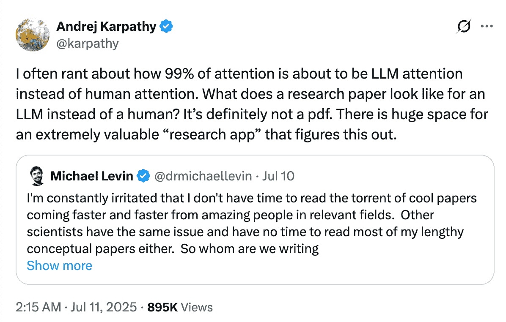
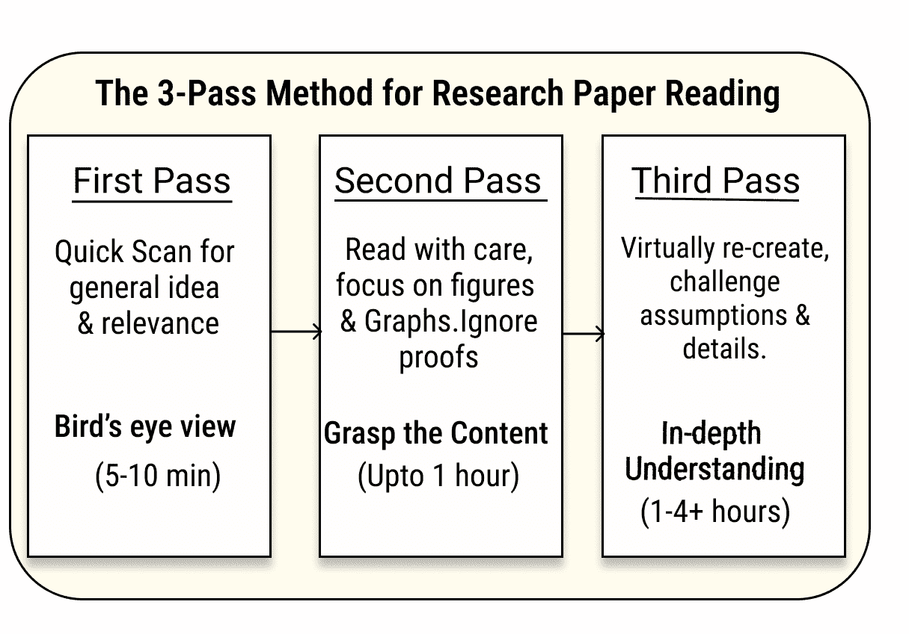
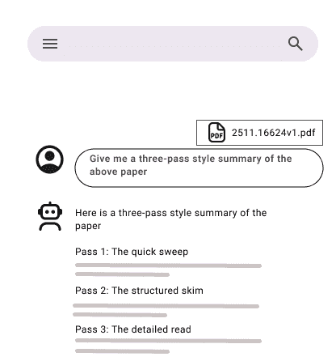
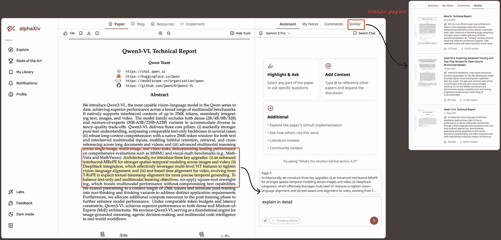
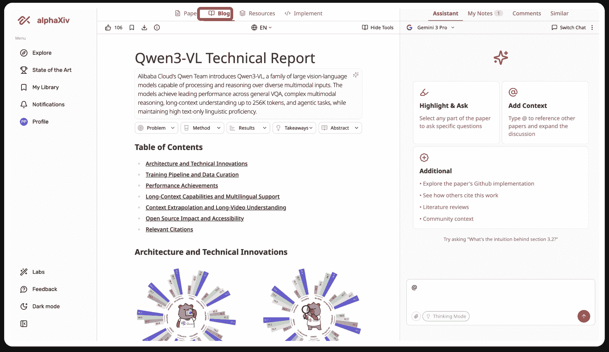
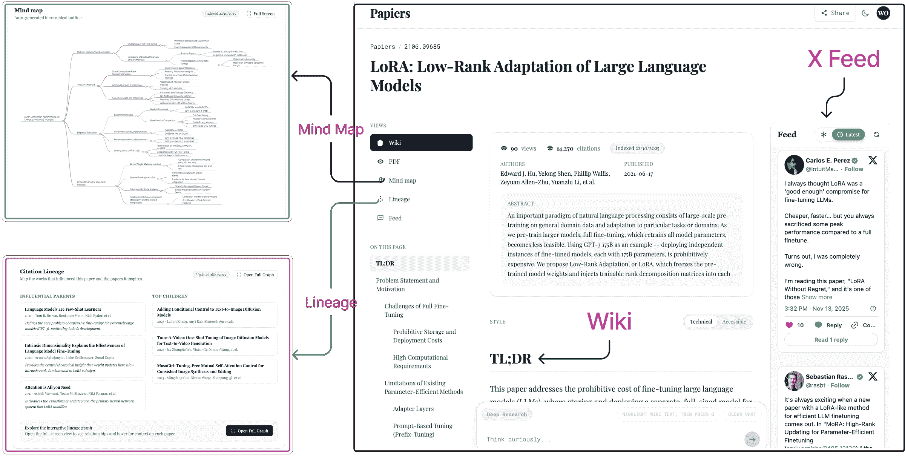
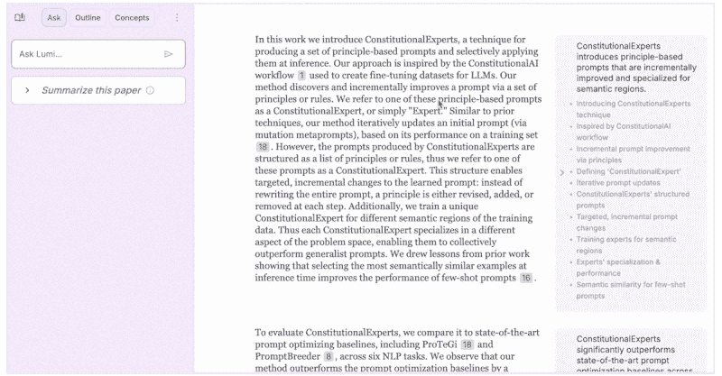
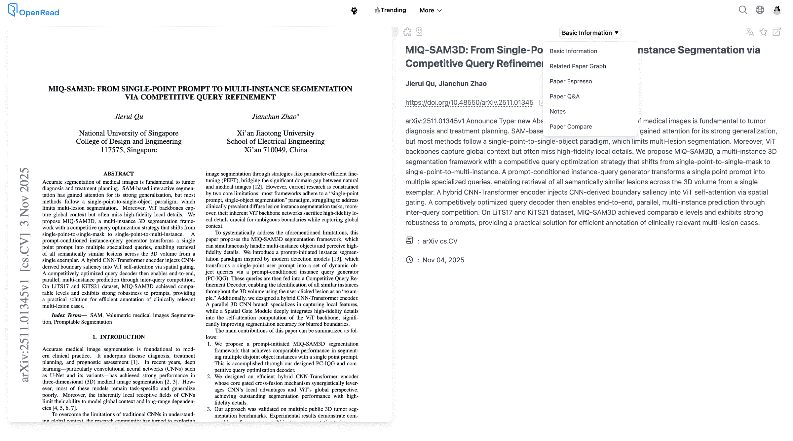
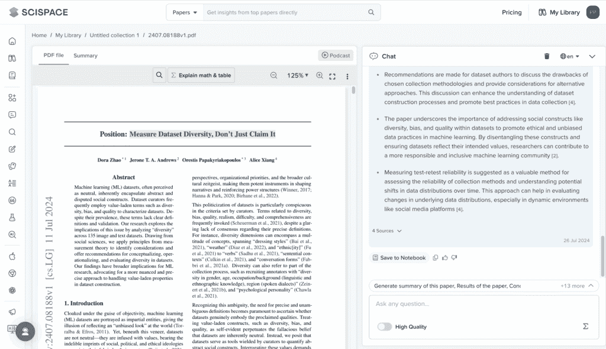
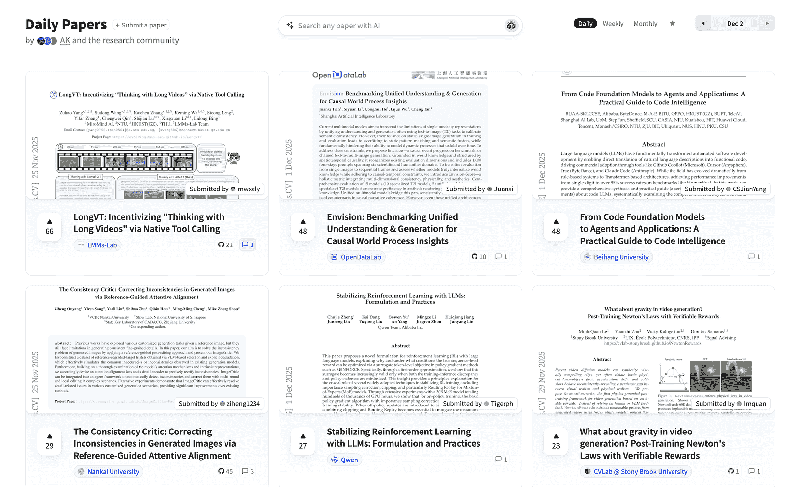

# 在 LLMs 时代的阅读研究论文

> 原文：[`towardsdatascience.com/reading-research-papers-in-the-age-of-llms/`](https://towardsdatascience.com/reading-research-papers-in-the-age-of-llms/)

<mdspan datatext="el1764881417669" class="mdspan-comment">最近在 X 上有一个有趣的讨论，关于由于研究论文数量不断增加，跟上新研究变得越来越困难。坦白说，这是一个普遍的共识，即我们无法跟上当前 AI 领域正在发生的研究，如果我们无法跟上，我们就会错过很多重要信息。对话的核心是：如果人类无法阅读，我们为谁写作？如果 LLMs 是真正阅读论文的人，那么理想的格式是什么？**</mdspan>

[(https://x.com/karpathy/status/1943411187296686448?s=20)]

这让我思考，并让我想起了我 2021 年写的一篇文章，关于我用来[有效阅读研究论文的工具](https://towardsdatascience.com/my-favorite-tools-for-managing-organizing-and-reading-research-papers-56525083b827/)以及我当时的阅读方式。那是在 ChatGPT 时代之前，我意识到自从那时起，我的论文阅读方式发生了多大的变化。

因此，我分享了我今天如何阅读研究论文，无论是手动还是借助 AI 辅助。我希望如果你也感到压力过大，这些想法或工具可能有助于你构建适合你的流程。***我并不真的知道在 LLM 时代理想的论文格式应该是什么样子***，但至少我可以分享到目前为止对我有效的方法。

## 手动方式——三遍阅读法风格

曾经有一段时间，所有的阅读都是手工的，我们要么打印纸张阅读，要么通过电子阅读器阅读。在那个时期，我接触到了 S. Keshav 写的一篇关于[**三遍阅读法**](https://www.lib.sfu.ca/system/files/32376/paper-reading.pdf)的论文。我相信你也一定遇到过。这是一种简单而优雅的阅读论文方法，通过将过程分为三个步骤。



3 遍阅读法总结 | 图片由作者提供

如上图所示，三遍阅读法让你可以根据你的目的和可用时间来控制你想要深入到什么程度。以下是每个步骤涉及的内容：

1.  **第一遍**提供一个快速的鸟瞰图。你扫描论文以了解其主要思想，并检查其相关性。目标是阅读结束后回答**5 Cs**：论文的类别、其**贡献**、假设是否**正确**、写作的**清晰度**和工作的**背景**。这不应该超过 5-10 分钟。

1.  第二遍可能需要一个小时，并且会深入一些。你可以做笔记和评论，但现在可以先跳过证明。你主要需要关注图表和图形，并尝试看这些想法是如何相互关联的。

1.  第三遍和最后一遍需要时间。到现在你已经知道这篇论文是相关的，所以这是你仔细阅读的阶段。你应该能够追踪整个论点，理解步骤，并在心理上重现这项工作。这也是你质疑假设并检查这些想法是否站得住脚的阶段。

即使今天，我也尽可能地从三遍法开始。我发现它不仅对研究论文有用，而且对长篇技术博客和文章也很有用。

聊天机器人摘要方式——普通风格



使用三遍法让大型语言模型总结论文 | 图片由作者提供

今天，将论文放入一个由大型语言模型驱动的聊天机器人中并要求快速摘要很容易。这没什么错，但我感觉大多数 AI 摘要都很简短，有时会简化想法。

但我发现很少的提示词比简单的“**总结这篇论文**”输入更有效。例如，你可以要求大型语言模型以三遍式输出摘要，这正是我们在上一节讨论的方法，它能提供更好的输出。

```py
Give me a three-pass style look at this paper.
Pass 1: a quick skim of what the paper is about.
Pass 2: the main ideas and why they matter.
Pass 3: the deeper details I should pay attention to.
```

另一个效果很好的提示词是简单的问题-想法-证据风格：

```py
Tell me:
• what problem the paper tries to solve
• the main idea they use
• how they support it
• what the results mean.
```

或者，如果我想检查一篇论文与以往工作的比较，我可以这样问：

```py
 Give me the main idea of the paper and also point out its limits or things 
to be careful about
```

如果你觉得第一个答案太简略，你总是可以继续聊天并要求更多细节。但对我来说，主要问题仍然是相同的：你需要切换标签页来查看论文，然后比较解释，而这两个都在不同的地方。对我来说，这种不断的来回切换变成了一个摩擦点。必须有一种更好的方法，将源和 AI 辅助都保持在同一画布上，这把我们带到了下一部分。

## 专门的工具方式——界面很重要

因此，我开始探索那些提供大型语言模型辅助但提供更好用户界面和更流畅阅读体验的工具。以下是我个人使用过的三个工具。这不是一个详尽的列表，只是在我经验中，这些工具在不取代核心阅读体验的情况下表现良好。我还会指出我最喜欢的每个工具的功能。

### 1. alphaXiv

[AlphaXiv](https://www.alphaxiv.org/) 是我长期使用的一个工具，因为它在平台上集成了许多有用的功能。在这里找到论文很容易，无论是通过他们的动态，还是通过将任何 arXiv 链接中的**arxiv**替换为**alphaxiv**。你将获得一个干净的界面，以及一些直接位于论文之上的 AI 辅助工具。这里有一个熟悉的聊天窗口，除此之外，你还可以突出显示论文的任何部分并直接提问。你也可以使用**@功能**从其他论文中拉取上下文。如果你想深入了解，它会显示相关论文、GitHub 代码、他人如何引用该作品以及该主题周围的小文献笔记。还有一个 AI 音频讲座功能，但我并不经常使用。



展示不同可用工具的 alphaXiv 界面 | 图片由作者提供

我最喜欢的部分是**博客风格模式**。它给了我一个简单、易读的论文版本，帮助我决定是否应该进行完整的深度阅读。它保留了图表和结构，几乎就像我会把论文变成博客一样。



博客版论文，由 alphaXiv 创建 | 图片由作者提供

+   **尝试方法：**在任何 arXiv 链接中将*arxiv*替换为*alphaxiv*，或者直接从他们的网站**alphaxiv.org**打开。

### 2. Papiers

你是如何发现新论文的？对我来说，是通过几份新闻简报，但大多数时候是从一些显赫的 X 账户。然而，问题是存在许多这样的账户，因此噪音很多，信号变得难以追踪。[Papiers](https://papiers.ai/) 将关于论文及其相关论文的对话聚集在一个地方，使得发现阅读流程本身的一部分。

Papiers 是一个相对较新的工具，但已经有一些很棒的功能。例如，除了获取关于论文的对话外，你还可以以两种格式获得**Wiki 风格**的视图——技术性和可访问性，这样你可以根据你对主题的舒适度选择格式。还有一个**谱系**视图，显示了论文的父亲和子代，这样你可以看到塑造了这项工作的是什么，以及之后发生了什么。还有一个思维导图功能（类似于 NotebookLM），相当不错。



在[Papiers.ai](https://papiers.ai/)中，一篇论文的思维导图、谱系、wiki 视图和 X 动态并排显示 | 图片由作者提供

我想指出的是，这个工具确实对一些论文给出了*`找不到论文`*错误，或者 X 动态缺失了几项。但对于显赫的论文来说，它确实有效。我在一个 X 帖子中四处寻找，发现论文目前是按需索引的，所以我想这可以解释这一点。但这是一个新的工具，我真的很喜欢它的提供，所以我相信这部分会随着时间的推移而改进。

+   **如何尝试**：将任何 arXiv 链接中的*arxiv*替换为 papiers，或者直接从他们的网站 papiers 打开。

### 3. Lumi

Lumi 是谷歌[People + AI Research](https://pair.withgoogle.com/)小组的一个开源工具，就像他们的大多数工作一样，它拥有令人惊叹且深思熟虑的用户界面。Lumi 突出了论文的关键部分，并在侧边栏中放置了简短的摘要，这样你总是可以阅读原始论文以及 AI 生成的摘要。你还可以点击任何参考文献，它会直接带你到论文中的确切句子。Lumi 的突出特点是它不仅解释文本，你还可以选择一个图像并让 Lumi 解释它。

唯一的缺点是它目前只适用于 Creative Commons 许可下的[arXiv](https://www.linkedin.com/company/arxiv/)论文，但我很希望看到它扩展到涵盖所有 arXiv，甚至可能允许上传其他论文的 PDF。



Lumi 中提供了解释文本和解释图像的选项 | 作者截图

+   **如何尝试**：访问[`lumi.withgoogle.com/`](https://lumi.withgoogle.com/)，然后在一个 Creative Commons 许可下将 arxiv 论文导入界面

## 值得一提的其他工具

虽然我主要使用上面提到的工具，但还有一些其他工具我确实接触过，如果它们适合你的工作流程，我鼓励你尝试一下：它们没有成为我的主要选择，但它们确实有一些好主意，可能根据你的阅读风格对你很有帮助。

+   [**OpenRead**](https://www.openread.academy/)也是阅读论文和进行文献综述的一个很好的选择。它有一些很好的附加功能，如比较论文、**论文图**来显示相关论文，以及**论文浓缩**功能，它提供了一个简洁的一页纸摘要。



在[OpenRead](https://www.openread.academy/)界面阅读论文，同时展示其他可用的阅读模式 | 作者截图

这里需要注意的是，OpenRead 是一个付费工具，但也提供免费增值版本。

+   [**SciSpace**](https://scispace.com/)是一个非常通用的工具，除了能够与论文进行聊天外，你还可以进行语义文献综述，深入研究研究，撰写论文，甚至为你的工作创建可视化。它还提供了许多其他功能，你可以在他们的套件中探索。像 OpenRead 一样，它也是一个付费工具，免费层提供有限的功能。



在 SciSpace 中阅读论文的界面 | 作者截图

+   [**每日论文**](https://huggingface.co/papers/trending) 由 HuggingFace 提供，如果你希望查看热门论文，这是一个不错的选择。关于它的另一个优点是，你可以立即看到 HuggingFace 上引用特定论文（如果存在）的模型、数据集和空间，并且可以与作者进行聊天。



HuggingFace 的每日论文截图，显示了 [2025 年 12 月 2 日](https://huggingface.co/papers/date/2025-12-02) 的论文展示 | 图片由作者提供

## 结论

我大部分的阅读都是我博客文献综述的一部分，它结合了我上面提到的三种策略。我仍然喜欢手动浏览论文，但当我想要进一步探索、查看相关论文或更深入地理解某些内容时，我提到的这三种工具对我帮助很大。我知道还有许多其他辅助阅读论文的人工智能工具，但就像俗语所说“人多嘴杂，事情办砸”，我喜欢坚持使用少数几个工具，除非有真正出色的功能，否则不会在喜欢的工具之间跳来跳去。
