# 微软 Fabric 中的实时智能：终极指南

> 原文：[`towardsdatascience.com/real-time-intelligence-in-microsoft-fabric-the-ultimate-guide/`](https://towardsdatascience.com/real-time-intelligence-in-microsoft-fabric-the-ultimate-guide/)

<mdspan datatext="el1759512612142" class="mdspan-comment">从前有段时间</mdspan>，处理流数据被认为是一种**先锋**方法。自从 20 世纪 70 年代引入关系数据库管理系统和 20 世纪 80 年代末的传统数据仓库系统以来，所有数据工作负载都始于所谓的**批量处理**。批量处理依赖于将大量任务收集在组（或批量）中，并在单个操作中处理这些任务。

另一方面，有一个**流数据**的概念。尽管流数据有时仍被认为是一种尖端技术，但它已经拥有一个坚实的基础。一切始于 2002 年，当时斯坦福大学的研究人员发表了题为“[数据流系统中的模型和问题](https://dl.acm.org/doi/10.1145/543613.543615)”的论文。然而，直到近十年后（2011 年），流数据系统才开始获得更广泛的受众，当时用于存储和处理流数据的 Apache Kafka 平台被开源。正如人们所说，其余的都是历史。如今，处理流数据不再被视为一种奢侈品，而是一种必需品。

微软认识到处理数据“**一旦到达**”的日益增长的需求。因此，在这一点上，微软 Fabric 不会让人失望，因为实时智能是整个平台的核心，并提供了一系列功能来高效地处理流数据。

在我们深入解释实时智能的每个组件之前，让我们退一步，以更工具无关的方法来探讨流处理的一般方法。

***什么是流处理？***

如果你从章节标题中输入短语到谷歌搜索，你会得到超过 10 万条结果！因此，我分享了一个代表 **我们** 对流处理理解的插图。

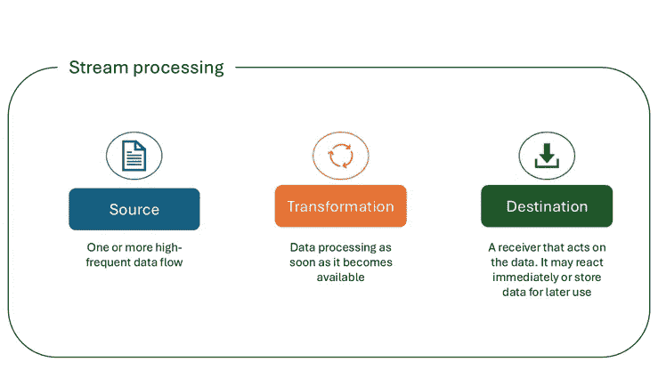

作者插画

让我们现在来探讨流处理的典型用例：

+   欺诈检测

+   实时股票交易

+   客户活动

+   日志监控——故障排除系统、设备等。

+   安全信息和事件管理——分析日志和实时事件数据以进行监控和威胁检测

+   仓库库存

+   共享出行匹配

+   机器学习和预测分析

正如你可能已经注意到的，流数据已成为众多现实场景的组成部分，并且被认为在上述用例中远远优于传统的批量处理。

让我们现在来探讨在微软 Fabric 中如何执行流数据处理，以及我们有哪些可用的工具。

下面的插图显示了 Microsoft Fabric 中所有实时智能组件的高级概述：

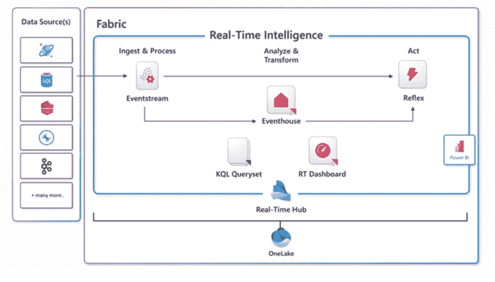

微软学习插图

## 实时中心

让我们从介绍实时中心开始。每个 Microsoft Fabric 租户都会自动配置一个实时中心。这是整个组织所有*数据流*的焦点。类似于 OneLake，每个租户只能有一个实时中心——这意味着您不能配置或创建多个实时中心。

实时中心的主要目的是使从广泛的数据源快速轻松地发现、摄取、管理和消费流数据成为可能。在下面的插图中，您可以找到 Microsoft Fabric 中实时中心中所有数据流的概述：

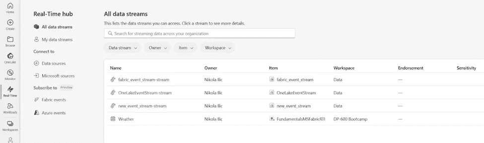

图片由作者提供

让我们现在探索实时中心中所有可用的选项。

+   **所有数据流**标签显示您可以访问的所有流和表。流代表 Fabric 事件流的输出，而表来自 KQL 数据库。在接下来的几节中，我们将更详细地探讨事件流和 KQL 数据库。

+   **我的数据流**标签显示所有已将到 Microsoft Fabric 中的我的工作区中的流。

+   **数据源**标签是数据进入 Fabric 的核心，无论是内部还是外部。一旦您进入数据源标签，您可以选择众多开箱即用的连接器，例如 Kafka、针对各种数据库系统的 CDC 流、AWS 和 GCP 等外部云解决方案，等等。

+   **Microsoft 数据源**标签筛选出之前的一组源，仅包括 Microsoft 数据源。

+   **Fabric 事件**标签显示您可以访问的 Microsoft Fabric 中生成的系统事件列表。在这里，您可以选择作业事件、OneLake 事件和工作区项目事件。让我们深入了解这三个选项：

    +   作业事件是由 Fabric 监控活动状态变化产生的事件，例如作业创建、成功或失败。

    +   OneLake 事件代表在 OneLake 中对文件和文件夹进行操作产生的事件，例如文件创建、删除或重命名

    +   工作区项目事件是由对工作区项目进行的操作产生的，例如项目创建、删除或重命名。

+   **Azure 事件**标签显示在 Azure Blob 存储中生成的系统事件列表。

实时中心提供了各种连接器，用于将数据导入 Microsoft Fabric。它还允许为所有支持的数据源创建流。创建流后，您可以处理、分析和对它们采取行动。

+   **处理**流允许您应用多种转换，例如聚合、过滤、合并等等。目标是转换数据，在将输出发送到支持的目的地之前。

+   **分析**流可以使你将 KQL 数据库作为流的目的地添加，然后打开 KQL 数据库并对其执行查询。

+   **对流的操作**假设基于条件设置警报并指定在满足某些条件时要采取的操作

## Eventstreams

如果你是一名低代码或无代码数据专业人士，并且需要处理流数据，你将喜欢 Eventstreams。简而言之，Eventstream 允许你连接到众多数据源，我们在上一节中已经考察过，可选地应用各种数据转换步骤，并将最终结果输出到一个或多个目的地。以下图显示了将流数据导入三个不同目的地（Eventhouse、Lakehouse 和 Activator）的常见工作流程：

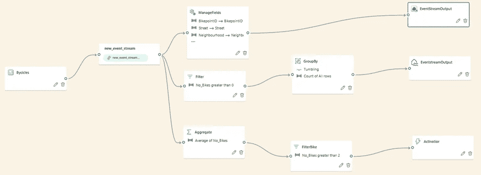

图片由作者提供

在 Eventstream 设置中，你可以调整传入数据的保留期。默认情况下，数据保留期为一天，当保留期到期时，事件将自动删除。

除了这些，你可能还希望微调传入和传出事件的吞吐量。有三种选项可供选择：

1.  **低**：< 10 MB/s

1.  **中**：10-100 MB/s

1.  **高**：> 100 MB/s

## Eventhouse 和 KQL 数据库

在上一节中，你已经学习了如何连接到各种流数据源，可选地转换数据，并将其最终加载到最终目的地。你可能已经注意到，其中一个可用的目的地是 Eventhouse。在本节中，我们将探讨用于在实时智能工作负载中存储数据的 Microsoft Fabric 项目。

## Eventhouse

我们首先介绍 Eventhouse 项目。Eventhouse 实际上就是一个 KQL 数据库的容器。Eventhouse 本身不存储任何数据——它只是在 Fabric 工作区中提供处理流数据的基础设施。以下图显示了 Eventhouse 的系统概述页面：

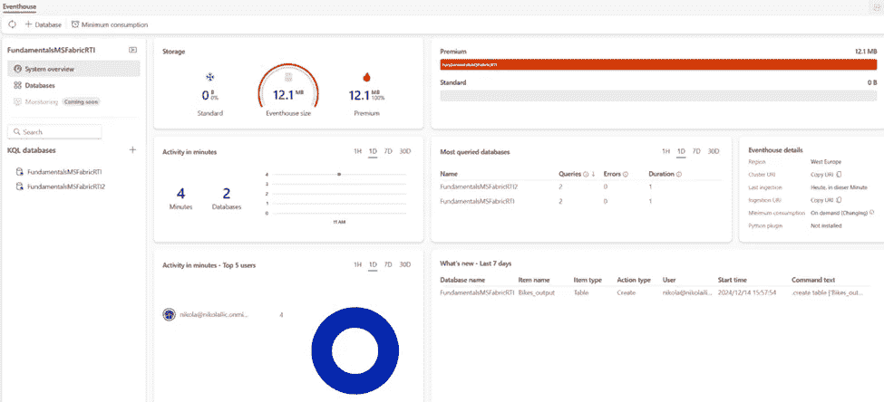

图片由作者提供

系统概述页的好处是它提供了一览无余的所有关键信息。因此，你可以立即了解 eventhouse 的运行状态，OneLake 存储使用情况，按每个 KQL 数据库级别进一步细分，计算使用情况，最活跃的数据库和用户，以及最近的事件。

如果我们切换到数据库页面，我们将能够看到现有 Eventhouse 中包含的 KQL 数据库的高级概述，如下所示：

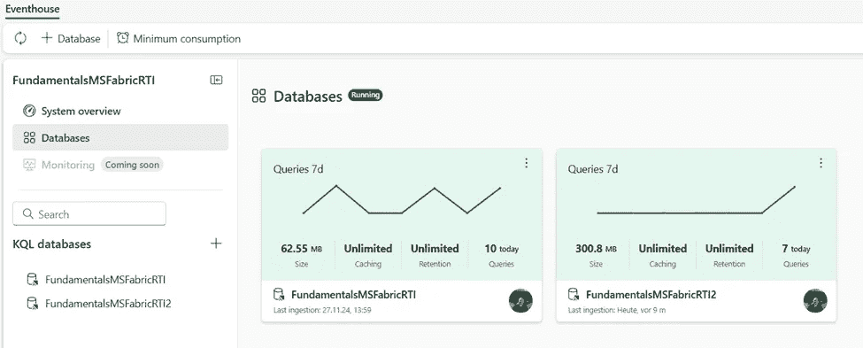

图片由作者提供

你可以在单个 Fabric 工作区中创建多个 eventhouse。此外，单个 eventhouse 可能包含一个或多个 KQL 数据库：

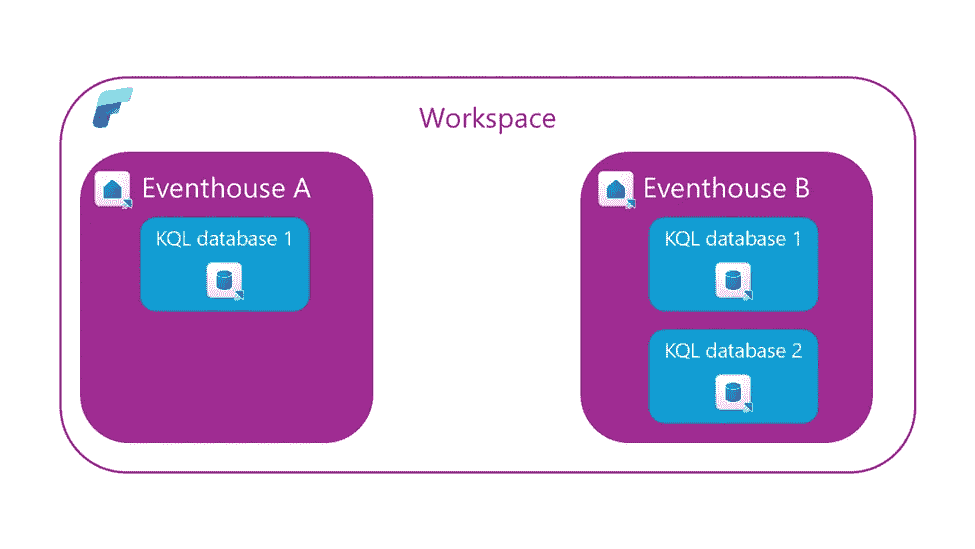

图片由作者提供

通过解释“**最小消耗**”的概念来结束 Eventhouse 的故事。按照设计，Eventhouse 在不使用时会自动挂起服务。因此，当这些服务重新激活时，可能需要一些时间才能使 Eventhouse 完全可用。然而，在某些业务场景中，这种延迟是不可接受的。在这些场景中，请确保配置最小消耗功能。通过配置最小消耗，服务始终可用，但你需要负责确定最小水平，然后该水平可供 Eventhouse 内部的 KQL 数据库使用。

## KQL 数据库

现在你已经了解了 Eventhouse 容器，让我们集中精力考察存储实时分析数据的核心项目——KQL 数据库。

让我们退一步，先解释一下这个项目的名称。虽然大多数数据专业人士至少听说过 SQL（代表结构化查询语言），但我非常确信 KQL 比它的“结构化”亲戚更加神秘。

你可能已经正确地假设，缩写中的 QL 代表查询语言。但，这个字母 K 代表什么呢？它是 **Kusto** 的缩写。我听到了，我听到了：现在的 Kusto 是什么？！尽管都市传说称这种语言是以著名的全能学者和海洋学家雅克·库斯托（他的姓氏发音为“**Kusto**”）命名的，但我无法找到来自微软的任何官方确认来证实这个故事。可以肯定的是，它曾是 [日志分析查询语言的内部项目名称](https://techcommunity.microsoft.com/discussions/azureobservability/what-is-name-of-azure-log-analytics-query-language-/173912)。

当我们谈到历史时，让我们分享更多历史教训。如果你过去曾与 Azure Data Explorer (ADX) 合作过，你很幸运。Microsoft Fabric 中的 KQL 数据库是 ADX 的官方继任者。类似于许多其他被重建并集成到 Fabric SaaS 化特性的 Azure 数据服务，ADX 为存储和查询 KQL 数据库的实时分析数据提供了平台。KQL 数据库的引擎和核心能力与 Azure Data Explorer 相同——主要区别在于管理行为：Azure Data Explorer 代表一个 PaaS（平台即服务），而 KQL 数据库是一个 SaaS（软件即服务）解决方案。

尽管你可以在 KQL 数据库中存储任何数据（非结构化、半结构化和结构化），但其主要目的是处理遥测、日志、事件、跟踪和时间序列数据。在底层，引擎利用优化的存储格式、自动索引和分区以及高级数据统计来实现高效的查询规划。

现在我们来探讨如何利用 Microsoft Fabric 中的 KQL 数据库来存储和查询实时分析数据。创建数据库的过程非常简单。以下图示了在 Fabric 中创建 KQL 数据库的 2 步过程：

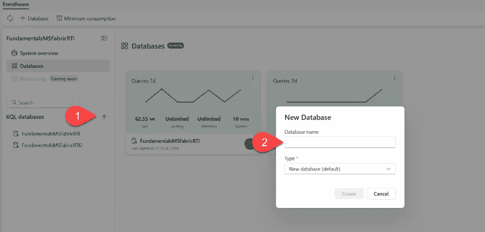

图片由作者提供

1.  点击 KQL 数据库旁边的“+”号

1.  提供数据库名称并选择其类型。类型可以是默认的新数据库，或快捷方式数据库。快捷方式数据库是对不同数据库的引用，可以是 Microsoft Fabric 中的实时智能中的另一个 KQL 数据库，或 Azure Data Explorer 数据库

*不要将[OneLake 快捷方式](https://data-mozart.com/mastering-dp-600-exam-create-and-manage-onelake-shortcuts/)的概念与实时智能中的快捷方式数据库类型混淆！后者仅仅引用了整个 KQL/Azure Data Explorer 数据库，而 OneLake 快捷方式允许使用存储在其他 OneLake 工作负载中的 Delta 表中的数据，例如 lakehouses 和/或 warehouses，甚至外部数据源（例如 ADLS Gen2、Amazon S3、Dataverse、Google Cloud Storage 等）。然后，可以使用**external_table()**函数从 KQL 数据库访问这些数据*

现在我们从用户界面角度快速浏览 KQL 数据库的关键功能。以下图示了主要感兴趣的点：

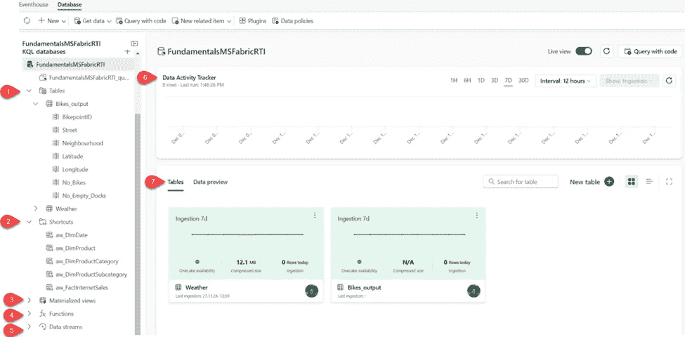

图片由作者提供

1.  **表** – 显示数据库中的所有表

1.  **快捷方式** – 显示作为 OneLake 快捷方式创建的表

1.  **物化视图** – 物化视图表示对源表或另一个物化视图的聚合查询。它由一个汇总语句组成

1.  **函数** – 这些是在数据库级别存储和管理的用户定义函数，类似于表。这些函数是通过使用.create function 命令创建的

1.  **数据流** – 所有与所选 KQL 数据库相关的流

1.  **数据活动跟踪器** – 显示所选时间段的数据库活动

1.  **表/数据预览** – 允许在两种不同的视图之间切换。表显示数据库表的概述，而数据预览显示所选表的顶部 100 条记录

## 在实时智能中查询和可视化数据

现在你已经学会了如何在 Microsoft Fabric 中存储实时分析数据，是时候动手从这些数据中提供一些业务见解了。在本节中，我将重点解释从存储在 KQL 数据库中的数据中提取有用信息的各种选项。

因此，在本节中，我将介绍常用的 KQL 函数用于数据检索，并探讨实时仪表板用于数据可视化。

## KQL 查询集

KQL 查询集是用于运行查询和从各种数据源查看和自定义结果的实体。一旦创建一个新的 KQL 数据库，KQL 查询集项就会自动提供。这是一个默认的 KQL 查询集，它自动连接到它存在的 KQL 数据库。默认的 KQL 查询集不允许多个连接。

反过来，当你创建自定义的 KQL 查询集项时，你可以将其连接到多个数据源，如下面的插图所示：

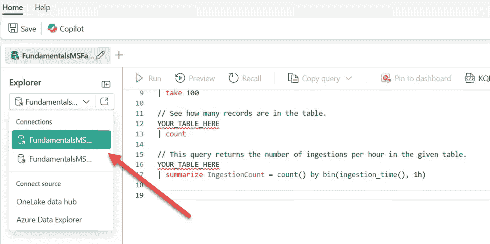

图片由作者提供

现在我们来介绍 KQL 的构建块，并检查一些最常用的操作符和函数。KQL 是一种相当简单但功能强大的语言。在某种程度上，它与 SQL 非常相似，特别是在使用组织在层次结构中的模式实体方面，如数据库、表和列。

最常见的 KQL 查询语句类型是***表表达式语句***。这意味着查询输入和输出都由表或表格数据集组成。表语句中的操作符按“|”符号（管道）进行排序。数据从（通过管道）一个操作符流向下一个操作符，如下面的代码片段所示：

```py
MyTable

| where StartTime between (datetime(2024-11-01) .. datetime(2024-12-01))

| where State == "Texas"  

| count
```

***管道是顺序的——数据是从一个操作员流向另一个操作员——这意味着查询操作员的顺序很重要，可能会对输出结果和性能产生影响。***

在上述代码示例中，MyTable 中的数据首先根据 StartTime 列进行过滤，然后根据 State 列进行过滤，最后查询返回一个包含单个列和单行的表，显示过滤行的计数。

此时，一个公平的问题可能是：如果我已经知道 SQL，我是否需要学习另一种语言只是为了查询实时分析数据？答案是通常如此：*这取决于*。

幸运的是，我有好消息要分享！

好消息是：你可以**可以**编写 SQL 语句来查询存储在 KQL 数据库中的数据。但，你*可以*做某事，并不意味着你*应该*…通过使用仅 SQL 的查询，你错过了重点，并限制了自己使用许多专为以最有效的方式处理实时分析查询而构建的 KQL 特定函数。

好消息是：通过利用***explain***操作符，你可以“询问”Kusto 将你的 SQL 语句翻译成等效的 KQL 语句，如下面的图所示：

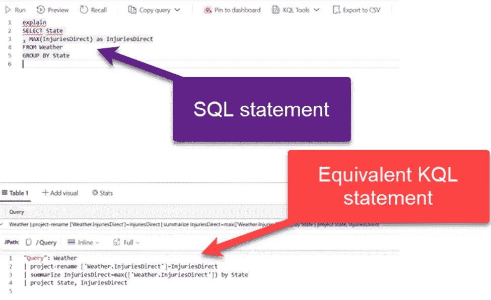

图片由作者提供

在以下示例中，我们将查询示例天气数据集，该数据集包含有关美国天气风暴和损害的数据。让我们从简单的查询开始，然后介绍一些更复杂的查询。在第一个示例中，我们将计算 Weather 表中的记录数：

```py
//Count records
Weather
| count
```

想要知道如何检索记录的子集？你可以使用*take*或*limit*操作符：

```py
//Sample data
Weather
| take 10
```

请记住，*take*操作符不会返回前 n 条记录，除非你的数据按特定顺序排序。通常，take 操作符会从表中返回**任意**n 条记录。

在下一步中，我们希望扩展这个查询，不仅返回行子集，还返回列子集：

```py
//Sample data from a subset of columns
Weather
| take 10
| project State, EventType, DamageProperty
```

**project**操作符相当于 SQL 中的 SELECT 语句。它指定了应包含在结果集中的哪些列。

在以下示例中，我们创建了一个计算列，Duration，它表示 EndTime 和 StartTime 值之间的持续时间。此外，我们还想按 DamageProperty 值降序显示仅前 10 条记录：

```py
//Create calculated columns
Weather
| where State == 'NEW YORK' and EventType == 'Winter Weather'
| top 10 by DamageProperty desc
| project StartTime, EndTime, Duration = EndTime - StartTime, DamageProperty
```

是时候介绍**summarize**操作符了。此操作符生成一个表，该表聚合输入表的内容。因此，以下语句将显示每个州的总记录数，包括仅前 5 个州：

```py
//Use summarize operator
Weather
| summarize TotalRecords = count() by State
| top 5 by TotalRecords
```

让我们扩展之前的代码，并在结果集中直接可视化数据。我将添加另一行 KQL 代码以将结果渲染为柱状图：

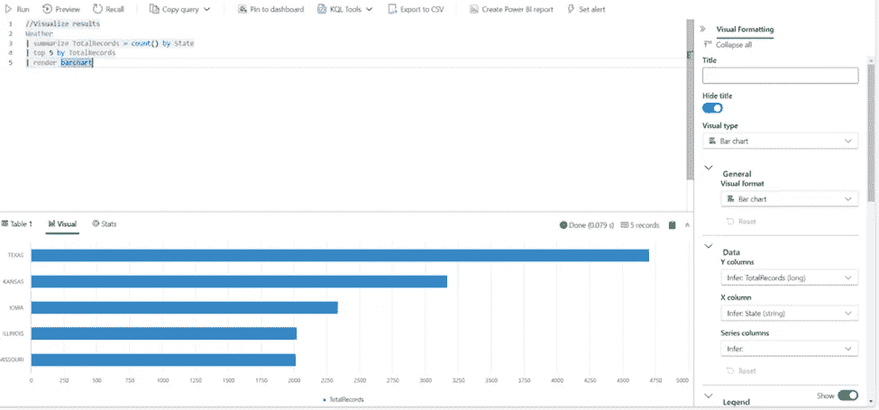

图片由作者提供

如你所注意到的，图表可以通过右侧的视觉格式化面板进一步自定义，这为可视化存储在 KQL 数据库中的数据提供了更多的灵活性。

这些只是使用 KQL 语言从 Eventhouse 和 KQL 数据库中检索数据的简单示例。我可以向你保证，在需要操作和检索实时分析数据的高级用例中，KQL 不会让你失望。

我明白 SQL 是许多数据专业人士的“通用语言”。尽管你可以编写 SQL 从 KQL 数据库中检索数据，但我强烈建议你避免这样做。作为一个快速参考，我为你提供了一个“**[SQL 到 KQL 速查表](https://learn.microsoft.com/en-us/kusto/query/sql-cheat-sheet?view=azure-data-explorer&preserve-view=true#sql-to-kusto-cheat-sheet)**”，以便你在从 SQL 过渡到 KQL 时有一个良好的开端。

此外，我的朋友和同事 MVP [Brian Bønk](https://www.linkedin.com/in/brianbonk/) 发布并维护了一个关于 KQL 语言的出色参考指南[在此](https://kql.how/)。如果你在使用 KQL，请务必尝试一下。

## 实时仪表板

虽然 KQL 查询集代表了一种探索和查询存储在 Eventhouses 和 KQL 数据库中的数据的有力方式，但它们的可视化能力相当有限。是的，你可以在查询视图中可视化结果，就像你在之前的示例中看到的那样，但这更像是一种“急救”可视化，这不会让你的经理和业务决策者满意。

幸运的是，实时智能中有一个现成的解决方案，支持高级数据可视化概念和功能。实时仪表板是 Fabric 中的一个项目，它能够创建交互性和视觉上吸引人的业务报告解决方案。

让我们首先确定实时仪表板的核心元素。仪表板由一个或多个小部件组成，这些小部件可以按页结构化和组织，其中每个小部件由底层的 KQL 查询填充。

在创建实时仪表板的过程中的第一步，必须在你的 Fabric 租户的管理门户中启用此设置：

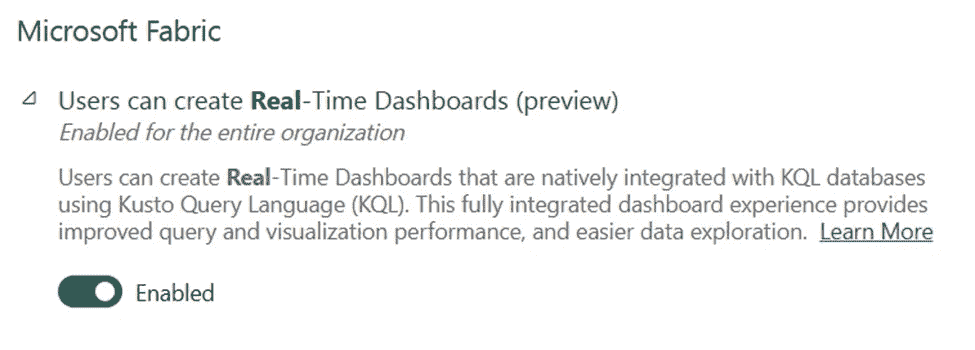

图片由作者提供

接下来，你应在 Fabric 工作区中创建一个新的实时仪表板项目。从那里，让我们连接到我们的天气数据集并配置我们的第一个仪表板小部件。我们将执行上一节中的一个查询，以检索具有条件计数函数的前 10 个州。下面的图显示了具有众多配置选项的小部件设置面板：

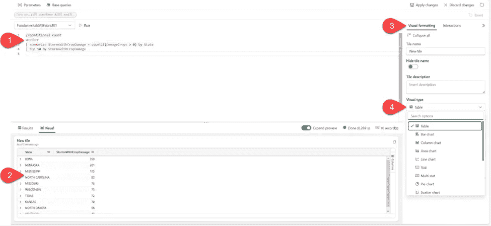

图片由作者提供

1.  用于填充小部件的 KQL 查询

1.  数据的视觉表示

1.  可视格式化面板，其中包含设置小部件名称和描述的选项

1.  可视类型下拉菜单用于选择所需的视觉类型（在我们的案例中，是表格视觉）

现在我们再向仪表板添加两个更多的小部件。我将复制并粘贴我们之前使用的两个查询——第一个将检索按总记录数排名前 5 的州，而另一个将显示纽约州和事件类型（等于冬季天气）随时间变化的损害属性值。

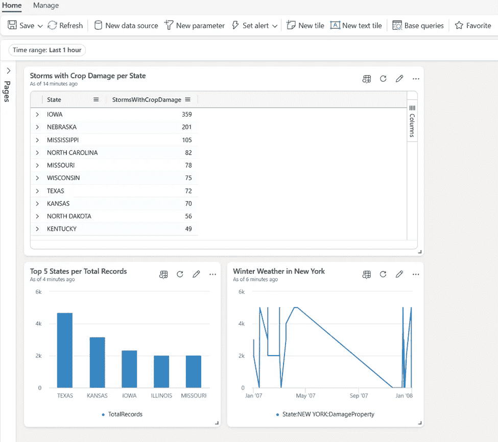

图片由作者提供

你还可以直接从 KQL 查询集中将小部件添加到现有仪表板中，如图所示：

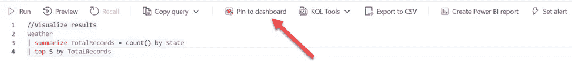

图片由作者提供

现在我们来关注你在使用实时仪表板时拥有的各种功能。在上方的工具栏中，你可以找到添加新的数据源、设置新的参数和添加基本查询的选项。然而，真正使实时仪表板强大的是设置实时仪表板警报的可能性。根据警报中定义的条件是否满足，你可以触发特定的操作，例如发送电子邮件或 Microsoft Teams 消息。警报是通过激活项目创建的。

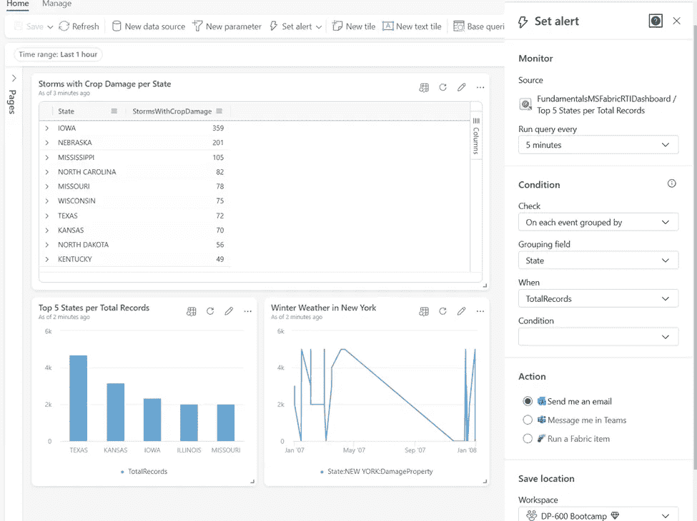

图片由作者提供

## 使用 Power BI 可视化数据

Power BI 是一个成熟且广泛采用的工具，用于构建强大、可扩展和交互式的业务报告解决方案。在本节中，我们特别关注探讨 Power BI 如何与 Microsoft Fabric 中的实时智能工作负载协同工作。

基于存储在 KQL 数据库中的数据创建 Power BI 报告非常简单。你可以选择直接从下面的 KQL 查询集中创建 Power BI 报告，如图所示：

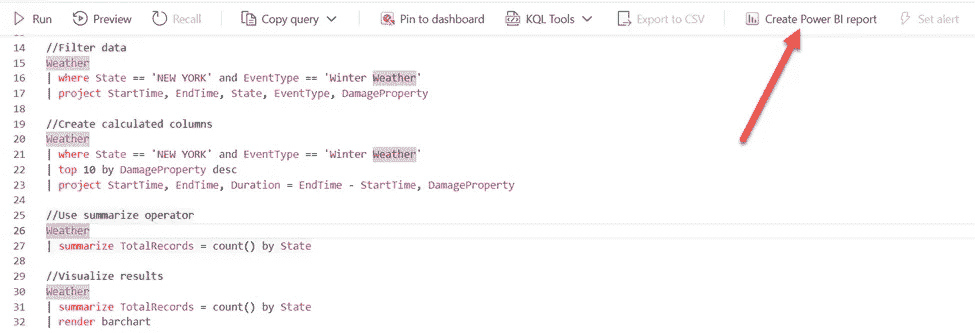

图片由作者提供

KQL 查询集中每个查询都代表 Power BI 语义模型中的一个表。从这里，你可以构建可视化并利用所有现有的 Power BI 功能来设计一个有效且视觉上吸引人的报告。

显然，你仍然可以利用“常规”的 Power BI 工作流程，该工作流程假设从 Power BI Desktop 连接到 KQL 数据库作为数据源。在这种情况下，你需要打开 OneLake 数据中心并选择 KQL 数据库作为数据源：

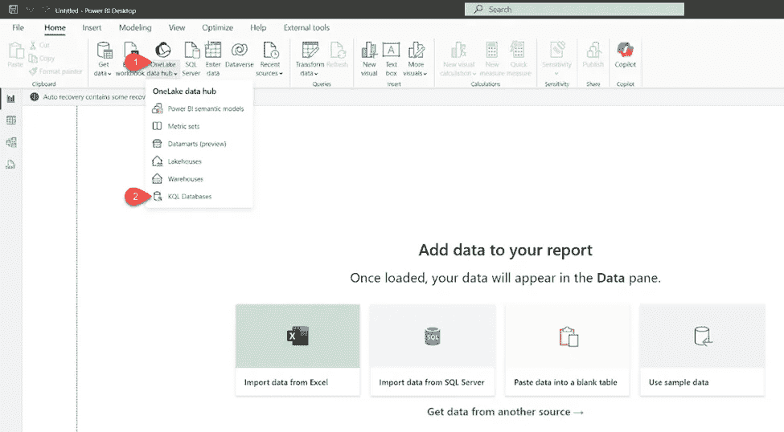

图片由作者提供

与基于 SQL 的数据源一样，你可以为你的实时分析数据选择导入和 DirectQuery 存储模式。导入模式在 Power BI 的数据库中创建数据的本地副本，而 DirectQuery 则允许在近实时查询 KQL 数据库。

## Activator

Activator 是整个 Microsoft Fabric 领域中最具创新性的功能之一。我将在另一篇文章中详细介绍 Activator。在这里，我只是想介绍这个服务，并简要强调其主要特点。

Activator 是一种无代码解决方案，当底层数据满足条件时自动执行操作。Activator 可以与 Eventstreams、实时仪表板和 Power BI 报告结合使用。一旦数据达到某个阈值，Activator 就会自动触发指定的操作——例如，发送电子邮件或 Microsoft Teams 消息，甚至触发 Power Automate 流。我将在另一篇文章中更深入地介绍所有这些场景，并在此提供一些实施 Activator 项的实际场景。

## 结论

实时智能——最初是 Microsoft Fabric 中的“Synapse 体验”的一部分，现在已成为一个独立的、专门的工作负载。这让我们对微软对实时智能的愿景和路线图有了很多了解！

不要忘记：最初，实时分析包含在 Synapse 之下，与数据工程、数据仓库和数据科学体验一起。然而，微软认为处理流数据值得在 Microsoft Fabric 中拥有一个专门的工作负载，这在处理日益增长的需求和提供数据捕获时的洞察力方面绝对是有道理的。从这个意义上说，Microsoft Fabric 提供了一套强大的服务，作为处理、分析和在数据生成时采取行动的下一代工具。

我非常确信，随着数据源的发展和数据生成速度的加快，实时智能工作负载在未来将变得越来越重要。

感谢阅读！
