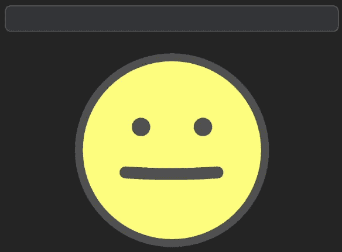
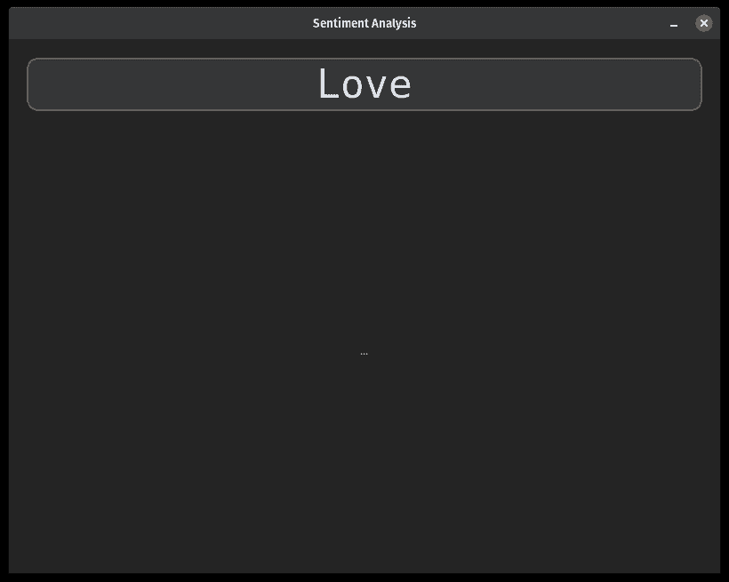
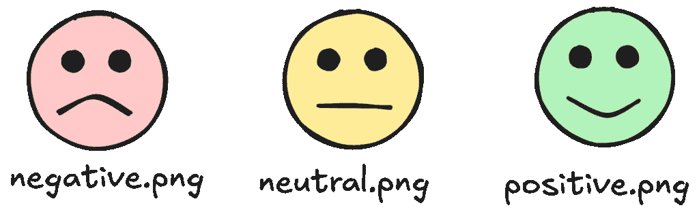
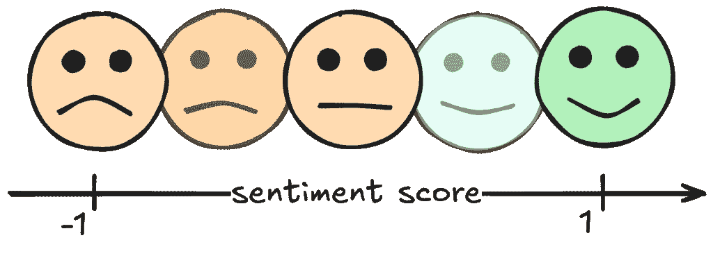
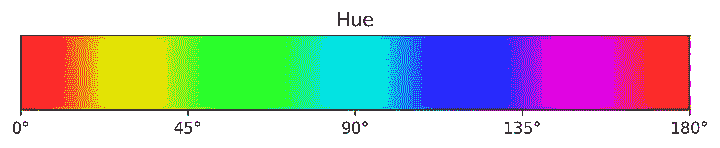
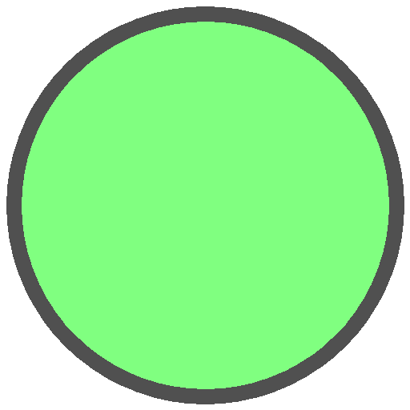
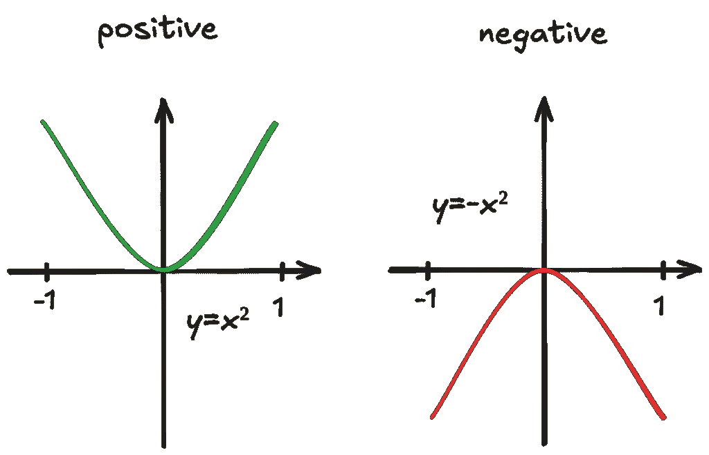
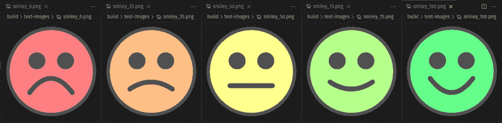
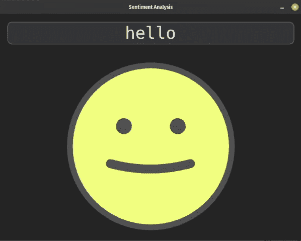

# Python 中的实时交互式情感分析

> 原文：[`towardsdatascience.com/real-time-interactive-sentiment-analysis-in-python/`](https://towardsdatascience.com/real-time-interactive-sentiment-analysis-in-python/)



<mdspan datatext="el1746667834713" class="mdspan-comment">你知道</mdspan>成为工程师最好的部分是什么吗？你可以只是构建东西。这就像是一种超能力。一个下雨的下午，我有一个随机想法，就是创建一个文本输入的情感可视化，笑脸会根据文本的积极程度改变表情。文本越积极，笑脸看起来就越高兴。这里有一些有趣的概念可以学习，所以让我带你了解这个项目是如何工作的！

## 前置条件

要继续操作，你需要以下包：

+   customtkinter

+   opencv-python

+   torch

+   transformers

使用 **[uv](https://docs.astral.sh/uv/)**，你可以使用以下命令添加依赖项：

```py
uv add customtkinter opencv-python torch transformers
```

> **注意：** 当使用 *uv* 与 torch 结合时，你需要指定包的索引。例如，如果你想使用 cuda，你需要在你的 `pyproject.toml` 中添加以下内容：
> 
> ```py
> [[tool.uv.index]]
> name = "pytorch-cu118"
> url = "https://download.pytorch.org/whl/cu118"
> explicit = true
> 
> [tool.uv.sources]
> torch = [{ index = "pytorch-cu118" }]
> torchvision = [{ index = "pytorch-cu118" }]
> ```

## UI 布局骨架

对于这类项目，我总是喜欢先快速布局 UI 组件。在这种情况下，布局将会非常简单，顶部有一个单行的文本框，它填满了宽度，下面是画布，占据了剩余的空间。这将是绘制笑脸的地方 🙂

使用 `customtkinter`，我们可以这样编写布局：

```py
import customtkinter

class App(customtkinter.CTk):
    def __init__(self) -> None:
        super().__init__()

        self.title("Sentiment Analysis")
        self.geometry("800x600")

        self.grid_columnconfigure(0, weight=1)
        self.grid_rowconfigure(0, weight=0)
        self.grid_rowconfigure(1, weight=1)

        self.sentiment_text_var = customtkinter.StringVar(master=self, value="Love")

        self.textbox = customtkinter.CTkEntry(
            master=self,
            corner_radius=10,
            font=("Consolas", 50),
            justify="center",
            placeholder_text="Enter text here...",
            placeholder_text_color="gray",
            textvariable=self.sentiment_text_var,
        )
        self.textbox.grid(row=0, column=0, padx=20, pady=20, sticky="nsew")
        self.textbox.focus()

        self.image_display = CTkImageDisplay(self)
        self.image_display.grid(row=1, column=0, padx=20, pady=20, sticky="nsew")
```

不幸的是，没有现成的解决方案可以在 UI 元素上绘制 opencv 框架，所以我构建了自己的 `CTkImageDisplay`。如果你想详细了解它是如何工作的，请查看我的[上一篇文章](https://towardsdatascience.com/modern-gui-applications-for-computer-vision-in-python/)。简而言之，我使用了一个 `CTKLabel` 组件，并使用同步队列将更新图像的线程与 GUI 线程解耦。



## 程序化笑脸

对于我们的笑脸，我们可以为不同的情感范围使用不同的离散图像，例如，为 *负面*、*中性* 和 *正面* 保存三个图像。然而，为了更精细地可视化情感，我们需要更多的图像，这很快就会变得不可行，我们也将无法在这些图像之间进行动画过渡。



一个更好的方法是，在运行时以程序方式生成笑脸图像。为了保持简单，我们只会改变笑脸的背景颜色以及其嘴巴的曲线。



首先，我们需要生成一个画布图像，我们可以在上面绘制笑脸。

```py
def create_sentiment_image(positivity: float, image_size: tuple[int, int]) -> np.ndarray:
    """
    Generates a sentiment image based on the positivity score.
    This draws a smiley with its expression based on the positivity score.

    Args:
        positivity: A float representing the positivity score in the range [-1, 1].
        image_size: A tuple representing the size of the image (width, height).

    Returns:
        A string representing the path to the generated sentiment image.
    """
    width, height = image_size
    frame = np.zeros((height, width, 4), dtype=np.uint8)

    # TODO: draw smiley

    return frame
```

我们的形象应该在笑脸之外是透明的，因此我们需要 4 个颜色通道，最后一个将是 alpha 通道。由于 OpenCV 图像是以`numpy`数组的形式表示的，其中的元素是*无符号 8 位整数*，我们使用`np.uint8`数据类型来创建图像。记住，数组是按*y-first*顺序存储的，所以`image_size`的`height`首先传递给数组创建

我们可以定义一些变量来表示笑脸的尺寸和颜色，这些变量在绘制时将非常有用。

```py
 color_outline = (80,) * 3 + (255,)  # gray
    thickness_outline = min(image_size) // 30
    center = (width // 2, height // 2)
    radius = min(image_size) // 2 - thickness_outline
```

笑脸的背景颜色对于负面情感应该是红色，对于正面情感应该是绿色。为了在整个过渡中实现均匀的亮度，我们可以使用 HSV 颜色空间，并简单地插值色调在 0%和 30%之间。



```py
color_bgr = color_hsv_to_bgr(
    hue=(positivity + 1) / 6, # positivity [-1,1] -> hue [0,1/3]
    saturation=0.5,
    value=1,
)
color_bgra = color_bgr + (255,)
```

我们需要确保通过在第四通道添加 100%的 alpha 值来使颜色完全不透明。现在我们可以用边框绘制我们的笑脸圆圈。

```py
cv2.circle(frame, center, radius, color_bgra, -1) # Fill
cv2.circle(frame, center, radius, color_outline, thickness_outline) # Border
```



到目前为止一切顺利，现在我们可以添加眼睛。我们计算从中心到左右两侧的偏移量，以对称地放置两个眼睛。

```py
# calculate the position of the eyes
eye_radius = radius // 5
eye_offset_x = radius // 3
eye_offset_y = radius // 4
eye_left = (center[0] - eye_offset_x, center[1] - eye_offset_y)
eye_right = (center[0] + eye_offset_x, center[1] - eye_offset_y)

cv2.circle(frame, eye_left, eye_radius, color_outline, -1)
cv2.circle(frame, eye_right, eye_radius, color_outline, -1)
```


现在是挑战性的部分，嘴巴。嘴巴的形状将是一个适当缩放的抛物线。我们可以简单地用积极度分数乘以标准抛物线`y=x²`。



最后，线条将使用`cv2.polylines`绘制，它需要 xy 坐标对。使用`np.linspace`我们在 x 轴上生成 100 个点，并使用`polyval`函数来计算多边形的相应 y 值。

```py
# mouth parameters
mouth_wdith = radius // 2
mouth_height = radius // 3
mouth_offset_y = radius // 3
mouth_center_y = center[1] + mouth_offset_y + positivity * mouth_height // 2
mouth_left = (center[0] - mouth_wdith, center[1] + mouth_offset_y)
mouth_right = (center[0] + mouth_wdith, center[1] + mouth_offset_y)

# calculate points of polynomial for the mouth
ply_points_t = np.linspace(-1, 1, 100)
ply_points_y = np.polyval([positivity, 0, 0], ply_points_t) # y=positivity*x²

ply_points = np.array(
    [
        (
            mouth_left[0] + i * (mouth_right[0] - mouth_left[0]) / 100,
            mouth_center_y - ply_points_y[i] * mouth_height,
        )
        for i in range(len(ply_points_y))
    ],
    dtype=np.int32,
)

# draw the mouth
cv2.polylines(
    frame,
    [ply_points],
    isClosed=False,
    color=color_outline,
    thickness=int(thickness_outline * 1.5),
)
```

Et voilà，我们得到了一个程序化的笑脸！


为了测试这个函数，我编写了一个快速测试用例，使用`pytest`保存了具有不同情感得分的笑脸：

```py
from pathlib import Path

import cv2
import numpy as np
import pytest

from sentiment_analysis.utils import create_sentiment_image

IMAGE_SIZE = (512, 512)

@pytest.mark.parametrize(
    "positivity",
    np.linspace(-1, 1, 5),
)
def test_sentiments(visual_output_path: Path, positivity: float) -> None:
    """
    Test the smiley face generation.
    """
    image = create_sentiment_image(positivity, IMAGE_SIZE)

    assert image.shape == (IMAGE_SIZE[1], IMAGE_SIZE[0], 4)

    # assert center pixel is opaque
    assert image[IMAGE_SIZE[1] // 2, IMAGE_SIZE[0] // 2, 3] == 255

    # save the image for visual inspection
    positivity_num_0_100 = int((positivity + 1) * 50)
    image_fn = f"smiley_{positivity_num_0_100}.png"
    cv2.imwrite(str(visual_output_path / image_fn), image) 
```



## 情感分析

为了确定我们的笑脸看起来是多高兴还是多悲伤，我们首先需要分析文本输入并计算一个*情感*。这个任务被称为**情感分析**。我们将使用一个预训练的 transformer 模型来预测*负面*、*中性*和*正面*类别的分类得分。然后我们可以融合这些类别的置信度得分来计算一个介于-1 和+1 之间的最终情感得分。

使用 transformers 库中的管道，我们可以基于一个来自 huggingface 的[预训练模型](https://huggingface.co/cardiffnlp/twitter-roberta-base-sentiment)定义处理管道。使用`top_k`参数，我们可以指定应该返回多少个分类结果。由于我们想要所有三个类别，我们将它设置为 3。

```py
from transformers import pipeline

model_name = "cardiffnlp/twitter-roberta-base-sentiment"

sentiment_pipeline = pipeline(
    task="sentiment-analysis",
    model=model_name,
    top_k=3,
)
```

要运行情感分析，我们可以用字符串参数调用管道。这将返回一个包含单个元素的结果列表，因此我们需要解包第一个元素。

```py
results = self.sentiment_pipeline(text)

# [
#     [
#         {"label": "LABEL_2", "score": 0.5925878286361694},
#         {"label": "LABEL_1", "score": 0.3553399443626404},
#         {"label": "LABEL_0", "score": 0.05207228660583496},
#     ]
# ]

for label_score_dict in results[0]:
    label: str = label_score_dict["label"]
    score: float = label_score_dict["score"]
```

我们可以定义一个标签映射，告诉我们每个置信度得分如何影响最终的情感。然后我们可以汇总所有置信度得分上的积极性。

```py
label_mapping = {"LABEL_0": -1, "LABEL_1": 0, "LABEL_2": 1}

positivity = 0.0
for label_score_dict in results[0]:
    label: str = label_score_dict["label"]
    score: float = label_score_dict["score"]

    if label in label_mapping:
        positivity += label_mapping[label] * score
```

为了测试我们的管道，我们可以将其封装在一个类中，并使用 `pytest` 运行一些测试。我们验证具有积极情感的句子得分应大于零，反之，具有消极情感的句子得分应低于零。

```py
import pytest

from sentiment_analysis.sentiment_pipeline import SentimentAnalysisPipeline

@pytest.fixture
def sentiment_pipeline() -> SentimentAnalysisPipeline:
    """
    Fixture to create a SentimentAnalysisPipeline instance.
    """
    return SentimentAnalysisPipeline(
        model_name="cardiffnlp/twitter-roberta-base-sentiment",
        label_mapping={"LABEL_0": -1.0, "LABEL_1": 0.0, "LABEL_2": 1.0},
    )

@pytest.mark.parametrize(
    "text_input",
    [
        "I love this!",
        "This is awesome!",
        "I am so happy!",
        "This is the best day ever!",
        "I am thrilled with the results!",
    ],
)
def test_sentiment_analysis_pipeline_positive(
    sentiment_pipeline: SentimentAnalysisPipeline, text_input: str
) -> None:
    """
    Test the sentiment analysis pipeline with a positive input.
    """
    assert (
        sentiment_pipeline.run(text_input) > 0.0
    ), "Expected positive sentiment score."

@pytest.mark.parametrize(
    "text_input",
    [
        "I hate this!",
        "This is terrible!",
        "I am so sad!",
        "This is the worst day ever!",
        "I am disappointed with the results!",
    ],
)
def test_sentiment_analysis_pipeline_negative(
    sentiment_pipeline: SentimentAnalysisPipeline, text_input: str
) -> None:
    """
    Test the sentiment analysis pipeline with a negative input.
    """
    assert (
        sentiment_pipeline.run(text_input) < 0.0
    ), "Expected negative sentiment score." 
```

## 集成

现在缺少的最后部分，就是简单地将文本框连接到我们的情感管道，并更新显示的图像与相应的笑脸。我们可以在文本变量上添加一个 `trace`，这将在一个由线程池管理的新的线程中运行情感管道，以防止在管道运行时 UI 冻结。

```py
class App(customtkinter.CTk):
    def __init__(self, sentiment_analysis_pipeline: SentimentAnalysisPipeline) -> None:
        super().__init__()
        self.sentiment_analysis_pipeline = sentiment_analysis_pipeline

        ...

        self.sentiment_image = None

        self.sentiment_text_var = customtkinter.StringVar(master=self, value="Love")
        self.sentiment_text_var.trace_add("write", lambda *_: self.on_sentiment_text_changed())

        ...

        self.update_sentiment_pool = ThreadPool(processes=1)

        self.on_sentiment_text_changed()

    def on_sentiment_text_changed(self) -> None:
        """
        Callback function to handle text changes in the textbox.
        """
        new_text = self.sentiment_text_var.get()

        self.update_sentiment_pool.apply_async(
            self._update_sentiment,
            (new_text,),
        )

    def _update_sentiment(self, new_text: str) -> None:
        """
        Update the sentiment image based on the new text input.
        This function is run in a separate process to avoid blocking the main thread.

        Args:
            new_text: The new text input from the user.
        """
        positivity = self.sentiment_analysis_pipeline.run(new_text)

        self.sentiment_image = create_sentiment_image(
            positivity,
            self.image_display.display_size,
        )

        self.image_display.update_frame(self.sentiment_image)

def main() -> None:
    # Initialize the sentiment analysis pipeline
    sentiment_analysis = SentimentAnalysisPipeline(
        model_name="cardiffnlp/twitter-roberta-base-sentiment",
        label_mapping={"LABEL_0": -1, "LABEL_1": 0, "LABEL_2": 1},
    )

    app = App(sentiment_analysis)
    app.mainloop() 
```

最后，表情符号在应用程序中被可视化，并随着文本输入的情感动态变化！



* * *

* * *

对于完整的实现和更多细节，请查看 GitHub 上的项目仓库：

[`github.com/trflorian/sentiment-analysis-viz`](https://github.com/trflorian/sentiment-analysis-viz)

* * *

*本帖中所有可视化均由作者创建。*
