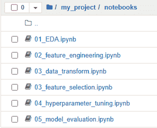

# 降低数据科学项目的时间到价值：第二部分

> 原文：[`towardsdatascience.com/reducing-time-to-value-for-data-science-projects-part-2/`](https://towardsdatascience.com/reducing-time-to-value-for-data-science-projects-part-2/)

## <mdspan datatext="el1748979776132" class="mdspan-comment">引言</mdspan>

在本系列的[第一部分](https://towardsdatascience.com/reducing-time-to-value-for-data-science-projects-part-1/)中，我们讨论了创建可重用代码资产，这些资产可以在多个项目中部署。利用一个集中式存储库中的常见数据科学步骤确保实验可以更快地进行，并且对结果有更大的信心。简化的实验阶段对于确保你尽可能快地向业务交付价值至关重要。

在这篇文章中，我想专注于如何提高你进行实验的速度。你可能有很多想法，想要尝试不同的设置，而有效地执行它们将大大提高你的生产力。当模型性能下降时进行完整重新训练，以及探索在它们可用时包含新特征的情况，只是能够快速迭代实验的一些情况，这会带来极大的好处。

## 我们需要再次谈谈笔记本

虽然 Jupyter 笔记本是学习库和概念的好方法，但它们很容易被误用，并成为阻碍快速模型开发的拐杖。考虑一下数据科学家转向新项目的情况。第一步通常是打开一个新的笔记本并开始一些探索性数据分析。了解你有什么样的数据可用，做一些简单的统计摘要，了解你的结果，最后进行一些简单的可视化，以了解特征和结果之间的关系。这些步骤是有益的尝试，因为在你开始实验过程之前更好地理解你的数据至关重要。

这个问题的症结不在于 EDA 本身，而在于其后的步骤。通常发生的情况是数据科学家继续前进，立即打开一个新的笔记本开始编写他们的实验框架，通常从数据转换开始。这通常是通过从 EDA 笔记本中复制代码片段到另一个笔记本来完成的。一旦他们准备好了第一个笔记本，它就会被执行，结果要么保存在本地，要么写入外部位置。然后，这些数据会被另一个笔记本拾取并进一步处理，例如通过特征选择，然后再写回。这个过程会重复进行，直到你的实验管道由 5-6 个笔记本组成，这些笔记本需要由数据科学家依次触发，以便运行单个实验。



将笔记本链接起来是一个低效的过程。图片由作者提供

以这种手动的方式进行实验，迭代想法和尝试不同的场景变成了一项劳动密集型任务。你最终达到了人类层面的并行化，整个数据科学团队通过拥有本地笔记本副本并勤奋地编辑代码来尝试不同的设置。然后，结果被添加到报告中，一旦实验完成，就会在所有设置中找到表现最好的设置。

所有这些都不可持续。团队成员因病请假或休假，通宵运行实验希望笔记本不会崩溃，忘记你已经完成和即将进行的实验设置。这些不应该是在进行实验时你有的担忧。幸运的是，有一种更好的方法，它涉及到能够以规模化的方式有结构地、有系统地迭代想法。所有这些都将极大地简化你项目中的实验阶段，并大大缩短其价值实现的时间。

## 拥抱脚本创建你的实验管道

加速你实验能力的第一步是超越笔记本，开始编写脚本。这应该是过程中最简单的一部分，你只需将你的代码放入一个.py 文件中，而不是.ipynb 文件的 cellblocks 中。从那里，你可以从命令行调用你的脚本，例如：

`python src/main.py`

```py
if __name__ == "__main__":

    input_data = ""
    output_loc = ""
    dataprep_config = {}
    featureselection_config = {}
    hyperparameter_config = {}

    data = DataLoader().load(input_data)
    data_train, data_val = DataPrep().run(data, dataprep_config)
    features_to_keep = FeatureSelection().run(data_train, data_val, featureselection_config)
    model_hyperparameters = HyperparameterTuning().run(data_train, data_val, features_to_keep, hyperparameter_config)
    evaluation_metrics = Evaluation().run(data_train, data_val, features_to_keep, model_hyperparameters)
    ArtifactSaver(output_loc).save([data_train, data_val, features_to_keep, model_hyperparameters, evaluation_metrics])
```

注意，遵循通过将参数传递给函数来控制工作流程的原则可以极大地简化你的实验管道布局。拥有这样的脚本已经提高了你运行实验的能力。你现在只需要一个脚本的调用，而不是依次运行多个笔记本的停止-启动特性。

你可能想向这个脚本添加一些输入参数，例如指向特定的数据位置或指定存储输出工件的位置。你可以轻松扩展你的脚本以接受一些命令行参数：

`python src/main_with_arguments.py --input_data <loc> --output_loc <loc>`

```py
if __name__ == "__main__":

    input_data, output_loc = parse_input_arguments()
    dataprep_config = {}
    featureselection_config = {}
    hyperparameter_config = {}

    data = DataLoader().load(input_data)
    data_train, data_val = DataPrep().run(data, dataprep_config)
    features_to_keep = FeatureSelection().run(data_train, data_val, featureselection_config)
    model_hyperparameters = HyperparameterTuning().run(data_train, data_val, features_to_keep, hyperparameter_config)
    evaluation_metrics = Evaluation().run(data_train, data_val, features_to_keep, model_hyperparameters)
    ArtifactSaver(output_loc).save([data_train, data_val, features_to_keep, model_hyperparameters, evaluation_metrics])
```

到目前为止，你已经有了良好的管道的起点；你可以设置输入和输出位置，并通过单个命令调用你的脚本。然而，尝试新想法仍然是一项相对手动的工作，你需要进入你的代码库并做出更改。如前所述，在不同的实验设置之间切换应该理想地简单，就像修改控制需要执行什么操作的包装函数的输入参数一样。我们可以将这些不同的参数集中到一个位置，以确保修改你的实验设置变得简单。实现这一点的最简单方法就是使用配置文件。

## 使用单独的文件配置你的实验

将所有相关函数参数存储在单独的文件中带来了几个好处。将配置与主代码库分离，使得尝试不同的实验设置变得更容易。你只需编辑相关字段，用你新的想法替换，就可以立即开始。你甚至可以轻松地替换整个配置文件。你还可以完全了解你的实验设置是什么。如果你为每个实验维护一个单独的文件，那么你可以回到之前的实验，并确切地看到执行了什么。

那么，配置文件看起来是什么样子的，它是如何与您创建的实验管道脚本接口的？一个简单的配置文件实现是使用 yaml 标记，并按照以下方式设置：

1.  顶层布尔标志用于开启和关闭管道的不同部分

1.  在你的管道的每一步中，定义你想要执行的计算

```py
file_locations:
    input_data: ""
    output_loc: ""

pipeline_steps:
    data_prep: True
    feature_selection: False
    hyperparameter_tuning: True
    evaluation: True

data_prep:
    nan_treatment: "drop"
    numerical_scaling: "normalize"
    categorical_encoding: "ohe"
```

这是一个灵活且轻量级的方式来控制你的实验如何运行。然后你可以修改你的脚本以加载此配置，并使用它来控制管道的工作流程：

`python src/main_with_config –config_loc <loc>`

```py
if __name__ == "__main__":

    config_loc = parse_input_arguments()
    config = load_config(config_loc)

    data = DataLoader().load(config["file_locations"]["input_data"])

    if config["pipeline_steps"]["data_prep"]:
        data_train, data_val = DataPrep().run(data, 
                                              config["data_prep"])

    if config["pipeline_steps"]["feature_selection"]:
        features_to_keep = FeatureSelection().run(data_train, 
                                                  data_val,
                                                  config["feature_selection"])

    if config["pipeline_steps"]["hyperparameter_tuning"]:
        model_hyperparameters = HyperparameterTuning().run(data_train, 
                                                           data_val, 
                                                           features_to_keep, 
                                                           config["hyperparameter_tuning"])

    if config["pipeline_steps"]["evaluation"]:
        evaluation_metrics = Evaluation().run(data_train, 
                                              data_val, 
                                              features_to_keep, 
                                              model_hyperparameters)

    ArtifactSaver(config["file_locations"]["output_loc"]).save([data_train, 
                                                                data_val, 
                                                                features_to_keep, 
                                                                model_hyperparameters, 
                                                                evaluation_metrics])
```

我们现在已经完全解耦了实验的设置与执行它的代码。我们想要尝试的实验设置现在完全由配置文件决定，这使得尝试新想法变得非常简单。我们甚至可以控制我们想要执行哪些步骤，允许以下场景：

1.  仅运行数据准备和特征选择，以生成一个初始处理后的数据集，这可以作为尝试不同模型和相关超参数的更详细实验的基础

## 利用自动化和并行性

现在我们有了通过配置文件配置不同的实验设置并使用单个命令行调用启动完整端到端实验的能力。剩下要做的就是尽快扩展能力，迭代不同的实验设置。关键是：

1.  自动化程序来修改配置文件

1.  实验的并行执行

第 1 步相对简单。我们可以编写一个 shell 脚本或甚至一个辅助的 python 脚本，其任务是迭代用户提供的不同实验设置，然后为每个新设置启动管道。

```py
#!/bin/bash

for nan_treatment in drop impute_zero impute_mean
do
  update_config_file($nan_treatment, <config_loc>)
  python3 ./src/main_with_config.py --config_loc <config_loc>
done;
```

第 2 步)是一个更有趣的提议，并且非常依赖于具体情况。你运行的所有实验都是自包含的，彼此之间没有依赖关系。这意味着从理论上讲，我们可以同时启动所有这些实验。实际上，这取决于你是否能够访问外部计算资源，无论是内部还是通过云服务提供商。如果这种情况成立，那么每个实验都可以作为你计算中的一个单独作业启动，前提是你有权使用这些资源。然而，这确实涉及其他考虑因素，例如部署 Docker 镜像以确保实验之间的一致环境，以及弄清楚如何在外部计算中嵌入你的代码。然而，一旦这个问题得到解决，你现在就可以启动你想要的任何数量的实验，你唯一受限于的是你的计算提供商的资源。

## 嵌入日志记录器和实验跟踪器以实现轻松监督

能够在外部计算上启动 100 多个并行实验是减少数据科学项目价值实现时间路径上的一个明显胜利。然而，抽象化这个过程伴随着代价，即它不是那么容易进行查询，尤其是如果出现问题的话。笔记本的交互性使得执行一个单元格块并立即查看结果成为可能。

通过在你的实验中使用记录器来跟踪你的管道进度是可行的。你可以捕获关键结果，例如选择过程中选择的功能，或者用它来标记管道中当前正在执行的内容。如果出现问题，你可以参考你创建的日志条目来找出问题发生的位置，然后可能嵌入更多的日志以更好地理解和解决该问题。

```py
logger.info("Splitting data into train and validation set")
df_train, df_val = create_data_split(df, method = 'random')
logger.info(f"training data size: {df_train.shape[0]}, validation data size: {df_val.shape[0]}")

logger.info(f"treating missing data via: {missing_method}")
df_train = treat_missing_data(df_train, method = missing_method)

logger.info(f"scaling numerical data via: {scale_method}")
df_train = scale_numerical_features(df_train, method = scale_method)

logger.info(f"encoding categorical data via: {encode_method}")
df_train = encode_categorical_features(df_train, method = encode_method)
logger.info(f"number of features after encoding: {df_train.shape[1]}")
```

启动大规模并行实验的最后一个方面是找到高效的分析方法，以便快速找到最佳性能配置。逐个阅读事件日志或打开每个实验的性能文件将迅速抵消你在确保流畅实验过程中所做的所有努力。

最简单的事情是将实验跟踪器嵌入到你的管道脚本中。有许多 1^(st)和 3^(rd) party 工具可供你使用，这些工具让你可以设置一个项目空间，然后记录你考虑的每个实验设置的重要性能指标。它们通常带有可配置的前端，允许用户创建简单的比较图。这将使找到最佳性能的实验变得简单得多。

## 结论

在本文中，我们探讨了如何创建管道，以方便轻松地执行实验过程。这包括从笔记本中移出，并将你的实验过程转换为一个单独的脚本。然后，这个脚本由一个配置文件支持，该文件控制实验的设置，使得执行不同的设置变得非常简单。接着，利用外部计算资源来并行化实验的执行。最后，我们讨论了使用日志记录器和实验跟踪器来保持对实验的监督，并更轻松地跟踪其结果。所有这些都将使数据科学家能够极大地加快他们运行实验的能力，使他们能够缩短项目的价值实现时间，并更快地向业务交付结果。
