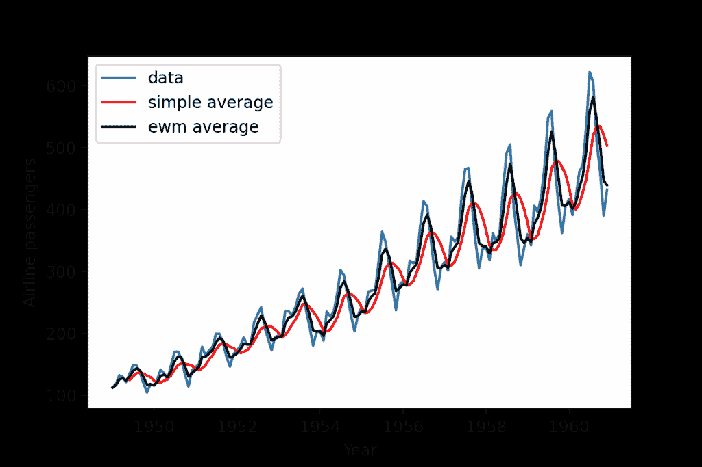
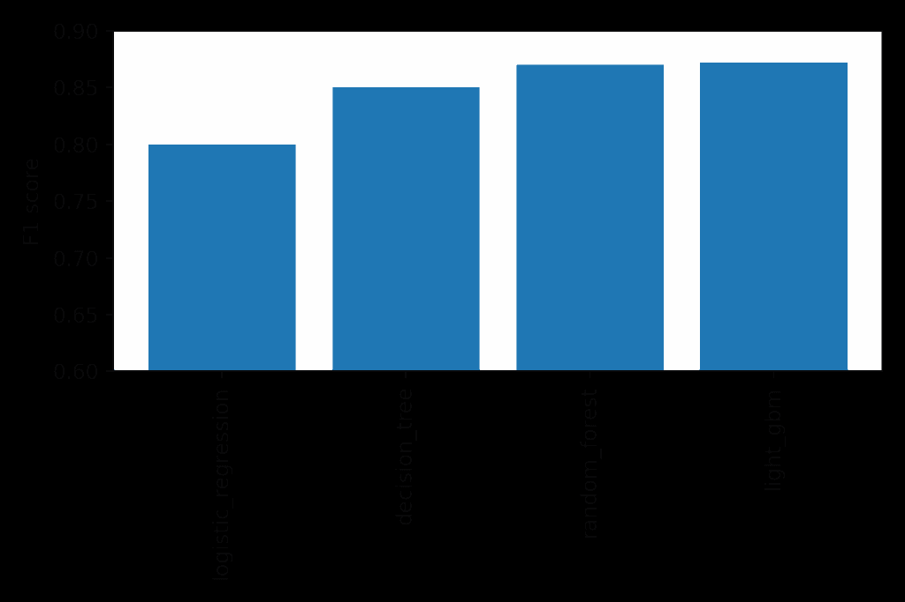
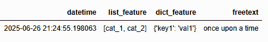
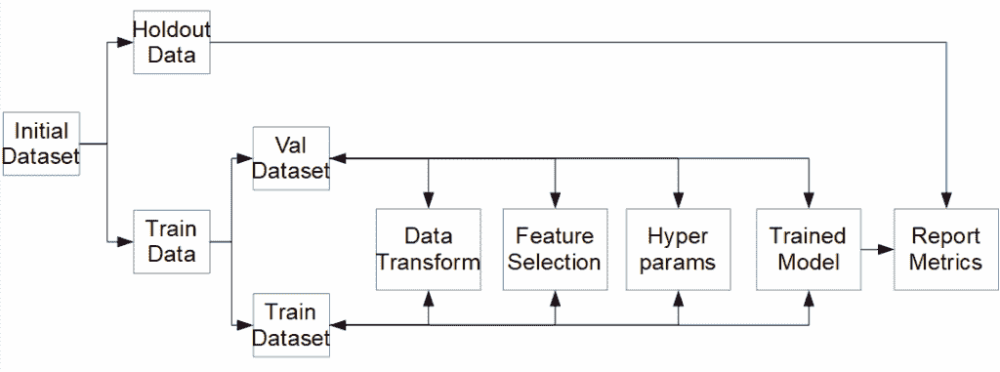

# 减少数据科学项目的时间到价值：第三部分

> 原文：[`towardsdatascience.com/reducing-time-to-value-for-data-science-projects-part-3/`](https://towardsdatascience.com/reducing-time-to-value-for-data-science-projects-part-3/)

## <mdspan datatext="el1752175012309" class="mdspan-comment">引言</mdspan>

本系列的第[1](https://towardsdatascience.com/reducing-time-to-value-for-data-science-projects-part-1/)和[2](https://towardsdatascience.com/reducing-time-to-value-for-data-science-projects-part-2/)部分专注于改进实验过程的技术方面。这始于重新思考代码的创建、存储和使用方式，并以利用大规模并行化来减少实验运行时间结束。本文从实现细节退后一步，更广泛地审视了为什么/如何进行实验，以及我们如何通过更智能地进行实验来减少项目的时间到价值。

## 没有计划就是计划失败

开始一个新的项目对于数据科学家来说通常是一个非常激动人心的时刻。你面对的是一个与以前项目不同的新数据集，也许有机会尝试之前从未使用过的创新建模技术。直接跳入数据，从 EDA（数据探索分析）开始，并可能进行一些初步建模，这种做法非常有诱惑力。你感到充满活力，对构建一个能为业务带来结果的模型充满乐观。

虽然热情值得赞扬，但情况可能会迅速改变。想象一下，几个月过去了，你仍然在进行实验，之前已经进行了 100 多次实验，试图调整超参数以在模型性能上获得额外的 1-2%。你的最终模型配置已经变成了一个复杂的相互关联的集成模型，使用了 4-5 个基础模型，所有这些模型都需要训练和监控。最终，你发现你的模型几乎无法在当前流程上有所改进。

如果在实验过程中采取更结构化的方法，所有这些都可以避免。你是一个数据科学家，重点在于“科学家”这一部分，因此知道如何进行实验是至关重要的。在这篇文章中，我想提供一些关于如何高效地组织项目实验的指导，以确保你在为业务提供解决方案时始终关注重要的事情。

### 收集更多业务信息，然后从简单开始

在任何建模开始之前，你需要非常清楚地设定你试图实现的目标。这就是项目的技术和业务方面可能发生脱节的地方。作为数据科学家，最重要的记住的事情是：

> 你的工作不是构建模型，而是解决一个可能涉及模型的企业问题！

使用这种观点对于成为一名成功的数据科学家至关重要。我之前参与过一些项目，我们构建的解决方案没有任何问题需要解决。围绕支持你的业务来界定你做的每一件事将大大提高你的解决方案被采纳的机会。

考虑到这一点，你的第一步应该是收集以下信息，如果他们还没有提供的话：

+   当前业务状况如何？

+   定义他们问题的关键指标是什么？他们希望如何改进它们？

+   什么是可以接受的指标改进，以考虑任何提出的解决方案是成功的？

例如：

> 你为一家在线零售商工作，他们需要确保他们总是有库存。他们目前正在经历以下问题：要么库存过多，占用库存空间，要么库存不足，无法满足客户需求，导致延误。他们需要你改进这个过程，确保他们有足够的产品来满足需求，同时不造成过剩库存。

虽然这是一个人为的问题，但它希望说明你的角色是解决他们遇到的业务问题，而不仅仅是构建一个模型来这样做。从这里开始，你可以深入了解并询问：

+   他们多久会一次过剩库存或库存不足？

+   是过剩库存更好还是库存不足更好？

现在我们已经正确地界定了问题，我们可以开始考虑解决方案。再次提醒，在直接进入模型之前，考虑一下是否有更简单的方法可以使用。虽然训练一个模型来预测未来需求可能会得到很好的结果，但它也伴随着一些问题：

+   模型将要部署在哪里？

+   如果性能下降，模型需要重新训练，会发生什么？

+   如果出现问题，你如何向利益相关者解释其决策？

从一个更简单且非机器学习（ML）基础的方法开始，给我们提供了一个工作基准。还有可能这个基准可以解决手头的问题，完全消除对复杂机器学习解决方案的需求。继续上面的例子，可能一个简单的或加权滚动平均的先前客户需求就足够了。或者，也许这些商品是季节性的，你需要根据一年中的时间来增加需求。

简单的方法可能能够回答业务问题。图片由作者提供

如果非模型基线不可行或无法回答业务问题，那么转向基于模型的解决方案是下一步。采取原则性的方法迭代想法并尝试不同的实验配置将是确保你及时找到解决方案的关键。

## 制定清晰的实验计划

一旦你决定需要一个模型，现在就是考虑如何进行实验的时候了。虽然你可以直接进行对每个可能模型、超参数、特征选择过程、数据处理等进行彻底搜索，但更专注于你的设置并有一个明确的策略将使你更容易确定哪些有效，哪些无效。考虑到这一点，以下是一些你应该考虑的想法。

### 注意任何限制

实验不是在真空中发生的，它是项目开发过程的一部分，而项目开发过程本身只是组织内部进行的一个项目。因此，你将不得不在商业设定的限制下进行实验。这些限制将要求你节约时间，并可能引导你走向特定的解决方案。一些可能施加在实验上的限制示例包括：

+   时间盒：让实验无限期地进行是一种风险很大的尝试，因为你面临的风险是解决方案永远无法投入生产。因此，在开发一个可行的有效解决方案后，如果不可行，通常会给予一定的时间，然后转向其他事情。

+   货币成本：运行实验需要计算时间，而这并不是免费的。如果你正在利用第三方计算资源，例如虚拟机通常按小时计费，这一点尤其正确。如果你不小心，你可能会轻易地产生巨大的计算账单，特别是如果你需要 GPU 等。因此，必须小心理解你实验的成本。

+   资源可用性：你的实验不会是组织中唯一进行的实验，并且可能存在固定的计算资源。这意味着你可能受到限制，无法在任何时候运行大量实验。因此，你需要明智地选择要探索的工作线。

+   可解释性：虽然理解你的模型所做的决策始终很重要，但如果你在金融等受监管的行业工作，那么这变得至关重要，因为你的模型中的任何偏见或偏见都可能导致严重后果。为了确保合规性，你可能需要限制自己使用更简单但更容易解释的模型，例如回归、决策树或支持向量机。

你可能面临这些限制中的一个或所有，因此要做好准备去应对它们。

### 从简单的基线开始

例如，在处理二元分类时，直接转向复杂的模型如 LightGBM 是有意义的，因为关于它们解决这类问题的文献非常丰富。然而，在那之前，有一个简单的 Logistic Regression 模型被训练出来作为基线，它带来了以下好处：

+   几乎没有超参数需要评估，因此实验迭代非常快。

+   决策过程非常简单易懂

+   更复杂的模型必须比这更好

+   解决当前问题可能已经足够

明确评估额外复杂性在性能方面带来的影响很重要。图片由作者提供

除了逻辑回归之外，对于特定模型进行“未调优”的实验（少量或没有数据处理，没有显式的特征选择，默认超参数）也可能很重要，因为它将表明您可以在特定实验途径上推进多少。例如，如果不同的实验配置仅略优于未调优的实验，那么这可能表明您应该将精力重新集中在其他方面。

### 使用原始数据与半处理数据

从实用性角度来看，您从数据工程中获得的数据可能不是完美的格式，无法直接用于实验。可能出现的问题包括：

+   1000 多列和 100 万笔交易，对内存资源造成压力

+   无法轻松用于模型中的特征，例如嵌套结构如字典或数据类型如日期时间

非表格数据对传统机器学习方法构成问题。图片由作者提供

处理这些场景有几种不同的策略：

+   扩大实验的内存分配以处理数据大小需求。这可能并不总是可行的

+   将特征工程作为实验过程的一部分

+   在实验之前稍微处理一下您的数据

每种方法都有其优缺点，您需要自己决定。进行一些预处理，例如删除具有复杂数据结构或不兼容数据类型的特征，现在可能有益，但如果它们在实验过程的后期进入范围，可能需要回溯。实验中的特征工程可以更好地控制创建的内容，但会为所有实验中可能共有的内容引入额外的处理开销。在这种情况下没有正确的选择，并且非常依赖于具体情况。

### 公平地评估模型性能

计算最终模型性能是您实验的最终目标。这是您打算向业务展示的结果，希望获得将项目推进到生产阶段批准。因此，您对模型进行公平且无偏见的评估，使其符合利益相关者的要求至关重要。关键方面包括：

+   确保您的评估数据集没有参与您的实验过程

+   您的评估数据集应该反映现实生活中的生产环境

+   您的评价指标应该是以业务为导向，而不是以模型为导向

无偏见的评估使结果具有绝对的信心。图片由作者提供

为最终评估拥有一个独立的独立数据集确保你的结果没有偏差。例如，在用于选择特征或超参数的验证数据集上进行评估并不是一个公平的比较，因为你冒着将解决方案过度拟合到该数据的风险。因此，你需要一个以前未使用过的干净数据集。这可能听起来很简单，但它非常重要，值得重复。

你的评估数据集如果真正反映了生产情况，那么你的结果就会更有信心。例如，我过去训练的模型是在数月甚至数年的数据上完成的，以确保捕捉到季节性等行为。由于这些时间尺度，数据量太大，无法以原始状态使用，因此在进行实验之前必须进行下采样。然而，评估数据集不应进行下采样或以任何方式修改，以使其偏离现实。这是可以接受的，因为在推理时，你可以使用流式处理或小批量等技术来处理数据。

你的评估数据也应该至少与生产中使用的最小长度相同，理想情况下是那个长度的倍数。例如，如果你的模型每周会对数据进行评分，那么只有一天的数据是不够的。它至少应该是一周的数据，理想情况下是 3 或 4 周的数据，这样你才能评估结果的变化性。

验证你解决方案的商业价值与你之前所说的作为数据科学家的角色有关。你是来解决问题，而不仅仅是构建模型。因此，在决定如何展示你提出的解决方案时，平衡统计意义和商业意义非常重要。这个声明的第一方面是，用业务可以采取行动的指标来呈现结果。利益相关者可能不知道 F1 得分为 0.95 的模型是什么，但他们知道每年能帮他们节省 1000 万英镑的模型对公司意味着什么。

这个声明的第二方面是对任何提出的解决方案持谨慎态度，并考虑所有可能发生的故障点，特别是如果我们开始引入复杂性。考虑以下两个提出的模型：

+   一个在原始数据上运行的逻辑回归模型，预计每年可节省 1000 万英镑

+   一个拥有 1000 万个参数的神经网络，它需要大量的特征工程、选择和模型调整，预计每年可节省 1050 万英镑

神经网络在绝对回报方面表现最佳，但它具有显著更多的复杂性和潜在故障点。额外的工程流程、复杂的重新训练协议和可解释性的丧失都是需要考虑的重要方面，我们需要思考这种开销是否值得额外的 5%性能提升。这种场景在本质上很夸张，但希望说明在评估结果时需要保持批判性的眼光。

### 知道何时停止

在运行实验阶段时，您正在平衡两个目标：尽可能尝试尽可能多的不同实验设置，以及您面临的任何约束，最可能的是业务分配给您进行实验的时间。您还需要考虑第三个方面，那就是知道是否需要提前结束实验阶段。这可能有多种原因：

+   您提出的解决方案已经解决了商业问题

+   进一步的实验正在经历收益递减

+   您的实验没有产生您想要的结果

您的第一反应可能是用尽所有可用的时间，要么尝试修复模型，要么真正推动您的解决方案达到最佳状态。然而，您需要问自己，您的时间是否可以更好地用于其他地方，比如转向生产化，如果您的解决方案不起作用，重新解释当前的商业问题，或者转向另一个完全不同的问题。您的时间非常宝贵，您应该相应地对待它，以确保您正在从事的工作将对业务产生最大的影响。

## 结论

在本文中，我们讨论了如何规划您项目中的模型实验阶段。我们更注重实验所需的伦理精神，而不是技术细节。这始于花时间更深入地理解商业问题，以便更清晰地定义需要实现的目标，才能将任何提出的解决方案视为成功。我们讨论了简单基线作为参考点的重要性，以便将更复杂的解决方案与之比较。然后，我们转向您可能面临的任何约束以及这些约束如何影响您的实验。最后，我们强调了拥有一个公平的数据集来计算业务指标的重要性，以确保最终结果没有偏见。通过遵循这里提出的建议，我们大大增加了通过快速、自信地迭代实验过程来减少数据科学项目价值实现时间的机会。
