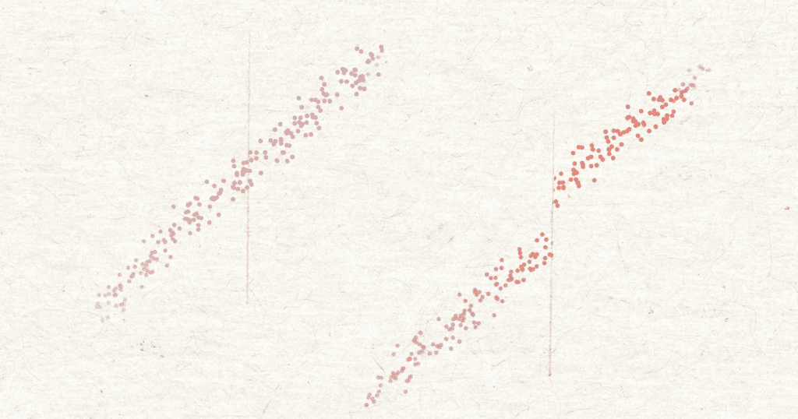
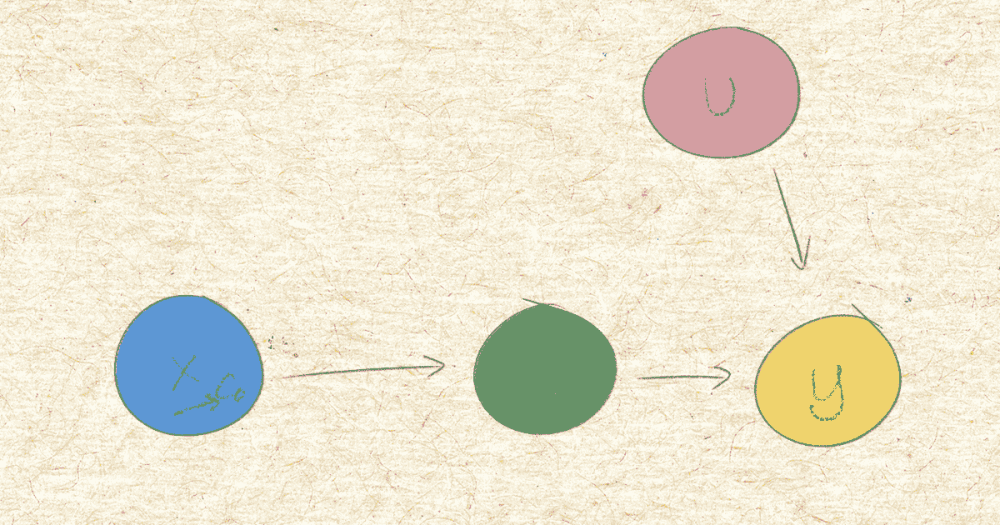
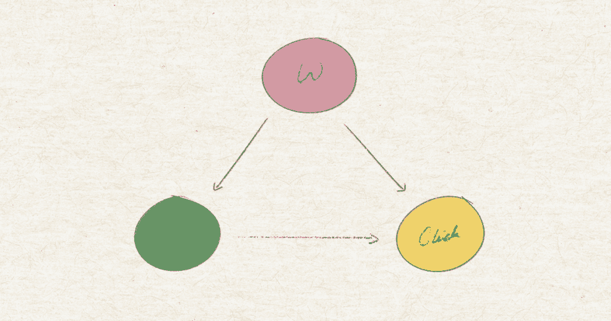
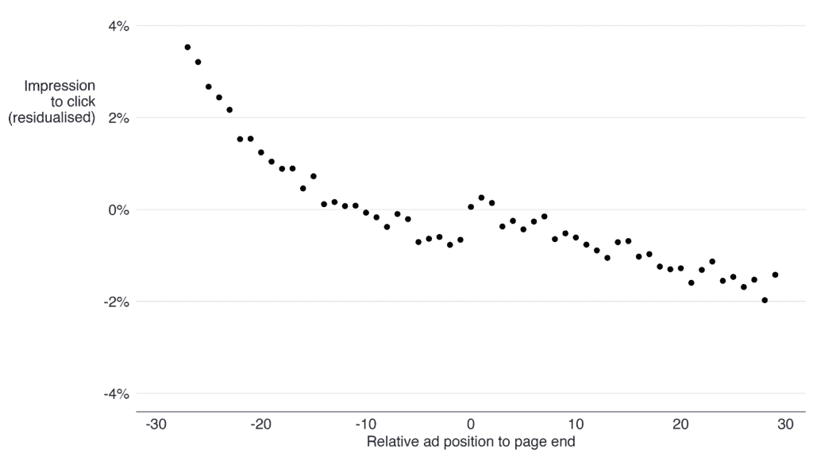
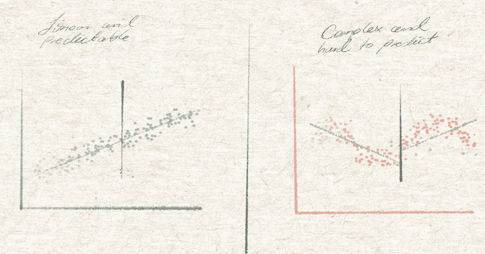
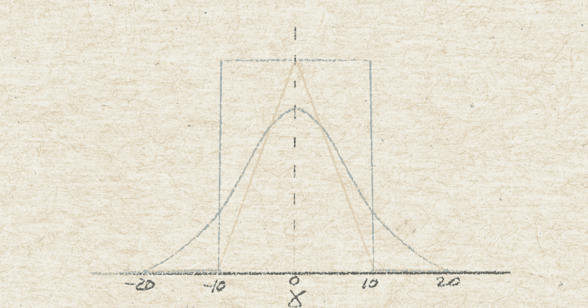
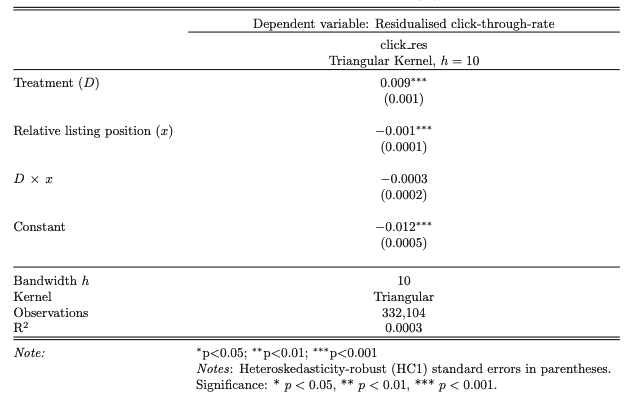
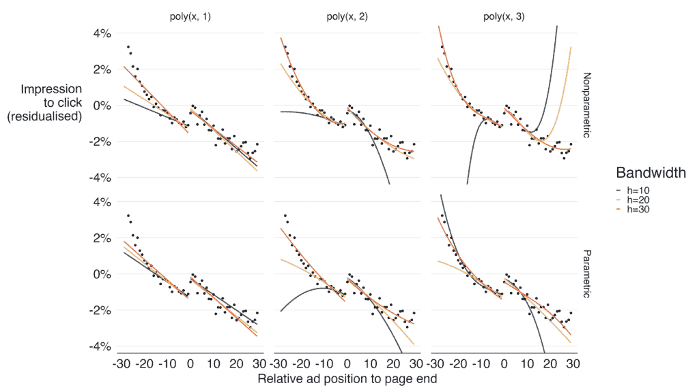
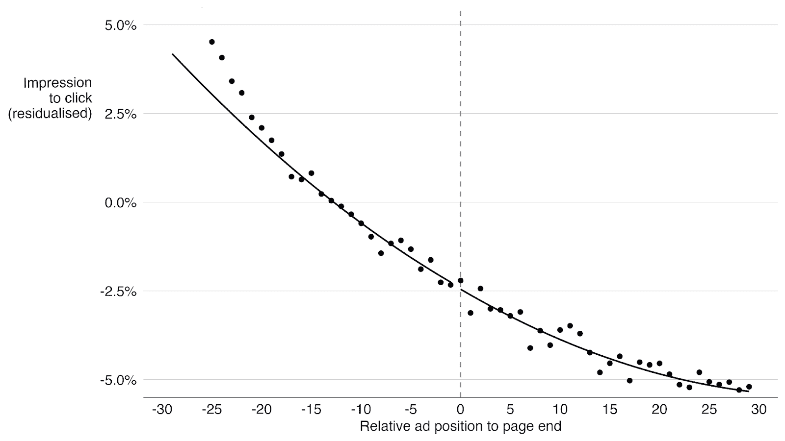
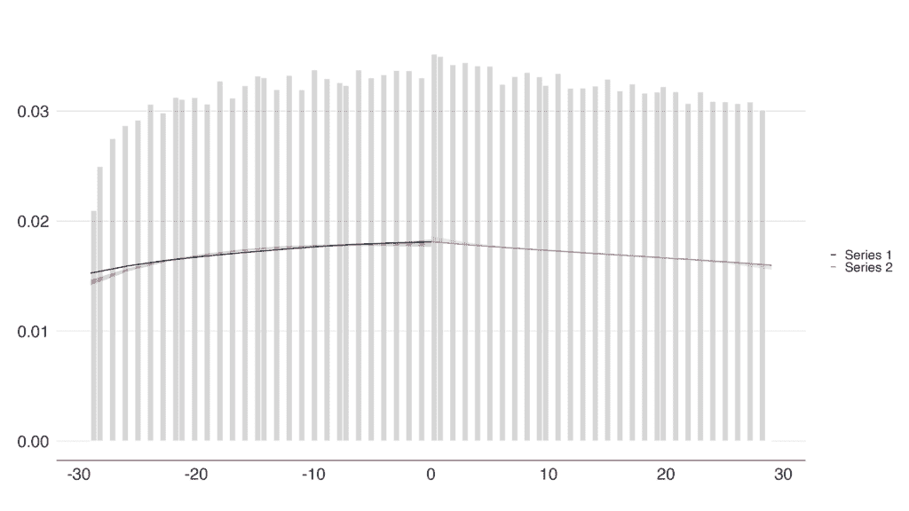

# 回归断点设计：它是如何工作的以及何时使用它

> 原文：[`towardsdatascience.com/regression-discontinuity-design-how-it-works-and-when-to-use-it/`](https://towardsdatascience.com/regression-discontinuity-design-how-it-works-and-when-to-use-it/)

你是一位热衷于数据科学和实验的人。你知道随机化是证据可信度的顶峰，你也知道当你不能随机化时，你会求助于观察数据以及因果推断技术。你可以使用各种方法来构建控制组——差异-差异、逆倾向得分加权，等等。在这里或那里有一个假设（有些比其他更不稳定），你估计因果效应并推动决策。但如果你认为“香草”因果推断已经足够刺激，那么请继续阅读。

个人而言，我经常发现自己至少处于两种场景中，在这些场景中，“仅仅进行因果推断”并不简单。这两个场景的共同点是什么？一个缺失的控制组——至少从表面上看是这样的。

首先，**冷启动场景**：公司希望进入一个未知的机遇空间。通常情况下，没有可学习的实验数据，也没有来自业务或产品方面的任何变化（即：“外生冲击”），无法在更常见的因果推断框架中利用，如差异-差异（以及其他在前后范式中的表亲）。

其次，**不可行的随机化场景**：组织有意测试一个想法，但随机化不可行——甚至不希望进行随机化。即使模拟自然实验也可能受到法律、技术或商业（尤其是关于定价）的限制，或者当市场中出现干扰偏差时。

这些情况为一种“不同”类型的因果推断打开了空间。虽然我们在这里关注的这种方法不是唯一适合这项工作的方法，但我希望你能跟随我深入探讨回归断点设计（RDD）。

在这篇文章中，我将向您清晰地展示 RDD 是如何工作和为什么有效。不可避免地，这将涉及一些数学——对一些人来说是一种愉快的景象——但我会尽我所能，通过文献中的经典例子来保持其可理解性。

我们还将看到 RDD 如何解决电子商务和在线市场中一个棘手的因果推断挑战：列表位置对列表表现的影响。在本节中，我们将涵盖从业者经常面临的关键建模考虑因素：参数 RDD 与非参数 RDD，选择合适的带宽参数，等等。所以，给自己倒一杯咖啡，让我们开始吧！

## 概述

+   如何和为什么 RDD 有效：关键概念

    +   核心假设解释：连续性

    +   RDD 和工具变量

    +   为什么后门方法不起作用

+   RDD 的实际应用：搜索排名和列表表现示例

    +   实际设置与变量

    +   估计 RDD

        +   参数 RDD 与非参数 RDD

        +   添加协变量

        +   多项式度和带宽

        +   解释结果

        +   安慰剂测试

    +   分析回顾和；

+   结论

## RDD 是如何工作的以及为什么它有效

回归断点设计利用截止点——阈值——来恢复治疗对结果的影响。更确切地说，它寻找在“运行”变量上治疗分配概率的急剧变化。如果治疗分配仅取决于运行变量，并且截止点是任意的，即外生的，那么我们可以将围绕它的单位视为随机分配的。截止点上下结果之间的差异给我们提供了因果效应。

例如，仅授予得分超过 90 分的学生奖学金，就会基于考试成绩创建一个截止点。这个截止点是 90 分是任意的——实际上它可以是 80 分；只需要在某处划一条线。此外，得 91 分与得 89 分之间的差距对于待遇来说就是全部区别：要么你得到它，要么得不到。但是关于*能力*，得 91 分和得 89 分的两组学生实际上并没有真正不同，对吧？那些得 89.9 分与得 90.1 分的人——如果你坚持的话？

截止点的形成可能只是随机性的结果，当它只是关于几个分数点的时候。也许学生在考试前喝太多咖啡——或者太少。也许他们在前一天晚上收到了坏消息，被天气影响，或者焦虑在最糟糕的时刻爆发。正是这种随机性使得截止点在 RDD 中如此*关键*。

没有截止点，就没有 RDD——只是一个散点图和一个梦想。但是，截止点本身并不具备识别因果效应所需的一切。它之所以有效，取决于一个核心识别假设：连续性。

### 连续性假设，以及平行世界

如果截止点是这项技术的基石，那么其重要性完全来自于连续性假设。这个想法是简单且反事实的：如果没有治疗，那么就不会有影响。

为了使连续性的想法具体化，让我们直接跳到一个公共卫生的经典例子：合法饮酒是否会增加死亡率？

想象两个世界，其中每个人和每件事都是相同的。除了一个东西：一条法律，将最低法定饮酒年龄设定为 18 岁（我们在这里是欧洲，朋友们）。

在有法律（事实世界）的世界里，我们预计酒精消费将在 18 岁后立即增加。如果存在联系，与酒精相关的死亡人数也应该增加。

现在，考虑一个没有这种法律的反事实世界；这种跳跃应该不存在。酒精消费和死亡率可能会在各个年龄组中呈现平稳的趋势。

现在，这对识别因果效应是个好事；反事实世界中死亡人数没有跳跃是解释事实世界中跳跃作为法律影响的**必要**条件。

简单来说：如果没有治疗，死亡人数不应该有跳跃。如果有，那么除了我们的治疗之外，还有其他因素在起作用，RDD 就不再有效。



两个平行世界。从左到右；一个是没有法定饮酒年龄限制的世界，另一个是有：18 岁。

连续性假设可以在潜在结果框架中写成：

\begin{equation}

\lim_{x \to c^-} \mathbb{E}[Y_i(0) \mid X_i = x] = \lim_{x \to c^+} \mathbb{E}[Y_i(0) \mid X_i = x]

\label{eq: continuity_po}

\end{equation}

其中 \(Y_i(0)\) 是潜在结果，比如说，受试者 \(/mathbb{i}\) 在无治疗情况下的死亡风险。

注意，右侧是反事实世界的数量；不是在事实世界中可以观察到的，在事实世界中，如果受试者超过截止值，就会接受治疗。

对于我们来说，不幸的是，我们只能接触到事实世界，因此这个假设不能直接进行测试。但是，幸运的是，我们可以进行代理。我们将在文章后面看到安慰剂组如何实现这一点。但首先，我们开始识别**什么**会打破这个假设：

1.  **混杂因素：**除了治疗之外，在截止值发生的事情也会影响结果。例如，青少年为了减轻成为成年人带来的巨大压力而求助于酒精——这与法定饮酒年龄的法律（在无法律的世界中）无关，但它确实会混淆我们追求的效果，发生在同一年龄——即截止值。

1.  **操纵运行变量：**

    当单位可以影响其相对于截止值的位置时，可能的情况是，这样做的人本质上与没有这样做的人不同。因此，截止值操纵可能导致选择偏差：一种混杂形式。特别是如果治疗分配是强制性的，受试者可能会尽力获得一种治疗版本而不是另一种。

希望这很清楚，RDD 的构成是什么：运行变量、截止值，最重要的是，有合理的理由来捍卫连续性。有了这些，你就为自己获得了一个整洁且有效的因果推断设计，用于那些不能通过 A/B 测试、也不能通过一些更常见的因果推断技术（如差分差分、分层）来回答的问题。

在下一节中，我们继续塑造我们对 RDD 如何工作的理解；RDD 如何“控制”混杂关系？它究竟估计了什么？我们难道不能只控制运行变量吗？这些问题是我们接下来要解决的问题。

### RDD 和仪器

如果你已经熟悉工具变量（IV），你可能看到它们的相似之处：RDD 和 IV 都利用一个外生变量，这个变量不会直接导致结果，但会影响治疗分配，进而可能影响结果。在 IV 中，这是一个第三个变量 Z；在 RDD 中，它是作为工具的运行变量。

等等。第三个变量；也许吧。但它是外生的吗？这不太清楚。

在我们关于酒精消费的例子中，不难想象年龄——运行变量——是一个混杂因素。随着年龄的增长，对酒精的耐受性可能会增加，随之而来的是消费水平。这可能有点牵强，但并不不可信。

由于治疗（法定最低年龄）取决于年龄——只有超过 18 岁的单位才会接受治疗——接受治疗和未接受治疗的单位在本质上是有区别的。如果年龄也通过上述类似机制影响结果，我们就遇到了一个顶级的混杂因素。

尽管如此，运行变量仍然起着关键作用。要理解为什么，我们需要看看 RDD 和工具如何利用前门标准来识别因果效应。

#### *后门与前门*

可能几乎出于本能，人们可能会回答通过**控制**运行变量；这就是分层教给我们的。运行变量是混杂因素，所以我们将其包括在我们的回归中，并关闭后门。但这样做可能会引起一些麻烦。

记住，治疗分配取决于运行变量，因此所有超过截止值的人都将接受**全部**治疗，而**肯定**不会低于这个值。所以，如果我们控制运行变量，我们会遇到两个非常相关的问题：

1.  **违反正态性假设**：这个假设表示接受治疗的单位应该有非零概率接受相反的治疗，反之亦然。直观地说，根据运行变量进行条件化就像说：“让我们估计超过酒精消费最低年龄的效果，同时将年龄固定在 14 岁。”这没有意义。在运行变量的任何给定值上，治疗要么总是 1，要么总是 0。因此，没有基于运行变量的治疗变化来支持这样的问题。

1.  **截止点的完美共线性**：在估计治疗效应时，模型无法将跨越截止点的影响与 X 的特定值的影响分开。结果是什么？没有估计，或者从模型设计矩阵中强制删除变量。*奇异设计矩阵*，*没有满秩*，这些对大多数从业者来说应该很熟悉。

所以，不对——对运行变量的条件设定并不会使运行变量成为我们追求的外生工具。相反，通过将其推向极限——字面意义上的极限，运行变量才成为外生变量。在运行变量从任一侧接近截止点的位置，单位与运行变量相同。然而，仅仅高于或低于这个界限就会在是否接受治疗上产生差异。这使得运行变量成为有效的工具，如果截止点处只有治疗分配这一件事情发生。朱迪亚·佩尔（Judea Pearl）将工具变量称为满足前门标准。



X 是运行变量，D 是治疗分配，Y 是结果，U 是影响结果的一组未观测到的因素。在上述边际模型中，由于 X 是混杂因素，U 可能也是，D 对 Y 的因果效应无法识别。条件设定 X 违反了正性假设。相反，将 X 的条件设定为其接近截止点（c0）的极限，可以控制后门路径：X 直接到 Y，以及通过 U。

### *迟到，而非迟到*

因此，本质上，我们只是在截止点附近控制运行变量——这就是为什么 RDD 识别的是*局部*平均处理效应（LATE），这是平均处理效应（ATE）的一种特殊风味。LATE 看起来像：

$$\delta_{SRD}=E\big[Y¹_i – Y_i⁰\mid X_i=c_0]$$

“局部”一词指的是我们估计 ATE 的群体部分的范围，即截止点附近的子群体。事实上，数据点离截止点越远，运行变量作为混杂因素的作用就越强，它*反对*RDD 而不是支持 RDD。

回到最低法定饮酒年龄的例子。17 岁 11 个月大的青少年与 18 岁 1 个月大的青少年在平均意义上并没有太大的区别。如果有什么不同的话，年龄差异一个月或两个月并不会使他们有所不同。这不就是条件设定或保持变量恒定的本质吗？使他们不同的地方在于后者可以合法饮酒，因为他们的年龄超过了截止点，而前者则不能。

这种设置使我们能够估计截止点附近的 LATE，以及由此估计最低年龄政策对酒精相关死亡的影响。

我们已经看到，连续性假设必须成立，才能使截止点成为运行变量上识别治疗对结果因果效应的有意思的点。也就是说，通过让结果变量的跳跃完全归因于治疗。如果连续性成立，那么在截止点附近，治疗就像随机一样，这使我们能够估计局部平均处理效应。

在下一节中，我们将介绍真实世界 RDD 的实际设置：我们确定关键概念；运行变量和截止点、处理、结果、协变量，最后，在讨论了一些关键建模选择后，我们估计 RDD，并以安慰剂测试结束本节。

## RDD 实战：搜索排名和列表性能示例

在电子商务和在线市场中，买家体验的起点是搜索列表。想象一下访客在搜索栏中输入“尼康 F3 胶片相机”。在执行此操作后，算法会疯狂地整理库存，寻找最佳匹配的列表以填充搜索结果页面。

**时间和注意力是两种稀缺资源**。因此，对涉及的每个人——买家、卖家和平台——来说，保留页面最突出的位置给那些预期最有可能成为成功交易的匹配项是有利的。

此外，消费者行为中的位置效应表明，用户会从“排名”在顶部的产品中推断出**更高的可信度和吸引力**。想想在超市里被放置在视线高度或以上的高等级产品，以及电子商务平台上的突出显示项目，位于主页顶部。

那么，问题随之而来：搜索结果页面的位置如何影响列表的销售机会？

*假设*：

如果一个列表在搜索结果页面上的排名更高，那么它被售出的机会也会更高，因为排名更高的列表会从用户那里获得更多的可见性和关注。

<details class="wp-block-details is-layout-flow wp-block-details-is-layout-flow"><summary>间奏：商业还是理论？</summary>

> 正如任何好的假设一样，我们需要一点理论来巩固它。幸运的是，我们并不是在寻找治愈癌症的方法。我们的理论是关于人们已经理解的心理学现象和行为模式，说得过于复杂。
> 
> 想想*[首因效应](https://thedecisionlab.com/biases/primacy-effect)*，*[锚定偏差](https://thedecisionlab.com/reference-guide/philosophy/anchoring)*和[注意力的资源理论](https://www.mcw.edu/-/media/MCW/Education/Academic-Affairs/OEI/Faculty-Quick-Guides/Cognitive-Load-Theory.pdf)。这些都是行为和认知心理学中的好想法，支持我们在这里的计划。
> 
> 以这种方式与产品经理开始对话将会更有趣。就我个人而言，当我需要复习一些心理学知识时，我也会感到兴奋。
> 
> 但我彻底发现，在我的行业（科技）中，理论真的不如任何一项倡议重要（除了研究团队和项目，可以说）。而且公平地说，它有助于我们保持目标明确：我们所做的是推动商业发展，而不是母亲科学。</details>

知道答案具有真正的商业价值。产品和商业团队可以利用它来设计新的付费功能，帮助卖家将商品列表置于更高的位置——这对企业和用户都是双赢。它还可以阐明网站上的房地产价值，如横幅位置和广告位，有助于推动 B2B 广告的增长。

问题是关于增量：如果商品列表 \(\mathbb{j}\) 在结果页面上排名第 1，而不是第 15，它会被卖出吗？因此，我们想要做出因果陈述。这至少有两个原因很难：

1.  A/B 测试是有代价的，并且；

1.  如果我们诉诸观察方法，我们需要处理一些混淆因素。

让我们进一步探讨这个问题。

### A/B 测试的成本

一种实验设计可以在页面位置中随机选择获取的商品列表，独立于列表的相关性。打破相关性与其位置之间的内在联系，我们将了解位置对列表性能的影响。这是一个有趣的想法——但代价高昂。

虽然这是一个合理的统计推断设计，但这种设置对用户和企业来说相当糟糕。用户可能已经找到了他们需要的东西——甚至可能已经进行了购买。但相反，由于我们的实验，他们可能看到的一半库存可能只是勉强匹配。这种次优的用户体验可能会在短期和长期内损害参与度——特别是对于仍然需要了解平台对他们有什么价值的初学者。

我们能否想出一个方法来减轻这种损失？仍然坚持 A/B 测试，可以暴露给更小的一组用户进行实验。虽然这会降低后果的规模，但它也可能通过降低样本量来阻碍达到足够的统计功效。此外，即使是小众群体也可能为一些公司带来可观的收入——那些拥有数百万用户的公司。因此，减少暴露的受众群体也不是万能的解决方案。

自然地，正确的做法是让平台及其用户不受干扰——同时还要找到回答当前问题的方法。因果推断是这种思维方式的正确选择，但问题是：我们究竟该如何做到这一点？

### 混淆因素

列表不仅仅在好日子里出现在页面的顶部；是列表的质量、相关性和卖家的声誉推动了列表的排名。让我们称这三个变量为**W**。

**W**之所以棘手，是因为它既影响列表的排名，也影响列表被点击的概率，这是性能的代理指标。

换句话说，**W**影响我们的处理（位置）和结果（点击），通过充当*混淆因素*的身份来帮助自己。



当一个变量或一组变量 W 影响处理（排名、位置）和感兴趣的结果（点击）时，它就是一个混淆因素。

因此，我们的任务是找到一个适合目的的设计；一个能够有效控制 **W** 的混杂效应的设计。

### *你不会选择回归不连续性——它会选择你*

并非所有因果推断设计都只是坐着等待被选中。有时它们在你最不需要它们的时候出现，有时在你最需要它们的时候你可能会很幸运——就像今天这样。

看起来我们可以使用页面截止点来识别位置对点击通过率的影响的因果效应。

#### 搜索结果分页中的突然截止

让我们剖析列表推荐机制，看看具体是如何工作的。以下是生成搜索结果页面时幕后发生的事情：

1.  **获取匹配查询的列表**

    根据位置、半径、类别等过滤器，从库存中提取了一组粗略的列表。

1.  **按个人相关性评分列表** 此步骤使用用户历史和列表质量代理来预测用户最有可能点击的内容。

1.  **按得分对列表进行排名** 得分越高，排名越高。业务规则将广告和商业内容与有机结果混合。

1.  **填充页面** 列表根据绝对相关性得分进行排序。一个结果页面以第 *k* 个列表结束，因此第 *k+1* 个列表出现在下一页的顶部。这对我们的设计至关重要。

1.  **印象和用户互动** 用户按相关性顺序查看结果。如果某个列表吸引了他们的注意，他们可能会点击并查看更多详情：更接近交易的一步。

### 实际设置和变量

那么，我们的设计究竟是什么呢？接下来，我们将逐步分析我们设计的关键成分的推理和识别。

#### 运行变量

在我们的设置中，运行变量是列表 j 的相关性得分 \(s_j\)。这个得分是用户和列表属性的一个连续、复杂的函数：

$$s_j = f(u_i, l_j)$$

列表的排名 \(r_j\) 是 \(s_j\) 的排名转换，定义为：

$$r_i = \sum_{j=1}^{n} \mathbf{1}(s_j \leq s_i)$$

从实际角度来说，这意味着在分析目的上——例如拟合模型、进行局部比较或识别截止点——了解列表的排名几乎传达了与了解其基础相关性得分相同的信息，反之亦然。

<details class="wp-block-details is-layout-flow wp-block-details-is-layout-flow"><summary>详情：相关性得分与排名</summary>

相关性得分 \(s_j\) 反映了列表与特定用户查询的匹配程度，考虑到位置、价格范围和其他过滤器等因素。但这个得分是相对的——它只在该特定搜索返回的列表的上下文中才有意义。

相比之下，排名（或位置）是绝对的。它直接决定了列表的可见性。我认为排名是\(s_j\)的标准化转换。例如，搜索 Z 中的列表 A 可能有最高的 5.66 分，而搜索 K 中的列表 B 最高为 0.99。这些原始分数在搜索之间是不可比较的——但这两个列表在其各自的结果集中都排名第一。这使得它们在真正重要的方面是等效的：对用户来说它们有多可见。</details>

#### 截止值和处理的说明

如果一个列表刚好错过第一页，它不会掉到第二页的底部——它被人为地提升到顶部。这是一个幸运的机会。通常，只有最相关的列表出现在顶部，但在这里，一个仅仅具有适度相关性的列表最终占据了首要位置——尽管是在第二页——纯粹是由于页面断裂的任意位置。正式来说，处理分配\(D_j\)如下：

$$D_j = \begin{cases} 1 & \text{if } r_j > 30 \\ 0 & \text{otherwise} \end{cases}$$

*(关于全局排名的说明：排名 31 不仅仅是第二页的第一个列表；它仍然是整体上的第 31 个列表)*

这种设置的优点在于接近截止值时发生的情况：排名为 30 的列表可能与排名为 31 的列表在相关性上几乎相同。微小的评分波动——或高排名的异常值——可以将列表推过阈值，改变其处理状态。这种局部随机性是使设置适用于 RDD 的原因。

#### 结果：印象到点击

最后，我们将将感兴趣的成果操作化为从印象到点击的点击率。记住，当页面被填充时，所有列表都被“印象”到。点击是表示所需用户行为的二元指标。

总结来说，这是我们的设置：

+   **结果：** 印象到点击转换

+   **处理：** 落在第一页与第二页

+   **运行变量：** 列表排名；页面截止值为 30

接下来，我们将介绍如何估计 RDD。

### 估计 RDD

在本节中，我们将估计因果参数，解释它，并将其与我们核心假设联系起来：位置如何影响列表的可见性。

这是我们将要涵盖的内容：

+   **认识数据：** 数据集简介

+   **协变量：** 为什么以及如何包括它们

+   **建模选择：** 参数 RDD 与非参数 RDD。选择多项式次数和带宽。

+   **安慰剂测试**

+   **密度连续性测试**

### 认识数据

我们正在使用来自 Adevinta（前 eBay 分类广告集团）的一个市场印象数据。这是真实数据，使得整个练习感觉更加脚踏实地。尽管如此，值和关系在必要时会被屏蔽和混淆，以保护其战略价值。

关于我们如何解释 RDD 估计和驱动决策的一个重要注意事项是数据的收集方式：只有当用户看到了第一页和第二页的搜索才被包括在内。

这样，我们就可以部分消除任何页面固定效应，但现实是许多用户根本不会翻到第二页。因此，存在很大的体积差距。我们在分析回顾中讨论了其影响。

数据集包括以下变量：

+   **点击量**：如果列表被点击，则为 1，否则为 0 – 二进制

+   **位置**：列表的排名 – 数值

+   **D**：处理指标，如果位置>30，则为 1，否则为 0 – 二进制

+   **类别**：列表的产品类别 – 名义

+   **有机**：如果是有机产品，则为 1，如果是专业卖家，则为 0 – 二进制

+   **Boosted**：如果支付费用以位于顶部，则为 1，否则为 0 – 二进制

| click | rel_position | D | category | organic | boosted |
| --- | --- | --- | --- | --- | --- |
| 1 | -3 | 0 | A | 1 | 0 |
| 1 | -14 | 0 | A | 1 | 0 |
| 0 | 3 | 1 | C | 1 | 0 |
| 0 | 10 | 1 | D | 0 | 0 |
| 1 | -1 | 0 | K | 1 | 1 |

我们正在处理的样本数据集。

### 协变量：如何包含它们以提高准确性？

运行变量、截止点和连续性假设，为你提供了识别因果效应所需的所有信息。但包括协变量可以通过减少方差来提高估计器的精度——如果做得正确。然而，做错它很容易。

在 RDD 设计中“破坏”最容易的事情是连续性假设。同时，这也是我们最不想破坏的事情（我已经对此说了很多）。

因此，添加协变量的主要任务是使其以这种方式进行，从而减少方差，同时保持连续性假设完整。一种表述方式是，假设在没有协变量和有协变量的情况下都保持连续性：

\begin{equation}

\lim_{x \to c^-} \mathbb{E}[Y_i(0) \mid X_i = x] = \lim_{x \to c^+} \mathbb{E}[Y_i(0) \mid X_i = x] \text{(无协变量)}

\end{equation}

\begin{equation}

\lim_{x \to c^-} \mathbb{E}[Y_i(0) \mid X_i = x, Z_i] = \lim_{x \to c^+} \mathbb{E}[Y_i(0) \mid X_i = x, Z_i] \text{(协变量)}

\end{equation}

其中 \(Z_i\) 是针对主体 i 的协变量向量。不那么数学化地说，在添加协变量后，两件事应该保持不变：

1.  运行变量的函数形式，以及；

1.  在截止点处理分配的（不存在）跳跃

我并不是自己发现上述内容的；Calonico、Cattaneo、Farrell 和 Titiunik（2018）做到了。他们为将协变量纳入 RDD 开发了一个正式框架。我将细节留给论文。现在，一些建模指南可以让我们继续前进：

1.  **线性化模型协变量**，以便在有无协变量的情况下，处理效果保持不变，这得益于协变量的简单和光滑的局部效应；

1.  **保持模型项可加性**，以便处理效果保持为 LATE，而不是根据协变量条件（CATE）；并且避免在截止点添加跳跃。

1.  上述内容意味着没有与处理指标或运行变量的交互。进行任何这些操作都可能破坏连续性并使我们的 RDD 设计无效。

我们的目标模型可能如下所示：

\begin{equation}

Y_i = \alpha + \tau D_i + f(X_i – c) + \beta^\top Z_i + \varepsilon_i

\end{equation}

为了让协变量与处理指标相互作用，我们想要避免的模型如下：

\begin{equation}

Y_i = \alpha + \tau D_i + f(X_i – c) + \beta^\top (Z_i \cdot D_i) + \varepsilon_i

\end{equation}

现在，让我们区分两种实际包含协变量的方式：

1.  **直接包含**：直接将它们添加到结果模型中，与处理变量和运行变量并列。

1.  **残差化**：首先将结果变量对协变量进行回归，然后在 RDD 中使用残差。

我们将在我们的案例中使用残差化。这是一种有效的减少噪声、产生更清晰的视觉化和保护数据战略价值的方法。

下面的代码片段定义了结果去噪模型并计算了残差化结果，`click_res`。想法很简单：一旦我们剔除了由协变量解释的方差，剩下的就是我们结果变量的一个更少噪声的版本——至少在理论上是如此。噪声更少意味着精度更高。

在实践中，尽管这次残差化几乎没有移动指针。我们可以通过检查标准差的变化来看到这一点：

`SD(click_res) / SD(click) - 1`给出了大约-3%，这在实际应用中是很小的。

```py
# denoising clicks
mod_outcome_model <- lm(click ~ l1 + organic + boosted, 
                        data = df_listing_level)

df_listing_level$click_res <- residuals(mod_outcome_model)

# the impact on variance is limited: ~ -3%
sd(df_listing_level$click_res) / sd(df_listing_level$click) - 1
```

尽管去噪没有产生太大效果，但我们仍然处于一个好的位置。原始的因变量已经具有很低的条件方差，并且截止点周围的模式可以用肉眼看到，如下所示。



在 x 轴上：相对于页面末尾的排名（每页 30 个位置），在 y 轴上：残差化的平均点击率。

我们继续讨论一些其他建模决策，这些决策通常有更大的影响：在参数 RDD 和非参数 RDD 之间进行选择，多项式度数和带宽参数（h）。

### RDD 中的建模选择

#### 参数 RDD 与非参数 RDD 的比较

你可能会想知道为什么我们甚至需要在参数 RDD 和非参数 RDD 之间进行选择。答案在于每种方法在估计处理效应时如何权衡**偏差和方差**。

选择**参数 RDD**本质上是在选择减少方差。它假设结果变量和运行变量之间关系的特定函数形式，\(\mathbb{E}[Y \mid X]\)，并在整个数据集上拟合该模型。处理效应被捕捉为在连续函数中的离散跳跃。典型的形式如下：

$$Y = \beta_0 + \beta_1 D + \beta_2 X + \beta_3 D \cdot X + \varepsilon$$

**非参数 RDD**，另一方面，是关于减少偏差。它避免了对 Y 和 X 之间全局关系的强烈假设，而是在截止点的两侧分别估计结果函数。这种灵活性使得模型能够更准确地捕捉到阈值周围的实际情况。非参数估计器如下：

\(\tau = \lim_{x \downarrow c} \mathbb{E}[Y \mid X = x] – \lim_{x \uparrow c} \mathbb{E}[Y \mid X = x]\)

那么，你应该选择哪一个？说实话，这可能会感觉是随意的。这是系列判断中的第一个，实践者通常称之为 RDD 的有趣部分。这是建模既是艺术也是科学的地方。

我将说明我是如何处理这个选择的。但首先，让我们看看两个关键调整参数（特别是对于非参数 RDD），它们将指导我们的最终决策：多项式次数和带宽，h。

#### 多项式次数

结果与运行变量之间的关系可以有多种形式，准确捕捉其真实形状对于准确估计因果效应至关重要。如果你很幸运，一切都是线性的，那么你不需要考虑多项式——如果你是一个现实主义者，那么你可能想了解它们在过程中如何为你服务。

在选择合适的多项式次数时，目标是减少偏差，同时不增加估计量的方差。因此，我们希望提供灵活性，但我们不希望过度这样做。以下图中的例子：当结果具有足够低的方差时，线性形式自然会引导眼睛估计截止点的结果。但如果我们在模型中强制执行线性形状，那么估计就会变得有偏差。在如此复杂的情况下坚持线性形状就像把脚塞进手套一样：它有点用，但看起来非常难看。

相反，我们通过使用更高次的多项式给模型更多的自由度，并估计预期的 <mdspan datatext="el1745611088934" class="mdspan-comment">结果</mdspan> \(\tau = \lim_{x \downarrow c} \mathbb{E}[Y \mid X = x] – \lim_{x \uparrow c} \mathbb{E}[Y \mid X = x]\)，以降低偏差。



<mdspan datatext="el1745611151754" class="mdspan-comment">图注：结果与运行变量之间的关系可以是简单且可预测的，或者具有更复杂且本质上更不规则的形状。正确地获取复杂形式可能更困难——它需要高模型保真度</mdspan>，而未能做到这一点可能会引入偏差。

#### 带宽参数：h

按照上述方式处理多项式并不免除担忧。需要两件事，并且同时构成挑战：

1.  我们需要在整个范围内正确地进行建模，并且；

1.  整个范围应该与当前任务相关，即估计 \(\tau = \lim_{x \downarrow c} \mathbb{E}[Y \mid X = x] – \lim_{x \uparrow c} \mathbb{E}[Y \mid X = x]\)

只有这样我们才能如预期地减少偏差；如果其中之一不是这样，我们就有风险增加更多的偏差。

问题是，正确地建模整个范围比建模较小范围更困难，特别是如果形式复杂的话。因此，更容易出错。此外，整个范围几乎肯定与估计因果效应不相关——LATE 中的“局部”性质暴露了这一点。我们如何解决这个问题？

引入带宽参数，h。带宽参数帮助模型利用接近截止点的数据，放弃*全局*数据理念，并将其回归到 RDD 估计效应的局部范围。它是通过通过某个函数 \(\mathbb{w}(X)\) 加权数据来实现的，使得靠近截止点的项获得更多权重，而远离截止点的项获得较少权重。

例如，当 h = 10 时，模型考虑的总长度范围为 20；截止点两侧各有 10。

有效权重取决于函数，\(\mathbb{w}\)。具有硬边界行为的带宽函数被称为平方核或均匀核。可以将其视为一个当数据在带宽内时赋予权重 1，否则赋予权重 0 的函数。高斯核和三角核是实践者经常使用的两种其他核函数。关键区别在于，与平方核相比，这些核在权重项的行为上不那么突然。下面的图像展示了这三个核函数的行为。



展示了三个加权函数。y 轴表示权重。平方核作为硬截止点，决定了哪些项可以被模型看到。三角函数和高斯函数在这方面表现得更为平滑。

#### 总而言之：非参数与参数 RDD、多项式度数和带宽

对我来说，选择最终模型归结为这样一个问题：什么是最简单的模型，同时又能做好工作？的确——奥卡姆剃刀原则永远不会过时。在实践中，这意味着：

1.  **非参数与参数：**截止点的两侧的函数形式简单吗？如果是这样，那么一个拟合，将两侧的数据合并起来就可以。否则，非参数 RDD 添加了所需的灵活性，以适应截止点两侧不同的动态。

1.  **多项式度数：**当函数复杂时，我选择更高的度数以更灵活地跟随趋势。

1.  **带宽：**如果只是选择一个高的多项式度数，那么我会让 h 更大。否则，根据我的经验，h 的较低值通常与较低的多项式度数相匹配*，**。

* 这将我们引向文献中普遍接受的推荐：将多项式度数保持在 3 以下。在大多数情况下，2 就足够好了。只需确保你明智地选择。

**此外，请注意，h 在非参数思维中特别适用；我认为这两个选择是相互依赖的。

回到列表位置场景。对我来说，这是最终的模型：

```py
# modelling the residuals of the outcome (de-noised)
mod_rdd <- lm(click_res ~ D + ad_position_idx,
              weight = triangular_kernel(x = ad_position_idx, c = 0, h = 10),  # this is h
              data = df_listing_level)
```

### 解释 RDD 结果

让我们看看模型输出。下面的图像显示了模型摘要。如果你熟悉这个，所有的一切都将归结于对参数的解释。

首先要注意的是，接受处理的列表比未处理的列表有大约 1 个百分点的点击概率更高。为了更清楚地说明这一点，如果控制组的点击率为 5%，那么这将是一个+20%的变化；如果控制组是 80%，那么大约是+1%的增加。当涉及到这个因果效应的**实际意义**时，这两个提升是截然不同的。我将这个问题留作开放，提出几个问题供大家思考：你和你团队会在什么时候将这种影响视为一个抓住机会？我们还需要哪些数据/答案来宣布这条路径值得追踪？

剩余的参数实际上并没有为因果效应的解释增加太多。但让我们快速浏览一下。第二个估计（x）是截止斜率以下的斜率；第三个估计（D x \(\mathbb(x)\)）是添加到先前斜率中的额外[负]点，以反映截止线以上的斜率；最后，截距是截止线以下单位的平均值。因为我们的结果变量是残差化的，所以-0.012 的值是去均值的结果；它不再位于原始结果的范围。



### 不同的选择，不同的模型

我将这张图像组合起来，以展示如果我们对带宽、多项式度数和参数化与非参数化做出不同的选择，可能出现的其他模型集合。尽管在这些模型中几乎没有一个会将决策者引向完全错误的方向，但每个模型都带有其偏差和方差属性。这确实会影响我们对估计的**信心**。



### 安慰剂测试

在任何因果推断方法中，识别假设是至关重要的。有一点不对，整个分析就会崩溃。我们可以假装一切正常，或者我们自己测试我们的方法（相信我，在你把它发布出去之前打破自己的分析会更好）

安慰剂测试是验证结果的一种方法。安慰剂测试通过使用与真实实验相同的设置，但去掉实际治疗来检查结果的可靠性。如果我们仍然看到效果，这表明设计有缺陷——连续性不能假设，因果关系也无法识别。

幸运的是，我们有一个安慰剂组。30 个列表页面切割只存在于平台的桌面版本上。在移动端，无限滚动使得它变成了一页很长；没有分页，没有页面跳转。因此，“转到下一页”的效果不应该出现，而且也没有出现。

我认为我们不需要做太多的推断。下面的图表已经告诉我们整个故事：没有页面，从第 30 位到第 31 位与其他任何位置到下一个位置没有区别。更重要的是，函数在截止点处是平滑的。这一发现通过展示在这个安慰剂组中连续性成立，为我们分析增添了大量的可信度。



安慰剂测试是 RDD 中最强有力的检查之一。它几乎直接测试了连续性假设，通过将安慰剂组作为反事实的替代品来处理。

当然，这依赖于一个新的假设：安慰剂组是有效的；它是一个足够好的反事实。因此，只有当这个假设比没有证据假设连续性更有可信度时，测试才是强大的。

这意味着我们需要开放地考虑没有适当安慰剂组的情况。那么我们如何对设计进行压力测试？

### 无操作和密度连续性测试

快速回顾。有两种相关的混杂来源，因此违反了连续性假设：

1.  来自第三个变量的截止点的直接混杂，

1.  运行变量的操作。

第一个不能直接测试（除了安慰剂测试）。第二个可以。

如果单位可以改变它们的运行变量，它们就会自我选择进入治疗。比较就不再公平：我们现在是在比较操作者与那些不能或没有的人。如果这种自我选择也影响结果，那么它就会成为混杂因素。

例如，那些没有达到奖学金门槛的学生，但通过有效地说服他们的机构以更高的分数让他们通过。这种银舌也可以帮助他们获得更好的薪水，并在我们研究奖学金对未来收入的影响时充当混杂因素。


在 DAG 形式中，运行变量的操作会导致选择偏差，这反过来又使得连续性假设不再成立。如果我们知道连续性成立，那么就没有必要通过操作来测试选择偏差。但是当我们不能（因为没有好的安慰剂组）时，至少我们可以尝试测试是否存在操作。

那么，我们如何判断我们处于这样的场景？一个意外的高数量单位刚好在截止点之上，以及一个刚好在截止点之下（或反之）。我们可以将其视为另一个连续性问题，但这次是关于样本密度的。

尽管我们不能直接测试潜在结果的连续性，但我们可以测试截止点处运行变量密度的连续性。*McCrary* 测试是这一测试的标准工具，正好测试：

\(H_0: \lim_{x \to c^-} f(x) = \lim_{x \to c^+} f(x) \quad \text{(无操作)}\)

\(H_A: \lim_{x \to c^-} f(x) \neq \lim_{x \to c^+} f(x) \quad \text{(操作)}\)

其中 \(f(x)\) 是运行变量的密度函数。如果 \(f(x)\) 在 x = c 处跳跃，这表明单位已经在上一个或下一个截止点以上或以下进行了排序——违反了运行变量在那个边际不可操纵的假设。

这个测试的内部机制是另一篇文章的内容，因为幸运的是我们可以依赖`rdrobust::rddensity`来运行这个测试，现成的。

```py
require(rddensity)
density_check_obj <- rddensity(X = df_listing_level$ad_position_idx, 
                               c = 0)
summary(density_check_obj)

# for the plot below
rdplotdensity(density_check_obj, X = df_listing_level$ad_position_idx)
```



McCrary 测试的视觉表示。

测试显示运行变量密度的不连续性有边际的证据（T = 1.77，p = 0.077）。在截止点两侧的二元计数不平衡，表明在阈值以下有更少的观测值。

通常，这是一个红旗，因为这可能会对连续性假设构成威胁。然而，这次我们知道连续性**实际上**是成立的（见安慰剂测试）。

此外，排名是由算法完成的：卖家没有任何手段可以操纵他们列表的排名。这是我们通过设计知道的事情。

因此，一个更合理的解释是，密度的不连续性是由平台端的印象记录（而不是排名）驱动的，或者是我自己在 SQL 查询中的过滤（这很复杂，过滤变量的缺失值并不罕见）。

### 推断

这次的结果将会如此。但 Calonico、Cattaneo 和 Titiunik（2014）强调了与我们类似的 OLS RDD 估计中的一些问题。具体来说，关于 1）在截止点估计预期结果时的偏差，当我们从截止点取样更远时，它就不再真正**在**截止点了，以及 2）由于 h 被视为超参数而不是模型参数，模型中遗漏了带宽引起的不确定性。

他们的方法在`rdrobust`这个 R 和 Stata 软件包中得到了实现。我建议在那些旨在指导现实决策的分析中使用该软件。

### 分析回顾

我们研究了列表在搜索结果中的位置如何影响其被点击的频率。通过关注第一页和第二页之间的截止点，我们发现了一个明显的（尽管是适度的）因果效应：位于第二页顶部的列表比那些困在第一页底部的列表获得了更多的点击。安慰剂测试支持了这一点——在移动端，由于无限滚动且没有真正的“页面”，这种效应消失了。这让我们对结果更有信心。底线：列表的位置很重要，优先考虑顶部位置可能会提高参与度并创造新的商业机会。

但在我们运行它之前，有几个重要的注意事项。

首先，我们的结果是局部的——它只告诉我们接近第二页截止点时发生了什么。我们不知道同样的效果是否在第一页的顶部也存在，这可能会向用户传达更多的价值。因此，这可能是一个下限估计。

第二，数量很重要。第一页获得了更多的关注。因此，即使第二页的顶部位置每次查看时获得的点击更多，第一页的较低位置仍然可能赢得整体。

## 结论

回归断点设计并非日常的因果推断方法——它是一种细腻的方法，最好在星星对齐、随机化不可行时使用。确保您对设计有良好的掌握，并对核心假设进行彻底的思考：尝试打破它们，然后更加努力。当您获得所需内容时，这将是一个令人难以置信的满意的设计。我希望这次阅读能在您下次有机会应用此方法时为您提供帮助。

看到您能阅读到这里，我感到非常高兴。如果您想阅读更多内容，也是可能的；只是不是在这里。因此，我为您整理了一份小型的资源列表：

+   [因果推断混音带](https://www.google.com/search?gs_ssp=eJzj4tVP1zc0TCtJrkoqNDcwYPSSSU4sLU7MUcjMS0stSs1LTlUoyUhVyM2sKEksSAUAUFsPiA&q=causal+inference+the+mixtape&rlz=1C5GCEA_enNL1150NL1150&oq=causal+inference&gs_lcrp=EgZjaHJvbWUqBwgCEC4YgAQyCQgAEEUYORiABDIHCAEQABiABDIHCAIQLhiABDIHCAMQLhiABDIHCAQQLhiABDIGCAUQRRhBMgYIBhBFGEEyBggHEEUYQdIBCDI3NDBqMGo3qAIIsAIB&sourceid=chrome&ie=UTF-8)：关于 RDD 和更多内容的深入阅读

+   [因果推断：统计学习方法](https://web.stanford.edu/~swager/causal_inf_book.pdf)：正式且技术性强，直击要点

+   当然，还有我们可靠的维基百科（实际上是一个很好的入门资源）

还请查看下方的参考文献部分，以获取一些深入阅读的内容。

很高兴在[LinkedIn](https://www.linkedin.com/in/alejandro-alvarez-p%C3%A9rez-a21912b0/)上与您建立联系，在那里我讨论更多类似的话题。此外，请随意将我的个人[网站](https://aalvarezperez.github.io/)加入书签，它比这里更加温馨。

* * *

*本帖中所有图片均为本人拍摄*。*我使用的数据集是真实的，且不公开可用*。*此外，从中提取的值已被匿名化*；*修改或省略*，*以避免泄露关于公司的战略见解*。

***参考文献***

***Calonico, S., Cattaneo, M. D., Farrell, M. H., & Titiunik, R. (2018).*** *使用协变量的回归断点设计。从* [*http://arxiv.org/abs/1809.03904v1*](http://arxiv.org/abs/1809.03904v1) *检索*

***Calonico, S., Cattaneo, M. D., & Titiunik, R. (2014).*** *回归断点设计的稳健非参数置信区间。Econometrica, 82(6), 2295–2326\. https://doi.org/10.3982/ECTA11757*
