# 正则化：深入探讨理论、实现和实用见解

> 原文：[`towardsdatascience.com/regularisation-a-deep-dive-into-theory-implementation-and-practical-insights/`](https://towardsdatascience.com/regularisation-a-deep-dive-into-theory-implementation-and-practical-insights/)

## <mdspan datatext="el1750100894772" class="mdspan-comment">引言</mdspan>

这篇博客深入探讨了正则化技术，旨在为您提供简单的直观理解、数学基础和实现细节。

目标是弥合理论和代码之间的概念差距，为早期研究人员和实践者提供帮助。我花了整整一个月的时间来研究和撰写这篇博客，希望它能帮助到正在经历相同学习旅程的其他人。

本博客假设您熟悉以下先决条件：

+   Python 和相关机器学习库

+   初级机器学习

+   导数和梯度

+   对优化有一些了解

这篇博客涵盖了正则化主题的基本实现。

在阅读的同时跟随并尝试代码，您可以在本[GitHub 仓库](https://github.com/souravmohile/regularisation-blog)中找到完整的实现。

> *除非明确说明，否则所有代码、图表和插图均由作者创建。*
> 
> *例如，[3] 指的是参考文献部分中的第三个引用。*

* * *

## 目录

1.  偏差-方差权衡

1.  过拟合是什么样的？

1.  解决方案（正则化）

1.  基于惩罚的正则化技术

1.  基于训练过程的正则化技术

1.  基于数据的正则化技术

1.  关于欠拟合的简要说明

1.  结论

1.  参考文献

1.  致谢

* * *

## 偏差-方差权衡

在我们探讨权衡之前，让我们了解偏差和方差究竟是什么。

我们首先需要理解的是，数据中包含模式。有时数据中包含很多有洞察力的模式，有时则不然。

机器学习模型的工作是捕捉这些模式，并理解到一定程度，以至于它可以在新的、未见过的数据中注意到这些模式，然后根据对这种模式的理解进行预测。

那么，这与模型具有偏差或方差有什么关系？

这样想：

偏差就像一个不太关注且错过真正发生的事情的无知的人。一个高偏差的模型在本质上过于简单，无法理解或注意到数据中的模式。

由于模型假设，数据中的模式和关系被过度简化，这导致了一个欠拟合的模型。


使用 [ChatGPT 4o](https://chatgpt.com/) 生成的图像

欠拟合模型在训练数据和测试数据上都会导致性能不佳。

另一方面，方差就像一个偏执的人。一个对每一个小细节都过度反应的人。


使用 [ChatGPT 4o](https://chatgpt.com/) 生成的图像

高方差模型过于关注训练数据，甚至记住噪声。它在训练数据上表现良好，但无法泛化，导致在测试集上表现不佳的过拟合模型。

> *泛化是指模型在未见数据上的表现能力。*

当学习偏差和方差时，你会遇到偏差-方差权衡的概念。这个想法背后的本质是偏差和方差是成反比的，即当一个增加时，另一个减少。

好模型的目的是找到偏差和方差平衡的甜蜜点，从而在未见数据上表现出良好的性能。

### 澄清一些差异

偏差和欠拟合；方差和过拟合密切相关，但不是同一回事。

想象一下：

+   偏差/方差是一种测量

+   欠拟合/过拟合是一种诊断

就像医生使用体温计来诊断疾病一样，我们使用偏差/方差来诊断模型的疾病，即欠拟合/过拟合。

+   高偏差 → 欠拟合

+   高方差 → 过拟合

* * *

## 过拟合看起来像什么？

过拟合模型是由仅对数据的特定特征权重过高的权重引起的。这是由于模型记住了一些模式并过度依赖这些少数特征。

这些模式不是一般趋势，而是噪声或一些特定的怪癖。

为了演示这一点，我们将查看一个简单但具有说明性的例子：

```py
# Generating Random Data Points
np.random.seed(42)

X = np.linspace(0, 1, 30).reshape(-1, 1)
y = 20 *X.squeeze()**3 - 15 * X.squeeze()**2 + 10 * X.squeeze() + 5
y += np.random.randn(*y.shape) * 2
```

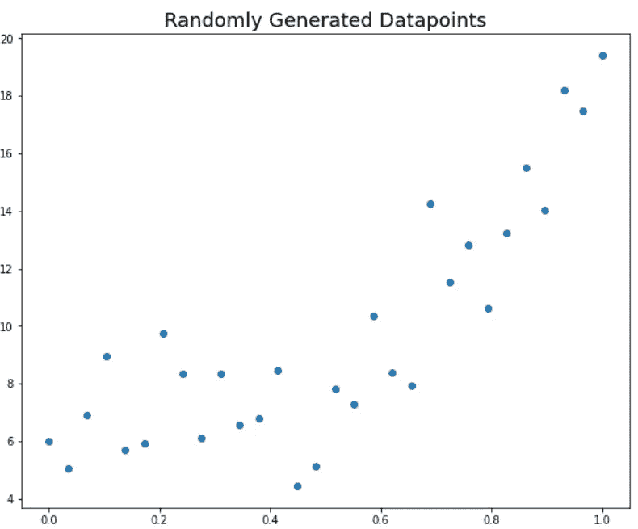

可视化我们生成的随机数据点 | 图像由作者提供

如上所示，我们使用 NumPy 生成了随机数据点。在这个数据上，我们将拟合一个多项式回归模型。由于这是一个在小型数据集上使用的复杂且高度表达性的模型，它将过度拟合，为我们提供了一个高方差的一个完美例子。

多项式回归在多项式变换的特征上实现线性回归。请注意，这些变化是对数据而不是模型进行的。为了实现这一点，我们首先应用多项式特征扩展，然后使用未正则化的线性回归模型。

```py
# Polynomial Regression Model
pipe = Pipeline([
("poly", PolynomialFeatures(degree=8)),
("linear", LinearRegression())
])
```

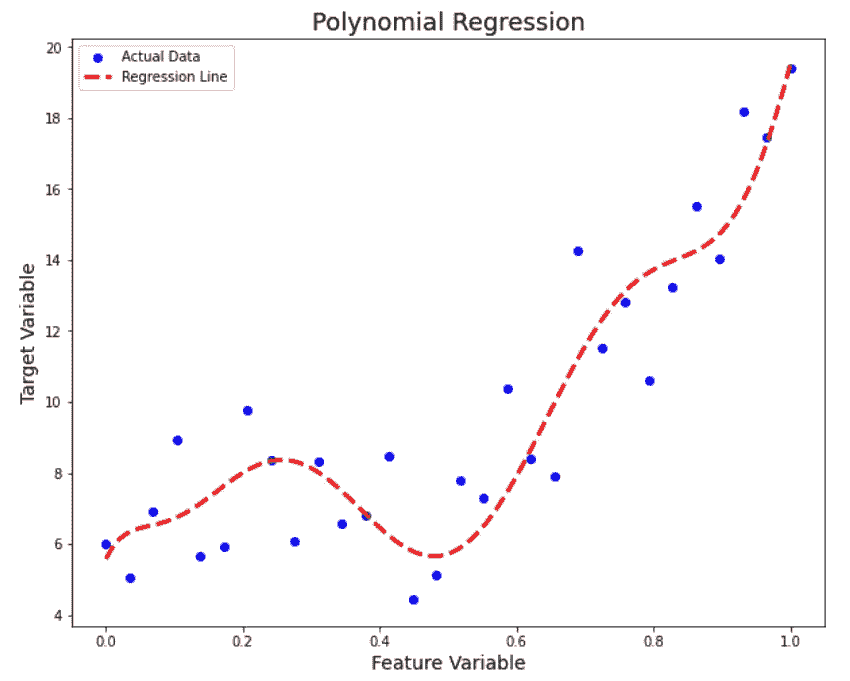

在我们生成的随机数据点上拟合多项式回归模型 | 图像由作者提供

拟合的曲线弯曲以适应几乎每个数据点。这是一个高方差，导致过拟合的明显例子。

最后，我们将计算训练集和测试集上的均方误差，以查看模型的性能：

```py
# Calculating the MSE
from sklearn.metrics import mean_squared_error
train_mse = mean_squared_error(y_train, y_train_pred)
test_mse = mean_squared_error(y_test, y_test_pred)
```

这给我们：

+   **训练均方误差:** 1.6713

+   **测试均方误差:** 5.4532

如预期的那样，模型过度拟合了数据，因为测试误差高于训练误差。这意味着模型在训练数据上表现良好，但无法泛化，即它没有在未见数据上显示出良好的结果。

在博客的进一步内容中，我们将探讨一些技术如何被用来正则化这个问题。

## 解决方案（正则化）

因此，我们因为过拟合而永远注定失败吗？当然不是。研究人员已经开发出各种技术，用于减轻过拟合。在我们深入了解之前，这里有一个简要概述：

+   **添加惩罚：**这种方法侧重于将权重拉向 0，从而防止权重变得过大。

+   **调整训练过程：**这包括尝试不同的 epoch 数量，实验超参数等。这些都是与数据或模型本身直接无关的事情。

+   **数据级技术：**这包括修改或增强数据以减少过拟合。这可能包括去除异常值、添加更多数据、平衡类别等。

这里有一个思维导图，用于跟踪本博客中讨论的方法。请注意，尽管我已经覆盖了许多方法，但这个列表并不详尽。

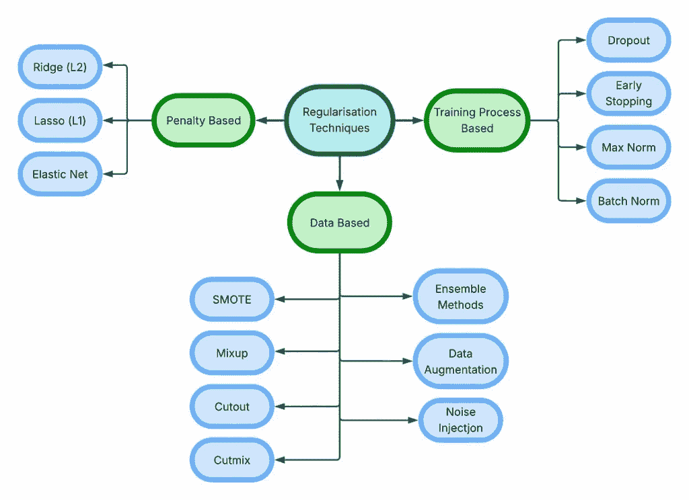

正则化思维导图 | 使用 [LucidChart](https://www.lucidchart.com/pages) 制作 | 作者提供图片

* * *

## 基于惩罚的正则化技术

使用惩罚项对模型进行正则化是通过向损失函数中添加“惩罚项”来实现的。这有效地限制了模型权重的幅度，避免了过度依赖单个特征。

要理解惩罚项，我们首先将查看以下基础概念：

### 规范

“规范”这个词来自拉丁语“Norma”，意为“标准”或“规则”。

在线性代数中，一个规范是一个函数，它为测量向量的幅度（长度）设定“标准”。

有几种常见的规范：L1、L2、Lp、L∞ 等。

一个规范帮助我们计算向量的长度。它与我们的上下文有何关系？

想象我们的模型的所有权重都存储在一个向量中。当模型过拟合时，其中一些权重将比所需的更大，从而使整体权重向量更大。但我们如何知道这一点？我们如何知道向量有多大？

这就是我们从规范的概念中借鉴，并计算我们权重向量的总幅度。

### L2 规范

这个 L2 惩罚项所基于的 L2 规范也称为“欧几里得规范”。它表示如下：

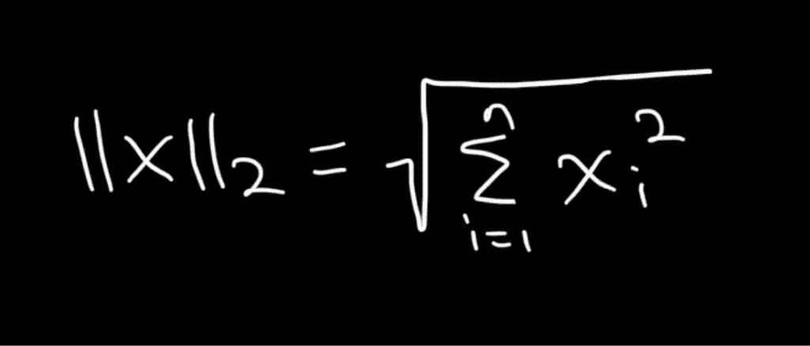

L2 规范 | 作者提供图片

如您所见，任何向量 x 的规范用双竖线表示，后面跟着数字 2，表示它是 L2 规范。这个规范通过取所有分量的平方和，然后计算该值的平方根来计算向量的幅度（长度）。

你可能听说过“欧几里得距离”，它基于欧几里得规范，但测量的是两个向量尖端之间的距离，而不是从原点到向量尖端之间的距离。[3]

### L1 规范

L1 规范，也称为曼哈顿规范或出租车规范，表示如下：

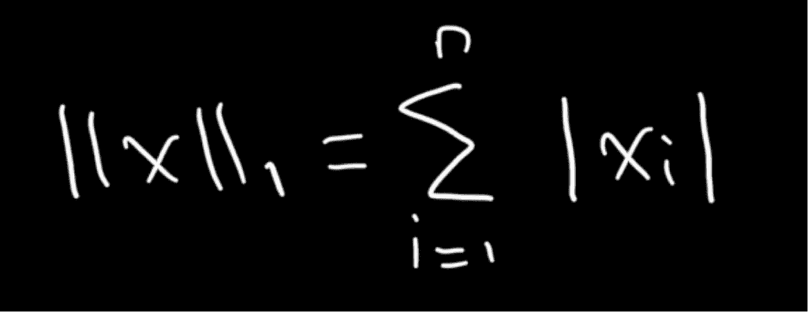

L1 规范 | 作者提供图片

范数再次由它周围的两个竖线表示，这次后面跟着一个 1，指定它是 L1 范数。

> *这种范数通过求和水平和垂直距离而不是对角线距离来以网格状方式测量距离。曼哈顿有一个网格状的城市结构，因此得名。*

[3]

### λ (Lambda)

**λ (Lambda)** 仅仅是用来控制惩罚输出的超参数。

你可以将其视为一个旋钮，它控制着模型过拟合和欠拟合之间的差异。

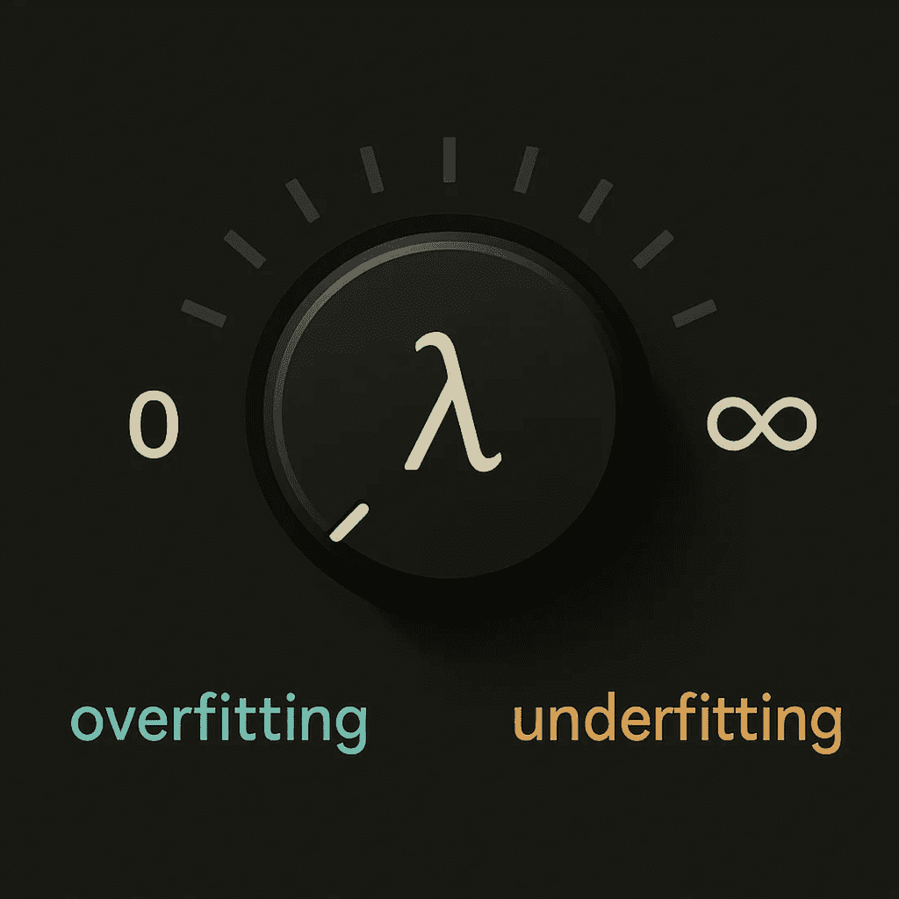

Image Generated using [ChatGPT 4o](https://chatgpt.com/)

+   **λ = 0** 将等同于将惩罚项设置为 0，导致没有正则化，过拟合保持不变。

+   **λ = ∞**，另一方面，会将所有权重缩小到接近 0，导致模型欠拟合，因为模型过于受限，无法学习任何有意义的内容。

由于 lambda 没有一个通用的值，你需要通过实验来设置它。通常，这个值的常见默认值可以是 0.01。你也可以尝试在对数尺度上尝试不同的值（…, 0.001, 0.01, 0.1, 1, 10, …, 等）

> *请注意，在即将到来的章节中的代码实现中，我在大多数地方都将 lambda 的值设置为 0。这仅仅是因为代码只用来展示如何实现惩罚。我避免使用任意值，因为它可能会被误解为标准或推荐默认值。*

### 如何应用惩罚？

对于一般的机器学习，我们几乎总是使用惩罚形式，因为它与基于梯度的优化方法配合得很好。尽管对于可视化惩罚，约束形式更易于理解，因此在下文中，当我们讨论图形表示时，我们将可视化惩罚的约束形式。

我们可以用两种形式来表示范数。惩罚形式和约束形式。

**惩罚形式：**在这里，我们通过向损失函数中添加成本来阻止向量位于指定的区域之外。

+   **数学上：**L = L + λ * ||w||

**约束形式：**在这里，我们定义了我们的最优向量必须严格位于其中的区域。

+   **数学上：**L 满足 ||w|| ≤ r

> *r 代表权重向量的最大允许范数。L 代表损失，w 代表权重向量。*

在我们的图形表示中，我们将查看具有系数 w₁ 和 w₂ 的参数向量的 2D 表示。

### 优化的图形直觉

当可视化优化时，我们首先需要可视化的是损失函数。当我们只有两个参数，w₁ 和 w₂ 时，这意味着我们的损失函数将在三维空间中绘制，其中 x 轴和 y 轴分别代表 w₁ 和 w₂，z 轴将代表损失函数的值。我们的目标是找到最低的损失，因为它将满足我们最小化成本函数的目标。

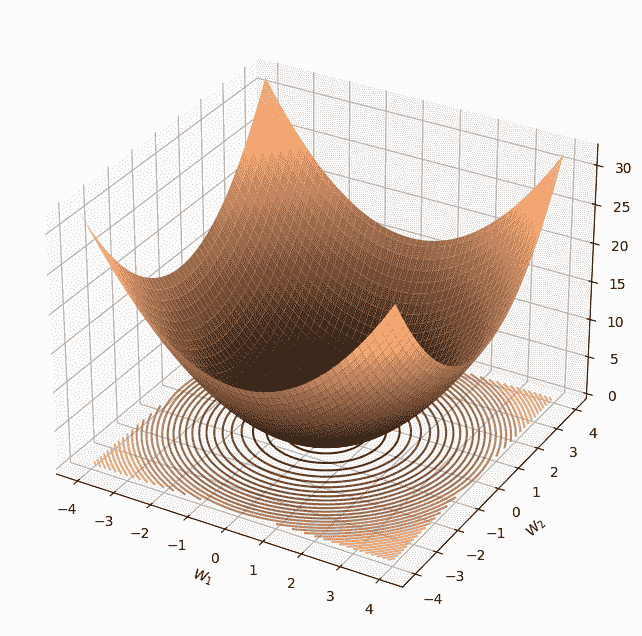

在三维中可视化损失函数 | 图片由作者提供

如果我们将上述 3D 图形在 2D 中可视化，我们会看到同心圆或椭圆，如上图所示，这些代表我们的等高线。这些等高线不过是优化空间中点创建的环。对于每个等高线，等高线内的所有点都会产生相同的损失值。

如果损失函数是凸函数（在我们的例子中，我们使用的是 MSE 损失函数，它是凸函数），全局最小值，即权重最优（成本最低）的点，将出现在等高线的中心（图上的最低点）。

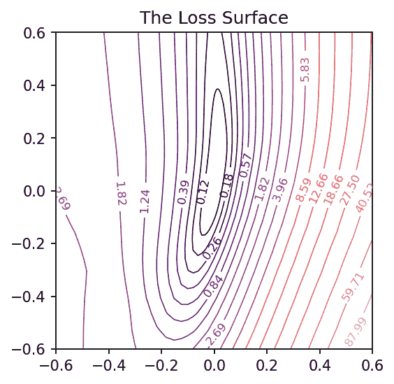

在二维中可视化损失函数 | 图片由 [Ryan Holbrook](https://mathformachines.com/) 提供 [4]

现在，在优化过程中，我们通常随机设置 w₁ 和 w₂ 的值。这个 w₁, w₂ 参数向量可以可视化为以 (0, 0) 为基点，以 (w₁, w₂) 为当前权重坐标的尖端。

重要的是要知道这只是为了直观理解，在现实中，它只是一个空间中的点。我们希望这个向量（空间中的点）尽可能接近全局最小值。

在每次优化步骤之后，这个随机初始化的点会在优化算法的引导下向全局最小值移动，直到最终收敛（达到全局最小值）。

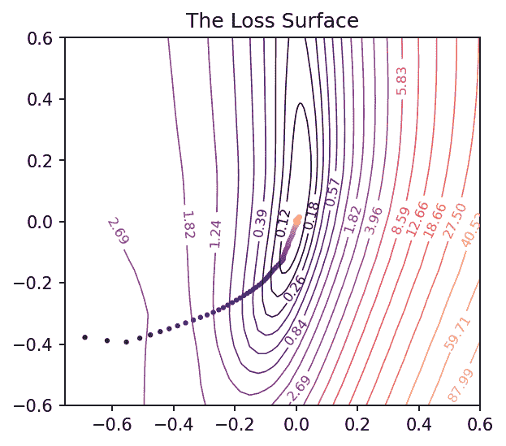

可视化优化路径 | 图片由 [Ryan Holbrook](https://mathformachines.com/) 提供 [4]

这个问题在于，有时在全局最小值处的这组权重可能是它们所训练的数据的最佳选择，但在处理新数据时可能表现不佳。这会导致过拟合，需要正则化。

在接下来的章节中，我们将探讨添加正则化如何影响我们可视化的图形直觉。

## L2 正则化（岭回归）

> *大多数关于正则化的资料都是先解释 L2 正则化（Tikhonov 正则化），主要是因为 L2 正则化更受欢迎且应用更广泛。*
> 
> *它在统计学和机器学习文献中比 L1 正则化存在的时间更长，L1 正则化是在稀疏建模技术出现后逐渐流行起来的（关于这一点稍后还会详细介绍）。*
> 
> *L2 正则化受欢迎的原因不仅在于其悠久的历史，还在于其能够平滑地缩小权重，在所有地方都是可导的（使其易于优化）以及其实施的简便性。*

### L2 惩罚项是如何从 L2 范数形成的

L2 正则化中的“L2”来自“L2 范数”。

要从 L2 范数形成 L2 惩罚项，我们首先将 L2 范数公式平方以去除平方根。原因如下：

+   重复计算平方根会增加计算开销。

+   移除它使得在梯度计算过程中求导更容易。

L2 正则化的目标不是计算距离，而是惩罚大的权重。权重的平方和足以做到这一点。在 L2 范数中，取平方根来表示实际距离。

这里是如何表示 L2 惩罚（L2 正则化）的：

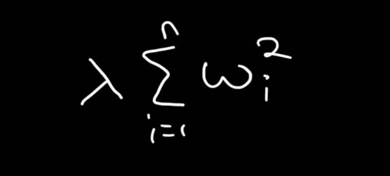

L2 惩罚 | 图片由作者提供

### L2 惩罚实际上在做什么？

L2 正则化通过向损失函数添加一个惩罚项来实现，该惩罚项与权重的平方成正比。这导致权重被轻轻推向 0。

权重越大，惩罚越大，推动力越强。权重实际上永远不会变成 0，而是趋向于 0。

这将在阅读梯度行为部分时变得更加清晰。

在深入例子之前，让我们首先详细理解惩罚项。

在这个项中，我们简单地计算每个权重的平方和，并将其乘以 lambda。

> *当我们对任何线性回归模型应用 L2 正则化时，这个模型被称为“岭回归”。*

### 有平方权重的好处是什么？

+   对较大的权重进行更重的惩罚

+   保持所有值都是正数

+   微分时的平滑函数。

### 数学表示

这里是如何将 L2 惩罚项添加到 MSE 损失函数中的表示：

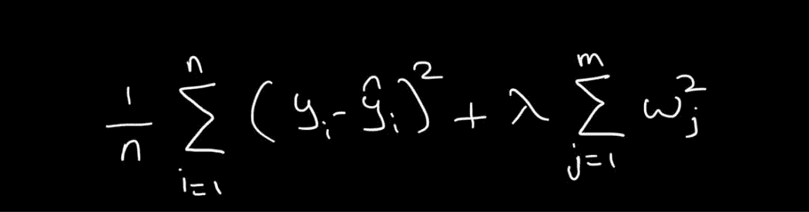

MSE + L2 Penalty | 图片由作者提供

其中，

+   n = 训练样本的总数

+   m = 权重的总数

+   y = 真实值

+   ŷ = 预测值

+   λ = 正则化强度

+   w = 模型权重

现在，在梯度下降过程中，我们求这个损失函数的导数：

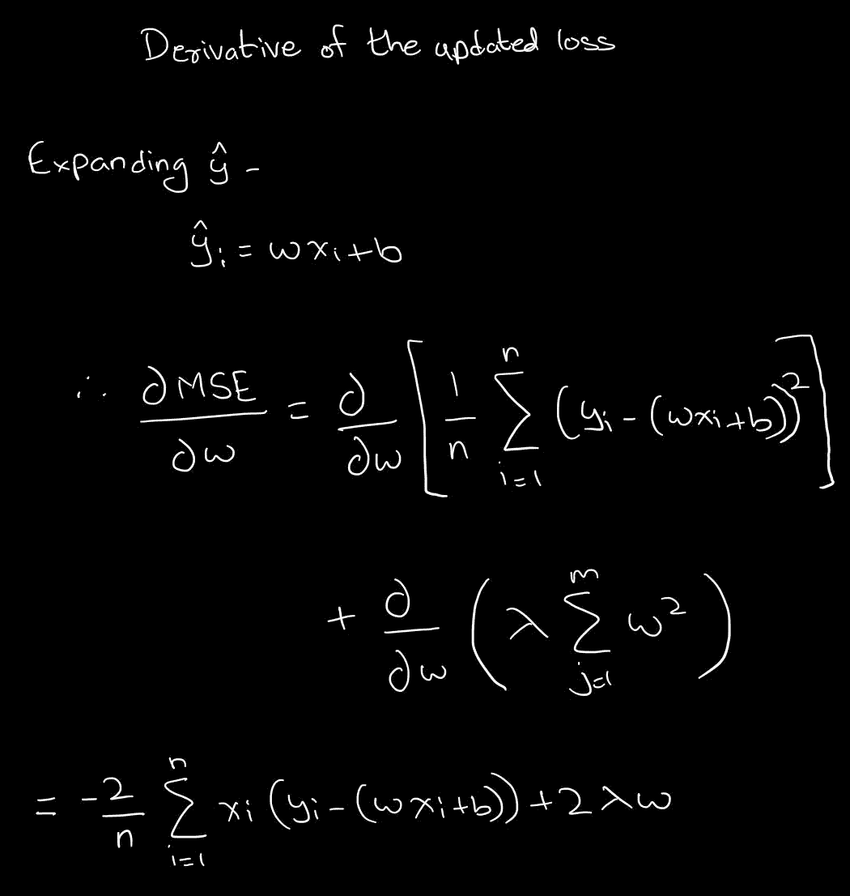

MSE + L2 Penalty | 图片由作者提供

由于我们对每个权重求导，因此为我们的每个权重添加了一个适当的大/小惩罚。

> *还重要的是要注意，一些公式在 L2 惩罚项中包括 1/2。这是纯粹出于数学上的方便。*
> 
> *在反向传播过程中，指数中的 2 和 1/2 相消，留下一个更干净的梯度 λw 而不是 2λw。然而，这种包含不是强制的。两种形式都是有效的，它们只是影响梯度的比例。*
> 
> *因此，除非相应地调整 λ，否则每个版本的输出都会有所不同。在实践中，更强的梯度（没有 1/2）意味着你可能需要一个更小的 λ，反之亦然。*

当你的权重很大时，梯度会更大。这告诉模型，“你需要调整这个权重，它造成了大的错误”。这样，模型会朝着正确的方向迈出更大的步伐，这使得学习更快。

### 图形表示

L2 正则化的约束形式表示为 w₁² + w₂² ≤ r²。

让我们考虑 r = 1，并且为了数学上的简单，考虑约束是 w₁² + w₂² = 1（而不是 ≤ 1）。

如果我们要绘制满足这个条件的所有向量，它们将形成一个圆：

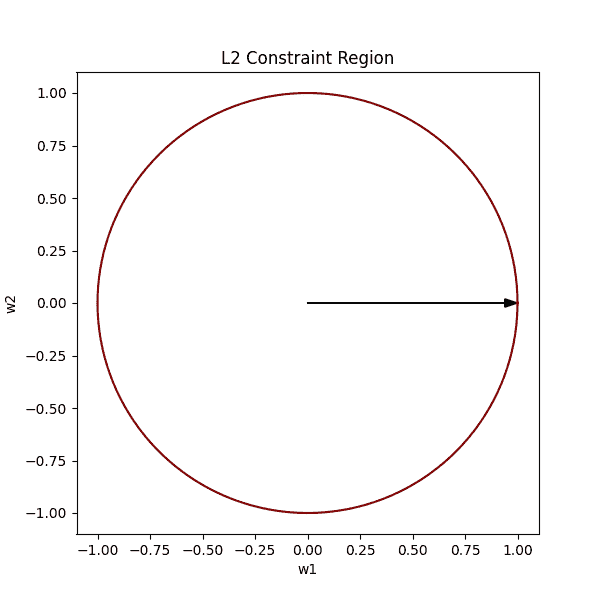

绘制 L2 约束区域 | 图像由作者提供

现在，考虑到我们的原始方程 w₁² + w₂² ≤ 1²，自然地，所有存在于这个圆范围内的向量都会满足我们的约束。

在前一个部分，我们看到了一个基本的优化流程是如何图形化的。现在，让我们看看如果我们对图引入一个 L2 约束，它会如何工作。

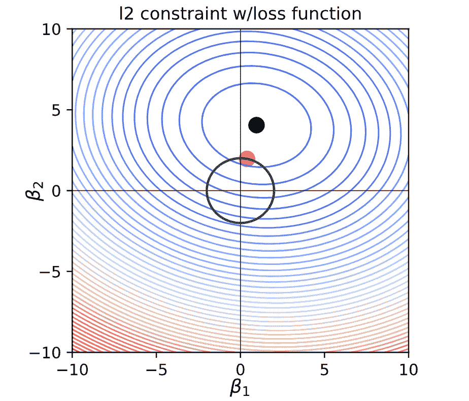

损失等高线 + L2 约束 | 图像由[Terence Parr](https://explained.ai/)提供，经许可 [5]

在损失函数中添加 L2 约束后，我们现在对权重向量有一个额外的期望（最初的期望是坐标应该尽可能接近全局最小值）。

我们希望最优向量始终位于 L2 约束区域（圆）的范围内。

在上面的图像中，粉红色的点是我们最优权重所在的位置。

为了找到最优向量，我们必须找到接近全局最小值且与我们的圆相交的最低等高线。这样我们就可以满足两个条件，即在圆的范围内，以及尽可能低（接近全局最小值）。

为了获得对这个概念的良好直观理解，你应该尝试在 3D 中可视化它会如何看起来。

尽管这里有一个小问题。在图表上，我们选择绘制等高线的数量。在有些情况下，最低圆和最低等高线的交点不会给我们最优向量。

你必须记住，在可视化的等高线之间有无限多的等高线。[5]

> *有可能全局最小值（无约束最小值）位于约束区域内。*

**稀疏性**

L2 不会创建很多稀疏性。这意味着 L2 惩罚很少会将其中一个参数精确地推到 0。

相反，L2 将权重平滑地缩小到 0。这导致非零系数。

**梯度行为**

L2 惩罚的梯度取决于权重本身。这意味着大权重会受到更高的惩罚，而小权重会受到较小的惩罚。因此，在训练过程中，即使权重非常小，它们受到的推动也会很小，不足以将权重精确地推到 0。

这导致了一个平滑、连续的更新（平滑梯度）。

### 代码实现

以下是在 NumPy 中表示 L2 惩罚的方式：

```py
# Calculating the L2 Penalty with NumPy

# Setting the regularisation strength (lambda)
alpha = 0.1

# Defining a weight vector
w = np.array([2.5, 1.2, 0.8, 3.0])

# Calculating the L2 penalty
l2_penalty = alpha * np.sum(w**2)
```

在 scikit-learn 中，L2 正则化在许多模型中默认添加。这是如何关闭它的方法：

检查“penalty”、“alpha”或“weight_decay”等参数。将它们设置为“0”或“none”将禁用正则化。

```py
# Removing Penalties on scikit-learn
from sklearn.linear_model import LogisticRegression
model = LogisticRegression(penalty="none")
```

> *你有没有想过为什么我们在 Python 中使用字符串而不是 None 关键字？*
> 
> *这是因为 scikit-learn 中的惩罚参数期望一个包含选项如 l1、l2、elasticnet 或 none 的字符串，让我们可以选择为我们的模型选择哪种类型的正则化。*

下面，你可以看到如何实现岭回归。由于这里的 alpha 设置为 0，这个模型将表现得与线性回归完全相同。

一旦设置了 alpha > 0 的值，模型将应用惩罚。

```py
# Implementing Ridge Regression with scikit-learn
from sklearn.linear_model import Ridge
model = Ridge(alpha=0)
```

> *注意：在 scikit-learn 中，“lambda”被称为“alpha”，因为 lambda 在 Python 中已经是一个保留关键字（用于定义匿名函数）。*
> 
> *数学上 → lambda.*
> 
> *在代码中 → alpha*
> 
> *注意：在数学上，我们称“学习率”为“α”（alpha）。在代码中，我们将学习率称为“lr”.*
> 
> *这些命名约定可能会令人困惑，因此了解它们之间的区别很重要。*

这是如何在 PyTorch 中使用随机梯度下降实现 L2 正则化的方法：

```py
# Implementing L2 Regularisation (Weight Decay) in Neural Networks with PyTorch
optimizer = torch.optim.SGD(model.parameters(), lr=0.01, weight_decay=0)
```

> *注意：当 L2 正则化应用于神经网络时，它被称为“权重衰减”，因为它直接添加到梯度下降步骤中，而不是损失函数中。*

### 将 L2 惩罚应用于我们的过拟合模型

之前，我们通过多项式回归模型查看了一个简单的过拟合示例。现在，是时候看看 L2 如何帮助我们正则化它了。

我们通过使用岭回归来应用 L2 惩罚，这与带有 L2 惩罚的线性回归相同。

```py
# Regularising an Overfitting Polynomial Regression Model with the L2 Penalty (Ridge Regression)
pipe = Pipeline([
    ("poly", PolynomialFeatures(degree=8)),
    ("ridge", Ridge(alpha=0.5))
])
```

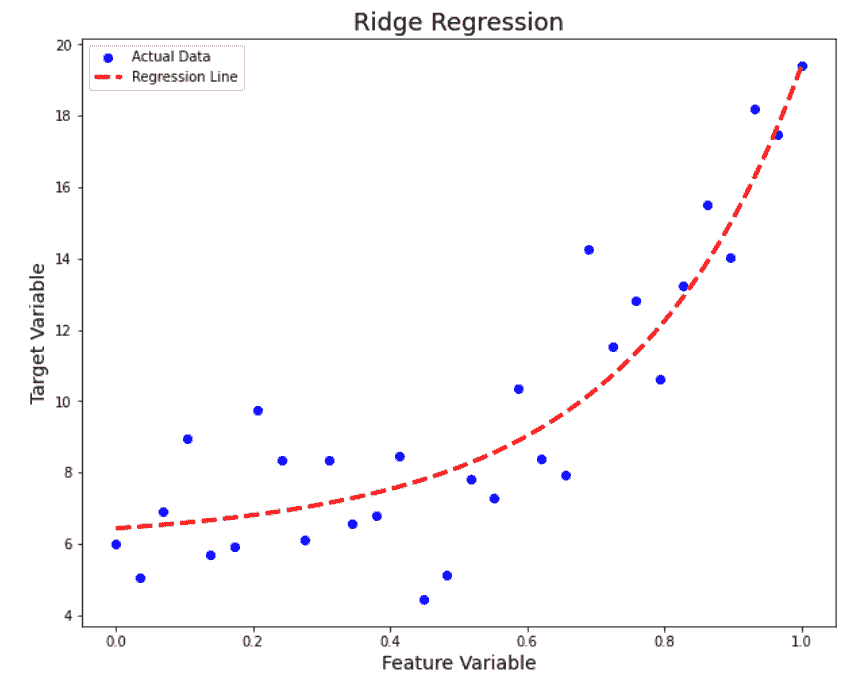

可视化正则化模型 | 图像由作者提供

显然，我们的新模型在防止数据过拟合方面做得很好。我们可以通过查看下面的训练和测试 MSE 值来确认结果。

+   **训练均方误差（MSE）：** 2.9305

+   **测试均方误差（MSE）：** 1.7757

模型现在在未见过的数据上产生了更好的结果，从而提高了泛化能力。

### 我们何时应该使用这个？

我们几乎可以使用 L2 正则化来为几乎任何模型和几乎任何损失函数进行正则化。你应该这样做吗？

可能不会。

每个模型都有自己的要求，可能从其他类型的正则化中受益。你何时应该考虑使用它？当怀疑模型过拟合时，线性/逻辑回归和神经网络等模型将其作为首选的第一选择。尽管如此，如果你的目标是引入稀疏性或消除无关特征，你可能想看看 L1 正则化或弹性网络，我们将在后面进一步讨论。

最终，这取决于你的问题、模型和数据集，所以绝对值得实验。

## L1 正则化（Lasso）

> *与 L2 正则化不同，L1 正则化（Lasso）在稀疏建模技术兴起后逐渐流行起来。L1 因其特征选择能力而受到欢迎。*
> 
> *L1 通过强制许多权重变为精确的 0 来鼓励稀疏性。由于它在 0 处不可微，因此 L1 在优化方面并不友好，但它已在高维问题中证明了其价值。*

### L1 惩罚是如何从 L1 范数形成的

正如 L2 正则化基于 L2 范数一样，L1 正则化基于 L1 范数。

L1 范数和 L1 惩罚的公式相同。唯一的区别是上下文。一个衡量大小，另一个在优化中应用惩罚。

这是如何表示 L1 惩罚的：

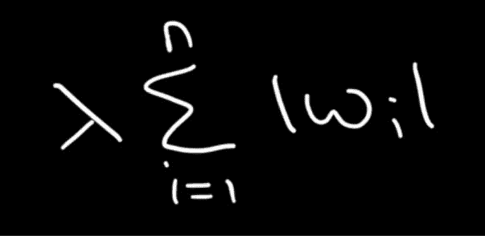

L1 惩罚 | 图像由作者提供

### L1 惩罚实际上在做什么？

我认为一个很好的可视化方法是想象 Lasso 惩罚就像一个牛仔，他们把绳索扔向很大的权重，把它们拉到 0。


使用 [ChatGPT 4o](https://chatgpt.com/) 生成的图像

更正式地说，L1 正则化通过向损失函数添加一个惩罚项来工作，该惩罚项与权重的绝对值成比例。

> *当我们应用 L1 正则化到任何线性回归模型时，这个模型就被称为“Lasso 回归”。Lasso 代表“最小绝对收缩和选择算子”。遗憾的是，它与绳索没有任何关系。*
> 
> ***最小 → **最小二乘损失（Lasso 最初是为使用最小二乘损失进行线性回归而设计的。然而，它并不局限于这一点，它可以与任何线性模型和任何损失函数一起使用。但严格来说，只有在应用于回归问题时才被称为“Lasso 回归”。)*
> 
> ***绝对** **收缩 → **该惩罚使用权重的绝对值。
> 
> ***选择算子 → **由于它将特征置零，从技术上讲，它正在进行特征选择。

### 它与 L2 惩罚有何不同？

+   L1 在 0 处没有平滑的导数

+   与 L2 不同，L1 将一些权重精确地推到 0

+   比 L2 收缩权重更有用，因为它可以将更多权重设置为 0

### 数学表示

这里是如何将 L1 惩罚项添加到 MSE 损失函数的表示：

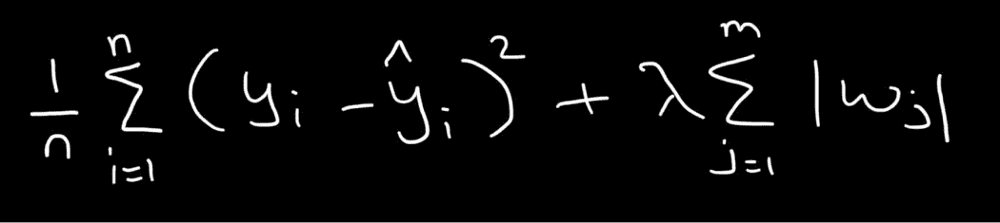

MSE + L1 惩罚 | 图像由作者提供

计算上述的导数：

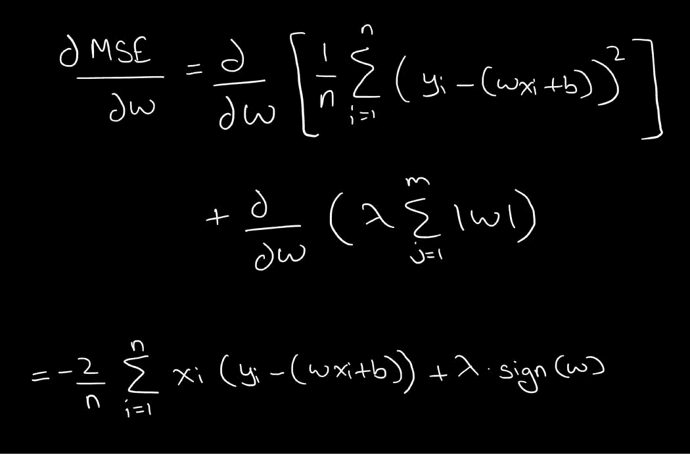

MSE + L1 惩罚的推导 | 图像由作者提供

### 图形表示

L1 正则化的约束形式表示为 |w₁| + |w₂| ≤ r。

就像我们对 L2 所做的那样，让我们考虑 r = 1 和方程 = 1 以简化数学。

如果我们要绘制满足此条件的所有向量，它们将形成一个菱形（技术上是一个旋转了 45⁰ 的正方形）：

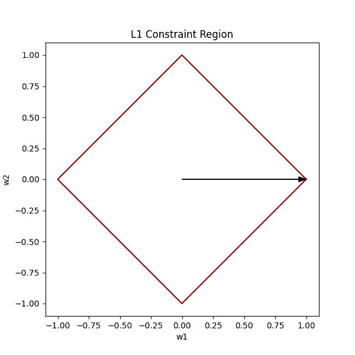

绘制 L1 约束区域 | 图像由作者提供

如您所见，与 L2 约束不同，L1 约束有尖锐的边缘和角落。我们菱形的角落位于轴上。

让我们看看它与损失函数一起看起来是什么样子：

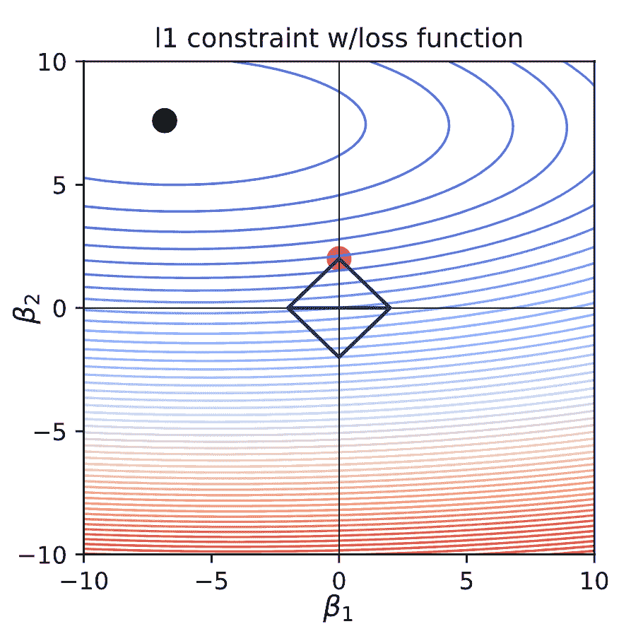

损失轮廓 + L1 约束 | 图像由 [Terence Parr](https://explained.ai/) 提供，经许可 [5]

**稀疏性**

对于这个 L1 约束，最低轮廓与约束区域的交点最有可能发生在角落之一。这些角落是其中一个权重恰好变为 0 的点。

这就是为什么我们说 L1 正则化会导致稀疏性。我们经常看到权重完全被推到 0。

这对于稀疏建模或特征选择非常有帮助。

**梯度行为**

如果我们绘制 L1 惩罚图，我们会看到一个 V 形图。这是因为我们取权重绝对值的梯度。

+   当 w > 0 时，梯度是 +λ

+   当 w < 0 时，梯度是 -λ

+   当 w = 0 时，梯度是未定义的，所以我们使用次梯度。

取次梯度意味着当 w = 0 时，梯度可以取 [-λ, +λ] 之间的任何值。次梯度（g）的值由优化器选择，通常在 w = 0 时选择 g = 0 以保持稳定性。

如果设置 w = 0 会增加损失，这表明该特征很重要，优化器可能会选择在这种情况下远离 0。

L1 和 L2 惩罚的梯度行为的关键区别在于，L2 的梯度是 2λw，并且依赖于 w 的值。

另一方面，当我们对 λ |w| 求导时，我们得到 λ * sign(w)，其中 sign(w) 对于 w > 0 是 +1，对于 w < 0 是 -1（在 w = 0 时 sign(w) 是未定义的，这就是为什么我们使用次梯度）。 

这意味着梯度不依赖于权重的值，并且总是产生指向 0 的恒定拉力。这使得许多权重正好跳到 0 并保持在那里。

### 代码实现

以下是在 NumPy 中表示 L1 惩罚的示例。

```py
# Calculating the L1 Penalty with NumPy

# Setting the regularisation strength (lambda)
alpha = 0.1

# Defining a weight vector
w = np.array([2.5, 1.2, 0.8, 3.0])

# Calculating the L1 penalty
l1_penalty = alpha * np.sum(np.abs(w))
```

在 scikit-learn 中，由于许多模型的默认惩罚是 L2，我们必须将其明确更改为使用 L1 惩罚。

```py
# Implementing the L1 Penalty with scikit-learn
from sklearn.linear_model import LogisticRegression
model = LogisticRegression(penalty="l1", solver="liblinear")
```

> *求解器是一种优化算法，它最小化损失函数（例如，梯度下降）。*

你可以看到，当我们使用 L1 惩罚时，我们指定了一个非默认求解器用于逻辑回归。这是因为默认求解器（lbfgs）不支持 L1，并且仅与 L2 一起工作。

可选地，你也可以使用 saga 求解器。

> *L1 正则化之所以不与 lbfgs 一起工作，是因为它在优化过程中期望损失函数能够平滑地微分。*
> 
> *你可能记得我们研究了 L2 和 L1 正则化的梯度 n，我们了解到 L2 在任何地方都是平滑且可微分的，而 L1 在 0 处则不是平滑可微分的。*
> 
> *另一方面，liblinear 在使用坐标下降处理 L1 正则化方面做得更好，这对于非平滑损失表面非常合适。*

如果你想要使用 alpha 来控制逻辑回归模型的正则化强度，你将不得不使用一个新的参数，称为 C，它不过是 Lambda 的倒数。

在 scikit-learn 中，回归模型使用 alpha 控制 lambda，而分类模型使用 C（即 1/λ）。

下面是如何实现 Lasso 回归的示例。

> *由于 alpha 值设置为 0，模型的行为类似于线性回归，因为没有应用 L1 正则化。*
> 
> *同样，当 alpha=0 时，岭回归也简化为线性回归。然而，Lasso 使用与岭回归不同的求解器，这意味着虽然两者在技术上执行普通最小二乘法，但由于求解器的差异，它们的结果可能并不相同。*

```py
# Implementing Lasso Regression with scikit-learn
from sklearn.linear_model import Lasso
model = Lasso(alpha=0)
```

重要的是要注意，在 Lasso 中将 alpha 设置为 0 是不推荐的，因为 scikit-learn 警告说这可能会导致数值不稳定性。

如果你旨在进行线性回归，通常直接使用 LinearRegression()而不是在 Lasso 或 Ridge 中将 alpha 设置为 0 会更好。

这就是如何将 L1 惩罚应用于神经网络的方式：

```py
# Implementing L1 Regularisation in Neural Networks with PyTorch

# Defining a simple model
model = nn.Linear(10, 1)

# Setting the regularisation strength (lambda)
alpha = 0.1

# Setting the loss function as MSE
criterion = torch.nn.MSELoss()

# Calculating the loss
loss = criterion(outputs, targets)

# Calculating the penalty
l1_penalty = sum(i.abs().sum() for i in model.parameters())

# Adding the penalty to the loss
loss += alpha * l1_penalty
```

在这里，我们定义了一个具有 10 个输入和一个输出的单层线性模型。损失函数设置为均方误差（MSE）。然后我们计算损失函数，计算 L1 惩罚并将其应用于损失。

### 将 L1 惩罚应用于我们的过拟合模型

现在，我们将通过将 Lasso 回归应用于我们之前看到的过拟合多项式回归模型示例来实现 L1 惩罚。

```py
# Regularising an Overfitting Polynomial Regression Model with the L1 Penalty (Lasso Regression)
pipe = Pipeline([
    ("poly", PolynomialFeatures(degree=8)),
    ("lasso", Lasso(alpha=0.1))
])
```

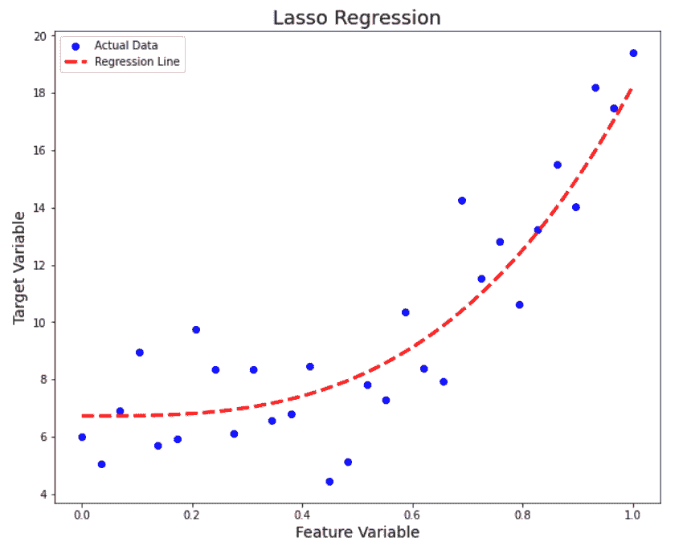

可视化正则化模型 | 图片由作者提供

显然，正则化模型表现良好，并且很好地解决了过拟合问题。我们可以通过查看以下训练和测试的 MSE 值来确认这一点：

+   **训练 MSE：** 2.8759

+   **测试 MSE：** 2.1135

### 我们何时应该使用这个？

在你当前的问题中，如果你怀疑许多特征都是不相关的，你可能想使用 L1 惩罚。这将导致一个稀疏模型，其中一些特征被完全忽略。

有时你可能想要一个稀疏模型，因为它会导致更快的推理，并且更容易解释。稀疏模型包含许多权重，这些权重正好为 0。

如果你有多重共线性问题，你也可以选择使用此模型。L1 将从一组相关特征中选择 1 个特征，其他特征将被忽略。

这种正则化有助于内置特征选择，你不需要手动进行。当你不知道哪些特征重要时，这非常有用。

## 弹性网络

现在你已经了解了 L1 和 L2 正则化，接下来自然要学习的是弹性网络，它结合了两种惩罚来正则化模型。

唯一的新事物是引入了一个“混合比例”，它控制 L1 和 L2 正则化之间的比例。

弹性网络因其“弹性网络”特性而得名，它在 L1 和 L2 之间取得平衡。

### 混合比例是什么？

混合比例就像两个元素之间的旋钮。r 的值始终在 0 和 1 之间。

+   r = 0 → 仅应用 L1 惩罚

+   r = 1 → 仅应用 L2 惩罚

考虑到我们用它来控制 A 和 B 之间的比例，它们的值分别为 15 和 20：

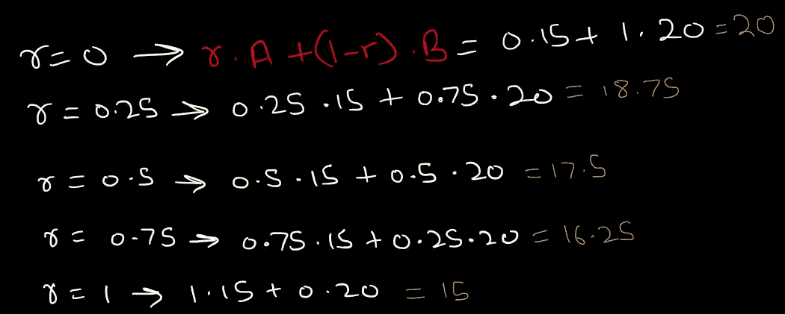

混合比例的工作原理 | 图片由作者提供

注意结果是如何逐渐从 B 转移到 A，与比例成正比。你可能注意到(1-r)被除以 2。

如果你对此感到困惑，请参考本博客的 L2 正则化部分，在那里你会看到关于一些表示法的注释，它们将 1/2 加到惩罚项（½ λ ∑ w²）上，以简化反向传播的数学并保持梯度干净。这是混合比例补全中的相同 1/2。

> 注意，这个 ½ 在数学上很整洁，但实际上并不必要。在代码实现中省略它是可以的。
> 
> 在 scikit-learn 中，混合比例被称为“l1_ratio”

### 数学表示

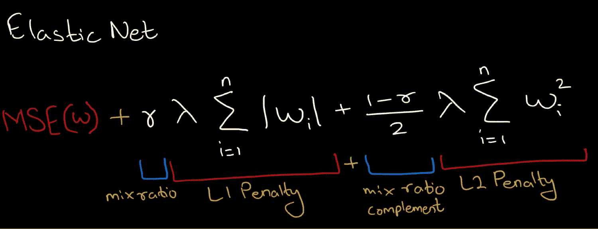

MSE + 弹性网络惩罚 | 图由作者提供

现在我们来计算这个损失 + 惩罚的导数：

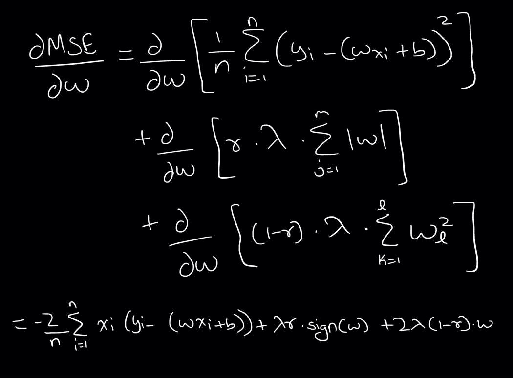

MSE + 弹性网络惩罚 | 图由作者提供

### 图形表示

弹性网络结合了 L1 和 L2 正则化的优点。这种结合不仅数学上成立，而且在图形上也有直观的解释。

弹性网络的约束形式在数学上表示为：

α ||w||₁ + (1-α) ||w||₂² ≤ r

其中 ||w||₁ 是 L1 部分，||w||₂² 是 L2 部分，α 是混合比例。（在这里用 α 表示以避免混淆，因为 r 已经被用来表示范数的最大允许值）

如果我们要可视化弹性网络的约束区域，它将看起来像是 L1 的菱形形状和 L2 的圆形形状的混合。

形状看起来如下：

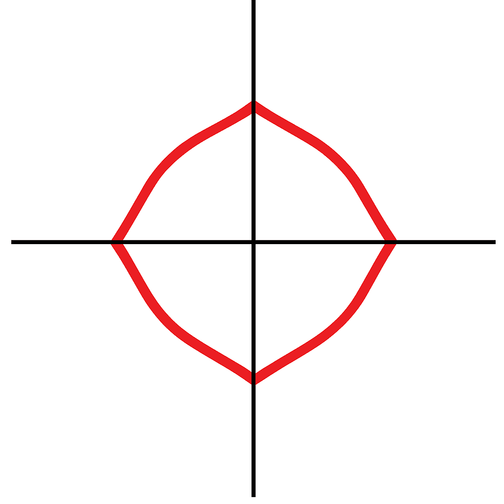

弹性网络约束区域 | 使用 [ChatGPT 4o](https://chatgpt.com/) 生成的图像

这里，就像 L1 和 L2 一样，最优向量位于约束区域和损失最低轮廓的交点处。

**稀疏性**

弹性网络确实促进了稀疏性，但它的攻击性不如 L1。L2 部分保持稳定，而 L1 部分仍然鼓励更小的模型。

**梯度行为**

当涉及到优化时，弹性网络的梯度是 L1 和 L2 梯度的加权总和。

L1 部分贡献了一个恒定的拉力，而 L2 部分贡献了一个平滑、与权重相关的拉力。

从数学上讲，梯度看起来是这样的：

gradient = λ₁ . sign(w) + 2 . λ₂. w

因此，权重通过 L2 被推向零，通过 L1 被迅速推向零。这两种方法的结合创造了一种更平衡和稳定的正则化行为。

### 代码实现

下面是 NumPy 中弹性网络惩罚的表示：

```py
# Calculating the ElasticNet Penalty with NumPy

# Setting the regularisation strength (lambda)
alpha = 0.1

# Setting the mix ratio
r = 0.5

# Defining a weight vector
w = np.array([2.5, 1.2, 0.8, 3.0])

# Calculating the ElasticNet penalty
e_net = r * alpha * np.sum(np.abs(w)) + (1-r) / 2 * alpha * np.sum(w**2)
```

注意，我们在这里将 (1–r) 除以 2，但这完全是可选的，因为它只是缩放输出。实际上，像 scikit-learn 这样的库默认不使用这个值。

要在 scikit-learn 中应用弹性网络，我们将惩罚设置为“elasticnet”，并将 l1_ratio（即混合比例）设置为 0.5。

```py
# Implementing the ElasticNet Penalty with scikit-learn
from sklearn.linear_model import LogisticRegression
model = LogisticRegression(penalty="elasticnet", solver="saga", l1_ratio=0.5)
```

注意，唯一适用于弹性网络的求解器是“saga”。之前我们讨论过，唯一适用于 L1 惩罚的求解器是 saga 和 liblinear。

由于弹性网络使用 L1 和 L2，我们需要一个可以处理这两种惩罚的求解器。Saga 有效地处理了非可微点和大规模数据集。

就像岭回归和 Lasso 回归一样，我们也可以将弹性网络作为一个独立的模型使用。

```py
# Implementing the ElasticNet Penalty with ElasticNet Regression in scikit-learn
from sklearn.linear_model import ElasticNet
model = ElasticNet(alpha=0, l1_ratio=0.5)
```

在 PyTorch 中，这种实现的原理与我们之前看到的 L1 惩罚实现类似。

```py
# Implementing ElasticNet Regularisation in Neural Networks with PyTorch

# Defining a simple model
model = nn.Linear(10, 1)

# Setting the regularisation strength (lambda)
alpha = 0.1

# Setting the loss function as MSE
criterion = torch.nn.MSELoss()

# Calculating the loss
loss = criterion(outputs, targets)

# Calculating the penalty
e_net = sum(l1_ratio * torch.sum(torch.abs(p)) + 
           (1 - l1_ratio) * torch.sum(p**2) 
           for p in model.parameters())

# Adding the penalty to the loss
loss += alpha * e_net
```

### 将 Elastic Net 应用于我们的过拟合模型

让我们看看 Elastic Net 在我们的过拟合模型上的表现。这里的 l1_ratio 是我们的混合比例，帮助我们控制 L2 和 L1 正则化之间的水平。

由于 l1_ratio 设置为 0.4，模型更多地利用 L2 惩罚而不是 L1。

```py
# Regularising an Overfitting Polynomial Regression Model with the Elastic Net Penalty (Elastic Net Regression)
pipe = Pipeline([
    ("poly", PolynomialFeatures(degree=8)),
    ("elastic", ElasticNet(alpha=0.1, l1_ratio=0.4))
])
```

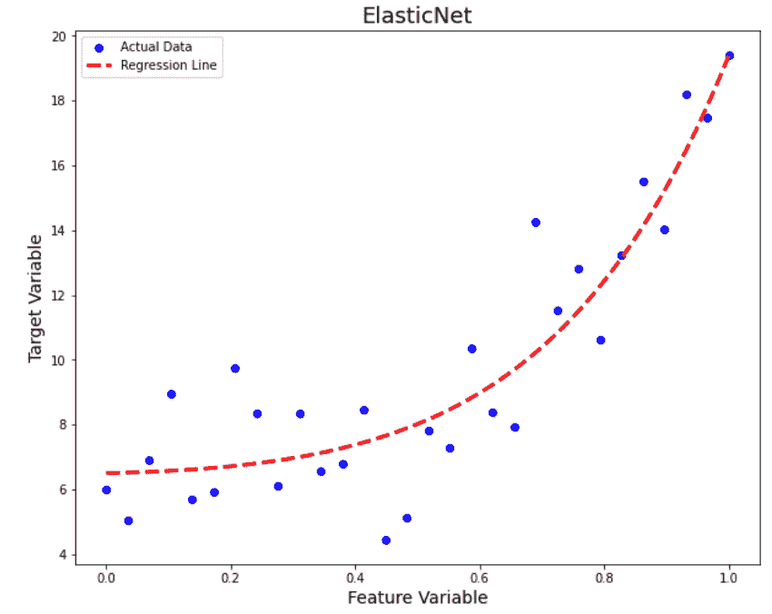

可视化正则化模型 | 图像由作者提供

上面的图表表明，Elastic Net 模型在提高泛化能力方面表现良好。

让我们通过查看训练和测试 MSE 值来确认它：

+   **训练均方误差（MSE）：** 2.8328

+   **测试均方误差（MSE）：** 1.7885

### 我们应该在何时使用这个？

一个常见的误解是 Elastic Net 总是比单独使用 L1 或 L2 更好，因为它同时使用两者。当 L1 过于激进而 L2 不够选择时，使用 Elastic Net 是好的。

它通常用于特征数量超过样本数量时，尤其是在特征高度相关或不相关时。

Elastic net 在深度学习中很少使用，你将主要在经典机器学习中找到它的应用。

## 惩罚总结

显然，所有三种惩罚（Ridge、Lasso 和 Elastic Net）的表现相当相似。这主要是因为我们用来展示这些惩罚效果的简单数据集和小规模。

此外，我想让你知道，这些示例并不是为了展示一种惩罚优于另一种。每种惩罚在不同的上下文中表现更好。这些示例的目的是仅展示这些惩罚的实施方式和它们如何帮助正则化过拟合模型。

要看到这些惩罚的完整效果，我们需要查看真实世界的数据。例如：

+   当所有特征都重要，即使是最小的，Ridge 将大放异彩。

+   当许多特征不相关时，Lasso 将表现良好。

+   最后，当 L1 和 L2 都不明显优于对方时，Elastic Net 将非常有用。

还需要注意的是，这些示例（alpha、l1_ratio）的超参数是手动选择的，可能不是这个数据集的最佳选择。这些结果是说明性的，而不是详尽的。

### 超参数调整

如何选择 alpha 和 l1_ratio 的正确值对于获得正则化模型的最佳系数值至关重要。而不是使用 GridSearchCV 的全面网格搜索或 RandomizedSearchCV 的随机搜索，scikit-learn 提供了方便的类来更快、更方便地调整正则化线性模型。

我们可以使用 RidgeCV、LassoCV 和 ElasticNetCV 来确定 Ridge、Lasso 和 Elastic Net 模型的最佳 alpha（以及 Elastic Net 的 l1_ratio）。

在处理多个超参数或时间及计算资源有限的情况下，使用 GridSearchCV 和 RandomizedSearchCV 将是更好的选择。

然而，当专门与线性正则化模型一起工作时，它们各自的 CV 类通常会提供最佳的超参数调整。

### 标准化

在应用正则化惩罚时，我们对权重施加的惩罚与特征的权重成比例，这样我们就会惩罚过大的权重。这样，模型不会依赖于任何单个特征。

这里的问题是，如果我们的特征尺度不相似，例如，一个特征的尺度从 0 到 1，而另一个特征的尺度从 1 到 1000。发生的情况是，模型会给较小尺度的特征分配更大的权重，以便它对输出的影响可以与其他具有较大尺度的特征相当。现在，当惩罚看到这一点时，它不会考虑特征的尺度，并且不公平地重罚了小尺度特征。

为了避免这种情况，当对模型应用正则化时，标准化特征至关重要。

> *我强烈推荐阅读 Terence Parr 在 explained.ai 上的“线性模型正则化的可视化解释”文章[5]。他的直观和直观的解释极大地帮助我加深了对 L1 和 L2 正则化的理解。*

* * *

## 基于训练过程的正则化技术

### Dropout

Dropout 是正则化深度神经网络最流行的方法之一。在这个方法中，在每次训练步骤中，我们会随机“关闭”或“丢弃”一部分神经元（不包括输出神经元），以减少模型对某些特征的过度依赖。

我认为[1]（第 300 页）中的这个类比相当不错。想象一下，一个公司里的员工每天早上都会抛硬币来决定是否来上班。


使用[ChatGPT 4o](https://chatgpt.com/)生成的图像

这将迫使公司传播关键知识，避免仅仅依赖一个人。同样，dropout 防止神经元过度依赖其邻居，使每个神经元都能承担自己的重量。

这导致了一个更具弹性的网络，其泛化能力更强。

> *每个神经元在每次训练步骤中有 p 的概率被丢弃。这个概率 p 是一个超参数，被称为“丢弃率”，通常设置为 50%。*

有时，人们将 dropout 称为稀释，但重要的是要注意，它们并不相同。相反，dropout 是一种稀释。

稀释是一个广泛的术语，涵盖了削弱模型或信号部分的技术。这可能包括丢弃输入或特征、缩小权重、抑制激活等。

### 深入了解 Dropout 的工作原理

**通用神经网络的工作原理**

1.  计算线性变换，即 z = w * x + b。

1.  将激活函数应用于线性变换的输出。

为了计算给定层（例如，层 1）的输出，我们需要前一层（层 0）的输出，它作为输入（x），以及与层 1 相关的权重和偏置（参数）。

这个过程在每一层中都会重复。下面是这个神经网络的样子：

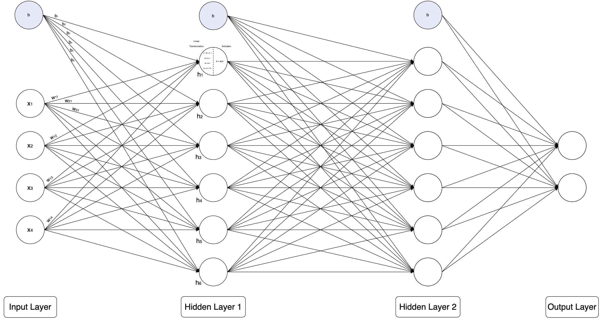

一个通用神经网络 | 使用 [draw.io](https://www.drawio.com/) 制作 | 作者图像

在这里，我们有 4 个输入特征（x₁ 到 x₄），第一隐藏层有 6 个神经元（h₁ 到 h₆）。神经网络中的每个神经元（除了输入层之外）都与一个单独的偏置相关联。

我们将偏置表示为 b1 到 b6，用于第一隐藏层：

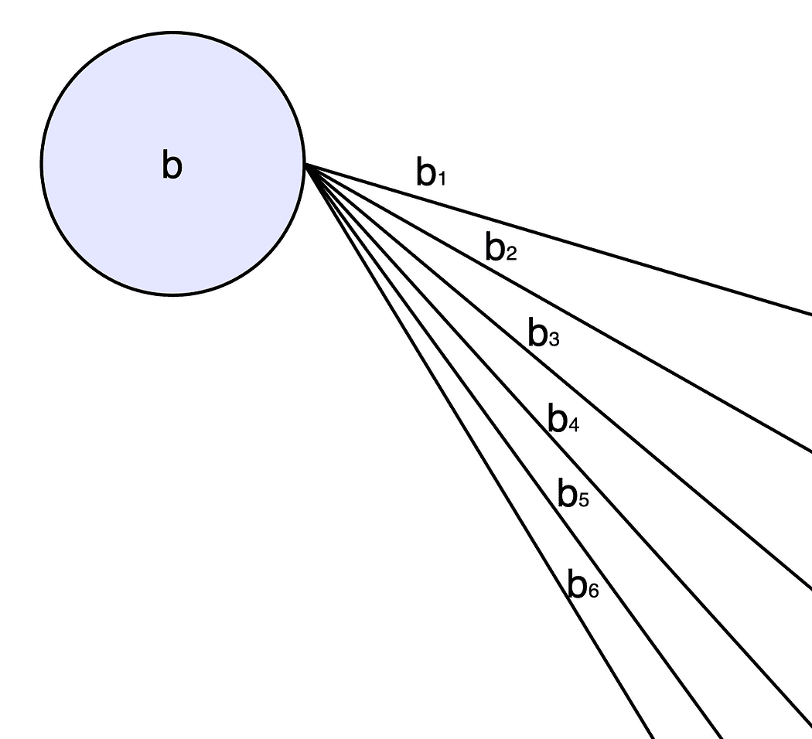

神经网络中的偏置 | 使用 [draw.io](https://www.drawio.com/) 制作 | 作者图像

权重以 wᵢⱼ 的格式书写，其中 i 指的是当前（目标）层中的神经元，j 指的是前一层（源）层中的神经元。

例如，当我们连接隐藏层 1 的神经元 1 到输入层 2 的神经元时，我们表示该连接的权重为 w₁₂，意味着“从神经元 2（前一层）流向神经元 1（当前层）的权重。”

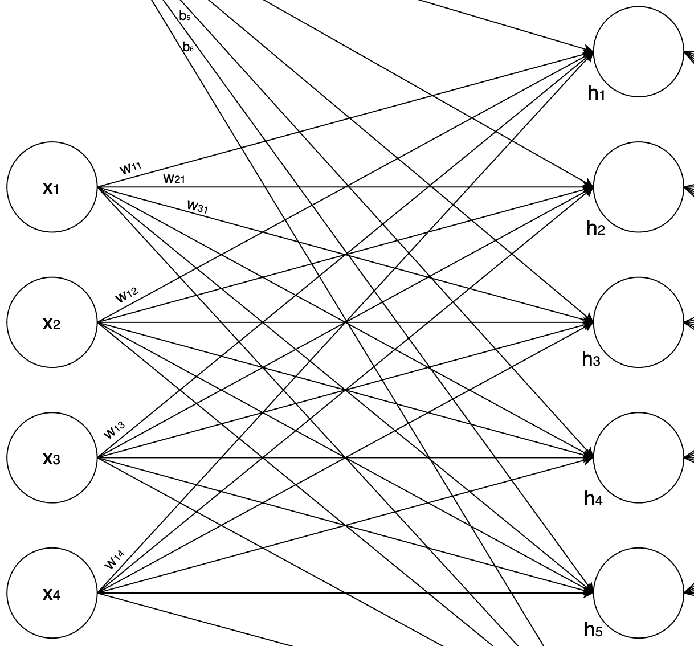

神经网络中的权重 | 使用 [draw.io](https://www.drawio.com/) 制作 | 作者图像

最后，在神经元内部，我们将有一个线性变换 z 和一个激活函数 ā，这是特定神经元的最终输出。它看起来是这样的：

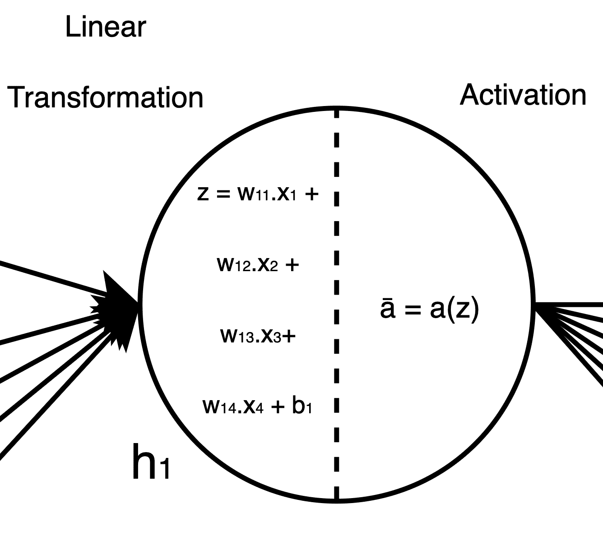

神经元内部 | 使用 [draw.io](https://www.drawio.com/) 制作 | 作者图像

**添加 Dropout 后会发生什么变化？**

在具有 dropout 的神经网络中，我们在流程中进行了轻微的更新。在每个输出之后，从第一个隐藏层开始，我们在其与下一层输入之间添加一个伯努利掩码。

想象一下：

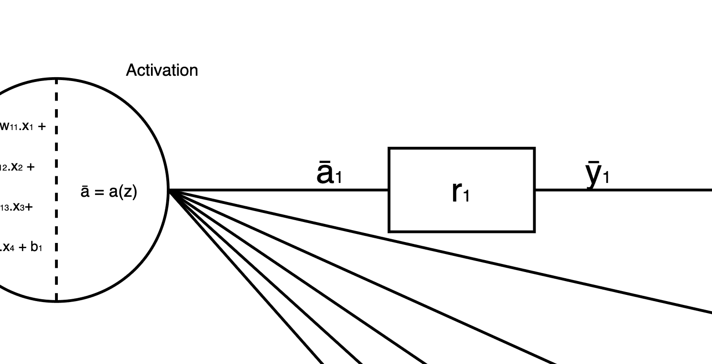

伯努利掩码 | 使用 [draw.io](https://www.drawio.com/) 制作 | 作者图像

如您所见，我们隐藏层 1 的第一个神经元的输出（ā₁）通过一个伯努利掩码（r），在这种情况下是一个单独的数字。这个输出的结果是 ȳ₁。

**伯努利掩码**

如您所见，我们在这之间有一个新的“r”掩码。现在 r 是一个从伯努利分布中采样的值向量（在每个前向传递中都会重新采样），所以基本上，这些值是 0 或 1。

我们将这个 r 向量（也称为伯努利掩码）逐元素乘以输出向量。这导致前一层输出的值要么变为 0，要么保持不变。

您可以通过以下示例了解它是如何工作的：

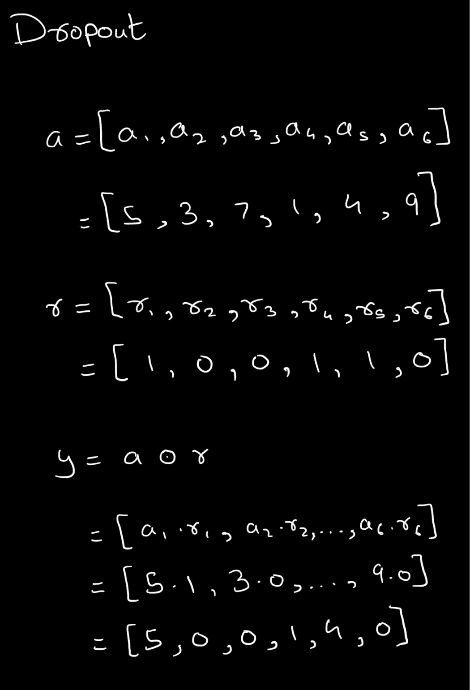

伯努利掩码的工作原理 | 作者图像

这里，a 是包含 6 个输出的输出向量。伯努利掩码 r 和输出向量 y 也将是大小为 6 的向量。y 将是进入隐藏层 2 的输入。

“关闭”的神经元不会对下一层做出贡献，因为当计算下一步的输出时，它们将是 0。

你可以如下看到那会是什么样子：

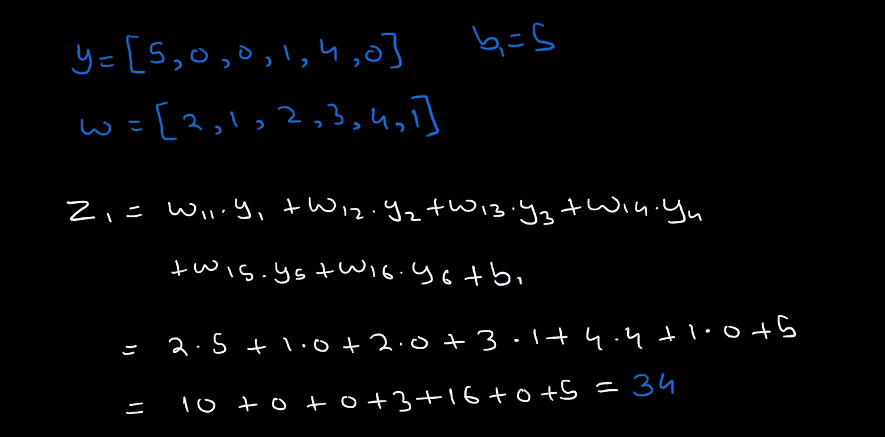

“关闭”神经元的零贡献 | 图像由作者提供

这背后的逻辑是，在每次训练步骤中，我们都在训练一个“精简”版本的神经网络。

这意味着每次我们随机丢弃一组神经元时，模型都会学习变得更加鲁棒，并在训练过程中不依赖于网络中的特定路径。

**这如何影响反向传播？**

在反向传播期间，我们使用与正向传递中相同的掩码。因此，具有掩码 1 的神经元接收梯度并像往常一样更新权重。尽管具有掩码 0 的丢弃神经元不会。

从数学上讲，如果我们有一个在正向传递期间输出为 0 的神经元，那么在反向传播期间的梯度也将是 0。这意味着在梯度下降步骤中：

w = w – α . 0

在这里，**α** 是“学习率”。上述计算导致 w 保持不变，没有任何更新。

这意味着权重保持不变，该神经元在该训练步骤中“跳过学习”。

**在哪里应用 Dropout**

重要的是要记住，我们不会对所有层应用 dropout，因为它可能会损害性能。我们通常在隐藏层应用 dropout。如果我们对输入层应用它，它可能会从原始输入特征中丢弃关键信息。

在输出层中丢弃神经元可能会在我们的输出中引入随机性。在小网络中，在输出前的一到两层应用 dropout 是一种常见的做法。在小网络中应用过多的 dropout 可能导致欠拟合。

在较大的网络中，你可能需要在多个隐藏层应用 dropout，尤其是在密集层之后，因为在这里过拟合的可能性更大。

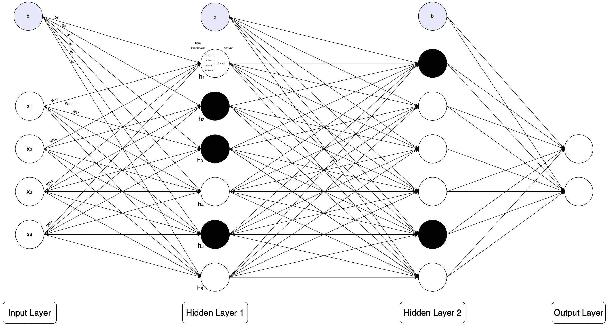

带有 Dropout 的通用神经网络 | 由 draw.io 制作 [draw.io](https://www.drawio.com/) | 图像由作者提供

上图是一个 dropout 神经网络的示例。dropout 神经元用黑色表示，这表示这些神经元是“关闭”的。

一些表示完全删除连接，表示该神经元是“不活跃”的。然而，我故意保留了这些连接，以便告诉你这些神经元的输出仍然像任何其他神经元一样被计算，并传递到下一层。

在实践中，神经元实际上并不是不活跃的，它像任何其他神经元一样经历完整的计算过程。唯一的区别是输出为 0，并且对后续层没有影响。

[13]

### 代码实现

```py
# Implementing Dropout with PyTorch

import torch
import torch.nn as nn

# This will create a dropout layer 
# It has a 50% chance of being dropped out for each neuron
dropout = nn.Dropout(p=0.5)

# Here we make a random input tensor
x = torch.randn(3, 5)

# Applying dropout to our tensor x
output = dropout(x)

print("Input Tensor:\n", x)
print("\nOutput Tensor after Dropout:\n", output)
```

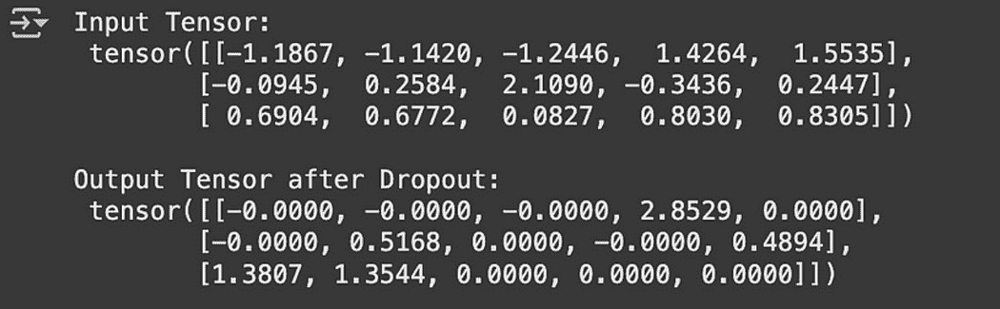

上述代码实现的结果 | 图像由作者提供

### 我们应该在什么时候使用这个？

当你在小/中等数据集上训练深度神经网络时，dropout 非常有用，因为在这种情况下过拟合是常见的。此外，如果神经网络有很多密集（全连接）层，模型无法泛化的可能性很高。

在这种情况下，dropout 将有效地减少神经元之间的相互依赖性，增加冗余性，并通过使模型更加鲁棒来提高泛化能力。

### 奖励

当我第一次学习 dropout 时，我总是想，“如果最终要将其设置为 0，为什么还要计算被丢弃神经元的输出和梯度下降呢？”我认为这是一种浪费时间计算的做法。但事实上，这样做有很好的理由，正如以下讨论的其他方法一样。

具有讽刺意味的是，跳过计算看起来很高效，但在 GPU 上却变得较慢。这是因为跳过单个神经元会使内存访问变得不规则，并破坏 GPU 并行计算的方式。因此，直接计算所有内容并在之后将其置零会更快。

话虽如此，研究人员已经提出了使 dropout 更有效率的更智能的方法：

例如，在随机深度（Huang 等人，2016）中，我们不是在训练期间丢弃随机神经元，而是丢弃整个残差块。这些是网络中通常执行一系列计算的全部分段。

通过在每次前向传递中随机跳过这些块，我们减少了训练期间的计算量。这不仅加快了速度，而且通过使模型学会即使某些层缺失也能表现良好，从而对模型进行了正则化。在测试时间，所有层都保留，因此我们得到了模型的全部力量。[14]

另一个想法是结构化 dropout，比如行 dropout，其中我们不是从激活矩阵中丢弃单个值，而是丢弃整个行或列。

可以将其视为一次关闭整个神经元组。这会在信号中产生更大的间隙，迫使网络依赖自身更多样化的部分，就像 dropout 一样，但更加结构化。

优点是，由于它不会创建混乱的随机零模式，因此更容易为 GPU 处理。这可以导致更快的训练和更好的泛化。[2]

### 提前停止

这是一个可以在 ML 和 DL 应用中使用的方法，无论你在哪里有一个迭代模型训练过程。

在这种方法中，我们的想法是，一旦模型的性能开始下降，就立即停止训练过程。

**ML 模型的迭代训练流程。**

1.  我们有一个模型，它不过是一个具有可学习参数（权重和偏差）的数学函数。

1.  参数被随机设置（有时我们可以有不同的策略来设置它们）。

1.  模型接收特征输入并做出预测。

1.  这些预测通过使用损失函数来计算误差并与训练集标签进行比较。

1.  我们使用误差来更新我们的参数。

这个完整周期被称为一次训练纪元。它会被重复多次，直到我们得到一个表现良好的模型。（如果我们使用批处理策略，当这个周期逐批应用于整个训练数据集时，一个纪元就完成了。）

通常，在每个纪元后，我们检查模型在单独的验证集上的性能，以查看模型泛化得如何。

在观察每个纪元后的性能后，我们希望看到损失（错误更少）在纪元中稳步下降。如果在训练的某个点后看到损失上升，这意味着模型已经开始过拟合。

使用提前停止，我们监控验证性能在一定数量的纪元内（这被称为“耐心”，是一个超参数）。如果模型在其耐心窗口内不再显示改进，我们就停止训练，然后回滚到具有最佳验证性能的模型检查点。

### 代码实现

在 scikit-learn 中，我们需要将 early_stopping 参数设置为 True，提供验证集的大小（0.1 表示验证集将是训练集的 10%），最后，我们设置耐心，使用 n_iter_no_change 这个名字。

```py
from sklearn.linear_model import SGDClassifier

model = SGDClassifier(early_stopping=True, validation_fraction=0.1, n_iter_no_change=5)
model.fit(X_train, y_train)
```

在这里，一旦模型停止改进，计数器就开始。如果接下来的 5 个连续纪元（由耐心参数定义）没有改进，训练就会停止，模型会回滚到具有最佳验证性能的检查点。

与 scikit-learn 不同，不幸的是，PyTorch 在其核心库中没有提供闪亮的内置函数来实现提前停止。

```py
# The following code has been taken from [6]
# Implementing Early Stopping in PyTorch
class EarlyStopping:
    def __init__(self, patience=5, delta=0):
        self.patience = patience
        self.delta = delta
        self.best_score = None
        self.early_stop = False
        self.counter = 0
        self.best_model_state = None

    def __call__(self, val_loss, model):
        score = -val_loss

        if self.best_score is None:
            self.best_score = score
            self.best_model_state = model.state_dict()
        elif score < self.best_score + self.delta:
            self.counter += 1
            if self.counter >= self.patience:
                self.early_stop = True
        else:
            self.best_score = score
            self.best_model_state = model.state_dict()
            self.counter = 0

    def load_best_model(self, model):
        model.load_state_dict(self.best_model_state)
```

### 我们何时应该使用这个？

提前停止通常与其他正则化技术（如权重衰减和/或 dropout）结合使用。当您不确定模型的最佳训练纪元数量，或者受限于时间或计算资源时，提前停止特别有用。

在这种情况下，提前停止将帮助您找到最佳模型，同时避免过拟合和不必要的计算。

## 最大范数正则化

最大范数是用于神经网络的一种流行的正则化技术（它也可以用于经典机器学习，但非常不常见）。

这种方法在优化期间发挥作用。在每个权重更新（例如，在每次梯度下降步骤中）之后，我们计算权重向量的 L2 范数。

如果这个范数的值超过一定值（最大范数值），我们就按比例缩小权重。这有助于减轻权重爆炸和过拟合。

我们在这里使用 L2 范数是因为它更均匀地缩放权重，并且是空间中向量实际几何大小的真实反映。权重向量的缩放使用以下公式进行：

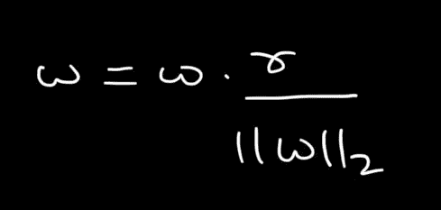

最大范数缩放公式 | 作者图片

在这里，r 是最大范数超参数。r 越低，正则化程度越高，即权重幅度减少越多。

### 数学示例

这个简单的例子展示了如何将新权重向量的幅度降低到 6（r），从而在我们的权重向量上实现正则化。

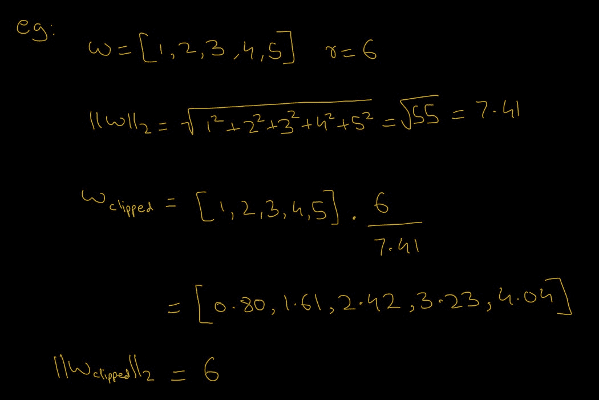

最大范数数学示例 | 图片由作者提供

### 代码实现

```py
# Implementing Max Norm with PyTorch
w = torch.tensor([1, 2, 3, 4, 5], dtype=torch.float32) # Weight vector
r = 6 # Max norm hyperparameter

norm = w.norm(2, dim=0, keepdim=True).clamp(min=r/2)
norm
```

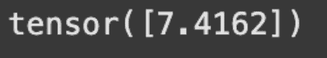

上述代码实现的结果 | 图片由作者提供

如我们所见，L2 范数与我们之前计算的结果相同。

w.norm(2) 指定我们想要计算权重向量 w 的 L2 范数。dim=0 将按列计算范数，keepdim 将保持输出维度的相同，这在后续操作中的广播很有帮助。

想知道 clamp 的作用吗？它就像我们的安全网。如果 L2 范数的值变得太低，它会在后续步骤中引起问题，所以如果范数值小于 r/2，它将被设置为 r/2。

在以下示例中，你可以看到，如果我们设置权重向量为 [1, 1]，范数小于 r/2，因此被设置为 3，即 r/2。

```py
# Implementing Max Norm with PyTorch
w = torch.tensor([1, 1], dtype=torch.float32) # Weight vector
r = 6 # Max norm hyperparameter

norm = w.norm(2, dim=0, keepdim=True).clamp(min=r/2)
norm
```

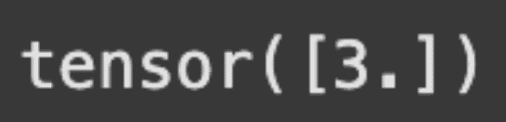

上述代码实现的结果 | 图片由作者提供

以下行确保只有当权重的 L2 范数超过 r 时才裁剪权重向量。

```py
# Clipping the weight vector only if the L2 norm exceeds r
desired = torch.clamp(norm, max=r)
desired
```

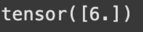

上述代码实现的结果 | 图片由作者提供

在这里，torch.clamp()起着至关重要的作用：

如果范数 > r → 期望值 = r

如果范数 ≤ r → 期望值 = 范数

这样，在最后一步计算期望值/范数时，结果要么是 r/norm，要么是 norm/norm，即 1。

注意当期望值小于最大值时，它是如何设置为范数的。

```py
desired = torch.clamp(norm, max=8)
desired
```

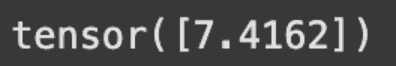

上述代码实现的结果 | 图片由作者提供

最后，我们将计算裁剪后的权重，因为我们的范数超过了 r。

```py
w *= (desired / norm)
w
```

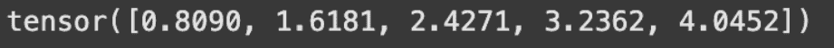

上述代码实现的结果 | 图片由作者提供

为了检查我们更新后的权重向量得到的答案，我们将计算其 L2 范数，它现在应该等于 r。

```py
# Implementing Max Norm with PyTorch
norm = w.norm(2)
norm
```

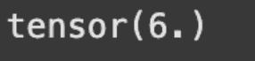

上述代码实现的结果 | 图片由作者提供

> 这段代码改编自[7]，并经过修改以更好地理解和匹配我们的示例。

### 我们何时应该使用这种方法？

当你处理需要裁剪的自然界外大的权重时，最大范数变得特别有用。这种情况在非常深的神经网络中经常出现，梯度爆炸可能会影响训练。

虽然 weight decay 等技术通过温和地推动大权重向 0 靠近来帮助，但它们是逐渐进行的。

最大范数施加了一个硬约束，立即将权重裁剪到固定阈值。这使得它在直接控制不自然的权重方面更加有效。

最大范数也常与 dropout 一起使用。dropout 随机关闭神经元，最大范数确保未被关闭的神经元不会过度补偿。这保持了学习过程中的稳定性。

## 批标准化（Batch Normalisation）

批标准化是一种归一化方法，最初并不是为了正则化。我将简要介绍这一点，因为它仍然正则化模型（作为副作用）并防止过拟合。

批标准化通过将每个小批量的激活输入进行归一化来工作。这涉及到计算批特定的均值和方差，然后使用可学习的参数γ（伽马）和β（贝塔）对激活进行缩放和偏移。

为什么？这是因为一旦我们计算出 z = wx + b，我们的线性变换，我们将应用归一化。这将改变 w 和 b 的值。

由于在整个批次中减去了均值，因此 b 变为 0，w 的尺度也发生了偏移。因此，为了保持我们网络的缩放和偏移能力，我们引入了γ（伽马）和β（贝塔），分别是缩放和偏移参数。

因此，每一层的输入保持一致的分布，这有助于加速训练并提高深度学习模型的稳定性。

批标准化最初是为了解决“内部协变量偏移”问题而开发的。尽管没有达成共识的定义，但内部协变量偏移基本上是指在神经网络层训练过程中激活分布变化的现象。

批标准化通过稳定层输入来帮助缓解这个问题，但后来的研究表明，这些好处也可能来自于平滑优化景观。

批标准化减少了需要使用 dropout 的需求，但它并不是 dropout 的替代品。

### 我们何时应该使用这种方法？

当我们注意到随着训练的进行，激活的内部分布发生偏移，或者当我们开始注意到模型容易受到梯度消失/爆炸的影响，并且收敛速度异常缓慢或不稳定时，我们会使用批标准化。

* * *

## 基于数据正则化技术

## 数据增强（Data Augmentation）

从数据中学习的算法面临一个关键缺陷。数据的数量、质量和分布可以显著影响模型的表现。

例如，在分类问题中，某些类别可能相对于其他类别代表性不足。这可能导致偏差或泛化不良。

为了解决这个问题，我们转向数据增强，这是一种通过修改或生成新数据来人工增加/平衡训练数据的技巧。

我们可以使用各种技术来完成这项工作，其中一些我们将在下面讨论。这作为一种正则化形式，因为它使模型接触到多样化的数据，从而鼓励通用模式并提高泛化能力。

## SMOTE

SMOTE（合成少数过采样技术）提出了一种通过添加合成示例来过采样少数数据的方法。

SMOTE 受到了在用于手写字符识别的训练数据上使用的一种技术的启发，他们通过旋转和倾斜图像来改变现有数据。这意味着他们直接在“输入空间”中修改了数据。

另一方面，SMOTE 采用更通用的方法，并在“特征空间”中工作。在特征空间中，数据由数值特征的向量表示。

**工作**

1.  为少数类中的每个样本找到 K 个最近的邻居。

1.  随机选择一个或多个邻居（取决于你需要多少过采样）。

1.  对于每个选定的邻居，计算当前样本的向量与该邻居的向量之间的差异。

1.  将这个差值乘以 0 到 1 之间的随机数，并将结果加到原始特征向量上。

这会在两个样本连接的线段上产生一个新的合成点。[8]

### 代码实现

我们可以通过使用**imbalanced-learn**库来实现这一点：

```py
# The following code has been taken from [9]
from imblearn.over_sampling import SMOTE

smote=SMOTE(sampling_strategy='minority') 
x,y=smote.fit_resample(x,y)
```

> *SMOTE 通常用于经典机器学习。以下两种技术更常用于深度学习，尤其是在图像分类中。*

### 我们何时应该使用这种方法？

我们在处理不平衡分类数据集时使用 SMOTE。当一个特定数据集在某个类别上数据非常少，且模型偏向多数类时，我们可以使用 SMOTE 来增强少数类的数据。

## Mixup

在这种方法中，我们线性组合两个随机输入图像及其标签。

如果你正在训练模型来区分百吉饼和可颂（抱歉，我饿了），你应该一次向模型展示一张图像，并附上清晰的标签，说明“这是一个可颂”。

虽然这对泛化并不好，相反，如果我们以 70-30 的比例将两种图像混合在一起，形成一个百吉饼和可颂的叠加混合体，并分配一个标签，比如“这是 0.7 百吉饼和 0.3 可颂。”

模型学会以百分比而不是绝对值进行推理，这有助于更好的泛化。

计算我们图像和标签的混合：

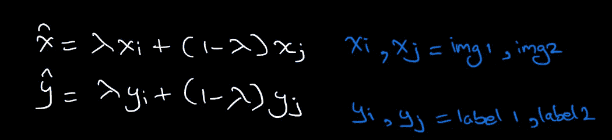

图像和标签混合的数学 | 图像由作者提供

> *此外，值得注意的是，大多数情况下标签都是独热编码的，所以如果百吉饼是[1, 0]，可颂是[0, 1]，那么 70%百吉饼和 30%可颂图像的混合标签将是[0.7, 0.3]。*

### 代码实现

```py
# Implementing Mixup with NumPy
from PIL import Image
import numpy as np
import matplotlib.pyplot as plt

# Loading the images
img1 = Image.open("bagel.jpg").convert("RGB").resize((128, 128))
img2 = Image.open("croissant.jpg").convert("RGB").resize((128, 128))

# Convert to NumPy arrays
# Dividing by 255 will normalise the pixel intensities into a [0, 1] range
img1 = np.array(img1) / 255.0
img2 = np.array(img2) / 255.0

# Mixup ratio
lam = 0.7

# Mixing our images together bsaed on the mixup ratio
mixed_img = lam * img1 + (1 - lam) * img2

# Plotting the results
fig, axes = plt.subplots(1, 3, figsize=(10, 4))

axes[0].imshow(img1)
axes[0].set_title("Bagel (Label: 1)")
axes[0].axis("off")

axes[1].imshow(img2)
axes[1].set_title("Croissant (Label: 0)")
axes[1].axis("off")

axes[2].imshow(mixed_img)
axes[2].set_title("Mixup\n70% Bagel + 30% Croissant")
axes[2].axis("off")

plt.show()
```

下面是混合图像的样貌：

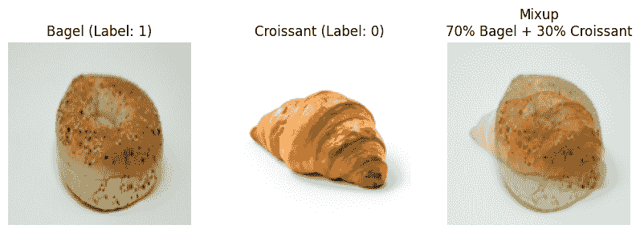

展示我们的 Mixup 图像 | 百吉饼照片由[Terrillo Walls](https://unsplash.com/@terrillo)在[Unsplash](https://unsplash.com/)提供| 可颂照片由[Personalgraphic.com](https://unsplash.com/@personal_graphic)在[Unsplash](https://unsplash.com/)提供| Mixup 图像由作者提供

### 我们何时应该使用这种方法？

当处理有限或噪声数据时，我们可以使用 Mixup，因为它不仅可以增加我们用于训练模型的数据量，而且还有助于我们使决策边界更加平滑。

当你的数据集中的类别不能明显分离或存在标签噪声时，在像“70%百吉饼，30%羊角面包”这样的标签上训练模型可以帮助模型学习更平滑、更鲁棒的决策表面。

## 裁剪

裁剪是一种正则化策略，通过在训练过程中随机掩码输入图像的方形区域来提高模型泛化能力。这迫使模型关注更广泛的特征范围，而不是对图像的特定部分过拟合。

在语言建模中，有一个类似的想法，称为掩码语言建模（MLM）。在这里，我们不是对图像的部分进行掩码，而是对句子中的随机标记进行掩码，模型被训练来根据周围上下文预测缺失的标记。

这两种技术通过保留输入的一部分并迫使模型填充空白，鼓励更好的特征学习和泛化。

### 代码实现

```py
# Implementing Cutout with NumPy
from PIL import Image
import numpy as np
import matplotlib.pyplot as plt

def apply_cutout(image, mask_size):
    h, w = image.shape[:2]
    y = np.random.randint(h)
    x = np.random.randint(w)

    y1 = np.clip(y - mask_size // 2, 0, h)
    y2 = np.clip(y + mask_size // 2, 0, h)
    x1 = np.clip(x - mask_size // 2, 0, w)
    x2 = np.clip(x + mask_size // 2, 0, w)

    cutout_image = image.copy()
    cutout_image[y1:y2, x1:x2] = 0
    return cutout_image

img = Image.open("cat.jpg").convert("RGB")
image = np.array(img)

cutout_image = apply_cutout(image, mask_size=250)

plt.imshow(cutout_image)
```

下面是如何逻辑上工作的代码：

+   我们检查图像的维度（h，w）

+   我们在图像上随机选择一个坐标（x，y）

+   使用掩码大小和我们的坐标，我们为图像创建一个掩码

+   这个掩码内所有像素的值都被设置为 0，形成一个裁剪

请注意，在这个例子中，我没有使用 lambda。相反，我为裁剪掩码设置了一个固定的大小。我们可以使用 lambda 来确定掩码的动态大小。

这将帮助我们有效地控制应用于模型的正则化水平。

例如，如果 lambda 设置得太高，整个图像可能会被掩码，防止模型有效学习。这将导致模型欠拟合。

另一方面，如果我们把 lambda 设置得太低，或者为 0，就没有有意义的正则化，模型会继续过拟合。

下面是一个裁剪图像的示例：


可视化我们的裁剪图像 | 猫照片由[Manja Vitolic](https://unsplash.com/@madhatterzone)在[Unsplash](https://unsplash.com/)上提供 | 裁剪图像由作者制作

### 我们应该在什么时候使用这个？

在图像识别的真实场景中，你可能会经常遇到一些主题的部分或特征视图被遮挡的图像。

例如，在一个面部识别系统中，你可能会遇到戴太阳镜或口罩的人。在这些情况下，对于模型能够根据部分视图识别主题变得非常重要。

这就是裁剪证明有用的地方，因为它在存在视图中障碍的图像上训练模型。这有助于模型通过多种定义特征而不是仅仅几个特征轻松地识别主题。

## CutMix

在 cutmix 中，我们不是像在 cutout 中那样仅仅遮挡图像的一个方块，而是用另一张图像的补丁替换了 cutout 方块。

这些补丁有助于模型理解不同的特征，以及特征的位置，这将增强其从部分视图识别图像的能力。

例如，如果一个模型在识别图像时只关注狗的鼻子，那么这可以被认为是过拟合。在没有明显狗鼻子的情境下，模型将无法识别图像中的狗。

但是，如果我们现在在模型中提供 cutmix 图像，模型将学习其他定义特征，如耳朵、眼睛等，以有效地识别狗。这将提高泛化能力并减少过拟合。

### 代码实现

```py
# Implementing CutMix with NumPy
def apply_cutmix(image1, image2, mask_size):
    h, w = image1.shape[:2]
    y = np.random.randint(h)
    x = np.random.randint(w)

    y1 = np.clip(y - mask_size // 2, 0, h)
    y2 = np.clip(y + mask_size // 2, 0, h)
    x1 = np.clip(x - mask_size // 2, 0, w)
    x2 = np.clip(x + mask_size // 2, 0, w)

    cutmix_image = image1.copy()
    cutmix_image[y1:y2, x1:x2] = image2[y1:y2, x1:x2]

    return cutmix_image

img1 = Image.open("cat.jpg").convert("RGB").resize((512, 256))
img2 = Image.open("dog.jpg").convert("RGB").resize((512, 256))

image1 = np.array(img1)
image2 = np.array(img2)

cutmix_image = apply_cutmix(image1, image2, mask_size=150)

plt.imshow(cutmix_image)
```

这里使用的代码与我们之前在 Cutout 中看到的是相似的。我们不是用黑色遮挡图像的一部分，而是用另一张图像的一部分来修补它。

再次，在这个当前示例中，我使用了固定的掩码大小。我们可以使用 lambda 来确定掩码的动态大小。

下面是一个 cutmix 图像的示例：


可视化我们的 CutMix 图像 | 狗的图片由[Alvan Nee](https://unsplash.com/@alvannee)在[Unsplash](https://unsplash.com/)上提供 | 作者的 CutMix 图像

### 我们何时应该使用这个方法？

Cutmix 在 Cutout 的概念基础上构建，不仅遮挡图像的部分，还用其他图像的补丁替换它们。

这使得模型更具上下文感知能力，这意味着模型可以识别主题的存在以及存在的程度。

这在处理多类图像识别任务时特别有用，在这些任务中，多个主题可以出现在同一张图像中，而模型必须能够区分这些主题的存在/不存在以及存在的程度。

例如，在人群中识别一张脸，或者在水果篮子里识别某种水果，而篮子里还有其他重叠的水果。

## 噪声注入

噪声注入是一种数据增强方法，涉及在训练过程中向输入数据或模型的内部层添加噪声，作为一种正则化方法，有助于减少过拟合。

这种方法对经典机器学习来说是可行的，但更广泛地应用于深度学习。

但是等等，我们提到过噪声数据集是过拟合的原因之一，因为模型学习了噪声……那么添加更多噪声是如何有帮助的呢？

当我最初学习这个主题时，这个矛盾让我感到困惑。

**这里有一个区别。**

模型中自然发生的噪声是不受控制的。这会导致过拟合，因为模型不应该学习这种噪声，因为它主要来自错误、异常值或不一致性。

我们添加到模型中以对抗过拟合的噪声是受控噪声。后者在训练期间临时添加到模型中。

这里有一个类比来巩固理解

想象你是一名篮球运动员，你的目标是得分最多。

**场景 A（未受控噪声）：**你在有缺陷的球场上训练。可能篮筐太小/太大/倾斜。地板有凹凸不平的地方，有不可预测的强风等等。

这使得你（模型）适应这个法庭并取得好成绩，尽管存在问题。但当比赛日来临时，你在完美的球场上表现不佳，因为你过度拟合了有缺陷的球场。

**场景 B（受控噪声）：**你从完美的球场上开始，但你的教练随机调暗灯光，吹起一阵微风来分散你的注意力，或者可能在你手上放重物。

这是以临时、可靠和稳定的方式进行。一旦你卸下这些权重，你将在现实世界的完美球场上表现出色。

**数据集大小、模型复杂度和信噪比。**

+   大型数据集可以处理少量噪声的影响。尽管较小的数据集甚至受到微小噪声的显著影响。

+   更复杂的模型更容易过拟合。它们可以轻易地记住数据中的噪声。

+   高信噪比需要更多的数据或更复杂的噪声处理策略来避免过拟合/欠拟合。

+   注入的噪声也必须得到控制，因为太少可能没有效果，太多可能会阻碍学习。

### 什么是噪声？

噪声是指数据中不可预测或不相关的变化。这些噪声数据点不代表数据中的实际模式。

下面是数据集中噪声的一些例子：

+   错别字

+   错误标记的数据（例如，将猫的照片标记为狗）

+   异常值（例如，在身高数据集中一个 8 英尺高的人）

+   波动（例如，由于某些新闻导致的股市突然价格飙升）

+   等等

### 噪声注入和噪声类型

噪声有不同的类型，其中大多数基于统计分布。在噪声注入中，我们根据需要将一种类型的噪声添加到我们模型的特定部分，这会对模型的学习和输出产生不同的影响。

*注意：在此背景下，“模型的部分”指的是 4 个部分，即输入、权重、梯度和激活。对于经典机器学习，我们主要关注向输入添加噪声。在深度学习应用中，我们只向其余部分添加噪声。*

+   **高斯噪声：**使用正态分布生成。这是在训练期间添加的最常见的噪声类型。它可以应用于模型的各个部分，并且非常灵活。

+   **均匀噪声：**使用均匀分布生成。这种噪声引入了一致的随机性。与偏好平均值附近的值的高斯分布不同。像高斯噪声一样，均匀噪声可以应用于模型的各个部分。

+   **泊松噪声：**使用泊松分布生成。在这里，更高的值导致更高的噪声。通常，仅在输入数据上使用。（你可以在模型的任何部分使用任何噪声，但某些组合可能不会带来任何好处，甚至可能损害性能。）

+   **拉普拉斯噪声：**使用拉普拉斯分布生成，其中峰值在均值处尖锐，尾部较重。这可以用于输入或激活。

+   **盐和胡椒噪声：**这是一种用于图像数据的噪声。这种噪声随机翻转像素值到最大（盐）或最小（胡椒）。这模拟了现实世界的问题，如传输错误或损坏等。这用于输入数据。

> 在某些情况下，也可以向模型的偏差添加噪声，尽管这不太常见。

### 噪声注入如何影响每个部分？

+   **输入：**向输入添加噪声使模型难以记住训练数据，并迫使它学习更一般的模式。当输入数据有噪声时很有用。

+   **权重：**对权重添加噪声防止模型过度依赖任何单个权重。这使得模型更加鲁棒，并提高了泛化能力。

+   **激活：**向激活添加噪声使模型能够理解更复杂和多样化的模式。

+   **梯度：**当噪声被引入优化过程时，模型难以收敛到单个解。这意味着模型可以逃离尖锐的局部最小值。

[10]

> 之前，我们探讨了神经网络中的 Dropout 正则化。这同样是一种噪声注入，因为它通过随机将神经元降至 0 来向网络引入噪声。

### 代码实现

**对输入：**

假设你的数据集是一个矩阵 X，为了向输入数据引入噪声，我们将创建一个与 X 形状相同的矩阵，并且这个矩阵的值将是来自你选择的分布的随机值：

```py
# Adding Noise to the Inputs
import numpy as np

# Adding Gaussian noise to the dataset X
gaussian_noise = np.random.normal(loc=0.0, scale=0.1, size=X.shape)
X_with_gaussian_noise = X + gaussian_noise

# Adjusting Uniform noise to the dataset X
uniform_noise = np.random.uniform(low=-0.1, high=0.1, size=X.shape)
X_with_uniform_noise = X + uniform_noise
```

**对权重：**

使用 PyTorch 向权重添加来自高斯分布的噪声：

```py
# Adding Noise to the Weights
# This code was adapted from [11]

import torch
import torch.nn as nn

# For creating a Gaussian distribution
mean = 0.0
std = 1.0
normal_dist = torch.distributions.Normal(loc=mean, scale=std)

# Creating a fully connected dense layer (input_size=3, output_size=3)
x = nn.Linear(3, 3)

# Creating noise matrix of the same size as our layer, filled by noise sampled from a Gaussian Distribution
t = normal_dist.sample((x.weight.view(-1).size())).reshape(x.weight.size())

# Add noise to the weights
with torch.no_grad():
    x.weight.add_(t)
```

**对梯度：**

在这里，我们向模型梯度添加高斯噪声：

```py
# Adding Noise to the Gradient
# This code was adapted from [12]

mean = 0.0
std = 1.0

# Compute gradient
loss.backward()

# Create noise tensor the same shape as the gradient and add it directly to the gradient
with torch.no_grad():
    model.layer.weight.grad += torch.randn_like(model.layer.weight.grad) * std + mean

# Update weights with the noisy gradient
optimizer.step()
```

**对激活：**

向激活函数添加噪声将涉及在激活函数（ReLU、sigmoid 等）之前向神经元的输入注入噪声。

虽然在理论上这似乎很简单，但我没有找到很多资源清楚地展示如何在实践中实现这一点。

我目前保留这个部分，一旦我对这个主题有了清晰的认识，我会重新访问。我非常欢迎任何在评论中的建议！

### 我们何时应该使用这种方法？

当你的数据集较小或噪声较多时，我们可以使用噪声注入通过帮助模型理解更广泛的模式来减少过拟合。

此方法与其他正则化技术一起使用，尤其是在将模型部署到现实世界情况中，其中噪声和不完善的数据明显时。

## 集成方法

集成方法，特别是 Bagging，在核心上不是正则化技术，但仍然作为副作用帮助我们正则化模型，类似于批量归一化。我会简要介绍这个话题。

在 Bagging 中，我们随机采样数据集的子集，然后在这些样本上分别训练模型。最后，我们将每个模型的单独结果结合起来得到一个最终结果。

例如，在分类任务中，如果我们对我们的数据集的五个等分部分训练五个分类器，出现频率最高的结果将被选为正确结果。在回归问题中，我们会取五个模型预测的平均值。

这在正则化中扮演什么角色呢？因为我们是在数据集的不同部分上训练模型，每个模型看到的数据部分都不同。它们并不都会捕捉到数据中的噪声或奇怪的模式，而是只有其中一些会。

当我们平均答案时，我们消除了随机过拟合。这减少了方差，稳定了模型，并间接防止了过拟合。

与此相反，提升法是通过逐步纠正错误来学习的，它改进了弱模型。每个模型都从上一个模型的错误中学习。结合在一起，它们构建了一个更智能的最终预测。

这个过程减少了偏差，如果过度使用，则容易过拟合。如果我们确保控制好模型每一步的步长，那么模型就不会过拟合。

## 关于欠拟合的简要说明

既然我们已经对过拟合有了很好的了解，那么在光谱的另一端，我们就有欠拟合。

我会简要介绍这一点，因为这不是本博客的主要主题或意图。

> 欠拟合是偏差的效果，这是由于模型过于简单，无法捕捉数据中的模式所引起的。

欠拟合的主要原因是：

+   一个非常基本的模型（例如，在复杂数据上使用简单线性回归）

+   训练不足。如果模型没有足够的时间去理解数据中的模式，它的表现将会很差，即使它完全有能力理解数据中的潜在趋势。就像告诉一个非常聪明的人用两天时间准备 GRE 考试。时间不够。

+   数据中没有包含重要特征。

+   过度正则化。（在基于惩罚的正则化部分中已涵盖细节）

所以这应该告诉你，要处理欠拟合，你应该首先考虑的是获得一个更复杂的模型。也许在你使用简单线性回归遇到困难的数据上使用多项式回归？

你还可以尝试更多的训练轮次/不同的学习率，这些都是你可以实验的超参数。

虽然要记住，如果你的模型一开始就太简单，这也不会有任何帮助。

## 结论

最终，正则化是关于在过拟合和欠拟合之间取得平衡。在本博客中，我们不仅探讨了直觉，还探讨了多种正则化技术的数学和实际实现。

虽然一些方法，如 L1 和 L2，通过惩罚直接正则化，但有些方法通过在模型中引入随机性来引入正则化。

无论你的模型大小和复杂性如何，了解这些技术背后的原因非常重要，这样你就不只是点击按钮，而是有效地选择正确的正则化技术。

重要的是要注意，这并不是一个详尽的指南，因为人工智能领域仍在呈指数级增长。本博客的目标是阐明核心技术，并鼓励你在模型中使用它们。

* * *

## 参考文献

1.  [*Géron, Aurélien. 《使用 Scikit-Learn、Keras 和 TensorFlow 的机器学习实践指南》. O’Reilly Media, Inc.，2017.*](https://www.oreilly.com/library/view/hands-on-machine-learning/9781492032632/)

1.  [赵等，2024 年（结构化 Dropout）赵明杰等. “重新审视结构化 Dropout.” *机器学习研究论文集*, 第 222 卷，2024 年，第 1-15 页.](https://arxiv.org/abs/2210.02570)

1.  [*Parul Pandey, 向量范数：快速指南，内置，2022*](https://builtin.com/data-science/vector-norms)

1.  [*Holbrook, Ryan. “可视化神经网络损失地形.” Math for Machines, 2020\. 访问日期：2025 年 5 月 5 日.*](https://mathformachines.com/posts/visualizing-the-loss-landscape/) <mdspan datatext="el1750099804375" class="mdspan-comment">(CC BY 4.0)</mdspan>

1.  [*Parr, Terence. “概念上正则化是如何工作的.” Explained.ai，2020 年\. 访问日期：2025 年 5 月 1 日.*](https://explained.ai/regularization/index.html)

1.  [*“如何在 PyTorch 模型中使用提前停止处理过拟合.” GeeksforGeeks，2024 年\. 访问日期：2025 年 4 月 4 日.*](https://www.geeksforgeeks.org/how-to-handle-overfitting-in-pytorch-models-using-early-stopping/)

1.  [*Thomas V. “关于‘如何正确实现原地最大范数约束？’的评论.” PyTorch 论坛，2020 年 9 月 18 日\. 访问日期：2025 年 4 月 19 日.*](https://discuss.pytorch.org/t/how-to-correctly-implement-in-place-max-norm-constraint/96769)

1.  [*Chawla, N. V., Bowyer, K. W., Hall, L. O., and Kegelmeyer, W. P. “SMOTE：合成少数类过采样技术.” 人工智能研究杂志，第 16 卷，2002 年，第 321-357 页.*](https://arxiv.org/abs/1106.1813)

1.  [*“使用 Python 进行不平衡分类的 SMOTE.” GeeksforGeeks，2024 年 5 月 3 日\. 访问日期：2025 年 4 月 10 日.*](https://www.geeksforgeeks.org/smote-for-imbalanced-classification-with-python/)

1.  [*Saturn Cloud. “噪声注入.” Saturn Cloud 术语表\. 访问日期：2025 年 4 月 15 日.*](https://saturncloud.io/glossary/noise-injection/)

1.  [*vainaijr. “对‘如何向网络的权重添加高斯噪声？’的评论” PyTorch 论坛，2020 年 1 月 17 日。访问日期：2025 年 4 月 12 日.*](https://discuss.pytorch.org/t/how-should-i-add-a-gaussian-noise-to-the-weights-of-network/66944/3)

1.  [*ptrblck. “对‘如何添加梯度噪声？’的评论” PyTorch 论坛，2022 年 8 月 4 日。访问日期：2025 年 4 月 13 日.*](https://discuss.pytorch.org/t/how-to-add-gradient-noise/158298)

1.  [斯里瓦斯塔瓦，尼蒂什，等人。“Dropout：防止神经网络过拟合的简单方法。”机器学习研究杂志，第 15 卷，2014 年，第 1929–1958 页。](https://www.cs.toronto.edu/~rsalakhu/papers/srivastava14a.pdf)

1.  [黄等，2016 年（随机深度）黄高，等人。“具有随机深度的深度网络。”*欧洲计算机视觉会议（ECCV）论文集*](https://arxiv.org/abs/1603.09382)

## 致谢

+   我想要感谢 Max Rodrigues 在审阅本博客的语气和结构方面提供的帮助。

+   在本博客中使用的工具包括 Python（Google Colab）、NumPy、Matplotlib 用于绘图、ChatGPT 4o 用于一些插图、Apple Notes 用于数学表示、draw.io/Lucidchart 用于图表和 Unsplash 用于股票图片。
