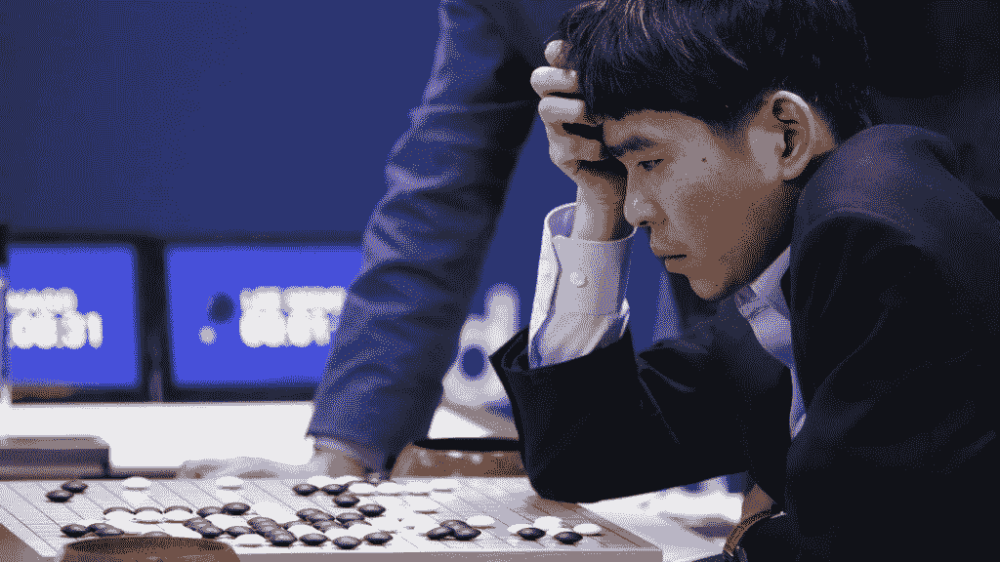
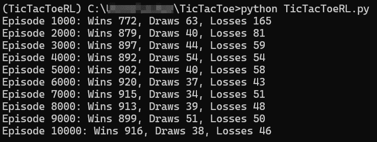
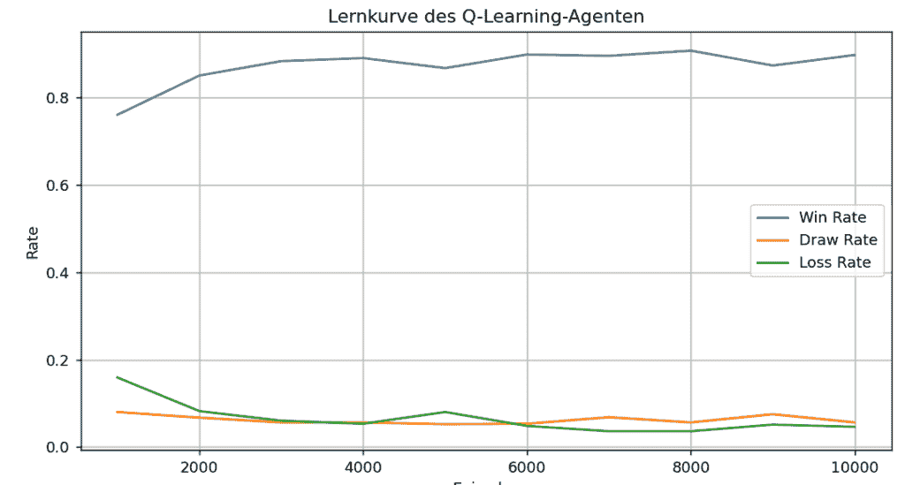

# 强化学习简单化：用 Python 构建 Q 学习智能体

> 原文：[`towardsdatascience.com/reinforcement-learning-made-simple-build-a-q-learning-agent-in-python/`](https://towardsdatascience.com/reinforcement-learning-made-simple-build-a-q-learning-agent-in-python/)

在<mdspan datatext="el1748372274608" class="mdspan-comment">2016 年 3 月</mdspan>，围棋世界冠军李世石面对的对手不是血肉之躯——而是代码行。

很快就变得很明显，人类已经输了。

最后，李世石以 4:1 输掉了比赛。

上周我再次观看了纪录片《AlphaGo》——并且再次觉得它非常引人入胜。

令人恐惧的是？AlphaGo 并非从数据库、规则或策略书中获得其比赛风格。

相反，它已经与自己进行了数百万次的对战——并在过程中学会了如何获胜。

第二场比赛的第 37 步是全世界都明白的时刻：这种人工智能不像人类那样玩游戏——它玩得更好。

AlphaGo 结合了监督学习、强化学习和搜索。其中令人着迷的部分是，其策略是通过与自己对战来学习的——使用强化学习来不断改进。

我们现在不仅将强化学习应用于游戏，还应用于机器人技术，例如抓取臂或家用机器人，在能源优化中，例如减少数据中心的能源消耗，或者在交通控制中，例如通过交通信号灯优化。

在现代智能体中，我们现在使用大型语言模型与强化学习（例如，从人类反馈中进行强化学习）相结合，使 ChatGPT、Claude 或 Gemini 等人工智能的回答更加人性化，例如。

在这篇文章中，我将向您展示它究竟是如何工作的，以及我们如何通过一个简单的游戏：井字棋，更好地理解其机制。

## 什么是强化学习？

当我们观察婴儿学习走路时，我们看到：它站起来，跌倒，再次尝试——并在某个时刻迈出了第一步。

没有老师教婴儿如何做。相反，婴儿通过尝试不同的动作，通过试错来学习走路——<mdspan datatext="el1748371147762" class="mdspan-comment">并学习</mdspan>。

当它能站立或走几步时，这对婴儿来说是一种奖励。毕竟，它的目标是能够走路。如果它跌倒了，就没有奖励。

这种试错和奖励的学习过程是强化学习（RL）背后的基本理念。

强化学习是一种学习方式，其中智能体通过与环境的交互来学习，哪些行为会导致奖励。

它的目标：在长期内获得尽可能多的奖励。

+   与监督学习相比，没有“正确答案”或标签。智能体必须自己找出哪些决策是好的。

+   与无监督学习相比，目标不是在数据中找到隐藏的模式，而是执行那些最大化奖励的行为。

## 强化学习智能体的思考、决策和学习方式

为了让 RL 智能体学习，它需要四样东西：它目前所在的位置（状态）的概念、它可以执行的操作（行动）、它想要实现的目标（奖励）以及它过去使用策略做得有多好（价值）。

一个智能体采取行动，获得反馈，并变得更好。

为了使这起作用，需要四样东西：

**1) 策略/策略**

这是智能体在特定状态下决定执行哪个行动的规则或策略。在简单情况下，这是一个查找表。在更复杂的应用中（例如，使用神经网络），它是一个函数。

**2) 奖励信号**

奖励是环境反馈。例如，胜利可以是+1，平局是 0，失败是-1。智能体的目标是尽可能多地收集尽可能多的奖励。

**3) 价值函数**

这个函数估计状态的预期未来奖励。奖励显示行动是“好”还是“坏”。价值函数估计状态有多好 — 不仅立即，而且考虑到智能体可以从该状态开始期望的未来奖励。因此，价值函数估计状态的长期利益。

**4) 环境模型**

模型告诉智能体：“如果我以状态 S 执行行动 A，我可能最终会进入状态 S′并获得奖励 R。”

然而，在无模型方法如 Q-learning 中，这并不是必要的。

## 利用与探索：第 37 步 — 我们可以从中学习到什么

你可能记得 AlphaGo 和李世石在第二局比赛中的第 37 步：

一个对我们人类来说看起来像错误的异常移动 — 但后来被誉为天才。



图片来自《AlphaGo》电影 | [完整的获奖纪录片](https://www.youtube.com/watch?v=WXuK6gekU1Y&t=8s) 在 YouTube 上

为什么算法会这样做？

计算机程序正在尝试一些新事物。这被称为探索。

强化学习需要两者：智能体必须在利用和探索之间找到平衡。

+   利用意味着智能体使用它已经知道的行动。

+   另一方面，探索是智能体第一次尝试的行动。它尝试这些行动，因为它们可能比它已经知道的行动更好。

智能体试图通过试错来找到最佳策略。

## 使用强化学习的井字棋

让我们看看一个超级知名的游戏中的强化学习。

你可能也作为孩子玩过这个游戏：井字棋。


自行可视化 — 来自 [unDraw.com](https://undraw.com/) 的插图。

游戏作为一个入门示例非常完美，因为它不需要神经网络，规则清晰，我们只需用一点 Python 就能实现这个游戏：

+   我们的智能体对游戏一无所知地开始。它就像人类第一次看到游戏一样开始。

+   代理逐渐评估每个游戏情况：得分为 0.5 意味着“我还不知道我是否会在这里获胜。”得分为 1.0 意味着“这种情况几乎肯定会导致胜利。”

+   通过参加许多比赛，代理观察哪些方法是有效的——并调整其策略。

目标？对于每一回合，代理应该选择导致最高长期奖励的动作。

在本节中，我们将逐步构建这样一个强化学习（RL）系统，并创建名为 TicTacToeRL.py 的文件。

*→ 你可以在本 [GitHub 仓库](https://github.com/Data-Science-Espresso/Reinforcement-Learning-TicTacToe) 中找到所有代码。*

### 1. 构建游戏环境

在强化学习中，代理通过与环境的交互来学习。它确定状态是什么（例如，当前棋盘），允许哪些动作（例如，你可以下注的地方）以及动作的反馈是什么（例如，如果你赢了，奖励为 +1）。

理论上，我们将此设置称为马尔可夫决策过程：一个模型由状态、动作和奖励组成。

首先，我们创建一个 TicTacToe 类。这个类管理游戏板，我们将其创建为一个 3×3 的 NumPy 数组，并管理游戏逻辑：

+   `reset(self)` 函数开始新游戏。

+   `available_actions()` 函数返回所有空闲的方格。

+   `step(self, action, player)` 函数执行一个游戏动作。在这里，我们返回新的状态、奖励（1 = 胜利，0.5 = 平局，-10 = 无效动作）和游戏状态。在这个例子中，我们用 -10 重重惩罚无效动作，以便代理能够快速学会避免它们——[这是小型强化学习环境中的常见技术](http://incompleteideas.net/book/the-book.html)。

+   `check_winner()` 函数检查玩家是否有三行 X 或 O，因此获胜。

+   使用 `render_gui()` 我们使用 matplotlib 将当前棋盘显示为 X 和 O 图形。

```py
import numpy as np
import matplotlib
matplotlib.use('TkAgg')
import matplotlib.pyplot as plt
import random
from collections import defaultdict

# Tic Tac Toe Spielumgebung
class TicTacToe:
    def __init__(self):
        self.board = np.zeros((3, 3), dtype=int)
        self.done = False
        self.winner = None

    def reset(self):
        self.board[:] = 0
        self.done = False
        self.winner = None
        return self.get_state()

    def get_state(self):
        return tuple(self.board.flatten())

    def available_actions(self):
        return [(i, j) for i in range(3) for j in range(3) if self.board[i, j] == 0]

    def step(self, action, player):
        if self.done:
            raise ValueError("Spiel ist vorbei")

        i, j = action
        if self.board[i, j] != 0:
            return self.get_state(), -10, True

        self.board[i, j] = player
        if self.check_winner(player):
            self.done = True
            self.winner = player
            return self.get_state(), 1, True
        elif not self.available_actions():
            self.done = True
            return self.get_state(), 0.5, True

        return self.get_state(), 0, False

    def check_winner(self, player):
        for i in range(3):
            if all(self.board[i, :] == player) or all(self.board[:, i] == player):
                return True
        if all(np.diag(self.board) == player) or all(np.diag(np.fliplr(self.board)) == player):
            return True
        return False

    def render_gui(self):
        fig, ax = plt.subplots()
        ax.set_xticks([0.5, 1.5], minor=False)
        ax.set_yticks([0.5, 1.5], minor=False)
        ax.set_xticks([], minor=True)
        ax.set_yticks([], minor=True)
        ax.set_xlim(-0.5, 2.5)
        ax.set_ylim(-0.5, 2.5)
        ax.grid(True, which='major', color='black', linewidth=2)

        for i in range(3):
            for j in range(3):
                value = self.board[i, j]
                if value == 1:
                    ax.plot(j, 2 - i, 'x', markersize=20, markeredgewidth=2, color='blue')
                elif value == -1:
                    circle = plt.Circle((j, 2 - i), 0.3, fill=False, color='red', linewidth=2)
                    ax.add_patch(circle)

        ax.set_aspect('equal')
        plt.axis('off')
        plt.show()
```

### 2. 编程 Q-Learning 代理

接下来，我们定义学习部分：我们的代理

它决定在特定状态下执行哪个动作以获得尽可能多的奖励。

代理使用经典的强化学习算法 Q-learning。为每个状态和动作的组合存储一个 Q 值——该动作的估计长期效益。

最重要的方法包括：

+   使用 `choose_action(self, state, actions)` 函数，代理在每种游戏情况下决定是选择一个已知很好的动作（利用）还是尝试一个尚未充分测试的新动作（探索）。

    这个决策基于所谓的 ε-greedy 方法：

    以 ε = 0.1 的概率，代理选择一个随机动作（探索），以 90% 的概率（1 – ε）选择基于其 Q 表的当前最佳已知动作（利用）。

+   使用 `update(state, action, reward, next_state, next_actions)` 函数，我们根据动作的好坏以及之后发生的情况调整 Q 值。这是代理的核心学习步骤。

```py
# Q-Learning-Agent
class QLearningAgent:
    def __init__(self, alpha=0.1, gamma=0.9, epsilon=0.1):
        self.q_table = defaultdict(float)
        self.alpha = alpha
        self.gamma = gamma
        self.epsilon = epsilon

    def get_q(self, state, action):
        return self.q_table[(state, action)]

    def choose_action(self, state, actions):
        if random.random() < self.epsilon:
            return random.choice(actions)
        else:
            q_values = [self.get_q(state, a) for a in actions]
            max_q = max(q_values)
            best_actions = [a for a, q in zip(actions, q_values) if q == max_q]
            return random.choice(best_actions)

    def update(self, state, action, reward, next_state, next_actions):
        max_q_next = max([self.get_q(next_state, a) for a in next_actions], default=0)
        old_value = self.q_table[(state, action)]
        new_value = old_value + self.alpha * (reward + self.gamma * max_q_next - old_value)
        self.q_table[(state, action)] = new_value
```

* * *

在我的[*Substack*](https://sarahleaschrch.substack.com/)上，我定期撰写关于科技、Python、数据科学、机器学习和 AI 领域的已发布文章的摘要。如果你感兴趣，可以查看或订阅。

***

### 3. 训练智能体

实际的学习过程从这一步开始。在训练过程中，智能体通过试错进行学习。智能体玩了很多游戏，记住哪些动作效果良好——并调整其策略。

在训练过程中，智能体学习其动作如何被奖励，其行为如何影响后续状态，以及长期内更好的策略如何发展。

+   使用函数`train(agent, episodes=10000)`，我们定义智能体与一个简单的随机对手进行 10,000 场比赛。在每个回合中，智能体（玩家 1）移动，然后是对手（玩家 2）。每次移动后，智能体通过`update()`进行学习。

+   每 1000 场比赛我们保存有多少胜利、平局和失败。

+   最后，我们使用 matplotlib 绘制学习曲线。它显示了智能体随时间如何改进。

```py
# Training mit Lernkurve
def train(agent, episodes=10000):
    env = TicTacToe()
    results = {"win": 0, "draw": 0, "loss": 0}

    win_rates = []
    draw_rates = []
    loss_rates = []

    for episode in range(episodes):
        state = env.reset()
        done = False

        while not done:
            actions = env.available_actions()
            action = agent.choose_action(state, actions)

            next_state, reward, done = env.step(action, player=1)

            if done:
                agent.update(state, action, reward, next_state, [])
                if reward == 1:
                    results["win"] += 1
                elif reward == 0.5:
                    results["draw"] += 1
                else:
                    results["loss"] += 1
                break

            opp_actions = env.available_actions()
            opp_action = random.choice(opp_actions)
            next_state2, reward2, done = env.step(opp_action, player=-1)

            if done:
                agent.update(state, action, -1 * reward2, next_state2, [])
                if reward2 == 1:
                    results["loss"] += 1
                elif reward2 == 0.5:
                    results["draw"] += 1
                else:
                    results["win"] += 1
                break

            next_actions = env.available_actions()
            agent.update(state, action, reward, next_state2, next_actions)
            state = next_state2

        if (episode + 1) % 1000 == 0:
            total = sum(results.values())
            win_rates.append(results["win"] / total)
            draw_rates.append(results["draw"] / total)
            loss_rates.append(results["loss"] / total)
            print(f"Episode {episode+1}: Wins {results['win']}, Draws {results['draw']}, Losses {results['loss']}")
            results = {"win": 0, "draw": 0, "loss": 0}

    x = [i * 1000 for i in range(1, len(win_rates) + 1)]
    plt.plot(x, win_rates, label="Win Rate")
    plt.plot(x, draw_rates, label="Draw Rate")
    plt.plot(x, loss_rates, label="Loss Rate")
    plt.xlabel("Episodes")
    plt.ylabel("Rate")
    plt.title("Lernkurve des Q-Learning-Agenten")
    plt.legend()
    plt.grid(True)
    plt.tight_layout()
    plt.show() 
```

### 4. 棋盘可视化

使用主程序“if name == ”main“:”，我们定义程序的起点。它确保当我们执行脚本时，智能体的训练会自动运行。我们使用`render_gui()`方法将 TicTacToe 棋盘显示为图形。

```py
# Hauptprogramm
if __name__ == "__main__":
    agent = QLearningAgent()
    train(agent, episodes=10000)

    # Visualisierung eines Beispielbretts
    env = TicTacToe()
    env.board[0, 0] = 1
    env.board[1, 1] = -1
    env.render_gui()
```

### 终端执行

我们将代码保存在文件[TicTacToeRL.py](http://TicTacToeRL.py)中。

在终端中，我们现在导航到存储我们的[TicTacToeRL.py](http://TicTacToeRL.py)文件的相应目录，并使用命令“python TicTacToeRL.py”执行文件。

在终端中，我们可以看到在每个 1000 个回合后我们的智能体赢得了多少场比赛：



作者截图

在可视化中，我们看到学习曲线：



作者截图

## 最后的想法

在 TicTacToe 中，我们使用一个简单的游戏和一些 Python——但我们很容易看到强化学习是如何工作的：

+   智能体开始时没有任何先验知识。

+   它通过反馈和经验发展策略。

+   它的决策逐渐改进，这是由于学习的结果——不是因为它知道规则，而是因为它在学习。

在我们的例子中，对手是一个随机智能体。接下来，我们可以看到我们的 Q 学习智能体如何对抗另一个学习智能体或我们自己。

强化学习表明，机器智能不仅通过知识或信息创造——而是通过经验、反馈和适应。

## 你在哪里可以继续学习？

+   [书籍 - 强化学习：入门，作者 Richard S. Sutton & Andre G. Barto](http://incompleteideas.net/book/the-book.html)

+   [DataCamp 博客 - 使用 Gymnasium 进行强化学习：实用指南](https://www.datacamp.com/tutorial/reinforcement-learning-with-gymnasium)

+   [《智能代理的工业应用：强化学习》一书 – P. Winder 著](https://dokumen.pub/reinforcement-learning-industrial-applications-of-intelligent-agents-1098114833-9781098114831.html)
