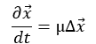
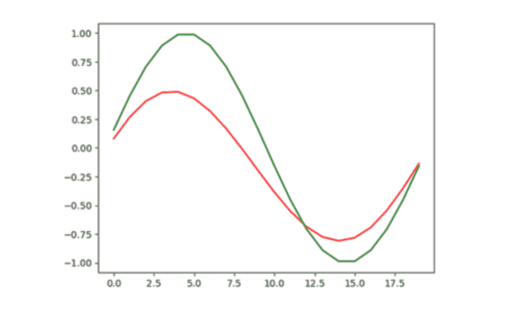
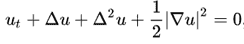
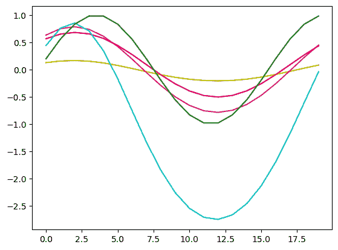

# 偏微分方程与强化学习

> 原文：[`towardsdatascience.com/reinforcement-learning-with-pdes/`](https://towardsdatascience.com/reinforcement-learning-with-pdes/)

之前我们讨论了通过在体育馆中集成常微分方程（ODEs）来应用强化学习。常微分方程是一种强大的工具，可以描述广泛的系统，但仅限于单一变量。偏微分方程（PDEs）涉及多个变量的导数的微分方程，可以覆盖更广泛的范围和更复杂的系统。通常，常微分方程是应用于偏微分方程的特殊情况或特殊假设。

偏微分方程包括麦克斯韦方程（控制电和磁）、纳维-斯托克斯方程（控制飞机、发动机、血液和其他情况下的流体流动）以及热力学的玻尔兹曼方程。偏微分方程可以描述系统，如[柔性结构](https://www.sciencedirect.com/science/article/pii/0022247X85900435)、[电网](https://dl.acm.org/doi/pdf/10.1145/337292.337359)、[制造](https://ieeexplore.ieee.org/document/4392493)或[流行病学](https://arxiv.org/html/2405.12938v3)模型。它们可以代表高度复杂的行为；纳维-斯托克斯方程描述了急流山溪的涡流。它们捕捉和揭示现实世界系统更复杂行为的能力使这些方程成为研究的重要主题，无论是描述系统还是分析已知方程以发现关于系统的新的发现。整个领域（如流体动力学、电动力学、结构力学）可以致力于研究单一组偏微分方程。

这种增加的复杂性伴随着成本；由偏微分方程捕获的系统分析和控制要困难得多。常微分方程也被描述为集中参数系统，描述它们的各个参数和变量被“集中”在一个离散点（或对于耦合的常微分方程系统，是少数几个点）。偏微分方程是分布式参数系统，它跟踪空间和时间中的行为。换句话说，常微分方程的状态空间是一个相对较小的变量数，例如时间和特定点的几个系统测量值。对于偏微分方程/分布式参数系统，状态空间的大小可以接近无限维度，或者为了计算而离散化为每个时间步数数百万个点。集中参数系统根据少数传感器控制发动机的温度。偏微分方程/分布式参数系统将管理整个发动机的温度动态。

与常微分方程（ODEs）一样，许多偏微分方程（PDEs）必须通过建模和仿真来分析（除了特殊情况）。然而，由于维度更高，这种建模变得更加复杂。许多 ODEs 可以通过直接应用 MATLAB 的 ODE45 或 SciPy 的`solve_ivp`等算法来解决。PDEs 在网格或网格上建模，其中 PDE 在每个网格点被简化为代数方程（例如通过泰勒级数展开）。网格生成是一个领域，一种科学和艺术，理想的（或可用的）网格可以根据问题几何和物理有很大差异。网格（以及因此问题状态空间）可以数以百万计的点，计算时间可能长达数天或数周，而 PDE 求解器通常是成本高达数万美元的商业软件。

控制 PDEs 比控制 ODEs 更具挑战性。构成许多经典控制理论基础的拉普拉斯变换是一种一维变换。尽管在 PDE 控制理论方面取得了一些进展，但该领域并不像 ODE/集中系统那样全面。对于 PDEs，即使基本的可控性或可观测性评估也变得困难，因为评估状态空间增加了数量级，并且较少的 PDEs 有解析解。不可避免地，我们会遇到设计问题，例如需要控制或观察的区域是哪一部分？其余的区域可以处于任意状态吗？控制器需要操作的区域是域的哪个子集？由于控制理论中的关键工具发展不足，以及新问题的出现，应用机器学习已成为理解和控制 PDE 系统的主要研究领域之一。

由于偏微分方程（PDEs）的重要性，已经进行了研究以开发针对它们的控制策略。例如，[Glowinski 等人](https://www.amazon.com/Approximate-Controllability-Distributed-Parameter-Systems/dp/0521885728/ref=sr_1_1?crid=3FGUZ2CQYKGYQ&dib=eyJ2IjoiMSJ9.-oRlRZ73sDSnpAcPPbERrs7CUlG0Gr_Aw0V_JYBKkmc.ur8hTlYbid8e3MzQG0RdztW3vwTamw8QFtzQtDCbwHQ&dib_tag=se&keywords=analysis+and+control+of+distributed+parameter+systems+Glowinski&qid=1739749882&sprefix=analysis+and+control+of+distributed+parameter+systems+glowinski+%2Caps%2C88&sr=8-1)从高级泛函分析中开发了一种基于模拟系统的分析方法。其他方法，如[Kirsten Morris](https://uwaterloo.ca/applied-mathematics/sites/default/files/uploads/documents/morris_controlhandbook.pdf)所讨论的，通过估计来降低 PDE 的阶数，以促进更传统的控制方法。 [Botteghi 和 Fasel](https://arxiv.org/abs/2403.15267)已经开始将这些系统应用于机器学习控制（注意，这只是一个非常简短的关于研究的概述）。在这里，我们将对两个 PDE 控制问题应用强化学习。扩散方程是一个简单、线性的二阶 PDE，具有已知的解析解。Kuramoto–Sivashinsky（K-S）方程是一个更复杂的四阶非线性方程，它模拟了火焰前沿的不稳定性。

对于这两个方程，我们使用一个简单、小型的正方形网格点域。我们通过控制左右两侧的输入，在域中间的线目标区域中实现正弦波模式。控制输入的参数是目标区域的值和输入控制点的 `{x,y}` 坐标。训练算法需要通过控制输入来模拟系统随时间的发展。如上所述，这需要一个网格，在每个点上求解方程，然后通过每个时间步迭代。我使用了[py-pde 包](https://github.com/zwicker-group/py-pde)来为强化学习创建一个训练环境（感谢该包的开发者提供的及时反馈和帮助！）在`py-pde`环境中，强化学习的过程如常：特定的算法对控制器策略进行猜测。该控制器策略在小的、离散的时间步长中应用，并根据系统的当前状态提供控制输入，导致某些奖励（在这种情况下，是目标分布和当前分布之间的均方根差异）。

与之前的案例不同，我只展示了来自 [遗传编程](https://towardsdatascience.com/rl-for-physical-dynamical-systems-an-alternative-approach-8e2269dc1e79/) 控制器的结果。我开发了代码，将软演员评论（SAC）算法应用于作为 AWS Sagemaker 上的容器执行。[as a container on AWS Sagemaker](https://github.com/retter-berkeley/DockerPDE_SAC)。然而，完整执行需要大约 50 小时，我不想花这笔钱！我寻找减少计算时间的方法，但最终由于时间限制而放弃；这篇文章已经花费了足够长的时间来发布，我还有工作、军事预备役、节假日家庭访问、公民和教会参与，而且不能让我的妻子独自照顾我们的宝宝！

首先，我们将讨论扩散方程：



其中 x 是二维笛卡尔向量，∆ 是 [拉普拉斯算子](https://en.wikipedia.org/wiki/Laplace_operator)。如前所述，这是一个简单的时间二阶（二阶导数）线性偏微分方程。Mu 是扩散系数，它决定了效应通过系统传播的速度。扩散方程倾向于在整个域的边界上冲淡（扩散！）效应，并表现出稳定的动力学。PDE 如下所示，包括网格、方程、边界条件、初始条件和目标分布：

```py
from pde import Diffusion, CartesianGrid, ScalarField, DiffusionPDE, pde
grid = pde.CartesianGrid([[0, 1], [0, 1]], [20, 20], periodic=[False, True])
state = ScalarField.random_uniform(grid, 0.0, 0.2)
bc_left={"value": 0}
bc_right={"value": 0}
bc_x=[bc_left, bc_right]
bc_y="periodic"
#bc_x="periodic"
eq = DiffusionPDE(diffusivity=.1, bc=[bc_x, bc_y])
solver=pde.ExplicitSolver(eq, scheme="euler", adaptive = True)
#result = eq.solve(state, t_range=dt, adaptive=True, tracker=None)
stepper=solver.make_stepper(state, dt=1e-3)
target = 1.*np.sin(2*grid.axes_coords[1]*3.14159265)
```

该问题对扩散系数和域大小敏感；这两个参数之间的不匹配会导致在达到目标区域之前，控制输入被冲淡。控制输入每 0.1 个时间步更新一次，直到 T=15 的结束时间。

由于 py-pde 包架构，控制被应用于边界内部的一列。将 py-pde 包结构化以在每个时间步更新边界条件，导致内存泄漏，py-pde 开发者建议使用一个步进函数作为解决方案，该函数不允许更新边界条件。这意味着结果并不完全符合物理规律，但确实展示了使用强化学习的 PDE 控制的基本原理。

GP 算法在经过大约 30 次迭代和 500 树的森林后，最终奖励（中央列所有 20 个点的均方误差之和）约为 2.0。结果如下所示，目标分布和实际分布在目标区域内。



图 1：扩散方程，绿色为目标分布，红色为实际分布。由作者提供。

现在是更有趣且更复杂的 K-S 方程：



与扩散方程不同，K-S 方程表现出丰富的动态特性（正如描述火焰行为的方程所应具备的！）。解决方案可能包括稳定的平衡态或传播波，但随着域大小的增加，所有解决方案最终都会变得混沌。偏微分方程（PDE）的实现如下代码所示：

```py
grid = pde.CartesianGrid([[0, 10], [0, 10]], [20, 20], periodic=[True, True])
state = ScalarField.random_uniform(grid, 0.0, 0.5)
bc_y="periodic"
bc_x="periodic"
eq = PDE({"u": "-gradient_squared(u) / 2 - laplace(u + laplace(u))"}, bc=[bc_x, bc_y])
solver=pde.ExplicitSolver(eq, scheme="euler", adaptive = True)
stepper=solver.make_stepper(state, dt=1e-3)
target=1.*np.sin(0.25*grid.axes_coords[1]*3.14159265)
```

控制输入被限制在±5。K-S 方程本身是不稳定的；如果域中的任何一点超过±30，迭代将因导致系统发散而终止，并得到一个很大的负奖励。在`py-pde`中对 K-S 方程的实验表明，它对域大小和网格点数非常敏感。方程在 T=35 时运行，同时控制更新和奖励更新在 dt=0.1。

对于每一个案例，与扩散方程相比，高斯过程（GP）算法在找到解决方案上遇到了更多的困难。我选择在解决方案在视觉上接近时手动停止执行；再次强调，我们在这里寻找的是一般原则。对于更复杂的系统，控制器的工作效果更好——这可能是由于 K-S 方程的动态性，控制器能够产生更大的影响。然而，在评估不同运行时间的解决方案时，我发现它并不稳定；算法学会了在特定时间达到目标分布，而不是在该解决方案上稳定下来。算法收敛到以下解决方案，但，正如后续的时间步长所示，该解决方案是不稳定的，并且随着时间的推移开始发散。



图 2：K-S 方程的绿色目标；黄色、红色、品红色、青色、蓝色分别对应 T=10、20、30、40。由作者提供。

在奖励函数上进行仔细调整将有助于获得一个更持久有效的解决方案，从而强调正确奖励函数的重要性。此外，在这些所有情况下，我们并没有达到完美的解决方案；但，特别是对于 K-S 方程，我们通过相对较少的努力就得到了相当不错的解决方案，这与非强化学习（RL）方法解决这类问题相比要少得多。

随着问题的复杂度增加，遗传编程解决方案的求解时间也在延长，并且难以处理大型输入变量集。为了使用更大的输入集，它生成的方程变得更长，这使得它们更难以解释，计算速度也变慢。解方程有数十个项，而不是常微分方程系统中的十几个项。神经网络方法更容易处理大型输入变量集，因为输入变量仅直接影响输入层的大小。此外，我怀疑神经网络将能够更好地处理更复杂和更大的问题，原因如前所述。正因为如此，我开发了[py-pde 扩散的体育馆](https://github.com/retter-berkeley/PhysicsGyms)，它可以很容易地适应其他偏微分方程，根据[py-pde 文档](https://py-pde.readthedocs.io/en/latest/)。这些体育馆可以与不同的基于神经网络的强化学习算法一起使用，例如我开发的 SAC 算法（正如讨论的那样，它运行但需要时间）。

对遗传编程方法也可以进行调整。例如，输入向量的表示可以减少解方程的大小。Duriez 等人^(1)都提出使用拉普拉斯变换将导数和积分引入遗传编程方程中，从而扩大它们可以探索的函数空间。

解决更复杂问题的能力很重要。如上所述，偏微分方程可以描述广泛的复杂现象。目前，控制这些系统通常意味着参数的集中。这样做会忽略动态性，因此我们最终是在与这些系统作对而不是与之合作。控制或管理这些系统的努力需要更高的控制努力、效率的损失以及增加失败的风险（无论是小的还是灾难性的）。对偏微分方程系统有更好的理解和控制替代方案，可以在工程领域取得重大进步，在这些领域，边际改进一直是标准，例如[交通](https://www.researchgate.net/publication/316088790_MODELLING_VEHICLE_TRAFFIC_FLOW_WITH_PARTIAL_DIFFERENTIAL_EQUATIONS)、[供应链](https://www.tandfonline.com/doi/full/10.1080/21642583.2015.1033565)和[核聚变](https://en.wikipedia.org/wiki/Magnetohydrodynamics)，因为这些系统表现为高维分布式参数系统。它们高度复杂，具有非线性和非涌现现象，但具有大量可用数据集——非常适合机器学习超越当前的理解和优化障碍。

目前，我仅仅对将机器学习应用于控制偏微分方程（PDEs）进行了非常基础的探讨。控制问题的后续研究不仅包括不同的系统，还包括优化控制作用域的位置，实验降低阶观测空间，以及优化控制以简化或降低控制努力。除了提高控制效率，如 Brunton 和 Kutz 所讨论的^(2)，机器学习还可以用来推导基于数据的复杂物理系统的模型，并确定降低阶模型，这些模型可以减少状态空间的大小，并且可能更适合通过传统方法或机器学习方法进行分析和控制。机器学习和偏微分方程是一个令人兴奋的研究领域，我鼓励您看看专业人士都在做什么！

1.  Duriez, Thomas., Steven L Brunton, and Bernd R. Noack. *机器学习控制——驯服非线性动力学和湍流.* ↩︎

1.  Brunton, Steven., and J. Nathan Kutz. *数据驱动科学和工程*. ↩︎
