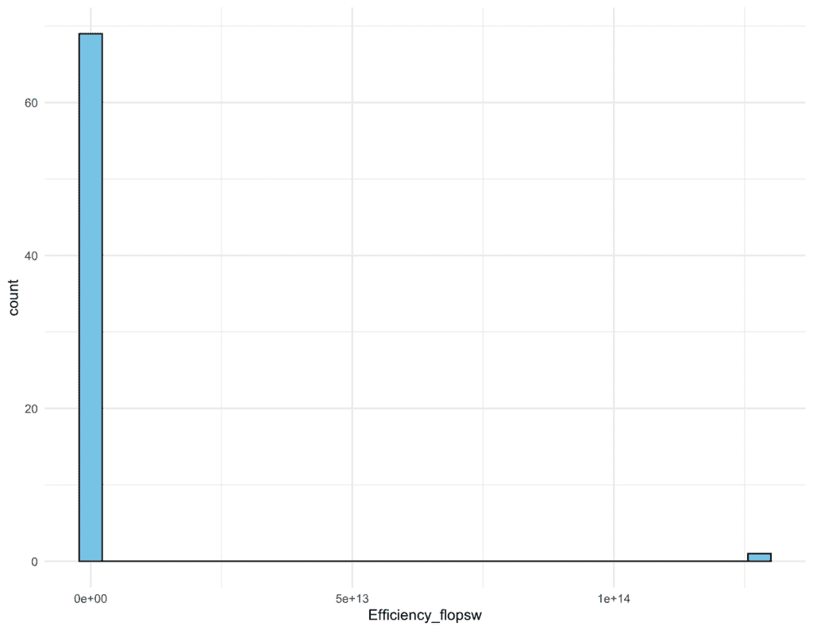
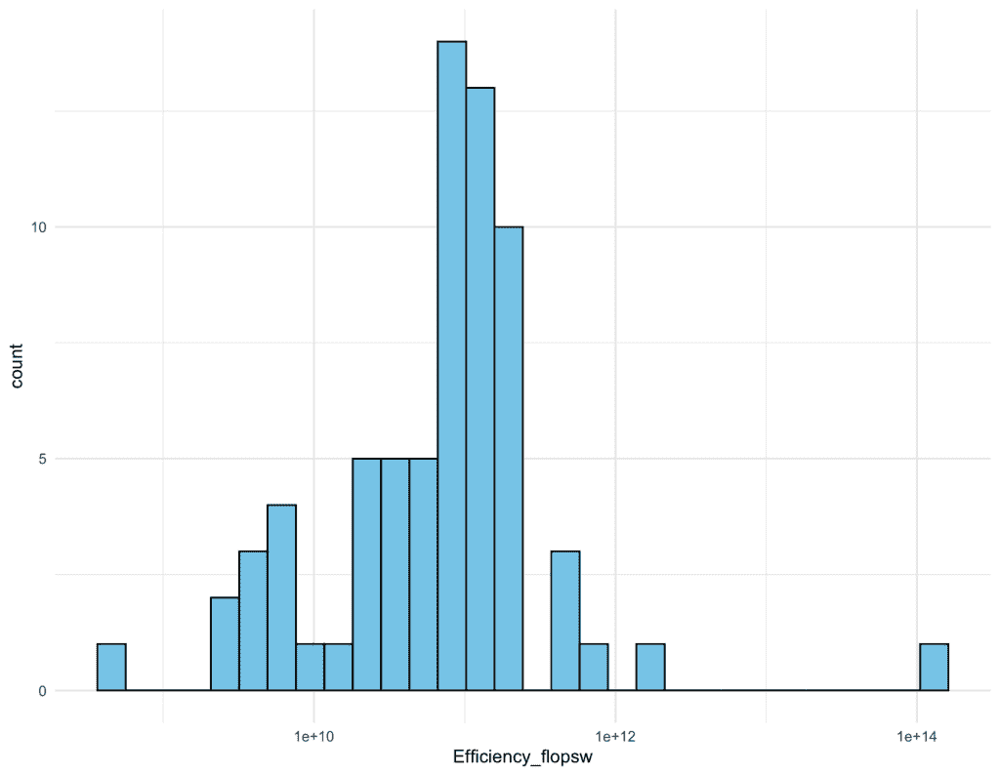
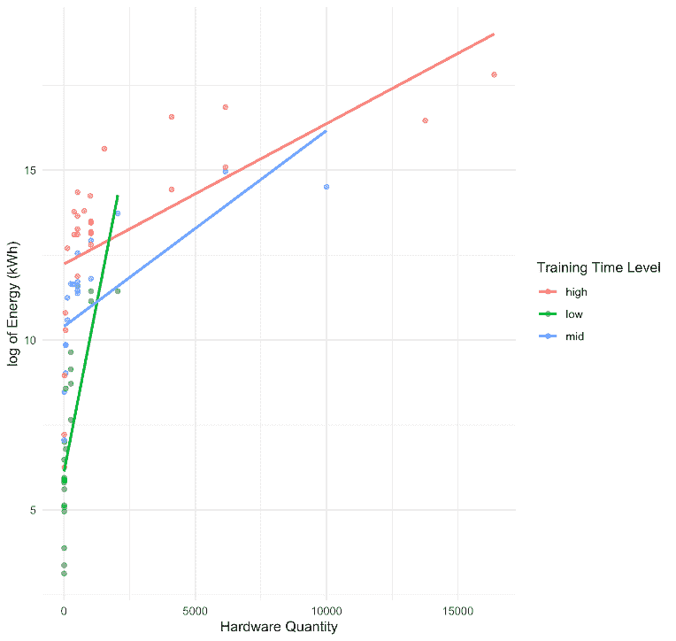
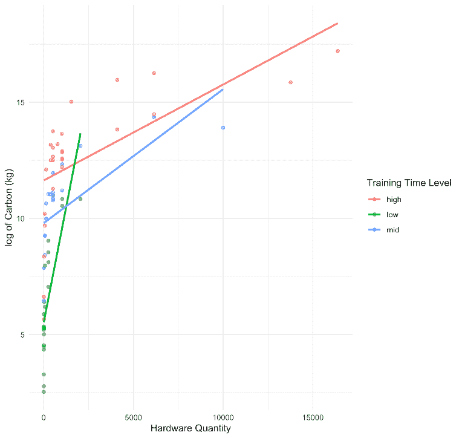
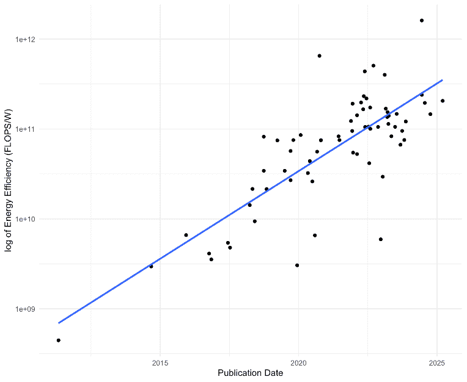
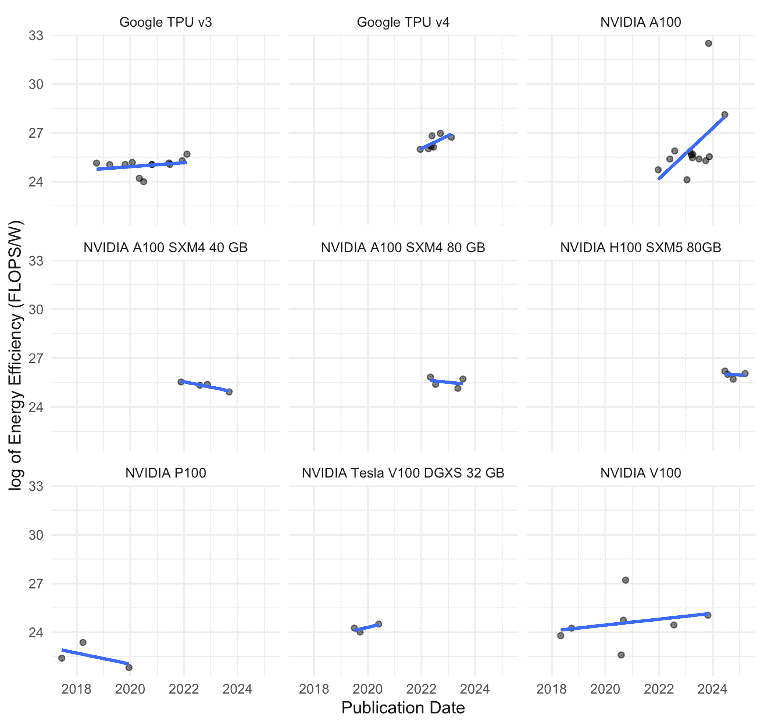

# 重新思考训练人工智能的环境成本——为什么我们应该超越硬件

> 原文：[`towardsdatascience.com/rethinking-environmental-costs-of-training-ai-why-we-should-look-beyond-hardware/`](https://towardsdatascience.com/rethinking-environmental-costs-of-training-ai-why-we-should-look-beyond-hardware/)

<details class="wp-block-details is-layout-flow wp-block-details-is-layout-flow"><summary>本研究摘要</summary>

+   **硬件选择**——特别是硬件类型及其数量——以及**训练时间**，对人工智能模型训练过程中的能源、水和碳足迹有显著的正向影响，而与架构相关的因素则没有。

+   硬件数量和训练时间之间的**交互**略微减缓了能源、水和碳消耗的增长，大约为 0.00002%。

+   在人工智能模型训练过程中，整体能源效率在近年来略有提高，大约每年提高 0.13%。

+   较长的训练时间可以逐渐“耗尽”整体能源效率，每小时降低 0.03%。</details> <details class="wp-block-details is-layout-flow wp-block-details-is-layout-flow"><summary>大纲</summary>

1.  引言

    +   研究问题 1：架构和硬件选择与资源消耗

    +   研究问题 2：随时间变化的能源效率

1.  方法

    +   估计方法

    +   分析方法

1.  结果

    +   RQ1：

        +   架构因素不像硬件因素那样具有很大的预测能力

        +   最终模型选择

        +   系数解释

    +   RQ2

1.  讨论</details>

* * *

## 1\. <mdspan datatext="el1747163861411" class="mdspan-comment">引言</mdspan>

自从 20 世纪 40 年代第一台数字计算机被发明以来，科学家们一直梦想着创造像人类一样聪明的机器，现在这已成为人工智能（AI）。快进到 2022 年 11 月，当能够即时聆听和回答的 AI 模型 ChatGPT 发布时，感觉就像梦想成真。之后，数百个新的 AI 模型纷纷加入竞赛（在此处查看[时间线](https://nhlocal.github.io/AiTimeline/)）。如今，每天通过 ChatGPT（OpenAI 新闻室，2024）发送的消息量达到十亿条，突显了用户对人工智能的快速采用。然而，很少有人停下来问：这种新便利背后的环境成本是什么？

在用户可以向 AI 提问之前，这些模型必须首先经过训练。训练是一个过程，其中模型或算法被提供数据集并尝试找到最佳匹配。想象一个简单的回归 `y = ax + b`：训练意味着向算法提供`x`和`y`值，并允许它找到最佳参数`a`和`b`。当然，AI 模型通常不会像线性回归那样简单。它们会包含大量的参数，因此需要大量的计算和数据集。此外，它们还需要运行大量的专用硬件，这些硬件能够处理如此大量的计算和复杂性。所有这些加在一起使得 AI 消耗比传统软件更多的能量。

此外，AI 训练需要稳定且不间断的能源供应，这主要来自像天然气或基于煤炭的非可再生能源，因为太阳能和风能会根据天气条件波动（Calvert，2024）。此外，由于能源使用的高强度，数据中心——存储 AI 模型的建筑——会迅速升温，排放大量的碳足迹，并需要大量的水进行冷却。因此，AI 模型具有广泛的环境影响，包括能源使用、水资源消耗和碳排放。

不幸的是，关于 AI 模型的能源、水和碳足迹的官方和公开数据并不多。公众对这些环境影响在很大程度上仍然缺乏了解，因此没有对科技公司采取更系统性的变革产生强大的压力或动机。此外，尽管已经取得了一些改进——特别是在硬件能源效率方面——但仍然缺乏系统性的或协调一致的措施来有效减少 AI 的整体环境影响。因此，我希望能**提高公众对这些隐藏的环境成本的认识**，并**探索最近在能源效率方面的改进是否足够显著**。更具体地说，我在这项研究中寻求解决两个研究问题：

> RQ1：AI 模型的架构和硬件选择与其在训练过程中的资源消耗之间是否存在显著关系？
> 
> RQ2：AI 训练是否随着时间的推移变得更加节能？

## 2. 方法：

论文使用了来自 Epoch AI（Epoch AI，2025）的一个名为*Notable AI Models*的数据集，Epoch AI 是一个研究机构，研究 AI 发展的趋势。包括的模型要么具有历史相关性，要么代表了 AI 领域的尖端进展。每个模型都记录了关键训练信息，如参数数量、数据集大小、总计算量、硬件类型和硬件数量，所有这些信息都是从各种来源收集的，包括文献综述、出版物和研究论文。该数据集还报告了这些属性的置信水平。为了进行可靠的分析，我只评估了置信评级为*“Confident”*或*“Likely”*的模型。

如前所述，关于直接资源消耗的数据有限。幸运的是，数据集作者根据多个因素估计了总功耗（以瓦特为单位，或 W），包括硬件类型、硬件数量以及一些数据中心效率率和开销数据。需要注意的是，功率和能量是不同的：**功率**（W）指的是单位时间内使用的电量，而**能量**（千瓦时，或 kWh）衡量的是随时间累积消耗的总电量。

由于本研究调查了 AI 模型训练阶段的资源消耗和能源效率，我构建并估计了四个环境指标：总能源使用（kWh）、总水使用（升，或 L）、总碳排放（二氧化碳当量千克，或 kgCO2e）和能源效率（FLOPS/W，稍后解释）。

### a. 估计方法

首先，本研究通过选择具有可用总功耗（W）和训练时间（小时）的模型来估计能源消耗。能源计算如下：

\[\text{能源（kWh）} = \frac{\text{总功耗（W）}}{1000} \times \text{训练时间（h）}\]

接着，通过重新排列数据中心中使用的两个标准比率公式来估计水消耗和碳排放：水使用效率（WUE，以 L/kWh 计）和碳强度（CI，以 kgCO2e/kWh 计）：

\[\text{WUE（L/kWh）} = \frac{\text{水（L）}}{\text{能源（kWh）}} \Longrightarrow \text{水（L）} = \text{WUE（L/kWh）} \times \text{能源（kWh）}\]

本研究使用了 2023 年由劳伦斯伯克利国家实验室（2024 年）报告的平均 WUE（0.36 L/kWh）。

\[\mathrm{CI\ \left( \frac{\mathrm{kgCO_2e}}{\mathrm{kWh}} \right)} = \frac{\mathrm{碳（kgCO_2e）}}{\mathrm{能源（kWh）}} \Longrightarrow \mathrm{碳（kgCO_2e）} = \mathrm{CI\ \left( \frac{\mathrm{kgCO_2e}}{\mathrm{kWh}} \right)} \times \mathrm{能源（kWh）}\]

本研究使用了最近环境研究（Guidi et al, 2024）报告的平均碳强度为*0.548 kg CO₂e/kWh*。

最后，本研究使用 FLOPS/W 指标来估计能源效率。浮点运算（FLOP）是一种基本的算术运算（例如，加法或乘法）带有小数。每秒浮点运算（FLOPS）衡量系统每秒可以执行多少此类运算，通常用于评估计算性能。每瓦特浮点运算（FLOPS/W）衡量每单位消耗的功率所能实现的计算性能：

\[\text{能源效率（FLOPS/W）} = \frac{\text{总计算（FLOP）}}{\text{训练时间（h）} \times 3600 \times \text{总功耗（W）}}\]

需要注意的是，FLOPS/W 通常用于衡量硬件级别的能效。然而，在实际的 AI 训练过程中，实际的效率可能与所使用硬件报告的理论效率不同。我想调查是否有一些与训练相关的因素，除了硬件之外，可能对整体能效有显著贡献。

### b**.** 分析方法：

#### RQ1：架构和硬件选择与资源消耗

在能源、水和碳排放中，我专注于建模能源消耗，因为水和碳都是直接通过固定的转换率从能源中得出的，并且所有三个响应变量具有相同的分布。因此，我相信我们可以安全地假设，最佳拟合的能源消耗模型可以应用于水和碳。尽管统计模型相同，我仍会报告所有三个的结果，以量化每个显著因素每增加一个单位所浪费的千瓦时能源、升水和千克碳。这样，我希望能够更全面、具体和有形地传达 AI 的环境影响。


图 2a. 能量消耗直方图（千瓦时）


图 2b. 能量消耗对数直方图（千瓦时）

根据图 1，能量分布的直方图显示极端的右偏态和存在一些异常值。因此，我对能量数据进行了对数转换，目的是稳定方差并将分布更接近正态分布（图 2）。Shapiro-Wilk 检验确认对数转换后的能量数据近似正态分布（p 值=0.5）。基于此，考虑了两种类型的分布：高斯分布（正态分布）和伽马分布。虽然高斯分布适用于对称和正态数据，但伽马分布更适合正偏态数据——在工程建模中常用，其中小值出现的频率高于大值。对于每种分布，论文比较了两种包含对数转换的方法：直接对响应变量进行对数转换与在广义线性模型（GLM）中使用对数链接函数。通过评估它们的赤池信息准则（AIC）、诊断图以及预测精度，我确定了分布和对数方法的最佳组合。

候选预测因子包括*参数、训练计算、数据集大小、训练时间、硬件数量*和*硬件类型*。与架构相关的变量包括*参数、训练计算*和*数据集大小*，而与硬件相关的变量包括*硬件数量*和*硬件类型*。*训练时间*没有很好地归入任何一类，但由于其在训练 AI 模型中的核心作用，因此也被包括在内。在将所有候选预测因子拟合到选定的 GLM 规范后，我测试了多重共线性，以确定是否应该排除任何变量。在此之后，我探索了交互项，因为每个资源消耗可能不会对每个独立变量线性响应。以下交互项是基于领域知识和各种来源考虑的：

+   *模型大小与硬件类型*：不同的硬件类型有不同的内存设计。模型越大、越复杂，它需要的内存就越多（Bali，2025）。能源消耗可能因硬件处理内存需求的方式不同而不同。

+   *数据集大小与硬件类型*：类似地，由于不同的内存设计，硬件可能在不同的数据大小下访问和读取数据（Krashinsky 等人，2020）。随着数据集大小的增加，能源消耗可能会根据硬件处理大量数据的方式而变化。

+   *训练时间与硬件数量*：同时运行多个硬件单元会增加额外的开销，例如保持一切同步（HuggingFace，2025）。随着训练的进行，这些协调成本可能会增加，给系统带来更大的压力，导致能量消耗更快。

+   *训练时间与硬件类型*：随着训练时间的增加，不同硬件类型的能源消耗可能会有所不同，因为某些硬件类型可能更好地管理热量或更一致地维持性能，而其他硬件类型可能会减慢速度或消耗更多能源。

**RQ2: 随时间变化的能效**



图 2c. 能效（FLOPS/W）直方图



图 2d. 能效（FLOPS/W）直方图

能效的分布高度偏斜。即使经过对数变换，分布仍然是非正态分布且过度分散。为了减少扭曲，我移除了一个效率异常高的极端异常值，因为它不是一个前沿模型，可能影响较小。然后使用发表日期作为主要预测因子拟合伽马广义线性模型（Gamma GLM）。如果使用相同硬件的模型在效率上表现出很大的变化，这表明除了硬件之外的其他因素可能也导致了这些差异。因此，将使用第一个研究问题中的架构和硬件预测因子来评估哪些变量显著影响随时间的能效。

## 3. 结果

**RQ1: 架构和硬件选择与资源消耗**

我最终使用伽马 GLM 和对数链接来建模资源消耗。这个组合被选择是因为它的 AIC 值（1780.85）低于高斯对数链接模型（2005.83），并且产生的预测与使用对数转换响应变量的模型相比，更接近原始数据。那些对数转换模型生成的预测大大低估了原始尺度上的实际数据（*参见[这篇文章](https://towardsdatascience.com/log-link-vs-log-transformation-in-r-the-difference-that-misleads-your-entire-data-analysis/)，了解为什么对数转换在我这个案例中不起作用*）。

###### 建筑因素对硬件因素的预测能力并不强

在将所有候选解释变量拟合到伽马对数链接广义线性模型（GLM）后，我们发现两个与架构相关的变量——**参数**和**数据集大小**——与资源消耗没有显著关系（`p > 0.5`）。多重共线性测试还显示，**数据集大小**和**训练计算**与其他预测因子高度相关（`GVIF > 6`）。基于此，我假设所有三个架构变量——**参数**、**数据集大小**和**训练计算**——可能不具有很大的预测能力。然后我将这三个变量从模型中移除，方差分析（ANOVA）测试证实，简化模型（模型 4 和模型 5）与完整模型（模型 1）相比，没有显著差异，`p > 0.05`：

```py
Model 1: Energy_kWh ~ Parameters + Training_compute_FLOP + Training_dataset_size + 
    Training_time_hour + Hardware_quantity + Training_hardware + 
    0
Model 2: Energy_kWh ~ Parameters + Training_compute_FLOP + Training_time_hour + 
    Hardware_quantity + Training_hardware
Model 3: Energy_kWh ~ Parameters + Training_dataset_size + Training_time_hour + 
    Hardware_quantity + Training_hardware
Model 4: Energy_kWh ~ Parameters + Training_time_hour + Hardware_quantity + 
    Training_hardware + 0
Model 5: Energy_kWh ~ Training_time_hour + Hardware_quantity + Training_hardware + 
    0
  Resid. Df Resid. Dev Df Deviance Pr(>Chi)  
1        46     108.28                       
2        47     111.95 -1  -3.6700  0.07809 .
3        47     115.69  0  -3.7471           
4        48     116.09 -1  -0.3952  0.56314  
5        49     116.61 -1  -0.5228  0.50604 
```

继续使用模型 5，我发现**训练时间**和**硬件数量**与**能耗**显示出显著的积极关系（`GLM：训练时间，t = 9.70，p 值 < 0.001；硬件数量，t = 6.89，p 值 < 0.001`）。所有硬件类型也都是统计显著的（`p 值 < 0.001`），表明不同类型的能耗存在强烈的变化。详细结果如下：

```py
glm(formula = Energy_kWh ~ Training_time_hour + Hardware_quantity + 
    Training_hardware + 0, family = Gamma(link = "log"), data = df)

Coefficients:
                                                Estimate Std. Error t value Pr(>|t|)    
Training_time_hour                             1.351e-03  1.393e-04   9.697 5.54e-13 ***
Hardware_quantity                              3.749e-04  5.444e-05   6.886 9.95e-09 ***
Training_hardwareGoogle TPU v2                 7.213e+00  7.614e-01   9.474 1.17e-12 ***
Training_hardwareGoogle TPU v3                 1.060e+01  3.183e-01  33.310  < 2e-16 ***
Training_hardwareGoogle TPU v4                 1.064e+01  4.229e-01  25.155  < 2e-16 ***
Training_hardwareHuawei Ascend 910             1.021e+01  1.126e+00   9.068 4.67e-12 ***
Training_hardwareNVIDIA A100                   1.083e+01  3.224e-01  33.585  < 2e-16 ***
Training_hardwareNVIDIA A100 SXM4 40 GB        1.084e+01  5.810e-01  18.655  < 2e-16 ***
Training_hardwareNVIDIA A100 SXM4 80 GB        1.149e+01  5.754e-01  19.963  < 2e-16 ***
Training_hardwareNVIDIA GeForce GTX 285        3.065e+00  1.077e+00   2.846  0.00644 ** 
Training_hardwareNVIDIA GeForce GTX TITAN X    6.377e+00  7.614e-01   8.375 5.13e-11 ***
Training_hardwareNVIDIA GTX Titan Black        6.371e+00  1.079e+00   5.905 3.28e-07 ***
Training_hardwareNVIDIA H100 SXM5 80GB         1.149e+01  6.825e-01  16.830  < 2e-16 ***
Training_hardwareNVIDIA P100                   5.910e+00  7.066e-01   8.365 5.32e-11 ***
Training_hardwareNVIDIA Quadro P600            5.278e+00  1.081e+00   4.881 1.16e-05 ***
Training_hardwareNVIDIA Quadro RTX 4000        5.918e+00  1.085e+00   5.455 1.60e-06 ***
Training_hardwareNVIDIA Quadro RTX 5000        4.932e+00  1.081e+00   4.563 3.40e-05 ***
Training_hardwareNVIDIA Tesla K80              9.091e+00  7.760e-01  11.716 8.11e-16 ***
Training_hardwareNVIDIA Tesla V100 DGXS 32 GB  1.059e+01  6.546e-01  16.173  < 2e-16 ***
Training_hardwareNVIDIA Tesla V100S PCIe 32 GB 1.089e+01  1.078e+00  10.099 1.45e-13 ***
Training_hardwareNVIDIA V100                   9.683e+00  4.106e-01  23.584  < 2e-16 ***
---
Signif. codes:  0 ‘***’ 0.001 ‘**’ 0.01 ‘*’ 0.05 ‘.’ 0.1 ‘ ’ 1

(Dispersion parameter for Gamma family taken to be 1.159293)

    Null deviance: 2.7045e+08  on 70  degrees of freedom
Residual deviance: 1.1661e+02  on 49  degrees of freedom
AIC: 1781.2

Number of Fisher Scoring iterations: 25 
```

###### 最终模型选择

为了更好地捕捉可能存在的非可加效应，探索了各种交互项及其相应的 AIC 分数（表 1）。下表总结了测试的模型及其相应的 AIC 分数：

| **模型** | **预测因子** | **AIC** |
| --- | --- | --- |
| 5 | 训练时间 + 硬件数量 + 硬件类型 | 350.78 |
| 6 | 训练时间 + 硬件数量 + 硬件类型 * 参数 | 357.97 |
| 7 | 训练时间 + 硬件数量 + 硬件类型 * 数据集大小 | 335.89 |
| 8 | 训练时间 * 硬件数量 + 硬件类型 | 345.39 |
| 9 | 训练时间 * 硬件类型 + 硬件数量 | 333.03 |

*表 1. 不同 GLM 模型及其相应 AIC 分数的总结。*

虽然 AIC 分数没有发生剧烈变化，这意味着模型拟合相似，但模型 8 被优先考虑，因为它在主效应和交互效应中都是唯一具有显著影响的。涉及**硬件类型**的交互并不显著，尽管一些模型表现出更好的 AIC 分数，这可能是由于 18 种硬件类型中的样本量有限。

在*模型 8*中，训练时间和硬件数量都与能耗显示出显著的积极关系（`GLM: t = 11.09, p < 0.001`），以及硬件数量和能耗之间的关系（`GLM: 训练时间, t = 11.09, p < 0.001; 硬件数量, t = 7.32, p < 0.001; 图 3a`）。它们的交互项显著为负（`GLM: t = –4.32, p < 0.001`），这表明当训练时间增加并且硬件单元数量更高时，能耗增长速度会减慢。所有硬件类型都保持显著（`p < 0.001`）。详细结果如下：

```py
glm(formula = Energy_kWh ~ Training_time_hour * Hardware_quantity + 
    Training_hardware + 0, family = Gamma(link = "log"), data = df)

Coefficients:
                                                 Estimate Std. Error t value Pr(>|t|)    
Training_time_hour                              1.818e-03  1.640e-04  11.088 7.74e-15 ***
Hardware_quantity                               7.373e-04  1.008e-04   7.315 2.42e-09 ***
Training_hardwareGoogle TPU v2                  7.136e+00  7.379e-01   9.670 7.51e-13 ***
Training_hardwareGoogle TPU v3                  1.004e+01  3.156e-01  31.808  < 2e-16 ***
Training_hardwareGoogle TPU v4                  1.014e+01  4.220e-01  24.035  < 2e-16 ***
Training_hardwareHuawei Ascend 910              9.231e+00  1.108e+00   8.331 6.98e-11 ***
Training_hardwareNVIDIA A100                    1.028e+01  3.301e-01  31.144  < 2e-16 ***
Training_hardwareNVIDIA A100 SXM4 40 GB         1.057e+01  5.635e-01  18.761  < 2e-16 ***
Training_hardwareNVIDIA A100 SXM4 80 GB         1.093e+01  5.751e-01  19.005  < 2e-16 ***
Training_hardwareNVIDIA GeForce GTX 285         3.042e+00  1.043e+00   2.916  0.00538 ** 
Training_hardwareNVIDIA GeForce GTX TITAN X     6.322e+00  7.379e-01   8.568 3.09e-11 ***
Training_hardwareNVIDIA GTX Titan Black         6.135e+00  1.047e+00   5.862 4.07e-07 ***
Training_hardwareNVIDIA H100 SXM5 80GB          1.115e+01  6.614e-01  16.865  < 2e-16 ***
Training_hardwareNVIDIA P100                    5.715e+00  6.864e-01   8.326 7.12e-11 ***
Training_hardwareNVIDIA Quadro P600             4.940e+00  1.050e+00   4.705 2.18e-05 ***
Training_hardwareNVIDIA Quadro RTX 4000         5.469e+00  1.055e+00   5.184 4.30e-06 ***
Training_hardwareNVIDIA Quadro RTX 5000         4.617e+00  1.049e+00   4.401 5.98e-05 ***
Training_hardwareNVIDIA Tesla K80               8.631e+00  7.587e-01  11.376 3.16e-15 ***
Training_hardwareNVIDIA Tesla V100 DGXS 32 GB   9.994e+00  6.920e-01  14.443  < 2e-16 ***
Training_hardwareNVIDIA Tesla V100S PCIe 32 GB  1.058e+01  1.047e+00  10.105 1.80e-13 ***
Training_hardwareNVIDIA V100                    9.208e+00  3.998e-01  23.030  < 2e-16 ***
Training_time_hour:Hardware_quantity           -2.651e-07  6.130e-08  -4.324 7.70e-05 ***
---
Signif. codes:  0 ‘***’ 0.001 ‘**’ 0.01 ‘*’ 0.05 ‘.’ 0.1 ‘ ’ 1

(Dispersion parameter for Gamma family taken to be 1.088522)

    Null deviance: 2.7045e+08  on 70  degrees of freedom
Residual deviance: 1.0593e+02  on 48  degrees of freedom
AIC: 1775

Number of Fisher Scoring iterations: 25
```



图 3a. 硬件数量与训练时间组中能耗对数之间的关系。训练时间最初是一个连续变量。为了可视化，训练时间被分为三个相等大小的级别，并标记为高、中、低。

###### 系数解释

为了进一步解释系数，我们可以对每个系数进行指数化并减去 1，以估计预测变量每增加一个单位对响应变量的百分比变化（Popovic，2022）。对于能耗，每增加一个小时的训练将使能耗增加 0.18%，每增加一个硬件单元将增加 0.07%，它们的交互作用减少了它们组合的主效应的 0.00002%。同样，由于水和碳与能源成正比，训练时间、硬件数量及其交互作用的百分比变化保持不变（图 3b，图 3c）。然而，由于硬件类型是分类变量，并作为基线截距，它们的值在能源、水和碳模型中有所不同，以反映整体规模的不同。


图 3b. 硬件数量与训练时间组中水消耗对数之间的关系。



图 3c. 硬件数量与训练时间组中碳排放对数之间的关系。

**RQ2: 随时间推移的能量效率**

我还使用了对数链接伽马模型来检验能量效率与出版日期之间的关系，因为 Shapiro-Wilk 检验表明对数转换后的数据不是正态分布的（`p < 0.001`）。出版日期与能量效率之间存在正相关关系，估计每年提高 0.13% (`GLM: t = 8.005, p < 0.001, 图 3d`)。



图 3d. 出版年份与能量效率对数（FLOPS/W）之间的关系。每个点代表一个模型，蓝色线表示使用线性模型拟合的趋势。

为了进一步研究，我们按单个硬件类型分析了趋势，并观察到使用相同硬件的 AI 模型在效率方面存在明显的差异（图 3e）。在所有架构和硬件选择中，*训练时间*是唯一对能源效率有统计学意义的因素（GLM：t = 8.581，p < 0.001），较长的训练时间每小时降低能源效率 0.03%。



图 3e. 随时间变化的硬件类型能量效率（FLOPS/W）对数趋势。每个面板代表一个特定的硬件模型，显示单个数据点和拟合的线性趋势。仅包括至少在三个模型中使用的硬件类型。

## 4. 讨论

这项研究发现，硬件选择——包括*硬件类型*和*硬件数量*——以及*训练时间*，与 AI 模型训练期间每种资源的消耗都有显著关系，而架构变量则没有。我怀疑*训练时间*可能隐含地捕捉到了那些与架构相关的因素的一些潜在影响。此外，*训练时间*与*硬件*之间的相互作用也导致了资源的使用。然而，这项分析受到 18 种硬件类型中 70 个有效模型的小数据集的限制，这可能会限制涉及硬件的交互项的统计功效。进一步的研究可以探索更大和更多样化的数据集来研究这些相互作用。

为了说明资源密集型 AI 训练的强度，我们使用模型 8 来预测在单个 NVIDIA A100 芯片上训练一小时的基准能耗。以下是简单设置下每种资源预测的结果：

+   能源：预测的能源消耗为 29,213 千瓦时，几乎是美国平均家庭年能源消耗（10,500 千瓦时/年）的三倍（美国能源信息署，2023 年），每额外增加一小时增加 5258 千瓦时，每额外增加一个芯片增加 2044 千瓦时。

+   水：同样，相同的训练会消耗 10,521 升水，几乎是美国平均家庭每日用水量（300 加仑或 1135 升/天）的十倍（美国环境保护署，2024 年），每额外增加一小时增加 1,894 升，每增加一个芯片增加 736 升。

+   碳：预测的碳排放量为 16,009 千克，大约是美国家庭年排放量（4000 千克/年）的四倍（密歇根大学，2024 年），每额外增加一小时增加 2881 千克，每额外增加一个芯片增加 1120 千克。

这项研究还发现，随着时间推移，AI 模型在能源效率方面变得更加高效，但提升幅度很小，每年估计提高 0.13%。这表明，尽管新硬件更高效，但其应用并未得到广泛推广。虽然随着硬件效率的提高，AI 的环境影响可能会随着时间的推移而减轻，但仅仅关注硬件可能会忽略其他导致总体能耗的贡献因素。在这个数据集中，**训练计算**和**总功耗**通常都是估算值，可能包括一些仅限于硬件之外的系统级开销。因此，本研究中的效率估计可能不仅反映了硬件性能，还可能反映了其他与训练相关的开销。本研究观察到，即使在使用相同硬件的模型中，能源效率也存在显著差异。一个关键发现是，更长的训练时间会“耗尽”能源效率，大约降低 0.03%。进一步的研究应探讨训练实践（而不仅仅是硬件选择）如何影响 AI 开发的环保成本。

* * *

## 参考文献

Calvert, B. 2024. *AI already uses as much energy as a small country. It’s only the beginning.* Vox. [`www.vox.com/climate/2024/3/28/24111721/climate-ai-tech-energy-demand-rising`](https://www.vox.com/climate/2024/3/28/24111721/climate-ai-tech-energy-demand-rising)

OpenAI 新闻室. 2024. @sama 今天早些时候分享的新数据：每周活跃的 ChatGPT 用户数达到 3000 万。每天在 ChatGPT 上发送的用户消息达到 10 亿条。在美国，有 130 万开发者基于 OpenAI 进行开发。通过 X 的推文。2024. [`x.com/OpenAINewsroom/status/1864373399218475440`](https://x.com/OpenAINewsroom/status/1864373399218475440)

Epoch AI. 2025. *Data on Notable AI Models.* Epoch AI. [`epoch.ai/data/notable-ai-models`](https://epoch.ai/data/notable-ai-models)

Shehabi, A., S.J. Smith, A. Hubbard, A. Newkirk, N. Lei, M.A.B. Siddik, B. Holecek, J. Koomey, E. Masanet, and D. Sartor. 2024. *2024 United States Data Center Energy Usage Report*. Lawrence Berkeley National Laboratory, Berkeley, California. LBNL-2001637.

Guidi, G., F. Dominici, J. Gilmour, K. Butler, E. Bell, S. Delaney, and F.J. Bargagli-Stoffi. 2024. *Environmental Burden of United States Data Centers in the Artificial Intelligence Era*. arXiv abs/2411.09786.

Bali, S. 2025. *GPU Memory Essentials for AI Performance.* NVIDIA Developer. [`developer.nvidia.com/blog/gpu-memory-essentials-for-ai-performance/`](https://developer.nvidia.com/blog/gpu-memory-essentials-for-ai-performance/)

Krashinsky, R., O. Giroux, S. Jones, N. Stam, and S. Ramaswamy. 2020. *NVIDIA Ampere Architecture In-Depth*. NVIDIA Developer. [`developer.nvidia.com/blog/nvidia-ampere-architecture-in-depth/`](https://developer.nvidia.com/blog/nvidia-ampere-architecture-in-depth/)

HuggingFace. 2025\. *多 GPU 训练性能提示* HuggingFace 文档. [`huggingface.co/docs/transformers/en/perf_train_gpu_many`](https://huggingface.co/docs/transformers/en/perf_train_gpu_many)

Popovic, G.. 2022\. *解释 GLM. 环境计算*. 环境计算. [`environmentalcomputing.net/statistics/glms/interpret-glm-coeffs/`](https://environmentalcomputing.net/statistics/glms/interpret-glm-coeffs/)

美国能源信息署. 2023\. *能源使用解释：家庭用电*. [`www.eia.gov/energyexplained/use-of-energy/electricity-use-in-homes.php`](https://www.eia.gov/energyexplained/use-of-energy/electricity-use-in-homes.php)

美国环境保护署. 2024\. *我们如何使用水*. [`www.epa.gov/watersense/how-we-use-water`](https://www.epa.gov/watersense/how-we-use-water)

密歇根大学可持续系统中心. 2024\. *碳足迹事实表*. 出版号 CSS09–05.
