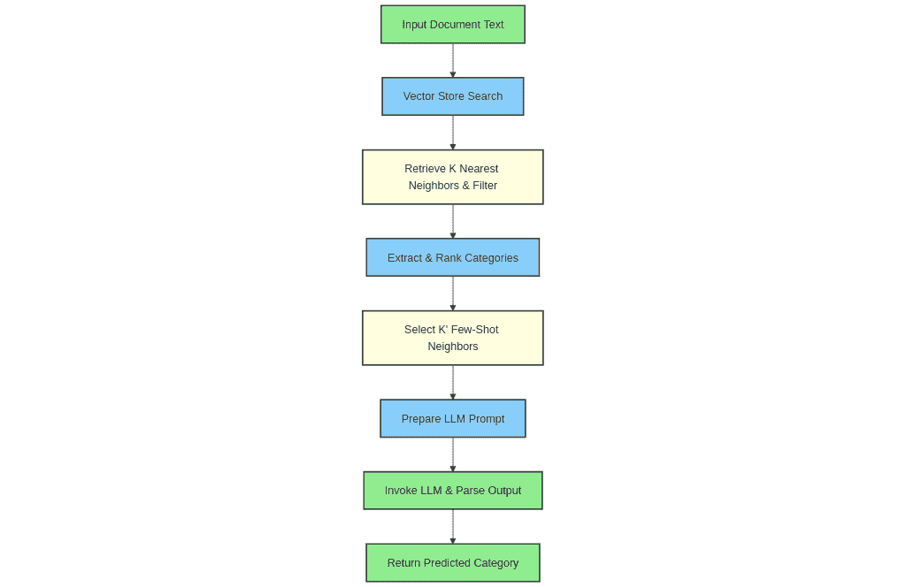

# 检索增强分类：利用外部知识改进文本分类

> 原文：[`towardsdatascience.com/retrieval-augmented-classification-improving-text-classification-with-external-knowledge/`](https://towardsdatascience.com/retrieval-augmented-classification-improving-text-classification-with-external-knowledge/)

<mdspan datatext="el1746589026776" class="mdspan-comment">文本分类</mdspan>是自然语言处理中最基本但最重要的应用之一。它在许多现实世界的应用中扮演着至关重要的角色，从过滤垃圾邮件，检测产品类别，到在聊天机器人应用中分类用户意图。构建文本分类器的默认方式是收集大量标记数据，即输入文本及其对应的标签，然后训练一个定制的机器学习模型。随着 LLM 变得更加强大，情况有所改变，你通常可以通过使用通用的大语言模型作为零样本或小样本分类器来获得相当不错的性能，从而显著缩短文本分类服务的部署时间。然而，准确性可能落后于定制构建的模型，并且高度依赖于精心设计的提示来更好地定义 LLM 的分类任务。在这篇博客中，我们旨在最小化定制机器学习模型和通用 LLM 之间的差距，同时最小化调整 LLM 提示以适应您任务所需的努力。

## LLM 与用于文本分类的定制 ML 模型

**优点：**

让我们先探讨两种进行文本分类的方法的优缺点。

**通用分类器的大语言模型：**

1.  由于庞大的预训练语料库和 LLM 的推理能力，具有高泛化能力。

1.  一个通用的 LLM 可以处理多个分类任务，而无需为每个任务部署一个模型。

1.  随着 LLM 的持续改进，你可以在可用时通过采用更新、更强大的模型来潜在地提高准确性，而只需付出最小的努力。

1.  大多数 LLM 作为托管服务提供，显著降低了启动部署所需的知识和努力。

1.  在标签数据有限或获取成本高昂的低数据场景中，LLM 通常优于定制 ML 模型。

1.  LLM 可以推广到多种语言。

1.  如果按令牌付费，当预测量低或不可预测时，LLM 可能更便宜。

1.  可以通过简单地修改提示来动态更改类定义，而无需重新训练。

**缺点：**

1.  LLM 容易产生幻觉。

1.  LLM 可能运行缓慢，或者至少比小型定制 ML 模型慢。

1.  它们需要提示工程的努力。

1.  使用 LLM-as-a-service 进行高吞吐量应用可能会迅速遇到配额限制。

1.  由于上下文大小限制，当潜在类别数量非常多时，这种方法变得不那么有效。定义所有类别将消耗大量可用和有效的输入上下文。

1.  在高数据量情况下，LLM 的准确率通常不如定制模型。

**定制机器学习模型：**

**优点：**

1.  高效且快速。

1.  在架构选择、训练和服务方法上更加灵活。

1.  能够将可解释性和不确定性估计方面添加到模型中。

1.  在高数据量情况下具有更高的准确率。

1.  你可以保持对模型和服务的控制。

**缺点：**

1.  需要频繁地进行再训练以适应新的数据或分布变化。

1.  可能需要大量的标记数据。

1.  有限的泛化能力。

1.  对域外词汇或表述敏感。

1.  部署需要 MLOps 知识。

## 缩小定制文本分类器和 LLM 之间的差距：

让我们探讨一种方法，以保持使用 LLM 进行分类的优点，同时减轻一些缺点。我们将从 RAG 中汲取灵感，并使用一种称为少样本提示的提示技术。

让我们定义两者：

**RAG**

检索增强生成是一种流行的技术，在提问之前，它使用外部知识增强 LLM 上下文。这减少了幻觉的可能性，并提高了响应的质量。

**少样本提示**

在每个分类任务中，我们将输入和预期输出作为提示的一部分展示给 LLM，以帮助它理解任务。

现在，这个项目的核心思想是混合两者。我们动态地检索与待分类文本查询最相似的示例，并将它们作为少样本示例提示注入。我们还动态地限制可能的类别范围，使用 K-最近邻的类别。当处理具有大量可能类别的分类问题时，这可以在输入上下文中释放大量令牌。

这就是它的工作方式：



让我们通过实际步骤来了解如何运行这种方法：

+   构建一个标记的输入文本/类别对的数据库。这将成为 LLM 的外部知识来源。我们将使用 ChromaDB。

```py
from typing import List
from uuid import uuid4

from langchain_core.documents import Document
from chromadb import PersistentClient
from langchain_chroma import Chroma
from langchain_community.embeddings import HuggingFaceBgeEmbeddings
import torch
from tqdm import tqdm
from chromadb.config import Settings
from retrieval_augmented_classification.logger import logger

class DatasetVectorStore:
    """ChromaDB vector store for PublicationModel objects with SentenceTransformers embeddings."""

    def __init__(
        self,
        db_name: str = "retrieval_augmented_classification",  # Using db_name as collection name in Chroma
        collection_name: str = "classification_dataset",
        persist_directory: str = "chroma_db",  # Directory to persist ChromaDB
    ):
        self.db_name = db_name
        self.collection_name = collection_name
        self.persist_directory = persist_directory

        # Determine if CUDA is available
        device = "cuda" if torch.cuda.is_available() else "cpu"
        logger.info(f"Using device: {device}")

        self.embeddings = HuggingFaceBgeEmbeddings(
            model_name="BAAI/bge-small-en-v1.5",
            model_kwargs={"device": device},
            encode_kwargs={
                "device": device,
                "batch_size": 100,
            },  # Adjust batch_size as needed
        )

        # Initialize Chroma vector store
        self.client = PersistentClient(
            path=self.persist_directory, settings=Settings(anonymized_telemetry=False)
        )
        self.vector_store = Chroma(
            client=self.client,
            collection_name=self.collection_name,
            embedding_function=self.embeddings,
            persist_directory=self.persist_directory,
        )

    def add_documents(self, documents: List) -> None:
        """
        Add multiple documents to the vector store.

        Args:
            documents: List of dictionaries containing document data.  Each dict needs a "text" key.
        """

        local_documents = []
        ids = []

        for doc_data in documents:
            if not doc_data.get("id"):
                doc_data["id"] = str(uuid4())

            local_documents.append(
                Document(
                    page_content=doc_data["text"],
                    metadata={k: v for k, v in doc_data.items() if k != "text"},
                )
            )
            ids.append(doc_data["id"])

        batch_size = 100  # Adjust batch size as needed
        for i in tqdm(range(0, len(documents), batch_size)):
            batch_docs = local_documents[i : i + batch_size]
            batch_ids = ids[i : i + batch_size]

            # Chroma's add_documents doesn't directly support pre-defined IDs. Upsert instead.
            self._upsert_batch(batch_docs, batch_ids)

    def _upsert_batch(self, batch_docs: List[Document], batch_ids: List[str]):
        """Upsert a batch of documents into Chroma.  If the ID exists, it updates; otherwise, it creates."""
        texts = [doc.page_content for doc in batch_docs]
        metadatas = [doc.metadata for doc in batch_docs]

        self.vector_store.add_texts(texts=texts, metadatas=metadatas, ids=batch_ids)
```

这个类处理创建一个集合，在将每个文档嵌入到向量索引之前，对每个文档进行嵌入。我们使用 BAAI/bge-small-en-v1.5，但任何嵌入模型都可以工作，甚至那些来自 Gemini、OpenAI 或 Nebius 作为服务的模型。

+   为输入文本找到 K 个最近的邻居

```py
def search(self, query: str, k: int = 5) -> List[Document]:
    """Search documents by semantic similarity."""
    results = self.vector_store.similarity_search(query, k=k)
    return results
```

此方法返回与我们的输入最相似的文档数据库中的文档。

+   构建检索增强分类器

```py
from typing import Optional
from pydantic import BaseModel, Field
from collections import Counter

from retrieval_augmented_classification.vector_store import DatasetVectorStore
from tenacity import retry, stop_after_attempt, wait_exponential
from langchain_core.messages import AIMessage, HumanMessage, SystemMessage

class PredictedCategories(BaseModel):
    """
    Pydantic model for the predicted categories from the LLM.
    """

    reasoning: str = Field(description="Explain your reasoning")
    predicted_category: str = Field(description="Category")

class RAC:
    """
    A hybrid classifier combining K-Nearest Neighbors retrieval with an LLM for multi-class prediction.
    Finds top K neighbors, uses top few-shot for context, and uses all neighbor categories
    as potential prediction candidates for the LLM.
    """

    def __init__(
        self,
        vector_store: DatasetVectorStore,
        llm_client,
        knn_k_search: int = 30,
        knn_k_few_shot: int = 5,
    ):
        """
        Initializes the classifier.

        Args:
            vector_store: An instance of DatasetVectorStore with a search method.
            llm_client: An instance of the LLM client capable of structured output.
            knn_k_search: The number of nearest neighbors to retrieve from the vector store.
            knn_k_few_shot: The number of top neighbors to use as few-shot examples for the LLM.
                           Must be less than or equal to knn_k_search.
        """

        self.vector_store = vector_store
        self.llm_client = llm_client
        self.knn_k_search = knn_k_search
        self.knn_k_few_shot = knn_k_few_shot

    @retry(
        stop=stop_after_attempt(3),  # Retry LLM call a few times
        wait=wait_exponential(multiplier=1, min=2, max=5),  # Shorter waits for demo
    )
    def predict(self, document_text: str) -> Optional[str]:
        """
        Predicts the relevant categories for a given document text using KNN retrieval and an LLM.

        Args:
            document_text: The text content of the document to classify.

        Returns:
            The predicted category
        """
        neighbors = self.vector_store.search(document_text, k=self.knn_k_search)

        all_neighbor_categories = set()
        valid_neighbors = []  # Store neighbors that have metadata and categories
        for neighbor in neighbors:
            if (
                hasattr(neighbor, "metadata")
                and isinstance(neighbor.metadata, dict)
                and "category" in neighbor.metadata
            ):
                all_neighbor_categories.add(neighbor.metadata["category"])
                valid_neighbors.append(neighbor)
            else:
                pass  # Suppress warnings for cleaner demo output

        if not valid_neighbors:
            return None

        category_counts = Counter(all_neighbor_categories)
        ranked_categories = [
            category for category, count in category_counts.most_common()
        ]

        if not ranked_categories:
            return None

        few_shot_neighbors = valid_neighbors[: self.knn_k_few_shot]

        messages = []

        system_prompt = f"""You are an expert multi-class classifier. Your task is to analyze the provided document text and assign the most relevant category from the list of allowed categories.
You MUST only return categories that are present in the following list: {ranked_categories}.
If none of the allowed categories are relevant, return an empty list.
Return the categories by likelihood (more confident to least confident).
Output your prediction as a JSON object matching the Pydantic schema: {PredictedCategories.model_json_schema()}.
"""
        messages.append(SystemMessage(content=system_prompt))

        for i, neighbor in enumerate(few_shot_neighbors):
            messages.append(
                HumanMessage(content=f"Document: {neighbor.page_content}")
            )
            expected_output_json = PredictedCategories(
                reasoning="Your reasoning here",
                predicted_category=neighbor.metadata["category"]
            ).model_dump_json()
            # Simulate the structure often used with tool calling/structured output

            ai_message_with_tool = AIMessage(
                content=expected_output_json,
            )

            messages.append(ai_message_with_tool)

        # Final user message: The document text to classify
        messages.append(HumanMessage(content=f"Document: {document_text}"))

        # Configure the client for structured output with the Pydantic schema
        structured_client = self.llm_client.with_structured_output(PredictedCategories)
        llm_response: PredictedCategories = structured_client.invoke(messages)

        predicted_category = llm_response.predicted_category

        return predicted_category if predicted_category in ranked_categories else None
```

代码的第一部分定义了我们期望从 LLM 获得的输出结构。Pydantic 类有两个字段，推理，用于思维链提示（[`www.promptingguide.ai/techniques/cot`](https://www.promptingguide.ai/techniques/cot)）和预测类别。

预测方法首先找到 K 个最近的邻居，并使用它们作为少样本提示，通过创建一个合成的消息历史记录，仿佛 LLM 为每个 KNN 给出了正确的类别，然后我们将查询文本作为最后一条人类消息注入。

我们过滤值以检查其是否有效，如果是，则返回它。

+   示例预测：

```py
_rac = RAC(
    vector_store=store,
    llm_client=llm_client,
    knn_k_search=50,
    knn_k_few_shot=10,
)
print(
    f"Initialized rac with knn_k_search={_rac.knn_k_search}, knn_k_few_shot={_rac.knn_k_few_shot}."
)

text = """Ivanoe Bonomi [iˈvaːnoe boˈnɔːmi] (18 October 1873 – 20 April 1951) was an Italian politician and statesman before and after World War II. Bonomi was born in Mantua. He was elected to the Italian Chamber of Deputies in ...
"""
category = _rac.predict(text)

print(text)
print(category)

text = """Michel Rocard, né le 23 août 1930 à Courbevoie et mort le 2 juillet 2016 à Paris, est un haut fonctionnaire et ... 
"""
category = _rac.predict(text)

print(text)
print(category)
```

两个输入都返回预测“PrimeMinister”，尽管第二个示例是法语，而训练数据集完全为英语。这说明了这种方法即使在相似语言之间也具有泛化能力。

+   评估：

我们使用**DBPedia Classes**数据集的 l3 类别([`www.kaggle.com/datasets/danofer/dbpedia-classes`](https://www.kaggle.com/datasets/danofer/dbpedia-classes) ，许可[CC BY-SA 3.0](https://en.wikipedia.org/wiki/Wikipedia:Text_of_Creative_Commons_Attribution-ShareAlike_3.0_Unported_License)。)进行评估。该数据集包含超过 200 个类别和 240000 个训练样本。

我们将检索增强分类方法与简单的 KNN 分类器（多数投票）进行了基准测试，并获得了以下结果：DBpedia 数据集的**l3 类别**：

|  | 准确率 | 平均延迟 | 吞吐量（多线程） |
| --- | --- | --- | --- |
| KNN 分类器 | 87% | **24ms** | **108** predictions / s |
| 仅使用 LLM 的分类器 | 88% | ~600ms | 47 predictions / s |
| RAC | **96%** | ~1s | 27 predictions / s |

通过参考，我在 Kaggle 笔记本上找到的该数据集 l3 级别的最佳准确率大约为*94%*，使用了自定义的 ML 模型。

我们注意到，将 KNN 搜索与 LLM 的推理能力相结合，可以使我们获得+9%的准确率提升，但代价是较低的吞吐量和较高的延迟。

## 结论

在这个项目中，我们构建了一个文本分类器，它利用“检索”来增强 LLM 查找输入内容正确类别的能力。这种方法与传统 ML 文本分类器相比具有几个优点。这包括能够在不重新训练的情况下动态更改训练数据集，由于 LLM 的推理和一般知识而具有更高的泛化能力，与自定义 ML 模型相比，在使用托管的 LLM 服务时易于部署，以及能够使用单个基础 LLM 模型处理多个分类任务。这以更高的延迟和较低的吞吐量以及 LLM 供应商锁定风险为代价。

当你在处理分类任务时，这种方法不应该成为你的首选，但当你需要根据数据变化重新训练分类器或处理少量标记数据时，它仍然可以作为你的工具箱的一部分。它还可以在你面临截止日期时，快速启动和运行分类服务目标时发挥作用 😃。

来源：

+   [[1] G. Yu, L. Liu, H. Jiang, S. Shi and X. Ao, 检索增强少样本文本分类 (2023), 计算语言学协会发现：EMNLP 2023](https://aclanthology.org/2023.findings-emnlp.447.pdf)

+   [[2] A. Long, W. Yin, T. Ajanthan, V. Nguyen, P. Purkait, R. Garg, C. Shen and A. van den Hengel, 长尾视觉识别的检索增强分类 (2022)](https://www.amazon.science/publications/retrieval-augmented-classification-for-long-tail-visual-recognition)

代码: [`github.com/CVxTz/retrieval_augmented_classification`](https://github.com/CVxTz/retrieval_augmented_classification)
