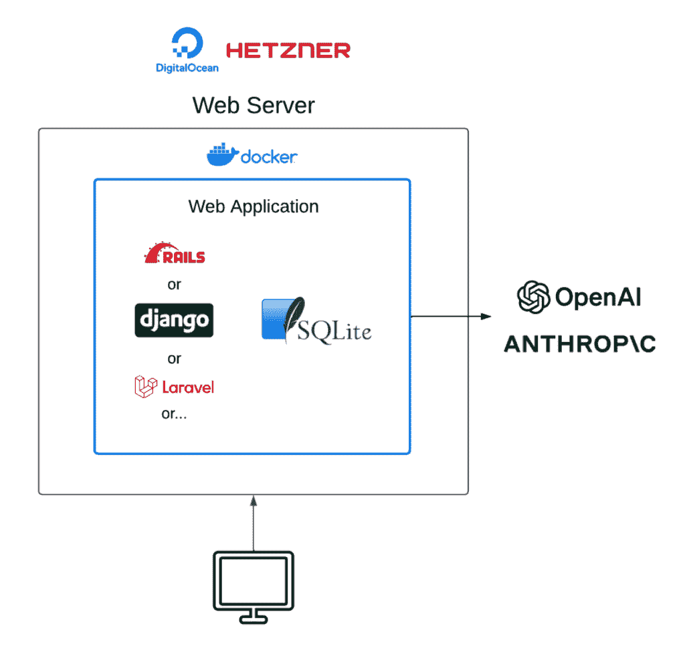

# SQLite 中的检索增强生成

> 原文：[`towardsdatascience.com/retrieval-augmented-generation-in-sqlite/`](https://towardsdatascience.com/retrieval-augmented-generation-in-sqlite/)

*这是关于使用 SQLite 进行机器学习的两篇系列文章中的第二篇。在我的* [*上一篇文章*](https://towardsdatascience.com/sqlite-in-production-dreams-becoming-reality-94557bec095b/)* 中，我深入探讨了 SQLite 如何迅速成为适用于 Web 应用的成熟生产数据库。在这篇文章中，我将讨论如何使用 SQLite 进行检索增强生成。*

*如果您想要一个集成了生成式 AI 的定制 Web 应用，请访问* [*losangelesaiapps.com*](https://losangelesaiapps.com/)

本文引用的代码可以在[这里](https://github.com/EdIzaguirre/sqlite_vec_tutorial?tab=readme-ov-file)找到。

* * *

当我最初作为一个初露头角的数据科学家学习如何执行检索增强生成（RAG）时，我遵循了*传统路径*。这通常看起来像：

+   在 Google 上搜索检索增强生成并寻找教程

+   找到最受欢迎的框架，通常是 LangChain 或 LlamaIndex

+   找到最受欢迎的云向量数据库，通常是 Pinecone 或 Weaviate

+   阅读大量文档，将所有碎片拼凑在一起，成功！

实际上，我确实[写了一篇文章](https://towardsdatascience.com/how-to-build-a-rag-system-with-a-self-querying-retriever-in-langchain-16b4fa23e9ad/)，讲述了我在 LangChain 中使用 Pinecone 构建 RAG 系统的经验。

使用带有云向量数据库的 RAG 框架并没有什么大问题。然而，我认为对于初学者来说，这可能会使情况过于复杂。我们真的需要一个完整的框架来学习如何进行 RAG 吗？调用云向量数据库的 API 是必要的吗？这些数据库作为黑盒存在，这对学习者（或者坦白说对任何人）来说都不是好事。

在这篇文章中，我将向您展示如何在最简单的堆栈上执行 RAG。实际上，这个“堆栈”只是 SQLite 加上 sqlite-vec 扩展和 OpenAI API，用于使用它们的嵌入和聊天模型。我建议您阅读本系列的[第一部分](https://medium.com/towards-data-science/sqlite-in-production-dreams-becoming-reality-94557bec095b)[1](https://medium.com/towards-data-science/sqlite-in-production-dreams-becoming-reality-94557bec095b)，以深入了解 SQLite 及其如何迅速成为适用于 Web 应用的成熟生产数据库。对我们来说，理解 SQLite 是可能的最简单类型的数据库就足够了：它就是您仓库中的一个文件。

所以，放弃您的云向量数据库和臃肿的框架，让我们来做一些 RAG。

* * *

## **SQLite-Vec**

SQLite 数据库的一项强大功能是**扩展**的使用。对于我们熟悉 Python 的人来说，扩展与库非常相似。它们是用 C 编写的模块化代码片段，用于扩展 SQLite 的功能，使得曾经不可能的事情变得可能。SQLite 的一个流行扩展示例是[全文搜索（FTS）](https://www.sqlite.org/fts5.html)扩展。这个扩展允许 SQLite 在 SQLite 中高效地对大量文本数据进行搜索。因为扩展完全用 C 编写，所以我们可以将其在任何可以运行 SQLite 数据库的地方运行，包括树莓派和浏览器。

在这篇文章中，我将介绍一个名为[sqlite-vec](https://github.com/asg017/sqlite-vec)的扩展。这赋予了 SQLite 执行**向量搜索**的能力。向量搜索与全文搜索类似，因为它允许对文本数据进行高效搜索。然而，与在文本中搜索精确的单词或短语不同，向量搜索具有语义理解。换句话说，搜索“horses”将找到“equestrian”、“pony”、“Clydesdale”等匹配项。全文搜索无法做到这一点。

sqlite-vec 使用**虚拟表**，SQLite 中的大多数扩展也是如此。虚拟表类似于常规表，但具有额外的功能：

+   **自定义数据源**：SQLite 中标准表的数据存储在一个单独的数据库文件中。对于虚拟表，数据可以存储在外部源中，例如 CSV 文件或 API 调用。

+   **灵活的功能**：虚拟表可以添加专门的索引或查询功能，并支持复杂的数据类型，如 JSON 或 XML。

+   **与 SQLite 查询引擎的集成**：虚拟表与 SQLite 的标准查询语法无缝集成，例如`SELECT`、`INSERT`、`UPDATE`和`DELETE`选项。最终，支持这些操作的是扩展的编写者。

+   **模块的使用**：虚拟表如何工作的后端逻辑是通过一个**模块**（用 C 或另一种语言编写）实现的。

创建虚拟表的典型语法如下：

```py
CREATE VIRTUAL TABLE my_table USING my_extension_module();
```

这句话的重要部分是`my_extension_module()`。这指定了将驱动`my_table`虚拟表后端的模块。在 sqlite-vec 中，我们将使用`vec0`模块。

### **代码讲解**

本文的代码可以在[这里](https://github.com/EdIzaguirre/sqlite_vec_tutorial)找到。它是一个简单的目录，其中大多数文件是.txt 文件，我们将使用它们作为我们的模拟数据。因为我是一个物理迷，所以大多数文件与物理相关，只有少数文件与其他随机领域相关。我不会在这个讲解中展示完整的代码，而是突出重要的部分。克隆我的仓库并尝试使用它来调查完整的代码。下面是仓库的树状视图。请注意，`my_docs.db`是 SQLite 用来管理我们所有数据的单文件数据库。

```py
.

├── data

│   ├── cooking.txt

│   ├── gardening.txt

│   ├── general_relativity.txt

│   ├── newton.txt

│   ├── personal_finance.txt

│   ├── quantum.txt

│   ├── thermodynamics.txt

│   └── travel.txt

├── my_docs.db

├── requirements.txt

└── sqlite_rag_tutorial.py
```

第一步是安装必要的库。下面是我们的 `requirements.txt` 文件。如您所见，它只有三个库。我建议创建一个使用最新 Python 版本（本文使用了 3.13.1 版本）的虚拟环境，然后运行 `pip install -r requirements.txt` 来安装库。

```py
# requirements.txt

sqlite-vec==0.1.6

openai==1.63.0

python-dotenv==1.0.1
```

第二步是如果您还没有的话，创建一个 [OpenAI API 密钥](https://platform.openai.com/docs/overview)。我们将使用 OpenAI 为文本文件生成嵌入，以便我们执行向量搜索。

```py
# sqlite_rag_tutorial.py

import sqlite3

from sqlite_vec import serialize_float32

import sqlite_vec

import os

from openai import OpenAI

from dotenv import load_dotenv

# Set up OpenAI client

client = OpenAI(api_key=os.getenv('OPENAI_API_KEY'))
```

第三步是将 sqlite-vec 扩展加载到 SQLite 中。本文中的示例将使用 Python 和 SQL。在加载扩展后立即禁用加载扩展的能力是一种良好的安全实践。

```py
# Path to the database file

db_path = 'my_docs.db'

# Delete the database file if it exists

db = sqlite3.connect(db_path)

db.enable_load_extension(True)

sqlite_vec.load(db)

db.enable_load_extension(False)

Next we will go ahead and create our virtual table:

db.execute('''

   CREATE VIRTUAL TABLE documents USING vec0(

       embedding float[1536],

       +file_name TEXT,

       +content TEXT

   )

''')
```

`documents` 是一个有三个列的虚拟表：

+   `sample_embedding`：1536 维度的浮点数，将存储我们的样本文档的嵌入。

+   `file_name`：将存储我们存储在数据库中的每个文件的名称。请注意，这个列和下面的列前面都有一个加号。这表示它们是 **辅助字段**。在 sqlite-vec 中，之前只有嵌入数据可以存储在虚拟表中。然而，最近 [推送了一个更新](https://github.com/asg017/sqlite-vec/issues/121?utm_source=chatgpt.com)，允许我们向表中添加我们实际上不想嵌入的字段。在这种情况下，我们在嵌入相同的表中添加了内容和文件名。这将使我们能够轻松地看到哪些嵌入对应于哪些内容，同时避免了我们需要额外的表和 JOIN 语句的需求。

+   `content`：将存储每个文件的文本内容。

现在我们已经在我们的 SQLite 数据库中设置了虚拟表，我们可以开始将我们的文本文件转换为嵌入并存储到我们的表中：

```py
# Function to get embeddings using the OpenAI API

def get_openai_embedding(text):

   response = client.embeddings.create(

       model="text-embedding-3-small",

       input=text

   )

   return response.data[0].embedding

# Iterate over .txt files in the /data directory

for file_name in os.listdir("data"):

   file_path = os.path.join("data", file_name)

   with open(file_path, 'r', encoding='utf-8') as file:

       content = file.read()

       # Generate embedding for the content

       embedding = get_openai_embedding(content)

       if embedding:

           # Insert file content and embedding into the vec0 table

           db.execute(

               'INSERT INTO documents (embedding, file_name, content) VALUES (?, ?, ?)',

               (serialize_float32(embedding), file_name, content)

# Commit changes

db.commit()
```

我们实际上会遍历每个 .txt 文件，嵌入每个文件的内容，然后使用 `INSERT INTO` 语句将 `embedding`、`file_name` 和 `content` 插入到 `documents` 虚拟表中。最后的提交语句确保更改被持久化。请注意，我们在这里使用 sqlite-vec 库中的 `serialize_float32`。SQLite 本身没有内置的向量类型，因此它将向量存储为二进制大对象（BLOB）以节省空间并允许快速操作。内部，它使用 Python 的 `struct.pack()` 函数，该函数将 Python 数据转换为 C 风格的二进制表示。

最后，为了执行 RAG，您可以使用以下代码执行 K-Nearest-Neighbors（KNN 风格）操作。**这是向量搜索的核心。**

```py
# Perform a sample KNN query

query_text = "What is general relativity?"

query_embedding = get_openai_embedding(query_text)

if query_embedding:

   rows = db.execute(

       """

       SELECT

           file_name,

           content,

           distance

       FROM documents

       WHERE embedding MATCH ?

       ORDER BY distance

       LIMIT 3

       """,

       [serialize_float32(query_embedding)]

   ).fetchall()

   print("Top 3 most similar documents:")

   top_contexts = []

   for row in rows:

       print(row)

       top_contexts.append(row[1])  # Append the 'content' column
```

我们首先从用户那里接收一个查询，在这种情况下是 *“什么是广义相对论？”*，然后使用与之前相同的嵌入模型嵌入该查询。然后我们执行一个 SQL 操作。让我们分解一下：

+   `SELECT` 语句意味着检索到的数据将包含三个列：`file_name`、`content` 和 `distance`。前两个我们已经提到。`Distance` 将在 SQL 操作期间计算，更多细节稍后说明。

+   `FROM` 语句确保你从 `documents` 表中检索数据。

+   `WHERE embedding MATCH ?` 语句在数据库中的所有向量和查询向量之间执行相似度搜索。返回的数据将包括一个 `distance` 列。这个距离只是一个表示查询和数据库向量之间相似度的浮点数。数值越高，向量越接近。[sqlite-vec](https://alexgarcia.xyz/sqlite-vec/api-reference.html#distance) 提供了一些计算这种相似度的选项。

+   `ORDER BY distance` 确保按相似度（高到低）降序排列检索到的向量。

+   `LIMIT 3` 确保我们只获取与我们的查询嵌入向量最接近的前三个文档。你可以调整这个数字来查看获取更多或更少的向量如何影响你的结果。

给定我们的查询“*什么是广义相对论？”，以下文档被检索出来。它做得相当不错！

最相似的 3 篇文档：

> （‘general_relativity.txt’，‘爱因斯坦的广义相对论重新定义了我们对引力的理解。它不是将引力视为作用于距离的力，而是将其解释为围绕大质量物体的时空弯曲。经过大质量恒星附近的光线会略微弯曲，星系会偏转数百万光年旅行的光束，根据它们的引力势，时钟的滴答声会以不同的速率。这一开创性的理论导致了引力透镜和黑洞等预测，这些现象后来通过观测证据得到证实，并且它继续指导我们对宇宙的理解。’，0.8316285610198975）
> 
> （‘newton.txt’，‘在经典力学中，牛顿的运动定律构成了我们理解物体运动的基础。牛顿的第一定律，通常被称为惯性定律，表明一个静止的物体将保持静止，一个运动的物体将继续运动，除非受到外力的作用。这一概念扩展到更复杂的物理问题中，通过分析作用在物体上的合力，我们可以预测它们的未来轨迹和行为。随着时间的推移，应用牛顿定律已经使工程师和科学家能够设计更安全的车辆、更高效的机器，甚至引导航天器穿越复杂的引力场。’，1.2036118507385254）
> 
> （‘quantum.txt’，‘量子力学革命性地改变了我们对微观世界的理解。与经典粒子不同，量子实体如电子可以表现出波粒二象性。量子叠加等现象表明，粒子可以同时存在于多种状态，而测量行为通常“坍缩”这些状态为一种观察到的结果。这个奇怪且反直觉的理论是半导体和激光等现代技术的基础，并为量子计算和密码学等新兴领域提供了概念框架。’，1.251380205154419）

然后，我们可以将这些三个文档的内容填充到模型中，并让它尝试回答我们的问题。

```py
# Prepare the context for the query

context = "\n\n".join(top_contexts)

system_message = "You are a helpful assistant. Use the following context to answer the query."

# Send query and context to OpenAI

try:

   completion = client.chat.completions.create(

       model="gpt-4o-mini",

       messages=[

           {"role": "system", "content": system_message},

           {"role": "user", "content": f"Context: {context}\n\nQuery: {query_text}"}

       ]

   )

   print("Response:")

   print(completion.choices[0].message.content)

except Exception as e:

   print(f"Error generating response: {e}")
```

下面是模型所说的内容：

> 广义相对论是由阿尔伯特·爱因斯坦提出的一种理论，它重新定义了我们对引力的理解。我们不再将引力视为在距离上起作用的力，广义相对论将其解释为由质量的存在引起的时空弯曲。根据这一理论，像恒星和行星这样的大质量物体会在时空结构中造成扭曲，这种弯曲会影响其他物体的运动，包括光，当光经过一个质量大的物体附近时，它会发生弯曲。

这忠实于我们提供给模型的文档。干得好 `4o-mini`！

### **结论**

`sqlite-vec` 是由 Mozilla Builders Accelerator 程序资助的项目，因此它背后有一些重要的支持。必须向 `sqlite-vec` 的创造者 [亚历克斯·加西亚](https://alexgarcia.xyz/) 表示衷心的感谢，他为推动 SQLite 生态系统的发展以及使使用这个简单的数据库实现机器学习成为可能做出了贡献。这是一个维护良好的库，定期有更新通过管道下来。截至 11 月 20 日，他们甚至 [添加了基于元数据的过滤功能](https://alexgarcia.xyz/blog/2024/sqlite-vec-metadata-release/index.html)！或许我应该重新写一下之前提到的 RAG 文章，使用 SQLite 🤔。

该扩展还提供了对多种流行编程语言的绑定，包括 Ruby、Go、Rust 以及更多。

我们能够将我们的 RAG 管道简化到最基本的部分是值得注意的。回顾一下，不需要启动和关闭数据库服务，如 Postgres、MySQL 等。不需要调用云供应商的 API。如果你直接通过 Digital Ocean 或 Hetzner 部署到服务器，甚至可以避免与 AWS、Azure 或 Vercel 等托管云服务相关的[昂贵且不必要的复杂性](https://losangelesaiapps.com/ecosystem-of-middlemen/)。

我认为这种简单的架构可以适用于各种应用。使用成本更低，维护更简单，迭代更快。一旦达到一定规模，迁移到更健壮的数据库（如带有 pgvector 扩展的 Postgres）以获得 RAG 功能可能是有意义的。对于更高级的功能，如分块和文档清理，使用框架可能是正确的选择。但对于初创公司和较小的参与者来说，SQLite 就是通往月球的道路。

亲自尝试 sqlite-vec 真是件有趣的事情！



简单的 RAG 架构。图片由作者提供。
