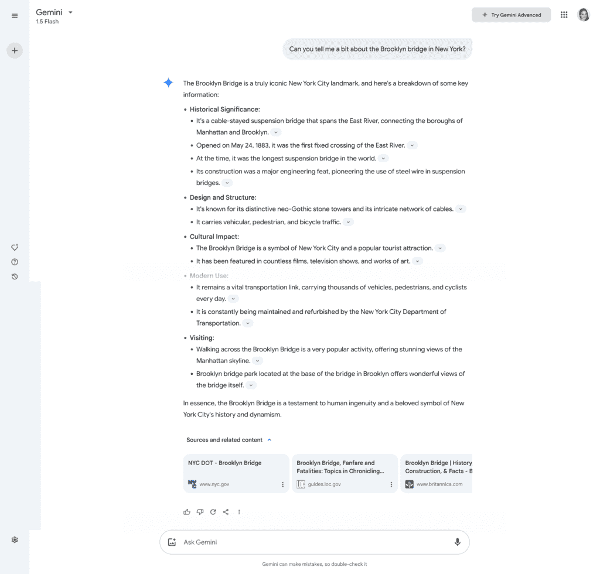
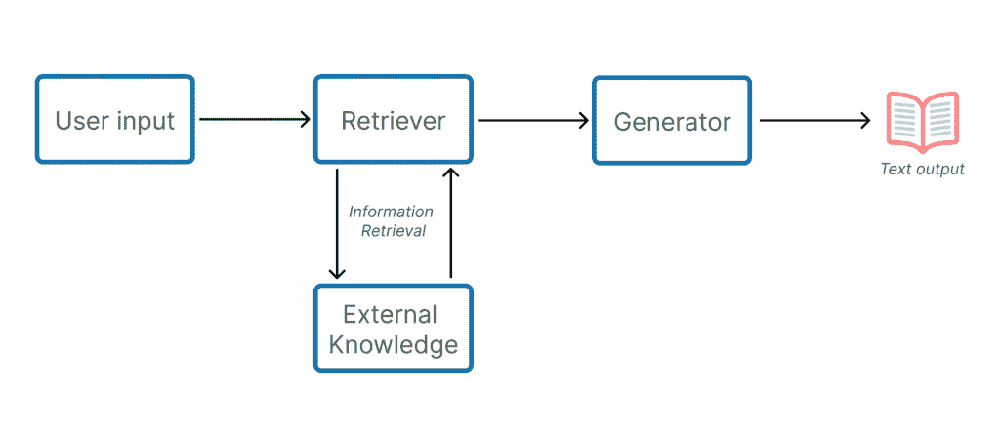

# 检索增强生成（RAG）——简介

> 原文：[`towardsdatascience.com/retrieval-augmented-generation-rag-an-introduction/`](https://towardsdatascience.com/retrieval-augmented-generation-rag-an-introduction/)

*模型开始“幻想”了！* *它之前给我的是不错的答案，然后突然开始幻想*。我们都有听说过或经历过这种情况。

自然语言生成模型有时会“幻想”，即它们开始生成与提供的提示不完全准确文本。用通俗的话说，它们开始“编造”与给定上下文或明显不准确的内容无关的东西。有些幻想可能是可以理解的，例如，提到与主题相关但不完全在讨论的问题，有时它可能看起来像是合法信息，但它只是不正确，是编造的。

当我们开始使用生成模型来完成任务，并打算消费他们生成的信息来做出决策时，这显然是一个问题。

问题不一定与模型生成文本的方式有关，而在于它用于生成响应的信息。一旦你训练了一个 LLM，训练数据中编码的信息就变得固定，它成为模型到那个时间点所知道的一切的静态表示。为了使模型更新其“世界观”或其知识库，它需要重新训练。然而，训练大型语言模型需要时间和金钱。

> 开发 RAG 的主要动机之一是对于事实准确、上下文相关且最新生成内容的需求日益增加。[1]

当考虑让生成模型意识到每天创造的大量新信息时，研究人员开始探索保持这些模型更新的高效方法，而这些方法不需要持续重新训练模型。

他们提出了**混合模型**的概念，即具有获取外部信息方式以补充 LLM 已知和训练数据的生成模型。这些模型具有信息检索组件，允许模型访问最新数据，以及它们已广为人知的生成能力。目标是确保在生成文本时既流畅又准确无误。

这种混合模型架构被称为**检索增强生成，简称 RAG**。

## RAG 时代

考虑到在时间和成本效益方面保持模型更新的关键需求，RAG 已成为越来越受欢迎的架构。

它的检索机制从 LLM 未编码的外部来源中提取信息。例如，当你向 Gemini 询问关于布鲁克林大桥的问题时，你可以在底部看到它从中提取信息的来源。

RAG 模型输出中展示外部来源的示例。（图片由作者提供）

通过将最终输出建立在检索模块获得的信息之上，这些生成式 AI 应用的成果，不太可能传播出源自他们所使用的训练数据过时、点时观点的任何偏见。

RAG 架构的第二部分是我们消费者最直观看到的，即生成模型。这通常是一个处理检索到的信息并生成类似人类文本的 LLM。

> RAG 结合检索机制与生成语言模型以增强输出的准确性[1]。

至于其内部架构，检索模块依赖于密集向量来识别要使用的相关文档，而生成模型则利用基于 transformers 的典型 LLM 架构。

RAG 系统的基本流程及其组件。图片和标题取自[1]中引用的论文（图片由作者提供）

这种架构解决了生成模型的一些非常重要的痛点，但它并非万能药。它也带来了一些挑战和限制。

检索模块可能在**获取最新文档方面遇到困难**。

该架构的这一部分高度依赖于密集段落检索（DPR）[2, 3]。与基于 TF-IDF 的 BM25 等其他技术相比，DPR 在查找查询与文档之间的语义相似性方面做得更好。它利用语义意义，而不是简单的关键词匹配，在开放域应用中特别有用，例如，想想 Gemini 或 ChatGPT 这样的工具，它们不一定是在特定领域的专家，但*知道*一点关于所有事情。

然而，DPR 也有其不足之处。密集向量表示可能导致检索到无关或离题的文档。DPR 模型似乎是根据其参数中已有的知识来检索信息，即，事实必须已经被编码才能被检索访问[2]。

> [...]如果我们将检索的定义扩展到包括导航和阐明模型先前未知或未曾遇到的概念的能力——这种能力类似于人类研究和检索信息的方式——我们的发现表明，DPR 模型在这方面还有不足[2]。

为了减轻这些挑战，研究人员考虑了添加更复杂的查询扩展和上下文消歧。查询扩展是一组技术，通过添加相关术语来修改原始用户查询，目的是在用户查询的意图与相关文档之间建立联系[4]。

也有情况是**生成模块未能充分考虑到检索阶段收集到的信息**。为了解决这个问题，已经对注意力和分层融合技术进行了新的改进[5]。

模型性能是一个重要的指标，尤其是在这些应用的目标是无缝地成为我们日常生活的一部分，并使最平凡的任务几乎毫不费力的时候。然而，**运行 RAG 端到端可能计算成本高昂**。对于用户提出的每个查询，都需要进行一步信息检索，另一步是文本生成。这就是新的技术，如模型剪枝[6]和知识蒸馏[7]发挥作用的地方，以确保即使在搜索训练模型数据之外的最新信息的额外步骤中，整体系统仍然具有性能。

最后，虽然 RAG 架构中的信息检索模块旨在通过访问比模型训练数据更新的外部来源来减轻偏差，**但它实际上可能并不能完全消除偏差**。如果外部来源选择不当，它们可能会继续添加偏差，甚至放大训练数据中存在的偏差。

## 结论

在生成应用中利用 RAG 可以显著提高模型保持更新的能力，并为其用户提供更准确的结果。

当用于特定领域应用时，其潜力更为明显。在更窄的范围内，以及仅与特定领域相关的文档外部库，这些模型能够更有效地检索新信息。

然而，确保生成模型始终是最新的远未是一个已解决的问题。

技术挑战，例如处理非结构化数据或确保模型性能，继续是活跃的研究主题。

希望你喜欢学习更多关于 RAG 的知识，以及这种架构在使生成应用保持更新而不需要重新训练模型中所扮演的角色。

*感谢阅读！*

* * *

# 参考文献

1.  检索增强生成（RAG）的全面调查：演变、当前格局和未来方向。（2024）。沙伊拉·古普塔和拉杰什·拉詹和苏里亚·纳拉扬·辛格。([ArXiv](https://arxiv.org/abs/2410.12837))

1.  检索增强生成：密集篇章检索是否检索。（2024）。本杰明·里奇曼和拉里·赫克— ([链接](https://arxiv.org/html/2402.11035v1))

1.  卡普金，V.，奥古兹，B.，闵，S.，刘易斯，P.，吴，L.，埃德诺夫，S.，陈，D. & 伊，W. T.（2020）。开放域问答的密集篇章检索。在 2020 年自然语言处理实证方法会议（EMNLP）论文集中（第 6769-6781 页）。([Arxiv](https://arxiv.org/abs/2004.04906))

1.  Hamin Koo 和 Minseon Kim 和 Sung Ju Hwang。（2024）。优化 RAG 中的查询生成以增强文档检索。([Arxiv](https://arxiv.org/abs/2407.12325v1))

1.  Izacard, G., & Grave, E. (2021). 利用生成模型进行开放域问答的段落检索。载于欧洲计算语言学协会第 16 届欧洲分会会议论文集：主卷（第 874-880 页）。([Arxiv](https://arxiv.org/abs/2007.01282))

1.  Han, S., Pool, J., Tran, J., & Dally, W. J. (2015). 学习有效神经网络中的权重和连接。载于神经信息处理系统进展（第 1135-1143 页）。([Arxiv](https://arxiv.org/abs/1506.02626))

1.  Sanh, V., Debut, L., Chaumond, J., & Wolf, T. (2019). DistilBERT，BERT 的精简版：更小、更快、更便宜、更轻。ArXiv. /abs/1910.01108 ([Arxiv](https://arxiv.org/abs/1910.01108))
