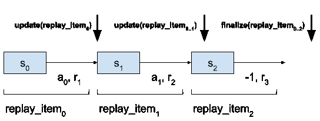
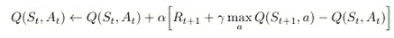
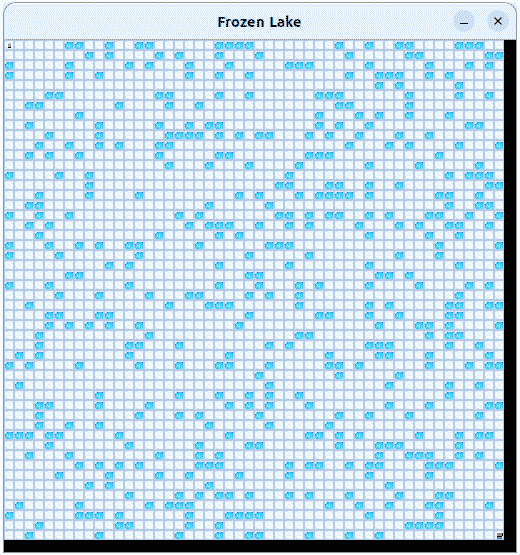
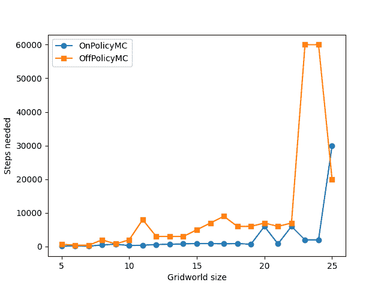
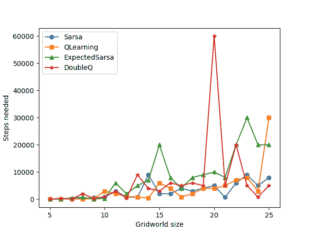
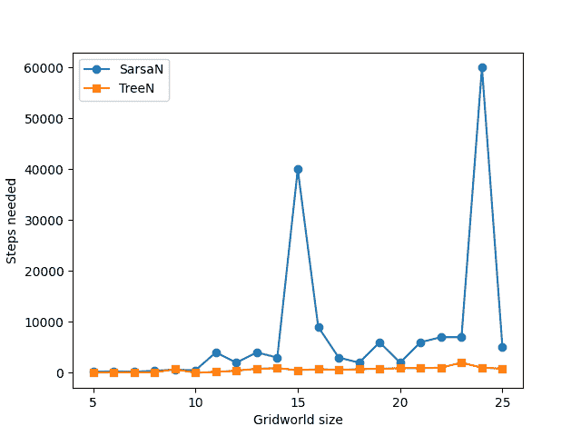
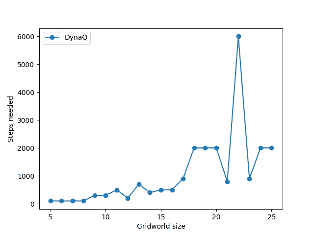
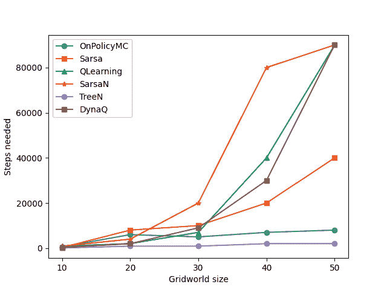

# 重新审视表格强化学习方法基准测试

> 原文：[`towardsdatascience.com/revisiting-benchmarking-of-tabular-reinforcement-learning-methods/`](https://towardsdatascience.com/revisiting-benchmarking-of-tabular-reinforcement-learning-methods/)

<mdspan datatext="el1751303600366" class="mdspan-comment">在</mdspan>发布我关于基准测试表格强化学习（RL）方法的[上一篇文章](https://towardsdatascience.com/benchmarking-tabular-reinforcement-learning-algorithms/)后，我无法摆脱这种感觉，那就是某些地方并不完全正确。结果看起来不对劲，我对它们的结果并不完全满意。

尽管如此，我继续了这个系列文章，将重点转向多玩家游戏和近似解法。为了支持这一点，我一直在重构我们构建的原始框架。新版本更干净、更通用、更易于使用。在这个过程中，它还帮助发现了早期算法中的一些错误和边缘情况问题（关于这一点稍后详述）。

在这篇文章中，我将介绍更新的框架，突出我犯的错误，分享纠正后的结果，并反思学到的关键经验教训，为未来的更复杂实验奠定基础。

更新后的代码可以在[GitHub](https://github.com/hermanmichaels/rl_book)上找到。

## 框架

与代码的前一个版本相比，最大的变化是现在 RL 解决方案方法被实现为**类**。这些类公开了常见的如`act()`（用于选择动作）和`update()`（用于调整模型参数）的方法。

补充这一点，一个**统一的训练脚本**管理着与环境交互：它生成场景并将它们输入到适当的用于学习的方法中——使用那些类方法提供的共享接口。

这次的重构显著简化并标准化了训练过程。之前，每种方法都有自己的独立训练逻辑。现在，训练是集中的，每种方法的角色被明确定义且模块化。

在详细探讨方法类之前，让我们首先看看单玩家环境的训练循环：

```py
def train_single_player(
    env: ParametrizedEnv,
    method: RLMethod,
    max_steps: int = 100,
    callback: Callable | None = None,
) -> tuple[bool, int]:
    """Trains a method on single-player environments.

    Args:
        env: env to use
        method: method to use
        max_steps: maximal number of update steps
        callback: callback to determine if method already solves the given problem

    Returns:
        tuple of success, found policy, number of update steps
    """
    for step in range(max_steps):
        observation, _ = env.env.reset()
        terminated = truncated = False

        episode = []
        cur_episode_len = 0

        while not terminated and not truncated:
            action = method.act(observation, step)

            observation_new, reward, terminated, truncated, _ = env.step(
                action, observation
            )

            episode.append(ReplayItem(observation, action, reward))
            method.update(episode, step)

            observation = observation_new

            # NOTE: this is highly dependent on environment size
            cur_episode_len += 1
            if cur_episode_len > env.get_max_num_steps():
                break

        episode.append(ReplayItem(observation_new, -1, reward, []))
        method.finalize(episode, step)

        if callback and callback(method, step):
            return True, step

    env.env.close()

    return False, step
```

让我们可视化一个完成的场景看起来是什么样子——以及在这个过程中何时调用`update()`和`finalize()`方法：



图片由作者提供

在每个重放项被处理——包括状态、采取的动作和收到的奖励——之后，调用方法的`update()`函数来调整模型的内部参数。这个函数的具体行为取决于所使用的算法。

为了给您一个具体的例子，让我们快速看看这是如何应用于**Q 学习**的。

回想一下 Q 学习的更新规则：



图片来自[1]

当第二次调用`update()`时，我们有 S[t] = s[1], A[t] = a1 和 R[t+1] = r[2]。

使用这些信息，Q 学习代理相应地更新其价值估计。

**不支持的方法**

**动态规划（DP）**方法不适合上述引入的结构——因为它们基于遍历环境中的所有状态。因此，我们保留它们的代码不变，并以不同的方式处理它们的训练。

此外，我们完全移除了对**优先级遍历**的支持。同时，在这里我们需要以某种方式遍历状态来找到前驱状态，这再次——不适合我们的更新训练结构——更重要的是，对于更复杂的多人游戏来说，状态的数量更大，遍历更困难。

由于这种方法无论如何都没有产生好的结果，我们专注于剩余的方法。注意：对于 DP 方法也进行了类似的推理：这些方法不能轻易扩展到多人游戏，因此在未来将不太受关注。

## 错误

错误无处不在，这个项目也不例外。在本节中，我将突出一个特别有影响的错误，该错误出现在上一篇文章的结果中，以及一些小的更改和改进。我还会解释这些如何影响早期结果。

**不正确的动作概率计算**

一些方法需要在更新步骤中选择动作的概率。在较早的代码版本中，我们有：

```py
def _get_action_prob(Q: np.ndarray) -> float:
        return (
            Q[observation_new, a] / sum(Q[observation_new, :])
            if sum(Q[observation_new, :])
            else 1
        )
```

这**仅适用于严格正的 Q 值**，但当 Q 值为负时就会崩溃——使归一化无效。

修正版本使用 softmax 方法正确处理正负 Q 值：

```py
def _get_action_prob(self, observation: int, action: int) -> float:
        probs = [self.Q[observation, a] for a in range(self.env.get_action_space_len())]
        probs = np.exp(probs - np.max(probs))
        return probs[action] / sum(probs)
```

这个错误对**期望 SARSA**和**n 步树备份**产生了重大影响，因为它们的更新严重依赖于动作概率。

**贪婪动作选择中的平局处理**

以前，在生成剧集时，我们要么选择贪婪动作，要么使用ε-greedy 逻辑随机采样：

```py
def get_eps_greedy_action(q_values: np.ndarray, eps: float = 0.05) -> int:
    if random.uniform(0, 1) < eps or np.all(q_values == q_values[0]):
        return int(np.random.choice([a for a in range(len(q_values))]))
    else:
        return int(np.argmax(q_values))
```

然而，这并没有正确处理**平局**，即当多个动作共享相同的最大 Q 值时。更新的`act()`方法现在包括公平的平局处理：

```py
def act(
        self, state: int, step: int | None = None, mask: np.ndarray | None = None
    ) -> int:
        allowed_actions = self.get_allowed_actions(mask)
        if self._train and step and random.uniform(0, 1) < self.env.eps(step):
            return random.choice(allowed_actions)
        else:
            q_values = [self.Q[state, a] for a in allowed_actions]
            max_q = max(q_values)
            max_actions = [a for a, q in zip(allowed_actions, q_values) if q == max_q]
            return random.choice(max_actions)
```

一个小的变化，但可能相当相关——因为例如，这刺激了每次训练开始时的更探索性的动作选择，此时所有 Q 值都相等。

这个小的变化可能会有明显的影响——尤其是在训练的早期，当所有 Q 值都初始化为相等时。它鼓励在关键早期阶段采取更多样化的探索策略。

如前所述——并且我们将在下面再次看到——强化学习（RL）方法表现出高方差，这使得这种变化的影响难以精确测量。然而，这种调整似乎**略微提高了**几种方法的性能：**Sarsa**、**Q-learning**、**Double Q-learning**和**Sarsa-n**。

## 更新后的结果

现在我们来检查更新后的结果——为了完整性，我们包括所有方法，而不仅仅是改进的方法。

但首先，让我们快速回顾一下我们正在解决的问题：我们使用 Gymnasium 的**GridWorld**环境[2]——本质上是一个迷宫解决任务：



图片由作者提供

代理必须从网格的左上角导航到底部右部，同时避免冰冻的湖泊。

为了评估每种方法的性能，我们调整网格世界的大小，并测量**更新步骤直到收敛**的数量。

**蒙特卡洛方法**

这些方法没有受到最近实现更改的影响，因此我们观察到与早期发现一致的结果：

+   它们都能解决大小为**25×25**的环境。

+   **在策略 MC**的表现略好于离策略。



图片由作者提供

**时间差分方法**

对于这些，我们测量以下结果：



图片由作者提供

对于这些，我们立即注意到由于修复了上述关于计算动作概率的 bug，Expected Sarsa 现在表现更好。

但其他方法的表现也好：如上所述，这可能是偶然/方差——或者是我们所做的其他一些小改进的结果，特别是动作选择中更好的处理平局。

**TD-n**

对于 TD-n 方法，我们的结果看起来大不相同：



图片由作者提供

Sarsa-n 也有所改进，可能是因为与上一节讨论的类似原因——但特别是 n 步树备份现在表现非常好——证明在正确的动作选择下，这确实是一个非常强大的解决方案。

**规划**

对于规划，我们只剩下 Dyna-Q——它似乎也有所改进：



图片由作者提供

**比较大型环境中的最佳解决方案方法**

现在，让我们在一个图表中可视化所有类别中表现最佳的方法。由于移除了一些方法如 DP，我现在选择了在策略 MC、Sarsa、Q-learning、Sarsa-n、n 步树备份和 Dyna-Q。

我们首先展示大小为 50 x 50 的网格世界的测试结果：



图片由作者提供

我们观察到**在策略 MC**表现出人意料的出色——与早期发现一致。其优势可能源于其**简单性和无偏估计**，这对于短到中长度的剧集非常有效。

然而，与之前的帖子不同，**n 步树备份**明显成为表现最佳的方法。这与理论相符：它使用预期的多步备份，使得**平滑且稳定的值传播**成为可能，结合了离策略更新的优势与在策略学习的稳定性。

接下来，我们观察到中间的一个集群：**Sarsa、Q-learning 和 Dyna-Q**——其中**Sarsa**略胜一筹。

令人有些惊讶的是，Dyna-Q 中的基于模型的更新并没有带来更好的性能。这可能会指向模型精度或使用的规划步骤数量的限制。**Q-learning**由于其离策略性质引入的方差增加，往往表现不佳。

在这个实验中，**表现最差的方法**是**Sarsa-n**，这与之前的观察一致。我们怀疑性能下降是由于 n 步采样没有对动作进行期望，导致**方差和偏差**增加。

在这个设置中，MC 方法优于 TD 方法仍然有些令人意外——传统上，TD 方法在大型环境中预期表现会更好。然而，在我们的设置中，这通过**奖励塑造策略**得到了缓解：当智能体接近目标时，我们在每一步提供一个小正奖励。这缓解了 MC 的一个主要弱点——在稀疏奖励设置中的表现不佳。

## 结论与收获

在这篇文章中，我们分享了本系列中开发出的强化学习框架的更新。在众多改进的同时，我们修复了一些 bug——这显著提升了算法性能。

我们随后将更新的方法应用于越来越大的 GridWorld 环境，以下是我们发现的结果：

+   **n 步树备份**由于其预期的多步更新，结合了在线和离线学习的优点，成为整体最佳方法。

+   **蒙特卡洛方法**随后出现，由于它们的无偏估计和中间奖励引导学习，表现出惊人的强大性能。

+   一系列**TD 方法**——Q-learning、Sarsa 和 Dyna-Q——随后出现。尽管 Dyna-Q 具有基于模型的更新，但它并没有显著优于其无模型对应版本。

+   **Sarsa-n**表现最差，可能是由于采样 n 步回报引入的累积偏差和方差。

感谢您阅读这篇更新！请继续关注后续内容——接下来，我们将介绍**多人游戏和环境**。

## 本系列的其他文章

+   第一部分：[强化学习简介及解决多臂老虎机问题](https://towardsdatascience.com/introduction-to-reinforcement-learning-and-solving-the-multi-armed-bandit-problem-e4ae74904e77/)

+   第二部分：[介绍马尔可夫决策过程、设置 Gymnasium 环境和通过动态规划方法解决它们](https://towardsdatascience.com/introducing-markov-decision-processes-setting-up-gymnasium-environments-and-solving-them-via-e806c36dc04f)

+   第三部分：[解决强化学习问题的蒙特卡洛方法](https://towardsdatascience.com/monte-carlo-methods-for-solving-reinforcement-learning-problems-ff8389d46a3e)

+   第四部分：[时间差分学习：结合动态规划和蒙特卡洛方法进行强化学习](https://towardsdatascience.com/temporal-difference-learning-combining-dynamic-programming-and-monte-carlo-methods-for-e0c2f0829a51/)

+   第五部分：[介绍 n 步时序差分方法](https://towardsdatascience.com/introducing-n-step-temporal-difference-methods-7f7878b3441c/)

+   第六部分：[强化学习中的规划和学习](https://medium.com/data-science-collective/planning-and-learning-in-reinforcement-learning-68de9bce815d)

+   第七部分：[基准测试表格强化学习算法](https://towardsdatascience.com/benchmarking-tabular-reinforcement-learning-algorithms/)

## 参考文献

[1] [`incompleteideas.net/book/RLbook2020.pdf`](http://incompleteideas.net/book/RLbook2020.pdf)

[2] [`gymnasium.farama.org/`](https://gymnasium.farama.org/)
