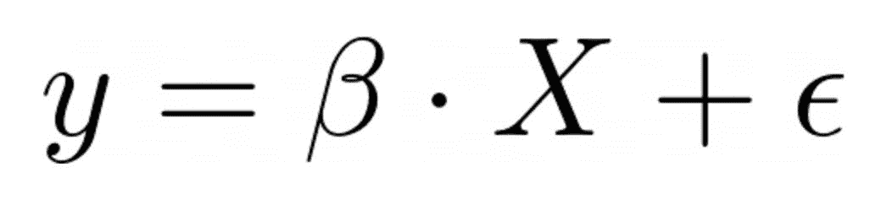
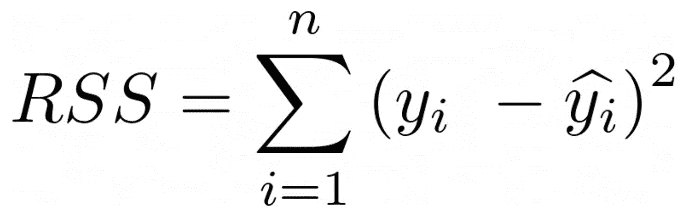
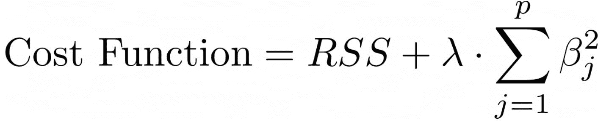
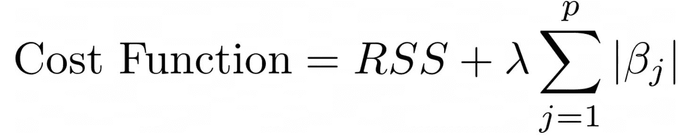
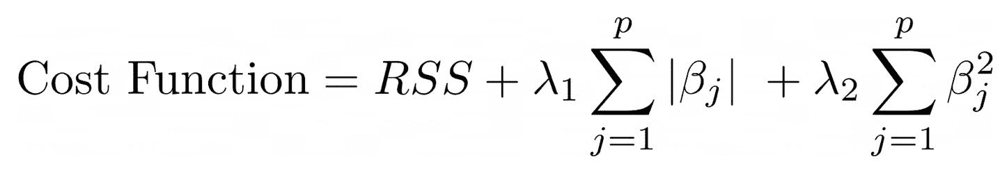

# 岭回归：通往可靠预测的稳健途径

> 原文：[`towardsdatascience.com/ridge-regression-a-robust-path-to-reliable-predictions-851290bed579/`](https://towardsdatascience.com/ridge-regression-a-robust-path-to-reliable-predictions-851290bed579/)

图片由[Nicolas J Leclercq](https://unsplash.com/@nicolasjleclercq?utm_source=medium&utm_medium=referral)在[Unsplash](https://unsplash.com?utm_source=medium&utm_medium=referral)提供

在训练有意义的机器学习模型时，必须始终考虑过拟合问题。存在这个问题时，模型对训练数据适应过度，因此，对新出现的未见数据只能提供较差的预测。岭回归，也称为 L2 正则化，在训练线性回归时为解决这个问题提供了一个有效的解决方案。通过包括一个额外的系数，即所谓的正则化参数，这个架构防止回归系数过大，从而降低了过拟合的风险。

在以下文章中，我们将探讨岭回归及其数学原理。我们还将详细探讨如何解释结果，并突出与其他正则化方法的不同之处。最后，我们将通过一个简单的示例逐步解释如何在 Python 中实现岭回归。

## 岭回归是什么？

岭回归是对[线性回归](https://databasecamp.de/en/ml/linear-regression-basics)的一种改进，它扩展了一个额外的正则化项以避免[过拟合](https://databasecamp.de/en/ml/overfitting-en)。与经典线性回归不同，经典线性回归被训练以创建一个最优模型，该模型最小化预测值与实际数据之间的残差，岭回归也考虑了回归系数的大小，并试图防止单个非常大的模型系数。

通过避免非常大的系数，模型从训练数据中学习过于复杂关系的可能性较小，从而降低了过拟合的风险。相反，正则化参数有助于回归更好地泛化，即识别数据中的潜在结构，从而也能在新出现的未见数据上提供更好的结果。

## 岭回归在数学上是什么样的？

岭回归基于经典的线性回归，它试图学习线性回归方程的参数。例如，这个回归方程看起来是这样的：

这里是：

+   ***y*** 是模型应该预测的目标变量，例如最优属性值或汽车的平均燃油消耗。

+   ***X*** 包含数据集中可能解释目标变量大小的值，例如房产中的房间数量或发动机中的气缸数量。

+   ***β*** 是所谓的回归系数，在训练过程中学习得到，并在数学上描述了 ***X*** 和 ***y*** 之间的关系。例如，系数为 60,000 可能意味着每增加一个房间，该属性的价值会增加 €60,000。

+   ***ε*** 是一个误差项，它衡量模型预测值与实际值之间的偏差。例如，如果数据集没有包含预测所需的所有相关属性，这种情况可能会发生。在房地产示例中，住宅单元的年龄可能是确定价格的决定性因素。如果这个因素没有包含在数据集中，模型可能无法准确预测价格。

线性回归的目的是现在以这种方式学习 ***β*** 的值，即最小化残差平方和（RSS），即预测值 ŷᵢ 和实际值 yᵢ 之间的平方差：

L2 正则化现在向这个残差平方和添加了一个额外的惩罚项，目的是确保单个回归系数不会变得过大。从数学上看，岭回归正则化如下所示：

这里是：

+   RSS 是残差平方和，如从线性回归中已知。

+   ***λ*** 是 [正则化](https://databasecamp.de/en/ml/regularization) 参数，它决定了正则化的影响强度。我们将在下一节中探讨其含义。

+   求和项包含所有平方回归系数的总和。一方面，平方确保所有回归系数都具有正号，因此对成本函数有负影响；另一方面，非常大的值由于平方而变得更加重要。

由于这种结构，正则化项对成本函数有整体负影响。然而，如果个别系数变得非常大，这比参数增长不多时要强烈得多。因此，模型在训练过程中被激励保持模型系数尽可能小，因为这是唯一最小化成本函数的方法。

## 正则化参数 ***λ*** 的作用是什么？

正则化参数 ***λ*** 是岭回归中的一个决定性因素，它控制着模型在回归系数增加过多时受到的惩罚强度。由于该参数必须始终为正，因此可以区分以下两种情况：

+   ***λ*** = 0：在这个特殊情况下，正则化项被消除，岭回归对应于经典的线性回归。因此，模型的行为相应地，只专注于最小化残差平方和，而不考虑系数的大小。这增加了过拟合的风险，因为模型可能在训练数据中学习过于复杂的关系。

+   **λ → ∞**：随着***λ***的增加，对模型的惩罚强度增加。结果，回归更多地关注保持系数的大小，而不是减少预测值与实际值之间的偏差。在极限情况下，模型只能通过保持系数接近 0 来达到目标。这导致了一个简单的模型，它不太可能识别数据中的相关性，因此只能提供较差的结果。

选择***λ***是一个关键决策，它显著影响岭回归的性能。在训练之前必须设置一个超参数，并且在训练过程中不能调整。过小的***λ***可能导致过拟合，而过大的***λ***则可能导致模型过于简单，可能无法充分识别潜在的结构。

引入误差项给模型引入了系统误差，即扭曲或[偏差](https://databasecamp.de/en/statistics/bias-en)，这导致模型平滑。此外，模型的[方差](https://databasecamp.de/en/statistics/variance)减少，使其对强烈波动的训练数据不那么敏感，因为系数较小。这些特性增加了模型的一般化能力并降低了过拟合的风险。

## 如何解释岭回归？

岭回归的解释在很多方面遵循线性回归，不同之处在于系数的大小受到正则化参数的显著影响。线性回归的以下原则仍然适用：

1.  系数***β***的大小至关重要，较大的参数表示自变量和因变量之间存在更强的关系。

1.  可以通过根据参数的绝对大小排序来使用距离进行相对比较，以决定哪个自变量对因变量的影响最大。

1.  此外，符号与线性回归中的含义相同。相应地，系数前的负号表示自变量的增加导致因变量的减少，反之亦然。

除了这些相似之处外，还应注意的是，岭回归的正则化参数对系数的大小有决定性的影响。一般来说，由于正则化，岭回归的系数通常比类似线性回归的系数要小。当变量之间存在强烈的共线性时，这种行为尤为明显。由于模型的结构，正则化参数迫使系数更接近于 0，而不是像 lasso 回归那样完全设置为 0。

总体而言，岭回归通过更好地、更均匀地在变量间分配影响，并对强相关变量进行惩罚，在处理多重共线性数据时提供了更好的结果。这通常使得模型比使用相同数据训练的类似线性回归模型更容易解释。此外，可以概括地说，正则化参数***λ***越小，岭回归的结果和解释就越接近于类似线性回归的结果。

## 与其他正则化方法相比，有哪些不同之处？

岭回归是一种旨在防止过拟合的正则化方法。尽管它与 L1 正则化或弹性网络等其他方法有相似之处，但在其效果上也有显著差异。

### 岭回归 vs L1 正则化（lasso）

岭回归是多种正则化技术之一，与 lasso 回归或弹性网络等方法有相似之处。这里的区别主要涉及回归系数的处理以及模型产生的性质。因此，在本节中，我们将探讨 lasso 回归，其结构与岭回归非常相似。

lasso 回归，也称为 L1 正则化，将正则化项中系数的绝对值相加：

正则化参数***λ***在这里具有相同的功能，并决定了正则化的强度。通过将绝对系数相加，与平方值相比，所有系数都因大小而受到相同的惩罚。

由于这种结构上的差异，lasso 回归可以将单个变量的系数完全设置为 0，从而实现变量选择。另一方面，岭回归只是减小所有系数的大小，而不会将它们完全设置为 0。因此，如果所有预测变量都需要保留且存在多重共线性问题，则应首选岭回归。另一方面，如果您想进行额外的变量选择，lasso 回归是合适的，因为它可以通过将系数设置为 0 来从模型中移除单个变量。

### 岭回归 vs 弹性网络

弹性网络通过包含 L1 和 L2 正则化，结合了 lasso 和岭回归的特性。这导致了以下成本函数：

这种结构结合了两种架构的优点，弹性网络特别适合于需要处理变量选择和强相关预测因子的高维数据。参数**λ₁**和**λ₂**也可以用来自定义这两种方法的强度。

## 你如何在 Python 中实现岭回归？

在[scikit-learn](https://databasecamp.de/en/python-coding/scikit-learns)的帮助下，在 Python 中非常容易使用岭回归。在本教程中，我们将查看一个关于加利福尼亚房地产价格的数据集，并尝试训练一个可以非常准确地预测这些价格的模型。

首先，我们导入必要的库。我们导入[NumPy](https://databasecamp.de/en/python-coding/numpy-en)来处理数据集。我们还需要 scikit-learn 来使用岭回归，通过训练-测试分割来训练模型，然后独立评估性能。

我们可以直接从 scikit-learn 数据集中导入数据集，然后分别保存目标变量和具有特征的数据集。然后我们将数据分为训练集和测试集，最后通过对新数据进行预测来评估模型的泛化能力。

一旦我们准备好了数据，我们就可以准备我们已导入的模型。为此，我们将正则化参数设置为 1.0 并初始化模型。然后可以使用训练数据集和训练标签对其进行优化。

我们现在使用训练好的模型来计算测试数据集的预测结果。

我们使用[均方误差](https://databasecamp.de/en/statistics/mean-squared-error)来计算测试数据集预测结果与实际标签之间的偏差。这提供了关于模型预测质量的信息。

正则化参数***λ***是一个必须在训练之前定义的超参数。因此，用不同的参数值训练模型并比较它们的成果是有意义的。在我们的例子中，不同 alpha 值的结果是相同的，所以我们已经选择了正确的 alpha 值。

最后，作为额外的评估，可以使用[Matplotlib](https://databasecamp.de/en/python-coding/matplotlib-en)可视化单个系数及其大小。这有助于了解哪些特征对预测有最大的影响。

如您所见，scikit-learn 只需几行代码就能训练一个功能性的岭回归。通过使用额外的参数，性能可以进一步得到提升。

## 这就是你应该带走的东西

+   岭回归是一种正则化方法，用于在训练线性回归时减少过拟合的风险。

+   在代价函数中添加了一个所谓的正则化项，如果回归系数的大小增加过多，则对模型进行惩罚。此过程防止模型对训练数据适应得太强。

+   通常，Ridge 回归的系数比可比的线性回归的系数要小。除此之外，可以类似地比较模型及其系数。

+   Ridge 回归与 lasso 回归不同，因为它不能将系数设置为零，因此不会选择变量。

+   可以使用 scikit-learn 将 Ridge 回归导入 Python，并且易于使用。
