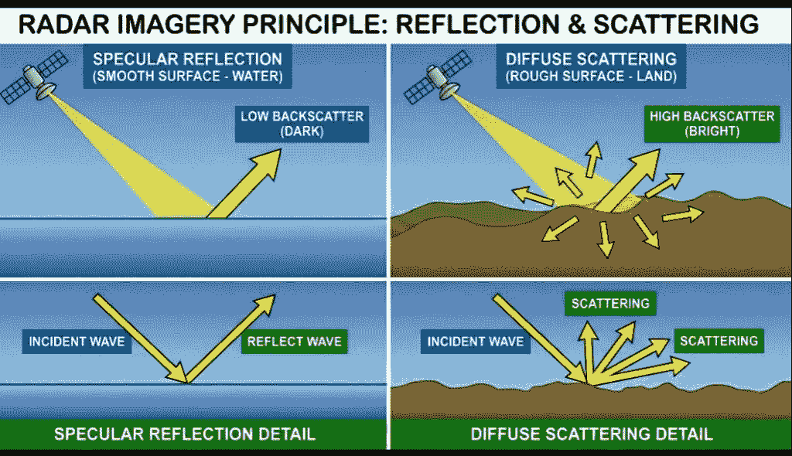
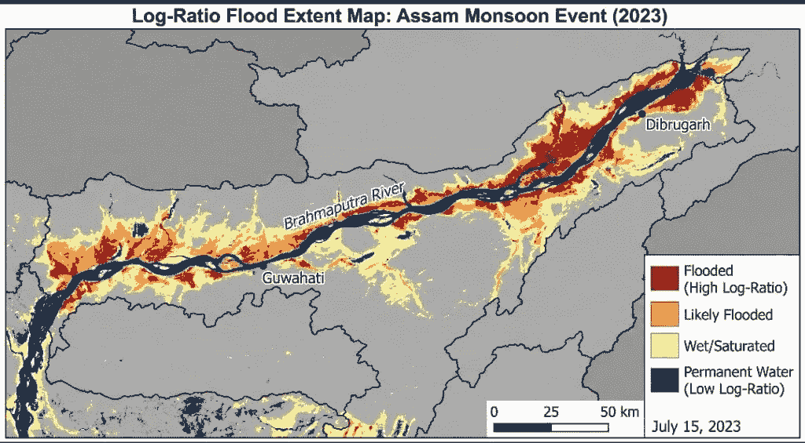

# RISAT 的沉默承诺：利用合成孔径雷达解码灾难

> 原文：[`towardsdatascience.com/risats-silent-promise-decoding-disasters-with-synthetic-aperture-radar/`](https://towardsdatascience.com/risats-silent-promise-decoding-disasters-with-synthetic-aperture-radar/)

<mdspan datatext="el1764118325455" class="mdspan-comment">当我最初开始</mdspan>查看卫星数据时，对我来说，一艘在距离地球几百公里的轨道上运行的航天器实际上能看到我城市中洪水淹没的街道是完全不可能的。洪水非常混乱、肮脏，通常不可预测。然而，在过去几年里，雷达卫星已经变得非常敏感，算法也变得非常智能，现在可以监测通过房屋、田野和河岸的水流。我写这篇文章是为了解释这个技巧是如何工作的。这并不是完美的“AI + 卫星 = 魔法”版本，而是真实的一个，从一个在无数个夜晚看着充满噪声的 SAR（合成孔径雷达）图像，试图弄清楚它们真正含义的人的角度来看。

我的核心信息：要能够实时定位洪水并能够依赖这样的地图，必须超越光学图像，理解 SAR 回波的几何形状。印度的 RISAT（雷达成像卫星）计划是物理学数据管道如何提供及时交付洪水情报的稳定性和天气独立性的一个绝佳例子，这种情报可以在极端灾难情况中使用，例如雨季。

## SAR 数据的奇异美与物理

大多数人将卫星想象成拍照设备，但 SAR 与相机截然不同。它不记录光；实际上，它产生自己的光。在 RISAT 这样的卫星的情况下，这是一个主动操作，卫星向地球发送一束集中的微波，并记录反射回它的小部分能量，这被称为**回波**。

## 为什么水看起来是黑色的（镜面效应）

产生的图像亮度并不是可见光的度量，而是雷达能量如何通过与下表面的相互作用而变化的描述。这种相互作用取决于表面的粗糙程度以及与雷达波长的关系。

+   **干燥、粗糙的表面（植被、城市区域）**：当雷达波击中粗糙表面时，它们会向许多不同的方向散射，就像光线击中皱巴巴的箔片一样。这部分散射能量中有很大一部分返回到卫星→明亮的像素。

+   **平滑水面**：平静的水面就像一面非常光滑的镜子。当雷达波击中它时，几乎会将所有能量反射回卫星，就像镜子以单一方向反射光线一样。只有极小量的能量被发送回传感器 → 暗像素（表示非常低的散射）。

这种穿透黑暗、雨水、尘埃和烟雾的能力，使得 SAR 在多云、高湿度环境中的灾害响应变得不可替代。

展示镜面反射（平静水面）与漫反射（粗糙陆地）的图表。图片由作者提供。

## 核心洪水测绘管道：从回波到地图

SAR 卫星图像不能直接从下载中获得。平均 RISAT 洪水检测过程是一个组织良好、基于物理的数据科学管道。任何在开始时犯的错误都可能破坏所有后续的结果，因此仔细处理非常重要。

### 1. 准备雷达数据

从本质上讲，第一步是改变卫星的原始数据，使其表达有意义的后向散射测量。这一步骤使得图片中的数值成为地球表面的真实表示，可以与其他图片可靠地比较。

### 2. 降低图像噪声

斑纹噪声是 SAR 图像固有的颗粒状、盐粒般的噪声。这种噪声应该以不模糊陆地轮廓的方式减少，特别是陆地和水域之间尖锐的边界。

挑战：不恰当地过度使用噪声减少方法可能会删除小的洪水细节或改变水域边界。方法不够强可能会留下过多的噪声，这可能导致洪水区域识别错误。

解决方案：这是一个清晰的图像结果，适合分析，因为引入了专门的过滤器来平滑噪声部分，同时保留重要的边缘。

### 3. 检测变化：算法的核心

从本质上讲，洪水是地表对雷达能量的反射率发生的主要变化——从明亮的散射陆地表面到暗散射的水面。因此，比较洪水前后的雷达图像，可以确定淹没的确切位置。

最有效的方法之一是确定洪水前后图像之间亮度的变化。那些从陆地变为水域的位置将有巨大的差异，从而几乎完全揭示洪水区域。

### 4. 隔离和细化洪水区域

最后的操作都是关于找到对应于洪水区域的像素，并确保地图正确：

+   阈值化：一种自动方法定位那些变化足够显著，可以被认为是“洪水”的像素。因此，获得洪水区域的第一张地图。

+   使用额外数据：为了提高准确性，我们求助于不同类型的地理数据。例如，我们排除那些始终处于水下（如永久性湖泊或河流）的区域，并且不考虑非常陡峭的斜坡（这些斜坡有时可能因为阴影而被错误地解释为雷达图像中的暗区）。这为我们提供了去除错误检测的方法，并确保最终的洪水地图是准确的。

展示阿萨姆季风事件的对数比洪水范围图。图片由作者提供。

##### 雷达设置和人类干预的细微差别

其中一个比算法影响更大的小决策是选择正确的雷达设置，特别是雷达波发送和接收的方式（称为极化）。

不同的极化配置可以揭示地形的不同方面。在洪水监测方面，通常选择一种特定的极化设置（通常称为 VV 极化），因为它在来自水的暗信号和来自周围陆地的亮信号之间产生了最大的对比度。

## 为什么人类判断仍然优于纯人工智能

在当前的洪水映射操作中，传统方法已被发现比复杂的人工智能模型产生更可靠的结果。这主要是因为传统方法更一致且更具适应性。

+   人工智能挑战：通用人工智能模型在处理雷达数据中的固有噪声方面有困难。此外，当这些模型被转移到新的地理区域时，它们会失败。例如，在一个平坦的城市地区训练的洪水人工智能模型可能不适用于多山的农业河口三角洲。

+   人类优势：即使使用相同的卫星数据，两位专家分析师也可能得出略有不同的洪水地图。这并不是不准确，而是细微差别。分析师将他们的知识应用于：

    +   根据当地设置调整洪水区域（认识到洪水稻田与洪水道路的外观会有所不同）。

    +   权衡寻找所有洪水区域的需要与将非洪水区域误判为洪水区域（误报）的可能性。

虽然人工智能正在逐渐占据优势，但它主要还是处于辅助地位。高级方法利用雷达的可靠物理原理以及人工智能，不仅缩小洪水边界，而且提高细节水平。通过这样做，雷达物理学的理解仍然是首要考虑的因素，而人工智能则用于增强最终产品。

## 结论

RISAT 项目就是这样一项举措，它通过提供一致和可靠的数据来实现这一目标，这些数据对于将洪水混乱转化为可管理和战略性的地理空间情报至关重要。目前，洪水测绘基本上是物理模型、数据处理和人类代理应用地理空间专业知识的最新发展的交汇点。

理解和解释后向散射模式是从对灾难的简单视觉认识到对灾害范围和流动的深入理解的关键步骤，从而允许及时干预。此外，RISAT 和类似举措不应被视为仅位于太空某处的单纯技术设备，而应被视为维持分析师和响应者生态系统和谐运作的不可或缺的工具。也就是说，我们的地图变得越快、越精确，救援队伍就能在更短的时间内动员和执行他们的任务——这是一个完美的例子，说明了数据科学如何成为人类直接资产。

###### 感谢您的访问和阅读。

## 参考文献

1.  *ISRO，“RISAT-1A 任务概述”，(2022)，ISRO 网站。*

1.  *ESA，“Sentinel-1 SAR 处理教程”，(2021)，ESA 文档。*

1.  J*ain, Kumar, Singh。“基于 SAR 的洪水测绘技术：综述”，(2020)，遥感应用。*

1.  *NRSC，“印度洪水危害图集”，(2019)，国家遥感中心报告。*

1.  *Schumann & Moller，“洪水微波遥感”，(2015)，水文杂志。*
