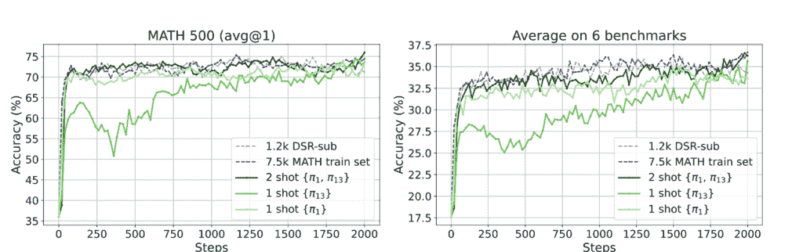

# 从一个例子中进行强化学习？

> 原文：[`towardsdatascience.com/rl-from-one-example-why-1-shot-rlvr-might-be-the-breakthrough-weve-been-waiting-for/`](https://towardsdatascience.com/rl-from-one-example-why-1-shot-rlvr-might-be-the-breakthrough-weve-been-waiting-for/)

<mdspan datatext="el1746057297011" class="mdspan-comment">提示工程本身并不能使我们达到生产阶段。微调成本高昂。而强化学习？直到现在，它一直被保留在资金充足且数据量庞大的实验室中。

微软和学术合作伙伴的新研究颠覆了这一假设。使用**可验证奖励的强化学习（RLVR）**和**单个训练示例**，研究人员实现了与在超过一千个示例上训练的模型相当的结果，有时甚至更好。

这种改进不仅仅是渐进式的进步。它是对我们如何微调大型语言模型（LLMs）以进行推理任务的重新思考。在这篇文章中，我们将解开 1-shot RLVR 是什么，它是如何工作的，以及它对构建数学代理、自动导师和推理副驾驶的开发者意味着什么。

*使用 1 个例子（绿色）的 RLVR 可以与使用数千个示例的数据集（蓝色）表现相当。[来自论文](https://arxiv.org/pdf/2504.20571)。

## 1-Shot RLVR：它是什么？

RLVR 是一种强化学习类型，其中模型使用**可验证的奖励信号**进行训练，通常是基于输出是否正确而基于 0/1。与 RLHF 中使用的奖励模型相比，RLVR 使用硬的真实值。

作者发现，如果你将 RLVR 应用于基础模型（例如，Qwen2.5-Math-1.5B）并在**仅一个精心挑选的数学示例**上对其进行训练，基准任务上的性能可以**几乎翻倍**。

## 令人震惊的数字

当你在仅一个例子上训练 Qwen2.5-Math-1.5B 时，会发生以下情况：

+   **MATH500 准确率**：从**36.0% → 73.6**%提升

+   **平均跨越 6 个数学基准**：从**17.6% → 35.7**%提升

即使使用**两个例子**，在 MATH500 上的准确率也达到了**74.8**%，平均准确率为**36.6**%，略优于所选示例的完整 1.2k 数据集。

这个结果并非偶然。当单独使用时，许多不同的例子产生了 30%或更多的增益。

## 为什么这种方法有效？

这篇论文介绍了几个假设和发现：

1.  **策略梯度损失承担重任**：从训练流程中移除它会导致增益消失，表明它是改进的主要驱动因素。

1.  **熵损失鼓励探索**：即使没有奖励，添加熵正则化也能将性能提升超过 25%。

1.  **后饱和泛化**：在训练示例上的准确率迅速达到 100%，但测试集上的泛化能力仍在提高。

1.  **跨域效应**：一个几何示例也提高了代数和数论的性能。

1.  **自我反思增加**：通过 1 次 RLVR 训练的模型更频繁地使用“重新思考”、“重新检查”和“重新计算”。

## 对开发者的启示

如果您正在构建由 LLM 驱动的推理工具、数学求解器、科学导师或数据代理，这项技术提供了巨大的杠杆作用：

+   **您不需要大数据**：一个示例就能走得很远。

+   **您不需要 OpenAI 的访问权限**：它可以使用像 Qwen 和 LLaMA 这样的开源模型。

+   **您不需要人工标签**：许多示例已经存在于 MATH 或 DeepScaleR 等精心整理的数学数据集中。

想象一下构建一个从单个问题中学习并跨课程泛化的 AI 导师。那个未来已经更近了。

## 不仅仅是数学：早期迁移迹象

作者在 ARC-Challenge 和 ARC-Easy 非数学推理基准上进行了评估。

他们为 Qwen2.5-Math-1.5B 找到了以下结果：

+   **基础模型**：48.0（ARC-E），30.2（ARC-C）

+   **在 1 次 RLVR（π13）之后**：55.8（ARC-E），33.4（ARC-C）

这甚至超过了全数据集 RLVR 的收益。在数学问题上训练有助于模型成为更好的常识推理者。

## 什么是一个好的示例？

使用历史训练方差来选择高影响示例（π1 和π13）效果良好。但令人惊讶的是，**许多示例都有效**，即使那些方差较低的示例。

尚无完美配方，但早期洞察很有希望：

“几乎所有示例在 1 次 RLVR 中使用时都能提高性能。”

## 当一个不够用时

对于某些模型，尤其是像 DeepSeek-R1-Distill-Qwen-1.5B 这样的蒸馏模型，1 次 RLVR 的性能提升更为温和（约 6.9%）。但转向 4 次或 16 次设置则显示出稳定的改进。

这意味着**模型家族和训练历史很重要**，但总体趋势是：*您需要的比我们想象的要少得多*。

## 熵的作用：为什么探索很重要

论文中最令人惊讶的发现之一是，**仅熵损失**，即使没有奖励，也能带来巨大的收益。

示例：仅使用熵损失训练 Qwen2.5-Math-1.5B，将 MATH500 在 20 步内从**36.0%提高到 63.4%**。

这揭示了强大的原则：

让模型更自由地探索有助于它们从单个示例中泛化。

## 1 次 RLVR ≠ 掌握

过度拟合后的泛化可能让人联想到“掌握”，即模型在长时间过度拟合后突然泛化。

但消融研究表明 1 次 RLVR 并不相同：

+   它不依赖于权重衰减。

+   收益是即时且持续的。

+   它似乎与策略梯度和熵驱动的探索有关。

## 未来：更智能的数据，更小的足迹

这篇论文是一个及时的提醒。更多的数据并不总是答案。更好的数据、更好的选择和强化学习，即使是从一个示例开始，也能在您的基模型中解锁强大的能力。

**对于开发者来说**，这意味着

+   您可以用最少的计算构建性能良好的数学代理。

+   您可以使用 RLVR 使用廉价、可验证的奖励微调开源模型。

+   您可以用一个精心选择的问题击败庞大的数据集。
