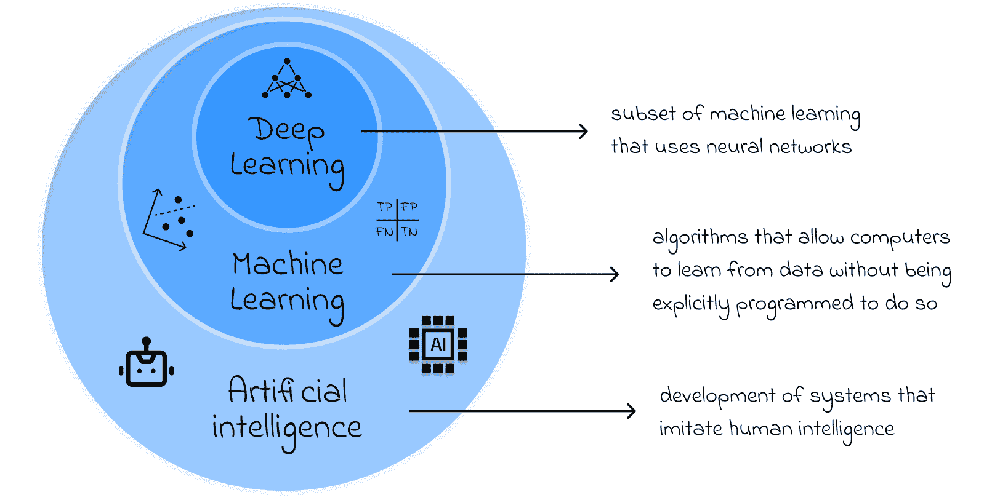
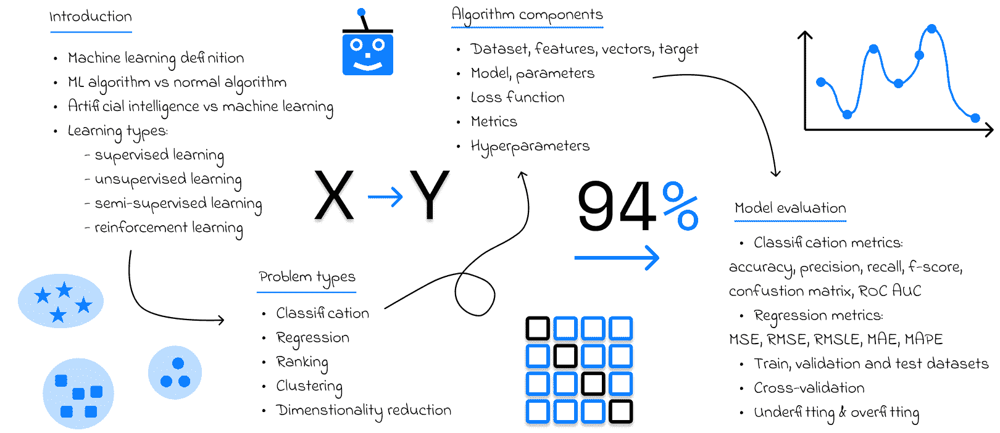
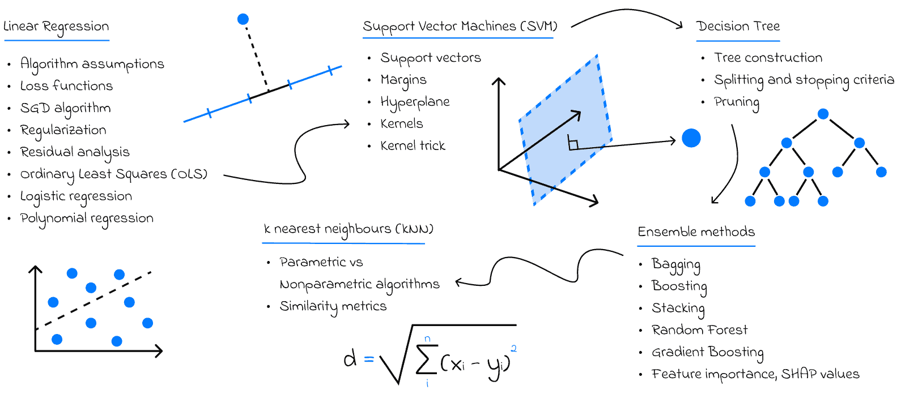
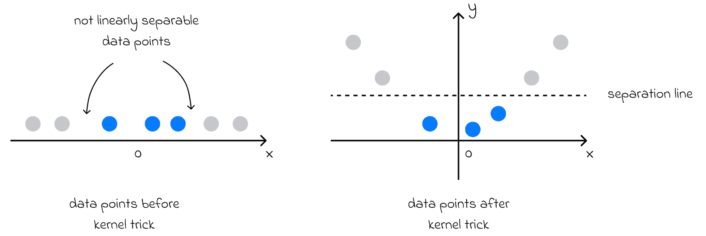
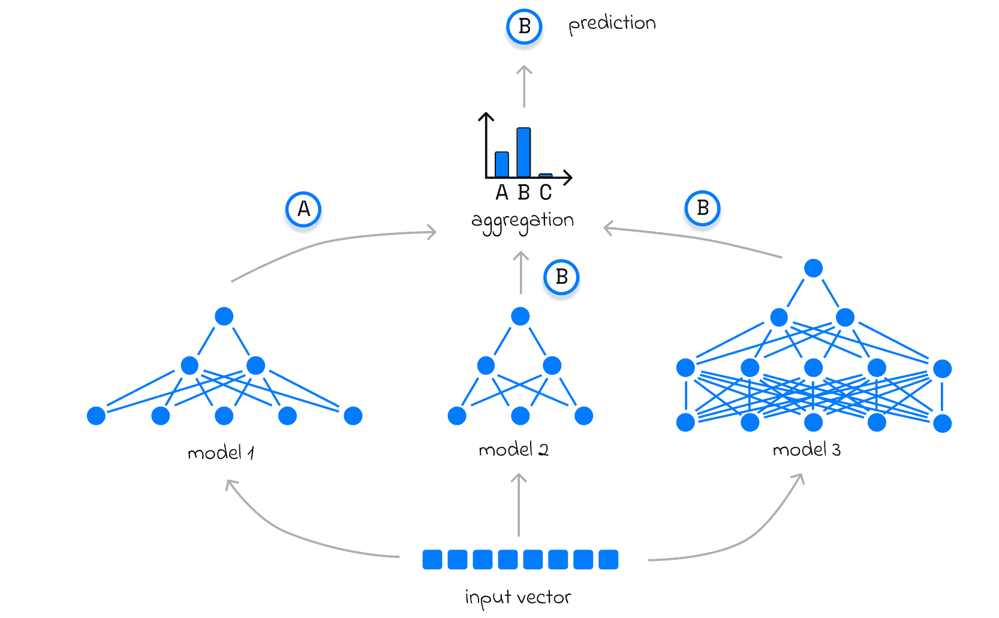
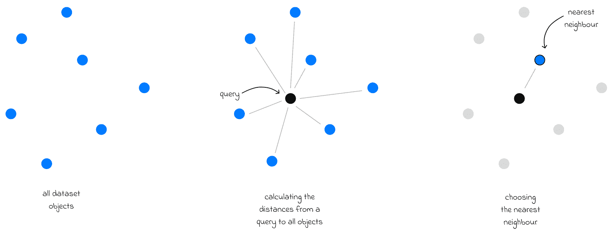
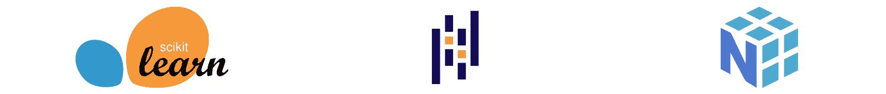
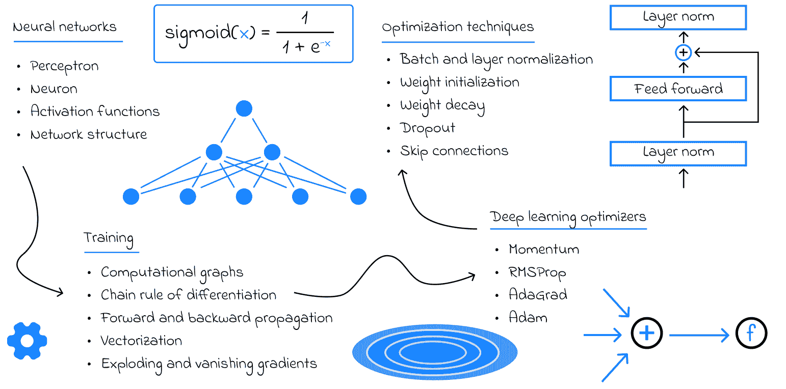

# 成为数据科学家的路线图，第三部分：机器学习

> 原文：[`towardsdatascience.com/roadmap-to-becoming-a-data-scientist-part-3-machine-learning-628248c96cb5/`](https://towardsdatascience.com/roadmap-to-becoming-a-data-scientist-part-3-machine-learning-628248c96cb5/)

## 简介

数据科学无疑是当今最迷人的领域之一。在大约十年前机器学习取得重大突破后，数据科学在技术社区中的受欢迎程度急剧上升。每年，我们都见证了曾经看似不可思议的强大工具。诸如*Transformer 架构*、*ChatGPT*、*检索增强生成（RAG*）框架以及最先进的*计算机视觉模型*——包括*GANs*——对我们世界产生了深远的影响。

然而，随着工具的丰富和围绕人工智能的持续炒作，确定在追求数据科学职业生涯时应该优先考虑哪些技能可能会让人感到不知所措——尤其是对于初学者来说。此外，这个领域要求极高，需要大量的投入和毅力。

本系列的最初两部分专注于获取数据科学家所需的基本数学和软件技能。在本部分中，我们将深入探讨可能是最激动人心的部分，这部分直接触及必要的机器学习技能！

> 本文将专注于开始数据科学职业生涯所需的数学技能。是否根据你的背景和其他因素选择这条道路是值得的，将在另一篇文章中讨论。
> 
> [**成为数据科学家的路线图，第一部分：数学**](https://towardsdatascience.com/roadmap-to-becoming-a-data-scientist-part-1-maths-2dc9beb69b27)
> 
> [**成为数据科学家的路线图，第二部分：软件工程**](https://towardsdatascience.com/roadmap-to-becoming-a-data-scientist-part-2-software-engineering-e2fee3fe4d71)

## 数学 + 工程学 → 机器学习

机器学习是一个非常广泛的领域，但要在这个领域取得成功，必须具备数学和软件工程方面的扎实技能。

+   数学知识加强了对于算法背后逻辑的深入理解，这对于选择更好的解决方案、更容易调试以及掌握更复杂的概念非常有用。

+   软件工程允许使用最佳开发实践，在代码中高效地实现算法和流水线。

人工智能 vs 机器学习 vs 深度学习

## 01. 简介

在直接深入算法之前，有必要理解几个重要的基本模块。首先，是**机器学习**的定义，它与**人工智能**的区别，以及是什么使得机器学习算法与普通算法如此不同。

由于机器学习方法的多样性，区分最重要的方法之间的高级差异是至关重要的：

+   监督学习

+   无监督学习

+   半监督学习

+   强化学习

机器学习入门路线图

之后，学习者应该了解主要的问题类型，包括**分类、回归、排序、聚类、降维、推荐**等。在大多数课程中，最初的焦点通常是**监督学习**及其如何用于解决分类和回归问题。其他学习方法和问题类型通常被视为更高级的主题，并在以后研究。

此外，在学习具体算法之前，学习者应该了解这些算法的输入数据如何表示。特别是，这适用于经常使用的**表格格式**。从一开始就应该清楚**数据集、目标、特征**和**对象**等术语。

最后，本章最后一个重要话题涉及算法的评价。研究主要评价指标和技术是必要的，这样在以后评估给定算法的好坏或比较几个算法时才会感到舒适。

## 02\. 经典机器学习

在机器学习打下坚实基础之后，是时候学习主要针对表格数据的算法了。这些算法不仅在表格数据上得到广泛应用，而且在引入可以用于更复杂算法和领域的智能概念和思想方面也发挥着重要作用。

经典机器学习路线图

首先要研究的算法是**[线性回归](https://medium.com/towards-data-science/linear-regression-from-scratch-e4db8c6d81db)**。在底层，线性回归使用**随机梯度下降（SGD）**，其目标是找到最小化给定损失函数的算法参数。没有 SGD，就难以想象其他优化算法和整个 AI 领域，因为许多算法依赖于 SGD 来找到最优权重。在研究线性回归的同时，这也是熟悉机器学习中常用损失函数的绝佳机会。

接下来是**支持向量机（SVM）**。尽管由于在大型数据集上性能缓慢，SVM 在实践中很少使用，但它仍然引入了有趣的**内核技巧**概念。这允许将最初线性不可分的数据转换到一个新的空间，其中数据点可以很容易地分离。

内核技巧。初始在 1D 空间（左侧）中不可分的数据被转换到了 2D 空间，其中它获得了一个新的维度 y = x²，并变得可分。

值得探索的下一个算法系列是基于树的算法，从**决策树**开始。决策树可以根据每个树节点选择的二进制条件递归地将数据分成两个子集。因此，当给出一个新对象进行预测时，它会通过决策树的整体结构，最终到达对应预测类别的叶节点。

传统上，在决策树之后，下一个主题是**随机森林**，它由一系列决策树组成。鉴于单个决策树可能在预测中出错，随机森林通过构建多个可以进行“投票”以选择最佳预测的树来提高整体系统的性能，从而降低整体错误概率。随机森林中引入的**投票**和**袋装**的概念也可以应用于任何基础算法（不仅仅是决策树），以使整个系统对错误更加鲁棒。

投票示例：输入向量被发送到多个模型，每个模型单独进行预测。最频繁的预测被选为最终输出。

对于表格数据来说，最强大（如果不是最强大）的算法之一是**梯度提升**。与随机森林类似，它结合了多个基础算法，但它以不同的方式做到这一点。梯度提升不是将独立运行的多个强大算法的预测进行汇总，而是创建了一个弱算法的顺序结构。每个后续算法都学习减少先前算法产生的累积误差。*梯度提升最流行的变体使用决策树作为基础算法*。

谈到算法，我最终建议查看**k 近邻（kNN）算法**，作为最佳和最简单的示例之一，展示了参数化算法和非参数化算法之间的基本区别。与之前讨论的参数化算法不同，kNN 不学习任何参数。相反，它依赖于对数据的某些假设，并根据训练数据集中最相似对象的类别来预测新对象的类别。

kNN 算法

同时，学习进行数据分析和处理的技术也是必要的，例如**探索性数据分析（EDA）、特征工程、独热编码**以及解决与**类别不平衡**相关的问题。

最后，另一个重要的概念是**超参数调整**。在这个阶段，了解它是什么以及能够实现代码中的**网格搜索**策略就足够了。网格搜索是调整算法并提高其性能的最简单方法之一。

### 个人建议

> 在学习所有这些算法的同时，了解相同的算法如何调整以用于分类和回归任务也是非常重要的。
> 
> 这些算法对于初学者来说可能一开始看起来很有挑战性，因为它们与计算机科学中使用的经典算法非常不同。获得对这些算法工作流程的深入理解的最佳建议之一是手动在代码中实现它们，而不依赖于任何库。

### 库和框架

在机器学习行业中，大多数时候开发者会使用标准 Python 库中预实现的算法。鉴于这种情况，了解如何在实践中使用它们是很重要的。幸运的是，大多数库提供了一个非常易于理解的接口，因此即使只有基本的编码技能的人也可以训练和使用机器学习模型。

Python 库：Scikit-learn（机器学习）、Pandas（数据分析）、NumPy（线性代数）

本节中讨论的所有算法都在 Python 的 Scikit-learn 包中实现。此外，为了执行基本的数据操作和数据分析，了解 Pandas 是必要的。最后，探索 NumPy 也可能值得，这是一个用于线性代数任务的知名 Python 包。

## 03\. 深度学习

**深度学习**是机器学习的一个子集，它专注于使用**神经网络**解决问题。神经网络通常表示为由感知器组成的全连接层的组合，其中输入层接收数据集特征，然后由中间层进行转换，最终在输出层产生预测结果。

要在处理神经网络时充满信心，理解它们的整个学习过程至关重要。实际上，神经网络可以被视为一个非常复杂的数学函数，具有大量参数。就像线性回归所做的那样，我们可以应用 SGD 算法来执行模型更新，并最终找到最佳的神经网络参数。简单，对吧？

然而，现实情况相当不同，有一个完整的理论是专门用于训练神经网络的，因为简单的 SGD 算法通常是不够的。

深度学习路线图

首先，了解训练神经网络时 **前向和反向传播** 算法的细节，以及它们的 **向量化** 技巧，这些技巧可以应用于加速训练过程。**计算图** 和 **微分链式法则**（应该在 [微积分理论](https://medium.com/towards-data-science/roadmap-to-becoming-a-data-scientist-part-1-maths-2dc9beb69b27) 中更早学习）在反向传播中起着至关重要的作用。

接下来，学习者应该研究不同类型和属性的 **激活函数**，它们将原始的线性神经网络转化为更复杂的数学运算集合，从而能够解决更复杂的问题。

**[深度学习优化器](https://medium.com/towards-data-science/understanding-deep-learning-optimizers-momentum-adagrad-rmsprop-adam-e311e377e9c2)** 和学习率调度器在现代神经网络中也发挥着关键作用，使它们能够更快地收敛到最优解。最重要的优化器是 **动量（Momentum）、RMSProp、AdaGrad 和 Adam**。

由于神经网络结构的复杂性，**梯度消失和梯度爆炸**可能成为阻碍网络学习的重要问题。因此，了解如何处理这种情况至关重要。其中一种方法涉及使用跳跃连接。

最后，为了减少过拟合的风险，有必要应用标准的 **正则化** 技术，这通常包括 **批量归一化、权重衰减和 dropout**。

### 个人建议

> 与经典的机器学习算法相比，我通常建议初学者不要从头开始实现神经网络。

然而，始终深入了解神经网络在实际中是如何工作的是非常好的。问题是，与之前讨论的算法相比，深度学习算法的实现要困难得多，它们可能需要大量的时间，而这些时间本可以更好地用于关注其他理论方面。

> 无论你最终做出什么决定，我相信理解上述深度学习的理论概念至关重要。

### 库和框架

用于处理神经网络的三个最著名的最先进 Python 框架是 PyTorch、TensorFlow 和 Keras。学习者们经常询问他们应该选择这三个中的哪一个来实现自己的网络。

最受欢迎的深度学习框架：PyTorch、TensorFlow、Keras

实际上，在构建神经网络时，使用这三个框架中的哪一个并没有太大的区别，因为它们在基本任务上提供了本质上相同的功能。此外，代码在所有这些框架中看起来几乎完全相同。

如果你在一个使用特定框架的项目上工作，或者你是一名需要非常特定功能（这些功能在其他框架中没有实现）的高级研究人员，那么这可能在将来发挥作用。然而，对于初学者来说，只要开发者理解在构建和后续训练神经网络架构时幕后发生的事情，任何框架都是一个不错的选择。

> Keras 建立在 TensorFlow 之上，为那些刚开始深度学习之旅的人提供了最简单的功能。然而，从长远来看，我会鼓励学习者们在 TensorFlow 和 PyTorch 之间做出选择。

## 结论

在这篇文章中，我们涵盖了每个数据科学家或机器学习工程师都应该知道的必要机器学习理论模块。

如果你已经掌握了如本系列前三篇文章所述的数学、软件工程和机器学习技能，那么你应该有足够的信心认为自己至少是一名初级数据科学家。尽管这是一个重大的成就，但在当今竞争激烈的数据科学市场中找到工作可能仍然具有挑战性。

> 如果你已经到达这个阶段，你现在应该能够挑选并学习更多高级的机器学习主题，这些主题将扩展你的专业知识并有助于你的职业发展。

这些主题和新领域将在本系列的第四部分中讨论。

## 资源

*所有图片除非另有说明，均为作者所有。*
