# 数据科学家职业路线图，第四部分：高级机器学习

> 原文：[`towardsdatascience.com/roadmap-to-becoming-a-data-scientist-part-4-advanced-machine-learning/`](https://towardsdatascience.com/roadmap-to-becoming-a-data-scientist-part-4-advanced-machine-learning/)

## 引言

数据科学无疑是当今最迷人的领域之一。在大约十年前机器学习取得重大突破之后，数据科学在技术社区中的受欢迎程度急剧上升。每年，我们都见证了曾经看似不可思议的强大工具。诸如*Transformer 架构*、*ChatGPT*、*检索增强生成（RAG*）框架以及最先进的*计算机视觉模型*——包括*GANs*——等创新对我们世界产生了深远的影响。

然而，随着工具的丰富和围绕人工智能的持续炒作，确定在追求数据科学职业时应该优先考虑哪些技能可能会让人感到不知所措——尤其是对于初学者来说。此外，这个领域要求极高，需要大量的投入和毅力。

本系列的最初三部分概述了成为数据科学家所需的三项关键技能领域：[数学](https://towardsdatascience.com/roadmap-to-becoming-a-data-scientist-part-1-maths-2dc9beb69b27/)、[软件工程](https://towardsdatascience.com/roadmap-to-becoming-a-data-scientist-part-2-software-engineering-e2fee3fe4d71/)和[机器学习](https://towardsdatascience.com/roadmap-to-becoming-a-data-scientist-part-3-machine-learning-628248c96cb5/)。虽然对经典机器学习和神经网络算法的了解是数据专业人员的良好起点，但为了在更高级的项目中工作，仍有许多重要的机器学习主题必须掌握。

> *本文将专注于开始数据科学职业生涯所需的数学技能。是否根据你的背景和其他因素选择这条道路是值得的，将在另一篇文章中讨论。*

## 学习机器学习方法演变的重要性

> *以下部分提供了关于自然语言处理（NLP）方法演变的信息。*

与本系列之前的文章相比，我决定改变呈现数据科学家所需技能的格式。不是直接列出具体需要发展的能力及其掌握背后的动机，而是简要概述最重要的方法，按它们在过去几十年中在机器学习中发展和应用的时间顺序进行介绍。

原因在于我认为从一开始学习这些算法至关重要。在机器学习中，许多新方法都是建立在旧方法之上的，这在自然语言处理（NLP）和计算机视觉中尤其如此。

例如，在没有任何初步知识的情况下直接跳入现代大型语言模型（LLMs）的实现细节，可能会使初学者很难理解特定机制的动力和基本思想。

*鉴于这一点，在接下来的两个部分中，我将用**粗体**突出显示应该研究的关键概念。*

## # 04\. NLP

**自然语言处理（NLP）**是一个广泛的领域，专注于处理文本信息。机器学习算法不能直接处理原始文本，这就是为什么文本通常需要预处理并转换为数值向量，然后输入到神经网络中。

在转换为向量之前，词语会经历**预处理**，这包括诸如**解析**、**词干提取**、**词形还原**、**规范化**或移除**停用词**等简单技术。预处理后，生成的文本被编码成**标记**。标记代表文档集合中最小的文本元素。通常，一个标记可以是单词的一部分、符号序列或单个符号。最终，标记被转换为数值向量。

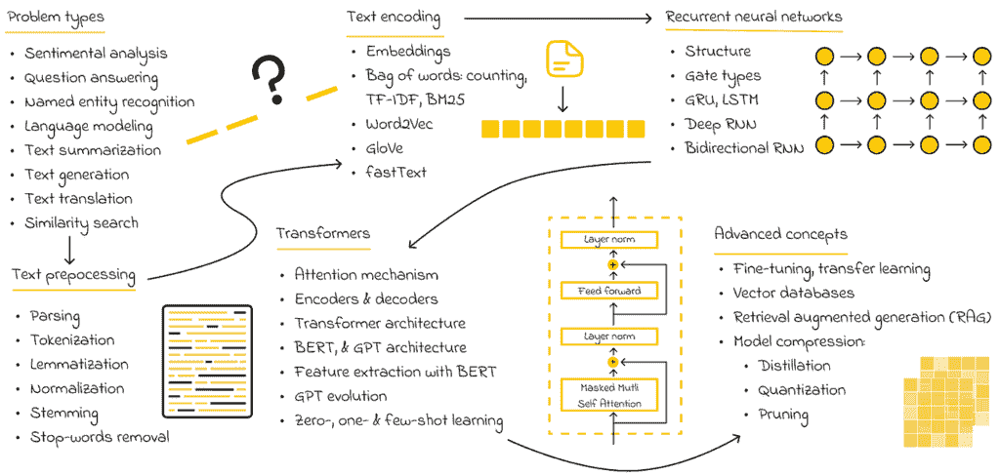

NLP 路线图

**词袋模型**是编码标记的最基本方式，它关注于统计每个文档中标记的频率。然而，在实践中，这通常是不够的，因为还需要考虑标记的重要性——这是在**TF-IDF**和**BM25**方法中引入的概念。虽然 TF-IDF 在词袋模型的简单计数方法上进行了改进，但研究人员已经开发了一种全新的方法，称为嵌入。

**嵌入**是保留词语语义意义的数值向量。正因为如此，嵌入在 NLP 中起着至关重要的作用，使得输入数据可以被训练或用于模型推理。此外，嵌入可以用来比较文本相似度，从而从集合中检索最相关的文档。

> *嵌入也可以用来编码其他非结构化数据，包括图像、音频和视频。*

作为一门学科，自然语言处理（NLP）在过去 10-20 年中迅速发展，以有效地解决各种与文本相关的问题。最初，像文本翻译和文本生成这样的复杂任务是通过使用**循环神经网络（RNNs）**来解决的，这引入了记忆的概念，使得神经网络能够捕捉和保留长文档中的关键上下文信息。

虽然 RNN 的性能逐渐提高，但对于某些任务来说仍然不够理想。此外，RNN 相对较慢，它们的顺序预测过程在训练和推理过程中不允许并行化，这使得它们效率较低。

此外，原始的 Transformer 架构可以分解为两个独立的模块：**BERT**和**GPT**。这两个都是今天用于解决各种 NLP 问题的最先进模型的基础。理解它们的原则是宝贵的知识，有助于学习者在研究或使用其他**大型语言模型（LLMs）**时进一步进步。

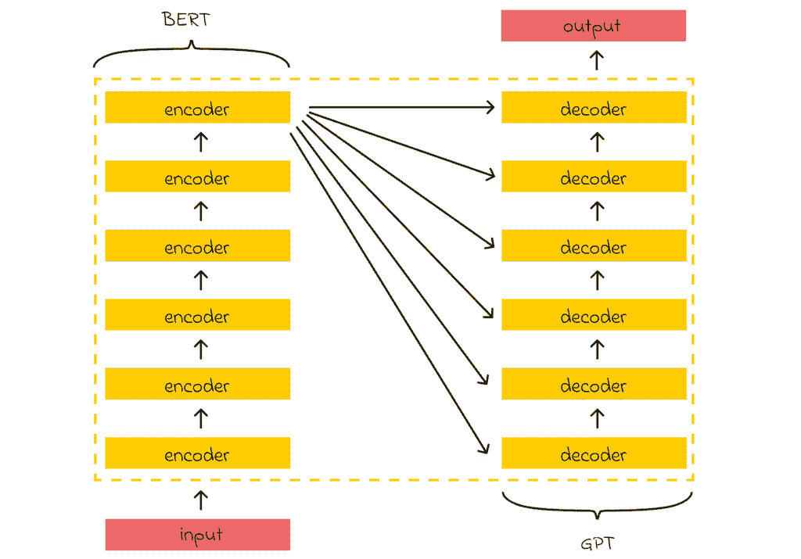

Transformer 架构

当谈到大型语言模型（LLMs）时，我强烈建议研究至少前三个 GPT 模型的发展历程，因为它们对我们今天所知的 AI 世界产生了重大影响。特别是，我想强调 GPT-2 中引入的**少样本**和**零样本学习**的概念，这些概念使 LLMs 能够在没有明确接收任何针对它们的训练示例的情况下解决文本生成任务。

近年来开发的重要技术之一是**检索增强生成（RAG）**。*LLMs 的主要局限性是它们只知道在训练期间使用的上下文。*因此，它们缺乏对其训练数据之外任何信息的了解。

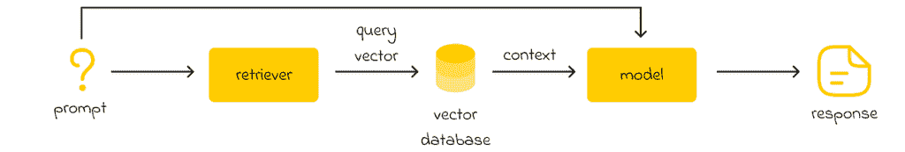

RAG 管道的示例

检索器将输入提示转换为嵌入，然后用于查询向量数据库。数据库根据与嵌入的相似度返回最相关的上下文。然后，检索到的上下文与原始提示结合，并传递给生成模型。该模型处理初始提示和附加上下文，以生成更全面且上下文准确的响应。

> *这一局限性的一个好例子是 ChatGPT 的第一个版本，它在 2022 年的数据上进行了训练，并且对 2023 年及以后发生的事件一无所知。*

为了解决这一限制，OpenAI 的研究人员开发了一个 RAG 管道，该管道包括一个包含来自外部来源新信息的不断更新的数据库。当 ChatGPT 被分配一个需要外部知识的任务时，它会查询数据库以检索最相关的上下文，并将其整合到发送给机器学习模型的最终提示中。

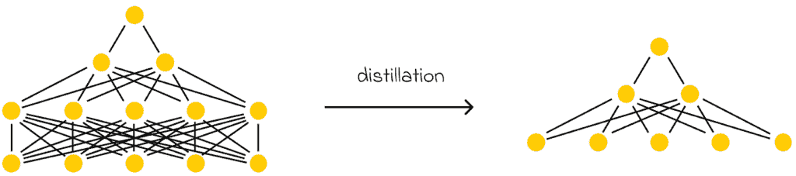

精馏的目标是创建一个更小的模型，可以模仿一个更大的模型。在实践中，这意味着如果一个大型模型做出预测，较小的模型预期会产生类似的结果。

在现代时代，LLM 的发展导致了具有数百万甚至数十亿参数的模型。因此，这些模型的总体大小可能超过标准计算机或小型便携式设备的硬件限制，这些设备带有许多约束。

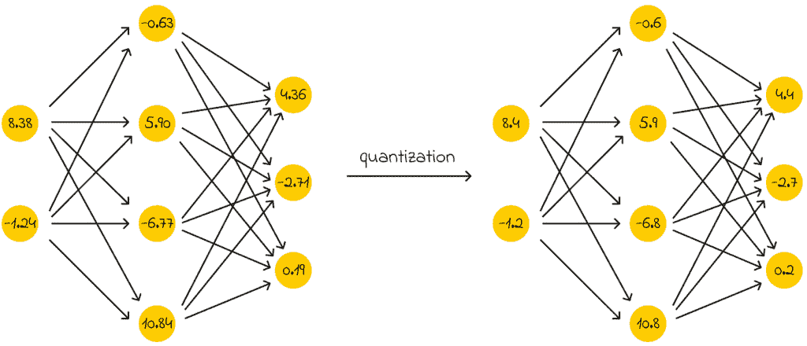

量化是减少存储表示模型权重的数值所需内存的过程。

这就是优化技术变得特别有用的地方，它允许 LLMs 在显著降低性能的情况下进行压缩。今天最常用的技术包括**蒸馏**、**量化**和**修剪**。

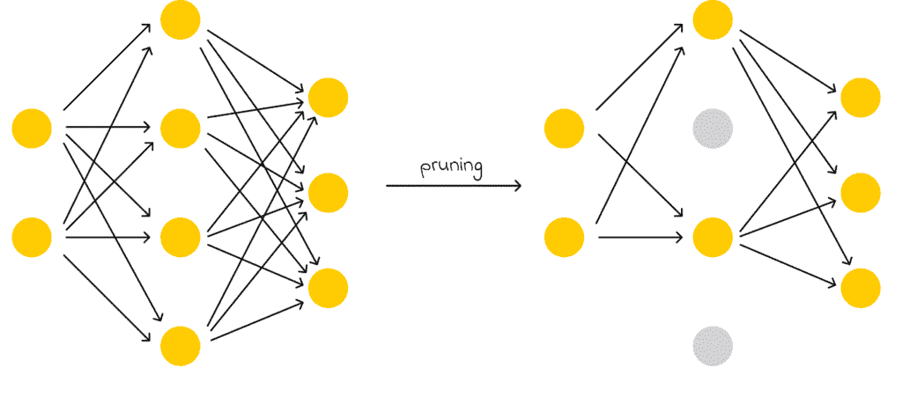

修剪指的是丢弃模型中最不重要的权重。

微调

无论你希望在哪个领域专长，了解**微调**都是一项必备技能！微调是一个强大的概念，它允许你有效地将预训练模型适应新任务。

当与非常大的模型一起工作时，微调特别有用。例如，想象你想使用 BERT 对特定数据集进行语义分析。虽然 BERT 是在通用数据上训练的，但它可能不完全理解你的数据集的上下文。同时，从头开始训练 BERT 以完成你的特定任务将需要大量的资源。

这就是微调发挥作用的地方：它涉及使用预训练的 BERT（或另一个模型）并冻结其一些层（通常是开始的部分）。结果，BERT 被重新训练，但这次只在新提供的数据集上。由于 BERT 只更新其权重的一部分，而新的数据集可能远小于 BERT 训练时的原始数据集，因此微调成为将 BERT 的丰富知识适应特定领域的一种非常有效的技术。

> *微调不仅在自然语言处理（NLP）中广泛使用，而且在许多其他领域也得到应用。*

## # 05. 计算机视觉

如其名所示，**计算机视觉（CV）**涉及使用机器学习分析图像和视频。最常见的任务包括图像分类、目标检测、图像分割和生成。

大多数简历算法都是基于神经网络的，因此详细了解它们的工作原理至关重要。特别是，计算机视觉使用一种称为**卷积神经网络（CNNs）**的特殊网络。这些网络与全连接网络类似，但它们通常从一组称为**卷积**的专用数学运算开始。

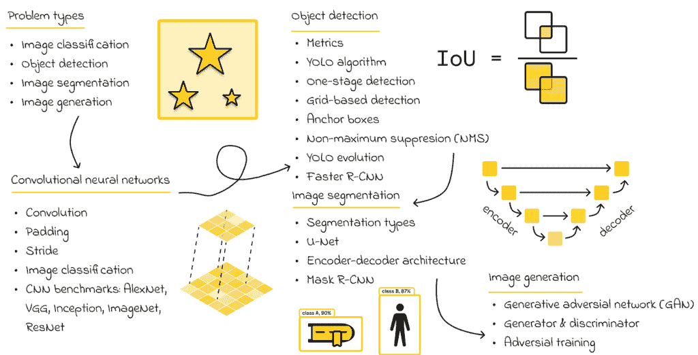

计算机视觉路线图

> *简单来说，卷积充当过滤器，使模型能够从图像中提取最重要的特征，然后将其传递到全连接层进行进一步分析。*

下一步是研究用于分类任务的最流行的 CNN 架构，例如**AlexNet、VGG、Inception、ImageNet**和**ResNet**。

谈到目标检测任务，**YOLO**算法是一个明显的赢家。实际上，没有必要研究 YOLO 的所有几十个版本。实际上，阅读第一版 YOLO 的原始论文就足以理解如何将相对困难的目标检测问题优雅地转化为分类和回归问题。YOLO 中的这种方法也提供了一个很好的直觉，说明如何将更复杂的计算机视觉任务以更简单的术语重新表述。

虽然有许多用于执行图像分割的架构，但我强烈建议学习**UNet**，它引入了编码器-解码器架构。

最后，图像生成可能是计算机视觉（CV）中最具挑战性的任务之一。我个人认为，它对于学习者来说是一个可选的话题，因为它涉及许多高级概念。尽管如此，了解**生成对抗网络（GAN）**如何生成图像的高级直觉是一个拓宽视野的好方法。

> *在某些问题中，训练数据可能不足以构建一个性能良好的模型。在这种情况下，数据增强技术通常被使用。这涉及到从已存在的数据（图像）中人工生成训练数据。通过向模型提供更多样化的数据，它能够学习并识别更多模式。*

## # 06. 其他领域

在一篇文章中详细呈现所有现有机器学习领域的路线图将会非常困难。这就是为什么在本节中，我想简要列举并解释一些其他值得探索的数据科学中最受欢迎的领域。

首先，**推荐系统（RecSys）**在近年来获得了很大的流行度。它们越来越多地应用于在线商店、社交网络和流媒体服务。大多数算法的关键思想是将所有用户和项目的初始大矩阵分解为几个矩阵的乘积，以便将每个用户和每个项目与一个高维嵌入关联起来。这种方法非常灵活，因为它允许对嵌入进行不同类型的比较操作，以找到给定用户最相关的项目。此外，对小型矩阵进行分析比分析原始矩阵（通常具有巨大维度）要快得多。

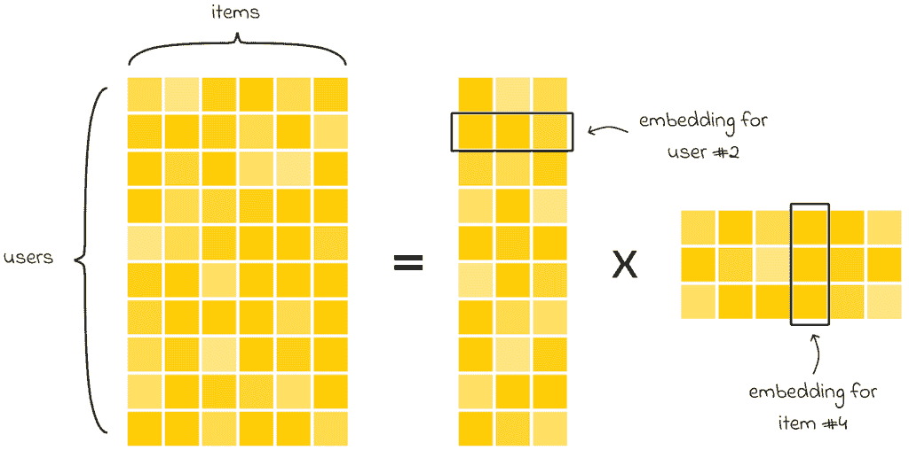

在推荐系统中，矩阵分解是最常用的方法之一。

**排名**通常与推荐系统（RecSys）紧密相关。当推荐系统识别出一组对用户最相关的项目时，排名算法被用来对它们进行排序，以确定它们将被展示或推荐给用户的顺序。一个很好的例子是搜索引擎，它们在网页上从上到下过滤查询结果。

与排序密切相关的是，还有一个**匹配**问题，其目标是将来自两个集合 A 和 B 的对象以最优方式映射，使得平均而言，每个对象对*（a，b）*根据匹配标准映射“良好”。一个用例示例可能包括将一群学生分配到不同的大学学科，其中每个班级的座位数有限。

**聚类**是一个无监督的机器学习任务，其目标是把数据集分割成几个区域（簇），每个数据集对象属于这些簇中的一个。分割标准可能因任务而异。聚类是有用的，因为它允许将相似的对象分组在一起。此外，还可以对每个簇中的对象进行进一步的分析，以分别处理这些对象。

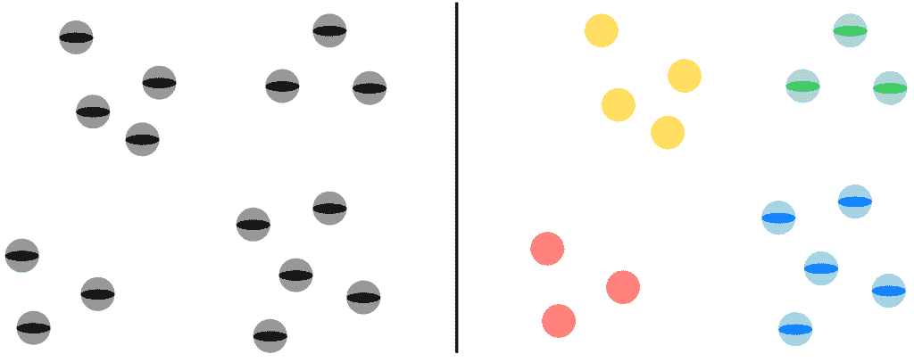

聚类的目标是根据数据集对象（在左侧）的相似性，将它们分组到几个类别（在右侧）中。

**降维**是另一个无监督问题，其目标是压缩输入数据集。当数据集的维度很大时，机器学习算法分析它需要更多的时间和资源。通过识别和删除噪声数据集特征或那些不提供太多有价值信息的特征，数据分析过程变得相当容易。

**相似性搜索**是一个专注于设计算法和数据结构（索引）以优化在大型嵌入（向量数据库）数据库中搜索的领域。更精确地说，给定一个输入嵌入和一个向量数据库，目标是**近似**找到数据库中相对于输入嵌入最相似的嵌入。

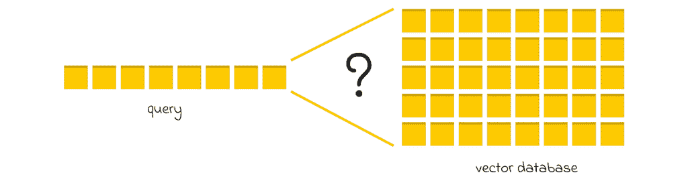

相似性搜索的目标是在向量数据库中相对于查询嵌入，近似找到最相似的嵌入。

“近似”一词意味着搜索不保证 100%精确。尽管如此，这仍然是相似性搜索算法背后的主要思想——牺牲一点准确性以换取预测速度或数据压缩的显著提升。

**时间序列分析**涉及研究目标变量随时间的变化行为。这个问题可以使用经典表格算法来解决。然而，时间的存在引入了新因素，这些因素无法被标准算法捕捉。例如：

+   目标变量可以有一个整体的**趋势**，在长期内其值会增加或减少（例如，由于全球变暖，平均年气温上升）。

+   目标变量可以有一个**季节性**，这使得其值根据当前给定的周期变化（例如，冬季温度较低，夏季温度较高）。

大多数时间序列模型都会考虑这两个因素。一般来说，时间序列模型在金融、股票或人口统计分析中应用得非常广泛。

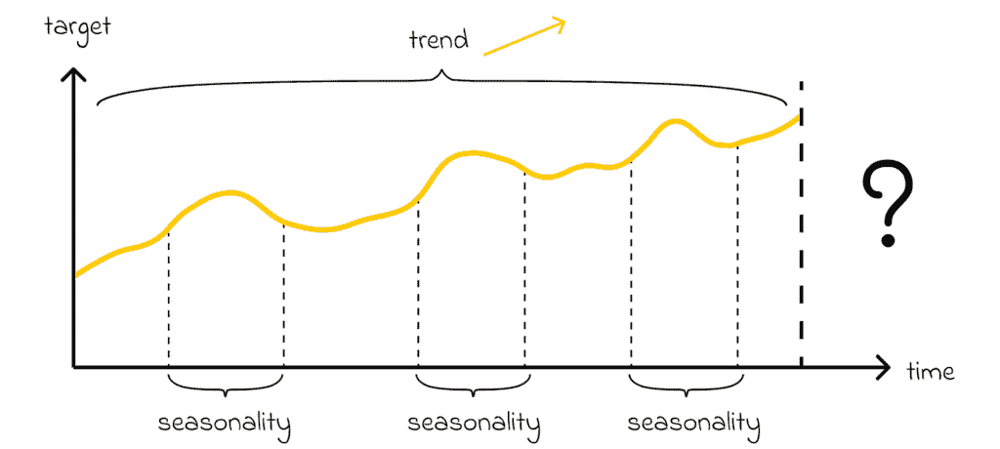

时间序列数据通常分解为几个组成部分，包括趋势和季节性。

我还推荐探索的另一个高级领域是**强化学习**，与经典机器学习相比，它从根本上改变了算法设计。简单来说，其目标是训练一个智能体在环境中根据奖励系统（也称为“试错法”）做出最佳决策。通过采取行动，智能体获得奖励，这有助于它理解所采取的行动是否有积极或消极的影响。之后，智能体稍微调整其策略，整个循环重复。

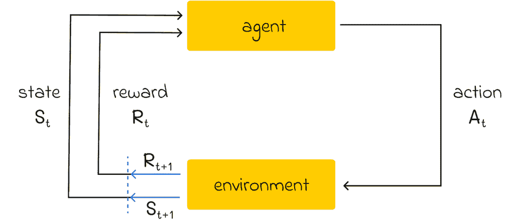

强化学习框架。图片由作者采用。来源：[《强化学习：导论 第二版》 | 理查德·S·萨顿和安德鲁·G·巴托](https://web.stanford.edu/class/psych209/Readings/SuttonBartoIPRLBook2ndEd.pdf)

强化学习在经典算法无法解决问题的复杂环境中特别受欢迎。鉴于强化学习算法的复杂性和所需的计算资源，这个领域尚未完全成熟，但它有很高的潜力在未来获得更多的普及。

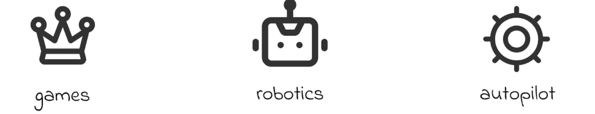

强化学习的主要应用

目前最流行的应用包括：

+   **游戏**。现有方法可以设计出优于人类的最佳游戏策略。最著名的例子是国际象棋和围棋。

+   **机器人技术**。高级算法可以集成到机器人中，帮助它们移动、携带物体或在家庭中完成常规任务。

+   **自动驾驶**。可以开发强化学习方法来自动驾驶汽车、控制直升机或无人机。

## 结论

这篇文章是前一部分的合理延续，并扩展了成为数据科学家所需技能集。虽然大多数提到的主题需要时间来掌握，但它们可以为您的简历增添显著价值。这对于目前需求量大的 NLP 和 CV 领域尤其如此。

> 在达到数据科学的高水平专业知识后，保持动力并持续推动自己学习新主题和探索新兴算法仍然至关重要。

数据科学是一个不断发展的领域，在未来几年，我们可能会见证新的一流方法的发展，这些方法是我们过去无法想象的。

## 资源

+   [《强化学习：导论 第二版》 | 理查德·S·萨顿和安德鲁·G·巴托](https://web.stanford.edu/class/psych209/Readings/SuttonBartoIPRLBook2ndEd.pdf)

*所有图片除非另有说明，均为作者提供。*
