# Python 机器人入门指南

> 原文：[`towardsdatascience.com/robotics-with-python-for-beginners/`](https://towardsdatascience.com/robotics-with-python-for-beginners/)

## 简介

<mdspan datatext="el1760587356728" class="mdspan-comment">**机器人**是机器</mdspan>，可以通过复制或替代人类动作来执行任务和做出决策。**机器人学**是专注于机器设计和构建的科学领域。它是一个多学科的结合：

+   **电气工程**用于传感器和执行器。[传感器](https://en.wikipedia.org/wiki/Robotic_sensors)从环境中收集数据，将物理属性转换为电信号（就像我们的五种感官）。[执行器](https://en.wikipedia.org/wiki/Actuator)将这些信号转换为物理动作或运动（就像我们的肌肉）。

+   **机械工程**用于物理结构的结构和运动。

+   **计算机科学**用于 AI 软件和算法。

目前，[***ROS* (机器人操作系统)**](https://www.ros.org/)是机器人领域的主要框架，它处理机器的所有不同部分（传感器、电机、控制器、摄像头…），其中所有组件以模块化的方式交换数据。*ROS*框架旨在用于真实机器人原型，并且可以使用 Python 和 C++。鉴于其受欢迎程度，许多库建立在*ROS*之上，如[***Gazebo***](https://gazebosim.org/home)，最先进的 3D 模拟器。

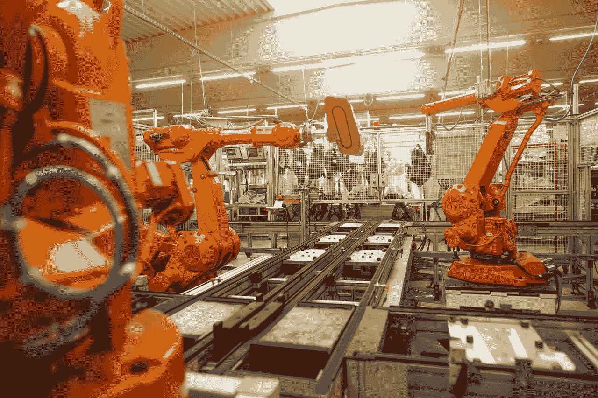

图片由[Simon Kadula](https://unsplash.com/@simonkadula?utm_source=medium&utm_medium=referral)在[Unsplash](https://unsplash.com?utm_source=medium&utm_medium=referral)上拍摄

由于*Gazebo*相当复杂，人们仍然可以在*ROS*生态系统之外学习机器人学的基础知识并构建用户友好的模拟。主要的 Python 库包括：

+   [***PyBullet***](https://pybullet.org/wordpress/)(初学者) — 非常适合实验 URDF（统一机器人描述格式），这是描述机器人身体、部件和几何形状的 XML 模式。

+   [***Webots***](https://cyberbotics.com/)(中级) — 物理更精确，因此可以构建更复杂的模拟。

+   [***MuJoCo***](https://mujoco.org/)(高级) — 真实世界模拟器，用于研究级实验。OpenAI 的[***RoboGYM***](https://github.com/openai/robogym)库建立在*MuJoCo*之上。

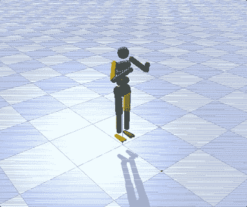

我用*PyBullet*创建了此可视化

由于这是一个面向初学者的教程，我将展示如何使用*PyBullet***构建简单的 3D 模拟**。我将展示一些可以轻松应用于其他类似情况的实用 Python 代码（只需复制、粘贴、运行），并逐行带注释地讲解代码，以便您可以复制此示例。

## 设置

*PyBullet*是游戏、视觉效果、机器人和强化学习中最用户友好的物理模拟器。你可以使用以下命令之一轻松安装它（如果*pip*失败，*conda*应该肯定可以工作）：

```py
pip install pybullet

conda install -c conda-forge pybullet
```

你可以在两种主要模式下运行*PyBullet*：

+   `p.GUI` → 打开一个窗口并实时显示模拟。

+   `p.DIRECT` → 无图形模式，用于脚本。

```py
import pybullet as p

p.connect(p.GUI)  #or p.connect(p.DIRECT) 
```

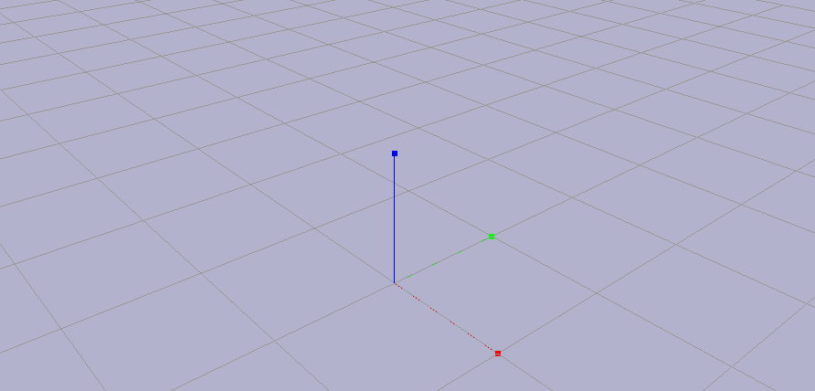

由于这是一个物理模拟器，首先要做的是设置**重力**：

```py
p.resetSimulation()

p.setGravity(gravX=0, gravY=0, gravZ=-9.8)
```

为模拟设置全局重力向量。“-9.8”在 z 轴上表示向下的加速度为[*9.8 m/s²*](https://en.wikipedia.org/wiki/Gravity_of_Earth)，就像在地球上一样。没有这个设置，你的机器人和飞机就会在零重力中漂浮，就像在太空中一样。

## URDF 文件

如果机器人是人体，**URDF** **文件**将是定义其物理结构的骨骼。它是用 XML 编写的，基本上是机器的蓝图，定义了你的机器人看起来像什么以及它如何移动。

我将展示如何创建一个**简单的立方体**，这是*print(“hello world”)*的 3D 等价物。

```py
urdf_string = """"
<robot name="cube_urdf">

  <link name="cube_link">
    <visual>
      <geometry>
        <box size="0.5 0.5 0.5"/> <!-- 50 cm cube -->
      </geometry>
      <material name="blue">
        <color rgba="0 0 1 1"/>
      </material>
    </visual>

    <collision>
      <geometry>
        <box size="0.5 0.5 0.5"/>
      </geometry>
    </collision>

    <inertial>
      <mass value="1.0"/>
      <inertia ixx="0.0001" iyy="0.0001" izz="0.0001"
               ixy="0.0" ixz="0.0" iyz="0.0"/>
    </inertial>
  </link>
</robot>
"""
```

你可以将 XLM 代码保存为 URDF 文件或将其用作字符串。

```py
import pybullet as p
import tempfile

## setup
p.connect(p.GUI)
p.resetSimulation()
p.setGravity(gravX=0, gravY=0, gravZ=-9.8)

## create a temporary URDF file in memory
with tempfile.NamedTemporaryFile(suffix=".urdf", mode="w", delete=False) as f:
    f.write(urdf_string)
    urdf_file = f.name

## load URDF
p.loadURDF(fileName=urdf_file, basePosition=[0,0,1])

## render simulation
for _ in range(240): 
    p.stepSimulation()
```

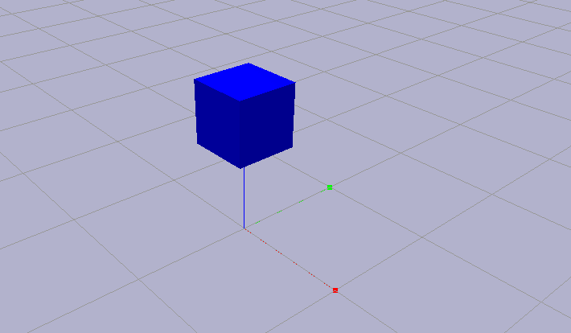

请注意，循环确实运行了 240 步。**为什么是 240？**这是一个在视频游戏开发中常用的固定时间步长，用于提供平滑且响应迅速的体验，而不会过度占用 CPU。60 FPS（每秒帧数）意味着每秒显示 1 帧，这意味着每渲染一帧提供 4 次物理更新。

在之前的代码中，我使用`p.stepSimulation()`渲染了立方体。这意味着模拟不是实时进行的，你可以控制下一次物理步骤何时发生。或者，你也可以使用*time sleep*将其绑定到现实世界时钟。

```py
import time

## render simulation
for _ in range(240):
    p.stepSimulation() #add a physics step (CPU speed = 0.1 second)
    time.sleep(1/240)  #slow down to real-time (240 steps × 1/240 second sleep = 1 second)
```

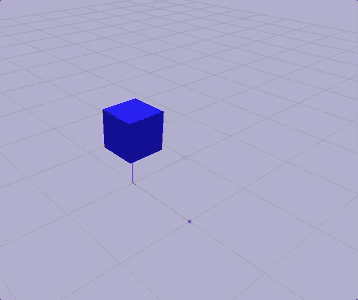

随着时间的推移，机器人的 XML 代码将变得更加复杂。幸运的是，*PyBullet*附带了一系列预设的 URDF 文件。你可以轻松加载默认的立方体，而无需为其创建 XML。

```py
import pybullet_data

p.setAdditionalSearchPath(path=pybullet_data.getDataPath())

p.loadURDF(fileName="cube.urdf", basePosition=[0,0,1])
```

在其核心，URDF 文件定义了两件主要事情：**链接**和**关节**。链接是机器人的实体部分（就像我们的骨骼），而关节是两个刚体链接之间的连接（就像我们的肌肉）。没有关节，你的机器人将只是一个雕像，但有了关节，它就变成了一个具有运动和目的的机器。

简而言之，每个机器人都是通过关节连接的链接树。每个关节可以是固定的（无运动）或旋转（“旋转关节”）和滑动（“滑动关节”）。因此，你需要了解你使用的机器人。

让我们以著名的机器人 R2D2 为例，来自《星球大战》。

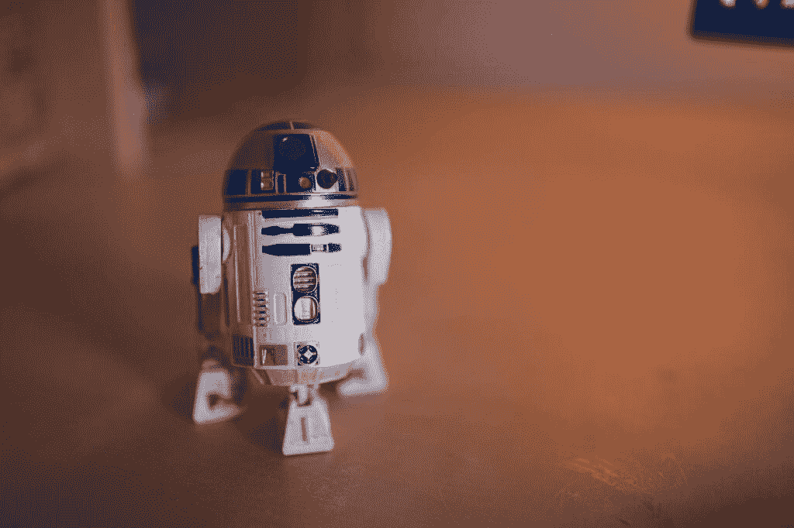

图片由[Alexandr Popadin](https://unsplash.com/@irrabagon?utm_source=medium&utm_medium=referral)在[Unsplash](https://unsplash.com?utm_source=medium&utm_medium=referral)提供

## 关节

这次，我们必须**导入一个平面**来为机器人创建地面。没有平面，物体就没有表面可以碰撞，它们会无限期地坠落。

```py
## setup
p.connect(p.GUI)
p.resetSimulation()
p.setGravity(gravX=0, gravY=0, gravZ=-9.8)
p.setAdditionalSearchPath(path=pybullet_data.getDataPath())

## load URDF
plane = p.loadURDF("plane.urdf")
robo = p.loadURDF(fileName="r2d2.urdf", basePosition=[0,0,0.1])

## render simulation
for _ in range(240):
    p.stepSimulation()
    time.sleep(1/240)

p.disconnect()
```

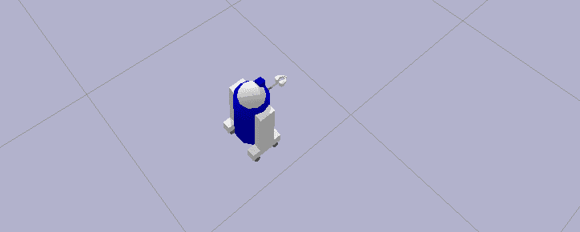

在使用机器人之前，我们必须了解其组件。*PyBullet*已经标准化了信息结构，因此你导入的每个机器人都应始终由相同的**17 个通用属性**定义。由于我只是想运行一个脚本，我将不使用图形界面连接到物理服务器（`p.DIRECT`）。分析关节的主要函数是`p.getJointInfo()`。

```py
p.connect(p.DIRECT)

dic_info = {
    0:"joint Index",  #starts at 0
    1:"joint Name",
    2:"joint Type",  #0=revolute (rotational), 1=prismatic (sliding), 4=fixed
    3:"state vectorIndex",
    4:"velocity vectorIndex",
    5:"flags",  #nvm always 0
    6:"joint Damping",  
    7:"joint Friction",  #coefficient
    8:"joint lowerLimit",  #min angle
    9:"joint upperLimit",  #max angle
    10:"joint maxForce",  #max force allowed
    11:"joint maxVelocity",  #max speed
    12:"link Name",  #child link connected to this joint
    13:"joint Axis",
    14:"parent FramePos",  #position
    15:"parent FrameOrn",  #orientation
    16:"parent Index"  #−1 = base
}
for i in range(p.getNumJoints(bodyUniqueId=robo)):
    print(f"--- JOINT {i} ---")
    joint_info = p.getJointInfo(bodyUniqueId=robo, jointIndex=i)
    print({dic_info[k]:joint_info[k] for k in dic_info.keys()})
```

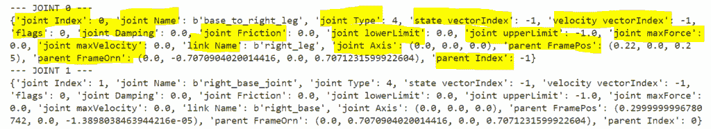

每个关节，无论它是轮子、肘部还是夹爪，都必须展示相同的特征。上面的代码显示 R2D2 有 15 个关节。让我们分析第一个，称为“基座到右腿”：

+   **关节类型**是 4，这意味着它不会移动。**父链接**是-1，这意味着它与**基座**连接，即机器人的根部（就像我们的骨骼脊柱）。对于 R2D2 来说，基座是主要圆柱形身体，那个大蓝白色桶。

+   **链接名称**是“右腿”，因此我们理解这个关节连接了机器人的基座和右腿，但它不是电动的。这一点通过**关节轴**、**关节倾倒**和**关节摩擦**均为零得到证实。

+   **父框架位置**和**方向**定义了右腿连接到基座的位置。

## 链接

另一方面，为了分析链接（物理身体段），必须遍历关节以提取链接名称。然后，你可以使用两个主要函数：`p.getDynamicsInfo()`来了解链接的物理属性，以及`p.getLinkState()`来了解其空间状态。

```py
p.connect(p.DIRECT)

for i in range(p.getNumJoints(robo)):
    link_name = p.getJointInfo(robo, i)[12].decode('utf-8')  #field 12="link Name"
    dyn = p.getDynamicsInfo(robo, i)
    pos, orn, *_ = p.getLinkState(robo, i)
    dic_info = {"Mass":dyn[0], "Friction":dyn[1], "Position":pos, "Orientation":orn}
    print(f"--- LINK {i}: {link_name} ---")
    print(dic_info)
```

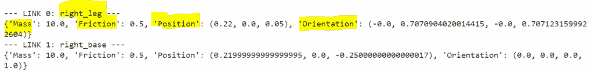

让我们分析第一个，即“右腿”。10 公斤的**质量**对重力惯量有贡献，而**摩擦**影响它接触地面时的滑动程度。**方向**（0.707=**sin(45°)/cos(45°)**）和**位置**表明右腿链接是一个实心部件，略微向前（5cm），相对于基座倾斜 90°。

## 运动

让我们看看一个可以实际移动的关节。

例如，关节 2 是右前轮。它是一个 type=0 的关节，因此它会旋转。这个关节将右腿（链接索引 1）与右前轮连接：base_link → right_leg → right_front_wheel。关节轴是（0,0,1），因此我们知道轮子是围绕 z 轴旋转的。限制（下限=0，上限=-1）表明轮子可以无限旋转，这对于转子来说是正常的。

我们可以轻松地**移动这个关节**。控制你机器人上执行器的最主要命令是`p.setJointMotorControl2()`，它允许控制关节的力、速度和位置。在这种情况下，我想让轮子旋转，所以我将[逐渐施加力，将速度从零增加到目标速度，然后通过平衡施加的力和阻力来维持它](https://en.wikipedia.org/wiki/Newton%27s_laws_of_motion)（即摩擦、阻尼、重力）。

```py
p.setJointMotorControl2(bodyUniqueId=robo, jointIndex=2,
                        controlMode=p.VELOCITY_CONTROL, 
                        targetVelocity=10, force=5)
```

现在，如果我们对**所有 4 个轮子**施加相同的力，我们的迷你机器人就会向前移动。根据之前进行的分析，我们知道轮子的关节编号为 2 和 3（右侧），以及 6 和 7（左侧）。

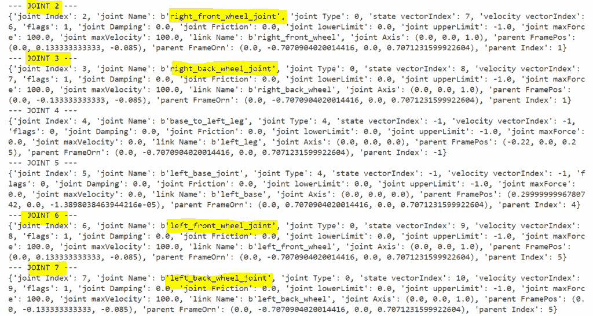

考虑到这一点，我首先让 R2D2 通过仅旋转一侧来转身，然后同时施加力到每个轮子上，使其向前移动。

```py
import pybullet as p
import pybullet_data
import time

## setup
p.connect(p.GUI)
p.resetSimulation()
p.setGravity(gravX=0, gravY=0, gravZ=-9.8)
p.setAdditionalSearchPath(path=pybullet_data.getDataPath())

## load URDF
plane = p.loadURDF("plane.urdf")
robo = p.loadURDF(fileName="r2d2.urdf", basePosition=[0,0,0.1])

## settle down
for _ in range(240):
    p.stepSimulation()

right_wheels = [2,3]
left_wheels = [6,7]

### first turn
for _ in range(240):
    for j in right_wheels:
        p.setJointMotorControl2(bodyUniqueId=robo, jointIndex=j,
                                controlMode=p.VELOCITY_CONTROL, 
                                targetVelocity=-100, force=50)
    for j in left_wheels:
        p.setJointMotorControl2(bodyUniqueId=robo, jointIndex=j,
                                controlMode=p.VELOCITY_CONTROL, 
                                targetVelocity=100, force=50)
    p.stepSimulation()
    time.sleep(1/240)

### then move forward
for _ in range(500):   
    for j in right_wheels + left_wheels:
        p.setJointMotorControl2(bodyUniqueId=robo, jointIndex=j,
                                controlMode=p.VELOCITY_CONTROL, 
                                targetVelocity=-100, force=10)
    p.stepSimulation()
    time.sleep(1/240)

p.disconnect()
```

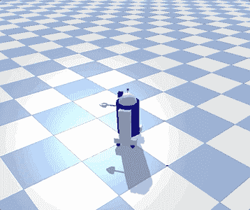

请注意，每个机器人的质量（重量）都不同，因此根据模拟的物理（即重力），运动可能会有所不同。您可以尝试不同的力和速度，直到找到理想的结果。

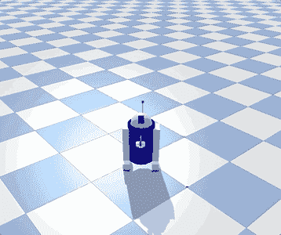

## 结论

这篇文章是一个教程，旨在**介绍 PyBullet 以及如何创建基本的 3D 模拟** **用于机器人技术**。我们学习了如何导入 URDF 对象以及如何分析关节和链接。我们还玩了一下著名的机器人 R2D2。更多高级机器人的新教程即将到来。

这篇文章的完整代码：**[GitHub](https://github.com/mdipietro09/RoboticsPy)**

希望您喜欢！如有问题或反馈，请随时联系我，或者只是分享您有趣的项目。

👉 [**让我们建立联系**](https://maurodp.carrd.co/) 👈


[^((所有图片均为作者所有，除非另有说明)][^( 注明))]
