# 将推荐器 Transformer 扩展到十亿参数

> 原文：[`towardsdatascience.com/scaling-recommender-transformers-to-a-billion-parameters/`](https://towardsdatascience.com/scaling-recommender-transformers-to-a-billion-parameters/)

<mdspan datatext="el1761073953789" class="mdspan-comment">Hi TDS</mdspan>！我的名字是 Kirill Khrylchenko，我是 Yandex 的 RecSys 研发团队的负责人。我们的一个目标是在推荐系统的背景下开发 transformer 技术，这是我们过去五年一直在追求的目标。不久前，我们在推荐技术发展上取得了新的里程碑，我想在本文中与您分享。

推荐系统在世界的相关性很容易证明：内容量增长得非常快，无法全部查看，我们需要推荐系统来解决信息过载。音乐、电影、书籍、产品、视频、帖子、朋友，但重要的是要记住，这些服务不仅对用户有益，也对需要找到目标受众的内容创作者有益。

我们已经在几个服务中部署了新一代的 transformer 推荐器，并正在积极地将它们与其他服务集成。我们已经显著提高了所有推荐的质量。

如果你是一名与推荐系统合作的机器学习工程师，这篇文章将为你提供一些关于如何实现类似方法的思路。如果你是用户，你有机会了解更多关于该推荐系统是如何工作的。

## 推荐系统是如何工作的

推荐问题本身有一个简单的数学定义：对于每个用户

我们希望选择物品、对象、文档或产品

他们可能喜欢的。

但有一个问题：

+   物品目录非常庞大（多达数十亿个物品）。

+   有大量的用户，他们的兴趣不断变化。

+   用户与物品之间的交互非常稀疏。

+   不清楚如何定义实际的用户偏好。

为了有效地解决推荐问题，我们需要利用非平凡的机器学习模型。

神经网络是一种强大的机器学习工具，尤其是在存在大量非结构化数据的情况下，如文本或图像。而传统的经典机器学习涉及专家领域知识以及相当多的手动工作（特征工程），神经网络几乎可以自动地从原始数据中提取复杂的关系和模式。

在 RecSys 领域，我们拥有大量主要是非结构化的数据（实际上是有数万亿匿名用户-物品交互），以及基于内容的事实（物品由标题、描述、图像、视频和音频组成；用户可以表示为事件序列）。此外，对于新物品和冷用户，推荐系统表现良好至关重要，通过内容编码用户和物品有助于实现这一点。

我们为用户生成推荐的时间非常严格地受限。每一毫秒都至关重要！此外，我们并没有无限的资源（就硬件而言），而且我们需要从其中获取推荐的目录相当庞大。这就是为什么推荐通常在多个阶段形成：

+   首先，我们使用轻量级模型（**检索阶段**）从整个目录中选择一个相对较小的候选集。

+   然后，我们将这些候选者通过更复杂的模型，这些模型利用额外的信息和针对每个候选者的更密集的计算（**排名阶段**）。

在架构上，模型在各个阶段之间差异很大，这使得在不提及推荐系统的具体阶段的情况下讨论任何方面都变得具有挑战性。

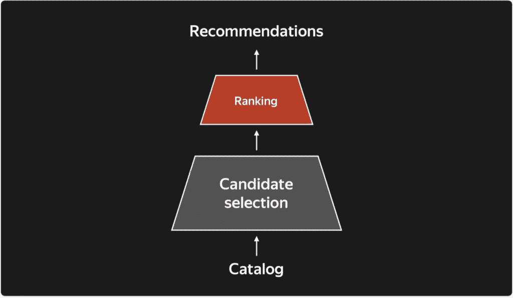

多阶段推荐系统，图片由作者提供

双塔神经网络架构在检索阶段非常受欢迎。用户和物品（在信息检索中，这将是对查询和文档的独立编码为向量表示）被使用，并使用点积来计算它们之间的相似性。

你也可以说，这样的模型“嵌入”用户和物品到一个共享的“语义空间”中，其中语义方面表示的是，在向量空间中，用户-物品对越接近，它们就越相似。

双塔模型是高速的。假设用户请求推荐。双塔模型随后需要计算：

+   每次请求一次“用户塔”。

+   你想要计算用户-物品亲和力的所有候选物品的向量。

+   点积。

你甚至不需要为每个用户查询重新计算候选物品的向量，因为它们对所有用户都是相同的，并且很少改变；例如，我们并不假设一部电影或一首音乐经常更改其标题。在实践中，我们定期（例如，每天）离线重新计算整个目录的物品向量，并将它们上传到我们需要计算点积的服务，或者上传到我们在线访问以检索必要物品向量的另一个服务。

但那是我描述的一个用例，其中你有一些合理的、数量较少的候选人，你想要计算用户-项目亲和力。这在排名阶段是正确的。然而，在候选人生成阶段，问题变得更加复杂：我们需要计算目录中所有项目的邻近度，选择具有最高亲和力值的顶 N（N 通常以数百到数千表示），然后将它们转发到后续阶段。

这就是双塔模型**非常有价值**的地方：我们可以快速通过标量积生成近似的前 N 个结果，即使对于庞大的目录，也可以使用近似搜索方法。我们为已经计算过的项目向量集构建一个特定的“索引”（通常是图结构，如 HNSW 方法中），这些索引可以存储在服务中，并用于向用户向量提供输入，从而提取这些向量的近似前 N 个。

构建这个索引是困难且耗时的（还有一个快速更新和重建索引的挑战）。尽管如此，它仍然可以在离线时完成，然后二进制文件和索引可以上传到服务中，我们将在运行时环境中搜索候选人。

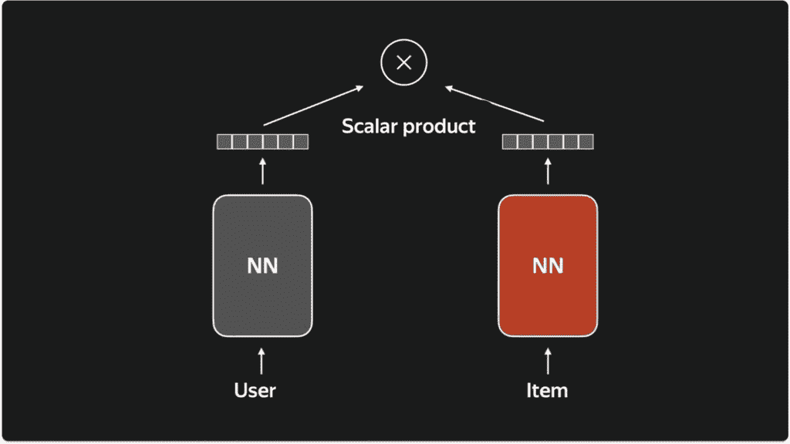

双塔神经网络，图片由作者提供

## 我们如何将用户编码成一个向量？

经典算法很容易解决这个问题：在矩阵分解方法（如 ALS）中，用户向量是“可训练的”，由模型参数表示，并在优化过程中确定。在用户-项目协同过滤方法中，用户被分配一个与目录维度相等的向量，其中第 i 个坐标对应一个特定的项目，表示用户与该项目的交互频率（例如，他们购买它的频率或他们如何评分）。

现代方法是将用户用变压器编码，这意味着用户可以使用变压器被编码成一个向量。我们取用户的匿名历史记录——即事件序列——并将这些事件编码成向量，然后利用变压器。在最基本的情况下，事件由购买或喜欢表示；然而，在其他情况下，它可能是公司生态系统内交互的整个历史。

初始时，当变压器首次用于推荐时，研究人员从 NLP 的相似性中得出类比：用户就像一个句子，其中的单词代表购买、喜欢和其他交互。

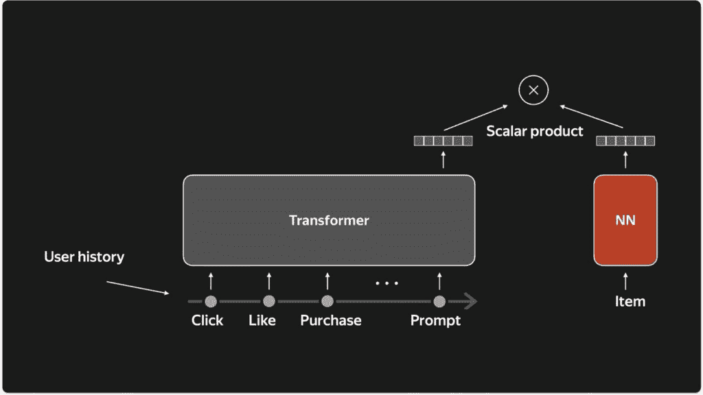

带有变压器的双塔神经网络设计，图片由作者提供

另一种类型的神经网络推荐模型是早期融合模型。这些模型不会将用户和项目信息分开成两个塔，而是将所有信息一起处理。也就是说，我们在早期阶段融合了关于用户、项目和它们交互的所有信息。相比之下，两塔模型通过标量积实现晚期融合。早期融合模型比两塔模型更具表现力。它们可以捕捉更复杂的信号，并学习更多非平凡依赖。

然而，由于它们的计算负担以及需要为每个用户查询和每个候选者重新计算整个模型，因此很难将它们应用于排名阶段之外。与两塔模型不同，它们不支持计算分解。

我们利用各种架构类型，包括具有转换器的两塔模型和具有早期融合的模型。我们更常使用两塔架构，因为它们效率很高，适用于所有阶段，并且仍然在相对较少的资源下产生良好的质量提升。

我们过去在两个阶段训练两塔模型：

+   **使用对比学习的预训练**。我们通过对比学习训练模型，使用户与他们的积极用户-项目交互对齐，

+   **任务特定微调**。与 NLP 一样，微调是一种任务特定的方法。如果模型将用于排名，我们训练它准确地对用户显示的推荐进行排名。我们展示了两个项目——用户喜欢其中一个，不喜欢另一个——我们希望以相同的顺序对项目进行排名。在检索中，任务类似于预训练，但采用了增强候选者召回的额外技术。

在下一节中，我们将探讨这一过程是如何随着我们更新的模型而改变的。

## 推荐系统缩放

推荐模型的大小有限吗？超过这个限制后，我们不再看到与大小相关的推荐质量改进？

很长时间以来，我们的推荐模型（以及不仅仅是我们的模型，还包括行业和学术界跨领域的模型）都非常小，这表明这个问题的答案是“是”。

然而，在深度学习中，存在规模假设，该假设指出，随着模型变得更大和数据量增加，模型质量应该显著提高。

过去十年深度学习的大部分进步都可以归因于这个假设。即使是深度学习的最早成功也是基于缩放，随着图像分类的大型数据集 ImageNet 的出现，以及神经网络（AlexNet）在该数据集上的良好表现。

规模假设在语言模型和自然语言处理（NLP）中更为明显：你可以预测质量改进对计算量的依赖，并表达相应的缩放定律。

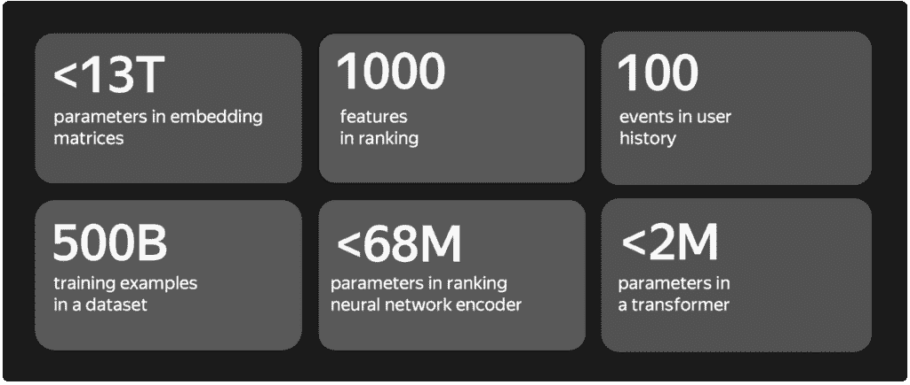

仪表板参数概述。图片由作者提供

当我说推荐模型可以做得更大时，我指的是什么？

有多达四个不同的轴可以进行缩放。

**嵌入**。我们关于用户和物品的信息有很多，因此我们可以访问广泛的特征，其中很大一部分是分类特征。一个分类特征的例子是项目 ID、艺术家 ID、流派或语言。

分类特征具有非常高的基数（唯一值的数量）——达到数十亿——因此如果你为它们制作大的可训练嵌入（向量表示），你会得到巨大的嵌入矩阵。

话虽如此，嵌入是输入数据和模型之间的瓶颈，因此你需要使它们足够大以获得高质量。例如，Meta* 拥有从[6750 亿](https://arxiv.org/abs/2403.02545)到[1300 万亿](https://arxiv.org/abs/2104.05158)参数的嵌入矩阵，而谷歌在 2016 年报告了至少 10 亿参数的[YoutubeDNN](https://dl.acm.org/doi/10.1145/2959100.2959190)。即使是长期推广归纳图嵌入的 Pinterest [[1](https://arxiv.org/abs/1806.01973)，[2](https://arxiv.org/abs/2205.10666)]，最近也开始使用[大型嵌入矩阵](https://dl.acm.org/doi/10.1145/3640457.3688053)。

**上下文长度**。几十年来，推荐系统工程师一直在忙于生成特征。在现代排名系统中，特征的数目可以达到数百甚至数千，Yandex 也提供此类服务。

模型中“上下文”的另一个例子是变换器中的用户历史。在这里，上下文的大小由历史长度决定。在工业界和学术界，这个数字往往非常小，最多只有几百个事件。

**训练数据集大小**。我已经提到，我们有很多数据。推荐系统产生了数百个与 GPT-3 训练数据集大小相似的数据库。

工业界展示了大量数据集的多个用例，包含数十亿的训练示例：[20 亿](https://arxiv.org/abs/1706.06978)、[21 亿](https://arxiv.org/abs/2404.06078)、[30 亿](https://arxiv.org/abs/2306.00248)、[600 亿](https://arxiv.org/abs/2104.05158)、[1000 亿](https://arxiv.org/abs/2008.13535)、[1460 亿](https://arxiv.org/abs/2403.02545)、[5000 亿](https://arxiv.org/abs/1606.07792)。

**编码器大小**。早期融合模型的标准将是数百万或数千万个参数。根据谷歌的论文，“简化”版本的 Wide&Deep 模型在实验中具有 1000 万到 6800 万个参数 [[1](https://dl.acm.org/doi/10.1145/3298689.3346997)，[2](https://dl.acm.org/doi/10.1145/3298689.3346997)]。如果我们使用两层 DCN-v2（早期融合模型中流行的神经网络层）处理超过 1000 个连续特征，我们将得到的参数不会超过 1000 万个。

双塔模型通常使用微小的 Transformer 来编码用户：例如，两个隐藏层维度不超过几百的 Transformer 块。这种配置最多只有几百万个参数。

尽管嵌入矩阵和训练数据集的大小已经相当大，但用户历史长度和模型编码器部分的容量如何进行扩展仍然是一个未解之谜。这些参数是否会有显著的扩展？

这是我们 2024 年 2 月心中的问题。然后，来自 Meta 的研究人员发表的一篇文章《行动胜于言语》，让我们都振奋起来。

作者提出了一种新的编码器架构，称为[HSTU](https://arxiv.org/abs/2402.17152)，并将排名问题和候选生成问题都表述为生成模型。该模型具有非常长的历史长度（8000 个事件！）以及庞大的训练数据集（1000 亿个示例），用户历史编码器比之前的几百万个参数大得多。然而，即使在这里，提到的最大编码器配置也只有 1.76 亿个参数，而且不清楚他们是否实现了它（根据随后的文章判断，他们没有）。

在编码器中，1.76 亿个参数是多还是少？如果我们看看语言模型，答案很明确：具有 1.76 亿个参数的 LLM 在能力和解决问题的质量上都将大大劣于具有数十亿甚至数万亿参数的现代 SOTA 模型。

那么，为什么推荐系统中我们有如此小的模型？

如果我们用匿名用户历史（其中动作充当文字）替换自然语言文本，我们能否实现类似的质量飞跃？推荐模型是否已经达到了其基线质量的极限，我们只剩下进行小的增量改进，调整特征和目标值？

这些是我们设计自己新的 ARGUS 方法时问自己的存在性问题。

RecSys × LLM × RL

在深入研究扩展的广泛文献后，我们发现有三个主要条件决定了神经网络扩展的成功：

+   大量的数据。

+   极其表达性架构，具有大模型容量。

+   可能的最通用、最基本的学习任务。

例如，LLM 是非常表达性和强大的 Transformer，从互联网上的所有数据中学习。此外，预测下一个单词的任务是一个基本任务，实际上分解为与不同领域相关的各种任务，包括语法、博学、数学、物理和编程。所有三个条件都满足！

如果我们看看推荐系统：

+   我们也有大量的数据：用户和物品之间的数万亿次交互。

+   我们同样可以使用 Transformer。

+   我们只需要找到合适的推荐模型扩展学习任务。

那就是我们所做的事情。

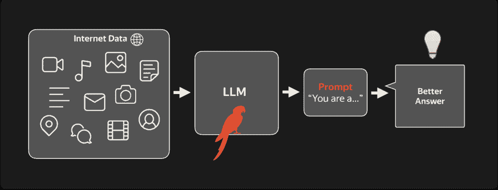

LLM 处理流程。图片由作者提供

预训练大型语言模型有一个有趣的方面。如果你只是询问一个预训练的 LLM 关于某事，它将给出一个平均答案。它在训练数据中最可能遇到的答案。这个答案不一定好或正确。

但如果在问题之前添加一个提示，比如“想象你是一个 X 领域的专家”，它将开始提供更多相关和正确的答案。

这是因为 LLM 不仅学会了模仿来自互联网的答案；它们还试图在尝试从训练集中压缩所有信息的过程中获得对世界的更基本的理解。它学习模式和抽象。正是因为 LLM 知道广泛的答案，并且对世界有根本的理解，我们才能从它那里获得好的答案。

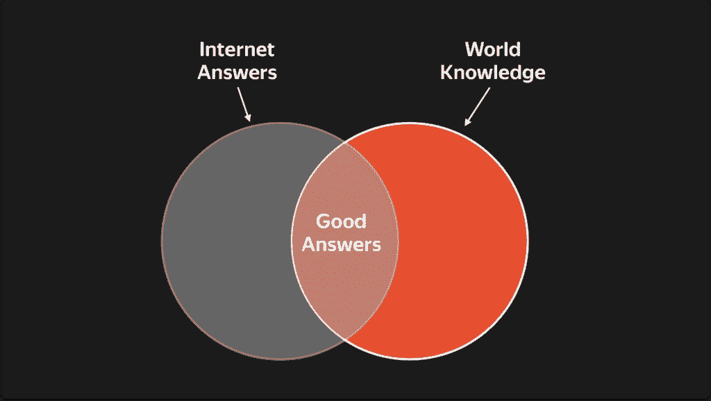

维恩图：什么因素造就了一个好的答案？图片由作者提供

我们试图将这种逻辑应用于推荐系统。首先，你需要将推荐表达为强化学习任务：

+   推荐系统是一个代理。

+   行为是推荐。在最基本的情况下，推荐系统每次推荐一个项目（例如，在音乐流媒体应用中每次推荐一首音乐曲目）。

+   环境意味着用户、他们的行为、模式、偏好和兴趣。

+   策略是对项目的一个概率分布。

+   奖励是用户对推荐的积极反馈。

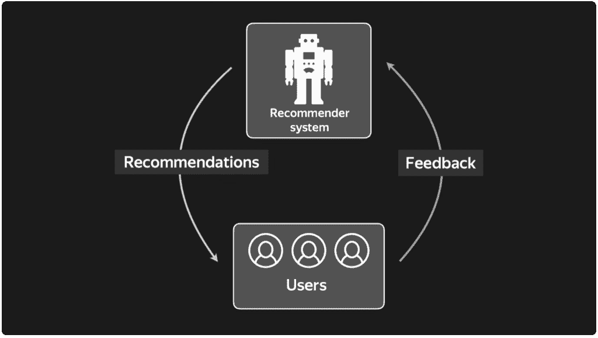

将推荐视为强化学习任务，图片由作者提供

这与 LLM 示例有直接的类比。“来自互联网的答案”是过去推荐系统的行为（记录策略），而关于世界的根本知识是理解用户、他们的模式和偏好。我们希望我们的新模型能够：

+   模仿过去推荐系统的行为。

+   对用户有一个良好的理解。

+   调整他们的行为以实现更好的结果。

在我们转向新的方法之前，让我们检查训练推荐转换器最流行的设置：下一项预测。SASRec 模型在这里非常有代表性。系统累积用户与服务（例如，购买）的积极互动历史，模型学习预测下一个序列中可能出现的购买。也就是说，我们选择下一项预测，而不是像 NLP 中的下一标记预测。

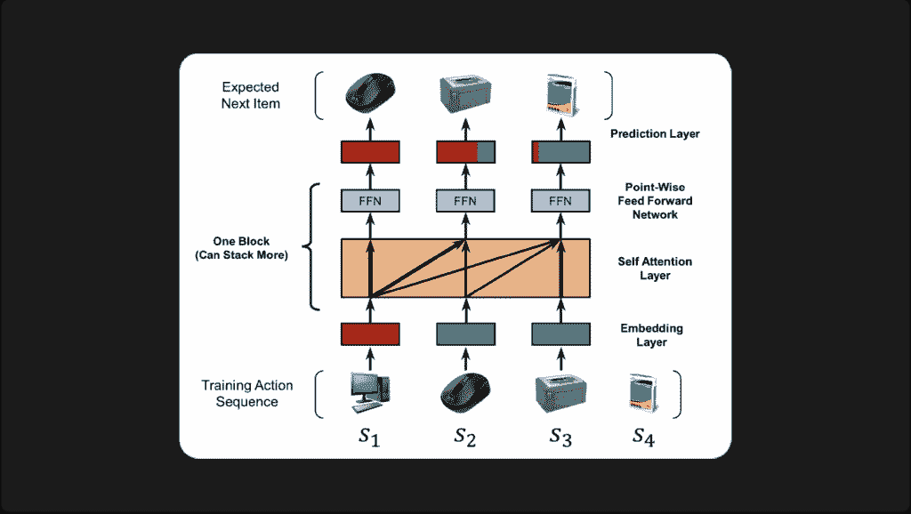

自注意力序列推荐。[来源](https://arxiv.org/abs/1808.09781)

这种方法（SASRec 和常见下一项预测）与之前描述的哲学不一致，该哲学侧重于根据对世界的根本知识调整日志策略。似乎为了预测用户接下来会购买什么，模型应该遵循以下哲学：

+   它应该理解在预测应该进行的当时，推荐系统可以向用户展示什么。也就是说，它应该有一个很好的日志策略行为模型（即可以用来模仿的模型）。

+   它需要理解用户可能喜欢过去推荐系统展示的事物，这意味着它需要理解他们的偏好，这是关于世界的非常基本信念。

但像 SASRec 这样的模型并没有明确地模拟这些事物中的任何一项。它们缺乏关于过去日志策略的完整信息（我们只看到具有正面结果的推荐），我们也没有学习如何复制这些日志策略。无法知道过去推荐系统可能提供的内容。同时，我们并不完全了解世界或用户的模型：我们忽略了所有负面反馈，只考虑正面反馈。

ARGUS：自回归生成用户序列建模

自回归生成用户序列建模（ARGUS）是我们训练推荐转换器的新方法。

首先，我们检查整个匿名用户历史，包括正面交互以及所有其他交互。我们捕捉交互上下文的精髓，交互发生的时间，使用的设备，用户所在的商品页面，他们的 My Vibe 个性化设置以及其他相关细节。

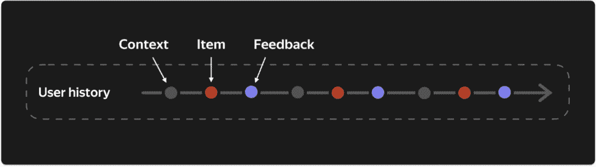

ARGUS：自回归生成用户序列建模

用户历史是一个特定的三元组序列（上下文，项目，反馈），其中上下文指的是交互上下文，项目代表用户与之交互的对象，而反馈表示用户对交互的反应（例如用户是否喜欢该项目，是否购买等）。

接下来，我们确定了两个新的学习任务，这两个任务都超越了在工业和学术界广泛使用的传统下一项预测。

下一个项目预测

我们的第一项任务也称为下一个项目预测。查看历史和当前交互上下文，我们预测将被交互的项目：P(项目 | 历史，上下文)。

下一个项目预测流程，图片由作者提供

+   如果历史中只包含推荐流量（由推荐系统直接生成的事件），则模型学会模仿日志策略（来自过去推荐系统的推荐）。

+   如果也存在有机流量（除推荐流量之外的所有流量，例如来自搜索引擎的流量，或者如果用户访问图书馆并收听他们最喜欢的曲目），我们也能获得更多关于用户的基本知识，这些知识与日志策略无关。

**重要**：尽管这个任务与 SASRec 中的下一项预测任务同名，但它完全不是同一个任务。我们预测的不仅是正面交互，还包括负面交互，并且还考虑了当前上下文。上下文帮助我们理解动作是否为有机的，如果是推荐，它在哪个表面上（地点、页面或轮播）。此外，它通常在模型训练期间降低噪声水平。

上下文对于音乐推荐至关重要：用户的心情和当前情况对他们想要听的音乐类型有重大影响。

从集合中预测一个元素的任务通常被表达为一个分类问题，其中原始集合的元素作为类别。然后，我们需要使用交叉熵损失函数进行训练，其中 softmax 函数应用于 logits（神经网络的未归一化输出）。Softmax 计算需要计算所有类别的 logits 指数之和。

虽然在 LLMs 中字典的大小在最坏情况下可以达到数十万个项目，softmax 计算不是一个大问题，但在推荐系统中，它成为一个问题。在这里，目录由数百万甚至数十亿个项目组成，计算完整的 softmax 是一个不可能的任务。这是一个单独大文章的主题，但最终我们不得不使用一个名为“采样 softmax”的巧妙损失函数，并带有 l[ogQ 校正](https://arxiv.org/abs/2507.09331)：

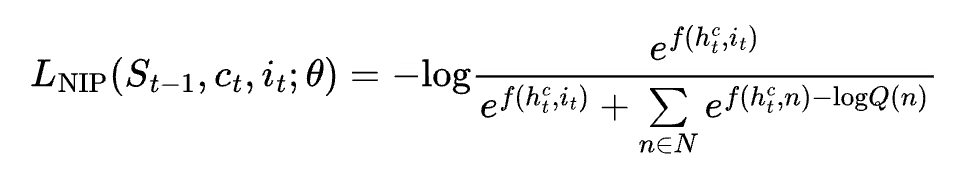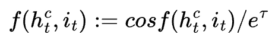

+   N 表示批内和均匀负样本的混合

+   `logQ(n)`表示 logQ 校正

+   温度`T`表示一个训练参数`Eᵀ`被裁剪到[0.01, 100]。

## 反馈预测

反馈预测是第二个学习任务。考虑到历史记录、当前上下文和项目，我们预测用户反馈：P(反馈 | 历史，上下文，项目)。

反馈预测学习任务。图由作者提供

第一项任务，下一项预测，教给我们如何模仿日志策略（如果有有机流量，则理解用户）。另一方面，反馈预测任务则专注于获取关于用户、他们的偏好和兴趣的基本知识。

这与“[行动胜于言语](https://arxiv.org/abs/2402.17152)”模型中的排名变体在一系列对（项目，动作）上学习非常相似。然而，在这里，上下文标记被单独处理，并且除了推荐上下文之外还有更多。

反馈可以包含多个组成部分：是否喜欢某首曲目、不喜欢、添加到播放列表，以及听了曲目的哪部分。我们通过将它们分解成单个损失函数来预测所有类型的反馈。您可以使用任何损失函数作为特定损失函数，包括交叉熵或回归。例如，二元交叉熵足以预测是否喜欢。

尽管某些反馈更常见（通常喜欢的次数远少于长时间收听），但模型在预测所有信号方面做得很好。模型越大，一次性学习所有任务而不发生冲突就越容易。此外，频繁的反馈（收听），相反，有助于模型学习如何模拟罕见、稀疏的反馈（喜欢）。

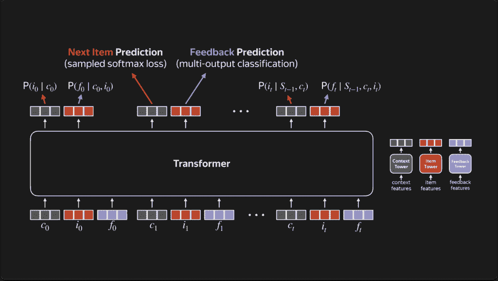

展示变压器模型如何执行下一项和反馈预测的图表。图片由作者提供

如果我们将所有这些组合成一个单一的学习任务，我们得到以下结果：

+   从三元组（上下文、物品、反馈）为用户创建历史。

+   使用变压器。

+   根据上下文的隐藏状态预测下一个物品。

+   根据物品的隐藏状态预测用户与物品交互后的反馈。

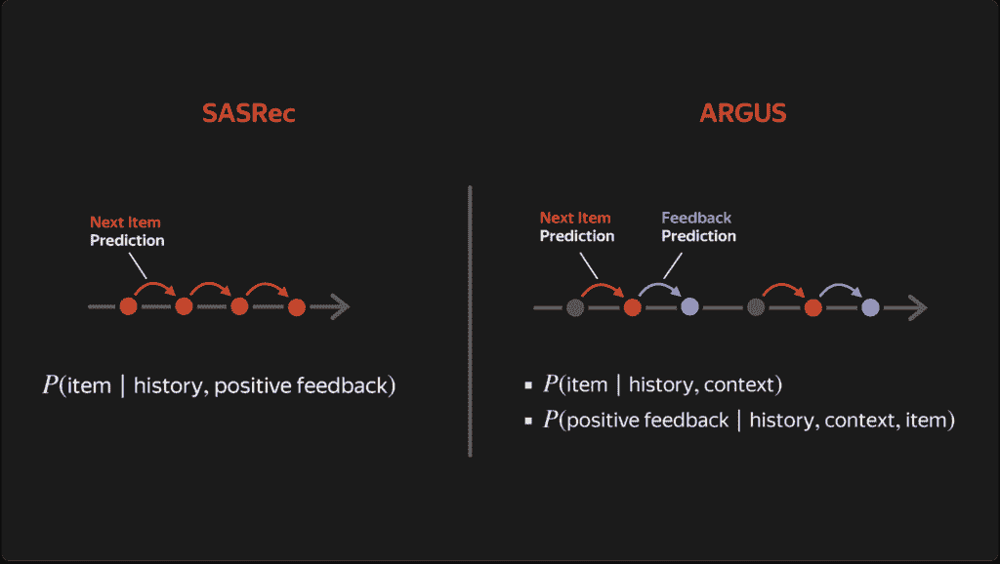

该图像展示了 ARGUS 和 SASRec 方法之间的差异：使用 ARGUS，我们训练模型模仿过去推荐系统的行为并预测用户的响应；相比之下，使用 SASRec，我们训练模型预测下一次积极的交互。

让我也评论一下这与 HSTU 的不同之处。在《行动胜于言语》中，作者为候选生成和排名训练了两个不同的模型。候选生成模型包含整个历史，但像 SASRec 一样，它只对正交互建模，不考虑负交互情况下的损失函数。排名模型，如前所述，学习与我们的反馈预测类似的任务。

我们提供的解决方案提供了一个更全面的下一个物品预测任务和一个更全面的反馈预测任务，模型在这两个函数中同时学习。

简化的 ARGUS

我们的方法有一个大问题——我们正在夸大用户的历史。因为每个与物品的交互都由三个标记同时表示（上下文、物品、反馈），我们不得不向变压器输入近 25,000 个标记来分析 8192 个最近用户的收听。

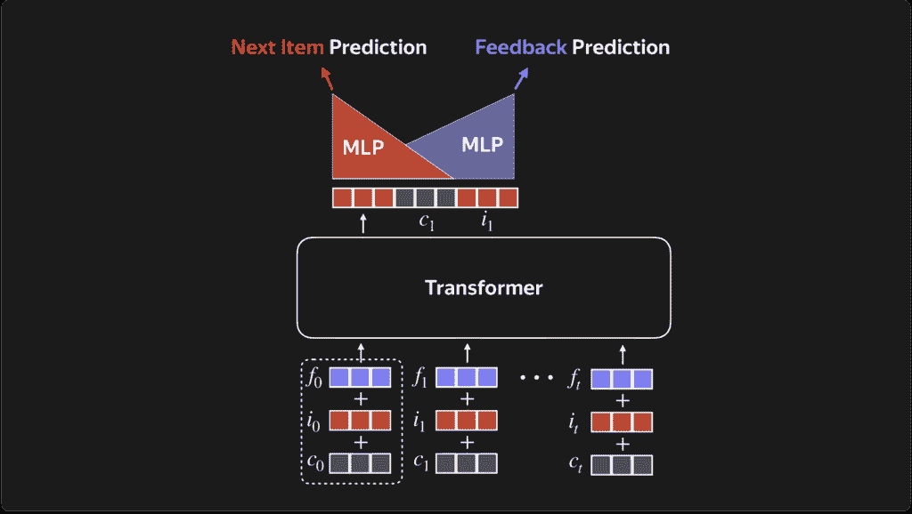

简化的 ARGUS。图片由作者提供

有些人可能会认为这仍然不显著，因为 LLM 中的上下文长度要长得多；然而，这并不完全准确。LLM 的平均数量要小得多，通常只有几百个标记，尤其是在预训练期间。

相比之下，例如在我们的音乐流媒体平台上，用户通常有成千上万甚至数十万个事件。我们已经有更长的上下文长度，将这些长度增加三倍对学习速度的影响更大。为了解决这个问题，我们创建了一个简化版本的模型，其中每个三重组（上下文，项目，反馈）被压缩成一个单一的向量。在输入格式方面，它类似于我们之前的几代 Transformer 模型；然而，我们保持了相同的两个学习任务——下一个项目预测和反馈预测。

为了预测下一个项目，我们从对应于过去某个时间点的三重组（c, i, f）的 Transformer 中获取隐藏状态，将当前上下文向量连接到它上面，使用 MLP 压缩到更低的维度，然后使用采样 softmax 学习预测下一个项目。

为了预测反馈，我们将当前项目的向量连接起来，然后使用 MLP 预测所有所需的目标变量。在推荐器 Transformer 架构方面，我们的模型在目标感知和上下文感知方面变得不那么明显；然而，它仍然表现良好，实现了三倍的加速。

ARGUS 实现

在这种双头模式下同时训练模型（下一个项目预测和反馈预测）可以按原样实现。NIP 头负责候选选择，而 FP 头负责最终排名。

但我们不想这样做，至少不是在我们的第一次实现中：

+   我们的目标是实施一个非常大的模型，所以我们最初专注于离线部署。在离线部署中，用户和项目向量每天在单独的常规过程中重新计算，你只需要在运行时环境中计算点积。

+   ARGUS 的预训练版本意味着可以无延迟地访问用户的历史记录：我们能看到用户历史记录中所有事件，直到预测发生的当前时间点。也就是说，它需要在运行时应用。

+   NIP 头预测所有用户交互，模型通常训练预测只有未来的正面交互来生成候选。但预测正面交互是一种启发式方法，一个代理学习任务。甚至可能使用一个预测所有交互的头更好，因为它会学习与排名保持一致。如果一个项目被推荐，这意味着排名喜欢它。但在这个情况下，我们还没有准备好尝试这种方法，而是想遵循既定的路径。

+   FP 头部学习用于点损失：曲目是否会被喜欢，曲目中哪部分会被听到，等等。但我们还经常训练用于成对排名的模型：我们学习排名那些被推荐“相邻”并得到不同反馈的物品。有些人认为点损失对于训练排名模型是足够的，但在这个案例中，我们没有替换整个排名栈。相反，我们旨在向最终排名模型添加一个新的、强大的、基于神经网络的特性。如果最终排名模型针对特定任务（如成对排名）进行训练，那么生成该特性的神经网络将最有效地针对该任务进行训练；否则，最终模型将较少依赖于我们的特性。因此，我们希望预先训练 ARGUS 以与原始排名模型相同的任务，这样我们就可以在排名中使用它。

除了传统的候选生成和排名阶段之外，还有其他部署用例，我们也在积极研究这些用例。然而，在我们的首次部署中，我们选择了离线双塔排名：

+   我们决定微调 ARGUS，使其能够作为一个离线双塔模型使用。我们每天使用它来重新计算用户和物品向量，而用户偏好是通过用户与物品的点积来确定的。

+   我们对 ARGUS 进行了预训练，用于与最终排名模型训练相似的成对排名任务。这意味着我们以某种方式选择了用户听过的并就正面反馈给出了不同评价的成对曲目，我们希望学习如何正确地排名它们。

我们相当频繁地构建这些模型：它们在资源和发展成本方面都很容易训练和实现。然而，我们之前的模型要小得多，学习方式也不同。不是使用 ARGUS 流程，而是首先使用用户和正样本之间的常规对比学习，然后针对任务进行微调。

我们之前的对比预训练程序意味着为用户编译多个训练示例：如果用户有 n 次购买，则数据集中将有 n 个样本。话虽如此，我们没有使用自回归学习。也就是说，我们在训练期间运行了 Transformer n 次。这种方法使我们能够在创建训练对（用户，物品）时非常灵活，使用任何历史格式，将上下文与用户一起编码，并考虑滞后。在预测喜好时，我们可以使用用户历史中的一天的滞后。然而，事情进展得相当缓慢。

ARGUS 预训练采用自回归学习，其中我们在单个 Transformer 运行中同时从用户活动的所有事件中学习。这是一种强大的加速，使我们能够使用相同的资源训练更大的模型。

在微调期间，我们也为单个用户多次运行了 transformer。这被称为 Meta 在 HSTU 之前使用的印象级学习。如果一个用户在特定时刻看到一个物品，我们生成一个形式为（用户，物品）的样本。数据集可以包含单个用户的大量此类印象，我们将为它们中的每一个重新运行 transformer。对于成对排名，我们考虑形式为（用户，item1，item2）的三元组。我们之前使用的。

在预训练阶段检查加速情况后，我们决定采用类似的方法进行微调。我们为两塔模型开发了一个微调过程，以教授其排名，其中 transformer 只需要运行一次。

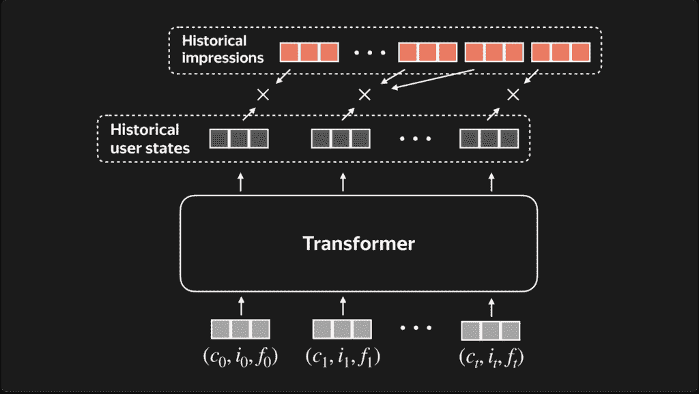

变换器如何使用历史印象和用户状态形成预测的示意图。图由作者提供

假设我们有一个用户一年的完整历史，以及在同一时期向用户展示的所有推荐。通过在整个历史上实施因果掩码的 transformer，我们一次性得到该年所有时刻的用户向量表示，因此我们可以：

+   分别计算展示物品的向量。

+   检查时间戳，并将推荐印象映射到对应用户历史交付延迟的用户向量。

+   计算所有所需的标量积和损失函数的所有项。

并且一次性处理整个一年的所有这些——在一个单独的 transformer 运行中。

以前，我们会为每一对印象重新运行 transformer；现在，我们一次性在一个运行中处理所有印象。这是一个巨大的加速：以十倍、百倍甚至千倍的速度。要使用这种两塔模型，我们只需在最后一刻（对应于历史中的最后事件）使用用户的向量表示作为当前的向量表示。对于物品，我们可以使用在印象训练期间使用的编码器。在训练中，我们模拟一天的用户历史延迟，然后以离线模型运行模型，每天重新计算用户向量。

当我说我们在单个 transformer 运行中处理用户整个一年的历史时，我可能有些误导。实际上，我们对最大历史长度有一个限制，并强制执行，数据集中的用户可以有多个样本或块。对于预训练，这些块不重叠。

然而，在微调期间，不仅对最大历史长度有限制，而且对其最小长度也有限制，以及用于训练排名模型的单个训练示例中推荐印象的最大数量。

结果

我们选择将音乐流媒体服务作为第一个实验的服务。在这里，推荐至关重要，该服务拥有大量的活跃用户。我们构建了一个包含数亿用户超过 3000 亿次收听的大型训练数据集。这比我们之前使用的训练数据集大数十倍甚至数百倍。

在音乐流媒体服务中，一个（上下文，项目，反馈）三元组是什么？

+   **上下文**：当前交互是否为推荐或自然。如果是推荐——它位于哪个表面，如果是 My Vibe——设置是什么。

+   **项目**：一首音乐曲目。对于项目编码来说，最重要的特征是项目 ID。我们使用统一的嵌入来编码具有高基数的特征。在这种情况下，我们对每个项目使用三个 512K 的哈希值。在我们的实验中，我们使用了一个具有 1.3 亿参数的固定统一嵌入矩阵。

+   **用户反馈**：是否喜欢一首曲目，以及听到了曲目的哪一部分。

对于离线质量评估，我们使用训练期后一周的数据，通过全局时间分割。

为了评估预训练模型的质量，我们检查了预训练任务中的损失函数值：下一项预测和反馈预测。也就是说，我们衡量模型学习解决我们为其创建的任务的效果。值越小，表示效果越好。

**重要**：我们考虑用户长期的历史，但损失函数仅对测试期内发生的事件进行计算。

在微调期间，我们学会了根据用户反馈正确地排列项目对，使 PairAccuracy——一个衡量模型正确排序的配对比例的指标——成为我们合适的离线指标。在实践中，我们根据反馈稍微重新加权配对：例如，当一个人喜欢并跳过一首曲目时，其权重高于那些听了一首曲目并跳过的配对。

我们的部署场景涉及向最终的排序器添加一个强大的新功能。因此，我们测量了添加新功能后最终排序器的相对 PairAccuracy 增加，与没有该功能的最终排序器相比。我们音乐流媒体平台中的最终排序器是梯度提升。

## A/B 测试结果和测量

我们的初始目标是扩展推荐转换器。为了测试扩展性，我们选择了四种不同规模的转换器配置，参数量从 320 万到 10.07 亿不等。

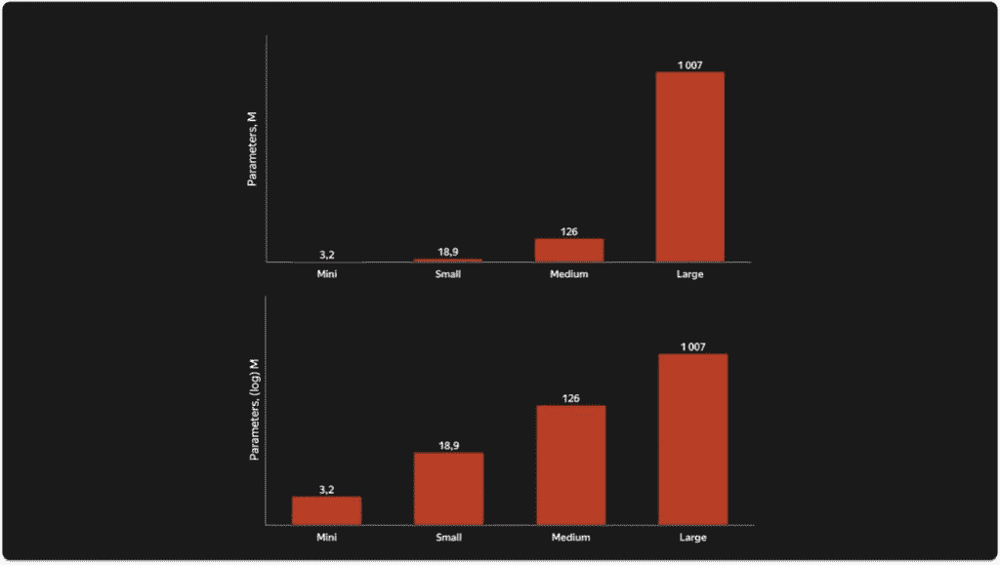

HSTU 性能测试。图片由作者提供

我们还决定测试 HSTU 架构的性能。在“[Actions Speak Louder than Words](https://arxiv.org/abs/2402.17152)”中，作者提出了一种新的编码器架构，它与转换器架构相当不同。根据作者的实验，这种架构在推荐任务中优于转换器。

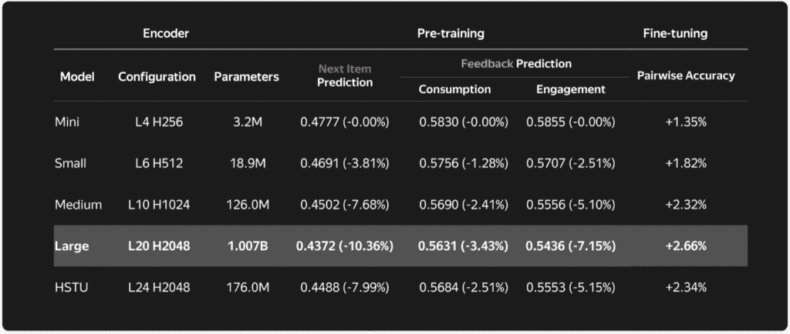

性能测试仪表板。图片由作者提供

有缩放！架构大小的新增每次跳跃都导致质量提升，无论是在预训练还是微调阶段。

HSTU 证明并不比变压器好。我们使用了作者在“[行动胜于言语](https://arxiv.org/abs/2402.17152)”中提到的最大配置。它的参数比我们的中等变压器多一倍半，而质量大致相同。

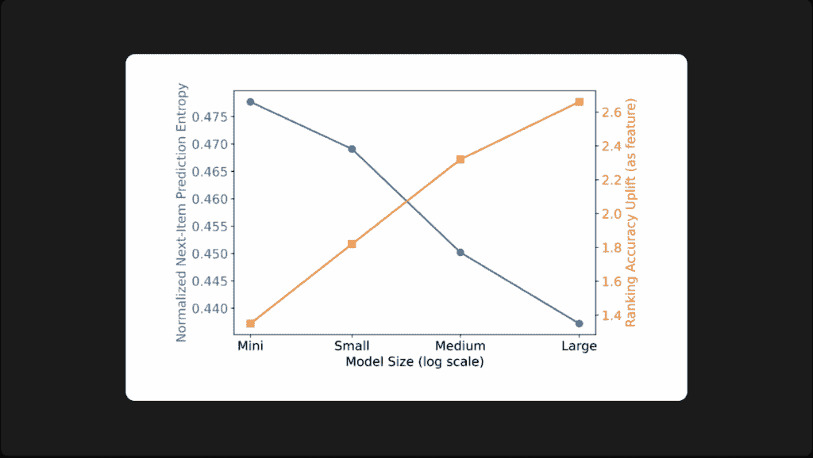

描述模型大小、熵预测和排名提升之间关系的图表。图片由作者提供。

让我们将表格中的指标可视化成图表。在这种情况下，我们可以观察到我们四个点的缩放定律：质量对参数数量的对数依赖性呈现线性关系。

我们进行了一项小的消融研究，以找出我们是否可以简化我们的模型或从训练中移除任何部分。

与预训练相比无预训练的结果，图片由作者提供

如果你移除预训练，模型的质量会下降。

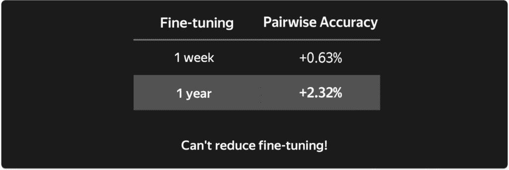

微调和成对准确率结果。图片由作者提供

如果你减少微调的持续时间，下降趋势会更加明显。

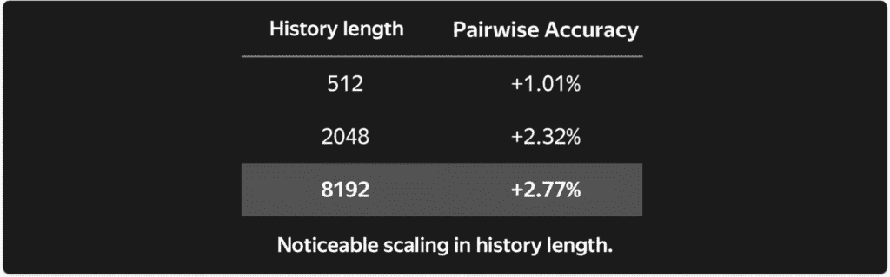

历史长度上的显著缩放，图片由作者提供

在本文的开头，我提到“行动胜于言语”的作者训练了一个历史长度为 8,000 个项目的模型。我们决定尝试一下：处理如此深度的用户音乐历史结果导致推荐质量显著提高。以前，我们的模型最多使用 1,500-2,000 个事件。这是我们第一次有机会跨越这个阈值。

实施结果

我们已经致力于开发音乐推荐用的变压器大约三年了，我们已经取得了长足的进步。以下是我们在这一过程中所学到的所有知识和我们如何发展基于变压器的音乐推荐模型。

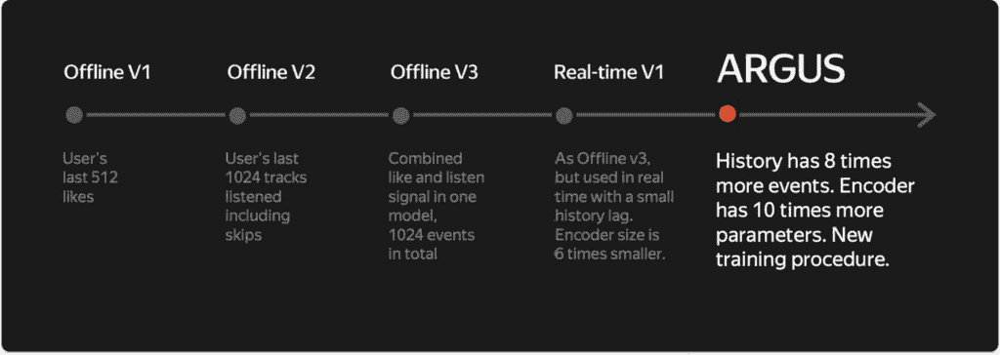

项目路线图。图片由作者提供

+   我们的前三个变压器都是离线的。用户和项目向量每天都会重新计算。然后，用户向量被加载到键值存储中，项目向量存储在服务的 RAM 中，而在运行时只计算点积。我们利用其中一些模型不仅用于排名，还用于候选生成（我们熟悉构建执行这两个任务的多头模型）。在这种情况下，可以从中检索候选者的 HNSW 索引也位于服务的 RAM 中。

+   第一个模型只有关于点赞的信号，第二个模型有关于收听（包括跳过）的信号，而在第三个模型中，我们结合了这两种信号类型（显性和隐性）。

+   模型的 v4 版本是对 v3 版本的改编，v3 版本在运行时用户历史记录上略有滞后，其编码器大小是 v3 模型的 6 倍小。

+   新的 ARGUS 模型具有八倍的用户历史长度和十倍的编码器大小。它还使用了我之前描述的新学习过程。

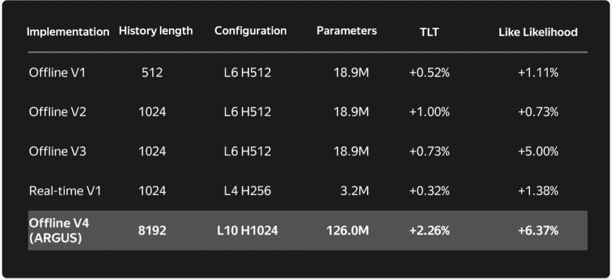

实现版本仪表板，图片由作者提供

TLT 是总收听时间。"喜欢"的可能性表示当推荐被展示给用户时，用户喜欢该推荐的机会。每一次实现都为我们的用户定制推荐带来了指标的提升。而且，第一个 ARGUS 带来的指标提升几乎与所有之前的实现相加的总和一样多！

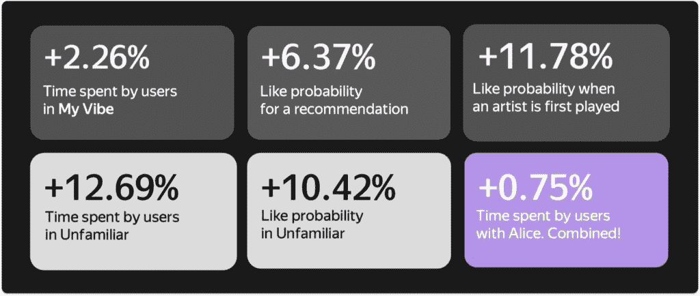

ARGUS 测试结果仪表板，图片由作者提供

我的 Vibe 也有一个特殊的设置，我们为它使用了一个单独的排名堆栈：不熟悉。我们为这个设置实现了一个单独的 ARGUS，实现了总收听时间 12% 的增长和可能性 10% 的增长。不熟悉设置是那些对发现新推荐感兴趣的人使用的。我们在这个类别中经历了显著的增长，这证实了 ARGUS 在处理非平凡场景方面更加有效。

我们在智能设备上的音乐场景中实现了 ARGUS，并成功地将用户与活跃扬声器互动的总时间增加了 0.75%。在这里，最终的排序器不是一个梯度提升模型，而是一个全规模的排序神经网络。正因为如此，我们不仅能够从 ARGUS 提供单个标量特征，还能将完整的用户和项目向量作为输入传递给最终的排序器。与单个标量特征相比，这又提高了质量增益一倍半到两倍。

ARGUS 不仅被实现为排序特征，还被用于生成候选者。团队已经将离线的 ARGUS 转换为运行时版本。这些实现显著提高了关键指标。神经网络是推荐系统的未来，但前方还有很长的路要走。

感谢您的阅读。
