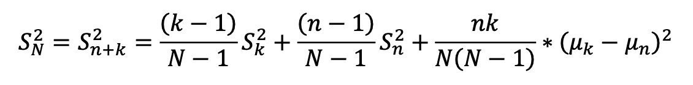
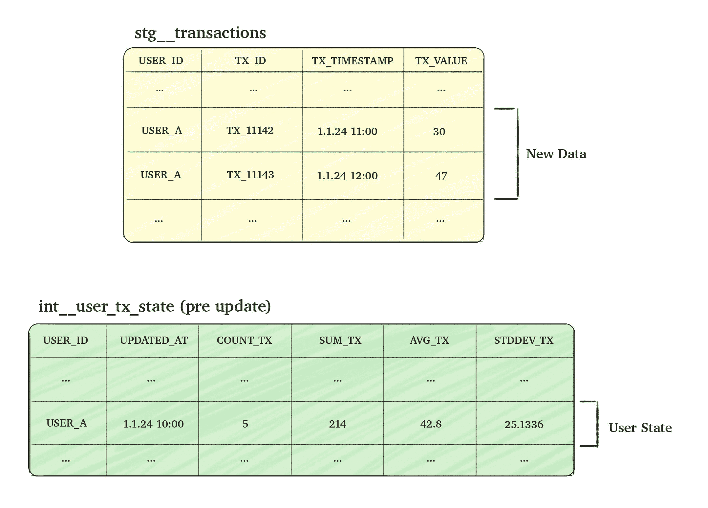
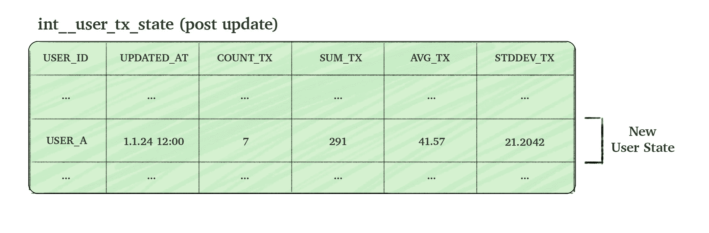

# 缩放统计：使用 dbt 在 SQL 中进行增量标准差计算

> 原文：[`towardsdatascience.com/scaling-statistics-incremental-standard-deviation-in-sql-with-dbt-2eb0505aad2b/`](https://towardsdatascience.com/scaling-statistics-incremental-standard-deviation-in-sql-with-dbt-2eb0505aad2b/)

当应用于大型数据集时，SQL 聚合函数可能会非常昂贵。随着数据集的增长，反复在整个数据集上重新计算指标变得效率低下。为了应对这一挑战，通常采用**增量聚合**方法——一种涉及维护先前状态并使用新传入数据更新它的方法。虽然这种方法对于聚合如 COUNT 或 SUM 来说很简单，但对于标准差等更复杂的指标，问题就出现了：如何将其应用于这些指标？

[标准差](https://en.wikipedia.org/wiki/Standard_deviation)是一种统计指标，它衡量了变量值相对于其均值的变异程度或分散程度。它是通过取方差的平方根得到的。[方差](https://en.wikipedia.org/wiki/Variance)的计算公式如下：


样本方差公式

计算标准差可能很复杂，因为它涉及到更新所有数据点的均值和平方差的和。然而，通过代数操作，我们可以推导出一个增量计算的公式——允许使用现有数据集进行更新，并无缝地结合新数据。这种方法避免了每次添加新数据时都需要从头开始重新计算，使整个过程更加高效（详细的推导可以在我的 GitHub 上找到[在此](https://github.com/YuvalGorch/math_proofs/blob/main/incremental_stddev_proof.pdf))。



推导出的样本方差公式

公式基本上被分解为 3 部分：

1.  现有集合的加权方差

1.  新集合的加权方差

1.  均值差异方差，负责解释组间方差。

此方法通过保留现有集合的 COUNT (k)、AVG (µk) 和 VAR (Sk)，并将它们与新集合的 COUNT (n)、AVG (µn) 和 VAR (Sn) 结合起来，实现了增量方差计算。因此，可以高效地计算更新后的标准差，而无需重新扫描整个数据集。

现在我们已经理解了增量标准差背后的数学原理（至少抓住了其精髓），让我们深入了解 dbt SQL 实现。在以下示例中，我们将介绍如何设置增量模型来计算和更新用户的交易数据统计信息。

考虑一个名为**stg__transactions**的交易表，它跟踪用户交易（事件）。我们的目标是创建一个时间静态表，**int__user_tx_state**，该表聚合用户交易的“状态”。两个表的列详细信息如下所示。



图片由作者提供

为了使过程高效，我们旨在通过将新到达的交易数据与现有的聚合数据（即当前用户状态）相结合来增量更新状态表。这种方法允许我们计算更新的用户状态，而无需扫描所有历史数据。



图片由作者提供

> 以下代码假设您对一些 dbt 概念有所了解，如果您不熟悉它，您仍然可以理解代码，尽管我强烈建议您阅读[dbt 的增量指南](https://docs.getdbt.com/docs/build/incremental-models-overview)或阅读[这篇精彩的帖子](https://towardsdatascience.com/dbt-incremental-the-right-way-63f931263f4a)。

我们将逐步构建一个完整的 dbt SQL 步骤，目的是高效地计算增量聚合，而不需要反复扫描整个表。这个过程从在 dbt 中将模型定义为增量并使用`unique_key`更新现有行而不是插入新行开始。

```py
-- depends_on: {{ ref('stg__transactions') }}
{{ config(materialized='incremental', unique_key=['USER_ID'], incremental_strategy='merge') }}
```

接下来，我们从`_**stg__transactions**`表获取记录。`is_incremental`块过滤掉时间戳晚于最新用户更新的交易，有效地包括“只有新交易”。

```py
WITH NEW_USER_TX_DATA AS (
    SELECT
        USER_ID,
        TX_ID,
        TX_TIMESTAMP,
        TX_VALUE
    FROM {{ ref('stg__transactions') }}
    
      WHERE TX_TIMESTAMP > COALESCE((select max(UPDATED_AT) from {{ this }}), 0::TIMESTAMP_NTZ)
    
)
```

在检索到新的交易记录后，我们按用户进行聚合，使我们能够增量更新以下 CTEs 中每个用户的“状态”。

```py
INCREMENTAL_USER_TX_DATA AS (
    SELECT
        USER_ID,
        MAX(TX_TIMESTAMP) AS UPDATED_AT,
        COUNT(TX_VALUE) AS INCREMENTAL_COUNT,
        AVG(TX_VALUE) AS INCREMENTAL_AVG,
        SUM(TX_VALUE) AS INCREMENTAL_SUM,
        COALESCE(STDDEV(TX_VALUE), 0) AS INCREMENTAL_STDDEV,
    FROM
        NEW_USER_TX_DATA
    GROUP BY
        USER_ID
)
```

现在我们来到了需要实际计算聚合的难点部分。当我们不在增量模式（即我们还没有任何“状态”行）时，我们只需选择新的聚合

```py
NEW_USER_CULMULATIVE_DATA AS (
    SELECT
        NEW_DATA.USER_ID,
        
            NEW_DATA.UPDATED_AT AS UPDATED_AT,
            NEW_DATA.INCREMENTAL_COUNT AS COUNT_TX,
            NEW_DATA.INCREMENTAL_AVG AS AVG_TX,
            NEW_DATA.INCREMENTAL_SUM AS SUM_TX,
            NEW_DATA.INCREMENTAL_STDDEV AS STDDEV_TX
        
        ...
```

但当我们处于增量模式时，我们需要将过去的数据与基于上述公式在`INCREMENTAL_USER_TX_DATA` CTE 中创建的新数据相结合。我们首先计算新的 SUM、COUNT 和 AVG：

```py
 ...
  
      COALESCE(EXISTING_USER_DATA.COUNT_TX, 0) AS _n, -- this is n
      NEW_DATA.INCREMENTAL_COUNT AS _k,  -- this is k
      COALESCE(EXISTING_USER_DATA.SUM_TX, 0) + NEW_DATA.INCREMENTAL_SUM AS NEW_SUM_TX,  -- new sum
      COALESCE(EXISTING_USER_DATA.COUNT_TX, 0) + NEW_DATA.INCREMENTAL_COUNT AS NEW_COUNT_TX,  -- new count
      NEW_SUM_TX / NEW_COUNT_TX AS AVG_TX,  -- new avg
   ...
```

然后我们计算方差公式的三个部分

1.  现有的加权方差，如果前一个集合由一个或更少的项组成，则截断为 0：

```py
 ...
      CASE
          WHEN _n > 1 THEN (((_n - 1) / (NEW_COUNT_TX - 1)) * POWER(COALESCE(EXISTING_USER_DATA.STDDEV_TX, 0), 2))
          ELSE 0
      END AS EXISTING_WEIGHTED_VARIANCE,  -- existing weighted variance
    ...
```

1.  以相同方式计算增量加权方差：

```py
 ...
      CASE
          WHEN _k > 1 THEN (((_k - 1) / (NEW_COUNT_TX - 1)) * POWER(NEW_DATA.INCREMENTAL_STDDEV, 2))
          ELSE 0
      END AS INCREMENTAL_WEIGHTED_VARIANCE,  -- incremental weighted variance
    ...
```

1.  如前所述，平均差异方差，以及 SQL 连接项以包含过去的数据。

```py
 ...
      POWER((COALESCE(EXISTING_USER_DATA.AVG_TX, 0) - NEW_DATA.INCREMENTAL_AVG), 2) AS MEAN_DIFF_SQUARED,
      CASE
          WHEN NEW_COUNT_TX = 1 THEN 0
          ELSE (_n * _k) / (NEW_COUNT_TX * (NEW_COUNT_TX - 1))
      END AS BETWEEN_GROUP_WEIGHT,  -- between group weight
      BETWEEN_GROUP_WEIGHT * MEAN_DIFF_SQUARED AS MEAN_DIFF_VARIANCE,  -- mean diff variance
      EXISTING_WEIGHTED_VARIANCE + INCREMENTAL_WEIGHTED_VARIANCE + MEAN_DIFF_VARIANCE AS VARIANCE_TX,
      CASE
          WHEN _n = 0 THEN NEW_DATA.INCREMENTAL_STDDEV -- no "past" data
          WHEN _k = 0 THEN EXISTING_USER_DATA.STDDEV_TX -- no "new" data
          ELSE SQRT(VARIANCE_TX)  -- stddev (which is the root of variance)
      END AS STDDEV_TX,
      NEW_DATA.UPDATED_AT AS UPDATED_AT,
      NEW_SUM_TX AS SUM_TX,
      NEW_COUNT_TX AS COUNT_TX
  
    FROM
        INCREMENTAL_USER_TX_DATA new_data
    
    LEFT JOIN
        {{ this }} EXISTING_USER_DATA
    ON
        NEW_DATA.USER_ID = EXISTING_USER_DATA.USER_ID
    
)
```

最后，我们选择表的列，考虑到增量和非增量情况：

```py
SELECT
    USER_ID,
    UPDATED_AT,
    COUNT_TX,
    SUM_TX,
    AVG_TX,
    STDDEV_TX
FROM NEW_USER_CULMULATIVE_DATA
```

通过结合所有这些步骤，我们得到了最终的 SQL 模型：

```py
-- depends_on: {{ ref('stg__initial_table') }}
{{ config(materialized='incremental', unique_key=['USER_ID'], incremental_strategy='merge') }}
WITH NEW_USER_TX_DATA AS (
    SELECT
        USER_ID,
        TX_ID,
        TX_TIMESTAMP,
        TX_VALUE
    FROM {{ ref('stg__initial_table') }}
    
      WHERE TX_TIMESTAMP > COALESCE((select max(UPDATED_AT) from {{ this }}), 0::TIMESTAMP_NTZ)
    
),
INCREMENTAL_USER_TX_DATA AS (
    SELECT
        USER_ID,
        MAX(TX_TIMESTAMP) AS UPDATED_AT,
        COUNT(TX_VALUE) AS INCREMENTAL_COUNT,
        AVG(TX_VALUE) AS INCREMENTAL_AVG,
        SUM(TX_VALUE) AS INCREMENTAL_SUM,
        COALESCE(STDDEV(TX_VALUE), 0) AS INCREMENTAL_STDDEV,
    FROM
        NEW_USER_TX_DATA
    GROUP BY
        USER_ID
),

NEW_USER_CULMULATIVE_DATA AS (
    SELECT
        NEW_DATA.USER_ID,
        
            NEW_DATA.UPDATED_AT AS UPDATED_AT,
            NEW_DATA.INCREMENTAL_COUNT AS COUNT_TX,
            NEW_DATA.INCREMENTAL_AVG AS AVG_TX,
            NEW_DATA.INCREMENTAL_SUM AS SUM_TX,
            NEW_DATA.INCREMENTAL_STDDEV AS STDDEV_TX
        
            COALESCE(EXISTING_USER_DATA.COUNT_TX, 0) AS _n, -- this is n
            NEW_DATA.INCREMENTAL_COUNT AS _k,  -- this is k
            COALESCE(EXISTING_USER_DATA.SUM_TX, 0) + NEW_DATA.INCREMENTAL_SUM AS NEW_SUM_TX,  -- new sum
            COALESCE(EXISTING_USER_DATA.COUNT_TX, 0) + NEW_DATA.INCREMENTAL_COUNT AS NEW_COUNT_TX,  -- new count
            NEW_SUM_TX / NEW_COUNT_TX AS AVG_TX,  -- new avg
            CASE
                WHEN _n > 1 THEN (((_n - 1) / (NEW_COUNT_TX - 1)) * POWER(COALESCE(EXISTING_USER_DATA.STDDEV_TX, 0), 2))
                ELSE 0
            END AS EXISTING_WEIGHTED_VARIANCE,  -- existing weighted variance
            CASE
                WHEN _k > 1 THEN (((_k - 1) / (NEW_COUNT_TX - 1)) * POWER(NEW_DATA.INCREMENTAL_STDDEV, 2))
                ELSE 0
            END AS INCREMENTAL_WEIGHTED_VARIANCE,  -- incremental weighted variance
            POWER((COALESCE(EXISTING_USER_DATA.AVG_TX, 0) - NEW_DATA.INCREMENTAL_AVG), 2) AS MEAN_DIFF_SQUARED,
            CASE
                WHEN NEW_COUNT_TX = 1 THEN 0
                ELSE (_n * _k) / (NEW_COUNT_TX * (NEW_COUNT_TX - 1))
            END AS BETWEEN_GROUP_WEIGHT,  -- between group weight
            BETWEEN_GROUP_WEIGHT * MEAN_DIFF_SQUARED AS MEAN_DIFF_VARIANCE,
            EXISTING_WEIGHTED_VARIANCE + INCREMENTAL_WEIGHTED_VARIANCE + MEAN_DIFF_VARIANCE AS VARIANCE_TX,
            CASE
                WHEN _n = 0 THEN NEW_DATA.INCREMENTAL_STDDEV -- no "past" data
                WHEN _k = 0 THEN EXISTING_USER_DATA.STDDEV_TX -- no "new" data
                ELSE SQRT(VARIANCE_TX)  -- stddev (which is the root of variance)
            END AS STDDEV_TX,
            NEW_DATA.UPDATED_AT AS UPDATED_AT,
            NEW_SUM_TX AS SUM_TX,
            NEW_COUNT_TX AS COUNT_TX
        
    FROM
        INCREMENTAL_USER_TX_DATA new_data
    
    LEFT JOIN
        {{ this }} EXISTING_USER_DATA
    ON
        NEW_DATA.USER_ID = EXISTING_USER_DATA.USER_ID
    
)

SELECT
    USER_ID,
    UPDATED_AT,
    COUNT_TX,
    SUM_TX,
    AVG_TX,
    STDDEV_TX
FROM NEW_USER_CULMULATIVE_DATA
```

在整个过程中，我们展示了如何有效地处理非增量模式和增量模式，利用数学技术高效地更新如方差和标准差等指标。通过无缝结合历史数据和新的数据，我们实现了一种优化、可扩展的实时数据聚合方法。

在本文中，我们探讨了增量计算标准差的数学技术以及如何使用 dbt 的增量模型来实现它。这种方法证明是非常高效的，能够在不重新扫描整个数据集的情况下处理大量数据集。在实践中，这导致更快速、更可扩展的系统，能够有效地处理实时更新。如果您想进一步讨论或分享您的想法，请随时联系我——我很乐意听听您的看法！
