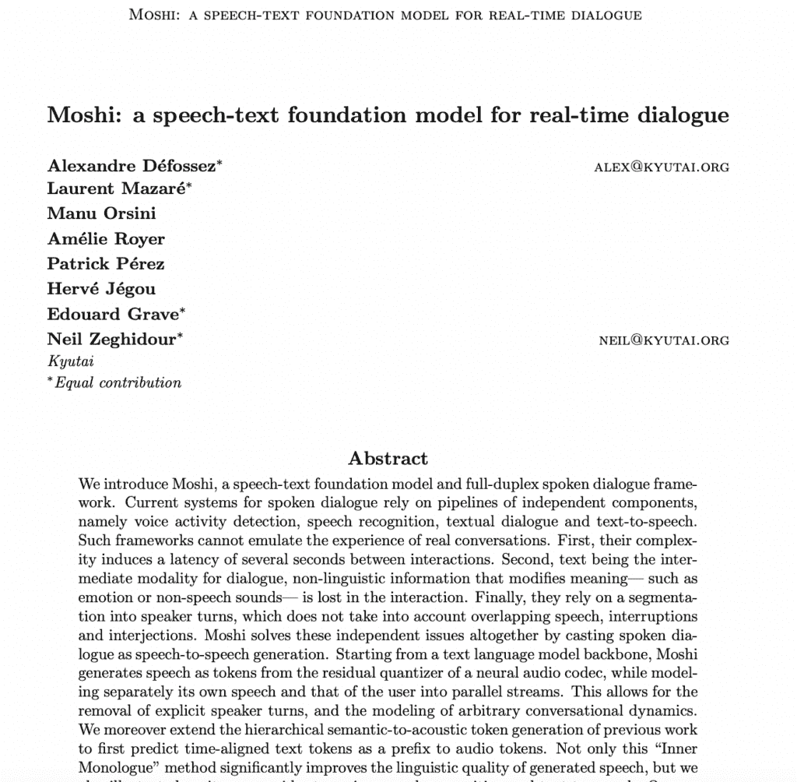
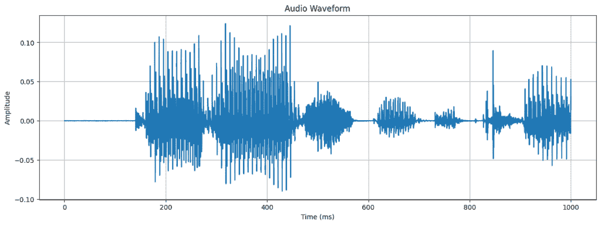
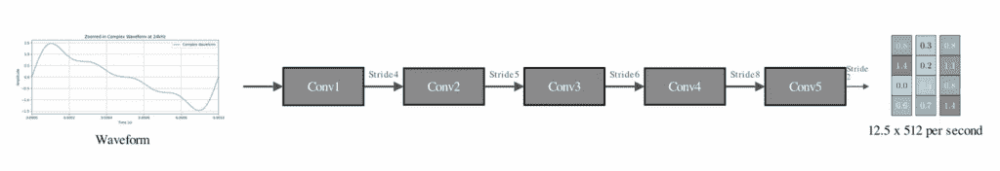
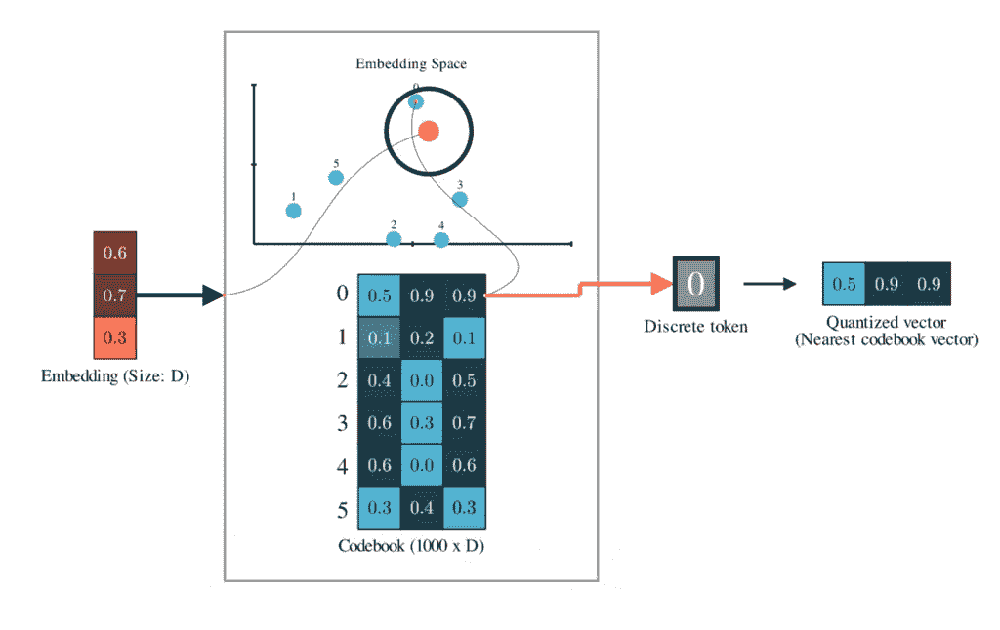
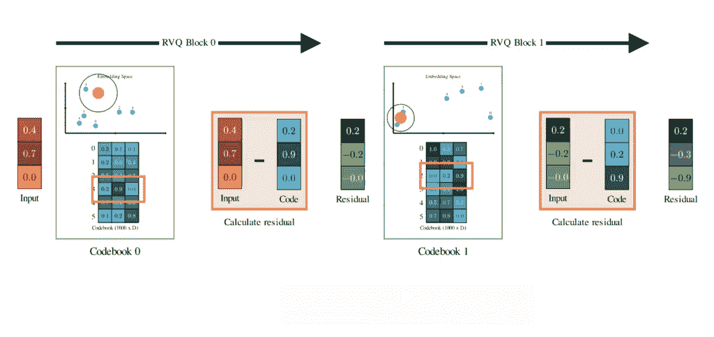
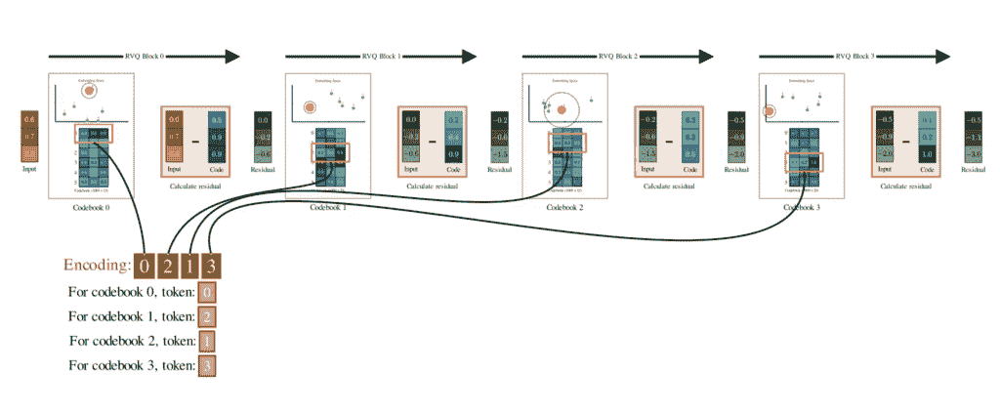
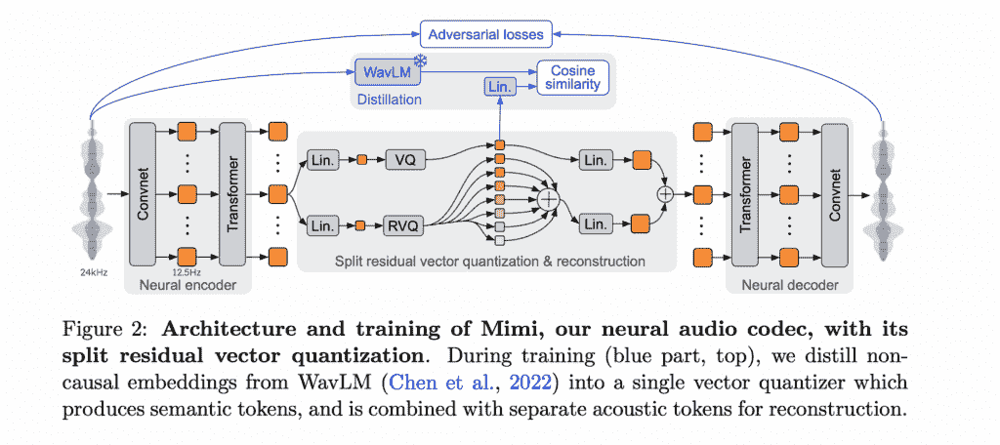
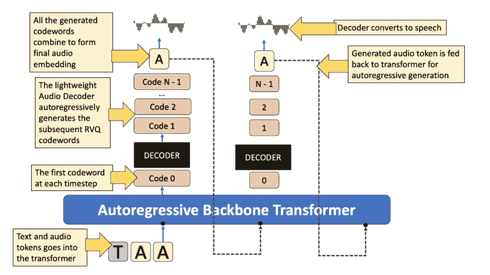

# 芝麻语音模型：这个病毒式 AI 模型如何生成类似人类的语音

> 原文：[`towardsdatascience.com/sesame-speech-model-how-this-viral-ai-model-generates-human-like-speech/`](https://towardsdatascience.com/sesame-speech-model-how-this-viral-ai-model-generates-human-like-speech/)

<mdspan datatext="el1744400684138" class="mdspan-comment">最近，**芝麻 AI**</mdspan>发布了一个他们最新的语音到语音模型的演示。一个擅长说话的对话式 AI 代理，他们提供相关的答案，他们说话时带有表情，而且说实话，他们非常有趣，互动性很强。

*注意，技术论文尚未发布，但他们确实有一篇* [*简短的博客文章*](https://www.sesame.com/research/crossing_the_uncanny_valley_of_voice) *提供了关于他们使用的技巧和之前构建的算法的大量信息*。

幸运的是，他们提供了足够的信息，让我写这篇文章，并制作了一个[YouTube 视频](https://youtu.be/ThG9EBbMhP8)。继续阅读！

### 训练对话语音模型

芝麻是一个**对话语音模型**，或称为 CSM。它输入文本和音频，并生成语音。虽然他们还没有在文章中透露他们的训练数据来源，但我们仍然可以尝试做一个合理的猜测。*博客文章*大量引用了另一个 CSM，[2024 年的莫希](https://moshi.chat/)，幸运的是，莫希的创作者在他们的[论文](https://arxiv.org/abs/2410.00037)中透露了他们的数据来源。莫希使用了*700 万小时的未监督语音数据*，*170 小时的天然和脚本对话*（用于多流训练），以及*2000 小时的电话对话*（Fischer 数据集）。

* * *

芝麻基于[莫希论文](https://arxiv.org/abs/2410.00037)（2024）

## 但要生成音频究竟需要什么？

**在原始形式中，音频只是一长串振幅值**—**一个波形**。例如，如果你以 24 kHz 的采样率采样音频，你每秒捕获 24,000 个浮点值。

这里共有 24,000 个值来表示 1 秒钟的语音！（由作者生成图像）

**当然，仅处理一秒钟数据中的 24,000 个浮点值就非常资源密集**，尤其是在因为变换器计算与序列长度成平方关系的情况下。如果能压缩这个信号并减少处理音频所需的样本数量那就太好了。

我们将深入探讨**米米编码器**和具体地**残差向量量化器（RVQ**），它们是当今深度学习领域音频/语音建模的骨干。我们将通过了解芝麻如何使用其特殊的双变换器架构生成音频来结束这篇文章。

### 预处理音频

压缩和特征提取是卷积帮助我们的地方。芝麻使用 Mimi 语音编码器处理音频。**Mimi 在上述** [**Moshi 论文**](https://arxiv.org/pdf/2410.00037) **中也提到了**。Mimi 是一个自监督的音频编码器-解码器模型，它首先将音频波形转换为离散的“潜在”标记，然后重建原始信号。芝麻只使用 Mimi 的编码器部分来标记输入音频标记。让我们来学习一下。

Mimi 以 24KHz 的原始语音波形输入，通过几个步长卷积层对信号进行下采样，步长因子为 4、5、6、8 和 2。这意味着第一个 CNN 块将音频下采样 4 倍，然后是 5 倍，然后是 6 倍，以此类推。最后，它以 1920 倍的下采样因子下采样，将其减少到每秒 12.5 帧。

卷积块还将原始浮点值投影到 512 维的嵌入维度。每个嵌入聚合原始 1D 波形的局部特征。现在，1 秒的音频被表示为大约 12 个 512 大小的向量。这样，Mimi 将序列长度从 24000 减少到仅 12，并将它们转换为密集的连续向量。

在应用任何量化之前，Mimi 编码器将 24KHz 的输入音频下采样 1920 倍，并将其嵌入到 512 维。换句话说，你每秒得到 12.5 帧，每帧是一个 512 维向量。[(图片来自作者的视频)](https://youtu.be/ThG9EBbMhP8)

### 什么是音频量化？

在卷积层获得连续嵌入后，我们希望标记输入语音。**如果我们能将语音表示为一系列标记，我们就可以应用标准的语言学习转换器来训练生成模型**。

Mimi 使用**残差矢量量化器或 RVQ 标记器**来实现这一点。我们很快就会讨论残差部分，但首先，让我们看看一个简单的普通矢量量化器做了什么。

#### 矢量量化

矢量量化的理念很简单：你训练一个码本，比如说，一个包含 1000 个随机矢量码的集合，每个码的大小为 512（与你的嵌入维度相同）。

一个普通的矢量量化器。训练一个嵌入码本。给定一个输入嵌入，我们将它映射/量化到最近的码本条目。[(作者视频的截图)](https://youtu.be/ThG9EBbMhP8)

然后，给定输入矢量，我们将它映射到我们码本中最接近的矢量——基本上是将一个点捕捉到其最近的簇中心。这意味着我们实际上创建了一个固定词汇表来表示每个音频帧，因为无论输入帧嵌入是什么，我们都会用最近的簇质心来表示它。如果你想了解更多关于矢量量化的信息，请查看我关于这个主题的视频，我在那里对此进行了更深入的探讨。

更多关于矢量量化！ (作者的视频)

#### 剩余向量量化

简单向量量化的问题是，由于我们将每个向量映射到其簇的中心，信息丢失可能太高。这种*“突然”*很少是完美的，因此原始嵌入和最近的码本之间总是存在误差。

剩余向量量化的核心思想是它不仅仅止步于只有一个码本。相反，它试图使用多个码本来表示输入向量。

1.  **首先**，你使用第一个码本对原始向量进行量化。

1.  **然后**，你从原始向量中减去那个质心。你剩下的是**残差**——在第一次量化中未被捕捉到的误差。

1.  现在将这个残差**再次量化**，使用一个充满全新码向量的**第二个码本**——再次通过将其“突然”移动到最近的质心。

1.  减去*那个*，你得到一个更小的残差。再次使用第三个码本进行量化……你可以继续这样做，直到你想要的码本数量。

剩余向量量化器（RVQ）通过使用新的码本和 VQ 层来表示前一个码本的误差，层次化地编码输入嵌入。（作者插画）

每一步都层次化地捕捉到前一轮中遗漏的更多细节。如果你重复这个过程，比如说，N 个码本，你将得到每个量化阶段从每个阶段收集的 N 个离散标记来表示一个音频帧。

RVQ 最酷的地方在于它们被设计成具有高度归纳偏差，以捕捉第一个量化器中最基本的内容。在后续的量化器中，它们学会越来越多地捕捉更精细的特征。

如果你熟悉 PCA，你可以认为第一个码本包含主要的主成分，捕捉最重要的信息。后续的码本代表更高阶的成分，包含提供更多细节的信息。

剩余向量量化器（RVQ）使用多个码本对输入向量进行编码——每个码本中的一个条目。[（作者视频截图）](https://youtu.be/ThG9EBbMhP8)

#### 声学码本与语义码本

由于 Mimi 是在音频重建的任务上训练的，编码器将信号压缩到离散的潜在空间，解码器从潜在空间重建它。在优化这个任务时，RVQ 码本学会在压缩的潜在空间中捕捉输入音频的基本声学内容。

Mimi 还单独训练了一个单个码本（vanilla VQ），它只专注于嵌入音频的语义内容。这就是为什么**Mimi 被称为分割-RVQ 标记器**——它将量化过程分为两个独立的并行路径：一个用于语义信息，另一个用于声学信息。

Mimi 架构（来源：Moshi 论文）许可：免费

为了训练语义表示，Mimi 使用了与现有语音模型 WavLM 结合的知识蒸馏作为语义教师。基本上，Mimi 引入了一个额外的损失函数，该函数减小了语义 RVQ 代码与 WavLM 生成的嵌入之间的余弦距离。

* * *

## 音频解码器

给定包含文本和音频的对话，我们首先使用文本和音频分词器将它们转换为标记嵌入序列。然后，这个标记序列作为时间序列输入到 Transformer 模型中。在博客文章中，这个模型被称为自回归骨干 Transformer。其任务是处理这个时间序列并输出“零阶”代码簿标记。

一个较轻的 Transformer，称为音频解码器，根据骨干 Transformer 生成的零阶代码重建下一个代码簿标记。注意，零阶代码已经包含了关于对话历史的很多信息，因为骨干 Transformer 可以看到整个过去序列。**轻量级的音频解码器只对零阶标记进行操作，并生成其他 N-1 个代码**。这些代码是通过使用 N-1 个不同的线性层生成的，这些层输出从它们各自的代码簿中选择每个代码的概率。

你可以将这个过程想象成从一个只有文本的 LLM 中的词汇表预测一个文本标记。只是基于文本的 LLM 有一个单一的词汇表，但 RVQ 分词器有多个词汇表，以 N 个代码簿的形式存在，因此你需要为每个代码训练一个单独的线性层来建模。

芝麻架构（作者插画）

最后，在所有码字都生成后，我们将它们聚合起来形成一个组合的连续音频嵌入。最后的工作是将这个音频转换回波形。为此，我们应用转置卷积层将嵌入从 12.5 Hz 上采样回 KHz 波形音频。基本上，这是逆转我们在音频预处理期间应用的变换。

### 总结

查看本文的配套视频！（视频由作者提供）

因此，以下是一些关于芝麻模型的整体总结的要点。

1.  芝麻是基于多模态对话语音模型或 CSM 构建的。

1.  文本和音频一起分词，形成一个标记序列，并输入到自回归处理序列的骨干 Transformer 中。

1.  当文本像任何其他基于文本的 LLM 一样处理时，音频则直接从其波形表示进行处理。他们使用 Mimi 编码器将波形转换为使用分割 RVQ 分词器生成的潜在代码。

1.  多模态骨干 Transformer 消耗一个标记序列并预测下一个零阶码字。

1.  另一个轻量级的 Transformer，称为音频解码器，从零阶码字预测下一个码字。

1.  最终的音频帧表示是通过组合所有生成的码字并上采样回波形表示生成的。

感谢阅读！

### 参考文献和必读论文

**[查看我的 ML YouTube 频道](https://www.youtube.com/@avb_fj)**

**[芝麻博客文章和演示](https://www.sesame.com/research/crossing_the_uncanny_valley_of_voice)**

**相关论文:** Moshi: [`arxiv.org/abs/2410.00037`](https://arxiv.org/abs/2410.00037)

SoundStream: [`arxiv.org/abs/2107.03312`](https://arxiv.org/abs/2107.03312)

HuBert: [`arxiv.org/abs/2106.07447`](https://arxiv.org/abs/2106.07447)

语音分词器: [`arxiv.org/abs/2308.16692`](https://arxiv.org/abs/2308.16692)

* * *
