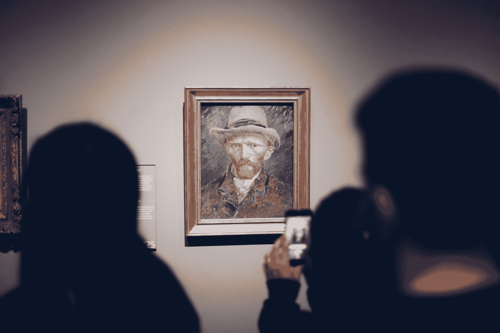

# 图像描述论文概述：Show and Tell

> 原文：[`towardsdatascience.com/show-and-tell-e1a1142456e2/`](https://towardsdatascience.com/show-and-tell-e1a1142456e2/)



图片由[Ståle Grut](https://unsplash.com/@stalebg?utm_source=medium&utm_medium=referral)在[Unsplash](https://unsplash.com?utm_source=medium&utm_medium=referral)上提供

## 引言

自然语言处理和计算机视觉曾经是完全不同的两个领域。好吧，至少在我开始学习机器学习和深度学习的时候，我感觉有多个路径可以遵循，而且每个路径，包括 NLP 和计算机视觉，都引导我进入一个完全不同的世界。随着时间的推移，我们现在可以观察到 AI 变得越来越先进，多个研究领域之间的交集变得越来越常见，包括我刚才提到的两个领域。

今天，许多语言模型都有根据给定提示生成图像的能力。这是 NLP 和计算机视觉之间桥梁的一个例子。但我想我会在即将到来的文章中保存这个话题，因为它稍微复杂一些。相反，在这篇文章中，我将讨论一个更简单的：图像描述。正如其名所示，这本质上是一种技术，其中特定的模型接受一张图片，并返回描述输入图片的文本。

在这个主题中，最早的一些论文之一是由 Vinyals 等人于 2015 年撰写的题为"*Show and Tell: A Neural Image Caption Generator*"的论文[1]。在这篇文章中，我将专注于使用 PyTorch 实现论文中提出的深度学习模型。请注意，我实际上不会在这里展示训练过程，因为这本身就是一个独立的话题。如果你想要一个关于这个话题的单独教程，请在评论中告诉我。

* * *

## 图像描述框架

通常来说，图像描述可以通过结合两种类型的模型来完成：一种专门用于处理图像，另一种能够处理序列。我相信你已经知道哪种模型最适合这两个任务——是的，你说对了，那就是 CNN 和 RNN。这里的想法是，CNN 被用来编码输入图像（因此这一部分被称为*编码器*），而 RNN 被用来根据 CNN 编码的特征生成一系列单词（因此 RNN 部分被称为*解码器*）。

论文中讨论了作者尝试使用 GoogLeNet（也称为 Inception V1）作为编码器，LSTM 作为解码器来做到这一点。实际上，GoogLeNet 的使用并没有明确提及，但根据论文中提供的插图，编码器中使用的架构似乎是从原始的 GoogLeNet 论文[2]中采用的。下面的图显示了所提出的架构。

![图 1. [1]中提出的图像标题模型，其中编码器部分（最左侧的块）实现了 GoogLeNet 模型[2]。](../Images/ee6c81bdd036b50466edf1e9b6a1c2c3.png)

图 1. [1]中提出的图像标题模型，其中编码器部分（最左侧的块）实现了 GoogLeNet 模型[2]。

更具体地谈谈编码器和解码器之间的连接，有几种方法可以将这两个部分连接起来，即*init-inject*、*pre-inject*、*par-inject*和*merge*，如[3]中所述。在*Show and Tell*论文中，作者使用了*pre-inject*方法，即编码器提取的特征被视为标题中的第 0 个单词。在推理阶段，我们期望解码器仅基于这些图像特征生成标题。

![图 2. 可用于连接图像标题模型编码器和解码器部分的四种方法[3]。在我们的案例中，我们将使用预注入方法(b)](../Images/0d53ace786e6a706c4f79dc10d054307.png)

图 2. 可用于连接图像标题模型编码器和解码器部分的四种方法[3]。在我们的案例中，我们将使用*pre-inject*方法（b）。

我们已经理解了图像标题模型背后的理论，现在我们可以直接进入代码部分了！

* * *

# 实现

我将实现部分分为三个部分：编码器、解码器和两者的组合。在我们真正进入它们之前，我们需要提前导入模块并初始化所需的参数。查看以下代码块 1，以了解我使用的模块。

```py
# Codeblock 1
import torch  #(1)
import torch.nn as nn  #(2)
import torchvision.models as models  #(3)
from torchvision.models import GoogLeNet_Weights  #(4)
```

让我们快速分析这些导入语句：标记为`#(1)`的行用于基本操作，`#(2)`行用于初始化神经网络层，`#(3)`行用于加载各种深度学习模型，而`#(4)`是 GoogLeNet 模型的预训练权重。

谈到参数配置，论文中只提到了两个参数`EMBED_DIM`和`LSTM_HIDDEN_DIM`，它们都被设置为 512，如以下代码块 2 中的`#(1)`和`#(2)`行所示。`EMBED_DIM`变量本质上表示代表标题中单个标记的特征向量大小。在这种情况下，我们可以简单地将单个标记视为一个单独的单词。同时，`LSTM_HIDDEN_DIM`是一个表示 LSTM 细胞内部隐藏状态大小的变量。这篇论文没有提到这个基于 RNN 的层重复了多少次，但根据图 1 中的图示，它似乎只实现了一个 LSTM 细胞。因此，我在`#(3)`行将`NUM_LSTM_LAYERS`变量设置为 1。

```py
# Codeblock 2
EMBED_DIM       = 512    #(1)
LSTM_HIDDEN_DIM = 512    #(2)
NUM_LSTM_LAYERS = 1      #(3)

IMAGE_SIZE      = 224    #(4)
IN_CHANNELS     = 3      #(5)

SEQ_LENGTH      = 30     #(6)
VOCAB_SIZE      = 10000  #(7)

BATCH_SIZE      = 1
```

接下来的两个参数与输入图像相关，即`IMAGE_SIZE`（编号为#(4)）和`IN_CHANNELS`（编号为#(5)）。由于我们即将使用 GoogLeNet 作为编码器，我们需要将其与原始输入形状（3×224×224）相匹配。不仅对于图像，我们还需要配置标题的参数。在这里，我们假设标题长度不超过 30 个单词（编号为#(6)），字典中唯一单词的数量为 10000（编号为#(7)）。最后，`BATCH_SIZE`参数被使用，因为默认情况下 PyTorch 以批处理方式处理张量。为了简化问题，单个批处理中的图像-标题对数量被设置为 1。

### GoogLeNet 编码器

实际上，可以使用任何基于 CNN 的模型作为编码器。我在互联网上发现[4]使用了 DenseNet，[5]使用了 Inception V3，[6]使用了 ResNet 来完成类似任务。然而，由于我的目标是尽可能忠实地重现论文中提出的模型，我使用了预训练的 GoogLeNet 模型。在我们进入编码器实现之前，让我们看看以下代码中 GoogLeNet 架构的样子。

```py
# Codeblock 3
models.googlenet()
```

结果输出非常长，因为它实际上列出了架构中的所有层。在这里，我截断了输出，因为我只想让你关注最后一个层（在代码块 3 输出中标记为#(1)的`fc`层）。你可以看到这个线性层将大小为 1024 的特征向量映射到 1000。通常，在一个标准的图像分类任务中，这些 1000 个神经元中的每一个都对应一个特定的类别。所以，例如，如果你想要执行一个 5 类分类任务，你需要修改这个层，使其只投影到 5 个神经元。在我们的情况下，我们需要使这个层产生长度为 512 的特征向量（`EMBED_DIM`）。有了这个，输入图像在经过 GoogLeNet 模型处理后，将被表示为一个 512 维度的向量。这个特征向量的大小将与标记嵌入维度完全匹配，允许它被视为我们单词序列的一部分。

```py
# Codeblock 3 Output
GoogLeNet(
  (conv1): BasicConv2d(
    (conv): Conv2d(3, 64, kernel_size=(7, 7), stride=(2, 2), padding=(3, 3), bias=False)
    (bn): BatchNorm2d(64, eps=0.001, momentum=0.1, affine=True, track_running_stats=True)
  )
  (maxpool1): MaxPool2d(kernel_size=3, stride=2, padding=0, dilation=1, ceil_mode=True)
  (conv2): BasicConv2d(
    (conv): Conv2d(64, 64, kernel_size=(1, 1), stride=(1, 1), bias=False)
    (bn): BatchNorm2d(64, eps=0.001, momentum=0.1, affine=True, track_running_stats=True)
  )

  .
  .
  .
  .

  (avgpool): AdaptiveAvgPool2d(output_size=(1, 1))
  (dropout): Dropout(p=0.2, inplace=False)
  (fc): Linear(in_features=1024, out_features=1000, bias=True)  #(1)
)
```

现在，让我们实际加载并修改 GoogLeNet 模型，我在下面的`InceptionEncoder`类中这样做。

```py
# Codeblock 4a
class InceptionEncoder(nn.Module):
    def __init__(self, fine_tune):  #(1)
        super().__init__()
        self.googlenet = models.googlenet(weights=GoogLeNet_Weights.IMAGENET1K_V1)  #(2)
        self.googlenet.fc = nn.Linear(in_features=self.googlenet.fc.in_features,  #(3)
                                      out_features=EMBED_DIM)  #(4)

        if fine_tune == True:       #(5)
            for param in self.googlenet.parameters():
                param.requires_grad = True
        else:
            for param in self.googlenet.parameters():
                param.requires_grad = False

        for param in self.googlenet.fc.parameters():
            param.requires_grad = True
```

在上述代码中，我们首先使用`models.googlenet()`加载模型。论文中提到该模型已经在 ImageNet 数据集上预训练。因此，我们需要将`GoogLeNet_Weights.IMAGENET1K_V1`传递给`weights`参数，如代码块 4a 中的行#(2)所示。接下来，在行#(3)中，我们通过`fc`属性访问分类头，其中我们用一个新的具有 512 维输出维度（`EMBED_DIM`）（编号为#(4)）的线性层替换现有的线性层。由于这个 GoogLeNet 模型已经训练过，我们不需要从头开始训练它。相反，我们可以执行*微调*或*迁移学习*来适应图像标题任务。

如果您还不熟悉这两个术语，*微调*是一种更新整个模型权重的技术。另一方面，*迁移学习*是一种技术，我们只更新我们替换的层的权重（在这种情况下是最后一个全连接层），同时将现有层的权重设置为不可训练。为此，我在第 `#(1)` 行实现了一个名为 `fine_tune` 的标志，当它设置为 `True` 时（`#(5)`），模型将执行微调。

`forward()` 方法相当直接，因为我们在这里只是简单地将输入图像通过修改后的 GoogLeNet 模型传递。请参阅下面的代码块 4b 以获取详细信息。此外，我在这里还打印出了处理前后的张量维度，以便您更好地理解 `InceptionEncoder` 模型的工作原理。

```py
# Codeblock 4b
    def forward(self, images):
        print(f'originalt: {images.size()}')
        features = self.googlenet(images)
        print(f'after googlenett: {features.size()}')

        return features
```

为了测试我们的解码器是否正常工作，我们可以通过网络传递一个大小为 1×3×224×224 的虚拟张量，如代码块 5 所示。这个张量维度模拟了一个 224×224 大小的单个 RGB 图像。您可以在生成的输出中看到，我们的图像现在变成了一个长度为 512 的一维特征向量。

```py
# Codeblock 5
inception_encoder = InceptionEncoder(fine_tune=True)

images = torch.randn(BATCH_SIZE, IN_CHANNELS, IMAGE_SIZE, IMAGE_SIZE)
features = inception_encoder(images)
```

```py
# Codeblock 5 Output
original         : torch.Size([1, 3, 224, 224])
after googlenet  : torch.Size([1, 512])
```

### LSTM 解码器

由于我们已经成功实现了编码器，现在我们将创建 LSTM 解码器，我在代码块 6a 和 6b 中进行了演示。我们首先需要初始化所需的层，即一个嵌入层（`#(1)`）、LSTM 层本身（`#(2)`）和一个标准线性层（`#(3)`）。第一个（`nn.Embedding`）负责将每个标记映射到一个 512（`EMBED_DIM`）维度的向量。同时，LSTM 层将生成一系列嵌入标记，其中每个标记将通过线性层映射到一个 10000（`VOCAB_SIZE`）维度的向量。随后，这个向量中的值将代表字典中每个单词被选中的可能性。

```py
# Codeblock 6a
class LSTMDecoder(nn.Module):
    def __init__(self):
        super().__init__()

        #(1)
        self.embedding = nn.Embedding(num_embeddings=VOCAB_SIZE,
                                      embedding_dim=EMBED_DIM)
        #(2)
        self.lstm = nn.LSTM(input_size=EMBED_DIM, 
                            hidden_size=LSTM_HIDDEN_DIM, 
                            num_layers=NUM_LSTM_LAYERS, 
                            batch_first=True)
        #(3)        
        self.linear = nn.Linear(in_features=LSTM_HIDDEN_DIM, 
                                out_features=VOCAB_SIZE)
```

接下来，让我们使用以下代码定义网络的流程。

```py
# Codeblock 6b
    def forward(self, features, captions):                 #(1)
        print(f'features originalt: {features.size()}')
        features = features.unsqueeze(1)                   #(2)
        print(f"after unsqueezett: {features.shape}")

        print(f'captions originalt: {captions.size()}')
        captions = self.embedding(captions)                #(3)
        print(f"after embeddingtt: {captions.shape}")

        captions = torch.cat([features, captions], dim=1)  #(4)
        print(f"after concattt: {captions.shape}")

        captions, _ = self.lstm(captions)                  #(5)
        print(f"after lstmtt: {captions.shape}")

        captions = self.linear(captions)                   #(6)
        print(f"after lineartt: {captions.shape}")

        return captions
```

你可以在上面的代码中看到，`LSTMDecoder`类的`forward()`方法接受两个输入：`features`和`captions`，其中前者是经过`InceptionEncoder`处理的图像，而后者是作为真实值的对应图像的标题（`#(1)`）。这里的想法是我们将通过在代码的第`#(4)`行中将`features`张量前置到`captions`中来执行预注入操作。然而，请注意，我们需要事先调整两个张量的形状。为此，我们必须在图像特征的第 1 轴插入一个维度（`#(2)`）。同时，`captions`张量的形状将在经过嵌入层处理后立即符合我们的要求（`#(3)`）。由于`features`和`captions`已经被连接，然后我们通过 LSTM 层（`#(5)`）传递这个张量，在它最终被线性层（`#(6)`）处理之前。查看下面的测试代码以更好地理解两个张量的流动。

```py
# Codeblock 7
lstm_decoder = LSTMDecoder()

features = torch.randn(BATCH_SIZE, EMBED_DIM)  #(1)
captions = torch.randint(0, VOCAB_SIZE, (BATCH_SIZE, SEQ_LENGTH))  #(2)

captions = lstm_decoder(features, captions)
```

在代码块 7 中，我假设`features`是一个代表`InceptionEncoder`模型输出的虚拟张量（`#(1)`）。同时，`captions`是表示一系列标记化单词的张量，在这种情况下，我将其初始化为介于 0 到 10000（`VOCAB_SIZE`）之间的随机数，长度为 30（`SEQ_LENGTH`）（`#(2)`）。

我们可以在下面的输出中看到，特征张量最初具有 1×512 的维度（`#(1)`）。经过`unsqueeze()`操作处理后，该张量形状变为 1×1×512（`#(2)`）。中间增加的维度（1）允许张量被视为对应单个时间步的特征向量，这对于与 LSTM 层兼容是必要的。对于`captions`张量，其形状从 1×30（`#(3)`）变为 1×30×512（`#(4)`），表示每个单词现在都表示为一个 512 维向量。

```py
# Codeblock 7 Output
features original : torch.Size([1, 512])       #(1)
after unsqueeze   : torch.Size([1, 1, 512])    #(2)
captions original : torch.Size([1, 30])        #(3)
after embedding   : torch.Size([1, 30, 512])   #(4)
after concat      : torch.Size([1, 31, 512])   #(5)
after lstm        : torch.Size([1, 31, 512])   #(6)
after linear      : torch.Size([1, 31, 10000]) #(7)
```

预注入操作完成后，我们的张量现在具有 1×31×512 的维度，其中`features`张量成为序列中第 0 个时间步的标记（`#(5)`）。参见以下图表以更好地说明这个想法。

![图 3。预注入操作后结果张量的样子。[3]。](../Images/1a27cc26d252903752d57adc2b40ba5a.png)

图 3。预注入操作后结果张量的样子。[3]。

接下来，我们将张量通过 LSTM 层传递，在这个特定的情况下，输出张量的维度保持不变。然而，需要注意的是，上述输出中行 `#(5)` 和 `#(6)` 的张量形状实际上是由不同的参数指定的。这里维度看起来匹配是因为 `EMBED_DIM` 和 `LSTM_HIDDEN_DIM` 都被设置为 512。通常情况下，如果我们为 `LSTM_HIDDEN_DIM` 使用不同的值，那么输出维度也会不同。最后，我们将每个 31 个标记嵌入投影到大小为 10000 的向量中，这个向量将后来包含预测的每个可能标记的概率 (`#(7)`).

### GoogLeNet 编码器 + LSTM 解码器

到目前为止，我们已经成功创建了图像描述模型中的编码器和解码器部分。接下来，我打算在下面的 `ShowAndTell` 类中将它们组合在一起。

```py
# Codeblock 8a
class ShowAndTell(nn.Module):
    def __init__(self):
        super().__init__()
        self.encoder = InceptionEncoder(fine_tune=True)  #(1)
        self.decoder = LSTMDecoder()     #(2)

    def forward(self, images, captions):
        features = self.encoder(images)  #(3)
        print(f"after encodert: {features.shape}")

        captions = self.decoder(features, captions)      #(4)
        print(f"after decodert: {captions.shape}")

        return captions
```

我认为上面的代码相当直观。在 `__init__()` 方法中，我们只需要初始化 `InceptionEncoder` 和 `LSTMDecoder` 模型（`#(1)` 和 `#(2)`）。这里我假设我们即将进行微调而不是迁移学习，所以我将 `fine_tune` 参数设置为 `True`。从理论上讲，如果你有一个相对较大的数据集，微调比迁移学习更好，因为它通过重新调整整个模型的权重来工作。然而，如果你的数据集相对较小，你应该选择迁移学习——但这只是理论。当然，尝试这两种选项以查看哪种在你的情况下效果最好是一个好主意。

仍然使用上面的代码块，我们配置 `forward()` 方法以接受图像-描述对作为输入。通过这种配置，我们基本上设计了这个方法，使其只能用于训练目的。在这里，我们最初使用编码器块中的 GoogLeNet 处理原始图像（`#(3)`）。之后，我们将提取的特征以及标记化的描述传递到解码器块，并让它生成另一个标记序列（`#(4)`）。在实际训练中，这个描述输出将与真实值进行比较，以计算误差。这个误差值将被用来通过反向传播计算梯度，这决定了网络中权重的更新方式。

重要的是要知道我们不能使用 `forward()` 方法来进行推理，因此我们需要一个专门的方法来处理这个任务。在这种情况下，我打算在下面的 `generate()` 方法中具体实现代码以执行推理。

```py
# Codeblock 8b
    def generate(self, images):  #(1)
        features = self.encoder(images)              #(2)
        print(f"after encodertt: {features.shape}n")

        words = []  #(3)
        for i in range(SEQ_LENGTH):                  #(4)
            print(f"iteration #{i}")
            features = features.unsqueeze(1)
            print(f"after unsqueezett: {features.shape}")

            features, _ = self.decoder.lstm(features)
            print(f"after lstmtt: {features.shape}")

            features = features.squeeze(1)           #(5)
            print(f"after squeezett: {features.shape}")

            probs = self.decoder.linear(features)    #(6)
            print(f"after lineartt: {probs.shape}")

            _, word = probs.max(dim=1)  #(7)
            print(f"after maxtt: {word.shape}")

            words.append(word.item())  #(8)

            if word == 1:  #(9)
                break

            features = self.decoder.embedding(word)  #(10)
            print(f"after embeddingtt: {features.shape}n")

        return words       #(11)
```

与之前只接受两个输入不同，`generate()`方法只接受原始图像作为唯一输入（`#(1)`）。由于我们希望从图像中提取的特征成为初始输入标记，我们首先需要使用编码器块处理原始输入图像，然后再生成后续标记（`#(2)`）。接下来，我们为稍后要生成的标记序列分配一个空列表（`#(3)`）。标记本身是一个接一个生成的，因此我们将整个过程包裹在一个`for`循环中，该循环将在达到最多 30 个单词（`SEQ_LENGTH`）时停止迭代（`#(4)`）。

循环内部执行的步骤在算法上与之前讨论的类似。然而，由于这里的 LSTM 单元一次生成一个标记，这个过程需要对张量进行一些不同的处理，不同于之前在代码块 6b 中通过`LSTMDecoder`类的`forward()`方法传递的张量。你可能首先注意到的不同是`squeeze()`操作（`#(5)`），这基本上是一个技术步骤，以确保后续层能够正确地进行线性投影（`#(6)`）。然后，我们取具有最高值的特征向量的索引，这对应于最有可能出现的标记（`#(7)`），并将其追加到我们之前分配的列表中（`#(8)`）。当预测的索引是*停止标记*时，循环将中断，在这种情况下，我假设这个标记位于`probs`向量的第 1 个索引。否则，如果模型没有找到*停止标记*，那么它将把最后一个预测的单词转换为其 512 维（`EMBED_DIM`）向量（`#(10)`），使其能够作为下一次迭代的输入特征。最后，一旦循环完成，将返回生成的单词序列（`#(11)`）。

我们将使用下面的代码块 9 来模拟训练阶段的正向传播。在这里，我通过`show_and_tell`模型（`#(1)`）传递了两个张量，每个张量代表一个大小为 3×224×224 的原始图像（`#(2)`）和一个分词后的单词序列（`#(3)`）。根据产生的输出，我们发现我们的模型运行正常，因为两个输入张量成功通过了网络的`InceptionEncoder`和`LSTMDecoder`部分。

```py
# Codeblock 9
show_and_tell = ShowAndTell()  #(1)

images = torch.randn(BATCH_SIZE, IN_CHANNELS, IMAGE_SIZE, IMAGE_SIZE)  #(2)
captions = torch.randint(0, VOCAB_SIZE, (BATCH_SIZE, SEQ_LENGTH))      #(3)

captions = show_and_tell(images, captions)
```

```py
# Codeblock 9 Output
after encoder : torch.Size([1, 512])
after decoder : torch.Size([1, 31, 10000])
```

现在，让我们假设我们的`show_and_tell`模型已经在图像标题数据集上进行了训练，因此已经准备好用于推理。查看下面的代码块 10，看看我是如何做到这一点的。在这里，我们将模型设置为`eval()`模式（`#(1)`），初始化输入图像（`#(2)`），并使用`generate()`方法通过模型传递它。

```py
# Codeblock 10
show_and_tell.eval()  #(1)

images = torch.randn(BATCH_SIZE, IN_CHANNELS, IMAGE_SIZE, IMAGE_SIZE)  #(2)

with torch.no_grad():
    generated_tokens = show_and_tell.generate(images)  #(3)
```

张量的流动可以在下面的输出中看到。在这里，我截断了产生的输出，因为它只显示了相同的标记生成过程 30 次。

```py
# Codeblock 10 Output
after encoder    : torch.Size([1, 512])

iteration #0
after unsqueeze  : torch.Size([1, 1, 512])
after lstm       : torch.Size([1, 1, 512])
after squeeze    : torch.Size([1, 512])
after linear     : torch.Size([1, 10000])
after max        : torch.Size([1])
after embedding  : torch.Size([1, 512])

iteration #1
after unsqueeze  : torch.Size([1, 1, 512])
after lstm       : torch.Size([1, 1, 512])
after squeeze    : torch.Size([1, 512])
after linear     : torch.Size([1, 10000])
after max        : torch.Size([1])
after embedding  : torch.Size([1, 512])

.
.
.
.
```

要查看生成的标题的样子，我们只需像下面这样打印出`generated_tokens`列表。请注意，这个序列仍然是分词后的单词形式。稍后，在后处理阶段，我们需要将它们转换回对应的单词。

```py
# Codeblock 11
generated_tokens
```

```py
# Codeblock 11 Output
[5627,
 3906,
 2370,
 2299,
 4952,
 9933,
 402,
 7775,
 602,
 4414,
 8667,
 6774,
 9345,
 8750,
 3680,
 4458,
 1677,
 5998,
 8572,
 9556,
 7347,
 6780,
 9672,
 2596,
 9218,
 1880,
 4396,
 6168,
 7999,
 454]
```

* * *

## 结束

通过上述输出，我们结束了对图像标题生成技术的讨论。随着时间的推移，许多其他研究人员试图改进这项任务。因此，我认为在接下来的文章中，我将讨论这个主题的最新方法。

感谢阅读，希望你在今天学到了一些新知识！

_ 顺便说一下，你还可以在这里找到本文中使用的代码[here](https://github.com/MuhammadArdiPutra/medium_articles/blob/main/Show%20and%20Tell.ipynb)._

* * *

## 参考文献

[1] Oriol Vinyals 等人. Show and Tell：一种神经图像标题生成器。Arxiv. [`arxiv.org/pdf/1411.4555`](https://arxiv.org/pdf/1411.4555) [访问日期：2024 年 11 月 13 日].

[2] Christian Szegedy 等人. 使用卷积加深。Arxiv. [`arxiv.org/pdf/1409.4842`](https://arxiv.org/pdf/1409.4842) [访问日期：2024 年 11 月 13 日].

[3] Marc Tanti 等人. 在图像标题生成器中放置图像的位置。Arxiv. [`arxiv.org/pdf/1703.09137`](https://arxiv.org/pdf/1703.09137) [访问日期：2024 年 11 月 13 日].

[4] Stepan Ulyanin. 使用 PyTorch 进行 CNN 和 RNN 图像标题生成。Medium. [`medium.com/@stepanulyanin/captioning-images-with-pytorch-bc592e5fd1a3`](https://medium.com/@stepanulyanin/captioning-images-with-pytorch-bc592e5fd1a3) [访问日期：2024 年 11 月 16 日].

[5] Saketh Kotamraju. 在 Pytorch 中构建图像标题模型的方法。Towards Data Science. [`contributor.insightmediagroup.io/how-to-build-an-image-captioning-model-in-pytorch-29b9d8fe2f8c`](https://contributor.insightmediagroup.io/how-to-build-an-image-captioning-model-in-pytorch-29b9d8fe2f8c) [访问日期：2024 年 11 月 16 日].

[6] Aarohi 的代码。使用 CNN 和 RNN 进行图像标题生成 | 使用深度学习进行图像标题生成。YouTube. [`www.youtube.com/watch?v=htNmFL2BG34`](https://www.youtube.com/watch?v=htNmFL2BG34) [访问日期：2024 年 11 月 16 日].
