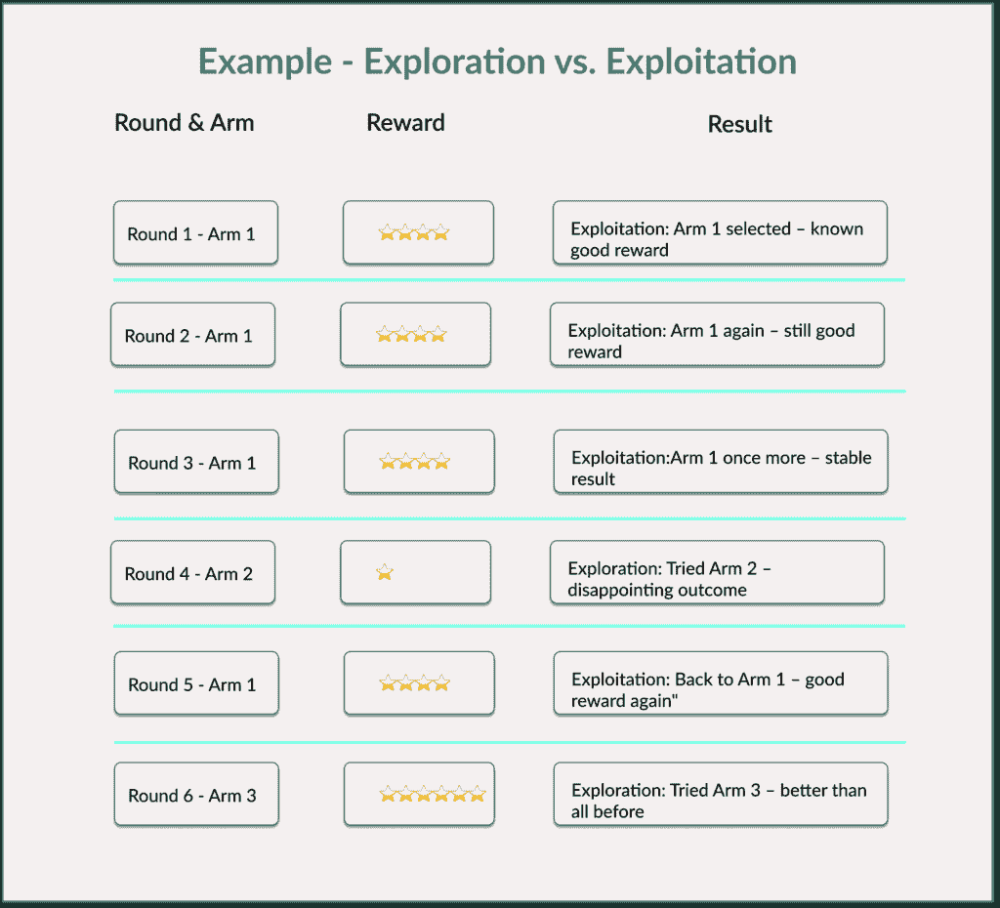
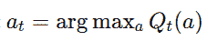
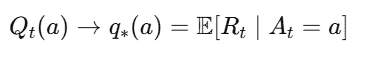
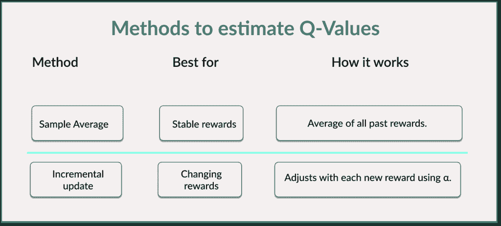
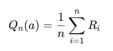
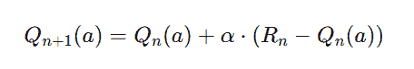
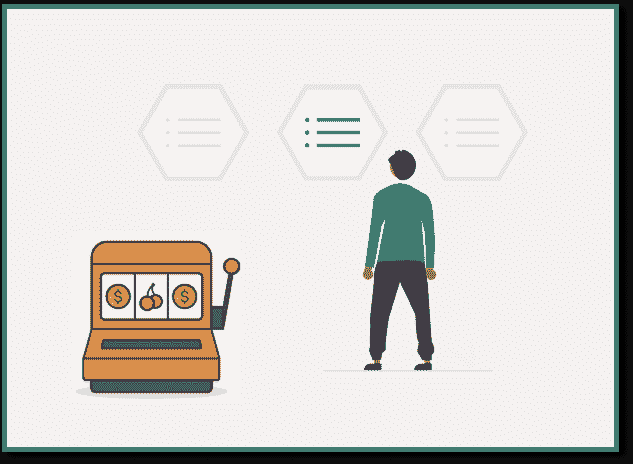

# 多臂老虎机简单指南：强化学习前的关键概念

> 原文：[`towardsdatascience.com/simple-guide-to-multi-armed-bandits-a-key-concept-before-reinforcement-learning/`](https://towardsdatascience.com/simple-guide-to-multi-armed-bandits-a-key-concept-before-reinforcement-learning/)

<mdspan datatext="el1752520606550" class="mdspan-comment">算法如何做出明智的选择，当它一开始一无所知，只能通过试错来学习时？</mdspan>

这正是强化学习中最简单但最重要的模型所关注的内容：

多臂老虎机是一个简单的试错学习模型。

就像我们一样。

我们将探讨为什么在尝试新事物（探索）和坚持有效的方法（利用）之间的决策比看起来要复杂。以及这与人工智能、在线广告和 A/B 测试有什么关系。

由 ChatGPT 4o 进行可视化。

## 为什么理解这个概念很重要？

多臂老虎机引入了强化学习的一个核心困境：如何在不确定的情况下做出好的决策。

它不仅与人工智能、数据科学和行为模型相关，而且因为它反映了我们人类如何通过试错来学习。

通过试错学习，机器所学习的内容与我们人类直觉行为并没有太大的不同。

差别在哪里？

机器以数学优化的方式做到这一点。

**让我们想象一个简单的例子：**

我们站在一台老虎机前。这台机器有 10 只手臂，每只手臂都有未知的中奖概率。

一些杠杆给出更高的奖励，而另一些则给出较低的奖励。

我们可以随心所欲地拉动杠杆，但我们的目标是赢得尽可能多的东西。

这意味着我们必须找出哪只手臂是最好的（=带来最大利润），而一开始并不知道哪一个是。

这个模型非常类似于我们在日常生活中经常经历的事情：

我们测试不同的策略。在某个时候，我们使用那个能给我们带来最大快乐、享受、金钱等的东西。无论我们追求的是什么。

在行为心理学中，我们谈论试错学习。

或者我们也可以从认知心理学的角度思考奖励学习：在实验室实验中，动物随着时间的推移会发现哪个杠杆有食物，因为它们在那个特定的杠杆上获得最大的收益。

**现在回到多臂老虎机的概念：**

它作为不确定条件下决策的介绍，是理解强化学习的基础。

我在上一篇文章中详细介绍了强化学习（RL），“[强化学习简单化：用 Python 构建 Q 学习智能体](https://towardsdatascience.com/reinforcement-learning-made-simple-build-a-q-learning-agent-in-python/)”。但它的核心是关于一个智能体通过试错学习做出好的决策。它是机器学习的一个子领域。智能体发现自己处于一个环境中，决定采取某些行动，并因这些行动而获得奖励或惩罚。智能体的目标是制定一个策略（策略），以最大化长期的整体利益。

**所以我们必须在多臂老虎机中找出：**

1.  哪些杠杆在长期内是值得的？

1.  我们应该在什么时候进一步利用杠杆（利用）？

1.  我们应该在什么时候尝试新的杠杆（探索）？

这两个问题直接引出了强化学习的核心困境：

## 强化学习中的核心困境：探索与利用

你有没有一直坚持一个好的选择？结果发现还有更好的一个？这就是利用胜过探索。

这是通过经验学习的核心问题：

+   探索：我们尝试新事物以获得更多信息。也许我们会发现更好的东西。也许不会。

+   利用：我们使用我们迄今为止学到的最好的东西。目的是获得尽可能多的奖励。

这有什么问题？

我们永远不知道我们是否已经找到了最佳选项。

选择到目前为止奖励最高的臂意味着依赖我们所知道的信息。这被称为利用。然而，如果我们过早地承诺一个看似好的臂，我们可能会忽略一个更好的选择。

尝试不同的或很少使用的臂给我们带来新的信息。我们获得了更多的知识。这是探索。我们可能会找到一个更好的选择。但也可能找到一个更差的选择。

这就是强化学习核心的困境。

作者的视觉化。

### 我们可以从中得出什么结论：

如果我们过早地利用，我们可能会错过更好的选择（这里指臂 3 而不是臂 1）。然而，过多的探索也会导致整体产量减少（如果我们已经知道臂 1 是好的）。

让我用非技术性的语言（但有些简化）再次解释同样的事情：

让我们想象我们知道一家好餐厅。我们因为喜欢它，已经去了 10 年。但如果我们附近有一个更好、更便宜的地方呢？而我们从未尝试过？如果我们从不尝试新事物，我们就永远不会发现。

**有趣的是，这不仅仅是一个 AI 问题。在心理学和经济学中也很知名：**

探索与利用的困境是决策不确定性的一个典型例子。

心理学家和诺贝尔奖获得者[丹尼尔·卡尼曼（Daniel Kahnemann）和他的同事阿莫斯·特沃斯基（Amos Tversky）](https://en.wikipedia.org/wiki/Prospect_theory) 已经表明，当人们面对不确定性时，往往不会做出理性的决策。相反，我们遵循启发式方法，即心理捷径。

这些捷径通常反映了习惯（=利用）或好奇心（=探索）。这种动态在多臂老虎机中也是可见的：

+   我们是否采取保守策略（=具有高奖励的已知臂）？

    或者

+   我们是否冒险尝试新事物（=具有未知奖励的新臂）？

### 这为什么对强化学习很重要？

在强化学习（RL）中，我们面临着探索与利用的困境。

强化学习代理必须不断决定是坚持到目前为止表现最好的策略（=利用）还是尝试新事物以发现更好的策略（=探索）。

你可以在推荐系统中看到这种权衡：我们应该继续向用户展示他们已经喜欢的内容，还是冒险建议他们可能喜欢的新内容？

## 那么有哪些策略来选择最佳臂？动作选择策略

动作选择策略决定了代理如何决定在下一步选择哪个臂。换句话说，代理如何处理探索与利用的困境。

以下每种策略（也是策略/规则）都回答了一个简单的问题：当我们不确定什么是最优的时候，我们如何选择下一个动作？

### 策略 1 – Greedy

这是 simplest 策略：我们总是选择估计奖励最高的臂（即最高的 Q(a)）。换句话说，总是选择现在看起来最好的。

这种策略的优势在于短期内的奖励最大化，而且策略非常简单。

缺点是缺乏探索。没有冒险去尝试新事物，因为当前的最佳选择总是获胜。代理可能会错过尚未发现的更好选项。

正式规则如下：

让我们看看一个简化的例子：

想象一下，我们尝试了两家新的披萨店。第二家相当不错。从那时起，我们只去那家，即使还有六家我们从未尝试过。也许我们错过了镇上最好的披萨。但我们永远不会知道。

### 策略 2 – ε-Greedy：

与总是选择已知的最佳选项不同，在这个策略中，我们允许一些随机性：

+   以概率 ε，我们探索（尝试新事物）。

+   以概率 1-ε，我们利用（坚持当前的最佳选择）。

这种策略故意将机会混合到决策中，因此实用且通常有效。

+   ε值越高，探索越多。

+   ε 越低，我们利用已知信息的程度就越高。

例如，如果 ε = 0.1，10% 的情况下发生探索，而 90% 的情况下发生利用。

ε-Greedy 的优势在于易于实现，并提供良好的基本性能。

缺点是选择正确的 ε 很困难：如果 ε 选择得太大，就会进行大量的探索，奖励损失可能太大。如果 ε 太小，探索就很少。

如果我们继续以披萨为例：

我们在每次访问餐厅之前掷骰子。如果我们掷出 6，我们就尝试一家新的披萨店。如果不是，我们就去常去的披萨店。

### 策略 3 – 乐观初始值：

这种策略的要点是所有 Q0 都从人工设置的高值（例如 5.0 而不是 0.0）开始。一开始，智能体假设所有选项都是很好的。

这鼓励智能体尝试一切（探索）。它想要推翻初始的高估值。一旦尝试了一个动作，智能体就会看到它的价值更低，并调整估值向下。

这种策略的优势在于探索是自动发生的。这在奖励不变化的确定性环境中尤其合适。

缺点是如果奖励已经很高，这种策略效果不佳。

如果我们再次看看餐厅例子，我们最初会给每个新餐厅评 5 星。随着我们尝试它们，我们会根据实际经验调整评分。

简单来说，贪婪策略是纯粹的习惯性行为。ε-贪婪是习惯和好奇行为的混合。乐观初始值策略可以比作一个孩子最初认为每个新玩具都很棒——直到他尝试过。

* * *

*在我的 [Substack 数据科学咖啡](https://sarahleaschrch.substack.com/)*，我经常分享来自数据科学、Python、AI、机器学习和科技世界的实用指南和精简更新——为像你这样的好奇者量身定制。看看吧——如果你想保持最新，请订阅。

* * *

## 智能体如何学习哪些选项是值得的：估计 Q 值

为了让智能体做出好的决策，它必须估计每个单独臂的好坏。它需要找出哪个臂在长期内会带来最高的奖励。

然而，智能体并不知道真正的奖励分布。

这意味着智能体必须根据经验估计每个臂的平均奖励。一个臂被抽取的次数越多，这个估计就越可靠。

我们使用估计值 Q(a) 来实现这一点：

Q(a) ≈ 如果我们选择臂 a 的预期奖励

我们在这里的目标是让我们的估计值 Qt 不断改进。直到它尽可能接近真实值 q∗：

智能体想要通过他的经验学习，使得他的估计估值 Qt 在长期内与臂 a 的平均利润相对应。

让我们再次看看我们的简单餐厅例子：

我们想象我们想要找出一家特定咖啡馆的好坏。每次我们去那里，我们都会通过给它 3、4 或 5 星的评价来获得一些反馈。我们的目标是感知的平均值最终会与如果我们无限次去那里所得到的真实平均值相匹配。

代理计算这个 Q 值有两种基本方法：

作者可视化。

### 方法 1 – 样本平均法

这种方法计算观察到的奖励的平均值，实际上就像它听起来那么简单。

看看这个臂的所有以前奖励，并计算平均值。

+   n: 臂 a 被选择次数

+   R[i]: 第 i 次的奖励

这种方法的优点是简单直观。对于稳定、静态问题，它在统计上是正确的。

其缺点是它对变化的反应太慢。特别是在非静态环境中，条件会随着时间的推移而变化。

例如，想象一个音乐推荐系统：一个用户可能会突然发展出新的品味。用户以前喜欢摇滚，但现在他们听爵士乐。如果系统继续对所有过去的偏好进行平均，它对这种变化的反应会非常慢。

类似地，在多臂老虎机设置中，如果臂 3 从第 100 轮开始突然开始提供更好的奖励，运行平均数将太慢，无法反映这一点。早期数据仍然占主导地位，掩盖了改进。

### 方法 2 – 增量实现

在这里，Q 值会随着每个新的奖励立即调整——而不需要保存所有以前的数据：

+   α: 学习率 (0 < α ≤ 1)

+   R[n]: 新观察到的奖励

+   Qn: 之前的估计值

+   Q[n+1]: 更新后的估计值

如果环境稳定且奖励不改变，样本平均法效果最佳。但如果随着时间的推移事情发生变化，具有恒定学习率 α 的增量方法适应得更快。

自行可视化 — 来自 [unDraw.com](https://undraw.com/) 的插图。

## 最后的想法：我们用它来做什么？

多臂老虎机是许多现实世界应用的基础，例如推荐引擎或在线广告。

同时，这也是进入强化学习的完美垫脚石。它教会我们这种心态：通过反馈学习，在不确定性下行动，平衡探索和利用。

从技术上讲，多臂老虎机是强化学习的一种简化形式：没有状态，没有未来规划，只有现在的奖励。但它们背后的逻辑在 Q 学习、策略梯度以及深度强化学习等高级方法中反复出现。

* * *

*好奇想要更进一步？

在我的[Substack 数据科学咖啡](https://sarahleaschrch.substack.com/)上，我分享像这样的指南。将复杂的 AI 主题分解成可消化的、实用的步骤。如果你喜欢这个，[在这里订阅](https://sarahleaschrch.substack.com/)以保持最新动态。*

## 你可以在哪里继续学习？

+   [书籍 – 强化学习：入门指南 by 理查德·S·萨顿 & 安德烈·G·巴特奥](http://incompleteideas.net/book/the-book.html)

+   [维基百科博客 – 丹尼尔·卡尼曼](https://en.wikipedia.org/wiki/Daniel_Kahneman)

+   [书籍 – 思考，快与慢 丹尼尔·卡尼曼](https://ia600603.us.archive.org/10/items/DanielKahnemanThinkingFastAndSlow/Daniel%20Kahneman-Thinking%2C%20Fast%20and%20Slow%20%20.pdf)

+   [GeeksForGeeks – 强化学习中的多臂老虎机问题](https://www.geeksforgeeks.org/machine-learning/multi-armed-bandit-problem-in-reinforcement-learning/)

+   [TDS 文章 – 简化强化学习：用 Python 构建 Q 学习智能体](https://towardsdatascience.com/reinforcement-learning-made-simple-build-a-q-learning-agent-in-python/)
