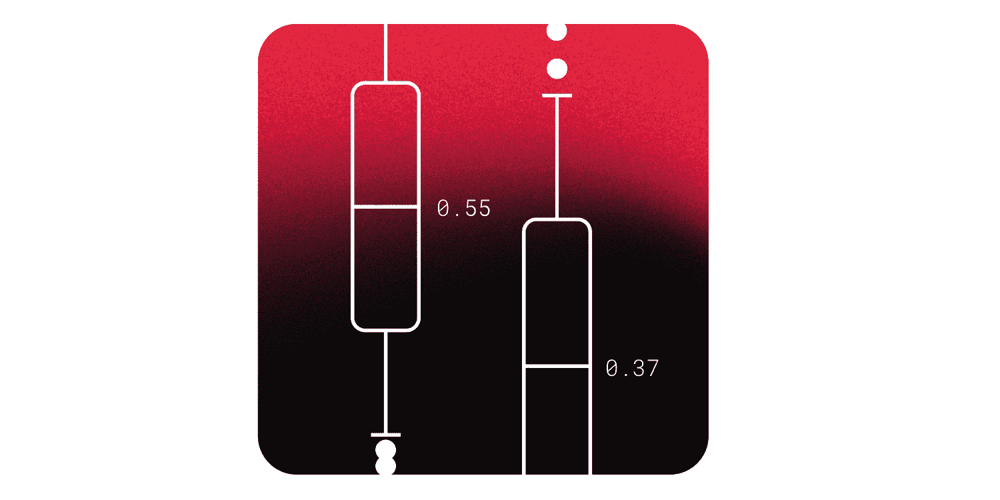
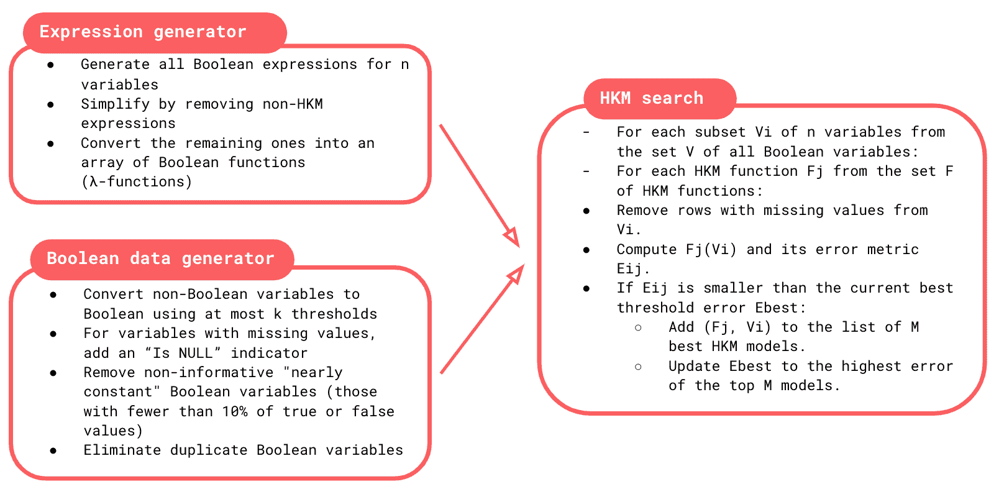
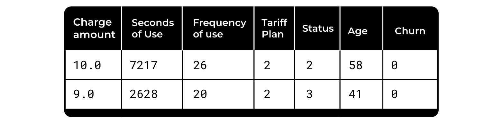
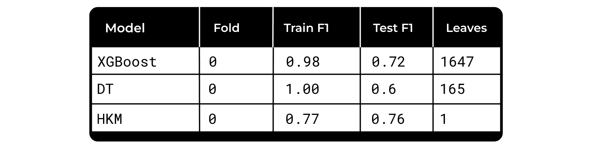
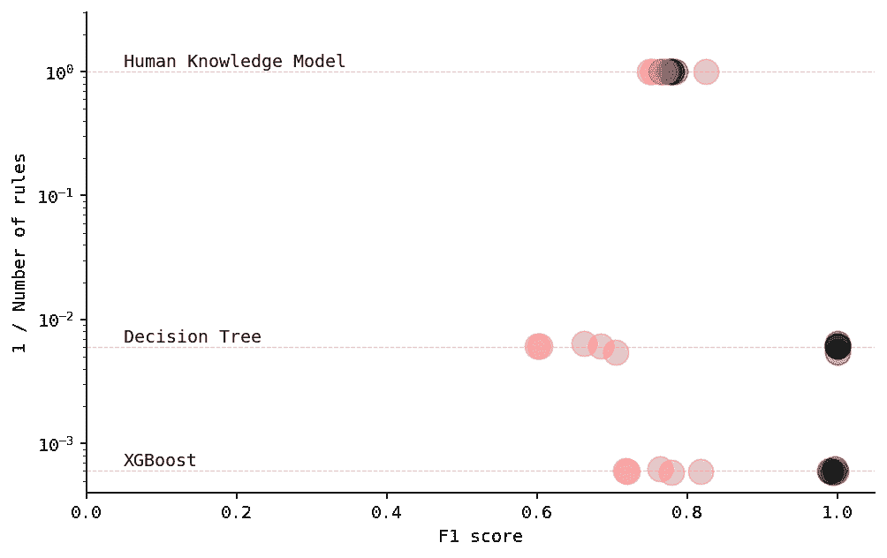

# 简单胜于黑盒

> 原文：[`towardsdatascience.com/simplicity-over-black-boxes-eefc72a5c507/`](https://towardsdatascience.com/simplicity-over-black-boxes-eefc72a5c507/)



封面，图片由作者提供

现代机器学习在众多领域取得了令人难以置信的突破。这些成功来自于先进的模型，它们能够在海量数据集中揭示复杂的模式。

但这种方法有一个不足之处：易于解释。大多数机器学习模型，通常被称为“黑盒”，包含大量数据以及数千个系数和权重。它们不是提取清晰、可操作的观点，而是留下了难以被人类理解或应用的结果。

这个差距突显了需要一种不同的方法——一种专注于寻找简洁、可解释的规则，而不是仅仅依赖于复杂模型的方法。

大多数努力都集中在解释“黑盒”模型上，而不是直接从原始数据中提取知识。问题的根源在于“机器优先”的思维模式，其中优先考虑的是构建最优算法，而不是类似人类的知识提取。人类依赖于知识来生成实验和新数据，但将数据转化为可操作知识的过程却被大量忽视。

将复杂数据转化为简单、人类可理解的逻辑这一追求已经持续了几十年。从 20 世纪 60 年代开始，形式逻辑的研究激发了规则学习算法如 Corels、RuleFit 和 Skope-Rules 的创建。这些方法从复杂数据中提取简洁的布尔表达式，通常使用贪婪优化技术。然而，尽管在可解释和可解释人工智能方面取得了进展，但仍然存在重大挑战。

不久前，一群来自俄罗斯和法国的科学家提出了他们的方法——**人类知识模型（HKM**），它将数据提炼成简单规则的形式。

HKM 创建了包含基本布尔运算符（AND、OR、NOT）和阈值的简单规则。它最多只产生 4 条规则。这些规则在不同领域都很容易使用，尤其是在涉及人类的情况下。

当你可能想要使用此方法时：

+   预测将由领域专家使用。例如，医生可能会收到模型关于患者患肺炎可能性的预测。如果预测来自“黑盒”，医生就难以根据个人经验调整结果，导致对这种预测的信任度降低。更有效的方法是从患者的医疗历史中提炼出清晰、易懂的规则（例如，“如果患者的血压高于 120 且体温超过 38°C，患肺炎的风险很高”）。

+   当部署机器学习模型到生产环境中变得不切实际地昂贵或复杂时，一些业务规则通常可以更容易地实施，甚至可以直接在前端实施。

+   当你只有少量特征或观测值，无法构建复杂模型时。

### HKM 训练

HKM 训练识别：

+   确定简化连续数据的阈值；

+   最佳特征子集；

+   模拟决策制定的优化布尔逻辑。

该过程生成所有可能的布尔函数，将它们简化为简洁的公式，并评估其性能。与传统机器学习不同，后者调整系数，HKMs 探索特征和规则的多种组合，以找到最有效且易于人类理解的模式。



训练过程，图片由作者提供

HKM 训练避免了填充缺失数据，将其视为有价值的信息，并产生多个表现优异的模型，使用户在选择最实用的解决方案时具有灵活性。

### HKMs 的局限性

HKMs 并不适合每个问题。对于具有高分支复杂度（大量特征）的任务，它们的简单性成为劣势。这些场景需要大量的内存和逻辑，这超出了人类的处理能力。尽管如此，HKMs 在应用领域如医疗保健中仍可以发挥关键作用，它们作为解决明显盲点的实用起点。

另一个限制在于特征识别。与可以自动提取复杂模式的深度学习模型不同，HKMs 依赖于人类来定义和测量关键特征。这就是为什么特征工程落在分析师的肩上。

## 客户流失预测示例

作为玩具示例，我们将使用一个生成的客户流失预测数据集。

安装库：

```py
!pip install git+https://github.com/EgorDudyrev/PeaViner
!pip install bitarray
```

数据集生成：

```py
import pandas as pd
from sklearn.model_selection import train_test_split
from sklearn.metrics import f1_score

np.random.seed(42)

n_rows = 1500

charge_amount = np.random.normal(10, np.sqrt(2), n_rows).astype(int)
seconds_of_use = np.random.gamma(shape=2, scale=2500, size=n_rows).astype(int)
frequency_of_use = np.random.normal(20, np.sqrt(10), n_rows).astype(int)
tariff_plan = np.random.choice([1, 2], size=n_rows) 
status = np.random.choice([2, 3], size=n_rows) 
age = np.random.randint(20, 71, size=n_rows) 
noise = np.random.uniform(0, 1, n_rows)
churn = np.where(
    ((seconds_of_use <= 1000) &amp; (age >= 30)) | (frequency_of_use < 16) | (noise < 0.1),
    1,
    0
)

df = pd.DataFrame({
    "Charge Amount": charge_amount,
    "Seconds of Use": seconds_of_use,
    "Frequency of use": frequency_of_use,
    "Tariff Plan": tariff_plan,
    "Status": status,
    "Age": age,
    "Churn": churn
})
```

数据集包含一些关于用户特征和二元目标 – 客户流失的基本指标。样本数据：



数据集，图片由作者提供

将数据集分为训练组和测试组：

```py
X = df.drop(columns=['Churn'])
y = df.Churn

X, y = X.values.astype(float), y.values.astype(int)
X_train, X_test, y_train, y_test = train_test_split(X, y, train_size=0.8, random_state=42)
print(f"Train size: {len(X_train)}; Test size: {len(X_test)}")
```

> 训练大小：1200；测试大小：300

最后，我们可以应用模型并检查其质量：

```py
from peaviner import PeaClassifier

model = PeaClassifier()
model.fit(X_train, y_train)
model_scores = f1_score(y_train, model.predict(X_train)), 
            f1_score(y_test, model.predict(X_test))

print(f"Train F1 score: {model_scores[0]:.2f}, 
        Test F1 score: {model_scores[1]:.2f}")
```

> 训练 F1 分数：0.78，测试 F1 分数：0.77

结果相当稳定，训练过程耗时 3 分钟。

现在，我们可以检查模型找到的规则：

```py
features = [f for f in df if f!='Churn']
model.explain(features)
```

> (Age >= 30 AND Seconds of Use < 1010) OR Frequency of use < 16

非常直接且可解释。只需 3 条规则，无需使用模型进行推理，只需应用这个简单的规则来分割用户。正如你所见，它与数据生成的理论规则几乎相同。

现在我们想比较该模型与几种其他流行算法的性能。我们选择了决策树和 XGBoost 来比较不同复杂程度的 3 个模型。

```py
from sklearn.model_selection import KFold
from sklearn.tree import DecisionTreeClassifier
from xgboost import XGBClassifier
from sklearn.metrics import f1_score
import pandas as pd

kf = KFold(n_splits=5, random_state=42, shuffle=True)

def evaluate_model(model, X, y, get_leaves):
    scores_cv, leaves = [], []
    for train_idx, test_idx in kf.split(X, y):
        model.fit(X[train_idx], y[train_idx])
        scores_cv.append((
            f1_score(y[train_idx], model.predict(X[train_idx])),
            f1_score(y[test_idx], model.predict(X[test_idx]))
        ))
        leaves.append(get_leaves(model))
    return scores_cv, leaves

models = [
    ("XGBoost", XGBClassifier(), lambda m: (m.get_booster().trees_to_dataframe()['Feature'] == 'Leaf').sum()),
    ("Decision Tree", DecisionTreeClassifier(), lambda m: m.get_n_leaves()),
    ("Human Knowledge Model", PeaClassifier(), lambda m: 1),
]

models_data = []
for model_name, model, get_leaves in models:
    scores_cv, leaves = evaluate_model(model, X, y, get_leaves)
    models_data.extend({
        'Model': model_name,
        'Fold': fold_id,
        'Train F1': train,
        'Test F1': test,
        'Leaves': n_leaves
    } for fold_id, ((train, test), n_leaves) in enumerate(zip(scores_cv, leaves)))

models_data = pd.DataFrame(models_data)
```

*fold 0*的结果：



模型比较，图片由作者提供

如你所见，人类知识模型仅使用了 1 条规则，决策树 – 165 和 XGBoost – 1647，但测试组的质量相当。

现在我们想可视化所有折叠的质量结果：

```py
import matplotlib.pyplot as plt
plt.rcParams["figure.figsize"] = [10, 6]
plt.rcParams["figure.dpi"] = 100
plt.rcParams["figure.facecolor"] = "white"
plt.rcParams['font.family'] = 'monospace'
plt.rcParams['font.size'] = 10

%load_ext autoreload
%autoreload 2
%config InlineBackend.figure_format = "retina"

plt.figure(figsize=(8, 5))

for ds_part, color in zip(['Train', 'Test'], ['black', '#f95d5f']):
    y_axis = f'{ds_part} F1'
    plt.scatter(models_data[y_axis], 1/models_data['Leaves'], label=ds_part, alpha=0.3, s=200, color=color)

avgs = models_data.groupby('Model')['Leaves'].mean().sort_values()
avg_f1 = models_data.groupby('Model')['Test F1'].mean()

# Add vertical lines
for model_name, n_leaves in avgs.items():
    plt.axhline(1/n_leaves, zorder=0, linestyle='--', color='gray', alpha=0.5, linewidth=0.6)
    plt.text(0.05, 1/n_leaves*1.1, model_name)

plt.xlabel('F1 score')
plt.ylabel('1 / Number of rules')
plt.yscale('log') 
plt.ylim(0, 3)
plt.xlim(0, 1.05)

# Removing top and right borders
plt.gca().spines['top'].set_visible(False)
plt.gca().spines['right'].set_visible(False)

plt.show()
```



红点 - 测试数据，灰点 - 训练数据，图片由作者提供

正如你所见，HKM 在测试子集上的质量甚至比更复杂的模型还要好。显然，这是因为数据集相对较小，特征依赖性并不复杂。无论如何，HKM 生成的规则可以很容易地用于网站上的某些个性化推荐。你不需要任何机器学习基础设施——规则甚至可以集成到前端。

* * *

## 结论

人类知识模型（Human Knowledge Models）提供了一种新颖且实用的方法，将以人为中心的方法与人工智能相结合，弥合了可解释性和性能之间的差距。它们实现了几个关键目标：

+   **简化复杂性**：将复杂的布尔表达式简化到其最简形式；

+   **增强可解释人工智能**：与传统“可解释”人工智能不同，它侧重于主动的人类决策，提供了一个更精确和实用的定义；

+   **挑战黑盒模型**：它为经典机器学习模型提供了一种替代方案，将人工智能扩展到黑盒解决方案不可接受的领域。

## 参考文献

+   Cowan N., "短期记忆中的神奇数字 4：对心理存储容量的重新审视," 行为与脑科学，第 24 卷，第 1 期，第 87-114 页，2001。

+   Taniguchi H., Sato H. and Shirakawa T., "具有人类认知偏差的机器学习模型，能够从小型和有偏见的样本集中学习," 科学报告，2018-05-09，第 8 卷（1），第 8 卷，第 1 期，第 7397-13 页，2018。

+   E. Dudyrev，I. Semenkov，S. O. Kuznetsov，G. Gusev，A. Sharp，和 O. S. Pianykh. 人类知识模型：从数据中学习应用知识。Plos one，第 17 卷（10）：e0275814，2022。

+   E. Dudyrev 和 S. O. Kuznetsov. 向快速寻找最优短分类器迈进。CEUR 研讨会论文集，3233:23–34，2022。
