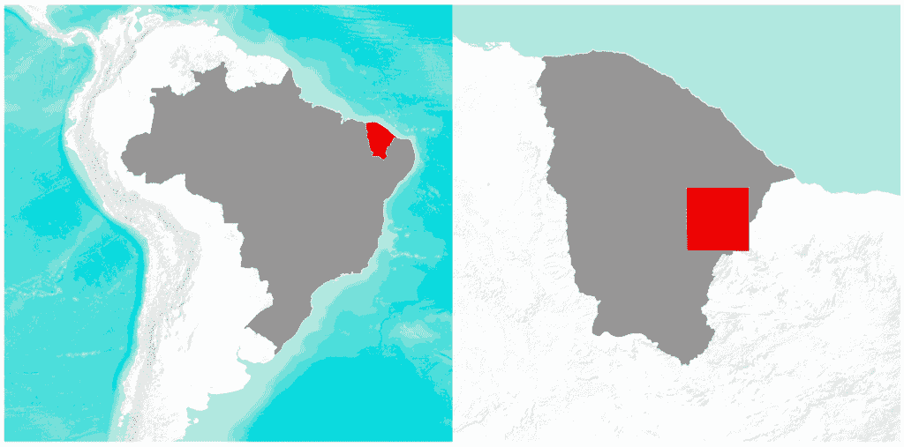
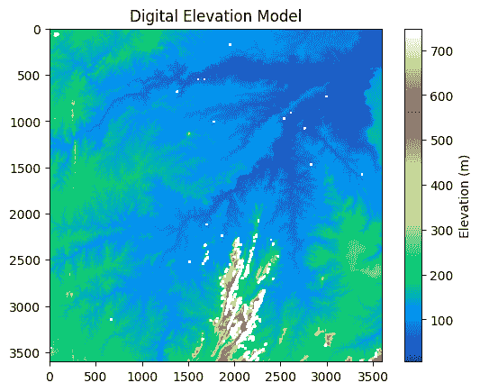
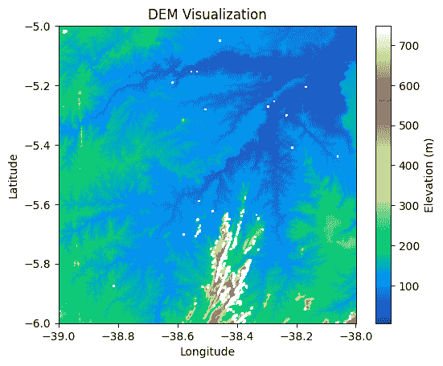
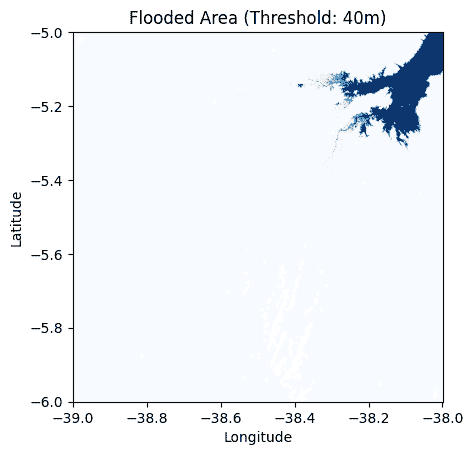
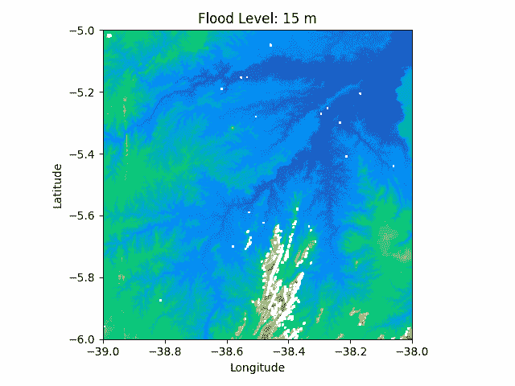

# 使用 Python 和海拔数据模拟洪水淹没：入门指南

> 原文：[`towardsdatascience.com/simulating-flood-inundation-with-python-and-elevation-data-a-beginners-guide/`](https://towardsdatascience.com/simulating-flood-inundation-with-python-and-elevation-data-a-beginners-guide/)

<mdspan datatext="el1748629760179" class="mdspan-comment">洪水和淹没</mdspan>在全球范围内变得更加频繁和破坏性，这归因于近几十年的气候变化。在这种情况下，洪水建模在风险评估和灾害响应行动中发挥着重要作用，同时仍然是高级研究和学术研究的关键焦点。

在本文中，我们将使用 Python 和数字高程模型（DEM）构建一个基本的洪水淹没模型。我们将使用洪水填充技术逐步模拟水位上升如何影响景观，并动画化淹没过程。这是一种直观和动手探索地理空间数据和洪水风险的方法，即使没有水力建模的背景。

## 你将学到什么

+   什么是数字高程模型（DEM）

+   如何使用 Python 加载和可视化高程数据

+   如何使用高程阈值模拟洪水场景

+   如何使用 Python 动画化洪水进展

+   结论和下一步

## 1. 什么是数字高程模型（DEM）

**数字高程模型（DEM）**是地球表面的数值表示，其中规则网格（称为栅格数据）中的每个单元格（或像素）包含一个海拔值。与存储颜色信息的数字图像不同，DEM 存储高度数据，通常不包括植被、建筑和其他人造结构等表面特征。

DEMs 常用于制图、水文学、环境监测和地球科学等领域。它们是任何需要详细了解地形和海拔的应用的基础数据集。

许多来源提供免费且可靠的 DEM 数据，包括**USGS 国家地图**、**NASA Earthdata**和**航天雷达地形任务（SRTM）**。

在本文中，我们将使用由**[USGS 国家地理计划](https://earthexplorer.usgs.gov/)**提供的 DEM，它是免费提供的，并已进入公共领域。

> 注意：USGS 提供的数据空间分辨率为 1 弧秒（在赤道大约为 30 米）。

本研究的感兴趣区域（AOI）位于巴西东北部。DEM 文件覆盖一个 1° × 1°的瓦片，从 6°S, 39°W 延伸到 5°S, 38°W，并使用 WGS84 坐标系统（EPSG: 4326），如下所示。



感兴趣区域（作者使用 Google Maps 和 QGIS 制作）。

## 2. 如何使用 Python 加载和可视化高程数据

现在，我们将使用 Python 设置一个可行的环境来可视化和分析一些关于 DEM 数据的初始信息。首先，让我们导入必要的库。

```py
# import libraries
import rasterio
import matplotlib.pyplot as plt
import numpy as np
from matplotlib.animation import FuncAnimation
```

+   **`rasterio`**: 读取和写入地理空间栅格数据，如 DEM。

+   **`matplotlib.pyplot`**: 创建静态和交互式可视化。

+   **`numpy`**: 处理数值运算和基于数组的数據。

+   **`FuncAnimation`**: 通过逐帧更新图表来生成动画。

接下来，我们将使用**`rasterio`**库打开和可视化 AOI 的 DEM 文件。

+   **加载 DEM 数据**

```py
# Helper function to load DEM Files
def load_dem(path):
    with rasterio.open(path) as src:
        dem = src.read(1)
        transform = src.transform
        nodata = src.nodata

        if nodata is not None:
            # Mask no-data values
            dem = np.ma.masked_equal(dem, nodata)

        return dem, transform
```

上述函数读取高程数据并检查文件是否包含“无数据值”。无数据值用于表示没有有效高程数据的区域（例如，覆盖范围外或损坏的像素）。如果存在无数据值，则函数将这些像素替换为`np.nan`，使其在后续分析和可视化中更容易处理或忽略。

**可视化 DEM 数据**

```py
dem = load_dem("s06_w039_1arc_v3.tif")

plt.imshow(dem, cmap='terrain')
plt.title("Digital Elevation Model")
plt.colorbar(label="Elevation (m)")
plt.show()
```

+   **结果**



AOI 的 DEM（版权：美国地质调查局）

+   **在可视化中使用地理坐标**

如我们所见，坐标轴位于像素坐标（列和行）。为了更好地理解洪水泛滥，了解与图像每个像素相关联的地理坐标（纬度和经度）至关重要。

要实现这一点，我们将使用 DEM 文件的坐标参考系统数据。如前所述，我们使用的 DEM 使用 WGS84 坐标系统（EPSG: 4326）。

我们可以将辅助函数修改为如下加载 DEM 文件：

```py
def load_dem(path):
    with rasterio.open(path) as src:
        dem = src.read(1)
        transform = src.transform
        nodata = src.nodata

        if nodata is not None:
            # Mask nodata values
            dem = np.ma.masked_equal(dem, nodata)

        return dem, transform
```

函数从 DEM 检索*转换*数据，这是一个将像素位置（行，列）映射到地理坐标（纬度和经度）的仿射对象。

要在图表的轴上表示地理坐标，将需要探索`imshow()`函数中的`extent`参数。

```py
dem, transform = load_dem("s06_w039_1arc_v3.tif")

# Compute extent from transform
extent = [
    transform[2],                          # xmin (longitude)
    transform[2] + transform[0] * dem.shape[1],  # xmax
    transform[5] + transform[4] * dem.shape[0],  # ymin (latitude)
    transform[5]                          # ymax
]

# Plot with using geographic coordinates
fig, ax = plt.subplots()
img = ax.imshow(dem, cmap='terrain', extent=extent, origin='upper')
ax.set_xlabel('Longitude')
ax.set_ylabel('Latitude')
plt.colorbar(img, label='Elevation (m)')
plt.title('DEM Visualization')
plt.show()
```

将使用`extent`参数定义 DEM 图表的空间界限，这些值来自栅格的`transform`仿射对象。它设置了最小和最大经度（`xmin`，`xmax`）和纬度（`ymin`，`ymax`），以便图表显示坐标轴上的坐标而不是像素索引。

最后，我们得到了以下结果：



使用地理坐标的 DEM 可视化（版权：美国地质调查局）。

## 3. 如何使用高程阈值模拟洪水情景

现在，我们将演示一种简单但实用的方法来可视化洪水情景和模拟淹没。它包括定义一个高度阈值并生成一个二进制掩码，该掩码识别所有海拔低于此水平区域。

在本例中，我们模拟了海拔低于 40 米的所有区域的洪水。

```py
flood_threshold = 40  # meters
flood_mask = (dem <= flood_threshold).astype(int)

plt.imshow(flood_mask, extent=extent, cmap='Blues')
plt.title(f"Flooded Area (Threshold: {flood_threshold}m)")
plt.xlabel("Longitude")
plt.ylabel("Latitude")
plt.show()
```

+   **结果**



洪水区域模拟（图片由作者提供）。

只需几行代码，我们就可以可视化不同洪水情景对感兴趣区域（AOI）的影响。然而，由于这种可视化是静态的，它并没有显示洪水随时间的发展。为了解决这个问题，我们将使用 matplotlib 的**`FuncAnimation`**来创建动态可视化。

## 4. 如何使用 Python 动画化洪水发展

我们现在将通过逐步增加水位并生成每个步骤的新掩码来模拟渐进式洪水情景。我们将把这个掩码叠加到地形图像上并对其动画化。

```py
# flood_levels defines how high the flood rises per frame
flood_levels = np.arange(15, 100, 5)

# Set up figure and axes
fig, ax = plt.subplots()
img = ax.imshow(dem, cmap='terrain', extent=extent, origin='upper')
flood_overlay = ax.imshow(np.zeros_like(dem), cmap='Blues', alpha=0.4, extent=extent, origin='upper')
title = ax.set_title("")
ax.set_xlabel("Longitude")
ax.set_ylabel("Latitude")

# Animation function
def update(frame):
    level = flood_levels[frame]
    mask = np.where(dem <= level, 1, np.nan)
    flood_overlay.set_data(mask)
    title.set_text(f"Flood Level: {level} m")
    return flood_overlay, title

# Create animation
ani = FuncAnimation(fig, update, frames=len(flood_levels), interval=300, blit=True)
plt.tight_layout()
plt.show()

# save the output as a gif
ani.save("flood_simulation.gif", writer='pillow', fps=5)
```

+   **结果**



洪水发展（来源：美国地质调查局）

> 如果你对使用 Python 创建动画感兴趣，这个逐步的[教程](https://contributor.insightmediagroup.io/make-your-data-move-creating-animations-in-python-for-science-and-machine-learning/)是一个很好的起点。

## 结论和下一步

在这篇文章中，我们创建了一个基本的工作流程，使用 DEM 文件中的高程数据在 Python 中执行洪水模拟。当然，这个模型没有实现该主题上最先进的技术，但对于可视化和交流来说，这种高程阈值方法提供了一个强大且易于访问的入门点。

更高级的模拟技术包括：

+   基于连接性的洪水传播

+   流向和累积

+   基于时间的流动建模

尽管如此，这种动手方法对于探索灾害响应研究和环境建模中地理空间数据的教师、学生和分析员来说可能非常有用。

> 完整的代码可在[这里](https://github.com/Marcussena/flood-inundation-fill-method)找到。

我强烈建议读者使用自己的高程数据尝试这段代码，将其适应到他们特定的环境中，并探索增强或扩展这种方法的方式。

## 参考文献

[1] 美国地质调查局. *国家地图*. 美国内政部. 收取日期：2025 年 5 月 17 日，来自[`www.usgs.gov/programs/national-geospatial-program/national-map`](https://www.usgs.gov/programs/national-geospatial-program/national-map)。

[2] 美国地质调查局. *什么是数字高程模型（DEM）？*. 美国内政部. 收取日期：2025 年 5 月 17 日，来自[`www.usgs.gov/faqs/what-a-digital-elevation-model-dem`](https://www.usgs.gov/faqs/what-a-digital-elevation-model-dem)。

[3] Gillies, S. *地理配准 — Rasterio 文档（稳定版）*. Rasterio. 收取日期：2025 年 5 月 27 日，来自[`rasterio.readthedocs.io/en/stable/topics/georeferencing.html`](https://rasterio.readthedocs.io/en/stable/topics/georeferencing.html)。

[4] Gillies, Sean. *仿射变换 — Rasterio 文档（最新版）*. 访问日期：2025 年 5 月 27 日。[`rasterio.readthedocs.io/en/latest/topics/transforms.html`](https://rasterio.readthedocs.io/en/latest/topics/transforms.html)。

> ***数据来源：**本项目中使用的 DEM 数据由美国地质调查局（USGS）通过国家地图提供，属于公共领域。***
