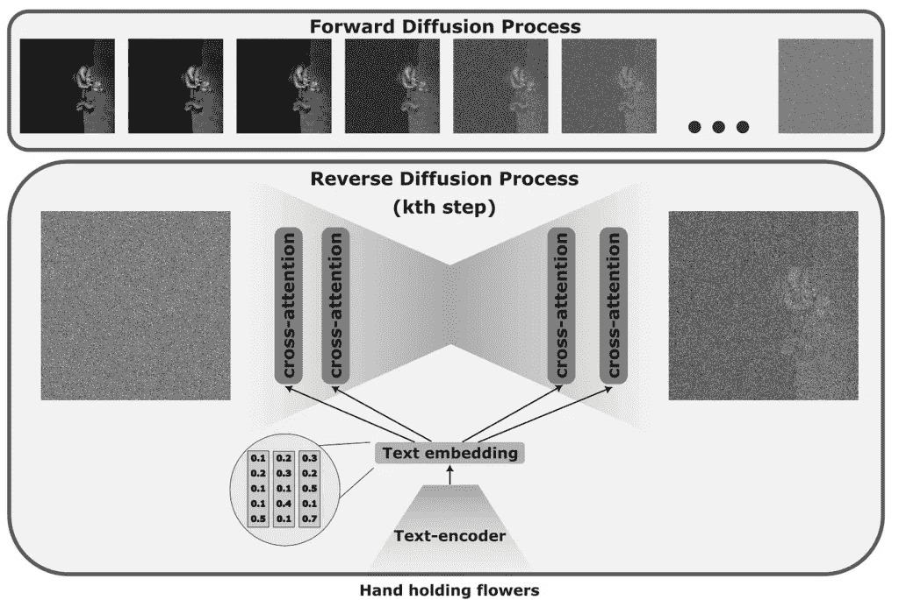
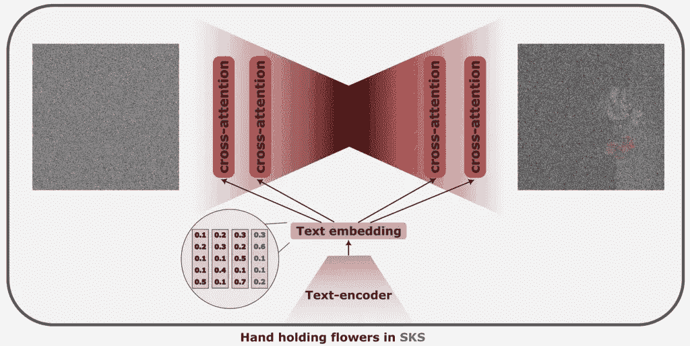
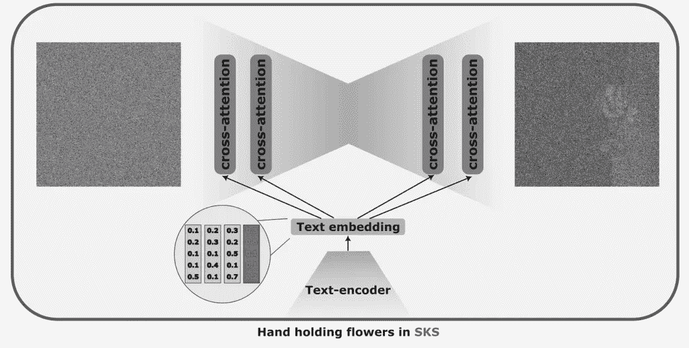
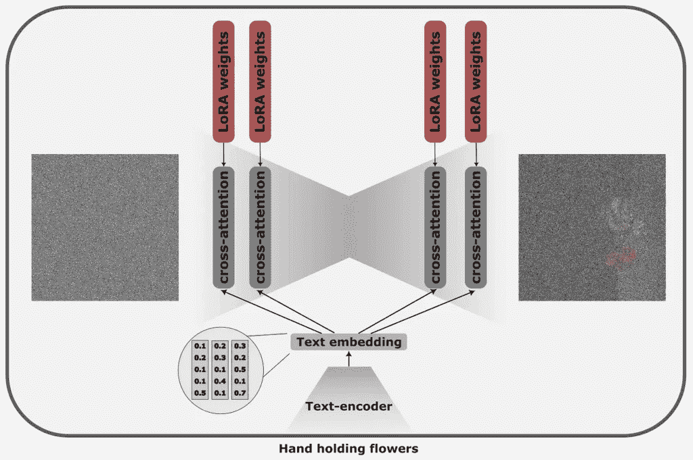
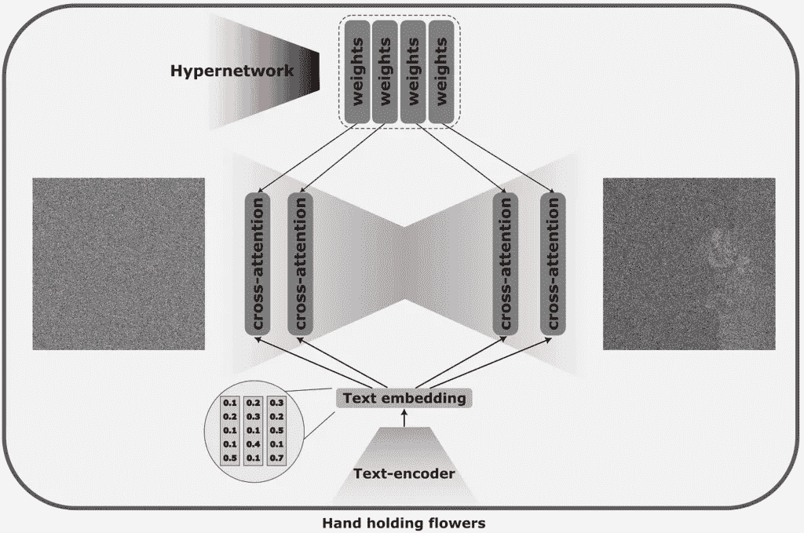
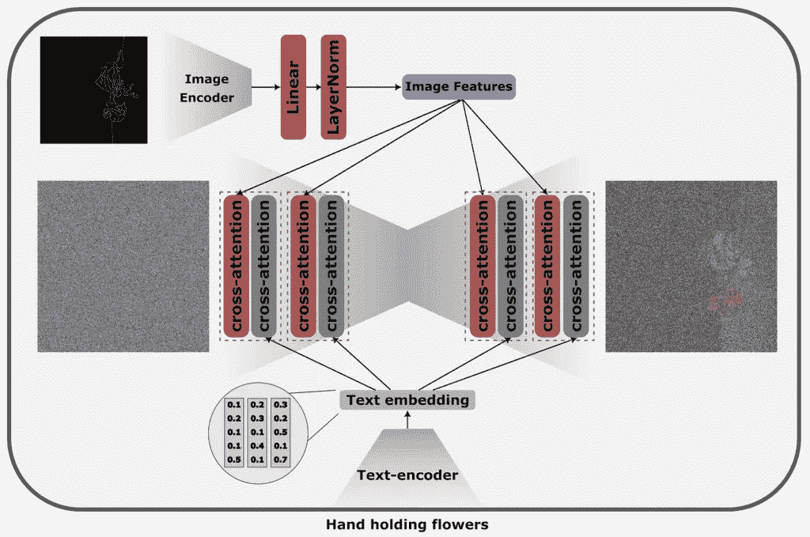
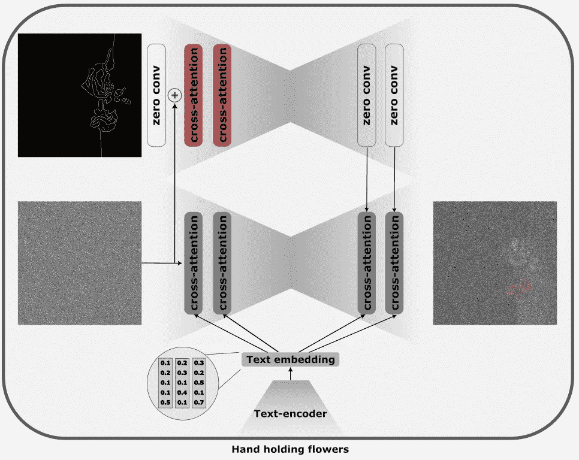

# 在扩散模型中控制风格和内容的六种方法

> 原文：[`towardsdatascience.com/six-ways-to-control-style-and-content-in-diffusion-models/`](https://towardsdatascience.com/six-ways-to-control-style-and-content-in-diffusion-models/)

Stable Diffusion 1.5/2.0/2.1/XL 1.0、DALL-E、Imagen……在过去的几年里，扩散模型在图像生成方面展示了惊人的质量。然而，尽管在通用概念上产生了高质量，但这些模型在生成更专业查询的高质量图像方面却遇到了困难，例如生成在训练数据集中不常看到的特定风格的图像。

我们可以在大量图像上重新训练整个模型，解释从零开始解决该问题的概念。然而，这听起来并不实用。首先，我们需要一个大量图像的概念，其次，这太昂贵且耗时。

然而，有一些解决方案，即使是在最坏的情况下，只需要少量图像和一小时的微调，也能使扩散模型在新的概念上产生合理的质量。

下面，我将介绍像 Dreambooth、LoRA、Hyper-networks、Textual Inversion、IP-Adapters 和 ControlNets 这样的方法，这些方法被广泛用于定制和条件扩散模型。所有这些方法背后的理念是记住我们试图学习的新概念，然而，每种技术都以不同的方式接近它。

## 扩散架构

在深入探讨各种帮助条件扩散模型的方法之前，让我们首先回顾一下扩散模型是什么。

扩散过程可视化。图片由作者提供。

扩散模型的原始理念是训练一个模型从噪声中重建一个连贯的图像。在训练阶段，我们逐渐添加少量的高斯噪声（正向过程），然后通过优化模型来预测噪声，通过减去这些噪声，我们可以更接近目标图像（反向过程）。

图像损坏的原始理念已经[演变成一个更实用且轻量级的架构](https://arxiv.org/abs/2112.10752)，其中图像首先被压缩到潜在空间，所有添加噪声的操纵都在低维空间中执行。

要向扩散模型添加文本信息，我们首先通过一个文本编码器（通常是[CLIP](https://github.com/openai/CLIP)）来生成潜在嵌入，然后通过交叉注意力层将其注入到模型中。

## Dreambooth，[论文](https://dreambooth.github.io/)，[代码](https://huggingface.co/docs/diffusers/training/dreambooth)

Dreambooth 可视化。可训练的块用红色标记。图片由作者提供。

策略是选取一个罕见的单词；通常，使用一个{SKS}单词，然后教会模型将单词{SKS}映射到我们想要学习的特征。例如，这可能是一个模型从未见过的风格，比如梵高。我们会展示他的一打画作，并微调到“一幅{SKS}风格的靴子画”。我们可以类似地个性化生成，例如，学习如何生成特定人的图像，例如“{SKS}在山上的自拍照”。

为了保持预训练阶段学习到的信息，Dreambooth 通过将原始模型生成的文本-图像对添加到微调集中，鼓励模型不要过多偏离原始、预训练的版本。

**何时使用和何时不使用** Dreambooth 在所有方法中产生最佳质量；然而，这项技术可能会影响已经学习到的概念，因为整个模型都被更新了。训练计划也限制了模型可以理解的概念数量。训练是耗时的，需要 1-2 小时。如果我们决定一次引入几个新概念，我们就需要存储两个模型检查点，这会浪费很多空间。

## 文本反转，[论文](https://textual-inversion.github.io/)，[代码](https://github.com/rinongal/textual_inversion)

文本反转的可视化。可训练的块用红色标记。图由作者提供。

文本反转背后的假设是，扩散模型潜在空间中存储的知识非常丰富。因此，我们想要用扩散模型重现的风格或条件已经为它所知，但我们只是没有标记来访问它。因此，我们不是通过微调模型在输入罕见单词“{SKS}风格”时重现所需的输出，而是优化一个文本嵌入，这将产生所需的输出。

**何时使用和何时不使用** 它占用的空间非常小，因为只有标记将被存储。它也相对快速训练，平均训练时间为 20-30 分钟。然而，它也有其缺点——因为我们正在微调一个特定的向量，该向量引导模型产生特定的风格，它不会泛化到这种风格之外。

## LoRA，[论文](https://arxiv.org/abs/2106.09685)，[代码](https://github.com/microsoft/LoRA)

LoRA 可视化。可训练的块用红色标记。图由作者提供。

低秩自适应（LoRA）被提出用于大型语言模型，并由 Simo Ryu 首次应用于扩散模型[https://github.com/cloneofsimo/lora]。LoRA 的原始想法是，我们不需要微调整个模型，这可能会相当昂贵，我们可以将新权重的一部分（这些权重将用于微调任务）与一个类似的罕见标记方法混合到原始模型中。

在扩散模型中，秩分解应用于交叉注意力层，并负责合并提示和图像信息。这些层中的权重矩阵 WO、WQ、WK 和 WV 都应用了 LoRA。

**何时使用和何时不使用** LoRAs 训练时间非常短（5-15 分钟）——我们更新的是一小部分参数，与整个模型相比，它们占用的空间要小得多。然而，使用 LoRAs 微调的小型模型与 DreamBooth 相比，质量较差。

## 超网络，论文，代码

超网络可视化。可训练块用红色标记。图片由作者提供。

在某种程度上，超网络是 LoRAs 的扩展。我们不是学习那些会直接改变模型输出的相对较小的嵌入，而是训练一个能够预测这些新注入嵌入权重的独立网络。

如果模型能够预测特定概念的特征嵌入，我们可以教会超网络几个概念——使用相同的模型进行多个任务。

**何时使用和何时不使用** 超网络，不是专注于单一风格，而是能够产生大量一般不会像其他方法那样产生高质量，并且可能需要大量时间来训练。在优点方面，它们可以存储比其他单一概念微调方法更多的概念。

## IP Adapters，[论文](https://arxiv.org/pdf/2308.06721)，[代码](https://github.com/tencent-ailab/IP-Adapter)

IP-适配器可视化。可训练块用红色标记。图片由作者提供。

与使用文本提示控制图像生成不同，IP 适配器提出了一种使用图像控制生成的方法，而不需要对底层模型进行任何更改。

IP 适配器背后的核心思想是一种解耦的交叉注意力机制，它允许将源图像与文本和生成的图像特征相结合。这是通过添加一个单独的交叉注意力层来实现的，允许模型学习图像特定的特征。

**何时使用和不使用** IP 适配器轻量级、可适应且快速。然而，它们的性能高度依赖于训练数据的质量和多样性。IP 适配器通常更倾向于与提供我们希望在生成的图像中看到的风格属性（例如，使用马克·夏加尔的画作图像）一起工作，并且可能在提供精确细节的控制方面遇到困难，例如姿态。

## ControlNets，[论文](https://arxiv.org/abs/2302.05543)，[代码](https://github.com/lllyasviel/ControlNet)

ControlNet 可视化。可训练块用红色标记。图片由作者提供。

ControlNet 论文提出了一种将文本到图像模型输入扩展到任何模态的方法，允许对生成的图像进行精细控制。

在原始公式中，ControlNet 是预训练扩散模型的编码器，它以提示、噪声和控制数据（例如深度图、地标等）作为输入。为了引导生成，ControlNet 的中间层随后被添加到冻结的扩散模型的激活中。

注入是通过零卷积实现的，其中 1×1 卷积的权重和偏差初始化为零，并在训练过程中逐渐学习有意义的转换。这与 LoRAs 的训练方式类似——初始化为 0，它们从恒等函数开始学习。

**何时使用和不使用** ControlNets 在需要控制输出结构时更可取，例如，通过地标、深度图或边缘图。由于需要更新整个模型权重，训练可能会耗时；然而，这些方法也允许通过刚体控制信号实现最佳细粒度控制。

## 摘要

+   **DreamBooth**：针对自定义主题和风格的模型的全范围微调，控制水平高；然而，训练时间较长，且仅适用于单一目的。

+   **文本逆转换**：基于嵌入的新概念学习，控制水平较低，但训练速度快。

+   **LoRA**：针对新风格/角色的模型轻量级微调，控制水平中等，但训练速度快。

+   **Hypernetworks**：一个独立的模型，用于预测给定控制请求的 LoRA 权重。控制水平越低，适用于更多风格。训练需要时间。

+   **IP-Adapter**：通过参考图像进行软风格/内容引导，风格控制水平中等，轻量且高效。

+   **ControlNet**：通过姿态、深度和边缘进行控制非常精确；然而，训练时间较长。

**最佳实践**：为了获得最佳结果，IP-adapter（其风格引导较软）与 ControlNet（用于姿态和物体排列）的组合将产生最佳效果。

如果你想深入了解扩散，可以查看我找到的这篇[文章](https://erdem.pl/2023/11/step-by-step-visual-introduction-to-diffusion-models)，它写得非常好，适合任何水平的机器学习和数学。如果你想对数学有一个直观的解释，并带有酷炫的评论，可以查看[这个视频](https://www.youtube.com/watch?app=desktop&v=HoKDTa5jHvg&t=1284s)或[这个视频](https://www.youtube.com/watch?v=fbLgFrlTnGU)。

为了查找有关 ControlNets 的信息，我发现[这个解释](https://www.youtube.com/watch?v=fhIGt7QGg4w)非常有帮助，[这篇文章](https://medium.com/@isa.dario.isa/conditioning-image-generation-%EF%B8%8F-implementation-with-stable-diffusion-controlnet-and-ipadapter-b502bfe9315d)和[这篇文章](https://medium.com/@steinsfu/stable-diffusion-controlnet-clearly-explained-f86092b62c89)也可以作为良好的入门介绍。

## 喜欢作者吗？保持联系！

我是否遗漏了什么？请毫不犹豫地留下笔记、评论或直接在[LinkedIn](https://www.linkedin.com/in/aliakseimikhailiuk/)或[Twitter](https://twitter.com/mikhailiuka/)上联系我！

+   [在生产中部署生成模型面临的三个挑战](https://towardsdatascience.com/three-challenges-in-deploying-generative-models-in-production-8e4c0fcf63c3?source=post_page-----805169566d8e--------------------------------)

+   [LLM 路由——任何实用 AI 聊天应用的核心](https://towardsdatascience.com/llm-routing-the-heart-of-any-practical-ai-chatbot-application-892e88d4a80d?source=post_page-----805169566d8e--------------------------------)

+   [对决：使用机器学习的实用人脸交换](https://pub.towardsai.net/face-off-practical-face-swapping-with-machine-learning-a05b911ea0f?source=post_page-----805169566d8e--------------------------------)

**本博客中的观点仅代表我个人的看法，不代表 Snap 公司或其立场。**
