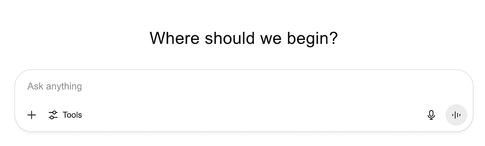
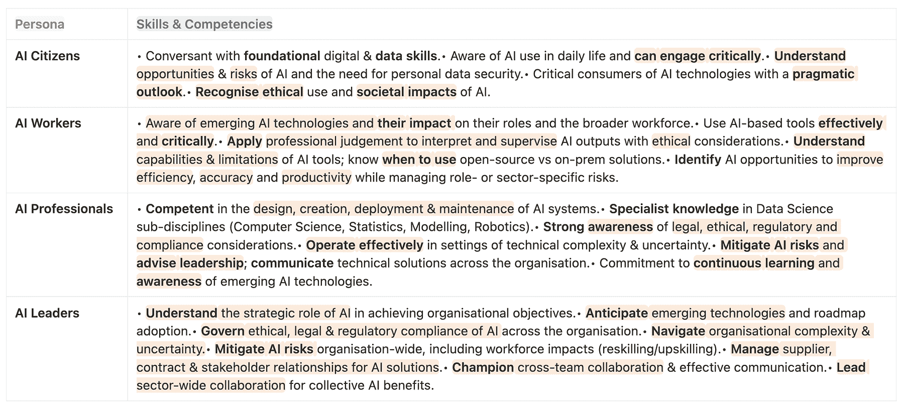

# 技能 vs. AI 技能

> 原文：[`towardsdatascience.com/skills-vs-ai-skills/`](https://towardsdatascience.com/skills-vs-ai-skills/)

* * *

在这篇博文中，我将提供一个关于由[艾伦·图灵研究所](https://www.turing.ac.uk/skills/collaborate/ai-skills-business-framework)创建的[商业能力框架 AI 技能](https://zenodo.org/records/11092677/preview/AISkillsForBusinessCompetencyFramework_V2.pdf?include_deleted=0)的高级分析，阐述框架的基础是基于永恒的技能，并建议非技术人士的 AI 技能培训领域。

* * *

我的印象是我们通过传播标题和 1000 字符长的 AI 生成摘要（或 LinkedIn 允许的长度）来传播关于我们所有人关心的话题的谣言。

关于工作场所的未来以及教育、安全甚至 AI 时代人类灭绝等话题，意见如山积。遗憾的是，这些意见通常基于最新的非同行评审研究，这些研究被肤浅地阅读和理解。在某些情况下，理解甚至不是人们想要优化的目标。目标是获得数百或数千个赞，并吸引数十个新的关注者。

[面包和马戏](https://en.wikipedia.org/wiki/Bread_and_circuses)随着每次刷新新的信息流而出现，新鲜（错误）的信息被提供，所以我们不需要动用我们的灰色大脑去寻找“真相”。无论这意味着什么，当基础研究工作外包给 AI 时，[足够好的真相](https://ai.gopubby.com/the-good-enough-truth-c7cb2e633799)正慢慢成为新的标准。

尽管如此，市场要求我们获得一套合适的…

### AI 技能

对于我们大多数与 AI 发展紧密工作的人来说，当我们走出我们的 IT 圈子时，我们意识到人们并不像我们(*希望他们那样*)那样谈论或关心生成式 AI。

但是，他们确实关心的是由 AI 产生的输出结果的正确性：是好是坏？或者用我妹妹，也就是数学老师的说法重新表述： “*我应该用它来做什么？它从提示的数学方程式中给出了错误的结果。*”

然而，几天前，有报道称[Gemini with Deep Think 在国际数学奥林匹克竞赛中达到了金牌标准](https://deepmind.google/discover/blog/advanced-version-of-gemini-with-deep-think-officially-achieves-gold-medal-standard-at-the-international-mathematical-olympiad/?utm_source=substack&utm_medium=email)。

那么，这里的差距在哪里，或者更准确地说...

让我们从现在大家都在尝试重新包装的概念开始，那就是——一个[技能集框架](https://www.deloitte.com/us/en/services/consulting/blogs/human-capital/skills-based-organization-skills-framework.html)，混合了一些版本的[责任分配矩阵](https://en.wikipedia.org/wiki/Responsibility_assignment_matrix)。

虽然这些框架作为分类器是有问题的，因为它们往往“框定”了人们的才能和能力，而没有进行适当的评估，但它们为定位提供了一个有用的起点。

话虽如此，我将举一个由[艾伦·图灵研究所](https://www.turing.ac.uk/skills/collaborate/ai-skills-business-framework)开发的[AI 技能商业能力（元-）框架](https://zenodo.org/records/11092677/preview/AISkillsForBusinessCompetencyFramework_V2.pdf?include_deleted=0)的例子，该框架概述了***四个***技能**级别**，针对***四个***主要**学习者角色**，涵盖***五个*****维度**，代表一系列能力、行为和责任👇🏼。

**图像#1**由作者创建。**来源**：[商业能力框架](https://zenodo.org/records/11092677/preview/AISkillsForBusinessCompetencyFramework_V2.pdf?)，“角色与维度和学习目标的指示性映射。”

稍微偏离主题，我需要指出框架在将技能级别与角色映射时的明显不足，例如：

+   它与市场对来自“**AI 工作者**”角色的[M 型专业人士](https://techunting.net/t-shaped-skills-rethinking-talent-development/#:~:text=across%20intersecting%20tasks.-,What%20are%20M-Shaped%20Skills?,-An%20M-shaped)的需求脱节，其中“*工作*”级别对于“*隐私与监护*”或“*评估与反思*”等维度来说，远远达不到现实世界的需求。这在受监管的行业中尤其如此，其中**每个处理敏感数据的员工**都应具备对 GDPR 和合规框架的深入了解——这项要求可能会扩展到理解 AI 风险和偏见。

+   或者，将“**AI 领导者**”定位为“*专家*”在“*问题定义与沟通*”维度上是误导性的，因为它暗示他们应该具备深厚的专业技术知识。然而，这通常并非如此；许多领导者依赖他们的 AI 熟练团队在做出决策时填补与*实际技术洞察力*之间的差距。

此外，还有更多内容，但让我们专注于 AI 能力。为了做到这一点，我将分享另一个表格，以补充对学习者角色的必要理解：

**图像#2：** 作者创建的“学习者角色和他们的核心技能”。**来源**：[商业能力框架](https://zenodo.org/records/11092677/preview/AISkillsForBusinessCompetencyFramework_V2.pdf?include_deleted=0)。

现在，我们将假设我们如何都找到了自己的位置在阳光下，并将自己映射到上述展示的某个角色。接下来出现的问题是…

### 哪些技能是永恒的，当前技能与 AI 技能之间的差距在哪里？

对于第一个问题的证明（某种方式上）是直接的：如果我们分析图像#2 时不关注“*AI*”这个术语，就会变得清晰，所列出的 AI 能力是现有、*永恒*的能力的应用，例如：

+   *批判性思维，*

+   *风险管理，*

+   *道德判断，*

+   *战略规划，*

+   *沟通与合作，*

+   *持续学习，*

+   *数字素养，…*

然而**，**新颖之处在于将这些应用于 AI。AI 的背景引入了不同的挑战，这些挑战要求这些技能得到适应和深化。例如：

+   *风险管理* 并不是一个新概念，但解决与有偏见的语言模型或自主决策相关的风险，提出了减轻风险的新挑战。

+   *道德* *判断* 并非新鲜事物，但将其应用于识别模型（误）使用，或因自动化导致的职业替代，却带来了全新的困境。

**因此，差距在于基础、领域特定的细微差别，这些细微差别允许集体有效地利用 AI 作为工具，而不是被其“使用”。**

考虑到这一点，已经有[提供的学习路径来获取 AI 细微技能](https://www.microsoft.com/en-us/corporate-responsibility/ai-skills-resources)，这些可以帮助你开始你的学习之旅。

我对那些非技术和技术人员，他们主要不开发 AI 解决方案的建议是：

+   **掌握不同语言模型的高级理解**（例如，[LLMs 与 SLMs](https://www.microsoft.com/en-us/microsoft-cloud/blog/2024/11/11/explore-ai-models-key-differences-between-small-language-models-and-large-language-models/) 与其他专业模型，[“思考”模型与“非思考”模型](https://techcommunity.microsoft.com/blog/azure-ai-services-blog/general-purpose-vs-reasoning-models-in-azure-openai/4403091)，等），**如何** [**提示**](https://learn.microsoft.com/en-us/azure/ai-foundry/openai/concepts/prompt-engineering?tabs=chat) **它们并何时使用它们**（使用 AI 的[利弊](https://www.microsoft.com/en-us/microsoft-365-life-hacks/everyday-ai/pros-and-cons-of-ai)是什么）。**了解** [**AI 代理**](https://news.microsoft.com/source/features/ai/ai-agents-what-they-are-and-how-theyll-change-the-way-we-work/) 和 [**我们在 AGI 道路上的位置**](https://www.youtube.com/watch?v=ogMaVI7-A40)，以便你了解你正在处理什么样的工具。

+   **理解“失败模式”并学习如何评估输出。**了解模型可能存在的欺骗和操纵方式，例如[bias](https://www.ibm.com/think/topics/ai-bias)、[hallucinations](https://www.ibm.com/think/topics/ai-hallucinations)或[data poisoning](https://inf.ethz.ch/news-and-events/spotlights/infk-news-channel/2025/02/can-poisoned-ai-models-be-cured.html)。此外，你还需要为特定（类型）的问题（你试图通过使用 AI 来解决）制定一个**评估清单**（从提示（输入）到结果（输出）），并确保**结果在达到大众之前得到批判性的审查和测试**。

+   **创造，而不仅仅是消费 AI 产品。**虽然软技能是一个宝贵的资产，但发展实用的硬技能同样重要。我相信每个人都应该开始掌握我们日常使用的工具中可用的 AI 功能，例如[Excel 中的 AI 工具](https://www.microsoft.com/en-us/microsoft-365-life-hacks/everyday-ai/time-saving-tips/master-excel-with-ai)。从那里开始，我建议你学习**无代码和低代码解决方案**（例如[Copilot Studio](https://www.microsoft.com/en-us/microsoft-copilot/agents)或[AI Foundry](https://learn.microsoft.com/en-us/azure/ai-foundry/agents/overview)），通过简单的“点点点”方法**开发定制的 AI 代理**。掌握这些工作流程将提高你的表现和 AI 领域知识，**使你在未来的就业市场上更具竞争力**。

总结来说，我希望你记住的一个关键点是，我们**所有人**都需要努力利用 AI 能力来提升我们现有的技能。AI 的有效性取决于我们如何深思熟虑地与之互动，并且需要我们始终需要的相同**批判性思维**、**风险评估**和**道德判断**技能，只是应用于新的挑战。

* * *

> 感谢阅读！
> 
> 如果你觉得这篇帖子很有价值，请随意与你的网络分享。👏
> 
> 想了解更多故事，请关注[Medium](https://medium.com/@martosi/subscribe) ✍️ 和 [LinkedIn](https://www.linkedin.com/in/martosi/) 🖇️。

* * *

这篇帖子最初发表在[Medium 的 AI Advances](https://ai.gopubby.com/skills-vs-ai-skills-cc45a820e8a1)出版物上。
