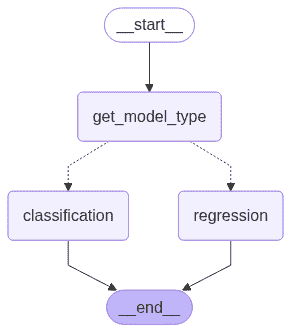
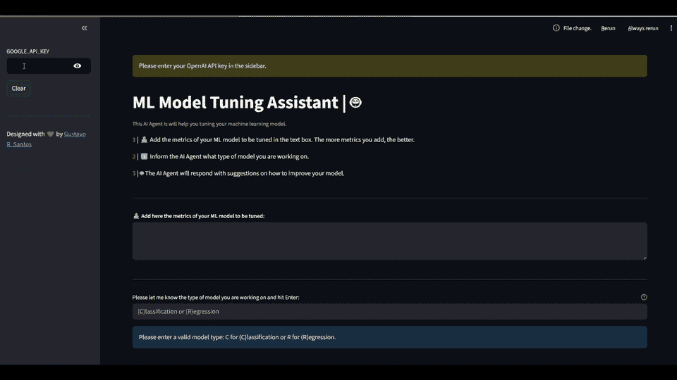
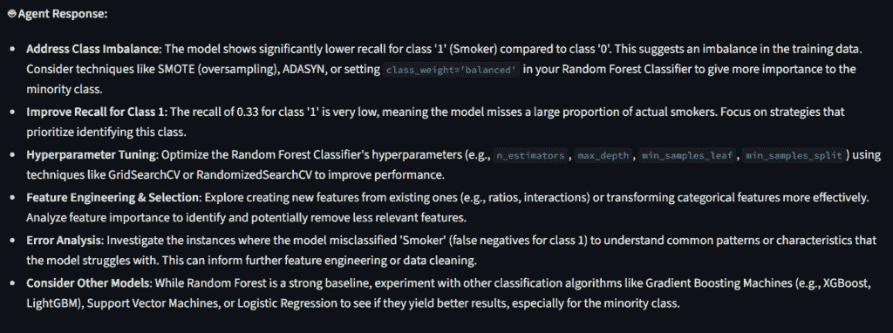
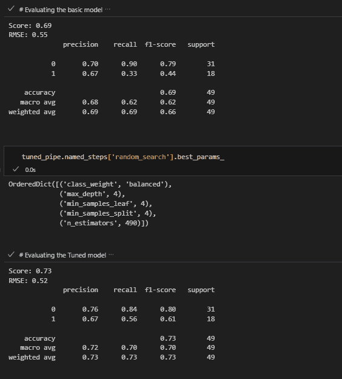

# 智能模型调优：一个结合 LangGraph + Streamlit 的 AI 代理，提升机器学习性能

> 原文：[`towardsdatascience.com/smarter-model-tuning-an-ai-agent-with-langgraph-streamlit-that-boosts-ml-performance/`](https://towardsdatascience.com/smarter-model-tuning-an-ai-agent-with-langgraph-streamlit-that-boosts-ml-performance/)

<mdspan datatext="el1755717950212" class="mdspan-comment">最近，我在使用 LangGraph 的时候，每天的工作都变得更加愉快。</mdspan>

让我们面对现实：由于 LangChain 是第一个处理与 LLM 集成的框架之一，它起步较早，因此成为了构建生产就绪代理时的首选选项，无论你是否喜欢。

LangChain 的弟弟是 **LangGraph**。这个框架使用节点和边构建应用程序的图符号，使它们高度可定制且非常稳健。这正是我最享受的事情。

起初，一些符号对我来说感觉有些奇怪（也许只是我这样）。但我继续挖掘和学习。我坚信，我们在实现东西的时候学习得更好，因为那时真正的难题才会浮现。所以，经过几行代码和一些小时的代码调试后，那个图架构开始对我有更多的意义，我开始享受用 LangGraph 创建事物。

不管怎样，如果你对这个框架没有太多了解，我建议你看看这篇帖子 [[1]](https://medium.com/code-applied/building-your-first-ai-agent-with-langgraph-599a7bcf01cd?sk=a22e309c1e6e3602ae37ef28835ee843)。

现在，让我们更深入地了解这篇文章的项目。

## 项目

在这个项目中，我们将构建一个多步骤代理：

+   它接受机器学习模型类型：*分类* 或 *回归*。

+   我们还将输入我们模型的指标，例如准确率、RMSE、混淆矩阵、ROC 等。我们提供给代理的信息越多，其响应就越好。

这个代理，配备了 Google Gemini 2.0 Flash：

+   读取输入

+   评估用户输入的模型指标

+   返回一个可操作的模型调优建议列表，以提升其性能。

这是项目文件夹结构：

```py
ml-model-tuning/
├── langgraph_agent/
│ ├── graph.py #LangGraph logic
│ ├── nodes.py #LLMs and tools
├── main.py # Streamlit interface to run the agent
├── requirements.txt
```

代理是实时且 [部署在这个网络应用中](https://ml-tuning-assistant.streamlit.app/)。

## 数据集

要使用的数据集是一个非常简单的玩具数据集，名为 *Tips*，来自 Seaborn 包，并开源许可为 BSD 3。我决定使用这样一个简单的数据集，因为它既有分类特征也有数值特征，适合创建两种类型的模型。此外，文章的开头是代理，所以这是我们想要更多关注的点。

要加载数据，请使用以下代码。

```py
import seaborn as sns

# Data
df = sns.load_dataset('tips')
```

接下来，我们将构建节点。

## 节点

LangGraph 对象的节点是 Python 函数。它们可以是代理将使用的工具或 LLM 的实例。我们构建每个节点作为一个单独的函数。

但首先，我们必须加载模块。

```py
import os
from textwrap import dedent
from dotenv import load_dotenv
load_dotenv()

import streamlit as st
from langchain_google_genai import ChatGoogleGenerativeAI
from langchain_core.prompts import ChatPromptTemplate, MessagesPlaceholder
```

我们的第一个节点是用来获取模型类型的。它简单地从用户那里获取输入，确定要增强的模型是回归还是分类。

```py
def get_model_type(state):
    """Check if the user is implementing a classification or regression model. """

    # Define the model type
    modeltype = st.text_input("Please let me know the type of model you are working on and hit Enter:", 
                              placeholder="(C)lassification or (R)egression", 
                              help="C for Classification or R for Regression")

    # Check if the model type is valid
    if modeltype.lower() not in ["c", "r", "classification", "regression"]:
        st.info("Please enter a valid model type: C for (C)lassification or R for (R)egression.")
        st.stop()

    if modeltype.lower() in ["c", "classification"]:
        modeltype = "classification"
    elif modeltype.lower() in ["r", "regression"]:
        modeltype = "regression"

    return {"model_type": modeltype.lower()} # "classification" or "regression" 
```

图中的其他两个节点几乎相同，但它们在系统提示上有所不同。一个针对回归模型评估进行了优化，而另一个专门用于分类。这里我只粘贴其中一个。完整的代码可以在 GitHub 上找到。[查看所有节点的代码在这里。](https://github.com/gurezende/ML-Tuning-Assistant/blob/main/langgraph_agent/nodes.py)

```py
def llm_node_regression(state):
    """
    Processes the user query and search results using the LLM and returns an answer.
    """
    llm = ChatGoogleGenerativeAI(
        model="gemini-2.5-flash",
        api_key=os.environ.get("GEMINI_API_KEY"),
        temperature=0.5,
        max_tokens=None,
        timeout=None,
        max_retries=2
    )

    # Create a prompt
    messages = ChatPromptTemplate.from_messages([
        ("system", dedent("""\
                          You are a seasoned data scientist, specialized in regression models. 
                          You have a deep understanding of regression models and their applications.
                          You will get the user's result for a regression model and your task is to build a summary of how to improve the model.
                          Use the context to answer the question.
                          Give me actionable suggestions in the form of bullet points.
                          Be concise and avoid unnecessary details. 
                          If the question is not about regression, say 'Please input regression model metrics.'.
                          \
                          """)),
        MessagesPlaceholder(variable_name="messages"),
        ("user", state["metrics_to_tune"])
    ])

    # Create a chain
    chain = messages | llm
    response = chain.invoke(state)
    return {"final_answer": [response]}
```

太好了。现在是我们通过构建连接它们的边来将这些节点粘合在一起的时候了。换句话说，就是构建从用户输入到最终输出的信息流。

## 图

将使用文件 `graph.py` ([`github.com/gurezende/ML-Tuning-Assistant/blob/main/langgraph_agent/graph.py`](https://github.com/gurezende/ML-Tuning-Assistant/blob/main/langgraph_agent/graph.py)) 来生成 LangGraph 对象。首先，我们需要导入模块。

```py
from langgraph.graph import StateGraph, END
from typing_extensions import TypedDict
from langgraph.graph.message import add_messages
from langchain_core.messages import AnyMessage
from langgraph.graph import StateGraph, END
from typing import TypedDict, Annotated
from langgraph_agent.nodes import llm_node_classification, llm_node_regression, get_model_type
```

下一步是创建图的状。**StateGraph** 在整个工作流程中管理代理的状态。它**跟踪代理收集和处理的信**息。它不过是一个以字典形式写出变量名称及其类型的类。

```py
# Create a state graph
class AgentState(TypedDict):
    """
    Represents the state of our graph.

    Attributes:
        messages: A list of messages in the conversation, including user input and agent outputs.
        model_type: The type of model being used, either "classification" or "regression".
        question: The initial question from the user.
        final_answer: The final answer provided by the agent.
    """
    messages: Annotated[AnyMessage, add_messages] # accumulate messages
    model_type: str
    metrics_to_tune: str
    final_answer: str 
```

为了构建图，我们将使用一个函数，该函数：

+   为每个节点添加一个元组 `("name", node_function_name)`

+   在 *get_model_type* 节点定义起点。`.set_entry_point("get_model_type")`

+   然后，有一个条件边，根据 `get_model_type` 节点的响应决定是否转到适当的节点。

+   最后，将 LLM 节点连接到 `END` 状态。

+   编译图以使其可用于使用。

```py
def build_graph():
    # Build the LangGraph flow
    builder = StateGraph(AgentState)

    # Add nodes
    builder.add_node("get_model_type", get_model_type)
    builder.add_node("classification", llm_node_classification)
    builder.add_node("regression", llm_node_regression)

    # Define edges and flow
    builder.set_entry_point("get_model_type")

    builder.add_conditional_edges(
        "get_model_type",
        lambda state: state["model_type"],
        {
            "classification": "classification",
            "regression": "regression"
        }
    )

    builder.add_edge("classification", END)
    builder.add_edge("regression", END)

    # Compile the graph
    return builder.compile() 
```

如果你想查看图，可以使用这个小片段。

```py
# Create the graph image and save png
from IPython.display import display, Image
graph = build_graph()
display(Image(graph.get_graph().draw_mermaid_png(output_file_path="graph.png")))
```



图像为作者创建的图。

这是一个简单的代理，但它工作得非常好。我们很快就会看到这一点。但我们需要先构建前端部分。

## 构建用户界面

用户界面是一个 Streamlit 应用。我选择这个选项是因为它具有易于原型设计和部署的功能。

让我们再次加载所需的库。

```py
import os
from langgraph_agent.graph import AgentState, build_graph
from textwrap import dedent
import streamlit as st
```

配置页面布局（标题、图标、侧边栏等）。

```py
## Config page
st.set_page_config(page_title="ML Model Tuning Assistant",
                   page_icon='🤖',
                   layout="wide",
                   initial_sidebar_state="expanded")
```

创建包含添加 Google Gemini API 密钥字段和*重启会话*按钮的侧边栏。

```py
## SIDEBAR | Add a place to enter the API key
with st.sidebar:
    api_key = st.text_input("GOOGLE_API_KEY", type="password")

    # Save the API key to the environment variable
    if api_key:
        os.environ["GEMINI_API_KEY"] = api_key

    # Clear
    if st.button('Clear'):
        st.rerun()
```

现在，我们添加页面的标题和使用代理的说明。这些都是使用 `st.write()` 函数的简单代码。

```py
## Title and Instructions
if not api_key:
    st.warning("Please enter your OpenAI API key in the sidebar.")

st.title('ML Model Tuning Assistant | 🤖')
st.caption('This AI Agent is will help you tuning your machine learning model.')
st.write(':red[**1**] | 👨‍💻 Add the metrics of your ML model to be tuned in the text box. The more metrics you add, the better.')
st.write(':red[**2**] | ℹ️ Inform the AI Agent what type of model you are working on.')
st.write(':red[**3**] | 🤖 The AI Agent will respond with suggestions on how to improve your model.')
st.divider()

# Get the user input
text = st.text_area('**👨‍💻 Add here the metrics of your ML model to be tuned:**')

st.divider()
```

最后，代码用于：

+   运行 `build_graph()` 函数并创建代理。

+   创建代理的初始状态，其中 `messages` 为空。

+   调用代理。

+   在屏幕上打印结果。

```py
## Run the graph

# Spinner
with st.spinner("Gathering Tuning Suggestions...", show_time=True):
    from langgraph_agent.graph import build_graph
    agent = build_graph()

    # Create the initial state for the agent, with blank messages and the user input
    prompt = {
        "messages": [],
        "metrics_to_tune": text
    }

    # Invoke the agent
    result = agent.invoke(prompt)

    # Print the agent's response
    st.write('**🤖 Agent Response:**')
    st.write(result['final_answer'][0].content)
```

所有创建完成。现在是时候让这个 AI 代理工作了！

因此，我们将构建一些模型，并请求代理提供调优建议。

## 运行代理

嗯，因为这个代理帮助我们提供模型调优建议，我们必须有一个模型来调优。

### 回归模型

我们将首先尝试回归模型。我们可以快速构建一个简单的模型。

```py
# Imports
import pandas as pd
import numpy as np
import seaborn as sns
from sklearn.pipeline import Pipeline
from feature_engine.encoding import OneHotEncoder
from sklearn.model_selection import train_test_split
from sklearn.linear_model import LinearRegression
from sklearn.metrics import root_mean_squared_error

## Baseline Model
# Data
df = sns.load_dataset('tips')

# Train Test Split
X = df.drop('tip', axis=1)
y = df['tip']
X_train, X_test, y_train, y_test = train_test_split(X, y, test_size=0.2, random_state=42)

# Categorical
cat_vars = df.select_dtypes(include=['object']).columns

# Pipeline
pipe = Pipeline([
    ('encoder', OneHotEncoder(variables=['sex', 'smoker', 'day', 'time'],
                              drop_last=True)),
    ('model', LinearRegression())
])

# Fit
pipe.fit(X_train, y_train)
```

现在，我们必须收集度量数据以向我们的 AI 代理展示，以便获得调整建议。数据越多越好。由于我正在处理回归模型，我选择展示以下信息：

+   特征名称

+   数据集的统计描述

+   R²

+   根均方误差 (RMSE)

+   回归截距和系数

+   VIF

```py
 total_bill         tip   sex smoker  day    time        size
count   244.000000  244.000000   244    244  244     244  244.000000
unique         NaN         NaN     2      2    4       2         NaN
top            NaN         NaN  Male     No  Sat  Dinner         NaN
freq           NaN         NaN   157    151   87     176         NaN
mean     19.785943    2.998279   NaN    NaN  NaN     NaN    2.569672
std       8.902412    1.383638   NaN    NaN  NaN     NaN    0.951100
min       3.070000    1.000000   NaN    NaN  NaN     NaN    1.000000
25%      13.347500    2.000000   NaN    NaN  NaN     NaN    2.000000
50%      17.795000    2.900000   NaN    NaN  NaN     NaN    2.000000
75%      24.127500    3.562500   NaN    NaN  NaN     NaN    3.000000
max      50.810000   10.000000   NaN    NaN  NaN     NaN    6.000000

---
Model: Linear Regression
Score: 0.44
RMSE: 0.84
Intercept: 0.45

Coefficients:
       feature  coefficient
0   total_bill     0.094700
1         size     0.233484
2     sex_Male     0.028819
3    smoker_No     0.192353
4      day_Sat    -0.006064
5      day_Fri     0.179721
6      day_Sun     0.128928
7  time_Dinner    -0.094957

VIF:
total_bill    2.226294
tip           1.879238
size          1.590524
```

现在我将运行代理。



AI 代理在行动。GIF 由作者提供。

这里是代理人的回应：

> 🤖 代理回应：
> 
> 这里有一些可操作的建议来改进你的回归模型：
> 
> +   **探索非线性关系：** 考虑为 total_bill 和 size 添加多项式特征，或特征之间的交互项（例如，total_bill * size），因为当前的线性模型可能过于简单，无法捕捉潜在的数据模式。
> +   
> +   **评估替代回归模型：** 给定 R 平方为 0.44，测试其他模型，如随机森林回归器、梯度提升回归器或支持向量回归器，这些模型可以捕捉更复杂、非线性关系。
> +   
> +   **处理数据分布和异常值：** 调查并处理 total_bill 和目标变量 tip 中的异常值。考虑应用变换（例如，对数变换）来更好地满足线性假设并提高模型性能。
> +   
> +   **分析特征统计显著性：** 获取每个系数的 p 值以识别可能不具有统计显著性的特征。移除或重新评估此类特征可以简化模型并可能提高泛化能力。

这里有一些建议。我们现在可以选择接受或不接受。以下是我尝试的内容（GitHub 中的代码）：

+   我训练了一个随机森林回归器，但使用即插即用的模型结果并不好，R²降至 0.25，RMSE 降至 0.97。因此，我放弃了这个选项。

+   因此，如果我要保留线性回归，另一个建议是使用对数变换并处理异常值。我试了，结果更好。模型的 R²上升到 0.55，RMSE 下降到 0.23。这是一个显著的改进。

### 分类模型

我在这里遵循了相同的步骤，但现在正在处理一个分类模型，使用相同的数据集，试图预测餐厅顾客是否吸烟。

1.  训练了一个分类模型

1.  **获取初始度量：`Score = 0.69`; `RMSE = 0.55`**

1.  运行 AI 代理以获取建议

1.  应用了一些调整建议：`class_weight='balanced'` 和 `BayesSearchCV`。

1.  **获取调整后的度量：`Score = 0.71`; `RMSE = 0.52`**



AI 代理的建议。图由作者提供。

注意，精确度与召回率的平衡性也更好。



调整前后的得分。图由作者提供。

我们的工作完成了。代理按预期工作。

## 在你离开之前

我们已经完成了这个项目。总的来说，我对结果很满意。这个项目相当简单且快速构建，但仍然提供了很多价值！

调整模型不是一种**一刀切**的行动。有许多选项可以尝试。因此，有 AI 代理的帮助，给我们一些尝试的想法是非常宝贵的，并且使我们的工作更容易，而不会取代我们。

亲自尝试这个应用，并告诉我它是否帮助您提高了性能指标！

[`ml-tuning-assistant.streamlit.app`](https://ml-tuning-assistant.streamlit.app)

## GitHub 仓库

[`github.com/gurezende/ML-Tuning-Assistant`](https://github.com/gurezende/ML-Tuning-Assistant)

## 在线找到我

[`gustavorsantos.me`](https://gustavorsantos.me)

## 参考文献

**[1. 使用 LangGraph 构建您的第一个 AI 代理]** [`medium.com/code-applied/building-your-first-ai-agent-with-langgraph-599a7bcf01cd?sk=a22e309c1e6e3602ae37ef28835ee843`](https://medium.com/code-applied/building-your-first-ai-agent-with-langgraph-599a7bcf01cd?sk=a22e309c1e6e3602ae37ef28835ee843)

**[2. 使用 Gemini 与 LangGraph 集成]** [`python.langchain.com/docs/integrations/chat/google_generative_ai/`](https://python.langchain.com/docs/integrations/chat/google_generative_ai/)

**[3. LangGraph 文档]** [`langchain-ai.github.io/langgraph/tutorials/get-started/1-build-basic-chatbot/`](https://langchain-ai.github.io/langgraph/tutorials/get-started/1-build-basic-chatbot/)

**[4. Streamlit 文档]** [`docs.streamlit.io/`](https://docs.streamlit.io/)

**[5. 获取 Gemini API 密钥]** [`tinyurl.com/gemini-api-key`](https://tinyurl.com/gemini-api-key)

**[6. GitHub 仓库 ML 调优代理]** [`github.com/gurezende/ML-Tuning-Assistant`](https://github.com/gurezende/ML-Tuning-Assistant)

**[7. 使用贝叶斯搜索进行超参数调优指南]** [`medium.com/code-applied/dont-guess-get-the-best-a-smart-guide-to-hyperparameter-tuning-with-bayesian-search-123e4e98e845?sk=ff4c378d816bca0c82988f0e8e1d2cdf`](https://medium.com/code-applied/dont-guess-get-the-best-a-smart-guide-to-hyperparameter-tuning-with-bayesian-search-123e4e98e845?sk=ff4c378d816bca0c82988f0e8e1d2cdf)

**[8. 部署的应用]** [`ml-tuning-assistant.streamlit.app/`](https://ml-tuning-assistant.streamlit.app/)
