# 智慧，而非艰难：AI 的自我怀疑如何解锁峰值性能

> 原文：[`towardsdatascience.com/smarter-not-harder-how-ais-self-doubt-unlocks-peak-performance/`](https://towardsdatascience.com/smarter-not-harder-how-ais-self-doubt-unlocks-peak-performance/)

## 简介

<mdspan datatext="el1759375066316" class="mdspan-comment">大型语言模型</mdspan>（LLMs）越来越能够解决复杂的推理任务，例如数学奥林匹克问题、科学问答和多步逻辑谜题[*[3,8]*]。但它们真的很好吗？是的，它们确实很好，但到目前为止，它们在测试时的计算成本非常高且效率低下[*[5,6]*]。为了应对这一挑战，Meta AI 的研究人员提出了一种名为“**DeepConf**”的解决方案，也称为“**Deep Think with Confidence**”[*[1]*](https://arxiv.org/pdf/2508.15260)。

### 存在一个被称为多数投票自洽性的问题。

我相信你一定想知道这个问题在实际中是什么样子。想象一下一个有 100 名学生的教室。你给他们一个复杂的奥林匹克数学问题，并让他们有一个小时的时间去解决它。最后，你可以收集所有的答案并投票——得票最多的答案“获胜。”

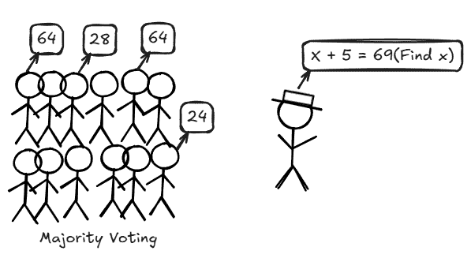

（来源：作者）

这就是 LLMs 中多数投票自洽性问题的工作原理[*[2,3]*](https://arxiv.org/abs/2203.11171)。模型不仅仅探索一个解决方案，而是探索数百个推理路径（例如，512 个不同的逐步解决方案），然后选择最频繁的答案。

在**AIME 2025 数学基准测试**中，**Qwen3–8B**（称为 pass@1）的单次遍历大约达到**68%**的准确率；这就像从一名学生那里得到一个答案。但如果你为每个问题生成**512 个推理轨迹**（称为 conf@512）并取多数答案，那么准确率会跃升至**82%**[*[1,4]*](https://arxiv.org/pdf/2508.15260)。

听起来很棒，对吧？但问题是，那额外的 511 个轨迹产生了近**1 亿个额外的标记**，而且更多的轨迹并不总是有帮助；当低质量的解决方案主导投票时，性能可能会保持不变，甚至有时还会下降[*[1,7,8]*](https://arxiv.org/pdf/2508.15260)。换句话说，如果学生们在随机猜测，那么班级投票并不能反映教室里最好的思考者[*[1]*](https://arxiv.org/pdf/2508.15260)。

* * *

## 研究者们对此采取了什么措施：早期修复

研究者们试图通过观察模型的内部不确定性信号来解决这一问题。现在，那内部的不确定性是什么？就像在一段时间后（比如每 5 分钟）观察每个学生是否在做正确的初步步骤。模型观察每个标记的概率分布，并在特定时间计算其置信度或熵。如果模型对特定标记的预测有很高的置信度或很低的熵（高峰值的低分散），那么模型对这个特定标记的预测很确定，反之亦然[*[1,11]*](https://arxiv.org/pdf/2508.15260)。

通过在整个推理轨迹中添加这些标记级预测统计，我们可以估计解决方案的真正“可信度”。我们还可以在多数投票之前过滤掉低置信度轨迹——就像忽略那些明显猜测的学生的答案一样。**减少错误投票，增强结果**[*[1]*](https://arxiv.org/pdf/2508.15260)。

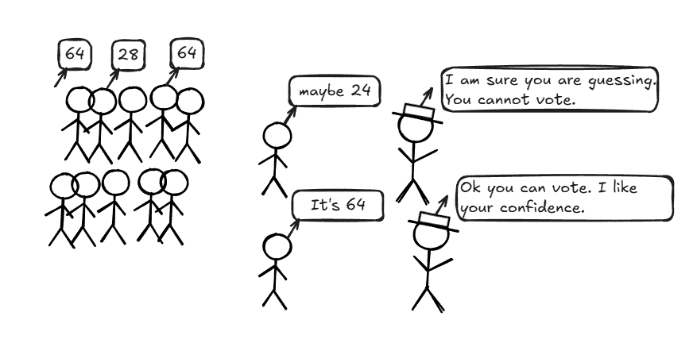

(来源：作者)

然而，这些方法仍然是全局性的，并没有完全解决效率问题[*[1,6,13]*](https://arxiv.org/pdf/2508.15260)。

让我们在这里谈谈一些数学问题，比如标记熵、标记置信度和轨迹置信度是如何工作的[*[1,11]*](https://arxiv.org/pdf/2508.15260)。

标记熵：

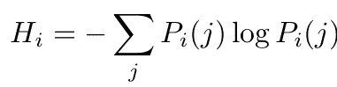

(来源：作者)

让我们分解一下这个熵的概念。**logPᵢ(j)**项说明了标记预测的惊喜程度，即第 i 个位置上标记的概率。当概率为 1（模型非常确定，惊喜为 0。没有戏剧性，没有不确定性）时，这表明模型对标记预测非常确定。然后我们取所有标记熵的平均值来定义每一步或标记预测中的熵[*[1]*](https://arxiv.org/pdf/2508.15260)。

标记置信度：

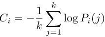

(来源：作者)

标记置信度感知每个标记预测的猜测有多尖锐（反惊喜计)[*[1]*](https://arxiv.org/pdf/2508.15260)。

平均轨迹置信度：

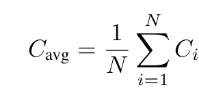

(来源：作者)

当我们在每个标记上计算置信度时，这些置信度分数的平均值给出了轨迹的置信度[*[1]*](https://arxiv.org/pdf/2508.15260)。

* * *

## 自信感知测试时间缩放：DeepConf

DeepConf 将这一想法进一步发展，而不是简单地投票数百个解决方案*[2,3,12]*。它观察模型在生成过程中和生成后的内部置信度信号。它动态地过滤掉低质量的推理轨迹，无论是在实时（在线模式）还是在所有解决方案生成后（离线模式）。它只保留最可信的推理方式，并减少浪费的计算[*[1,6]*](https://arxiv.org/pdf/2508.15260)。

结果如何？在 AIME 2025 上，DeepConf@512 与 GPT-OSS-120B 达到了令人震惊的 99.9%准确率。与简单的多数投票相比，它提高了 97.0%，而单次尝试（pass@1）仅达到 91.8%。同时，DeepConf 将标记生成量减少了**高达 84.7**%，与蛮力并行思维相比[*[1,6,7]*](https://arxiv.org/pdf/2508.15260)。

直观感清晰后，是时候看看这些置信度指标实际上是如何在幕后工作的了。

组自信：

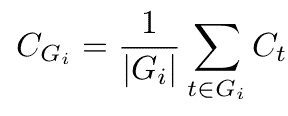

(来源：作者)

Cₜ 仍然是我们的标记级置信度。将组置信度（C_Gᵢ）视为对确定性的放大检查，其中 |Gᵢ| 是具有重叠窗口的前置标记数量（例如 1024 或 2048 个标记）。这为我们提供了一个确定性的局部快照[*[1]*](https://arxiv.org/pdf/2508.15260)。

底部 10% 组置信度：

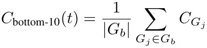

（来源：作者）

当我们按组置信度分数排序并聚焦于底部 10% 时，我们基本上是在照亮推理链中最薄弱的环节。如果这些步骤看起来不稳定，我们可以将它们丢弃以节省计算[*[1]*](https://arxiv.org/pdf/2508.15260)。

尾部置信度：

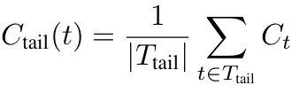

（来源：作者）

尾部置信度很简单；我们只需取最后固定数量的标记，例如 2048，然后找到模型在最后几步（检查最后一步）的置信度，这是预测正确结论的关键步骤[*[1]*](https://arxiv.org/pdf/2508.15260)。

我们可以使用 DeepConf 在两种模式下使用：离线和在线[*[1]*](https://arxiv.org/pdf/2508.15260)。

* * *

## 离线思考与置信度

当你离线时，你不再一次又一次地调用模型或获取额外数据。相反，你只剩下已经生成的迹。

挑战是从它们中挤出最可靠的答案。

在离线模式下，我们可以对结果迹进行普通投票（当有更多噪声结果时可能会中断）或置信度加权的多数投票，其中我们取迹的平均置信度值，并简单地取置信度分数与该解决方案出现的乘积[*[1,2]*](https://arxiv.org/pdf/2508.15260)。

置信度过滤和投票：在投票之前，丢弃最弱的迹。首先按置信度过滤迹（取迹的前 n%）然后进行普通投票或加权置信度投票[*[1,9,10]*](https://arxiv.org/pdf/2508.15260)。

你可以选择任何适合你的置信度指标，如平均置信度、组置信度或尾部置信度[*[1,10,11]*](https://arxiv.org/pdf/2508.15260)。

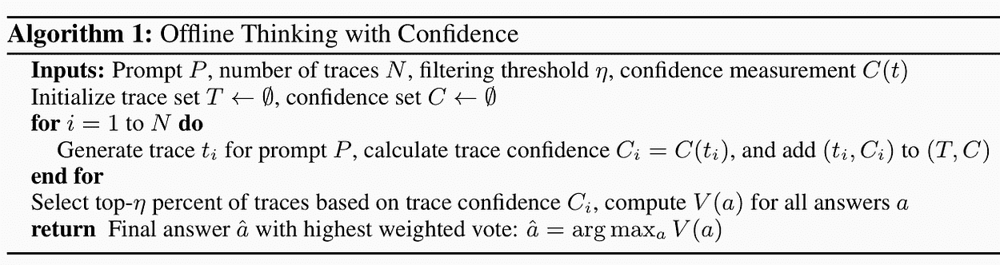

算法 1 用于离线思考（来源：Deep Think with Confidence[*[1]*](https://arxiv.org/pdf/2508.15260))

> **逐步解释：**
> 
> **输入：**
> 
> **提示 P：** 你想要回答的问题或输入。
> 
> **迹的数量 N：** 你将生成多少推理路径。
> 
> **过滤阈值 𝜂：** 过滤顶部迹的百分比。
> 
> **置信度测量 C(t)：** 通过任何你想要的方法计算迹的置信度分数[[1]](https://arxiv.org/pdf/2508.15260)。
> 
> **初始化：**
> 
> 创建一个空集 T。
> 
> 创建一个空的置信度集 C[[1]](https://arxiv.org/pdf/2508.15260)。
> 
> **生成迹：**
> 
> **对于从 1 到 N 的每个迭代：** 你可以为提示 P 生成一个迹 tᵢ。
> 
> **计算置信度** **分数** Cᵢ = C(tᵢ)。
> 
> **将(tᵢ, Cᵢ)对存储在 T 和 C[[1]](https://arxiv.org/pdf/2508.15260)**中**。
> 
> **过滤高置信度跟踪**：
> 
> 从所有 N 跟踪中，根据它们的置信度分数选择前η%。
> 
> 这移除了噪声或低质量的跟踪，只保留强置信度答案[[1]](https://arxiv.org/pdf/2508.15260)。
> 
> **投票**：
> 
> 我们可以计算每个可能的答案 a 的投票分数 V(a)。
> 
> 这可以是简单的计数或加权投票[[1]](https://arxiv.org/pdf/2508.15260)。
> 
> **选择最终答案**：
> 
> 选择得票数最高的答案[[1]](https://arxiv.org/pdf/2508.15260)：

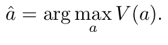

(来源：作者)

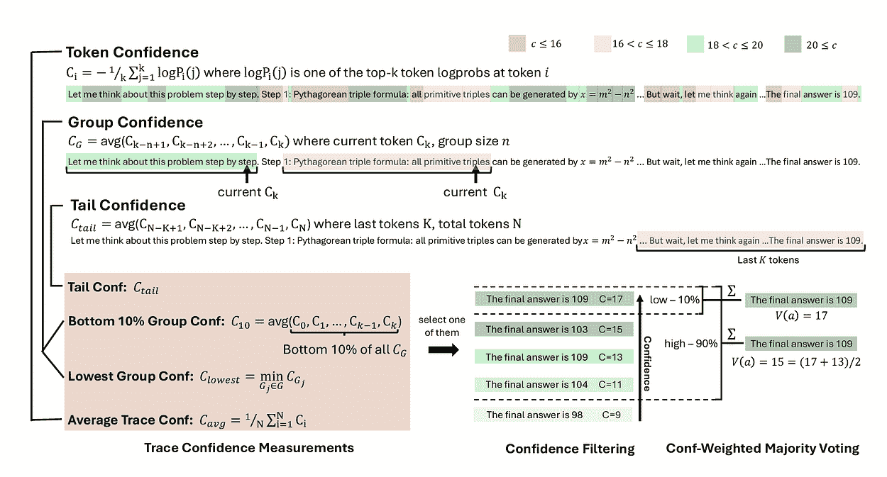

置信度测量和离线自信思考（来源：Deep Think with Confidence[*[1]*](https://arxiv.org/pdf/2508.15260))

* * *

## 在线自信思考

算法在动态生成跟踪的同时，在有足够证据时测量置信度[*[1,5,14,15]*](https://arxiv.org/pdf/2508.15260)。

**算法**：

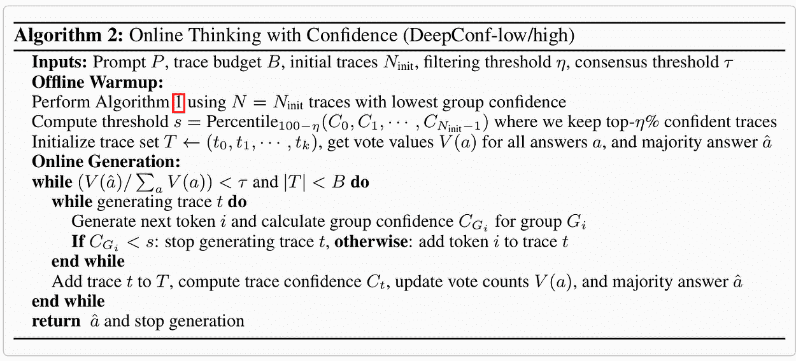

算法 2 用于在线思考（来源：Deep Think with Confidence[[1]](https://arxiv.org/pdf/2508.15260))

> **逐步解释**
> 
> **1. 输入**
> 
> **提示 P**：再次回答的问题。
> 
> **跟踪预算 B**：这是你想要生成的最大跟踪数。
> 
> **初始跟踪 N**ᵢₙᵢₜ：这是一个用于预热的起始跟踪池。
> 
> **过滤阈值η**：保留多少高置信度跟踪。
> 
> **共识阈值τ**：它给出一个百分比，表示当你对多数答案有信心时可以停止[[1]](https://arxiv.org/pdf/2508.15260)。
> 
> **2. 离线预热**
> 
> **在线生成之前**：
> 
> 使用 Nᵢₙᵢₜ跟踪运行算法 1。
> 
> **计算置信度阈值 s**：
> 
> 从初始跟踪中取 100, η百分位数的置信度分数。
> 
> 这定义了标记/组需要达到的最小置信度才能被考虑。
> 
> 使用初始跟踪初始化跟踪集 T，并计算所有答案的初始投票值 V(a)[[1]](https://arxiv.org/pdf/2508.15260)。

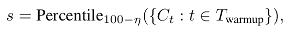

(来源：作者)

> 确定初始多数答案â[[1]](https://arxiv.org/pdf/2508.15260)。
> 
> **3. 在线生成循环**
> 
> 当两个条件保持时：
> 
> 当前多数答案还不够自信：

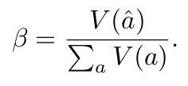

(来源：作者)

> 你还没有超过跟踪预算|T|<B
> 
> → 继续生成新的跟踪[[1]](https://arxiv.org/pdf/2508.15260)：
> 
> **4. 逐步生成跟踪**
> 
> 在生成跟踪 t 时：逐个生成 token。
> 
> 在每个 token iii 之后，计算该 token/组的组置信度 C_Gᵢ。
> 
> 如果 C_Gᵢ<s：停止生成跟踪（置信度低）。
> 
> 否则：将 token iii 添加到跟踪 t[[1]](https://arxiv.org/pdf/2508.15260)。
> 
> **5. 更新**
> 
> 将完成的跟踪 ttt 添加到跟踪集 T。
> 
> 计算跟踪置信度 Cₜ​。
> 
> 更新所有答案的投票计数 V(a)。
> 
> 更新多数答案 â[[1]](https://arxiv.org/pdf/2508.15260).
> 
> **6. 终止**
> 
> 当以下任一条件满足时停止：
> 
> 多数答案 â达到阈值 τ 以上的共识。
> 
> 或者达到迹预算 B。
> 
> 返回最终的多数答案 â[[1]](https://arxiv.org/pdf/2508.15260).

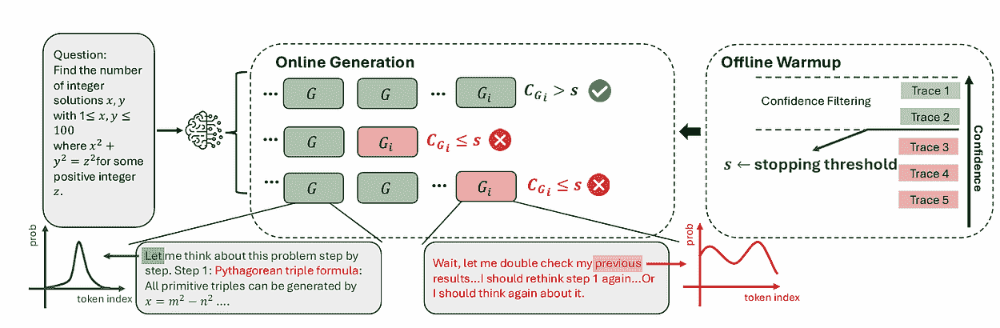

DeepConf 在在线生成期间（来源：Deep Think with Confidence[*[1]*](https://arxiv.org/pdf/2508.15260))

我认为这个算法是早期停止的艺术，可以节省大量的计算和资源[*[1,5,6,7,13,14]*](https://arxiv.org/pdf/2508.15260).

* * *

## 结论

那么，你认为呢？这个故事的意义是什么？即使在人工智能课堂中，最聪明的“学生”有时也需要一点自我怀疑才能发光。DeepConf 展示了自我怀疑有多么强大。我们可以通过选择更智能、基于置信度的方法来节省数百万次的计算，而不是通过蛮力。这就像将混乱的数学竞赛转变为一个冷静的专家问题解决团队。

随着人工智能不断学习自信地思考，我们正朝着这样一个未来迈进：模型不仅更聪明，而且更节俭，计算量更少，错误更少，每个标记提供的脑力更多。谁知道呢？也许有一天，你最喜欢的模型将成为你最节俭、最自知的伙伴。在此之前，让我们继续更聪明地思考，而不是更努力。

* * *

### 参考文献

[1] Dayananda, A., Sivasubramanian, S., & Bartlett, P. (2024). Deep Think with Confidence: 基于置信度的测试时扩展以实现更好的对齐。arXiv 预印本 arXiv:2508.15260\. 获取自 [**https://arxiv.org/pdf/2508.15260**](https://arxiv.org/pdf/2508.15260)

[2] Wang, X., Wei, J., Schuurmans, D., Le, Q., Chi, E., Narang, S., Chowdhery, A., & Zhou, D. (2022). 自洽性改进语言模型中的思维链推理。arXiv 预印本 [**arXiv:2203.11171**](https://arxiv.org/abs/2203.11171)**。**

[3] Wei, J., Wang, X., Schuurmans, D., Bosma, M., Xia, F., Chi, E., Le, Q. V., Zhou, D., & others. (2022). 思维链提示在大型语言模型中引发推理。在神经信息处理系统高级研究 **(**[**Vol. 35, pp. 24824–24837**](https://arxiv.org/abs/2201.11903)**)**.

[4] Art of Problem Solving. (2025a). 2025 AIME I. [**https://artofproblemsolving.com/wiki/index.php/2025_AIME_I**](https://artofproblemsolving.com/wiki/index.php/2025_AIME_I)**。** 访问时间：2025.

[5] OpenAI. (2024). OpenAI o1 系统卡。arXiv 预印本 [**arXiv:2412.16720**](http://arxiv.org/abs/2412.16720).

[6] Snell, C., Lee, J., Xu, K., & Kumar, A. (2024). 优化 LLM 测试时计算扩展可能比扩展模型参数更有效。arXiv 预印本 [**arXiv:2408.03314**](https://arxiv.org/abs/2408.03314)**。**

[7] 布朗，Juravsky, J.，Ehrlich, R.，克拉克，R.，Le, Q. V.，Ré, C.，& Mirhoseini, A.（2024）。大型语言猴子：通过重复采样扩展推理计算。arXiv 预印本 [**arXiv:2407.21787**](https://arxiv.org/abs/2407.21787)**。**

[8] 陈磊，戴维斯，J. Q.，汉宁，B.，贝利斯，P.，斯托伊卡，I.，扎哈里亚，M.，& 周杰（2024a）。是否需要更多的 LLM 调用？复合推理系统扩展定律。[**https://arxiv.org/abs/2403.02419**](https://arxiv.org/abs/2403.02419)

[9] 阿加瓦尔，P.，马达安，A.，杨，Y.，等（2023）。一步一步采样：LLMs 的高效推理和编码的自适应一致性。arXiv 预印本 [**arXiv:2305.11860**](https://arxiv.org/abs/2305.11860)**。**

[10][**Geng, J., Cai, F., 王宇，Koeppl, H., Nakov, P., & Gurevych, I.（2024）。大型语言模型中置信度估计和校准的综述。在 2024 年北美计算语言学协会人类语言技术会议论文集（第 1 卷：长篇论文），第 6577–6595 页。**](https://aclanthology.org/2024.naacl-long.366/)

[11] Fadeeva, E.，Rubashevskii, A.，Shelmanov, A.，Petrakov, S.，李，H.，Mubarak, H.，…… & Panov, M.（2024）。通过标记级不确定性量化对大型语言模型输出进行事实核查。arXiv 预印本 [**arXiv:2403.04696**](https://arxiv.org/abs/2403.04696)。

[12] [**Farquhar, S., Kossen, J., Kuhn, L., & Gal, Y.（2024）。使用语义熵检测大型语言模型中的幻觉。自然，第 630 卷（8017 期），第 625–630 页。**](https://www.nature.com/articles/s41586-024-07421-0)

[13] 李，Y.，袁，P.，冯，S.，潘，B.，王，X.，孙，B.，…… & 李，K.（2024）。逃离高昂的成本：多步推理的早期停止自洽性。arXiv 预印本 [**arXiv:2401.10480**](https://arxiv.org/abs/2401.10480)。

[14] 汉志，李志，王宇，郭超，宋瑞，何杰，…… & 陈伟（2024）。自适应推理时间计算：LLMs 可以预测它们是否可以做得更好，甚至在中代。arXiv 预印本 [**arXiv:2410.02725**](https://arxiv.org/abs/2410.02725)。

[15][**傅毅，陈杰，庄宇，傅子，斯托伊卡，I.，& 张浩（2025）。无需自我怀疑的推理：通过确定性探测提高思维链的效率。在 2025 年 ICLR 工作坊：野外基础模型。**](https://openreview.net/pdf?id=wpK4IMJfdX)

* * *
