# 使用监督学习直观且详尽地解释解决魔方

> 原文：[`towardsdatascience.com/solving-a-rubiks-cube-with-supervised-learning-intuitively-and-exhaustively-explained-4f87b72ba1e2/`](https://towardsdatascience.com/solving-a-rubiks-cube-with-supervised-learning-intuitively-and-exhaustively-explained-4f87b72ba1e2/)

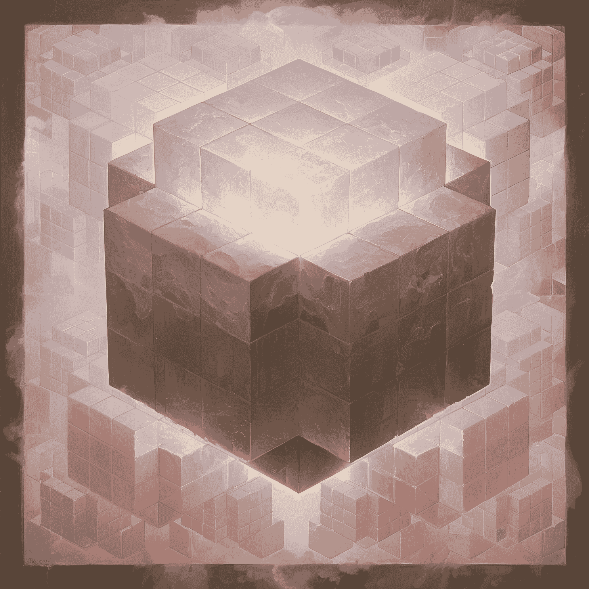

"Mosaic Space" by Daniel Warfield using Midjourney, Matplotlib, and Affinity Design 2\. All images by the author unless otherwise specified. Article originally made available on [Intuitively and Exhaustively Explained](https://iaee.substack.com/).

在本文中，我们将构建一个可以解决魔方的 AI 模型。我们将定义自己的数据集，创建一个基于该数据集学习的 transformer 风格模型，并使用该模型来解决新的和随机打乱的魔方。

在解决这个问题的过程中，我们将讨论在数据科学中经常出现的一些实际问题，以及数据科学家用来解决这些问题的技术。

**这对谁有用？** 对希望掌握现代人工智能的任何人有用。

**这篇文章有多高级？** 本文直观地介绍了高级建模策略，适合所有水平的读者。

**先决条件：** 本文没有先决条件，尽管对 transformer 风格模型的理解可能对一些较后的、代码密集的部分有所帮助。

**参考文献：** 在本文末尾的参考文献部分可以找到代码和相关资源的链接。

* * *

## 将魔方定义为建模问题

如你所知，魔方是一种几何游戏，它有一个 3x3x3 的立方体，每个面都有不同颜色的部分。这些面可以旋转 90 度，无论是顺时针还是逆时针，都可以打乱或解决魔方。

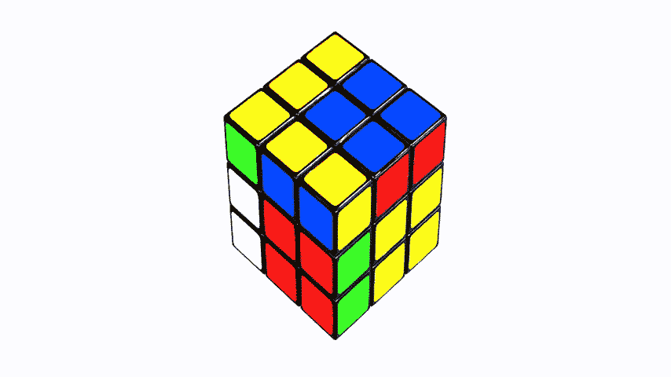

解决魔方的目标是通过对一系列旋转进行操作，使所有面都变成单一均匀的颜色。通过随机旋转各个面来打乱魔方的过程称为“打乱”。

本文的目标是创建一个模型，它可以接受一个打乱的魔方，并输出一系列步骤来解决这个魔方。

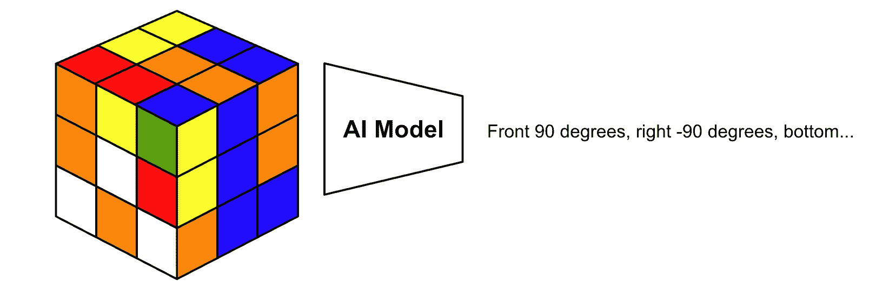

人工智能模型的目标：接受一些打乱的魔方，并输出一系列步骤来解决该魔方。

有很多种方法可以实现这一点。在这篇文章中，我们将探讨其中一种更直接的方法：监督学习。

### 高层次的计划

制作一个能解决魔方的 AI 模型的一种自然方法可能是从高手的解决方案中收集数据，然后训练一个模型来模仿这些解决方案。虽然使用人类数据来训练模型有其优点，但也有其缺点。寻找和许可专业魔方选手的数据可能很困难，甚至不可能，雇佣专业魔方选手来创建定制数据集将耗费大量成本和时间。如果你足够聪明，所有这些工作可能都是不必要的。例如，在这篇文章中，我们将使用一个完全合成的数据集，这意味着我们将自动生成所有训练数据，而不使用任何来自人类玩家的数据。

实质上，我们将解决魔方的任务表述为尝试预测用于打乱魔方的序列的反向。想法是随机打乱数百万个魔方，反转用于打乱它们的序列，然后创建一个模型，其任务是预测反转的打乱序列。

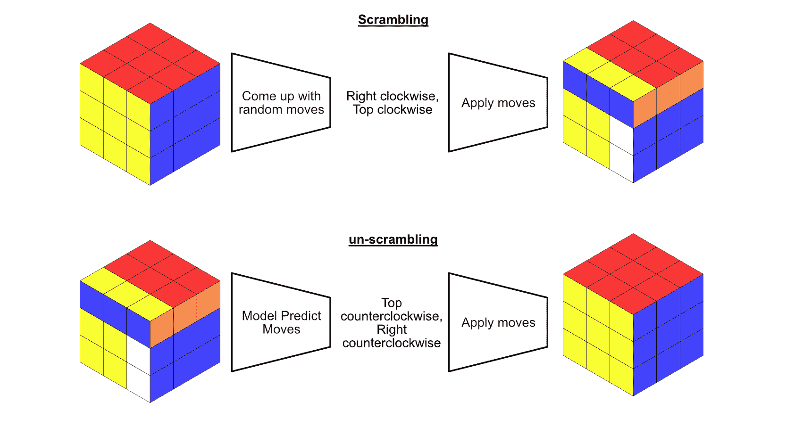

为了创建我们的数据集，我们将想出随机移动来打乱我们的魔方。模型的任务将是预测打乱序列的反向和方向，这将解决魔方。

这种策略属于“监督学习”，这是训练人工智能模型的典型方法。在使用监督学习训练模型时，你本质上是在告诉模型“这里有一个输入（一个打乱的魔方），预测一个输出（一系列步骤），然后我会根据你的回答与我预期的匹配程度（即打乱序列的反向）来训练你”。

还有其他形式的学习，如对比学习、半监督学习和强化学习，但在这篇文章中，我们将坚持基本原理。如果你对其中的一些方法感兴趣，我在文章末尾的参考文献部分提供了一些链接。

因此，我们有一个高层次的计划：打乱一堆魔方，并训练一个模型来预测用于打乱它们的序列的反向。在我们深入定义一个定制的 Transformer 风格模型来处理这些数据之前，让我们先回顾一下 Transformer 风格模型的一般概念。

## Transformer 的简要介绍

本节将简要回顾 Transformer 风格的模型。这基本上是我关于该主题更全面文章的浓缩版：

> [**Transformer – 直观且全面解释**](https://medium.com/towards-data-science/transformers-intuitively-and-exhaustively-explained-58a5c5df8dbb)

在其最基本的意义上，Transformer 是一个编码器-解码器风格的模型。

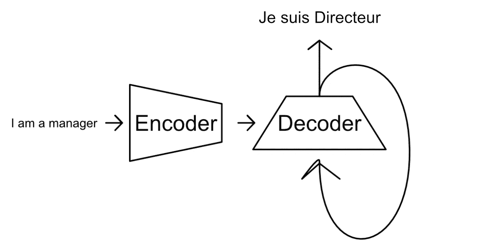

在翻译任务中工作的 Transformer。输入（我是经理）被压缩成一个抽象表示，该表示编码了整个输入的意义。解码器通过自我反馈的方式递归工作，以构建输出。来自[我的关于 Transformer 的文章](https://medium.com/towards-data-science/transformers-intuitively-and-exhaustively-explained-58a5c5df8dbb)

编码器将输入转换为一个抽象表示，解码器使用这个表示来迭代生成输出。

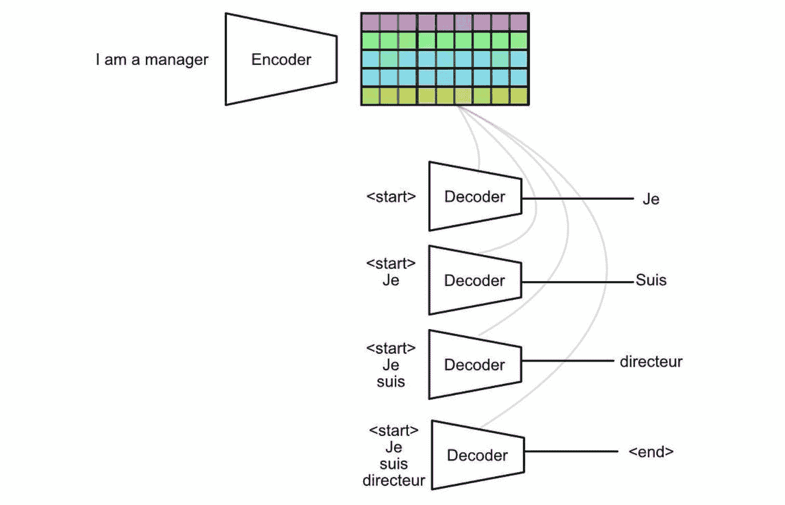

编码器输出与解码器之间的高层次关系表示。解码器在输出过程中的每一轮都引用编码后的输入。解码器通过将之前的输出作为输入，并预测它认为应该出现的下一个标记来生成整个序列。来自[我的关于 Transformer 的文章](https://medium.com/towards-data-science/transformers-intuitively-and-exhaustively-explained-58a5c5df8dbb)

编码器和解码器都使用一个由称为多头自注意力操作创建的文本的抽象表示。


多头自注意力，简而言之。该机制从数学上结合不同单词的向量，创建一个矩阵，该矩阵编码了整个输入的更深层次意义。来自[我的关于 Transformer 的文章](https://medium.com/towards-data-science/transformers-intuitively-and-exhaustively-explained-58a5c5df8dbb)

多头自注意力机制在构建这种抽象表示时采用了几个步骤。简而言之，一个密集神经网络基于输入构建三个表示，通常被称为查询、键和值。

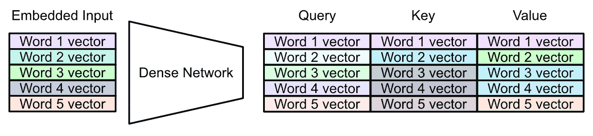

将输入转换为查询、键和值。查询、键和值都与输入具有相同的维度，可以将其视为输入的几种不同表示。[关于我的关于 Transformer 的文章](https://medium.com/towards-data-science/transformers-intuitively-and-exhaustively-explained-58a5c5df8dbb)

查询和键相乘。因此，每个词的某种表示与每个其他词的表示相结合。

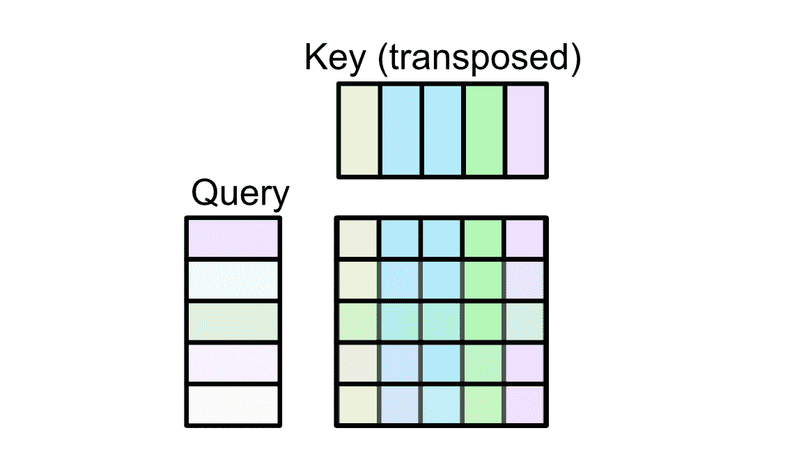

使用查询和键计算注意力矩阵。然后，结合值使用注意力矩阵生成注意力机制的最终输出。[来自我的关于 Transformer 的文章](https://medium.com/towards-data-science/transformers-intuitively-and-exhaustively-explained-58a5c5df8dbb)

然后，将值乘以查询和键的这种抽象组合，构建多头自注意力的最终输出。

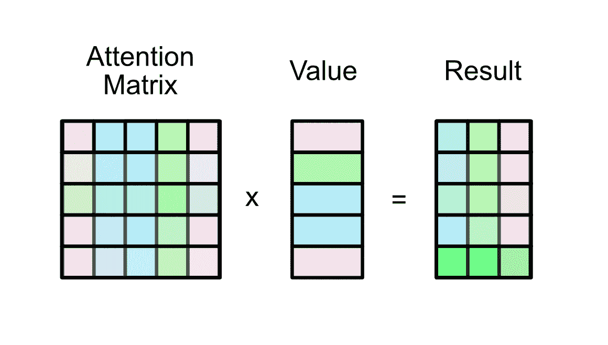

注意力矩阵（即查询和键的矩阵乘积）乘以值矩阵以产生注意力机制的最终结果。由于注意力矩阵的形状，结果与值矩阵具有相同的形状。注意，我跳过了一些非常关键的步骤。[关于我的关于 Transformer 的文章](https://medium.com/towards-data-science/transformers-intuitively-and-exhaustively-explained-58a5c5df8dbb)

编码器使用多头自注意力来创建输入的抽象表示，解码器使用多头自注意力来创建输出的抽象表示。

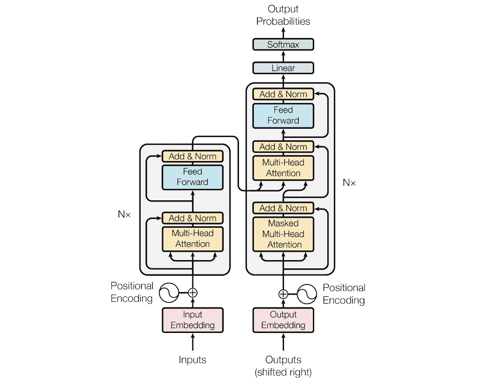

Transformer 架构，左侧是编码器，右侧是解码器。[图片来源](https://arxiv.org/pdf/1706.03762v2.pdf)


回想一下，本质上这是 Transformer 所做的事情。

这就是对变压器的快速概述。我试图涵盖要点，而不深入细节，如果您想了解更多信息，请随时参考我的[关于变压器的文章](https://medium.com/towards-data-science/transformers-intuitively-and-exhaustively-explained-58a5c5df8dbb)。

虽然最初的变压器是为了英语到法语翻译而创建的，但从抽象意义上讲，解决魔方的过程与这个过程有些相似。我们有一些输入（一个打乱的魔方，与一个法语句子），我们需要根据这个输入预测一些序列（一系列移动，与一系列英语单词）。

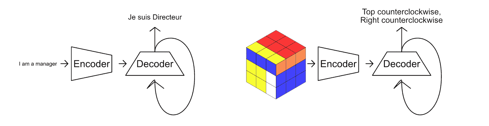

变压器最初是为英语到法语翻译设计的（左），我们现在用它来解决魔方（右）。

我们不需要对变压器的根本结构进行任何修改，就可以让它解决魔方。我们只需要将魔方和移动正确地格式化为变压器可以理解的形式。我们将在接下来的章节中介绍这一点。

### 定义魔方和移动

最初，我认为将魔方定义为 3x3x3 矩阵的段，每个段都有一些面，这些面都有一些颜色。

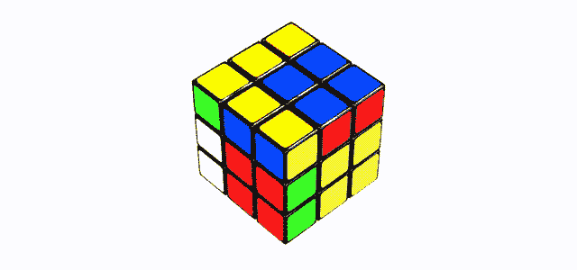

魔方可以被视为一种数据结构。魔方本身由段组成，每个段都有一些带有颜色的贴纸。

这完全可能，但我是数据科学家，我的 3D 空间编程已经有一段时间没有见到阳光了。经过一番思考，我决定采用一种创造性和可能更优雅的方法：将魔方表示为一个 5x5x5 张量，而不是 3x3x3 段的立方体。

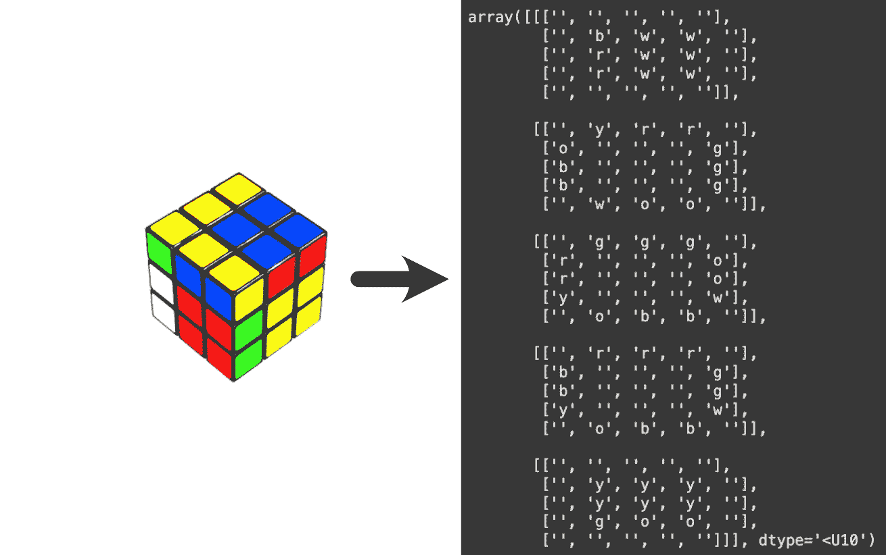

将魔方表示为一个 5x5x5 张量，而不是 3x3x3 段的立方体。本质上，我们正在跟踪所有贴纸在空中的位置。注意，右边的张量并不代表与左边相同的魔方，所以不要试图调和这两个张量。

核心思想是，从技术角度讲，我们实际上并不关心立方体。相反，我们关心的是贴纸以及它们相对于彼此的位置。因此，我们不需要一个由复杂段组成、必须遵守复杂规则的 3x3x3 数据结构，我们只需将这个立方体放入一个 5x5x5 网格中，并跟踪贴纸颜色在这个空间中的位置。

当我们旋转一个“面”时，我们只需要旋转 5x5x5 网格中对应于该面上贴纸以及相应边缘的所有空间。

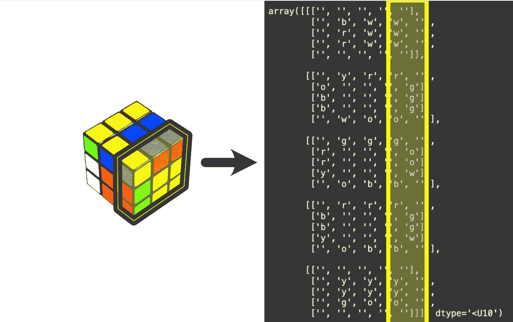

在我们的 5x5x5 张量中旋转一个面，意味着我们只需要交换一些值。这可能需要一点思考，但比实际定义一个魔方作为许多小段，然后让它们彼此友好地互动要容易得多。

一个魔方可以应用 12 个基本旋转。我们可以旋转前、后、上、下、左和右面（6 个面），并且我们可以顺时针或逆时针旋转每个面 90 度。

当我们打乱一个立方体时，我们应用了一些这些旋转，然后要解决魔方，一个人可以简单地反转移动的顺序和方向。

这里有一个定义魔方及其移动以及一个简洁的可视化类的例子：

```py
"""Defining the Rubik's Cube
"""
import matplotlib.pyplot as plt
from mpl_toolkits.mplot3d import Axes3D
import numpy as np
from matplotlib.patches import Polygon
from mpl_toolkits.mplot3d.art3d import Poly3DCollection

class RubiksCube:
    def __init__(self):
        # Initialize a 3D tensor to represent the Rubik's Cube
        self.cube = np.empty((5, 5, 5), dtype='U10')
        self.cube[:, :, :] = ''

        # Initialize sticker colors
        self.cube[0, 1:-1, 1:-1] = 'w'  # Top (white)
        self.cube[1:-1, 0, 1:-1] = 'g'  # Front (green)
        self.cube[1:-1, 1:-1, 0] = 'r'  # Left (red)
        self.cube[-1, 1:-1, 1:-1] = 'y' # Bottom (yellow)
        self.cube[1:-1, -1, 1:-1] = 'b' # Back (blue)
        self.cube[1:-1, 1:-1, -1] = 'o' # Right (orange)

    def print_cube(self):
        print(self.cube)

    def rotate_face(self, face, reverse=False):
        """
        Rotates a given face of the cube 90 degrees.

        Parameters:
            face (str): One of ['top', 'front', 'left', 'bottom', 'back', 'right']
            reverse (bool): if the rotation should be reversed
        """
        # maps a face to the section of the tensor which needs to be rotated
        rot_map = {
            'top': (slice(0, 2), slice(0, 5), slice(0, 5)),
            'left': (slice(0, 5), slice(0, 2), slice(0, 5)),
            'front': (slice(0, 5), slice(0, 5), slice(0, 2)),
            'bottom': (slice(3, 5), slice(0, 5), slice(0, 5)),
            'right': (slice(0, 5), slice(3, 5), slice(0, 5)),
            'back': (slice(0, 5), slice(0, 5), slice(3, 5))
        }

        # getting all of the stickers that will be rotating
        rotating_slice = self.cube[rot_map[face]]

        # getting the axis of rotation
        axis_of_rotation = np.argmin(rotating_slice.shape)

        # rotating about axis of rotation
        axes_of_non_rotation = [0,1,2]
        axes_of_non_rotation.remove(axis_of_rotation)
        axes_of_non_rotation = tuple(axes_of_non_rotation)
        direction = 1 if reverse else -1
        rotated_slice = np.rot90(rotating_slice, k=direction, axes=axes_of_non_rotation)

        # overwriting cube
        self.cube[rot_map[face]] = rotated_slice

    def _rotate_cube_180(self):
        """
        Rotate the entire cube 180 degrees by flipping and transposing
        this is used for visualization
        """
        # Rotate the cube 180 degrees
        rotated_cube = np.rot90(self.cube, k=2, axes=(0,1))
        rotated_cube = np.rot90(rotated_cube, k=1, axes=(1,2))
        return rotated_cube

    def visualize_opposite_corners(self):
        """
        Visualize the Rubik's Cube from two truly opposite corners
        """
        # Create a new figure with two subplots
        fig = plt.figure(figsize=(20, 10))

        # Color mapping
        color_map = {
            'w': 'white',
            'g': 'green',
            'r': 'red',
            'y': 'yellow',
            'b': 'blue',
            'o': 'orange'
        }

        # Cubes to visualize: original and 180-degree rotated
        cubes_to_render = [
            {
                'cube_data': self.cube,
                'title': 'View 1'
            },
            {
                'cube_data': self._rotate_cube_180(),
                'title': 'View 2'
            }
        ]

        # Create subplots for each view
        for i, cube_info in enumerate(cubes_to_render, 1):
            ax = fig.add_subplot(1, 2, i, projection='3d')

            ax.view_init(elev=-150, azim=45, vertical_axis='x')

            # Iterate through the cube and plot non-empty stickers
            cube_data = cube_info['cube_data']
            for x in range(cube_data.shape[0]):
                for y in range(cube_data.shape[1]):
                    for z in range(cube_data.shape[2]):
                        # Only plot if there's a color
                        if cube_data[x, y, z] != '':
                            color = color_map.get(cube_data[x, y, z], 'gray')

                            # Define the 8 vertices of the small cube
                            vertices = [
                                [x, y, z], [x+1, y, z],
                                [x+1, y+1, z], [x, y+1, z],
                                [x, y, z+1], [x+1, y, z+1],
                                [x+1, y+1, z+1], [x, y+1, z+1]
                            ]

                            # Define the faces of the cube
                            faces = [
                                [vertices[0], vertices[1], vertices[2], vertices[3]],  # bottom
                                [vertices[4], vertices[5], vertices[6], vertices[7]],  # top
                                [vertices[0], vertices[1], vertices[5], vertices[4]],  # front
                                [vertices[2], vertices[3], vertices[7], vertices[6]],  # back
                                [vertices[1], vertices[2], vertices[6], vertices[5]],  # right
                                [vertices[0], vertices[3], vertices[7], vertices[4]]   # left
                            ]

                            # Plot each face
                            for face in faces:
                                poly = Poly3DCollection([face], alpha=1, edgecolor='black')
                                poly.set_color(color)
                                poly.set_edgecolor('black')
                                ax.add_collection3d(poly)

            # Set axis limits and equal aspect ratio
            ax.set_xlim(0, 5)
            ax.set_ylim(0, 5)
            ax.set_zlim(0, 5)
            ax.set_box_aspect((1, 1, 1))

            # Remove axis labels and ticks
            ax.set_xticks([])
            ax.set_yticks([])
            ax.set_zticks([])
            ax.set_xlabel('')
            ax.set_ylabel('')
            ax.set_zlabel('')
            ax.set_title(cube_info['title'])

        plt.tight_layout()
        plt.show()

# Example usage
cube = RubiksCube()

# Rotate a face to show some variation
cube.rotate_face('bottom', reverse=False)

# Visualize from opposite corners
cube.visualize_opposite_corners()
```

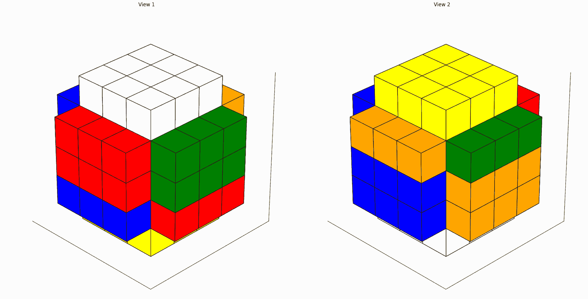

创建一个立方体，旋转一个面，并渲染该立方体的可视化。你可以想象视图 1 是主视图，视图 2 是从翻转魔方并查看对角线另一端得到的视图。它们共同代表一个单一的魔方。

我们可以通过简单地执行几个随机移动来打乱我们的魔方。

```py
"""Scrambling a Rubik's Cube
"""
from itertools import product
import random

#Defining Possible Moves
faces = ['top', 'left', 'front', 'bottom', 'right', 'back']
possible_moves = tuple(product(faces, [False, True]))

def scramble(cube, n=20):
    moves = []
    for _ in range(n):
        #selecting a random move
        selected_move = random.choice(possible_moves)
        moves.append(selected_move)

        # Rotate a face to show some variation
        cube.rotate_face(selected_move[0], reverse=selected_move[1])
    return moves

#creating a cube
cube = RubiksCube()

#shuffling
moves = scramble(cube)
print(moves)

# Visualize from opposite corners
cube.visualize_opposite_corners()
```

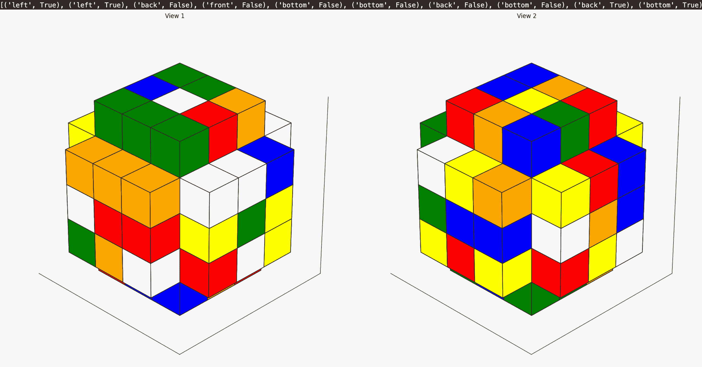

一个打乱顺序的魔方示例

并且，为了解决这个魔方，我们可以简单地反转移动的顺序，并反转它们的旋转方向。

```py
"""unscrambling by reversing moves and direction
"""

#reversing order of moves
moves.reverse()

for i in range(20):
    #selecting a random move
    selected_move = moves[i]

    # Rotate a face in the opposite direction
    cube.rotate_face(selected_move[0], reverse=not selected_move[1])

# Visualize from opposite corners
cube.visualize_opposite_corners()
```

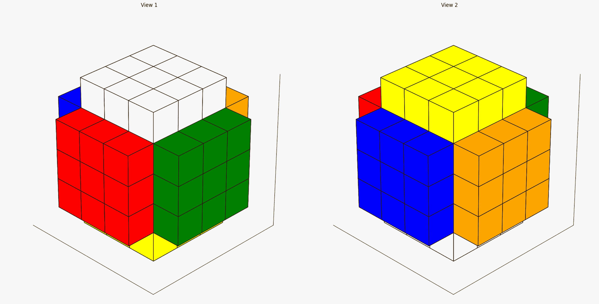

通过反转移动的顺序和方向来解乱魔方的结果

使用此代码，我们可以生成一个由打乱顺序的魔方及其解决方案组成的合成数据集。

```py
"""Parallelized code that generates 2M scrambled Rubik's Cubes,
and keeps track of the cube (X) and the moves to unscramble it (y)
"""

import random
from multiprocessing import Pool, cpu_count
from functools import partial

def generate_sample(max_scramble, _):
    """
    Generates a single sample (X, y) for the Rubik's Cube task.
    """
    num_moves = random.randint(1, max_scramble)

    # Initializing a cube and scrambling it
    cube = RubiksCube()
    moves = scramble(cube, n=num_moves)

    # Reversing moves, which is the solution
    moves.reverse()
    moves = [(m[0], not m[1]) for m in moves]

    # Turning into modeling data
    x = tokenize(cube.cube)
    y = [0] + [move_to_output_index(m) + 3 for m in moves] + [1]

    # Padding with 2s so the sequence length is always 22
    y.extend([2] * (22 - len(y)))

    return x, y

def parallel_generate_samples(num_samples, max_scramble, num_workers=None):
    """
    Parallelizes the generation of Rubik's Cube samples.
    """
    num_workers = num_workers or cpu_count()

    # Use functools.partial to "lock in" the max_scramble parameter
    generate_sample_partial = partial(generate_sample, max_scramble)

    with Pool(processes=num_workers) as pool:
        results = pool.map(generate_sample_partial, range(num_samples))

    # Unpack results into X and y
    X, y = zip(*results)
    return list(X), list(y)

num_samples = 2_000_000
max_scramble = 20

# Generate data in parallel
X, y = parallel_generate_samples(num_samples, max_scramble)
```

在这段代码中，`X`是我们将传递到模型中的东西（打乱后的魔方），而`y`将是我们要尝试预测的东西（解决它的操作序列）。

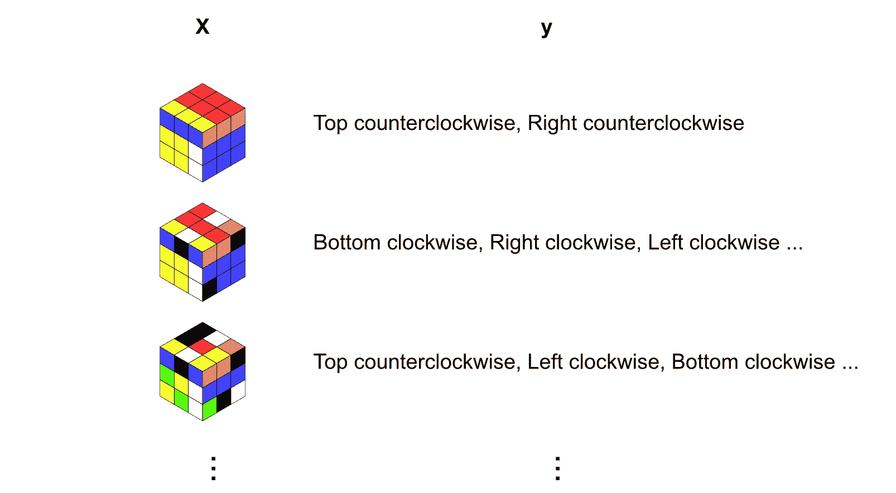

在数据科学中，通常将模型的输入标记为 X，将期望的输出标记为 y。我们的数据集包含两百万个打乱后的魔方示例（X）及其相应的解决方案（y）

我使用了两个辅助函数，`tokenize`和`move_to_output_index`，来帮助我将魔方和移动列表转换成更适合建模的表示形式。我认为没有必要详细说明实现过程（请随意[参考代码](https://github.com/DanielWarfield1/MLWritingAndResearch/blob/main/RubiksCubeAI.ipynb))，但从高层次上讲：

+   `tokenize`函数接受一个由贴纸颜色和空格组成的 5x5x5 张量，并输出一个 54×4 张量。这个 54×4 张量包含魔方中所有 54 个贴纸的向量，每个向量包含特定贴纸的`(颜色, x 位置, y 位置, z 位置)`。它忽略了 5x5x5 张量中的所有空格。

+   `move_to_output_index`函数简单地将一个移动，如`(顶部，顺时针)`转换为一个数字。所有 12 种移动都被分配了一个唯一的数字。我们在代码中添加数字 3 的原因将在我们讨论 transformer 模型解码器部分的输入和输出时变得明显。

因此，transformer 的输入是一个包含 54 个向量的列表，这些向量由`(颜色, x 位置, y 位置, z 位置)`组成，而 transformer 的输出是一个数字列表，每个数字对应于 12 种移动中的一种。

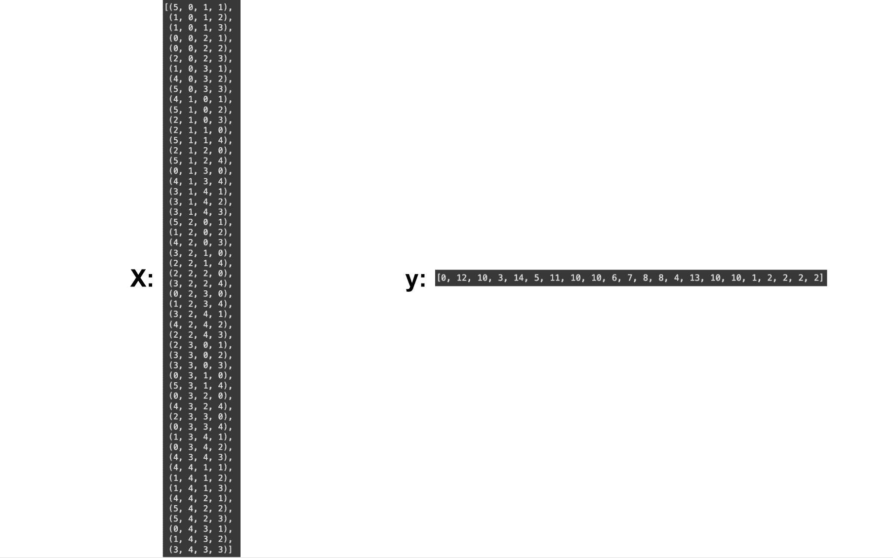

重新格式化后，单个 X/y 对看起来像这样。

这种数据格式的小幅调整在概念上影响不大，但在我们将模型应用于这些数据时将非常有用。

现在我们已经构建了我们的打乱后的魔方和解决它们的移动序列的数据集，我们可以着手将这些数据输入到 transformer 中。这是通过一个称为嵌入的过程来完成的。

## 嵌入

在自然语言环境中创建 transformer 时，你首先创建一个词汇表，其中包含模型将理解的单词（或单词片段）。然后，将模型词汇表中的所有单词转换为向量。当模型接收到一个单词输入序列时，它可以通过对代表单词的向量进行数学运算来“思考”这个序列。

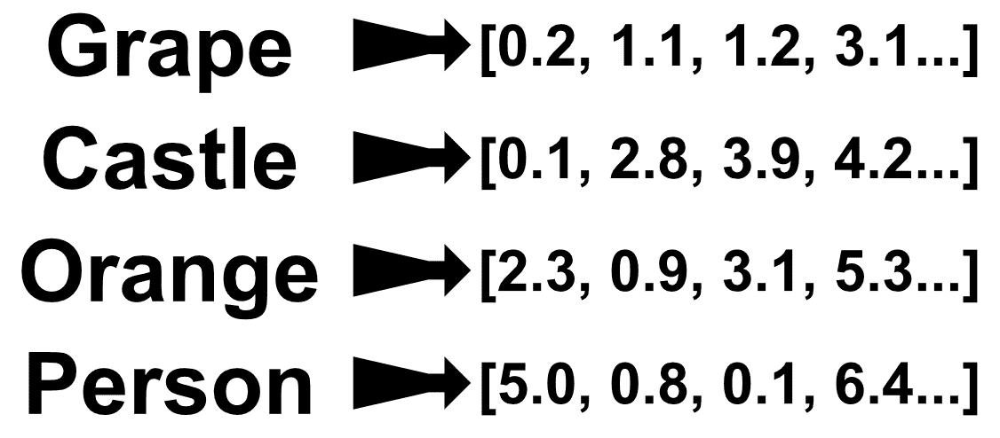

单词到向量嵌入器的工作：将单词转换为数字，以便语言模型可以对其进行分析。[我的关于变换器的文章](https://medium.com/towards-data-science/transformers-intuitively-and-exhaustively-explained-58a5c5df8dbb)。

我们可以对魔方做类似的事情，我们可以将魔方的“词汇”视为六个标记，每个标记对应一个彩色贴纸。然后我们可以为这些颜色中的每一个分配一个代表它的随机向量。

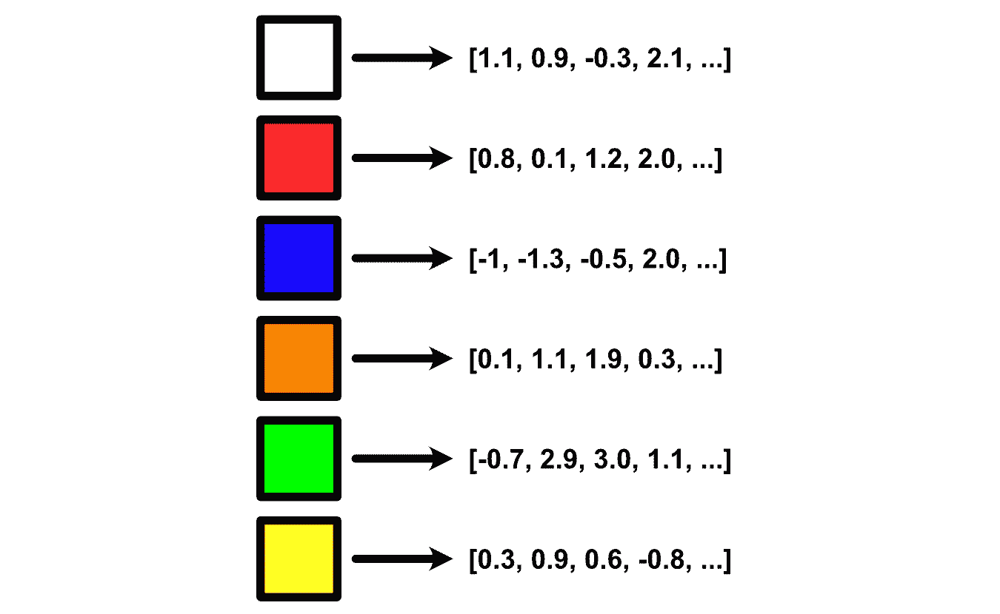

我们可以为魔方的每种颜色分配一些随机的数字向量。这些向量将用于让我们的模型推理贴纸以及它们之间的关系。最初，这些向量中的值将随机定义，但它们将通过训练过程根据模型的需求进行更新，从而使模型能够提出自己关于颜色的表示。

当我们想要将魔方作为编码器的输入时，我们可以遍历魔方上的所有贴纸，每次遇到一个贴纸，我们都可以查找对应颜色的向量并将其添加到序列中。


回想一下，我们将魔方重新表示为向量列表，其中每个向量中的第一个元素对应一个贴纸的颜色。如果我们遍历这个列表，并查找每种颜色的对应向量，我们就可以有效地将魔方转换为向量序列。

变换器在各种应用中变得非常流行，从计算机视觉到音频合成，再到视频生成。结果证明，“将你拥有的任何数据表示为向量列表，然后将其投入变换器”是一种相当好的通用策略。

然而，在我们将这个向量序列放入变换器之前，我们还需要一个额外的信息：位置。

## 位置编码

每次我们将魔方转换为向量序列时，无论是训练模型还是尝试预测解决方案，我们都会以相同的顺序将魔方的贴纸转换为向量。这意味着嵌入序列中的每个位置都将始终对应魔方中的相同位置。

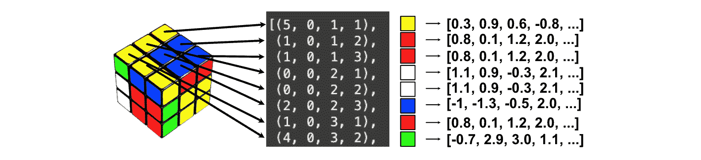

如果我们使用定义良好且一致的代码，那么我们向量列表中的第一个索引将始终代表我们魔方中的同一位置。同样，第二个、第三个、第四个以及所有其他向量都将始终代表魔方中相同的同一位置。注意，这个特定魔方的颜色与显示的向量列表不对应，这个图是为了概念演示。

一些建模策略，如卷积和密集网络，擅长学习利用这种一致性。它们可以学习“这个位置对应这个贴纸，那个位置对应那个贴纸”，因此不需要在输入中添加任何关于位置的信息。

与此相反，Transformer 风格的模型以容易丢失输入顺序而闻名。为了创建它们的抽象和意义丰富的表示，它们将输入混合和扭曲得如此之甚，以至于位置信息（如“这个向量在另一个向量之前”）很快就会丢失。因此，当使用 Transformer 时，通常使用位置编码。

想法是将关于每个贴纸在魔方中位置的某些信息添加到代表该贴纸颜色的向量中。这将允许模型将关于位置和颜色的显式信息注入到代表每个贴纸的值中，这意味着它可以对该贴纸的位置和颜色进行推理。

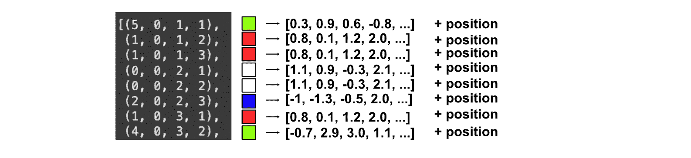

想法是在向量的值本身中添加一些位置信息，使得向量的值可以代表贴纸的颜色和位置。

我们将使用一个非常类似于前一小节中描述的方法的查找表。在前一小节中，我们为每种颜色分配了一个随机向量。


回想一下，我们通过为每种贴纸颜色创建一个查找表来编码贴纸颜色，该查找表对应某个随机向量。

为了编码位置，我们还将为向量空间中的每个 X、Y 和 Z 位置分配一个随机向量，该空间是一个 5x5x5 的空间。

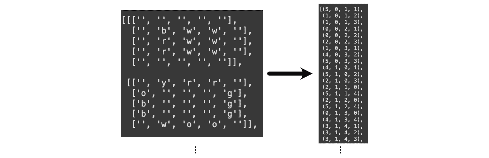

回想一下，我们将魔方转换为一个向量列表，对应于每个贴纸的颜色和 X、Y、Z 位置。

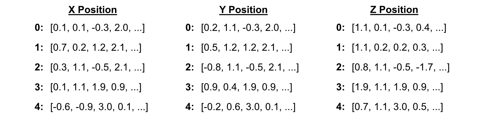

每个轴上的五个可能位置都可以分配一个随机向量

对于每个贴纸，我们可以将沿 X、Y 和 Z 轴的贴纸向量添加到表示贴纸颜色的向量中，从而使用单个向量表示每个贴纸的颜色和位置。

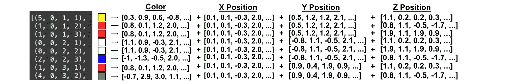

如果我们将颜色、X、Y 和 Z 位置的向量相加，我们可以创建一个向量列表，代表魔方中的所有贴纸。

这里是一个实现模型嵌入魔方贴纸颜色并应用位置编码的示例：

```py
import torch
import torch.nn as nn

class EncoderEmbedding(nn.Module):
    def __init__(self, vocab_size=6, pos_i_size=5, pos_j_size=5, pos_k_size=5, embedding_dim=128):
        super(EncoderEmbedding, self).__init__()

        # Learnable embeddings for each component
        self.vocab_embedding = nn.Embedding(vocab_size, embedding_dim)
        self.pos_i_embedding = nn.Embedding(pos_i_size, embedding_dim)
        self.pos_j_embedding = nn.Embedding(pos_j_size, embedding_dim)
        self.pos_k_embedding = nn.Embedding(pos_k_size, embedding_dim)

    def forward(self, X):
        """
        Args:
            X (torch.Tensor): Input tensor of shape (batch_size, seq_len, 4)
                where X[..., 0] = vocab indices (0-5)
                      X[..., 1] = position i (0-4)
                      X[..., 2] = position j (0-4)
                      X[..., 3] = position k (0-4)
        Returns:
            torch.Tensor: Output tensor of shape (batch_size, seq_len, embedding_dim)
        """
        # Split the input into components
        vocab_idx = X[..., 0]
        pos_i_idx = X[..., 1]
        pos_j_idx = X[..., 2]
        pos_k_idx = X[..., 3]

        # Look up embeddings
        vocab_embed = self.vocab_embedding(vocab_idx)
        pos_i_embed = self.pos_i_embedding(pos_i_idx)
        pos_j_embed = self.pos_j_embedding(pos_j_idx)
        pos_k_embed = self.pos_k_embedding(pos_k_idx)

        # Sum the embeddings
        final_embedding = vocab_embed + pos_i_embed + pos_j_embed + pos_k_embed
        return final_embedding

embedding_dim = 128

# Initialize the input embedding module
encoder_embedding = EncoderEmbedding(embedding_dim=embedding_dim)

# Get the final embeddings
embedded_encoder_input = encoder_embedding(X[:10])
print("Input shape:", X[:10].shape)
print("Output shape:", embedded_encoder_input.shape)
```


在这个特定的例子中，输入是一个包含 10 个魔方的批次。每个魔方有 54 个贴纸，这些贴纸被描述为一个 4 值向量：贴纸的颜色、x 位置、y 位置和 z 位置。`encoder_embedding`查找代表贴纸颜色和位置的四个向量，并将它们全部相加。因此，输出是一个包含 10 个魔方的批次，现在这些魔方被表示为 54 个独特的向量，其中每个向量包含描述贴纸颜色和位置的值。128 代表`model_dimension`，这是一个任意数字，定义了表示输入元素的向量的长度。大型变换器（如 OpenAI 的 GPT 模型）使用长度为数百甚至数千的向量。较大的模型维度可以使输入的复杂表示更加复杂，但这会带来计算负载的增加。我选择了相对较小的模型维度，但仍然足够大，以便模型能够思考问题。这个参数当然可以进行调整。

当我们创建一个新的模型时，我们将使用完全随机的向量来表示贴纸的颜色以及这些贴纸的位置。自然地，这种随机信息一开始可能对模型来说非常难以理解。我们的想法是，在整个训练过程中，这些随机向量将更新，以便模型学会创建它理解的贴纸颜色和位置的向量。

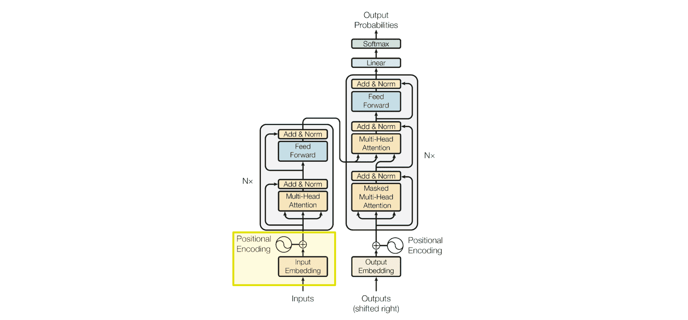

我们刚刚在更大的变换器架构中实现了输入嵌入和位置编码

因此，我们将魔方转换成了一个变换器可以理解的向量列表。我们还需要对模型想要输出的移动序列执行一个类似的过程，但在我们这样做之前，我想讨论一下解码器的一些复杂性。


[加入 IAEE](https://iaee.substack.com/)

## 解码器的输入和输出

回想一下，当变换器输出一个序列时，它是“自回归地”输出的，这意味着当你将一些序列放入解码器时，解码器将输出一个预测，即它认为下一个标记应该是什么。然后，这个新标记可以被反馈到解码器的输入中，允许变换器逐个标记地生成序列。


回想一下自回归生成的通用过程。解码器在输出循环的每一轮都参考编码后的输入。解码器通过将之前的输出作为输入，并预测它认为应该出现的下一个标记来生成整个序列。参见[我的关于转换器的文章](https://medium.com/towards-data-science/transformers-intuitively-and-exhaustively-explained-58a5c5df8dbb)

转换器的一个定义特征是它们的训练方式。旧式的模型通常一次只训练一个标记。你会将一个序列输入到模型中，预测一个标记，然后根据预测是正确还是错误来更新模型。这是一个极其缓慢且计算成本高昂的过程，严重限制了旧式模型在应用于序列时的应用。

当训练一个转换器时，另一方面，你输入你想要的整个序列，然后转换器预测每个输入的所有标记，就像未来的标记不存在一样。

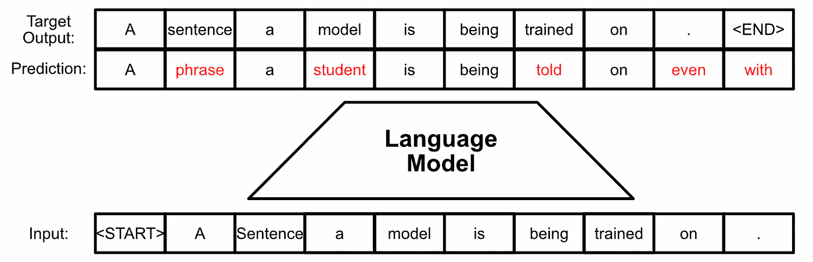

转换器的解码器是如何训练的。它不是逐个训练单词，而是给出它应该输出的整个单词序列，并要求它同时预测所有下一个单词。解码器使用“掩码”多头自注意力的原因是防止模型简单地复制未来的单词来生成输出。在这个例子中，当预测“trained”之后的单词时，模型只能看到序列“ A Sentence a model is being trained”，并要求预测下一个单词是“on”。参见我关于[推测采样](https://medium.com/towards-data-science/speculative-sampling-intuitively-and-exhaustively-explained-2daca347dbb9)的文章

因此，它同时预测第一个位置的下个标记，第二个位置的下个标记，第三个位置的下个标记，等等。

我在我的[关于 Transformer 的文章](https://medium.com/towards-data-science/transformers-intuitively-and-exhaustively-explained-58a5c5df8dbb)中更深入地讨论了这一点，并在我的[关于投机抽样的文章](https://medium.com/towards-data-science/speculative-sampling-intuitively-and-exhaustively-explained-2daca347dbb9)中探讨了如何利用 Transformer 的这个特性产生有趣的效果。然而，目前我们已经有足够的高层次理论来讨论实现解码器的嵌入和位置编码。

## 对解决方案序列进行标记化、嵌入和位置编码

如前所述，在训练我们的模型时，我们需要将我们想要的序列输入到解码器中，然后解码器将预测序列中的所有后续移动，就像未来的移动不存在一样。

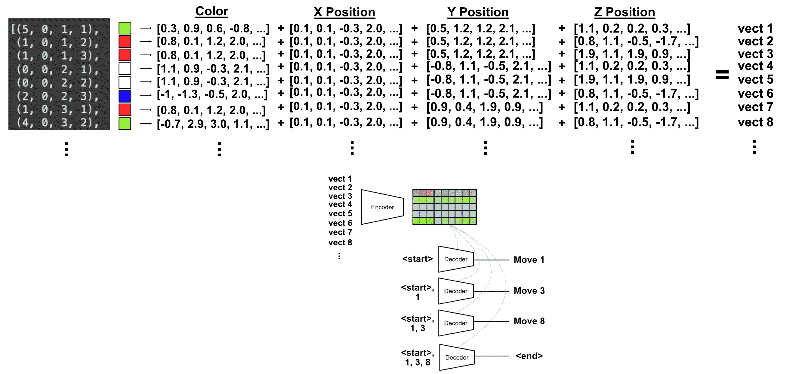

训练流程的分解。我们的魔方被表示为一系列向量，这些向量代表每个贴纸的颜色和位置，这些信息被传递给编码器。解码器使用编码后的输入来生成移动预测

就像编码器的输入一样，解码器的输入也将以向量序列的形式出现。

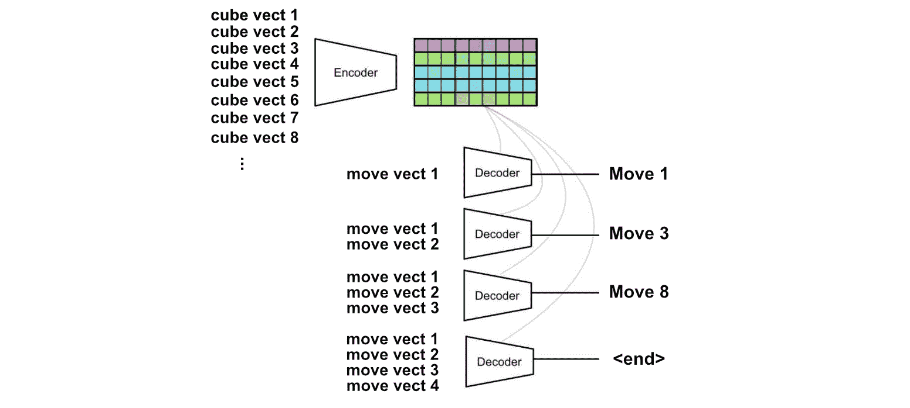

编码器的输入与解码器的输入类似：都是一系列向量。然而，编码器的向量代表贴纸，而解码器的向量代表移动。

创建这些向量的过程与我们嵌入和位置编码魔方的过程类似。有 12 种可能的移动（两个方向的 6 个面），这意味着每种移动都可以用 12 个向量的列表来表示。

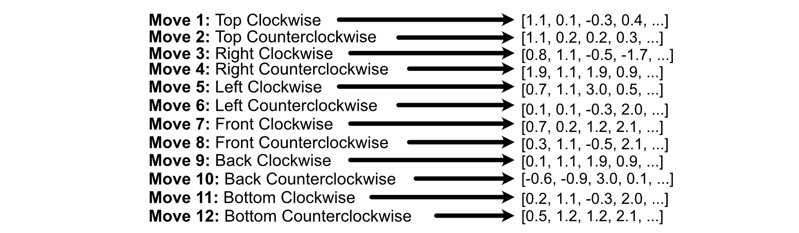

我们可以创建一个“词汇表”来表示移动。我们可以为每个移动分配一些向量。当我们想要将一系列移动输入到解码器时，我们将通过向解码器提供这些向量的列表来实现。

这些移动可以通过为序列中的每个位置创建一个向量来进行位置编码。

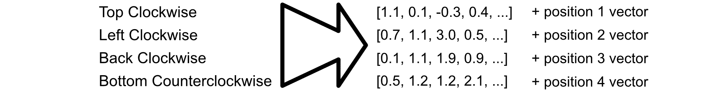

当将移动序列转换为向量序列时，我们需要为每个位置添加一个向量来编码位置，就像我们在定义魔方位置编码时做的那样。为了对序列进行位置编码，我们需要为序列中的每个可能元素提供一个向量。

显然，解决魔方所需的最大移动次数是 20 次（不要问我他们是如何得出这个结论的），因此我们可以假设我们模型的输出序列的最大长度为 20，再加上两个“效用标记”的空间。

效用标记是一个特殊的标记，在最终输出中并不重要，但在建模方面很有用。例如，对于模型来说，有一个方式来说明它已经完成了输出生成是有用的。这是一个常见的标记，称为“序列结束”，通常缩写为`<EOS>`标记。

此外，回想一下解码器是如何根据输入标记预测所有下一个标记的，这意味着我们需要输入一些标记来获取第一个预测。在序列前添加一个“序列开始”（`<SOS>`）标记是一种常见的做法，它为模型的第一预测留出空间。

我们还将使用一个填充（`<PAD>`）标记。基本上，变压器底层的所有数学运算都使用矩阵，这需要一定的统一形状。因此，如果我们有一些短的移动序列和一些长的移动序列，它们都需要适应同一个矩阵。我们可以通过“填充”所有短的序列，直到它们的长度与最长的序列相同来实现这一点。

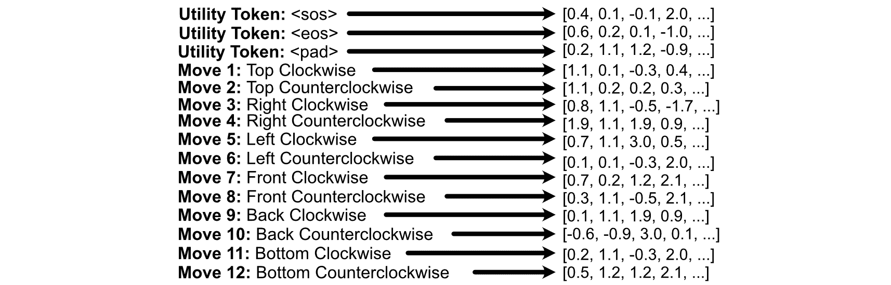

我们模型的“词汇表”实际上有 15 个元素：12 个移动和三个效用标记。

因此，解码器的“词汇表”将包括我们的 12 个可能的移动，以及序列开始（`<SOS>`）、序列结束（`<EOS>`）和填充（`<PAD>`）标记。总序列长度将是 22，因为解决任何魔方所需的最大移动次数是 20（再次，我不知道为什么），并且我们需要为最长的序列中的（`<SOS>`）和（`<EOS>`）标记留出空间。

现在我们已经想好了标记，并且知道了序列的长度，我们就可以初始化 15 个随机的向量用于标记嵌入，以及为序列中的每个位置初始化 22 个随机的向量。当我们接收一些序列用于训练或进行预测时，我们可以使用这些向量来表示所有移动的值和位置。


动作向量将是动作的值加上动作在序列中的位置值。

让我们继续实现解码器嵌入。首先，我们的数据已经内置了我们的效用标记。回想一下，我们使用这段代码来生成数据集的 y 部分

```py
y = [0] + [move_to_output_index(m) + 3 for m in moves] + [1]

# Padding with 2s so the sequence length is always 22
y.extend([2] * (22 - len(y)))
```

在这里，我们将每个动作转换为 3 到 14 之间的整数，使用表达式`move_to_output_index(m) + 3`（这会将表示我们可能动作的数字 0 到 11 加上 3）。然后，它在序列的开始和结束处添加`0`和`1`，并在末尾附加一个`2`的列表，直到整个序列长度为 22。

因此：

+   `0`代表序列开始`<sos>`

+   `1`代表序列结束`<eos>`

+   `2`代表填充`<pad>`

+   `3` – `14`代表我们的可能动作

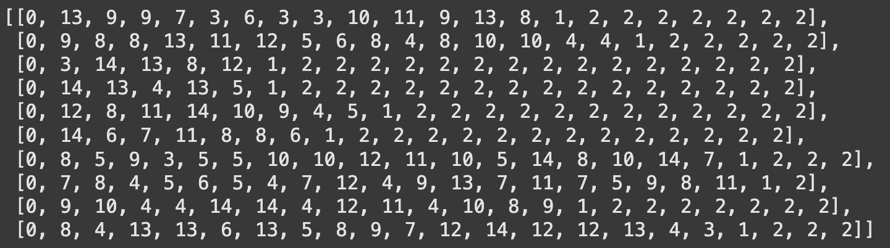

在 y 中，10 个解决方案序列批次的外观。它们都以(0)开始，然后进行一些动作（3–14），然后在(1)中，剩余的空间被(2)填充。

因此，我们可以如下实现动作序列的嵌入和位置编码：

```py
class DecoderEmbedding(nn.Module):
    def __init__(self, vocab_size=15, pos_size=22, embedding_dim=128):
        super(DecoderEmbedding, self).__init__()

        # Learnable embeddings for each component
        self.vocab_embedding = nn.Embedding(vocab_size, embedding_dim)
        self.pos_embedding = nn.Embedding(pos_size, embedding_dim)

    def forward(self, X):
        """
        Args:
            X (torch.Tensor): Input tensor of shape (batch_size, seq_len), where each element
                              corresponds to a token index.

        Returns:
            torch.Tensor: Output tensor of shape (batch_size, seq_len, embedding_dim)
        """
        # Token embeddings (based on vocab indices)
        vocab_embed = self.vocab_embedding(X)

        # Generate position indices based on input shape
        batch_size, seq_len = X.shape
        position_indices = torch.arange(seq_len, device=X.device).unsqueeze(0).expand(batch_size, -1)

        # Position embeddings
        pos_embedding = self.pos_embedding(position_indices)

        # Sum the embeddings
        final_embedding = vocab_embed + pos_embedding
        return final_embedding

embedding_dim = 128

# Initialize the input embedding module
decoder_embedding = DecoderEmbedding(embedding_dim=embedding_dim)

# Get the final embeddings
embedded_decoder_input = decoder_embedding(y[:10])
print("Input shape:", y[:10].shape)
print("Output shape:", embedded_decoder_input.shape)
```


这里，我们正在处理 10 个解决方案序列的批次。这个编码器接受一个由 22 个标记组成的列表，这些标记以我们 15 个整数之一的形式表示，这些整数对应于我们的动作和效用标记词汇表中的 15 个元素，并将这些标记中的每一个转换为向量。它是通过将表示动作值的向量与表示该动作在序列中位置的向量相加来实现的。为了方便起见，以及出于相同的概念原因，`model_dim`的 128 与我们在前一个部分中定义的用于编码魔方的维度相同。

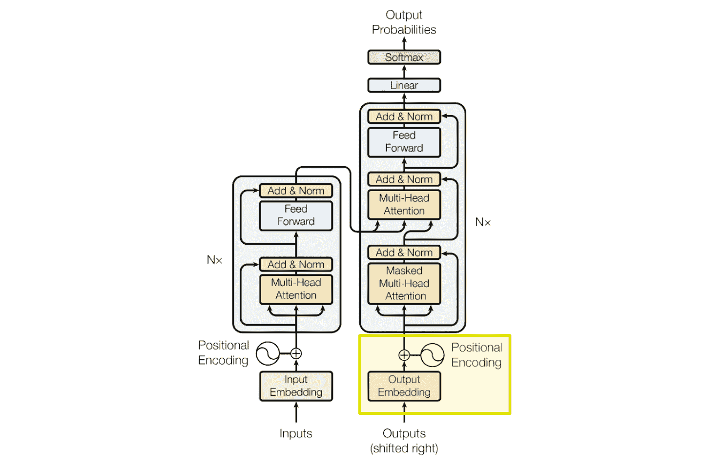

我们刚刚实现了一个嵌入器和位置编码器，用于动作序列。

好的，我们已经找到了如何将魔方和解决它们的移动序列编码成 Transformer 可以理解的方式（一个大的向量列表）。现在我们可以真正开始构建 Transformer 了。

## 实现 Transformer

本文的重点并不是模型本身，而是围绕建模决策的思考过程。我们已经完成了所有的繁重工作。通过将我们的移动转换为 Transformer 可以理解的向量，我们可以使用在无数其他应用中使用的相同标准 Transformer。

到目前为止，我已经在许多不同的文章中介绍了 Transformer 的核心思想。尽管如此，如果不介绍实现 Transformer，这还不能算是“详尽无遗”，所以让我们来做这件事。这将对过程进行相当简短的概述，你可以自由地深入研究参考部分中的一些链接文章，以获得更深入的理解。

### 1) 编码器

我们已经创建了将魔方转换为向量列表的嵌入和位置编码，所以现在我们需要实现模型的编码器部分，该部分负责考虑这种表示并将其转换为抽象但意义丰富的表示。

```py
import torch
import torch.nn as nn

# Define the Transformer Encoder
class TransformerEncoder(nn.Module):
    def __init__(self, num_layers, d_model, num_heads, d_ff, dropout=0.1):
        super(TransformerEncoder, self).__init__()

        # Define a single transformer encoder layer
        encoder_layer = nn.TransformerEncoderLayer(
            d_model=d_model,
            nhead=num_heads,
            dim_feedforward=d_ff,
            dropout=dropout,
            batch_first=True
        )

        # Stack multiple encoder layers
        self.encoder = nn.TransformerEncoder(encoder_layer, num_layers=num_layers)

    def forward(self, src):
        """
        Args:
            src (torch.Tensor): Input tensor of shape (batch_size, seq_len, d_model).
        Returns:
            torch.Tensor: Output tensor of shape (batch_size, seq_len, d_model).
        """
        return self.encoder(src)

# Example usage
num_heads = 8
num_layers = 6
d_ff = 2048
dropout = 0.1

# Initialize the transformer encoder
encoder = TransformerEncoder(num_layers=num_layers, d_model=embedding_dim, num_heads=num_heads, d_ff=d_ff, dropout=dropout)

# Forward pass
encoder_output = encoder(embedded_encoder_input)

print("Encoder output shape:", encoder_output.shape)  # Should be (seq_len, batch_size, d_model)
```


编码器的输出大小与输入相同。我们给它一个包含 10 个魔方块的数据批次，每个魔方块由 128 维向量表示 54 个贴纸，我们得到了相同大小的输出。编码器将这些向量相互交互，给我们一个大小相似但更加抽象和意义丰富的输入。

PyTorch 已经实现了编码器块，所以我们只是使用了那个。

+   `num_heads` 描述了每个多头自注意力块中使用了多少个头（如果你想要了解更多，请参阅[我的关于 Transformer 的文章](https://medium.com/towards-data-science/transformers-intuitively-and-exhaustively-explained-58a5c5df8dbb)）

+   `num_layers` 描述了使用了多少个编码器块（如果你想要了解更多，请参阅[我的关于 Transformer 的文章](https://medium.com/towards-data-science/transformers-intuitively-and-exhaustively-explained-58a5c5df8dbb)）

+   `d_ff` 表示 Transformer 中前馈网络的大小。这通常比 `model_dim` 大得多，因为它允许前馈网络查看模型中的每个向量，将其扩展为几个表示，然后根据这些扩展信息将这些向量缩小回原始大小。

+   `dropout` 是一个正则化参数，它随机隐藏模型中的某些值。`dropout` 是一个常见的技巧，它帮助 AI 模型学习数据中的趋势，而不仅仅是记住数据集中的单个示例。

### 2) 解码器

解码器接收移动序列的嵌入表示，并将其与编码器的输出结合起来，以预测下一个应该发生的移动。

所以，让我们来构建它：

```py
import torch
import torch.nn as nn

class TransformerDecoderLayer(nn.Module):
    def __init__(self, d_model, num_heads, d_ff, dropout=0.1):
        super(TransformerDecoderLayer, self).__init__()

        # Masked Multi-Head Self-Attention
        self.self_attn = nn.MultiheadAttention(embed_dim=d_model, num_heads=num_heads, dropout=dropout, batch_first=True)
        self.self_attn_norm = nn.LayerNorm(d_model)
        self.self_attn_dropout = nn.Dropout(dropout)

        # Masked Multi-Head Cross-Attention
        self.cross_attn = nn.MultiheadAttention(embed_dim=d_model, num_heads=num_heads, dropout=dropout, batch_first=True)
        self.cross_attn_norm = nn.LayerNorm(d_model)
        self.cross_attn_dropout = nn.Dropout(dropout)

        # Point-wise Feed Forward Network
        self.ffn = nn.Sequential(
            nn.Linear(d_model, d_ff),
            nn.ReLU(),
            nn.Linear(d_ff, d_model),
            nn.Dropout(dropout)
        )
        self.ffn_norm = nn.LayerNorm(d_model)
        self.ffn_dropout = nn.Dropout(dropout)

    def forward(self, tgt, memory):
        """
        Args:
            tgt (torch.Tensor): Target sequence of shape (batch_size, tgt_seq_len, d_model).
            memory (torch.Tensor): Encoder output of shape (batch_size, src_seq_len, d_model).

        Returns:
            torch.Tensor: Output tensor of shape (batch_size, tgt_seq_len, d_model).
        """
        tgt_len = tgt.size(1)

        # Generate causal mask for self-attention (causal masking)
        causal_mask = torch.triu(torch.ones(tgt_len, tgt_len, device=tgt.device), diagonal=1).to(torch.bool)

        # Masked Multi-Head Self-Attention
        self_attn_out, _ = self.self_attn(
            tgt, tgt, tgt,
            attn_mask=causal_mask,
        )
        tgt = self.self_attn_norm(tgt + self.self_attn_dropout(self_attn_out))

        # Masked Multi-Head Cross-Attention
        cross_attn_out, _ = self.cross_attn(
            tgt, memory, memory,
        )
        tgt = self.cross_attn_norm(tgt + self.cross_attn_dropout(cross_attn_out))

        # Feed Forward Network
        ffn_out = self.ffn(tgt)
        tgt = self.ffn_norm(tgt + self.ffn_dropout(ffn_out))

        return tgt

class TransformerDecoder(nn.Module):
    def __init__(self, num_layers, d_model, num_heads, d_ff, dropout=0.1):
        super(TransformerDecoder, self).__init__()
        self.layers = nn.ModuleList([
            TransformerDecoderLayer(d_model, num_heads, d_ff, dropout) for _ in range(num_layers)
        ])
        self.norm = nn.LayerNorm(d_model)

    def forward(self, tgt, memory):
        """
        Args:
            tgt (torch.Tensor): Target sequence of shape (batch_size, tgt_seq_len, d_model).
            memory (torch.Tensor): Encoder output of shape (batch_size, src_seq_len, d_model).

        Returns:
            torch.Tensor: Output tensor of shape (batch_size, tgt_seq_len, d_model).
        """
        for layer in self.layers:
            tgt = layer(tgt, memory)
        return self.norm(tgt)

# Example usage
num_heads = 8
num_layers = 6
d_ff = 2048
dropout = 0.1
embedding_dim = 128

# Initialize the transformer decoder
decoder = TransformerDecoder(num_layers=num_layers, d_model=embedding_dim, num_heads=num_heads, d_ff=d_ff, dropout=dropout)

# Example inputs
tgt_seq_len = 22
src_seq_len = 54
batch_size = 10

# Target and memory
tgt = torch.randn(batch_size, tgt_seq_len, embedding_dim)
memory = torch.randn(batch_size, src_seq_len, embedding_dim)

# Forward pass through the decoder
decoder_output = decoder(tgt, memory)

print("Decoder output shape:", decoder_output.shape)  # Expected shape: (batch_size, tgt_seq_len, d_model)
```


在这里，解码器正在接收一个包含 10 个解决方案的批次，每个解决方案有 22 个可能的标记（我们的移动和三个效用标记），这些标记以一个 128 维的向量表示，并且它输出一个相同维度的矩阵。虽然输出的大小与输入相似，但它要抽象得多，意味着更丰富，并允许 Rubik 速拧的表示与之前的移动进行交互。

### 3) 分类头

解码器的输出代表了模型认为应该采取的所有移动，但它这样做的方式是一个包含抽象向量的长列表。分类头的目标是将这些抽象向量中的每一个转换成对应该输出哪个标记的预测（我们的 12 个移动和 3 个效用标记）。我们通过在每个向量上简单地使用一个神经网络来实现这一点，将我们的 128 维向量转换成长度为 15 的向量。然后，我们使用一个称为 SoftMax 的操作将这些 15 个值转换成概率（数值越大表示概率越高）。

换句话说，预测头将所有我们的抽象向量转换成对解决方案序列中每个位置的移动应该发生什么进行预测。

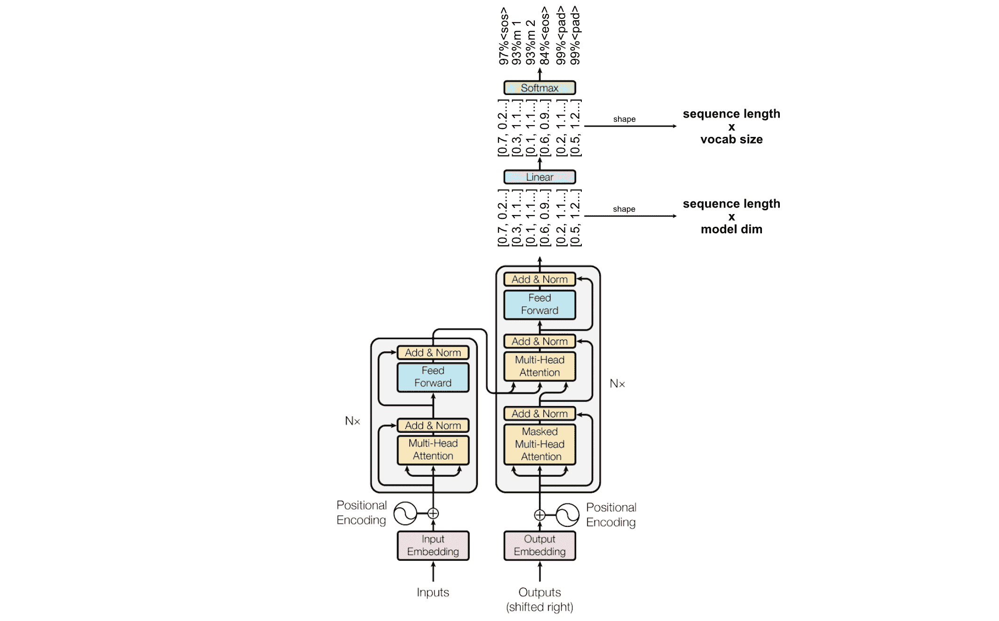

解码器的输出最初是一系列长度为 model_dim 的随机向量。经过线性投影后，所有这些向量都被转换成长度为 vocab_size 的向量。然后，使用 softmax 将其转换为概率预测。

这里是那段代码：

```py
lass ProjHead(nn.Module):
    def __init__(self, d_model=128, num_tokens=15):
        super(ProjHead, self).__init__()
        self.num_tokens = num_tokens

        # Linear layer to project from d_model to num_tokens
        self.fc = nn.Linear(d_model, num_tokens)

        # Softmax activation to convert logits into probabilities
        self.softmax = nn.Softmax(dim=-1)

    def forward(self, logits):
        """
        Args:
            logits (torch.Tensor): Input tensor of shape (batch_size, seq_len, d_model).

        Returns:
            torch.Tensor: Output probabilities of shape (batch_size, seq_len, num_tokens).
        """
        # Project logits through a linear layer
        projected_logits = self.fc(logits)

        # Apply Softmax to convert to probabilities
        probabilities = self.softmax(projected_logits)

        return probabilities

# Initialize the module
logits_to_probs = ProjHead()

# Convert logits to probabilities
probabilities = logits_to_probs(decoder_output)

print("Probabilities shape:", probabilities.shape)  # Expected: (batch_size, seq_len, num_tokens)
print("Sum of probabilities for first token:", probabilities[0, 0].sum().item())  # Should be close to 1.0
```

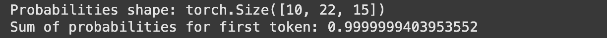

通过解码器传递一批 10 个解决方案序列，每个序列的长度为 22。对于序列中的每个点，预测头都会预测 15 个可能的标记中哪一个最相关，应该是下一个预测。对于单个输出，所有 15 个预测的概率之和为 1（或接近 1，由于舍入误差）。

### 4) 模型

我们创建了：

+   一种将贴纸颜色嵌入并编码魔方上贴纸位置的方法，作为一个向量列表

+   一种将移动嵌入并编码其在解决方案序列中的位置的方法，作为一个向量列表

+   编码器，它接受代表魔方的向量并允许模型将数据转换为密集且意义丰富的表示

+   解码器，它接受之前的移动并基于之前移动的值和魔方的编码表示输出未来应该采取的预测移动

+   一个投影头，它接收解码器的输出并将其转换为某些移动应该被做出的概率预测

现在我们可以将这些内容结合起来，定义实际的模型

```py
class RubiksCubeTransformer(nn.Module):
    def __init__(self, layers_encoder=5, layers_decoder=5, d_model=128):
        super(RubiksCubeTransformer, self).__init__()

        #turns the tokens that go into the encoder and decoder into vectors
        self.encoder_embedding = EncoderEmbedding(embedding_dim=d_model)
        self.decoder_embedding = DecoderEmbedding(embedding_dim=d_model)

        #Defining the Encoder and Decoder
        self.encoder = TransformerEncoder(num_layers=layers_encoder, d_model=d_model, num_heads=4, d_ff=d_model*2, dropout=0.1)
        self.decoder = TransformerDecoder(num_layers=layers_decoder, d_model=d_model, num_heads=4, d_ff=d_model*2, dropout=0.1)

        #Defining the projction head to turn logits into probabilities
        self.projection_head = ProjHead(d_model=d_model, num_tokens=15)

    def forward(self, X, y):

        #embedding both inputs
        X_embed = self.encoder_embedding(X)
        y_embed = self.decoder_embedding(y)

        #encoding rubiks cube representation
        X_encode = self.encoder(X_embed)

        #decoding embedded previous moves cross attended with rubiks cube encoding
        y_decode = self.decoder(y_embed, X_encode)

        #turning logits from the decoder into predictions
        return self.projection_head(y_decode)

model = RubiksCubeTransformer()
model(X[:10], y[:10]).shape
```


模型接收了 10 个魔方批次的输入（X），每个魔方的解决方案（y），并且对每个魔方，预测了它认为应该出现在 22 个输出位置中所有可能位置的 15 个标记之一。

现在我们可以用我们的合成数据集训练这个模型。在我们这样做之前，我想退一步考虑一下我们方法的一些成本和收益。

### 训练策略的微妙之处

在我们开始创建我们的模型之前，我想回顾一下上一节中创建的合成数据集，以及该数据集提出的一些影响。

在这篇文章中，我们计算了一个完全随机的移动序列，使用它来打乱魔方，然后要求模型预测与打乱序列正好相反的序列。这在理论上是很好的，但存在一个实际问题；如果我们碰巧生成了一个这样的随机移动序列：

`<sos>, 前面顺时针，前面逆时针，前面顺时针，前面逆时针，<eos>`

然后，我们不是训练模型预测魔方已经完成（因为它是，这些随机移动只是相互抵消），而是训练模型预测相同的错误步骤集，然后输出魔方已完成。

有很多方法可以解决这个问题。我选择了最简单的方法：忽略它。

变换器，我们使用的模型风格，在自然语言环境中表现出色，这种环境中有很多随机噪声和偶尔的胡言乱语。所以，我们已经知道，即使训练集中有一些质量较差的示例，变换器也擅长学习复杂的序列。

对于我们来说，希望愚蠢的移动会比有效的移动少得多，因此，模型将倾向于学习有效的决策。

所以，基本上，如果一个变换器即使在训练集中偶尔有愚蠢的词语，也擅长学习语言，那么它可能擅长解决魔方，即使它所训练的数据集偶尔有愚蠢的移动。

在一开始就过于乐观地假设这种假设是很容易的。重要的是要记住，在构建人工智能模型时，模型正在尝试学习你训练它去做的事情。不多也不少。我们可以希望模型的本质会优雅地处理我们合成数据集中的怪癖，但只有当我们继续前进，训练并测试我们的模型后，我们才能真正知道我们是否做出了正确的选择。

一般而言，我发现最好的建模策略是那种你认为可能有效且可以快速实施的策略。迭代是复杂机器学习问题中的一个事实。

所以让我们试一试。我们有一个变换器和数据集，让我们训练这个家伙。

## 训练模型

在我实际训练模型之前，我做一些设置工作：

```py
import os
import torch
from torch.utils.data import DataLoader, TensorDataset
import torch.optim as optim

# Define the checkpoint directory
checkpoint_dir = "/content/drive/My Drive/Colab Notebooks/Blogs/RubiksCubeCheckpoints"

# Initialize key variables
batch_losses = []
epoch_iter = 0  # Keeps track of total epochs trained

# User option: Start from scratch or resume from the last checkpoint
start_from_scratch = False  # Set this to True to start training from scratch

if start_from_scratch:
    print("Starting training from scratch...")

    # Check for GPU availability
    device = torch.device("cuda" if torch.cuda.is_available() else "cpu")
    print(f"Using device: {device}")

    # Initialize the model and move it to GPU
    model = RubiksCubeTransformer(layers_encoder=6, layers_decoder=3, d_model=64).to(device)

    # Move data to GPU
    X = X.to(device)
    y = y.to(device)

    # Define dataset and data loader
    batch_size = 16
    dataset = TensorDataset(X, y)
    data_loader = DataLoader(dataset, batch_size=batch_size, shuffle=True)

    # Initialize optimizer
    optimizer = optim.Adam(model.parameters(), lr=1e-5)

else:
    print("Attempting to resume training from the latest checkpoint...")

    # Check for GPU availability
    device = torch.device("cuda" if torch.cuda.is_available() else "cpu")
    print(f"Using device: {device}")

    # Initialize the model and move it to GPU
    model = RubiksCubeTransformer(layers_encoder=6, layers_decoder=3, d_model=64).to(device)

    # Move data to GPU
    X = X.to(device)
    y = y.to(device)

    # Define dataset and data loader
    batch_size = 16
    dataset = TensorDataset(X, y)
    data_loader = DataLoader(dataset, batch_size=batch_size, shuffle=True)

    # Load the latest checkpoint if available
    latest_checkpoint = None
    if os.path.exists(checkpoint_dir):
        print(os.listdir(checkpoint_dir))
        checkpoints = [f for f in os.listdir(checkpoint_dir) if f.endswith(".pt")]
        print(checkpoints)
        if checkpoints:
            checkpoints.sort(key=lambda x: int(x.split('_')[-1].split('.')[0]))  # Sort by epoch
            latest_checkpoint = os.path.join(checkpoint_dir, checkpoints[-1])

    if latest_checkpoint:
        print(f"Loading checkpoint: {latest_checkpoint}")
        checkpoint = torch.load(latest_checkpoint)

        # Load model and optimizer states
        model.load_state_dict(checkpoint['model_state_dict'])

        # Initialize optimizer and load its state
        optimizer = optim.Adam(model.parameters(), lr=1e-5)
        optimizer.load_state_dict(checkpoint['optimizer_state_dict'])

        # Set epoch_iter to the last epoch from the checkpoint
        epoch_iter = checkpoint['epoch']
        print(f"Resuming training from epoch {epoch_iter}")
    else:
        raise ValueError('No Checkpoint Found')
```

变换器模型训练可能需要一段时间（我花了几天时间来训练这个模型）。此外，Google Colab 有一个倾向，如果你长时间离开键盘，它会让你登出会话。因此，将模型检查点保存在某个地方至关重要，这样我就可以恢复并继续训练。这段代码允许我在继续之前从我的 Google Drive 中恢复最新的检查点。如果没有检查点，它将定义一个新的模型。

这段代码还做了一些其他提高生活质量的事情，比如将我们的训练数据转换为 `DataLoader`，它负责创建批次并在每个时期内打乱数据，并确保我们的模型和数据都在 GPU 上。

实际训练代码中发生了一些事情。让我们逐节进行讨论。

```py
from google.colab import drive
import torch
import torch.nn as nn
from tqdm import tqdm
import os

# Printing out parameter count
print('model param count:')
print(count_parameters(model))

# Define loss function
criterion = nn.CrossEntropyLoss()

verbose = False

# Training loop
num_epochs = 100
for epoch in range(num_epochs):
    model.train()
    running_loss = 0.0
    for batch in tqdm(data_loader):
        X_batch, y_batch = batch

        if verbose:
            print('n==== Batch Examples ====')
            num_examples = 2
            print('Encoder Input')
            print(X_batch[:num_examples])
            print('Decoder Input')
            print(y_batch[:num_examples, :-1])
            print('Decoder target')
            print(y_batch[:num_examples, 1:])

        # Move batch data to GPU (if they're not already)
        X_batch = X_batch.to(device)
        y_batch = y_batch.to(device)

        optimizer.zero_grad()

        # Defining the input sequence to the model
        y_input = y_batch[:, :-1]

        # Forward pass
        y_pred = model(X_batch, y_input)

        # Transform target to one-hot encoding
        y_target = F.one_hot(y_batch[:, 1:], num_classes=15).float().to(device)

        # Compute loss
        loss = criterion(y_pred.view(-1, 15), y_target.view(-1, 15))
        running_loss += loss.item()
        batch_losses.append(loss.item())

        # Backward pass and optimization
        loss.backward()
        optimizer.step()

        if verbose:
            break
    if verbose:
        break

    epoch_iter += 1

    # Print epoch loss
    print(f"Epoch [{epoch+1}/{num_epochs}], Loss: {running_loss / len(data_loader)}")

    # Save checkpoint every epoch
    if (epoch_iter + 1) % 1 == 0:
        checkpoint_path = os.path.join(checkpoint_dir, f"model_epoch_{epoch_iter+1}.pt")
        torch.save({
            'epoch': epoch_iter + 1,
            'model_state_dict': model.state_dict(),
            'optimizer_state_dict': optimizer.state_dict(),
            'loss': running_loss / len(data_loader),
        }, checkpoint_path)
        print(f"Checkpoint saved at {checkpoint_path}")
```

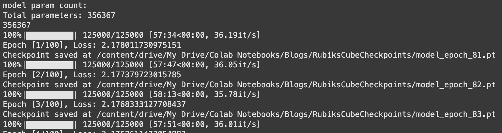

模型训练过程中的一些输出示例。训练持续了几天。

我有一小块代码，用于自己的调试目的。我定义了一个函数，它可以给我模型中可训练参数的总数，这对于我大致了解我正在训练的模型大小非常有用。

```py
print('model param count:')
print(count_parameters(model))
```

接下来，我将定义我的“标准”，这是一种说法，即我将如何判断模型的对错。在这里，我使用交叉熵，这是一个标准的损失函数，它比较模型预测的结果和应该预测的结果，如果模型预测错误很多，则输出一个大数字，如果模型预测大部分正确，则输出一个小数字。

```py
# Define loss function and optimizer
criterion = nn.CrossEntropyLoss()
```

然后我们通过首先定义我们想要遍历数据集的次数，然后遍历数据集来进入实际的训练循环。在这里，我使用`tqdm`来渲染漂亮的进度条，这使我能够观察训练的进度。

```py
num_epochs = 100
for epoch in range(num_epochs):
    model.train()
    running_loss = 0.0
    for batch in tqdm(data_loader):
        # training code...
```

在训练迭代中，我们首先解包批次

```py
X_batch, y_batch = batch
```

然后我们重置优化器的梯度。我认为训练的复杂性超出了这篇文章的范围，但如果你想了解更多，请查看我的[AI 入门介绍](https://medium.com/towards-data-science/ai-for-the-absolute-novice-intuitively-and-exhaustively-explained-7b353a31e6d7)和我的[关于梯度的文章](https://medium.com/towards-data-science/what-are-gradients-and-why-do-they-explode-add23264d24b)以获取更多信息。对于我们来说，我们只需说这一行代码使我们准备好从新的示例批次中学习。

```py
optimizer.zero_grad()
```

在这个阶段，`y_batch`代表整个解决方案序列。我们希望将这个解决方案转换成两种表示，即我们想要放入模型中的内容和我们希望从模型中获取的预测。例如，对于这个序列：

`<sos>，移动 0，移动 1，移动 3，<eos>`

我们希望将这个序列放入我们的解码器：

`<sos>，移动 0，移动 1，移动 3`

并希望从解码器输出中获取这个序列：

`移动 0，移动 1，移动 3，<eos>`

在这个代码块中，我们定义了模型的输入，获取模型对应该执行哪些移动的预测，以及我们希望模型预测的内容

```py
# Defining the input sequence to the model
y_input = y_batch[:, :-1]

# Forward pass
y_pred = model(X_batch, y_input)

# Transform target to one-hot encoding
y_target = F.one_hot(y_batch[:, 1:], num_classes=15).float().to(device)
```

然后我们确定模型有多错误，跟踪这些信息以了解模型是否在改进，并更新我们的模型，使其在该特定示例上稍微不那么糟糕。

```py
# Compute loss
loss = criterion(y_pred.view(-1, 15), y_target.view(-1, 15))
running_loss += loss.item()
batch_losses.append(loss.item())

# Backward pass and optimization
loss.backward()
optimizer.step()
```

我们还在做一些提高生活质量的事情，比如打印状态和保存模型检查点。

```py
# Print epoch loss
print(f"Epoch [{epoch+1}/{num_epochs}], Loss: {running_loss / len(data_loader)}")

# Save checkpoint every epoch
if (epoch_iter + 1) % 1 == 0:
    checkpoint_path = os.path.join(checkpoint_dir, f"model_epoch_{epoch_iter+1}.pt")
    torch.save({
        'epoch': epoch_iter + 1,
        'model_state_dict': model.state_dict(),
        'optimizer_state_dict': optimizer.state_dict(),
        'loss': running_loss / len(data_loader),
    }, checkpoint_path)
    print(f"Checkpoint saved at {checkpoint_path}")
```

哇，我们已经定义了一个魔方解决模型并对其进行了训练。让我们看看它有多好。

## 测试我们的模型

现在我们已经训练了我们的模型，我们可以将其应用于一些新打乱的魔方，并查看其表现。此代码创建一个新的魔方并生成一系列移动预测，直到模型输出`<stop>`标记

```py
def predict_and_execute(cube, max_iter = 21):

    #turning rubiks cube into encoder input
    model_X = torch.tensor(tokenize(cube.cube)).to(torch.int32).unsqueeze(0).to(device)

    #input to decoder initialized as a vector of zeros, which is the start token
    model_y = torch.zeros(22).unsqueeze(0).to(torch.int32).to(device)
    current_index = 0

    mask = model_y<-1

    #predicting move sequence
    while current_index < max_iter:
        y_pred = model(model_X, model_y, mask)
        predicted_tokens = torch.argmax(y_pred, dim=-1)
        predicted_next_token = predicted_tokens[0,current_index]
        model_y[0,current_index+1] = predicted_next_token
        current_index+=1

    #converting into a list of moves
    predicted_tokens = model_y.cpu().numpy()[0]

    #executing move sequence
    moves = []
    for token in predicted_tokens:

        #start token
        if token == 0: continue

        #pad token
        if token == 3: continue

        #stop token
        if token == 1: break

        #move
        move = output_index_to_move(token-3) #accounting for start, pad, and end
        cube.rotate_face(move[0], reverse=move[1])
        moves.append(move)

    return moves

#we can define how many shuffles we'll use for this particular test
NUMBER_OF_SHUFFLES = 3

print(f'attempting to solve a Rubiks Cube with {NUMBER_OF_SHUFFLES} scrambling movesn')

#creating a cube
cube = RubiksCube()

#shuffling (changing n will change the number of moves to scramble the cube)
moves = scramble(cube, n=NUMBER_OF_SHUFFLES)
print(f'moves to scramble the cube:n{moves}')

# Visualize from opposite corners
fig = cube.visualize_opposite_corners(return_fig = True)
fig.set_size_inches(4, 2)
plt.show()

#trying to solve cube
print('nsolving...')
solution = predict_and_execute(cube)
print(f'moves predicted by the model to solve the cube:n{solution}')

# Visualize from opposite corners
fig = cube.visualize_opposite_corners(return_fig = True)
fig.set_size_inches(4, 2)
plt.show()
```

我们可以调整`NUMBER_OF_SHUFFLES`来观察我们的模型解决各种难度的一些魔方的情况：

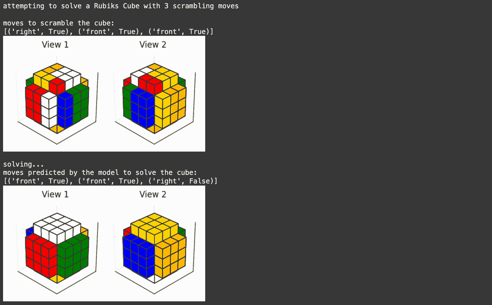

解决 3 步打乱

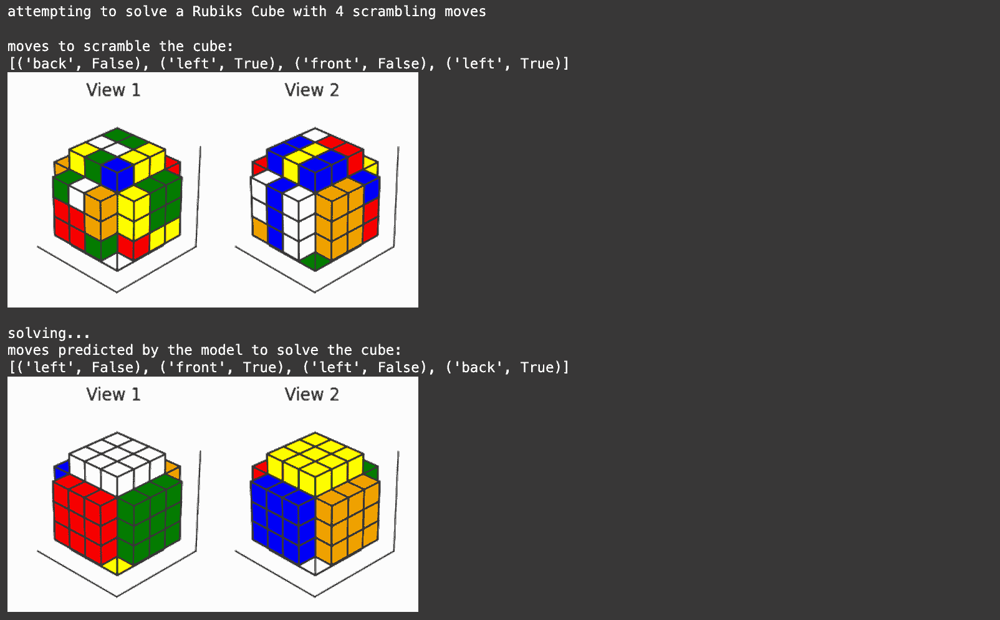

解决 4 步打乱

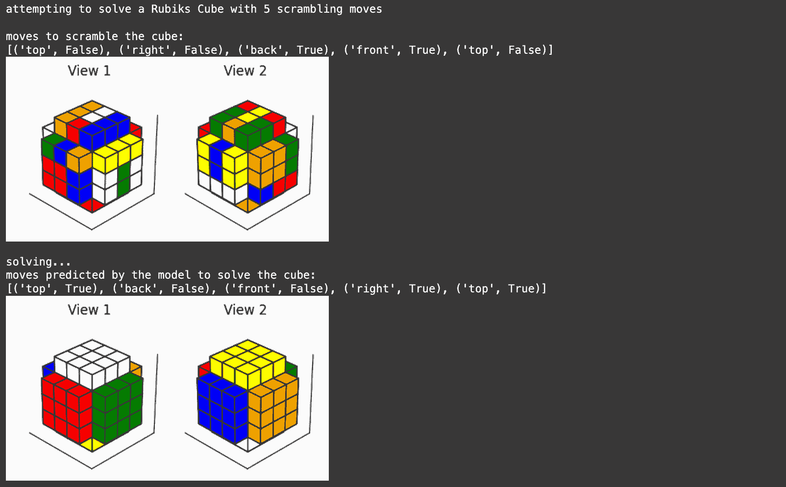

解决 5 步打乱

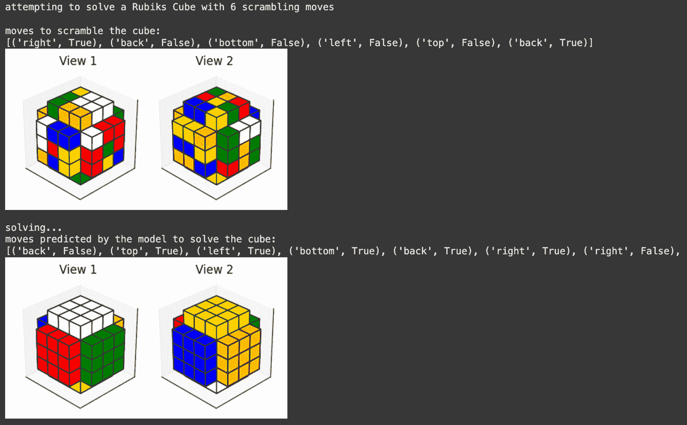

解决 6 步打乱

它做得相当不错，当然比我好得多。

看起来，普遍认为模型倾向于忽略错误移动的假设至少是部分正确的。这里有一些模型预测比反转打乱更好的解决方案的例子：

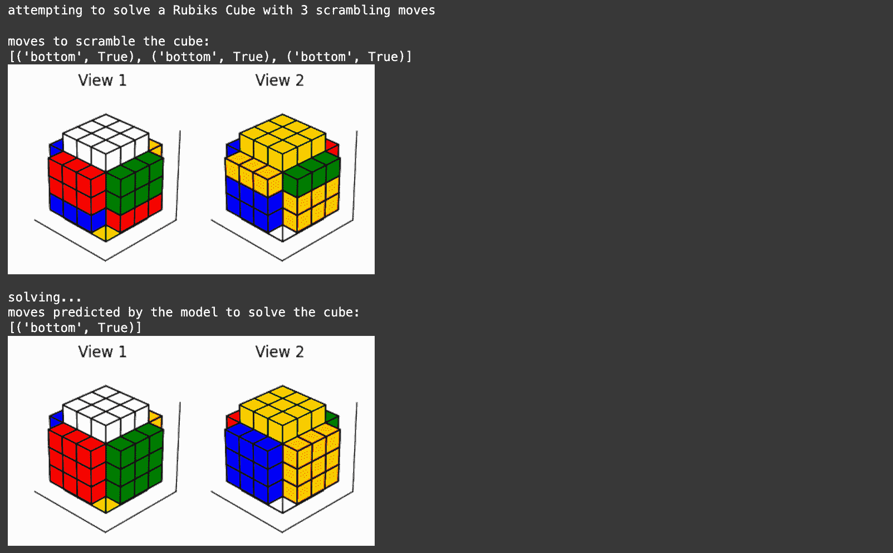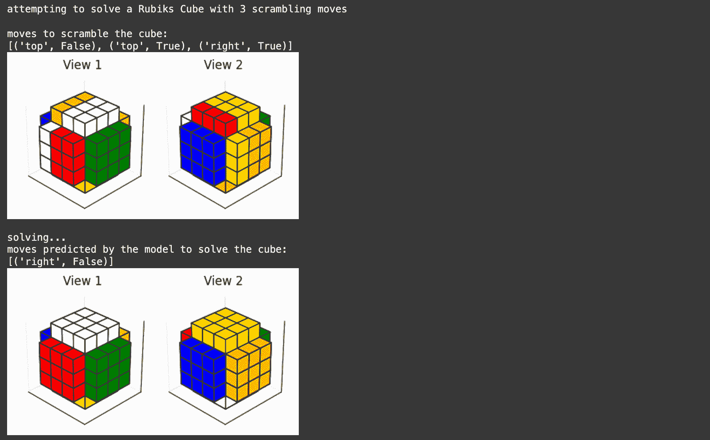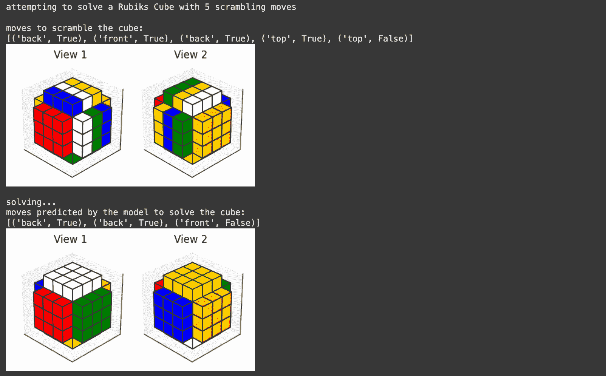

然而，并非一切都很顺利。模型在解决少量打乱时似乎有些不一致：

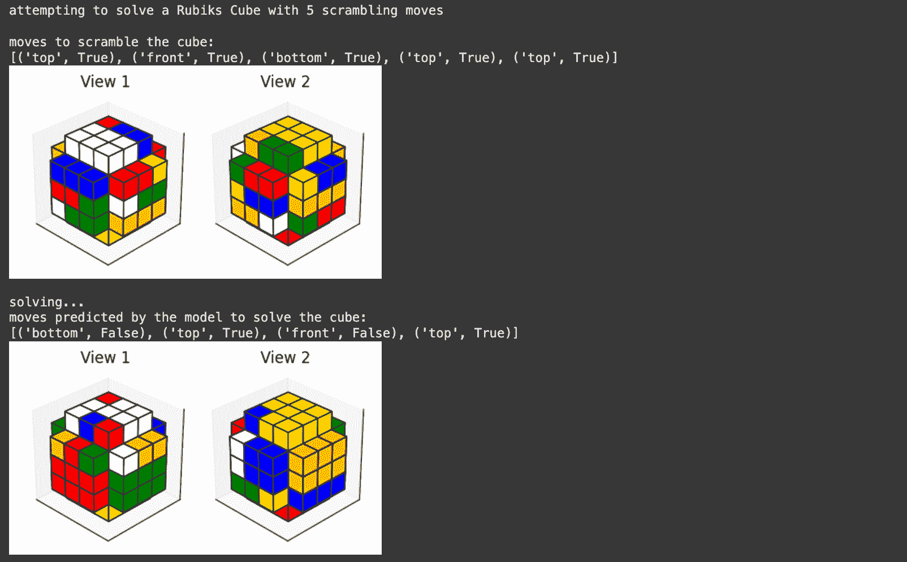

对于复杂的打乱（如超过 7 步），模型几乎毫无希望。

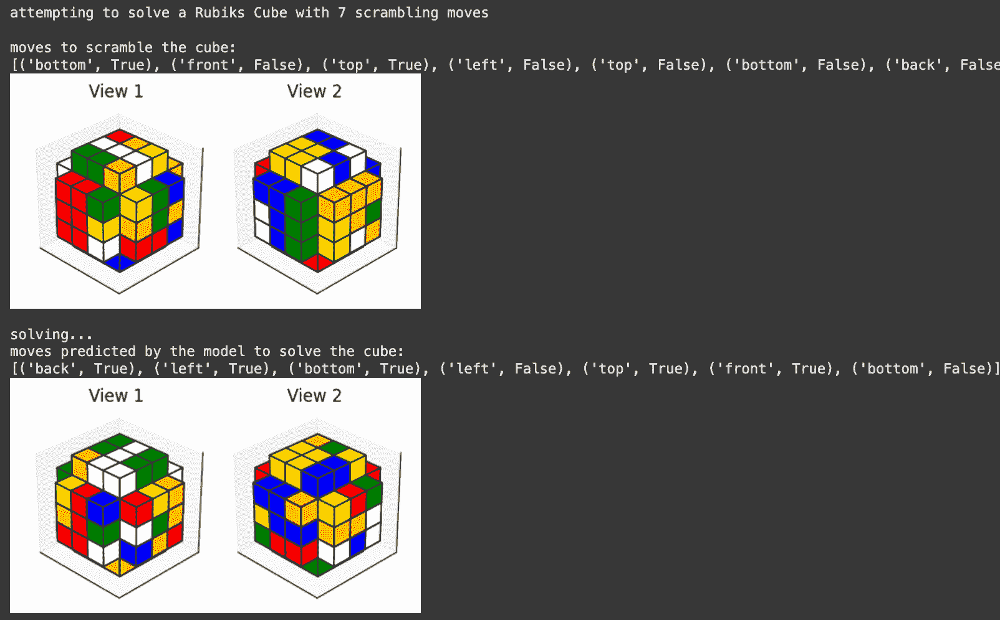

解决这个问题的简单方法之一：只是训练更长的时间。Transformer 从大量的训练数据和大量的训练时间中受益。我毫不怀疑，如果给这个模型几周的训练时间，它就能学会解决你扔给它的几乎任何魔方。你总是可以增加一些模型参数，使模型更好地理解问题的复杂性。

另一种解决方案是使用更好的训练策略。监督学习是可以的，但这个错误移动问题给训练集增加了大量的噪声，这可能会随着打乱次数的增加而加剧。我认为，随着序列变长，使用打乱序列的逆序变得越来越没有意义，这意味着我们需要相当多的训练时间才能达到高性能模型的程度。

如果你现在想要一个超级高效的魔方，就赶紧把这篇文章中描述的代码扔到 GPU 上，稍等片刻，看看会发生什么。就我个人而言，我更感兴趣的是探索更好的建模方法。

在未来的文章中，我将使用强化学习微调这个模型，这有望使模型快速变得非常鲁棒。所以，请保持关注。

## 结论

在这篇文章中，我们创建了一个模型，可以通过学习基于打乱魔方的合成数据集从头开始解决魔方。首先，我们创建了一种定义魔方的办法，这样我们就可以打乱并解决它，然后我们使用这个定义生成了 200 万个打乱魔方的数据集及其解决方案。我们找到了如何标记化、嵌入和位置编码魔方和一系列移动的方法，然后创建了一个可以接受这些移动并输出下一步预测的 Transformer。我们根据我们的数据训练了这个 Transformer，并在新的魔方上进行了测试。最后，我们得到了一个有希望的第一代概念模型，我们将用它来探索这个主题的未来。

## 参加直观且详尽的解释

在 IAEE，你可以找到：

+   长篇内容，如你刚刚阅读的文章

+   基于我的数据科学家、工程总监和企业家经验的思想碎片

+   一个专注于学习 AI 的 Discord 社区

+   定期讲座和办公时间


[加入 IAEE](https://iaee.substack.com/)

## 参考文献

### 代码：

> [**MLWritingAndResearch/RubiksCubeAI.ipynb at main · DanielWarfield1/MLWritingAndResearch**](https://github.com/DanielWarfield1/MLWritingAndResearch/blob/main/RubiksCubeAI.ipynb)

### 相关文章：

> [**AI 初学者指南 – 直观且全面解释**](https://towardsdatascience.com/ai-for-the-absolute-novice-intuitively-and-exhaustively-explained-7b353a31e6d7)
> 
> [**Transformers – 直观且全面解释**](https://medium.com/towards-data-science/transformers-intuitively-and-exhaustively-explained-58a5c5df8dbb)
> 
> [**GPT – 直观且全面解释**](https://towardsdatascience.com/gpt-intuitively-and-exhaustively-explained-c70c38e87491)
> 
> [**LoRA – 直观且全面解释**](https://medium.com/towards-data-science/lora-intuitively-and-exhaustively-explained-e944a6bff46b)
> 
> [**投机抽样 – 直观且全面解释**](https://medium.com/towards-data-science/speculative-sampling-intuitively-and-exhaustively-explained-2daca347dbb9)
> 
> [**使用投影头进行自监督学习**](https://towardsdatascience.com/self-supervised-learning-using-projection-heads-b77af3911d33)
> 
> [**CLIP，直观且全面解释**](https://towardsdatascience.com/clip-intuitively-and-exhaustively-explained-1d02c07dbf40)
