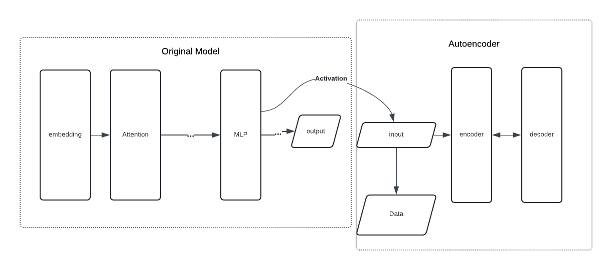
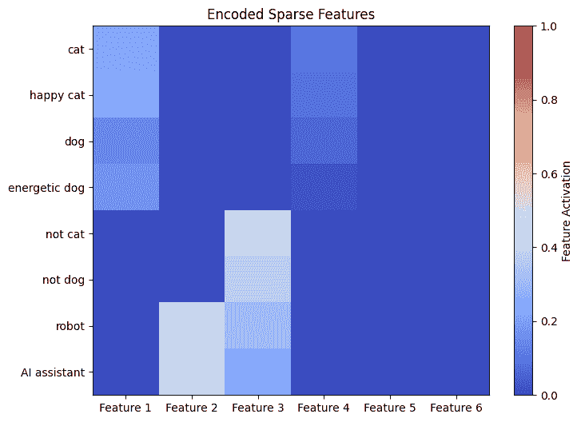

# 稀疏自动编码器：从叠加到可解释特征

> 原文：[`towardsdatascience.com/sparse-autoencoder-from-superposition-to-interpretable-features-4764bb37927d/`](https://towardsdatascience.com/sparse-autoencoder-from-superposition-to-interpretable-features-4764bb37927d/)

**复杂神经网络**，例如大型语言模型（LLMs），常常面临**可解释性**的挑战。这种困难的一个重要原因是**叠加**——神经网络维度少于它需要表示的特征数量。例如，一个具有 2 个神经元的玩具 LLM 需要呈现 6 种不同的语言特征。因此，我们经常观察到单个神经元需要激活多个特征。对于叠加的更详细解释和定义，请参阅我的之前的[博客文章](https://medium.com/towards-data-science/superposition-what-makes-it-difficult-to-explain-neural-network-565087243be4)： "叠加：是什么让神经网络难以解释"。

在这篇博客文章中，我们更进一步：让我们尝试解开一些叠加的特征。我将介绍一种称为**稀疏自动编码器**的方法，通过玩具示例来分解复杂神经网络，特别是 LLM，以揭示可解释的特征。

## 稀疏自动编码器

根据定义，**稀疏自动编码器**是一种在隐藏层激活中故意引入稀疏性的自动编码器。它具有相对简单的结构和轻量级的训练过程，旨在分解复杂神经网络，并以更可解释、更易于人类理解的方式揭示特征。

让我们想象你有一个训练好的神经网络。自动编码器不是模型本身的训练过程的一部分，而是一个事后分析工具。原始模型有自己的激活，这些激活随后被收集并用作稀疏自动编码器的输入数据。

例如，我们假设你的原始模型是一个具有一个 5 个神经元的隐藏层的神经网络。此外，你有一个包含 5000 个样本的训练数据集。你必须收集所有 5000 个训练样本中隐藏层 5 维激活的所有值，现在它们是你的稀疏自动编码器的输入。



图片由作者提供：用于分析 LLM 的自动编码器

然后，自动编码器从这些激活中学习一个新的、稀疏的表示。编码器将原始 MLP 激活映射到一个具有更高表示维度的新的向量空间。回顾我之前的 5 个神经元的简单例子，我们可能会考虑将其映射到一个具有 20 个特征的向量空间。希望我们能够获得一个有效地将原始 MLP 激活分解为表示的稀疏自动编码器，这种表示更容易解释和分析。

稀疏性在自动编码器中非常重要，因为它对于自动编码器“解耦”特征是必要的，比在密集、重叠的空间中拥有更多的“自由度”。如果没有稀疏性的存在，自动编码器可能会仅仅学习到一个平凡的压缩，而没有形成任何有意义的特征。

## 玩具模型

### 语言模型

现在，让我们构建我们的玩具模型。我要求读者注意，这个模型在实践上并不现实，甚至有点愚蠢，但它足以展示我们如何构建稀疏自动编码器并捕捉一些特征。

假设我们现在已经构建了一个具有一个特定隐藏层且其激活有三个维度的语言模型。让我们假设在训练数据集中有以下标记："cat"、"happy cat"、"dog"、"energetic dog"、"not cat"、"not dog"、"robot" 和 "AI assistant"，并且它们具有以下激活值。

```py
data = torch.tensor([
    # Cat categories
    [0.8, 0.3, 0.1, 0.05],  # "cat"
    [0.82, 0.32, 0.12, 0.06],  # "happy cat" (similar to "cat")
    # Dog categories
    [0.7, 0.2, 0.05, 0.2],  # "dog"
    [0.75, 0.3, 0.1, 0.25],  # "loyal dog" (similar to "dog")

    # "Not animal" categories
    [0.05, 0.9, 0.4, 0.4],  # "not cat"
    [0.15, 0.85, 0.35, 0.5],  # "not dog"

    # Robot and AI assistant (more distinct in 4D space)
    [0.0, 0.7, 0.9, 0.8],  # "robot"
    [0.1, 0.6, 0.85, 0.75]  # "AI assistant"
], dtype=torch.float32)
```

### 自动编码器的构建

我们现在使用以下代码构建自动编码器：

```py
class SparseAutoencoder(nn.Module):
    def __init__(self, input_dim, hidden_dim):
        super(SparseAutoencoder, self).__init__()
        self.encoder = nn.Sequential(
            nn.Linear(input_dim, hidden_dim),
            nn.ReLU()
        )
        self.decoder = nn.Sequential(
            nn.Linear(hidden_dim, input_dim)
        )

    def forward(self, x):
        encoded = self.encoder(x)
        decoded = self.decoder(encoded)
        return encoded, decoded
```

根据上面的代码，我们可以看到编码器只有一个全连接的线性层，将输入映射到具有 `hidden_dim` 的隐藏表示，然后传递到 ReLU 激活。解码器仅使用一个线性层来重建输入。请注意，解码器中缺少 ReLU 激活是我们特定重建情况下的故意行为，因为重建可能包含实值和潜在的负值数据。ReLU 会相反地强制输出保持非负，这不符合我们的重建需求。

我们使用以下代码训练模型。在这里，损失函数有两个部分：重建损失，衡量自动编码器重建输入数据的准确性，以及一个稀疏性损失（带有权重），它鼓励在编码器中形成稀疏性。

```py
# Training loop
for epoch in range(num_epochs):
    optimizer.zero_grad()

    # Forward pass
    encoded, decoded = model(data)

    # Reconstruction loss
    reconstruction_loss = criterion(decoded, data)

    # Sparsity penalty (L1 regularization on the encoded features)
    sparsity_loss = torch.mean(torch.abs(encoded))

    # Total loss
    loss = reconstruction_loss + sparsity_weight * sparsity_loss

    # Backward pass and optimization
    loss.backward()
    optimizer.step()
```

## 可解释的特征

现在，我们可以看看结果。我们绘制了原始模型每个激活的编码器的输出值。回想一下，输入标记是 "cat"、"happy cat"、"dog"、"energetic dog"、"not cat"、"not dog"、"robot" 和 "AI assistant"。



图片由作者提供：编码器学习到的特征

尽管原始模型的设计非常简单，没有任何深入考虑，但自动编码器仍然捕捉到了这个平凡模型的有意义特征。根据上面的图表，我们可以观察到至少四个似乎是由编码器学习到的特征。

首先考虑特征 1。这个特征在以下 4 个标记上有较大的激活值：“cat”（猫）、“happy cat”（快乐猫）、“dog”（狗）和“energetic dog”（精力充沛的狗）。结果表明，特征 1 可能与“动物”或“宠物”有关。特征 2 也是一个有趣的例子，它在两个标记“robot”（机器人）和“Ai assistant”（AI 助手）上激活。因此，我们猜测这个特征与“人工和机器人”有关，表明模型对技术背景的理解。特征 3 在 4 个标记上激活：“not cat”（不是猫）、“not dog”（不是狗）、“robot”（机器人）和“Ai assistant”（AI 助手），这可能是“非动物”的特征。

不幸的是，原始模型并非在真实世界文本上训练的真实模型，而是通过假设相似标记在激活向量空间中具有某种相似性而人工设计的。然而，这些结果仍然提供了有趣的见解：稀疏自编码器成功地展示了一些有意义、对人类友好的特征或现实世界概念。

## 结论

本博客文章中的简单结果表明：稀疏自编码器可以有效地帮助从复杂的神经网络（如 LLM）中获取高级、可解释的特征。

对于对稀疏自编码器的真实世界实现感兴趣的读者，我推荐这篇[文章](https://transformer-circuits.pub/2023/monosemantic-features/index.html)，其中自编码器被训练来解释一个具有 512 个神经元的真实大型语言模型。这项研究提供了稀疏自编码器在 LLM 可解释性背景下的实际应用。

最后，我在此提供这个 google colab [笔记本](https://colab.research.google.com/drive/11uqjg3a6IdhXok4iNnbbojC_cVASmIHH#scrollTo=boRLI5vmUBwx&line=44&uniqifier=1)，其中详细介绍了本文中提到的我的实现方法。
