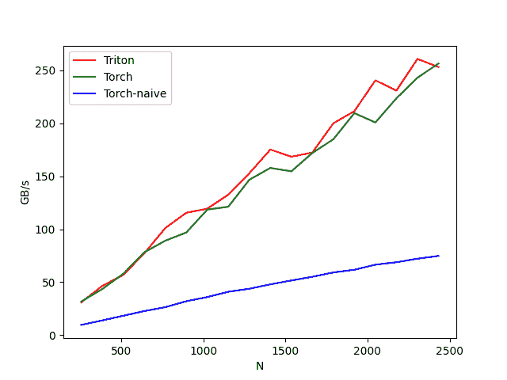

# 使用自定义内核加速 PyTorch。但情况会逐渐变得复杂

> 原文：[`towardsdatascience.com/speed-up-pytorch-with-custom-kernels-but-it-gets-progressively-darker-e5a057796269/`](https://towardsdatascience.com/speed-up-pytorch-with-custom-kernels-but-it-gets-progressively-darker-e5a057796269/)

# Speed Up PyTorch with Custom Kernels

> 免费阅读于 [alexdremov.me](https://alexdremov.me/speed-up-pytorch-with-custom-kernels-but-it-gets-progressively-darker?utm_source=medium)

PyTorch 提供了非凡的灵活性，允许你只需几秒钟就能编写复杂的 GPU 加速操作。然而，这种便利是有代价的。PyTorch 按顺序执行你的代码，导致性能不佳。这转化为模型训练速度变慢，影响实验的迭代周期、团队的稳健性、财务影响等等。

在这篇帖子中，我将探讨加速你的 PyTorch 操作的三个策略。每种方法都以 **softmax** 作为我们的“Hello World”演示，但你也可以用你喜欢的任何函数替换它，讨论的方法仍然适用。

我们将从 **torch.compile** 开始，然后继续编写自定义的 Triton 内核，最后深入设计 CUDA 内核。

因此，这篇帖子可能会变得复杂，但请耐心等待。

## `torch.compile` – 提升性能的快捷方式

> 💥 *"等等，你只是打开了一个函数调用，代码就变快了？就这样？听起来太好了，不太可能是真的。"*

+   是的。

`torch.compile` 是 PyTorch 中一个相对较新的 API，它底层使用运行时图捕获和内核融合。通过一个装饰器，你通常可以在不显著更改代码的情况下看到速度提升。

简单来说，例如，我们可以通过将操作合并到一个 GPU 函数中来加速计算，从而消除单独 GPU 调用的开销。或者，甚至更好地，通过用等效的单个操作替换一系列操作来优化操作链。

在常规 PyTorch 执行模式（急切模式）中，这些优化是不可能的，因为它会按照代码中调用的顺序执行操作。

### 使用 `torch.compile` 实现 Softmax

下面是一个简单的示例，展示了如何使用 `torch.compile` 实现和编译 softmax 函数。将其替换到你的模型的前向传递中，你的代码（希望）会运行得更快。

> ❗ 注意，如果你编译整个模型而不是单个操作，你会获得更大的速度提升

**优点**：

+   一行代码即可启用编译器。

+   不需要任何黑魔法仪式（也许除了动态形状）。

**缺点**：

+   在编译过程中，第一次运行可能会较慢；之后，它会加快速度。

+   并非总是对所有模型都能产生显著的加速效果，如果你的代码过于创新，有时甚至可能出错。

+   仍然存在处理动态形状的问题。

> 😡 当输入形状改变且我们不希望为每个特定大小重新编译代码时，需要动态形状编译模式。

调试这些方法需要一篇全新的文章。

## Triton 代码 – 使用 Python Breeze 编写 GPU 内核

### 为什么使用 Triton？

**Triton**是一种编译成高效 GPU 内核的语言，同时让你编写 Python 风格的代码。它在 PyTorch 的 dynamo/inductor 堆栈下使用，但你也可以编写自己的自定义操作！对于许多矩阵/张量操作，如 softmax，你可以获得巨大的速度提升。因为**为什么**要等待官方的 PyTorch 内核，当你可以编写自己的内核时？

### Triton 中的 Softmax

这里有一个最小示例，展示了我们如何在 Triton 中实现一个简单的 softmax 正向操作。我会为了演示而保持它简短而清晰。在实际项目中，你可能会进行更高级的 tiling 和 block 管理。

> 💥 这可能看起来很复杂，但只要你熟悉 Triton，它就会开始变得有意义。

查看他们的指南 [their guides](https://triton-lang.org/main/index.html?ref=alexdremov.me)

的确，看起来很复杂。但算法的核心总结在几行之内。

其他的一切都是数据管理和副业。

如果我们对不同长度的数据进行基准测试，我们会看到我们的性能与`torch.nn.functional.softmax`相匹配（这是一个高度优化的内核！）并且显著优于原始的 torch 实现。

基准测试 | 图片由作者提供

你可以在以下 github 文件中找到内核和基准测试的完整代码。

> [**kernels/src/softmax/kernel.py at main · alexdremov/kernels**](https://github.com/alexdremov/kernels/blob/main/src/softmax/kernel.py?ref=medium.com)

**优点**：

+   通过融合操作和优化内存访问模式，可能实现巨大的速度提升。

+   比 torch.compile 有更多的控制。

+   容易编写高效的代码（我们匹配了 torch 实现！）

+   容易编写低效的代码（如果你不知道你在做什么）。

**缺点**：

+   你现在成为了**内核开发者**，这意味着如果出现问题需要调试。这真的很困难。

+   如果你进一步使用自定义反向传播，你可能需要再来一杯咖啡……或者更多。这是因为 torch 不能为 triton 使用 autograd。所以你需要自己定义反向操作。

## 纯 CUDA（即全力以赴）

有时候即使是 Triton 也无法满足需求，或者你只是喜欢活在边缘。在这种情况下，你可以用 C++编写一个自定义 CUDA 内核，编译它，并通过自定义扩展将其绑定到 PyTorch。像[[这个融合 CUDA softmax 参考]](https://github.com/fattorib/CudaSoftmax?ref=alexdremov.me)这样的项目展示了人们如何为最大速度构建专门的内核。

### 自定义 CUDA 中的 Softmax

你通常会有一个`setup.py`，它编译一个`.cu`或`.cpp`文件，并将一个 Python 函数作为扩展公开。

> [**GitHub – fattorib/CudaSoftmax: Softmax CUDA 内核 :)**](https://github.com/fattorib/CudaSoftmax?ref=alexdremov.me)

我不会在这篇文章中提供这种方法的相关代码，所以这个事实本身就说明了问题。这种方法相当复杂，需要合理的理由，通常是你应该最后尝试的方法。

编写低效、有错误、不安全的代码非常容易。

**优点**：

+   最大控制权。“如果你想做得正确，就自己来做。”

+   如果优化得当，这可能是最快的内核。

**缺点**：

+   需要深入理解 CUDA。

+   内存管理、块大小、共享内存——这些都是难点！

+   维护开销可能**非常高**。

## 结论

当谈到加速 PyTorch 操作时，你可以选择从越来越复杂的方法中进行选择：

1.  **`torch.compile`**：需要的代码更改最少。

1.  **Triton 内核**：对内核行为的控制更多，但编码仍然相当简单。

1.  **纯 CUDA**：最大优化潜力，但**复杂性更高**。

如果你正在寻找最简单的改进，从 `torch.compile` 开始。如果这还不够，探索 Triton。对于高级用户，编写自定义 CUDA 内核可以带来进一步的提升，尽管这需要深厚的 GPU 编程技能。

订阅以不错过关于其他优化和有用的深度学习技术的文章！

## 参考文献

1.  [使用 torch.compile 编译优化器 (PyTorch 文档)](https://pytorch.org/tutorials/recipes/compiling_optimizer.html?ref=alexdremov.me)

1.  [如何正确使用 torch.compile？(PyTorch 讨论区)](https://discuss.pytorch.org/t/how-should-i-use-torch-compile-properly/144598?ref=alexdremov.me)

1.  [使用 torch.compile 与用户定义的 Triton 内核 (PyTorch 文档)](https://pytorch.org/tutorials/recipes/torch_compile_user_defined_triton_kernel_tutorial.html?ref=alexdremov.me)

1.  [使用 torch.compile 与自定义 Triton 内核 (PyTorch 讨论区)](https://discuss.pytorch.org/t/torch-compile-with-custom-triton-kernel/192876?ref=alexdremov.me)

1.  [GitHub: fattorib/CudaSoftmax](https://github.com/fattorib/CudaSoftmax?ref=alexdremov.me)

选择适合你项目需求和舒适度的路径。祝你好运，优化成功！

> 这个故事最初发表在 [alexdremov.me](https://alexdremov.me/speed-up-pytorch-with-custom-kernels-but-it-gets-progressively-darker?utm_source=medium)
