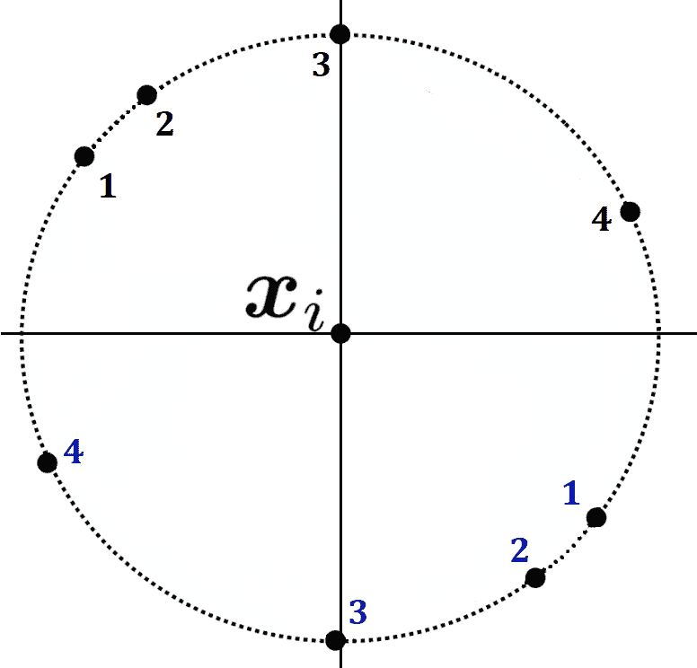
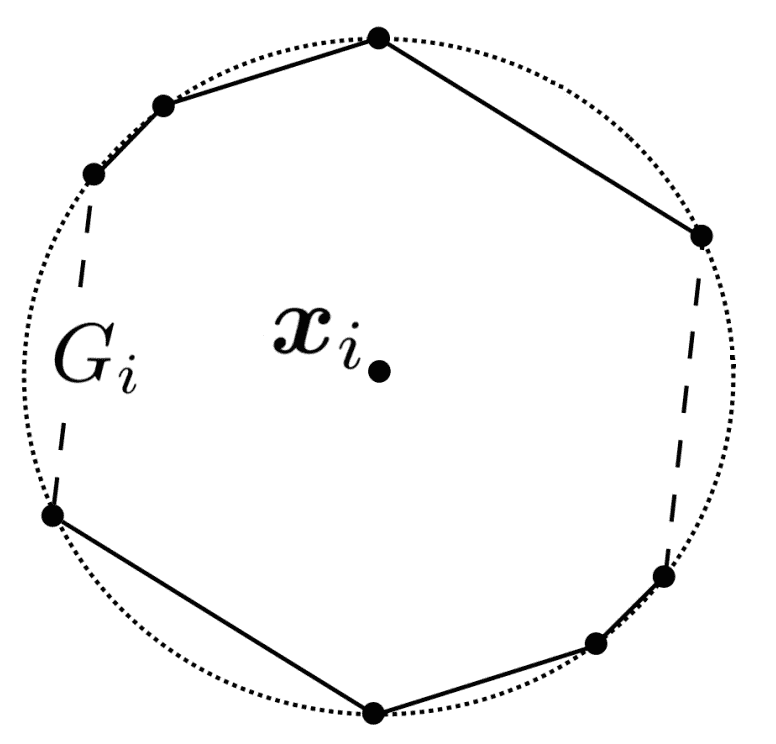
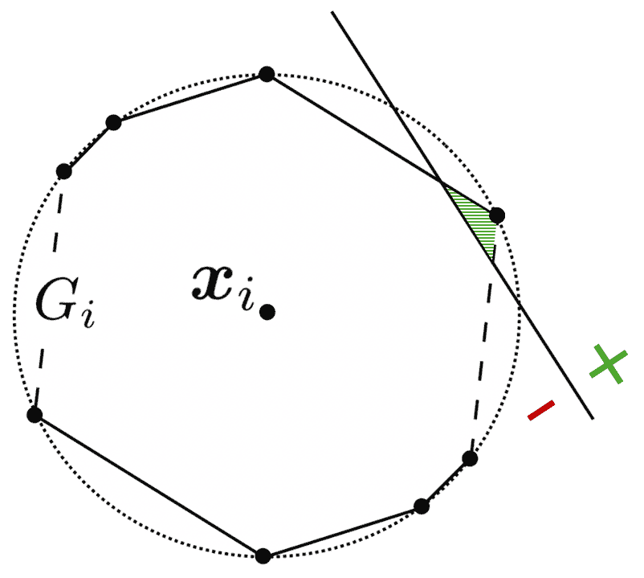
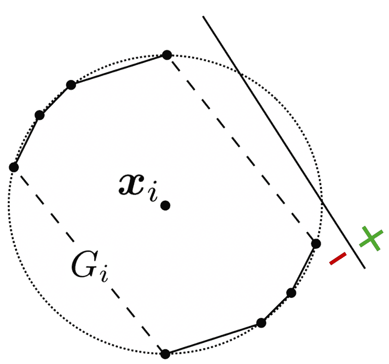
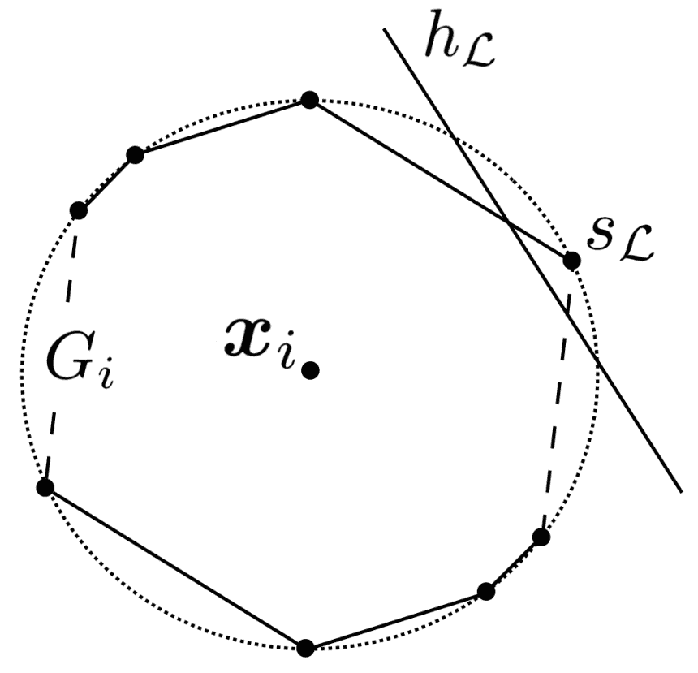
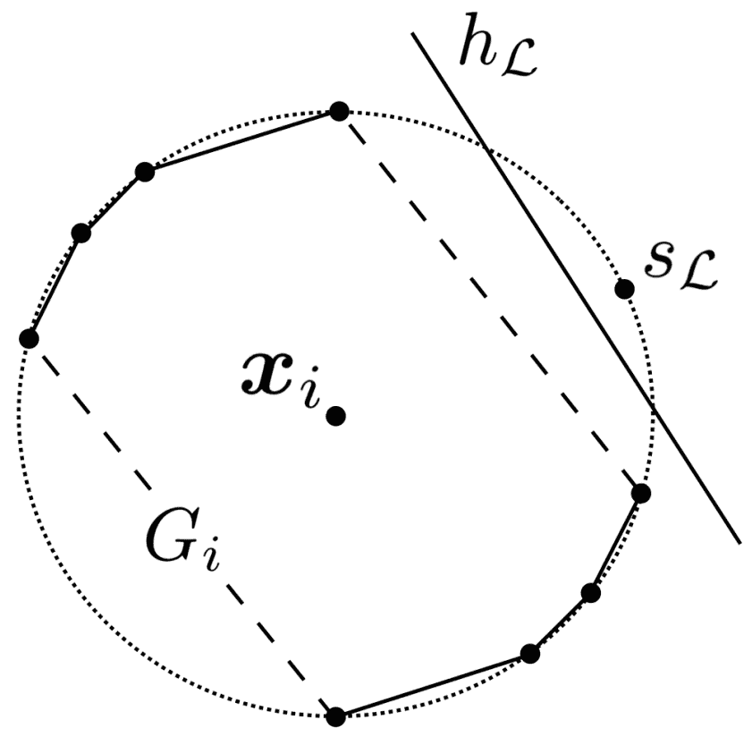

# 战略线性分类器的统计可学习性：证明过程

> 原文：[`towardsdatascience.com/statistical-learnability-of-strategic-linear-classifiers-a-proof-walkthrough-e80db99d6c4e/`](https://towardsdatascience.com/statistical-learnability-of-strategic-linear-classifiers-a-proof-walkthrough-e80db99d6c4e/)

在本系列的[前一篇文章](https://towardsdatascience.com/quantifying-the-complexity-and-learnability-of-strategic-classification-problems-fd04cbfdd4b9)中，我们探讨了*战略 VC 维度*（SVC）及其与*战略学习的基本定理*的联系。我们将在这篇文章中利用这两个概念，以及我们在它们之前探讨的*可达到的标签*和*战略破碎系数*。

> [**量化战略分类问题的复杂性和可学习性**](https://towardsdatascience.com/quantifying-the-complexity-and-learnability-of-strategic-classification-problems-fd04cbfdd4b9)

**如果您还没有阅读本系列的[第一篇文章](https://towardsdatascience.com/extending-pac-learning-to-a-strategic-classification-setting-6c374935dde2)，我鼓励您在继续阅读关于 SVC 的文章之前，先从那里开始。**

> [**将 PAC 学习扩展到战略分类设置**](https://towardsdatascience.com/extending-pac-learning-to-a-strategic-classification-setting-6c374935dde2)

在本系列其他文章的背景下，**对集合论和几何学的基本理解就足以理解定理及其证明。**

* * *

### 实例成本函数如何影响 SVC：陈述定理

正如我们所看到的，SVC 可以用作在战略分类背景下估计假设类表达能力的工具。我们仔细地将 SVC 定义为经典 VC 维度的推广，我们理解这两个概念有很多共同之处。然而，SVC 何时会与其经典对应物产生分歧？我们能否提出一个场景，其中分类问题的战略方面显著增加了其复杂性？**实际上，我们可以轻松地做到这一点：线性分类。**

线性分类涉及根据应用于其特征的线性函数确定数据点应该被正分类还是负分类。从几何学的角度来看，我们可以想象一个线性分类器在*d*维实空间（ℝ*ᵈ*）中诱导一个线性决策边界。边界一侧的任何事物都被正分类，而另一侧的任何事物都被负分类。在一维空间中，决策边界是一个阈值（[如我们在前一篇文章中看到的](https://towardsdatascience.com/quantifying-the-complexity-and-learnability-of-strategic-classification-problems-fd04cbfdd4b9#4322)）。在二维空间中，它是一条分割平面的线。一般来说，它是一个[超平面](https://en.wikipedia.org/wiki/Hyperplane)。

**在经典的二元分类中，包含所有线性分类器的假设类在ℝ*ᵈ*中的 VC 维是*d + 1***，**这是有限的。**例如，对于*d* = 2（ℝ²中的线性分类器），VC 维是 3。统计学习的基本定理[⁽¹⁾](https://www.cs.princeton.edu/courses/archive/spring16/cos511/lec17.pdf)规定，**因此，经典线性分类是 PAC 可学习的。**

**直观上，我们可能会期望对于问题的战略类似物得出相同的结论。**毕竟，线性分类器是最简单的分类器之一，对它们的推理可以相当自然。**⁽²⁾**

**然而，一旦我们将*实例级*成本函数加入其中，这种简单性就会消失。我们将证明：**

> 给定一个战略线性分类问题 Sᴛʀᴀᴄ⟨*H*, *R*, *c*⟩，**存在一个****实例级成本函数** *c*(*z*; *x*)= ℓ*ₓ*(*z – x)* **使得 SVC(*H*, *R*, *c*) = ∞**。

换句话说，使用*[战略学习的基本定理](https://towardsdatascience.com/quantifying-the-complexity-and-learnability-of-strategic-classification-problems-fd04cbfdd4b9#8540)*，我们发现，在配备*实例级*成本函数的战略设置中，线性分类通常不是 PAC 可学习的。有趣的是，即使我们尽可能地去除复杂性，它也不会是 PAC 可学习的。在这种情况下，我们将通过**专注于笛卡尔平面（*X* ⊆ ℝ²）上的战略线性分类（*R* = { 1 }）**来实现这一点。

**更一般的结论将源于我们在那些简化条件下将展示的反例。**如果战略线性分类在ℝ²中不是 PAC 可学习的，那么它就不可能在任何更高维度中是 PAC 可学习的。同样，我们在设置中提出的每一个其他偏好类都是同质偏好类的严格泛化。如果我们能证明任何这些偏好类的 PAC 可学习性，我们也将能够证明*R* = { 1 }这一更简单情况的可学习性。

### 从标记到单位圆上的点：证明设置

基于上述假设，我们首先将注意力转向特殊情况**Sᴛʀᴀᴄ⟨*Hₗ*, { 1 }, *c*⟩**，其中*Hₗ*是包含所有ℝ²中线性分类器的假设类。然后我们在原点初始化*n*个二维特征向量：∀ *i* ≤ *n* . *xᵢ* = (0, 0)。由于我们使用的是同质偏好类，因此∀ *i* ≤ *n* . *rᵢ* = 1。**数据点之间的唯一区别将在于我们的成本函数在每个数据点上的行为。**这正是证明的关键所在，我们很快就会看到。

然而，在我们详细讨论成本函数之前，**我们需要将我们未标记数据点的[可能标记](https://towardsdatascience.com/quantifying-the-complexity-and-learnability-of-strategic-classification-problems-fd04cbfdd4b9#4322)进行几何化**。正如我们上次看到的[那样](https://towardsdatascience.com/quantifying-the-complexity-and-learnability-of-strategic-classification-problems-fd04cbfdd4b9)，**一组 *n* 个未标记的数据点必须有 exactly 2*ⁿ* 种可能的标记**。在 ℝ² 中将一组标记（*n*-元组）几何化相对简单：我们只需为每种可能的标记选择一个任意点。特别是，我们将**在单位圆上选择 2*ⁿ* 个这样的代表性点**，**每个点分配给一个可能的标记**。虽然代表性点的具体坐标本身并不重要，**但我们确实需要每个这样的点都是唯一的**。我们还要求没有两个点在彼此之间是原点对称的。

我们将**用 *S* 表示这个代表性点的集合**。在选择了代表性点之后，我们用它们来定义**原点对称集合 *S’*，即 *S’* = { (-*x*, –*y*) : (*x*, *y*) ∈ *S* }。请注意，由于我们如何选择 S 中的点，*S* 和 *S’* 是不相交的（*S* ∩ *S’* = ∅）。

对于特定的 *x*ᵢ，**我们定义 *Sᵢ* 为 S 的子集，它只包含代表 *x*ᵢ 被正分类的标记的点**。同样，我们从 *Sᵢ* 推导出原点对称的 *Sᵢ’* ⊂ *S’*。在下面的例子中，位于 *x*-轴上方的点是代表 *x*ᵢ 被正分类的标记，即 *Sᵢ*。位于 *x*-轴下方的点构成了它们的原点对称集合 *Sᵢ’*（对称点对之间的编号匹配）。请注意，位于 *x*-轴上方的点的选择是完全随机的。

**图 1**：任意 *x*ᵢ 的几何化标记示例。回想一下，我们最初将所有未标记的数据点初始化为 (0, 0)。*Sᵢ* 中的点用黑色编号。它们在 *Sᵢ’* 中的原点对称对应点用蓝色编号*。图像由作者根据 R. Sundaram、A. Vullikanti、H. Xu、F. Yao 的图像制作，来自 **[PAC-Learning for Strategic Classification](https://arxiv.org/abs/2012.03310)**（在 [CC-BY 4.0 许可证](https://creativecommons.org/licenses/by/4.0/) 下使用）。

**我们继续构建一个凸多边形 *Gᵢ*，其顶点为 *Sᵢ* ∪ *Sᵢ’* 中的点。** 对于每个未标记的数据点 *Gᵢ*，将是在设计实例成本函数 *c* 中的关键，该函数将使我们始终能够实现所有可能的标记，从而证明 SVC(*Hₗ*, { 1 }, *c*) = ∞。为此，*Gᵢ* 的凸性将至关重要，正如其原点对称性（源于我们对 *Sᵢ’* 的选择）一样。

**图 2:** 由图 1 中所示的 *Sᵢ* 和 *Sᵢ’* 导出的凸、原点对称多边形 Gᵢ。图片由作者提供，基于 R. Sundaram, A. Vullikanti, H. Xu, F. Yao 的图片，见 **[PAC-Learning for Strategic Classification](https://arxiv.org/abs/2012.03310)** (在 [CC-BY 4.0 许可证](https://creativecommons.org/licenses/by/4.0/) 下使用)。

### 将多边形转化为偏好：构建成本函数

对于我们最初开始的每个原点初始化的未标记数据点，我们现在有一个代表正分类标签的凸、原点对称多边形。**现在，每个 *Gᵢ* 都可以用来定义我们的实例成本函数 *c* 在其相应的 *xᵢ* 上的行为。** 我们将使用 *Gᵢ* 来定义一个半范数**⁽³⁾**：

> **∥ *y* ∥*ɢᵢ* = inf { ε ∈ ℝ⁺ : *y* ∈ ε*Gᵢ* }**

这个定义意味着 **如果 *xᵢ* 和某个点 *z* 之间的距离小于 1，当且仅当 *z* 位于 *Gᵢ* 内部。** 即：

> ∥ *z* – *xᵢ* ∥*ɢᵢ* < 1 ⇔ *z* ∈ *Gᵢ*

**对于证明的其余部分，我们只需要理解 ∥ ⋅ ∥*ɢᵢ* 和一个点是否在 *Gᵢ* 内部的这种联系即可。** (参见脚注 (3) 中关于为什么 ∥ ⋅ ∥*ɢᵢ* 符合半范数的讨论，以及更多关于其几何解释的细节。)

**因此，我们定义实例成本函数 *c*：**

> *c*(*z*; *xᵢ*) = ℓ*ᵢ*(*z* – *xᵢ*)

**其中：**

> ℓ*ᵢ*(*z* – *xᵢ*) = ∥ *z* – *xᵢ* ∥*ɢᵢ*

**也就是说，对于每个未标记的数据点 *xᵢ*，*c* 的行为就像 ∥ ⋅ ∥*ɢᵢ* 一样。** 注意，这种行为对于每个数据点都是不同的。这是因为我们为每个 *xᵢ* 构建了一个独特的 *Gᵢ*，并且每个 ∥ **⋅** ∥*ɢᵢ* 都是从其相应的多边形 *Gᵢ* 中导出的。

### 数据点最佳响应作为成本函数的结果

在实例成本函数 *c* 就位后，**我们可以将注意力转向我们的数据点如何与线性分类器交互。**回想一下，我们已将考虑范围限制在齐次偏好类别，这意味着 *r* = 1 对于我们所有的点。即，*xᵢ* 通过被正面分类而获得 1 的奖励。给定一个线性分类器，**每个数据点都愿意承担任何小于 1 的成本，以操纵其特征向量，确保它落在决策边界的正侧。**这将保证它通过操纵获得正效用。

*c* 被设计成，具有特征向量 *xᵢ* 的数据点必须支付 ∥ *z* – *xᵢ* ∥*ɢᵢ* 以将其特征向量改变为 *z*。正如我们所见，只要 *z* 位于 *Gᵢ* 内，这个成本就会小于 1。

**假设我们有一个决策边界穿过 *Gᵢ***（在两个点上相交）**，*xᵢ* 落在其负半平面**。如图 3 所示，**这创建了一个子多边形，对于该子多边形内的任何 *z*：

+   移动到 *z* 的成本小于 1：*c*(*z*; *xᵢ*) = ∥ *z* – *xᵢ* ∥*ɢᵢ* < 1

+   移动的[实现奖励](https://towardsdatascience.com/extending-pac-learning-to-a-strategic-classification-setting-6c374935dde2#2a1e)精确为 1：𝕀(*h*(*z*)= 1) *⋅ r* = 1

其中，数据点 *i* 的效用，𝕀(*h*(*z*)= 1*) ⋅ r* – *c*(*z*; x*ᵢ)*，是正的，从而使得任何这样的 *z* 都比非操纵的响应更好。换句话说，**数据点总是会想要将其特征向量操纵成位于这个子多边形内的一个。**

**图 3：**一个线性分类器的示例，其决策边界正确地与 *Gᵢ* 相交，*xᵢ* 落在其负半平面。决策边界和 *Gᵢ* 周边之间的“黄金区域”用绿色阴影表示。将 *xᵢ* 改变为位于此区域的任何 *z* 都会带来**正效用**。这是因为获得的奖励是 1，而发生的成本小于 1。图片由作者根据 R. Sundaram, A. Vullikanti, H. Xu, F. Yao 的图片制作，基于 **[PAC-Learning for Strategic Classification](https://arxiv.org/abs/2012.03310)**（在 [CC-BY 4.0 许可下使用）**]。

**相反，给定一个不穿过 **Gᵢ** 的决策边界，**不存在这样的子多边形。将 **xᵢ** 操作以穿过边界的成本将始终大于 1，因此不值得奖励。**数据点的最佳响应将是原始特征向量，这意味着最好保持原位。**

**图 4**：一个多边形 **Gᵢ** 和一个决策边界**不**穿过的线性分类器的示例。注意，**没有点同时位于决策边界的正侧和 **Gᵢ** 内部**。等价地，没有向量是数据点可以操作其特征向量以获得正效用的。图片由作者根据 R. Sundaram, A. Vullikanti, H. Xu, F. Yao 的图片制作，来自 **[PAC-Learning for Strategic Classification](https://arxiv.org/abs/2012.03310)**（在 [CC-BY 4.0 许可下使用](https://creativecommons.org/licenses/by/4.0/)）。

### 使用线性分类器隔离代表点

我们现在理解了某个决策边界是否穿过 **Gᵢ** 的战略影响。想起我们的点在单位圆上作为可能标记的代表的作用，**我们可以展示数据点被正分类的标记与线性分类器之间的联系。**

设 𝓛 为我们 **n** 个数据点的任意标记，并设 **sₗ** ∈ **S** 为其在单位圆上的唯一代表点。设 **xᵢ** 为我们的一个未标记数据点。我们将探讨数据点相对于特定线性分类器（记为 **hₗ**）的行为。**我们要求 **hₗ** 诱导的决策边界执行以下操作：**

1.  穿过单位圆。

1.  严格将 **sₗ** 与 **S** ∪ **S’** 中的所有其他点分开。

1.  正确分类 **sₗ**。

**S** ∪ **S’** 的结构保证了存在这样的 **hₗ**。⁽⁴⁾

在我们拥有 **hₗ** 的情况下，我们可以探索我们的成本函数 **c** 如何与 **hₗ** 对于 **xᵢ** 交互，这取决于 **xᵢ** 是否应该在 𝓛 下被正分类。**实际上，我们将证明一个数据点被 **hₗ** 正分类当且仅当它在 𝓛 下被正标记。**

让我们先考虑这样一个案例：**我们希望 *xᵢ* 被正标签化（见图 5）。**回想一下，我们将 *Sᵢ* 定义为“*S* 的子集，只包含代表 *xᵢ* 被正分类的标签化的点。”因此，我们知道 ***sₗ* 属于 *Sᵢ*.**特别是，sₗ* 必须是 *Gᵢ* 的顶点之一。hₗ* 严格地将 sₗ* 与 *S* ∪ *S’* 中的所有其他点分开的事实意味着它严格地与其他 *Gᵢ* 的顶点分开。**因此，hₗ* 必须与 *Gᵢ* 相交，激励数据点操纵其特征向量**。

**图 5：如果 *xᵢ* 在 𝓛 下应该被正标签化，***hₗ* 与 *Gᵢ* 相交**。这激励数据点操纵其特征向量（见图 3）***。图片由 R. Sundaram, A. Vullikanti, H. Xu, F. Yao 提供，来自 **PAC-Learning for Strategic Classification**（在 CC-BY 4.0 许可下使用）](../Images/766db3fe1d0529ae02be88071dd4d7a0.png)

我们继续考察这样一个案例：**我们希望 *xᵢ* 在 𝓛 下被 *负标签化*（见图 6）。**由于我们如何构建 S*ᵢ，s***ₗ* 不属于 *Sᵢ****.* 此外，由于我们要求原点对称的 *S’* 与 *S* 不相交，我们知道 s***ₗ* 不属于 *Sᵢ’***。因此，*s**ₗ*** **不是 G*ᵢ 的一个顶点**。再次，h*ₗ*严格地将 s*ₗ* 与 *S* ∪ *S’* 中的所有其他点分开，包括 *Gᵢ* 的所有顶点。因为 *Gᵢ* 是凸集，我们得出结论：**G*ᵢ 中的任何一点都在 hₗ* 的另一侧，与 sₗ* 相对**。换句话说，***hₗ* 不与 *Gᵢ* 相交**。因此，**数据点会选择停留在原地**，而不是“过度支付”来操纵其特征向量以穿越 hₗ*。

**图 6：如果 *xᵢ* 在 𝓛 下应该被正标签化，***hₗ* 不与 *Gᵢ* 相交**。这激励数据点 **不** 操纵其特征向量（见图 4）。图片由 R. Sundaram, A. Vullikanti, H. Xu, F. Yao 提供，来自 **PAC-Learning for Strategic Classification**（在 CC-BY 4.0 许可下使用）](../Images/87a4a19c03de1d0774c8cae7a9311fae.png)

**总之，我们的未标记数据点 *xᵢ* 将会参与操作以跨越 *hₗ*，当且仅当 𝓛 指示该数据点应该被正类分类。** 在我们的战略分类设置中，这意味着 ***hₗ*** **如果且仅当根据 𝓛 该数据点应该被正标记时，才会对数据点进行正类分类。**

### 将所有内容整合：诱导任意标记

使用我们迄今为止所看到的内容，我们能够证明我们可以实现我们想要的任何 *n* 个数据点的标记。**将所有数据点及其相应的多边形叠加**（见图 7），我们可以看到**给定一个标记 𝓛，我们能够借助相应的线性分类器 *hₗ* 实现它**。

**图 7：叠加数据点及其对应成本函数多边形的简化可视化。***sₗ*** **代表一个标记** 𝓛 **，其中数据点 *i* 应该被正类分类，数据点 *j* 应该被负类分类。** 两个未操纵的特征向量在 (0, 0) 处重叠。然而，**数据点 *i* 将会被 *hₗ* 正类分类，因为它将移动到由 *hₗ* 诱导的决策边界的正侧（因为边界穿过 *Gᵢ*）。数据点 *j* 将保持在负侧，因为边界没有穿过 *Gⱼ***。图片由作者制作，基于 R. Sundaram、A. Vullikanti、H. Xu、F. Yao 的图片，来自 **PAC-Learning for Strategic Classification**（在 [CC-BY 4.0 许可下使用)](https://creativecommons.org/licenses/by/4.0/)。

任何 𝓛 规定的应该被正类分类的数据点 *xᵢ* 将会操纵其特征向量并移动到由 *hₗ* 创建的决策边界正侧（如图 5 中的情况）。同时，任何应该被负类分类的数据点 *xⱼ* 将不会得到足够的激励去操纵其特征向量，导致它停留在决策边界的负侧。**在所有 *n* 个数据点中，将被正类分类的将正好是 𝓛 指示应该被正类分类的那些。换句话说，我们可以诱导我们想要的任何标记。**

因此，我们有一个样本，包含*n*个未标记的、可能被操纵的数据点，这些数据点被**Hₗ**，即所有线性分类器的假设类在ℝ²中的**策略性地破碎**。根据[我们定义的策略性破碎系数](https://towardsdatascience.com/quantifying-the-complexity-and-learnability-of-strategic-classification-problems-fd04cbfdd4b9#974a)，我们发现**σ*ₙ*(*Hₗ,* { 1 }*, c*) = 2*ⁿ**。**因此，SVC(*Hₗ,* { 1 }*, c*) = ∞**。

* * *

### 结论

首先，我们将**线性分类**问题设定为一个经典的可学习 PAC 问题，但**不是一般意义上的策略性 PAC 可学习问题**。其次，我们通过将考虑范围限制在**笛卡尔平面上同质偏好类**来简化我们的策略性分类问题。给定*n*个以原点初始化的数据点，我们将它们*2ⁿ*种可能的标记映射到单位圆上的一个唯一代表点。然后，我们为每个数据点**创建一个多边形**，使用对应于它应该被正分类的标记下的代表点。

基于这些多边形，我们构建了一个实例级成本函数*c*，其中特征操作的代价仅在多边形内小于 1。接下来，我们证明了**对于任何标记**𝓛，**我们都可以找到一个线性分类器，该分类器可以隔离其相应的代表点**。这样的分类器与 c*配对，确保**只有根据𝓛** **应该被正分类的数据点**才会被激励去操作它们的特征向量以跨越决策边界并获得正标签。最后，我们解释了这为什么意味着**该问题的 SVC 是无限的**。

### 致谢

**撰写这一系列文章是一次美妙的旅程，我真正感谢每一位花时间阅读它们的人，**特别是那些给予反馈的人。没有[PAC-Learning for Strategic Classification](https://arxiv.org/abs/2012.03310)的作者——**Ravi Sundaram、Anil Vullikanti、Haifeng Xu**和**Fan Yao**，这一系列文章是不可能完成的。他们为深入探索机器学习和博弈论之间这个迷人的交汇点奠定了良好的基础。感谢**TDS 编辑**，特别是**Ben Huberman**和**Ludovic Benistant**的支持，以及为我提供了一个如此出色的平台来分享我的写作。最后，向**Inbal Talgam-Cohen 教授**表示衷心的感谢，是她去年冬天教授的研讨会上播下了这一系列文章的种子。

如果你喜欢这些文章，请考虑在[Medium](https://jhyahav.medium.com/)和[LinkedIn](https://www.linkedin.com/in/jhyahav/)上关注我，以获取未来的文章和项目更新。

* * *

### 脚注

**(1)** 请参阅此结果的证明，以及线性分类的精彩交互式解释 **[这里](https://mlweb.loria.fr/book/en/VCdimhyperplane.html)**。本文中我们所说的“线性分类器”在技术上是一个 **仿射** 分类器。

**(2)** 实际上，该论文表明，将我们的考虑限制在 *实例不变* 成本函数上，可以得到一个像在经典设置中一样是 PAC 可学习的 **问题**。关于实例不变和实例成本函数之间差异的复习，请参阅本系列的第一篇文章 [the first article in this series](https://towardsdatascience.com/extending-pac-learning-to-a-strategic-classification-setting-6c374935dde2#d9f5)。

**(3) ∥ ⋅ ∥*ɢᵢ* 如我们定义的那样是 *Gᵢ* 的 [*闵可夫斯基泛函*](https://en.wikipedia.org/wiki/Minkowski_functional)。** 在这个背景下，我们将 *Gᵢ* 视为我们构造的多边形内的点集。闵可夫斯基泛函 **推广** 了半范数的概念。回想一下，在本系列的第一篇文章中 [the first article in this series](https://towardsdatascience.com/extending-pac-learning-to-a-strategic-classification-setting-6c374935dde2#d9f5)，**我们假设我们的成本函数是由半范数诱导的**。我们不应该不将这个假设与 ∥ ⋅ ∥*ɢᵢ* 的构造相协调。

幸运的是，可以证明 [在特定条件下，集合 *A* 的闵可夫斯基泛函是一个半范数](https://proofwiki.org/wiki/Minkowski_Functional_of_Symmetric_Convex_Absorbing_Set_in_Real_Vector_Space_is_Seminorm) [2]：

+   *A* 是 **ℝ** 向量空间的一个子集。

+   *A* 是凸的。

+   *A* 是对称的。

+   *A* 是一个吸收集。

更幸运的是（或者更确切地说，这是由于精心设计），***Gᵢ* 满足所有这些条件**：

+   *Gᵢ* 是 **ℝ** 向量空间的一个子集，它是一个 **ℝ** 向量空间。

+   *Gᵢ* 是一个凸集，因为它被一个凸多边形所包围。

+   *Gᵢ* 是原点对称的。**（这就是我们最初需要 *Sᵢ*‘ 的原因！**）

+   *Gᵢ* 是具有欧几里得范数诱导的标准拓扑的拓扑向量空间 ℝ² 的凸子集。*Gᵢ* 还包含其内部的原点。因此，[*Gᵢ* 是一个吸收集](https://proofwiki.org/wiki/Convex_Subset_of_Topological_Vector_Space_containing_Zero_Vector_in_Interior_is_Absorbing_Set) [3]。

**∥ ⋅ ∥*ɢᵢ* 因此对于所有 *i* 是一个半范数，这使得我们可以在不违反假设的情况下继续证明。**

**(4)** 设 *P* 为 (*S* ∪ *S’*) \ ***sₗ*** 的凸包。**注意** *S* ∪ *S’* 是有限的。可以证明在 ℝ² 中有限集的凸包是紧致的 [4]。作为一个单点集，{ *sₗ* } 是闭集。显然，*(S* ∪ *S*‘*)* \ *sₗ* 和 *sₗ* 是不相交的。**根据 [超平面分离定理](https://en.wikipedia.org/wiki/Hyperplane_separation_theorem)，存在一个严格分离这两个集合的超平面**。

**让我们也证明上述超平面诱导的线性决策边界必须在两点上与单位圆相交。** 回想一下，一条线可能与圆相交于零点、一点或两点。

+   假设为了矛盾，决策边界和单位圆是分离的。那么单位圆内的所有点必须位于决策边界的同一侧，这与 *hₗ* 将 (*S* ∪ *S’*) \ *sₗ* 与 *sₗ* 分离的假设相矛盾。

+   由于分离是严格的，*sₗ* 可能不在决策边界上，因此后者不能与单位圆相切。

+   剩下的唯一可能性是决策边界穿过单位圆。

至于确保 *hₗ* 正确分类 *sₗ*，完全取决于我们希望将边界哪一侧分类为正。

* * *

### 参考文献

[1] R. Sundaram, A. Vullikanti, H. Xu, F. Yao. [PAC 学习在战略分类中的应用](https://arxiv.org/abs/2012.03310) (2021)，国际机器学习会议。

[2] ProofWiki 贡献者. [在实向量空间中，对称凸吸收集的闵可夫斯基泛函是半范数](https://proofwiki.org/wiki/Minkowski_Functional_of_Symmetric_Convex_Absorbing_Set_in_Real_Vector_Space_is_Seminorm).

[3] ProofWiki 贡献者. [包含零向量的拓扑向量空间凸子集是吸收集](https://proofwiki.org/wiki/Convex_Subset_of_Topological_Vector_Space_containing_Zero_Vector_in_Interior_is_Absorbing_Set).

[4] Math Stack Exchange 贡献者. [在 R² 中有限点集的凸包是闭集吗？](https://math.stackexchange.com/a/749839)
