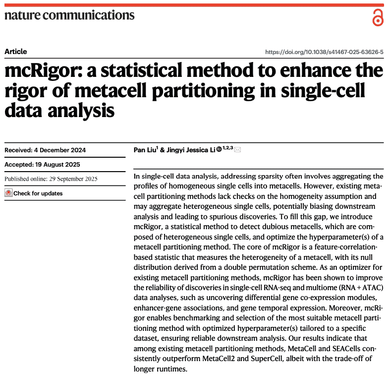
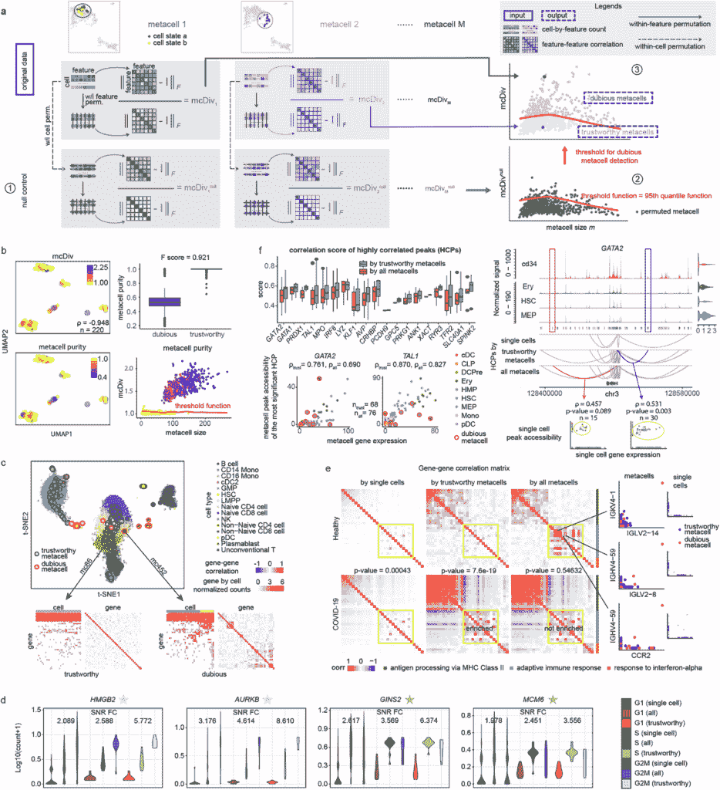
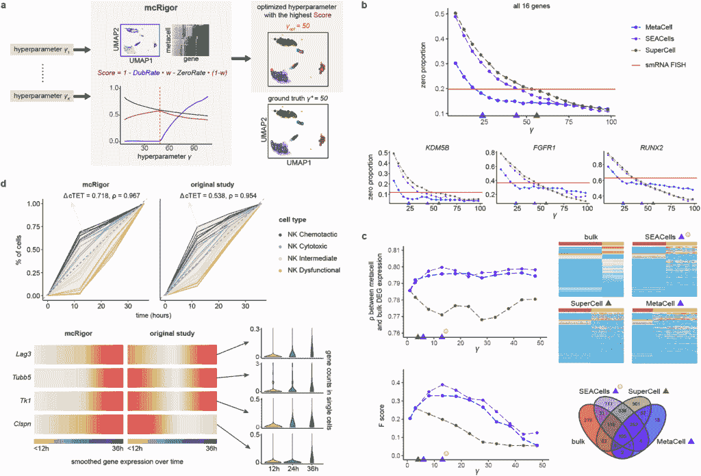

# 统计方法 mcRigor 增强单细胞数据分析中元细胞分区的严谨性

> 原文：[`towardsdatascience.com/statistical-method-mcrigor-enhances-the-rigor-of-metacell-partitioning-in-single-cell-data-analysis/`](https://towardsdatascience.com/statistical-method-mcrigor-enhances-the-rigor-of-metacell-partitioning-in-single-cell-data-analysis/)
> 
> 该文章与加州大学洛杉矶分校和弗雷德·哈钦森癌症中心的博士后研究员刘潘共同撰写。刘潘是 mcRigor *Nature Communications* 文章的第一作者。

近年来，单细胞测序技术快速发展，为揭示细胞多样性、细胞状态的动态变化以及潜在的基因调控机制提供了前所未有的机会。除了广泛使用的单细胞 RNA 测序（scRNA-seq）[^(1,2)](https://paperpile.com/c/GwelwF/M8vl+b79u)，新的方法如单细胞染色质可及性测序（scATAC-seq）[^(3,4)](https://paperpile.com/c/GwelwF/CL2a+R1ZK)和转录组与染色质可及性联合分析（scMultiome）[⁵](https://paperpile.com/c/GwelwF/8zpa)使得在多个组学层面上以单细胞分辨率解析细胞异质性成为可能。然而，这些技术生成的数据通常非常稀疏，这主要是由于每个细胞的测序深度有限，以及不完美的逆转录和非线性扩增，导致高表达基因占据测序能力，使得低表达基因难以检测[⁶](https://paperpile.com/c/GwelwF/G6U9)。

图 1\. **mcRigor 出版物**。

为了缓解数据稀疏和噪声，研究人员提出了**“元细胞”**的概念，其中具有相似表达谱的细胞被聚合成一个单一的代表性单元——元细胞，其表达由其组成细胞的平均表达定义，从而增强信号并减少噪声。然而，现有的元细胞构建方法往往产生显著不同的元细胞分区，并且对超参数设置高度敏感，尤其是平均元细胞大小[⁷](https://paperpile.com/c/GwelwF/5O0T)。这种缺乏一致性使得用户难以确定哪个元细胞分区更可信，以及结果元细胞轮廓保留真实生物信号的程度。因此，下游分析的稳健性受损，元细胞作为跨不同任务和组学模态的通用数据预处理框架的潜力仍然有限。

我们在*Nature Communications*上发表的论文[⁸](https://paperpile.com/c/GwelwF/mVnE)提供了一个基于单细胞测序数据双层模型的元细胞的严格统计定义：上层捕捉真实表达中的生物变异，而下层则模拟从真实表达生成测量表达的过程。在此基础上，我们开发了**mcRigor**，这是一个用于检测给定分区内的可疑元细胞并选择候选方法-超参数配置中的**最佳元细胞分区方法和超参数**的统计框架。

mcRigor 不仅能够检测并移除可疑的元细胞（其扩展版本**mcRigor 两步法**进一步将可疑的元细胞分解成单个细胞，并将它们重新组装成更小、更可靠的细胞），从而提高下游分析（如基因共表达和增强子-基因调控）的可靠性，而且还能够为每个数据集选择最合适的元细胞分区策略。由于其灵活的兼容性，mcRigor 可以轻松应用于单细胞转录组、染色质可及性和多组学数据（图 2）。此外，mcRigor 提供了一个统一的评估标准，用于比较不同的元细胞构建方法，为研究人员在方法选择上提供可靠的指导。

在我们论文[⁸](https://paperpile.com/c/GwelwF/mVnE)的第一部分，我们介绍了 mcRigor 检测可疑元细胞的方法。具体来说，mcRigor 使用基于特征相关性的统计量**mcDiv**来量化每个元细胞内部的异质性，**mcDiv**衡量特征-特征相关性与独立性之间的偏差。其原理是，如果所有成员细胞具有相同的真实表达水平，并且它们之间的观察到的变异纯粹来自测量过程，那么特征应该是近似独立的。然后，mcRigor 使用一种新颖的**双重置换**程序为 mcDiv 构建一个**零分布**，并识别出显著偏离此零分布的元细胞作为可疑的（图 2a）。

在半模拟和真实 PBMC 数据集中，mcRigor 能够准确地区分可信的元细胞与可疑的元细胞（图 2b–c）。我们进一步展示了 mcRigor 在提高多个下游分析可靠性方面的有效性。在细胞系数据分析中，移除可疑的元细胞显著提高了细胞周期标记基因的信噪比（图 2d）。在 COVID-19 与健康对照组数据分析中，mcRigor 消除了由可疑元细胞引起的虚假基因相关性，并揭示了适应性免疫反应模块中更强的共表达（图 2e）。在 scMultiome 数据分析中，mcRigor 增强了增强子-基因关联的可检测性，过滤掉了弱支持的假阳性，同时保留了与单细胞水平观察一致的信号（图 2f）。

图 2. **mcRigor 检测可疑元细胞并纠正 scRNA-seq 和 multiome（RNA+ATAC）数据的下游分析。a，** mcRigor 检测可疑元细胞的方法示意图。**b，** mcRigor 在半合成数据上对 MetaCell 方法分区中的元细胞异质性进行有效评估，并检测到可疑元细胞。**c，** mcRigor 识别的可疑元细胞表现出内部异质性，有时可能表现为异常值，而可信的元细胞保持内部同质性。**d，** mcRigor 增强了细胞系中的细胞周期标记基因表达。**e，** 与健康对照组（顶部行）相比，mcRigor 在 COVID-19 样本（底部行）中揭示了适应性免疫反应基因模块（黄色突出显示）的富集共表达，**f，** 将 mcRigor 应用于 SEACells 论文中的原始元细胞分区，增强了基因调控推断（左侧）并产生了可靠的发现（右侧）。

图 3. **mcRigor 优化了元细胞方法和超参数选择，以适应各种单细胞数据分析。a，** mcRigor 优化元细胞分区的方法示意图，使用*Score*作为优化标准以平衡*DubRate*和*ZeroRate*，以半合成数据的元细胞分区优化为例进行说明。**b，** 线图显示了三种方法（MetaCell、SEACells 和 SuperCell）在不同粒度水平（y）下生成的元细胞分区中的零比例。优化的元细胞分区（三角形）与 smRNA FISH 数据中观察到的零比例（红色线）紧密一致。**c，** mcRigor 优化元细胞方法和超参数选择，用于差异基因表达分析。在**（b）**和**（c）**中，彩色三角形表示 mcRigor 为三种方法选择的最佳 y 值。**d，** mcRigor 优化的元细胞分区比 Zman-seq 研究的原始元细胞分区更好地揭示了时间免疫细胞轨迹 [⁹](https://paperpile.com/c/GwelwF/cIny)。

在我们论文的第二部分[⁸](https://paperpile.com/c/GwelwF/mVnE)中，我们介绍了 mcRigor 评估元细胞分区和优化超参数的方法。通过平衡元细胞的可信度与数据稀疏性，mcRigor 为每个候选分区分配一个总体评估分数，并在所有候选者中自动选择最优的方法-参数配置，从而将方法和参数调整的经验过程转化为数据驱动的自动化决策（图 3a）。

我们展示了这种优化功能在多种下游任务中的实用性。例如，mcRigor 优化后的元细胞的零比例与通过 smRNA-FISH 测量的金标准零比例非常接近，这证明了其区分技术零和生物零的能力（图 3b）。在差异表达分析中，基于 mcRigor 优化后的元细胞的结果与来自 bulk RNA-seq 数据的结果更加吻合，表明提高了可靠性（图 3c）。在时间序列数据中，mcRigor 优化后的元细胞增强了轨迹分辨率，并揭示了与实验证据一致的更清晰的基因表达动态（图 3d）。

mcRigor R 包和在线教程可在[`jsb-ucla.github.io/mcRigor/`](https://jsb-ucla.github.io/mcRigor/)获取

完整论文可在[`www.nature.com/articles/s41467-025-63626-5`](https://www.nature.com/articles/s41467-025-63626-5)获取

**参考文献：**

1\. [皮凯利，等人. 使用 Smart-seq2 从单个细胞中进行全长 RNA 测序。*自然方法* **9**, 171–181 (2014)。](http://paperpile.com/b/GwelwF/M8vl)

2\. [马科斯科，等人. 使用纳升级液滴对单个细胞进行全基因组表达分析。*细胞* **161**, 1202–1214 (2015)。](http://paperpile.com/b/GwelwF/b79u)

3\. [Buenrostro，等人. 单细胞染色质可及性揭示调控变异的原理。*自然* **523**, 486–490 (2015)。](http://paperpile.com/b/GwelwF/CL2a)

4\. [Cusanovich, D. A. 等人. 通过组合细胞索引进行染色质可及性多重单细胞分析。*科学* **348**, 910–914 (2015)。](http://paperpile.com/b/GwelwF/R1ZK)

5\. [曹杰，等人. 在数千个单个细胞中联合分析染色质可及性和基因表达。*科学* **361**, 1380–1385 (2018)。](http://paperpile.com/b/GwelwF/8zpa)

6\. [江瑞，孙天，宋迪，李建杰. 统计学还是生物学：关于 scRNA-seq 数据的零膨胀争议。*基因组生物学* **23**, 31 (2022)。](http://paperpile.com/b/GwelwF/G6U9)

7\. [比洛斯，赫尔奥尔，加布里埃尔，特莱曼，格费勒. 在单细胞基因组数据中构建和分析元细胞。*分子系统生物学* **20**, 744–766 (2024)。](http://paperpile.com/b/GwelwF/5O0T)

8\. [刘鹏 & 李建杰. mcRigor：一种增强单细胞数据分析中元细胞分区严谨性的统计方法。*bioRxiv* (2024) doi:](http://paperpile.com/b/GwelwF/mVnE)[10.1101/2024.10.30.621093](http://dx.doi.org/10.1101/2024.10.30.621093)[.](http://paperpile.com/b/GwelwF/mVnE)

9\. [Kirschenbaum, D. *等.* 时间分辨单细胞转录组学定义了胶质母细胞瘤的免疫轨迹。*细胞* **187**, 149–165.e23 (2024).](http://paperpile.com/b/GwelwF/cIny)
