# 逐步指南：在 Streamlit 中构建和部署具有记忆功能的 LLM 聊天

> 原文：[`towardsdatascience.com/step-by-step-guide-to-build-and-deploy-an-llm-powered-chat-with-memory-in-streamlit/`](https://towardsdatascience.com/step-by-step-guide-to-build-and-deploy-an-llm-powered-chat-with-memory-in-streamlit/)

<mdspan datatext="el1746144864726" class="mdspan-comment">在这篇文章中</mdspan>，我将逐步向您展示如何在 Streamlit 中构建和部署一个由 LLM（Gemini）驱动的聊天，并在 Google Cloud 控制台上监控 API 的使用情况。Streamlit 是一个 Python 框架，它使得将 Python 脚本转换为交互式 Web 应用变得非常容易，几乎不需要前端工作。

最近，我开发了一个项目，[bordAI](https://medium.com/p/c01cdc077bfa) — 一个由 LLM（大型语言模型）驱动的聊天助手，集成了我开发的用于支持刺绣项目的工具。之后，我决定开始这个系列帖子，分享我在过程中学到的技巧。

下面是这篇文章的简要总结：

> *1 到 6 — 项目设置*
> 
> *7 到 13 — 构建聊天*
> 
> *14 到 15— 部署和监控应用*

* * *

## 1. 创建一个新的 GitHub 仓库

前往 [GitHub](https://github.com/) 并创建一个新的仓库。

* * *

## 2. 在本地克隆仓库

→ 在你的终端中执行此命令以克隆它：

```py
git clone <your-repository-url>
```

* * *

## 3. 设置虚拟环境（可选）

虚拟环境就像你电脑上的一个独立空间，你可以在这里安装特定版本的 Python 和库，而不会影响你的整个系统。这很有用，因为不同的项目可能需要同一库的不同版本。

→ 创建虚拟环境：

```py
pyenv virtualenv 3.9.14 chat-streamlit-tutorial
```

→ 激活它：

```py
pyenv activate chat-streamlit-tutorial
```

* * *

## 4. 项目结构

项目结构只是组织项目所有文件和文件夹的一种方式。我们的结构将如下所示：

```py
chat-streamlit-tutorial/
│
├── .env
├── .gitignore
├── app.py
├── functions.py
├── requirements.txt
└── README.md
```

+   `.env`→ 存储 API 密钥的文件（不会推送到 GitHub）

+   **`.gitignore`** → 列出 git 需要忽略的文件或文件夹的文件

+   **`app.py`** → 主 streamlit 应用

+   **`functions.py`** → 用于更好地组织代码的自定义函数

+   **`requirements.txt`** → 列出项目需要的库

+   **`README.md`** → 解释你的项目是关于什么的文件

→ 在你的项目文件夹中执行此操作以创建这些文件：

```py
touch .env .gitignore app.py functions.py requirements.txt
```

→ 在文件 `.gitignore` 中添加：

```py
.env
__pycache__/
```

→ 将以下内容添加到 `requirements.txt`：

```py
streamlit
google-generativeai
python-dotenv
```

→ 安装依赖项：

```py
pip install -r requirements.txt
```

* * *

## 5. 获取 API 密钥

API 密钥就像一个密码，告诉服务你有权使用它。在这个项目中，我们将使用 Gemini API，因为他们有一个免费层，所以你可以免费尝试它，而不必花钱。

+   前往 [`aistudio.google.com/`](https://aistudio.google.com/)

+   创建或登录到你的账户。

+   点击“**创建 API 密钥**”，创建它，并复制它。

如果你只想使用免费层，不要设置账单。在“计划”下应该显示“免费”，就像这里一样：

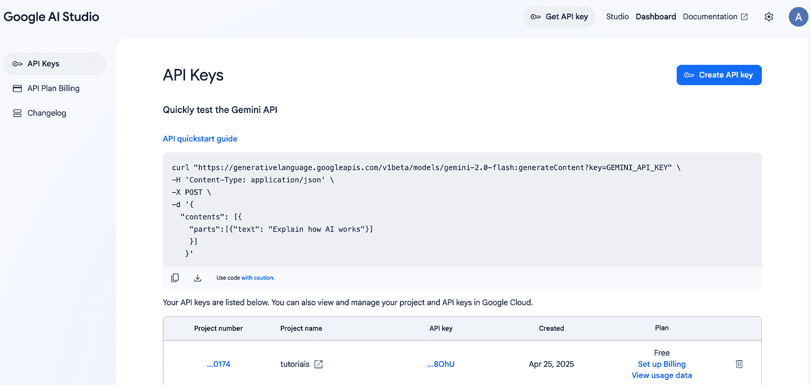

图片由作者提供

我们将在本项目中使用**gemini-2.0-flash**。它提供了一个免费套餐，如以下表格所示：

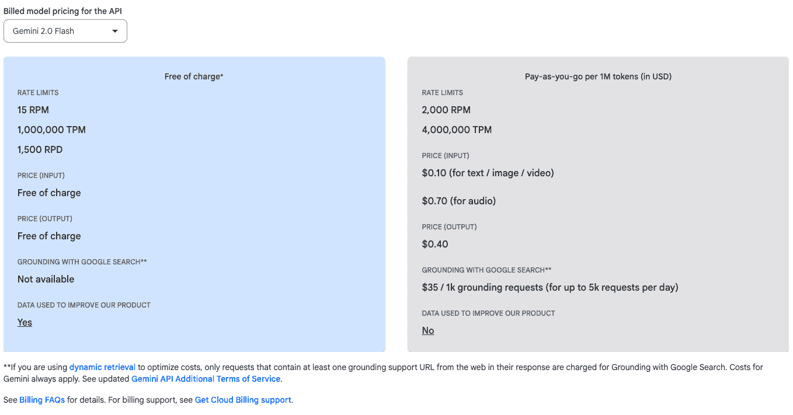

作者截图自[`aistudio.google.com/plan_information`](https://aistudio.google.com/plan_information)

+   15 RPM = 每分钟请求 15 次

+   1,000,000 TPM = 每分钟 1 百万个令牌

+   1,500 RPD = 每天请求 1,500 次

*注意：这些限制截至 2025 年 4 月准确无误，可能会随时间变化。*

提前提醒：如果你正在使用免费套餐，谷歌可能会使用你的提示来改进他们的产品，包括人工审查，因此不建议发送敏感信息。如果你想了解更多关于这一点的内容，请查看这个[链接](https://ai.google.dev/gemini-api/terms)。

* * *

## 6. 存储你的 API 密钥

我们将 API 密钥存储在`.env`文件中。一个**`.env`**文件是一个简单的文本文件，用于存储秘密信息，因此你不需要直接将其写入代码。我们不希望它出现在 GitHub 上，因此我们必须将其添加到我们的**`.gitignore`**文件中。此文件确定在将更改推送到存储库时 git 应实际忽略哪些文件。我在第四部分“项目结构”中已经提到过这一点，但以防你错过了，我在这里再次重复。

这一步非常重要，不要忘记它！

**→ 将此添加到`.gitignore`文件中：**

```py
.env
__pycache__/
```

→ 将 API 密钥添加到`.env`文件中：

```py
API_KEY= "your-api-key"
```

如果你是在本地运行，`.env`文件可以正常工作。然而，如果你稍后使用 Streamlit 部署，你将不得不使用`st.secrets`。这里我包含了一段可以在两种情况下工作的代码。

→ 将此函数添加到你的`functions.py`文件中：

```py
import streamlit as st
import os
from dotenv import load_dotenv

def get_secret(key):
    """
    Get a secret from Streamlit or fallback to .env for local development.

    This allows the app to run both on Streamlit Cloud and locally.
    """
    try:
        return st.secrets[key]
    except Exception:
        load_dotenv()
        return os.getenv(key)
```

**→ 将此添加到你的`app.py`文件中：**

```py
import streamlit as st
import google.generativeai as genai
from functions import get_secret

api_key = get_secret("API_KEY")
```

* * *

## 7. 选择模型

我选择**gemini-2.0-flash**用于这个项目，因为它是一个很好的模型，提供了慷慨的免费套餐。然而，你可以探索其他提供免费套餐的模型选项，并选择你喜欢的。

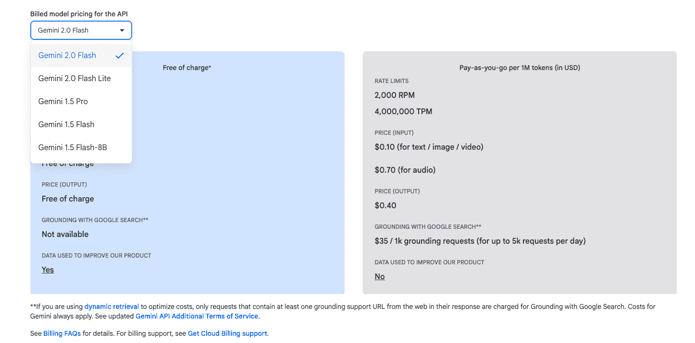

作者截图自[`aistudio.google.com/plan_information`](https://aistudio.google.com/plan_information)

+   **Pro**：为**高质量**输出设计的模型，包括推理和创造力。通常用于复杂任务、问题解决和内容生成。它们是多模态的——这意味着它们可以处理文本、图像、视频和音频作为输入和输出。

+   **Flash**：针对**速度**和**成本效率**设计的模型。与 Pro 相比，在复杂任务中可能提供较低质量的答案。通常用于聊天机器人、助手和实时应用，如自动短语完成。它们是多模态输入，输出目前仅为文本，其他功能正在开发中。

+   **Lite**：比 Flash 更快、更便宜，但功能有所减少，例如它仅支持多模态输入和纯文本输出。其主要特点是比 Flash**更经济**，在成本限制内生成大量文本的理想选择。

这个[链接](https://ai.google.dev/gemini-api/docs/models#gemini-2.0-flash)提供了关于模型及其差异的详细信息。

在这里，我们正在设置模型。只需将“gemini-2.0-flash”替换为你选择的模型。

→ 将以下内容添加到你的 `app.py`：

```py
genai.configure(api_key=api_key)
model = genai.GenerativeModel("gemini-2.0-flash")
```

* * *

## 8. 构建聊天

首先，让我们讨论我们将使用的关键概念：

+   **`st.session_state`**：这就像是你应用的**记忆**。Streamlit 每次发生变化时（例如发送消息或点击按钮）都会从头到尾重新运行你的脚本，所以通常，所有变量都会重置。这允许 Streamlit 在重新运行之间记住值。然而，如果你刷新网页，你将丢失 `session_state`。

+   **`st.chat_message(name, avatar)`**：在界面中创建一个消息的聊天气泡。第一个参数是消息作者的**名称**，可以是 *“user”，“human”，“assistant”，“ai”，或 str*。如果你使用 user/human 和 assistant/ai，它已经具有默认的用户和机器人图标。如果你想改变，可以这样做。更多详情请查看[文档](https://docs.streamlit.io/develop/api-reference/chat/st.chat_message)。

+   **`st.chat_input(placeholder)`**：在底部显示一个输入框，供用户输入消息。它有许多参数，所以我建议你查看[文档](https://docs.streamlit.io/develop/api-reference/chat/st.chat_input)。

首先，我将分别解释代码的每一部分，然后我会展示整个代码。

这个初始步骤初始化了你的 **`session_state`**，应用的“记忆”，以保持会话中所有的消息。

```py
if "chat_history" not in st.session_state:
    st.session_state.chat_history = []
```

接下来，我们将设置第一条默认消息。这是可选的，但我喜欢添加它。如果你适合你的上下文，可以添加一些初始指令。每次 Streamlit 运行页面且 `st.session_state.chat_history` 为空时，它都会将此消息以“assistant”的角色追加到历史记录中。

```py
if not st.session_state.chat_history:
    st.session_state.chat_history.append(("assistant", "Hi! How can I help you?"))
```

在我的应用 bordAI 中，我添加了这条初始信息，以提供应用上下文和说明：

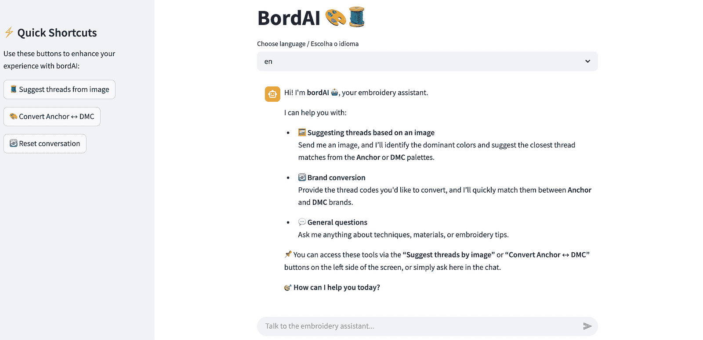

图片由作者提供

对于**用户**部分，第一行创建输入框。如果 `user_message` 包含内容，它将内容写入界面，并将其追加到 `chat_history`。

```py
user_message = st.chat_input("Type your message...")

if user_message:
    st.chat_message("user").write(user_message)
    st.session_state.chat_history.append(("user", user_message))
```

现在，让我们添加**助手**部分：

+   **`system_prompt`** 是发送给模型的提示。你可以用 `user_message` 替换 `full_input`（查看下面的代码）。然而，输出可能不会很精确。提示提供了关于**如何**你想模型表现出的上下文和指令，而不仅仅是**什么**你想它回答。**一个好的提示可以使模型响应更准确、一致，并与你的目标保持一致**。此外，如果不告诉模型应该如何表现，它就很容易受到**提示注入**的攻击。

> **提示注入**是指有人试图操纵模型的提示以改变其行为。一种减轻这种影响的方法是清晰地结构化提示，并在三重引号内限定用户的消息。 *

我们将从简单且不明确的**`system_prompt`**开始，在下一节课中我们将使其变得更好以便比较差异。

+   **`full_input`**：在这里，我们正在组织输入，用三重引号（“””）限定用户消息。这并不能防止所有的提示注入，但这是创建更好和更可靠的交互的一种方法。

+   **`response`**：向 API 发送请求，将输出存储在响应中。

+   **`assistant_reply`**：从响应中提取文本。

最后，我们使用`st.chat_message()`结合`write()`来显示助手的回复，并将其附加到`st.session_state.chat_history`中，就像我们处理用户信息一样。

```py
if user_message:
    st.chat_message("user").write(user_message)
    st.session_state.chat_history.append(("user", user_message))

    system_prompt = f"""
    You are an assistant.
    Be nice and kind in all your responses.
    """
    full_input = f"{system_prompt}\n\nUser message:\n\"\"\"{user_message}\"\"\""

    response = model.generate_content(full_input)
    assistant_reply = response.text

    st.chat_message("assistant").write(assistant_reply)
    st.session_state.chat_history.append(("assistant", assistant_reply))
```

现在让我们一起看看所有这些内容！

→ 将此添加到你的`app.py`中：

```py
import streamlit as st
import google.generativeai as genai
from functions import get_secret

api_key = get_secret("API_KEY")
genai.configure(api_key=api_key)
model = genai.GenerativeModel("gemini-2.0-flash")

if "chat_history" not in st.session_state:
    st.session_state.chat_history = []

if not st.session_state.chat_history:
    st.session_state.chat_history.append(("assistant", "Hi! How can I help you?"))

user_message = st.chat_input("Type your message...")

if user_message:
    st.chat_message("user").write(user_message)
    st.session_state.chat_history.append(("user", user_message))

    system_prompt = f"""
    You are an assistant.
    Be nice and kind in all your responses.
    """
    full_input = f"{system_prompt}\n\nUser message:\n\"\"\"{user_message}\"\"\""

    response = model.generate_content(full_input)
    assistant_reply = response.text

    st.chat_message("assistant").write(assistant_reply)
    st.session_state.chat_history.append(("assistant", assistant_reply))
```

要在本地运行和测试你的应用程序，首先导航到项目文件夹，然后执行以下命令。

→ 在你的终端中执行：

```py
cd chat-streamlit-tutorial
streamlit run app.py
```

**Yay!** 你现在在 Streamlit 中运行了一个聊天程序！

* * *

## 9. 提示工程

提示工程是一个编写指令以从 AI 模型获得最佳可能输出的过程。

提示工程有许多技巧。以下有 5 个提示：

1.  写出清晰和具体的指令。

1.  定义一个角色，期望的行为和助手的规则。

1.  提供适当数量的上下文。

1.  使用分隔符来表示用户输入（如我在第八部分中解释的）。

1.  以指定的格式请求输出。

这些提示可以应用于`system_prompt`或当你编写与聊天助手交互的提示时。

我们当前的系统提示是：

```py
system_prompt = f"""
You are an assistant.
Be nice and kind in all your responses.
"""
```

它非常模糊，并为模型提供不了任何指导。

+   没有明确的方向给助手，它应该提供什么样的帮助

+   没有指定角色或辅助的主题是什么

+   没有关于如何结构化输出的指南

+   没有关于它应该是技术性还是非正式性的上下文

+   缺乏边界

我们可以根据上面的提示来改进我们的提示。以下是一个例子。

→ 在`app.py`中更改`system_prompt`：

```py
system_prompt = f"""
You are a friendly and a programming tutor.
Always explain concepts in a simple and clear way, using examples when possible.
If the user asks something unrelated to programming, politely bring the conversation back to programming topics.
"""
full_input = f"{system_prompt}\n\nUser message:\n\"\"\"{user_message}\"\"\""
```

如果我们用旧的提示问“什么是 python？”它只会给出一个通用的简短答案：

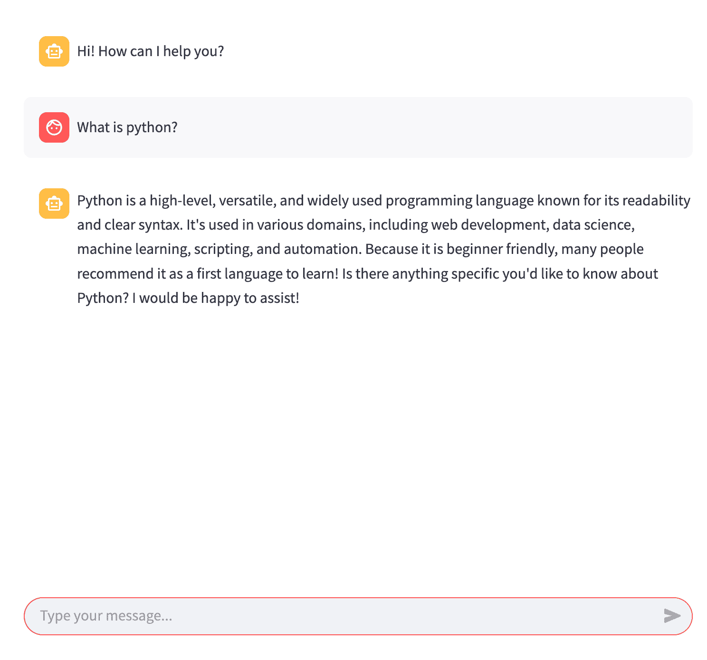

图片由作者提供

使用新的提示，它提供了更详细的响应，并附有示例：

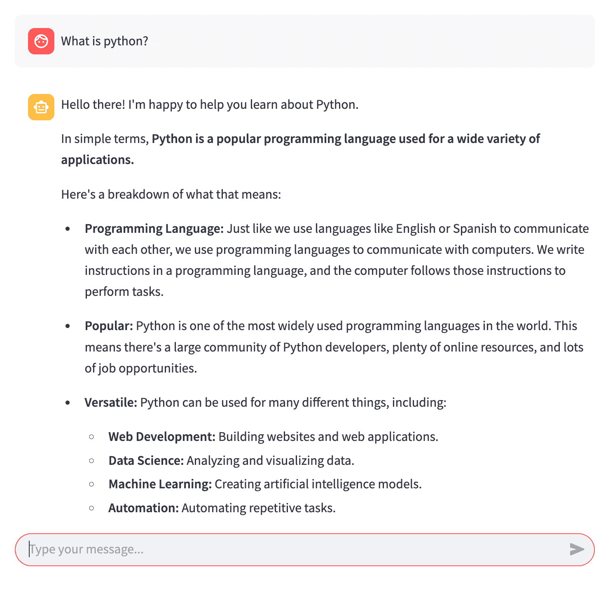

图片由作者提供

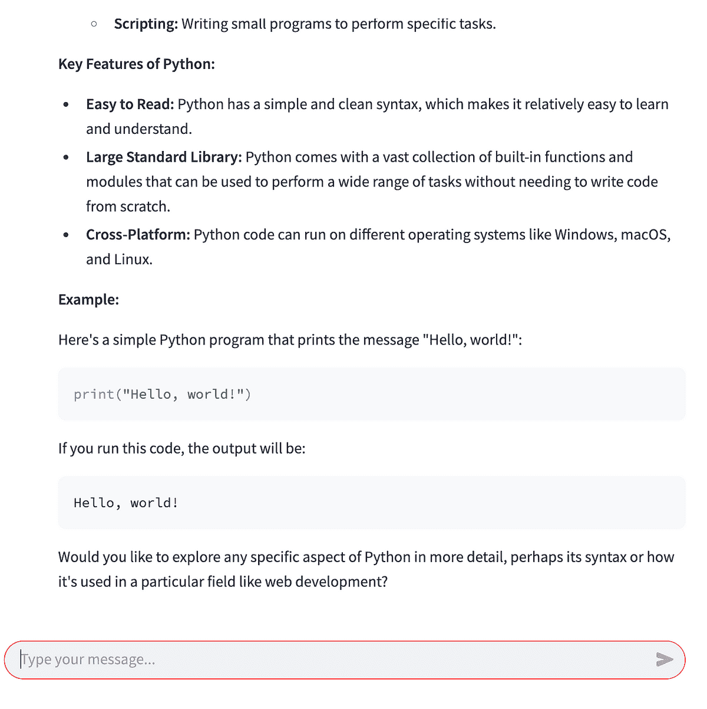

图片由作者提供

尝试自己更改**`system_prompt`**以查看模型输出的差异，并为你的上下文制定理想的提示！

* * *

## 10. 选择生成内容参数

在生成内容时，你可以配置许多参数。在这里，我将演示**`temperature`**和**`maxOutputTokens`**是如何工作的。查看[文档](https://ai.google.dev/api/generate-content#v1beta.GenerationConfig)获取更多详细信息。

+   **`temperature`**：控制输出的随机性，范围从 0 到 2。默认值为 1。较低的值产生更确定的输出，而较高的值产生更具创造性的输出。

+   **`maxOutputTokens`**：输出中可以生成的最大标记数。一个标记大约是四个字符。

要动态更改温度并测试它，你可以创建一个侧边栏滑块来控制这个参数。

→ 将以下内容添加到`app.py`中：

```py
temperature = st.sidebar.slider(
    label="Select the temperature",
    min_value=0.0,
    max_value=2.0,
    value=1.0
)
```

→ 将`response`变量更改为：

```py
response = model.generate_content(
    full_input,
    generation_config={
        "temperature": temperature,
        "max_output_tokens": 1000
    }
)
```

侧边栏将看起来像这样：

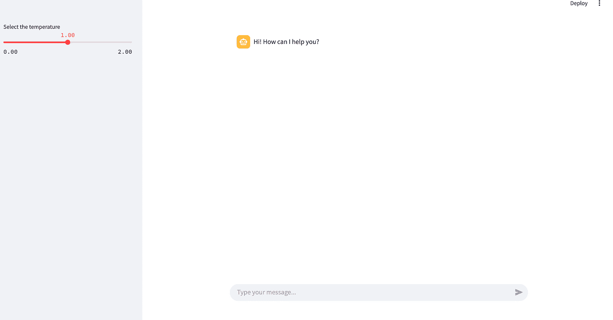

图片由作者提供

尝试调整温度以查看输出如何变化！

* * *

## 11. 显示聊天历史

这一步确保你跟踪所有在聊天中交换的消息，这样你就可以看到聊天历史。如果没有这个，每次你发送消息时，你只会看到助手和用户的最新消息。

这段代码访问了附加到`chat_history`的所有内容，并在界面上显示它。

→ 在`app.py`中的`if user_message`之前添加以下内容：

```py
for role, message in st.session_state.chat_history:
    st.chat_message(role).write(message)
```

现在，一个会话中的所有消息都保存在界面上可见：

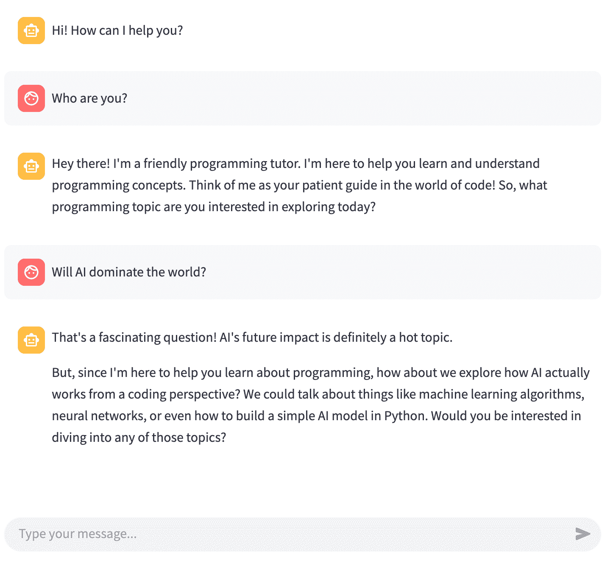

图片由作者提供

Obs：我尝试提出一个非编程问题，助手试图将话题转回编程。我们的提示正在起作用！

* * *

## 12. 使用记忆进行聊天

除了在`chat_history`中存储消息外，我们的模型并不了解我们对话的上下文。它是无状态的，每次交易都是独立的。

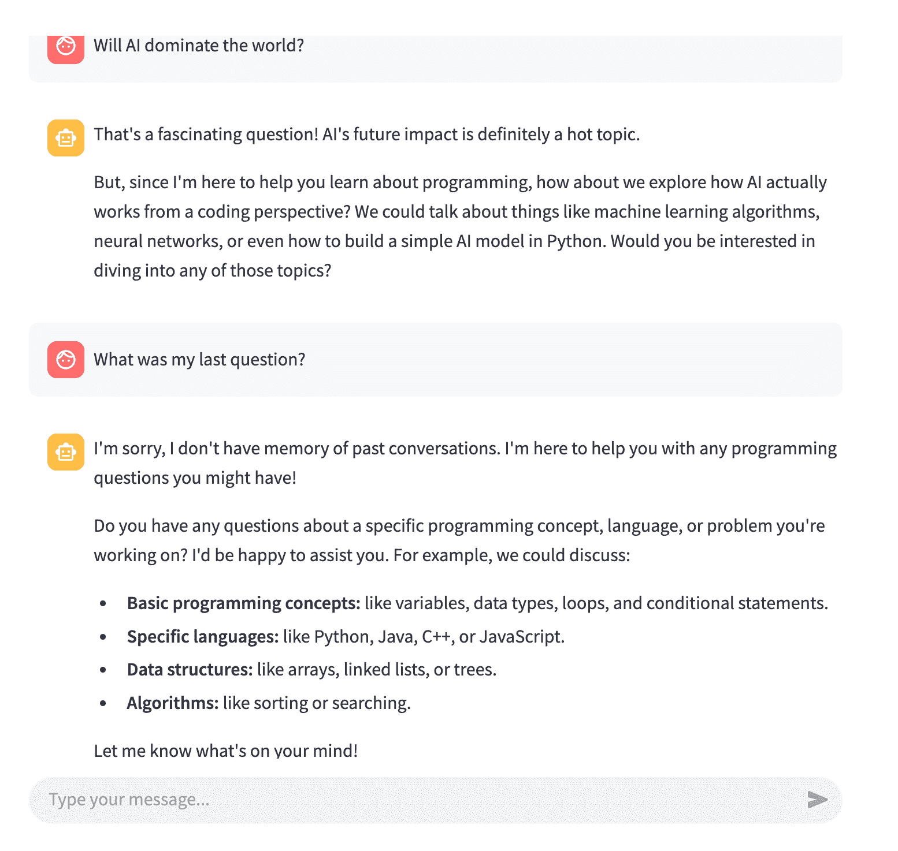

图片由作者提供

为了解决这个问题，我们必须在提示中传递所有这些上下文，以便模型可以参考之前交换的消息。

创建**`context`**，这是一个包含直到那一刻交换的所有消息的列表。最后添加最新的用户消息，这样它就不会在上下文中丢失。

```py
system_prompt = f"""
You are a friendly and knowledgeable programming tutor.
Always explain concepts in a simple and clear way, using examples when possible.
If the user asks something unrelated to programming, politely bring the conversation back to programming topics.
"""
full_input = f"{system_prompt}\n\nUser message:\n\"\"\"{user_message}\"\"\""

context = [
    *[
        {"role": role, "parts": [{"text": msg}]} for role, msg in st.session_state.chat_history
    ],
    {"role": "user", "parts": [{"text": full_input}]}
]

response = model.generate_content(
    context,
    generation_config={
        "temperature": temperature,
        "max_output_tokens": 1000
    }
)
```

现在，我告诉助手我正在做一个分析天气数据的项目。然后我问我的项目主题是什么，它正确地回答了“天气数据分析”，因为它现在有了之前消息的上下文。

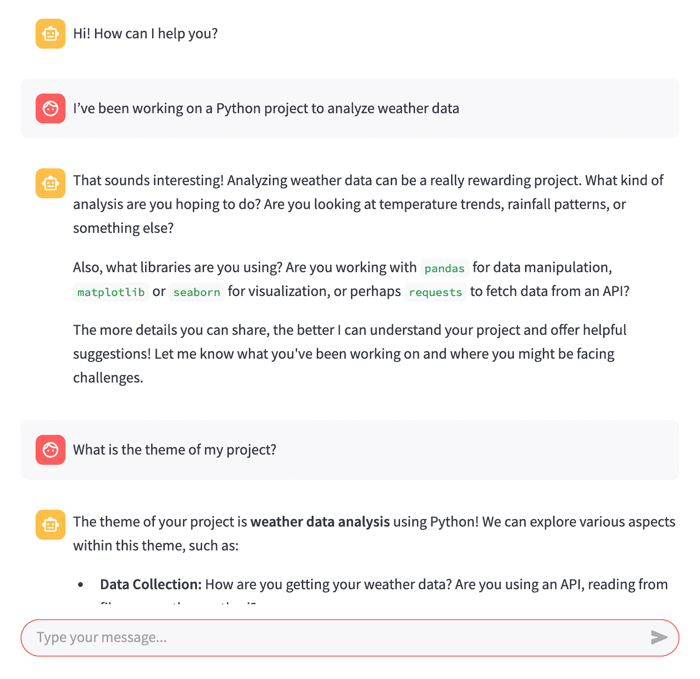

图片由作者提供

如果你的上下文太长，**你可以考虑总结它以节省成本**，因为你发送给 API 的标记越多，你将支付的费用就越多。

* * *

## 13. 创建重置按钮（可选）

我喜欢添加一个重置按钮，以防万一出问题或者用户只想清除对话。

你只需要创建一个函数来将`chat_history`设置为空列表。如果你创建了其他会话状态，也应该在这里将它们设置为 False 或空。

→ 将以下内容添加到`functions.py`中：

```py
def reset_chat():
    """
    Reset the Streamlit chat session state.
    """
    st.session_state.chat_history = []
    st.session_state.example = False # Add others if needed
```

→ 如果你想要它在侧边栏中，请将以下内容添加到`app.py`中：

```py
from functions import get_secret, reset_chat

if st.sidebar.button("Reset chat"):
    reset_chat()
```

它看起来会是这样：

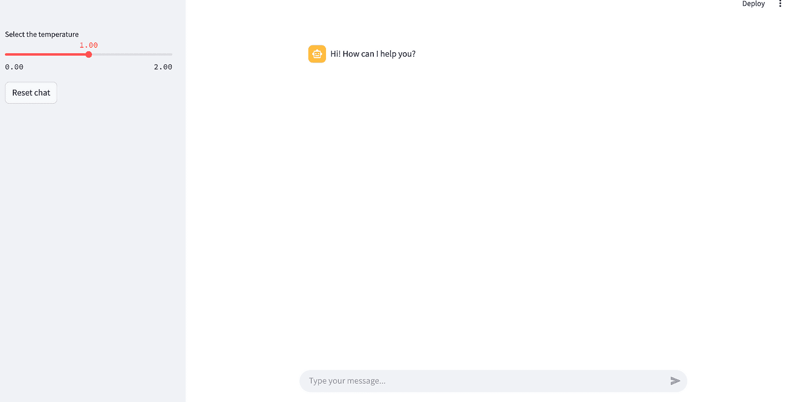

图片由作者提供

所有的东西放在一起：

```py
import streamlit as st
import google.generativeai as genai
from functions import get_secret, reset_chat

api_key = get_secret("API_KEY")
genai.configure(api_key=api_key)
model = genai.GenerativeModel("gemini-2.0-flash")

temperature = st.sidebar.slider(
    label="Select the temperature",
    min_value=0.0,
    max_value=2.0,
    value=1.0
)

if st.sidebar.button("Reset chat"):
    reset_chat()

if "chat_history" not in st.session_state:
    st.session_state.chat_history = []

if not st.session_state.chat_history:
    st.session_state.chat_history.append(("assistant", "Hi! How can I help you?"))

for role, message in st.session_state.chat_history:
    st.chat_message(role).write(message)

user_message = st.chat_input("Type your message...")

if user_message:
    st.chat_message("user").write(user_message)
    st.session_state.chat_history.append(("user", user_message))

    system_prompt = f"""
    You are a friendly and a programming tutor.
    Always explain concepts in a simple and clear way, using examples when possible.
    If the user asks something unrelated to programming, politely bring the conversation back to programming topics.
    """
    full_input = f"{system_prompt}\n\nUser message:\n\"\"\"{user_message}\"\"\""

    context = [
        *[
            {"role": role, "parts": [{"text": msg}]} for role, msg in st.session_state.chat_history
        ],
        {"role": "user", "parts": [{"text": full_input}]}
    ]

    response = model.generate_content(
        context,
        generation_config={
            "temperature": temperature,
            "max_output_tokens": 1000
        }
    )
    assistant_reply = response.text

    st.chat_message("assistant").write(assistant_reply)
    st.session_state.chat_history.append(("assistant", assistant_reply))
```

* * *

## 14. 部署

如果你的仓库是公开的，你可以免费使用 Streamlit 进行部署。

> 确保您在公共存储库上没有 API 密钥。

首先，保存并将您的代码推送到存储库。

→ 在您的终端中执行：

```py
git add .
git commit -m "tutorial chat streamlit"
git push origin main
```

直接推送到 `main` 并不是最佳实践，但由于这是一个简单的教程，我们将为了方便而这样做。

1.  前往您在本地上运行的 streamlit 应用。

1.  点击右上角的“部署”。

1.  在 Streamlit Community Cloud 中，点击“立即部署”。

1.  填写信息。

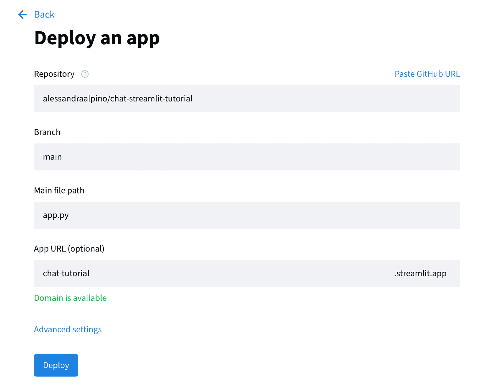

图片由作者提供

5. 点击“**高级设置**”并写入 `API_KEY="your-api-key"`，就像你在 `.env` 文件中做的那样。

6. 点击“部署”。

完成了！如果您愿意，可以查看我的应用 [这里](https://chat-tutorial.streamlit.app/)！🎉

* * *

## 15. 在 Google Console 上监控 API 使用情况

这篇帖子的最后一部分展示了如何在 Google Cloud Console 上监控 API 使用情况。如果您公开部署应用，这很重要，这样您就不会有任何意外。

1.  访问 [Google Cloud Console](https://console.cloud.google.com/).

1.  前往“API 和服务”。

1.  点击“生成语言 API”。

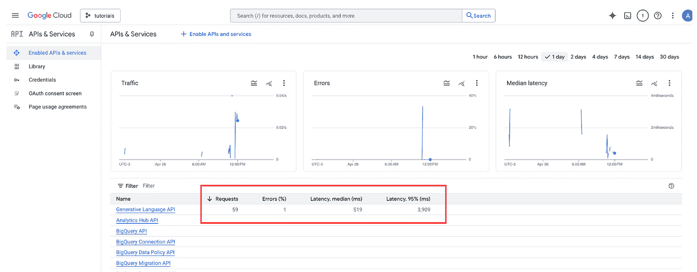

图片由作者提供

+   **请求次数**：您的 API 被调用的次数。在我们的例子中，每次我们运行 **`model.generate_content(context)`** 时都会调用 API。

+   **错误（%**）：请求失败的百分比。错误可能有 **4xx** 代码，这通常是用户/请求者的错误——例如，**400** 表示 **输入错误**，而 **429** 表示您 **太频繁地调用 API**。此外，代码为 **5xx** 的错误通常是系统/服务器的错误，并且不太常见。Google 通常会内部重试或建议几秒后重试——例如，**500** 表示 **内部服务器错误**，**503** 表示 **服务不可用**。

+   **中值延迟，单位：毫秒**：这显示了您的服务响应所需的时间（以毫秒为单位），在 50 分位百分比的响应时间——意味着一半的请求比这个时间快，一半比这个时间慢。这是衡量您服务速度的良好一般指标，回答了问题，“它通常有多快？”

+   **95% 分位延迟，单位：毫秒**：这显示了 95 分位百分比的响应时间——意味着 95% 的请求比这个时间快，只有 5% 比这个时间慢。这有助于识别系统在重负载或较慢情况下如何表现，回答问题，“对于某些用户来说，情况有多糟糕？”

**中值延迟和 p95 延迟之间的快速示例：**

想象一下，您的服务通常在 **200ms** 内响应：

+   中值延迟 = 200ms（很好！）

+   p95 延迟 = 220ms（也很好）

现在在重负载下：

+   中值延迟 = 220ms（仍然看起来不错）

+   p95 延迟 = 1200ms（**不好**）

指标 p95 显示 **5% 的用户等待时间超过 1.2 秒**——这是一个非常糟糕的体验。如果我们只看中值，我们会认为一切正常，但 p95 显示了隐藏的问题。

在“指标”页面继续，你会找到图表，底部是 API 调用的方法。此外，在“配额和系统限制”中，你可以监控 API 使用情况与免费层限制的比较。

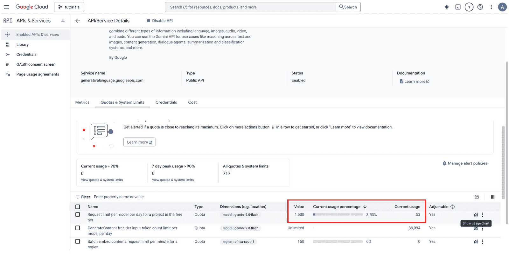

图片由作者提供

点击“显示使用图表”来逐日比较使用情况。

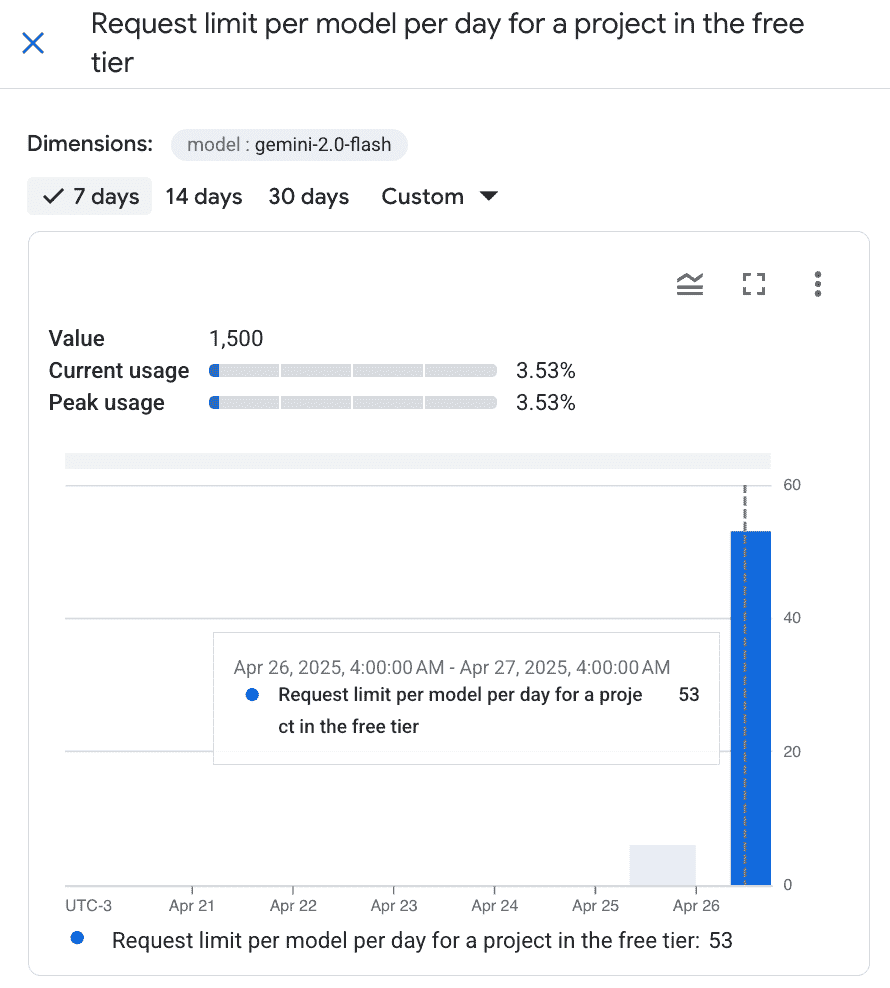

图片由作者提供

* * *

希望你喜欢这个教程。

你可以在我的 [GitHub](https://github.com/alessandraalpino/chat-streamlit-tutorial) 上找到这个项目的所有代码。

我很乐意听听你的想法！请在评论中告诉我你的看法。

关注我：

+   [领英](https://www.linkedin.com/in/alessandraalpino/)

+   [GitHub](https://github.com/alessandraalpino)

+   [YouTube](https://www.youtube.com/@data_match)
