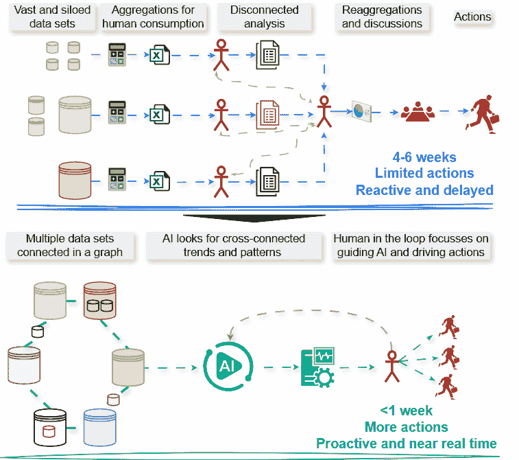
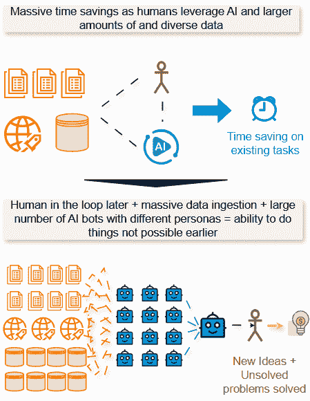
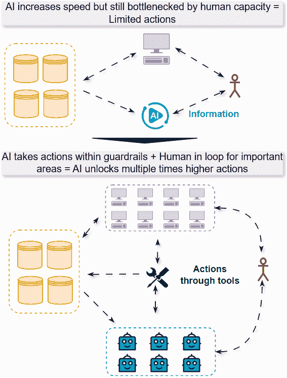

# 停止追逐“效率 AI”。真正的价值在于“机会 AI”。

> 原文：[`towardsdatascience.com/stop-chasing-efficiency-ai-the-real-value-is-in-opportunity-ai/`](https://towardsdatascience.com/stop-chasing-efficiency-ai-the-real-value-is-in-opportunity-ai/)

<mdspan datatext="el1750797209378" class="mdspan-comment">在《财富》500 强公司的董事会中</mdspan>，高管们都在努力解决同一个问题：我们如何利用 AI 的潜力，而不落后于似乎行动更快的一些竞争对手？AI 的讨论呈现了相互冲突的信号：一些专家警告过度炒作，而供应商则将代理平台和垂直 AI 解决方案充斥市场。关于就业岗位流失的预测波动很大，从 50%的白领工作被消除到零岗位损失。

答案在于理解一个大多数领导者都忽视的关键区别：两种截然不同的 AI 采用方法的区别。

**效率 AI**：自动化现有工作流程并提高生产力的安全路径。想想协同飞行员、自动摘要和流程自动化。这些带来可衡量的但渐进的收益，通常在特定任务中提高 10-50%的生产力。这作为一个起点是有意义的，因为它为新技术的实验提供了肥沃的土壤。

**机会 AI**：利用人工智能解决以前不可能解决的问题，并创造全新的商业模式和运营模式。这不仅仅是关于今天你做的事情，只是做得更快。这是关于使今天的方法过时。对于高级领导者来说，这代表着数字时代最大的风险和最大的机会。

## 为什么现有企业容易受到隐形竞争对手的威胁？

对现有企业构成严重威胁的不是来自已知的竞争对手，而是来自尚未存在或目前尚不可见的公司。这些 AI 原生初创公司没有任何遗留负担。

如果你是一家现有企业的领导者，你将面临数百人在一团糟的遗留系统、过时的流程和低效的工作流程中工作的局面。与此同时，一个 AI 原生公司设计系统、流程和组织，完全绕过并跳过这些低效之处。

最初，你的护城河可能看起来难以逾越。但随着时间的推移，AI 原生公司将创造新的、有价值的服务，在这些服务中，利润率更高，而现有企业则被困在低成本、商品化的基础服务中。

考虑一个内部规划团队。在一家成熟的公司中，规划和分析团队花费数周时间从孤立的 ERP 和 CRM 系统中提取数据以构建季度预测。他们使用 AI 共飞行员来加速他们的电子表格工作，这是一种经典的效率游戏，可以减少几天痛苦的过程。与此同时，一个 AI 原生竞争对手可能没有“季度预测周期”。其架构是一个统一的数据图，其中 AI 代理持续监控细节数据。它不是对上一季度的数字做出反应或进行简单的 CAGR 预测，而是识别一个领先指标，例如新功能用户参与度的下降，并立即模拟其未来的收入影响，起草营销资源的重新分配，并将决策分配给相关负责人。这是一个机会游戏。在位者正在优化过去；AI 原生正在自主地作用于未来。

## 如何让传统公司像 AI 原生公司一样思考？

### 1. 将你的架构重写为 AI 原生

随着时间的推移，大多数流程开始服务于流程本身，而原始的目标被层层累积的复杂性所掩盖。与其优化这些片段，不如重新定义最终目标，并像 AI 原生初创公司一样重新设计整个价值链。

传统系统是围绕人类的局限性设计的。我们需要汇总摘要、顺序处理和简化界面。AI 原生架构完全颠覆了这些假设。

以数据分析与规划为例。今天的分析师从多个来源收集数据，将其汇总成可消化的摘要，然后多个分析师协调并生成见解以驱动决策。这产生了三个关键问题：数据位于孤立的孤岛中，分析是反应性的而不是预测性的，每个见解都需要手动综合。

AI 原生的方法翻转了这个顺序。它不是先汇总再分析，而是直接处理细节数据，只为人类消费而汇总。

考虑这些系统如何处理收入下降的不同方式：

传统：销售额下降 15% → 分析师进行调查 → 发现企业流失 → 发现实施问题 → 第四季度管道已受影响

AI 原生：系统监控分解信号 → 检测支持工单情绪下降 → 与实施延迟相关联 → 标记有风险的账户 → 在流失之前触发主动干预

图片由作者提供

传统保险公司是这一差距的例证。他们花费数周时间通过传统系统处理索赔，代理人手动转录电话并填写表格。一个 AI 原生保险公司将部署语音代理，在客户通话中捕捉细节，自动结构化数据，并同时填充多个系统。

几十年来，商业智能承诺连接组织中的各个点，但由于僵化的、预编程的逻辑而失败。AI 代理可以在数百个数据源之间保持上下文，并实时调整分析，以前所未有的规模和速度实现组织智能。

### 2. 将 AI 作为解决以前无法解决的问题的 100 倍乘数

在当前的效率范式下，AI 的乘数效应是 1:1。共飞行员是这一点的完美例子。根据领域不同，生产力提升范围在 10-50%之间。即使 AI 完全取代了用户的工作，这仍然是 1:1 的杠杆，只是更快或更便宜地解决今天已经解决的问题。

我们需要利用 AI 来解决*未解决*的问题。想想需要大量人员共同工作的挑战，但存在两种失败模式：要么没有资金将足够的资源聚集起来，要么随着人员的增加，流程摩擦呈指数级增长，因此问题永远不会得到解决。

这些是 AI 可以提供 100 倍或 1000 倍杠杆的地方。人类专家可以组织 AI 代理团队并行攻击问题，而不是按顺序解决。这改变了复杂问题解决的速度。

**从串行到并行问题解决**。考虑战略远见和创新领域，传统上受限于人类带宽。战略团队可能花费一个季度来模拟两三个潜在的未来。有了 AI，他们可以进行数千次市场模拟，进行竞争反应的战争游戏，模拟地缘政治事件的影响，或测试供应链的弹性，从几个静态场景转变为动态的、充满风险和机遇的地图。这种乘数效应同样适用于创意。与其在房间里限制四个人的头脑风暴会议，不如让 AI 承担多样化的角色，例如一个怀疑的 CFO、一个早期采用者客户、一个谨慎的监管者、一个竞争对手的 CEO，并从每个可想象的角度对新产品想法进行压力测试。这不仅仅是加速现有流程；它通过数量级增加了团队可用的认知多样性，解锁了新的战略思维和创造力的规模。

图片由作者提供

这不是关于让一个人更有效率，而是关于解决由于协调复杂性或资源限制而以前不可能解决的问题。

### 3. 将 AI 从伟大的思想家转变为伟大的实践者

大多数组织仍然将 AI 视为主要的“思想家”：分析数据和提供建议的工具。第三个向量提供了 AI 实际“做”工作的正确工具。这个领域还处于起步阶段，但 AI 实验室在这里投入了巨大的精力。

**自主响应系统**：对于可以强烈定义护栏的非常具体的用例，AI 从顾问转变为执行者。系统不会只是提醒你供应链中断的可能性，而是自动重新路由运输、调整库存水平、更新客户沟通并修改生产计划，所有这些都在人类经理完成初步警报处理之前完成。同样，如果没有提供正确的工具，AI 可以自动进行 Opex 预算的重新分配，以降低风险区域。

图片由作者提供

关键是创建清晰的边界和验证系统。AI 在定义的参数内自主运行，但会升级超出其权限的决定。

### 4. 将 AI 打造为终极孤岛破除者

任何组织面临的最大挑战之一是孤岛。它们存在是因为个人和团体在吸收大量背景和跨职能连接点的能力上受到限制。这两件事 AI 都擅长。

没有任何问题仅仅是销售问题，或者仅仅是产品问题，或者仅仅是财务问题。它们都是商业问题。要解决商业问题，你需要从所有方面进行考虑，建立联系，推断真正的压力点，并设计全面的解决方案。

**跨职能智能**：AI 系统可以同时保持对销售绩效、产品使用模式、客户支持量、财务指标和运营数据的意识。当客户获取成本激增时，与其将其视为营销问题，AI 可以识别根本原因是否在于产品市场匹配、竞争定位、运营效率或市场时机；然后协调所有相关职能的响应。

## 领导者应该从哪里开始？

### 在构建与购买复杂环境中导航

目前的供应商格局在三个关键领域令人失望：表面能力（大多数只是具有基本 AI 摘要的界面）、忽略相互关联企业问题的点解决方案，以及有限的考虑组织细微差别的能力。

然而，集成挑战不容小觑。许多拥有复杂遗留基础设施的行业，如金融服务或保险，需要能够同时从多个系统中读取和写入的复杂中间件。这种集成复杂性通常成为主要护城河，因为基础模型正在实现商品化。

首先，识别高摩擦、高价值流程，并在内部建立专注的能力。这有助于理解价值杠杆、基础设施需求以及所需的组织变革。只有这样，你才能有效地评估外部平台或构建使 AI 转型成为可能的集成层。

**从高价值楔子开始，而不是从广泛的转型开始**

最成功的 AI 原生公司不会试图一夜之间取代整个系统。相反，它们会识别高摩擦、高价值的工作流程，在这些流程中，它们可以在记录系统之前，在创建点捕获数据。

专注于大多数有价值互动通过语音、电子邮件或消息发生的流程。这些代表了捕捉和结构化当前丢失或需要手动输入到旧系统中的数据的机会。例如，客户服务电话可以生成 CRM 系统中从未捕获的见解，或者销售对话可以提供隐藏在通话摘要中的竞争情报。

关键是构建与你的 AI 解决方案并行的集成能力。如果没有对现有系统的无缝读写访问，即使是最复杂的 AI 也只是一个孤立的工具，而不是一个变革性的平台。

### 重新设计角色和培养新的能力

对于许多工作来说，核心任务将发生根本性的变化。金融分析师的主要工作不再是计算数字，而是分析数字，建立联系，并推动战略变革。我们正进入一个建造者和规模执行者的时代，从报告生成转向行动执行。

**全栈式组织系统**：我们正朝着无功能性和全栈式组织系统迈进。想象一下，团队和个人拥有整个业务问题的全栈，而不仅仅是功能性的小部分。AI 代理成为功能性工作者；人类则成为这些代理的指挥者和老板。

**AI 系统设计师**：对于 LLM 来说，在每一个组织环境中完美地自我设计将是一项艰巨的任务。因此，理解公司数据和约束的分析师成为 AI 系统设计师。他们定义 AI 代理系统、数据源、工具和验证标准。在这些约束下，代理开始工作。

这些专业人士管理着数十个这样的系统——非常类似于今天管理多个 Excel 工作簿和表格，但功能强大得多。

### 重新构想你的经济模式

准备从重运营支出（OpEx）向更类似资本支出（CapEx）的环境的根本转变。在技术上进行资本支出，在构建随时间摊销的代理上进行资本支出。

**数字劳动力作为一种资产类别**：“数字劳动力”——作为工人的 AI 代理——可能成为一个新的巨大资产类别。你不再需要持续租赁人力，而是投资于构建随着时间的推移而改进的智能系统。与需要持续薪水的员工不同，这些数字工作者代表了资本投资，其规模可以扩大，而成本增加不成比例。

这创造了全新的竞争动态。那些早期投资于复杂 AI 系统的组织，随着他们的数字工作队伍变得越来越有能力，将建立起累积优势。

## 定义你未来的选择

战略性人工智能定位的窗口正在迅速缩小。专注于仅追求效率提升的公司会发现，他们会被那些拥抱机会思维竞争对手所超越。变化的步伐意味着等待六个月，竞争对手就能构建出用例、基础设施和政策，从而创造可持续的优势。

工作未来的影响因职能和行业而异，重复性、知识密集型行业面临最大的转型潜力。对于高级领导者来说，战略上的必要性是明确的。

问题的焦点不再是“人工智能如何让我们更快？”决定未来十年竞争优势的问题将是：“我们现在能做什么，而以前却不可能做到？”那些现在就采取行动构建人工智能原生能力的企业将创造可持续的护城河。而那些等待的企业将发现自己正在竞争同质化的服务，而人工智能原生公司则捕捉到最有价值的机遇。

* * *

Shreshth Sharma 是一位拥有 15 年领导和管理执行经验的商业策略、运营和数据高管，曾在管理咨询（BCG 的专家级顾问）、媒体和娱乐（索尼影业的副总裁）以及技术（Twilio 的高级总监）等行业工作。您可以在[LinkedIn](https://www.linkedin.com/in/shreshth)上关注他。
